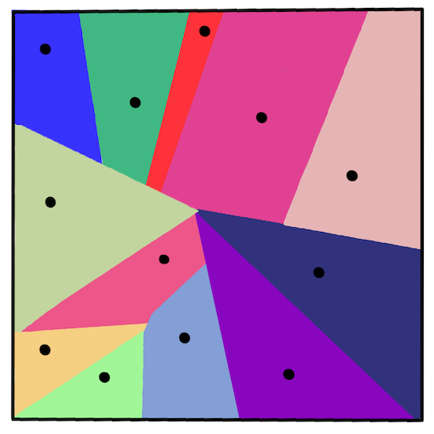
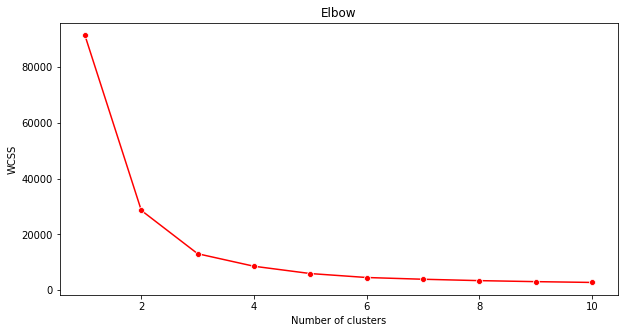

<!--
CO_OP_TRANSLATOR_METADATA:
{
  "original_hash": "085d571097d201810720df4cd379f8c2",
  "translation_date": "2025-08-29T17:18:00+00:00",
  "source_file": "5-Clustering/2-K-Means/README.md",
  "language_code": "pa"
}
-->
# ਕੇ-ਮੀਨਜ਼ ਕਲੱਸਟਰਿੰਗ

## [ਪ੍ਰੀ-ਲੈਕਚਰ ਕਵਿਜ਼](https://gray-sand-07a10f403.1.azurestaticapps.net/quiz/29/)

ਇਸ ਪਾਠ ਵਿੱਚ, ਤੁਸੀਂ ਸਿੱਖੋਗੇ ਕਿ ਕਿਵੇਂ Scikit-learn ਅਤੇ ਨਾਈਜੀਰੀਆ ਦੇ ਮਿਊਜ਼ਿਕ ਡਾਟਾਸੈਟ ਦੀ ਵਰਤੋਂ ਕਰਕੇ ਕਲੱਸਟਰ ਬਣਾਉਣੇ ਹਨ। ਅਸੀਂ ਕੇ-ਮੀਨਜ਼ ਕਲੱਸਟਰਿੰਗ ਦੇ ਬੁਨਿਆਦੀ ਪਾਸੇ ਕਵਰ ਕਰਾਂਗੇ। ਯਾਦ ਰੱਖੋ ਕਿ, ਜਿਵੇਂ ਤੁਸੀਂ ਪਿਛਲੇ ਪਾਠ ਵਿੱਚ ਸਿੱਖਿਆ ਸੀ, ਕਲੱਸਟਰਾਂ ਨਾਲ ਕੰਮ ਕਰਨ ਦੇ ਕਈ ਤਰੀਕੇ ਹਨ ਅਤੇ ਤੁਸੀਂ ਜੋ ਵਿਧੀ ਵਰਤਦੇ ਹੋ ਉਹ ਤੁਹਾਡੇ ਡਾਟਾ 'ਤੇ ਨਿਰਭਰ ਕਰਦੀ ਹੈ। ਅਸੀਂ ਕੇ-ਮੀਨਜ਼ ਦੀ ਕੋਸ਼ਿਸ਼ ਕਰਾਂਗੇ ਕਿਉਂਕਿ ਇਹ ਸਭ ਤੋਂ ਆਮ ਕਲੱਸਟਰਿੰਗ ਤਕਨੀਕ ਹੈ। ਚਲੋ ਸ਼ੁਰੂ ਕਰੀਏ!

ਤੁਸੀਂ ਜਿਨ ਸ਼ਬਦਾਂ ਬਾਰੇ ਸਿੱਖੋਗੇ:

- ਸਿਲਹੂਟ ਸਕੋਰਿੰਗ  
- ਐਲਬੋ ਵਿਧੀ  
- ਇਨਰਸ਼ੀਆ  
- ਵੈਰੀਅੰਸ  

## ਪਰਿਚਯ

[ਕੇ-ਮੀਨਜ਼ ਕਲੱਸਟਰਿੰਗ](https://wikipedia.org/wiki/K-means_clustering) ਸਿਗਨਲ ਪ੍ਰੋਸੈਸਿੰਗ ਦੇ ਖੇਤਰ ਤੋਂ ਲਿਆ ਗਿਆ ਇੱਕ ਤਰੀਕਾ ਹੈ। ਇਹ ਡਾਟਾ ਦੇ ਸਮੂਹਾਂ ਨੂੰ 'k' ਕਲੱਸਟਰਾਂ ਵਿੱਚ ਵੰਡਣ ਅਤੇ ਵਿਭਾਜਿਤ ਕਰਨ ਲਈ ਵਰਤਿਆ ਜਾਂਦਾ ਹੈ। ਇਹ ਇੱਕ ਸ੍ਰਿੰਖਲਾ ਦੇ ਅਧੀਨ ਡਾਟਾ ਪੌਇੰਟ ਨੂੰ ਉਸਦੇ ਸਭ ਤੋਂ ਨੇੜੇ 'ਮੀਨ' ਜਾਂ ਕਲੱਸਟਰ ਦੇ ਕੇਂਦਰੀ ਬਿੰਦੂ ਦੇ ਆਧਾਰ 'ਤੇ ਸਮੂਹਬੱਧ ਕਰਦਾ ਹੈ।

ਕਲੱਸਟਰਾਂ ਨੂੰ [ਵੋਰੋਨੋਈ ਡਾਇਗ੍ਰਾਮ](https://wikipedia.org/wiki/Voronoi_diagram) ਵਜੋਂ ਦਿਖਾਇਆ ਜਾ ਸਕਦਾ ਹੈ, ਜੋ ਇੱਕ ਬਿੰਦੂ (ਜਾਂ 'ਬੀਜ') ਅਤੇ ਇਸਦੇ ਸੰਬੰਧਿਤ ਖੇਤਰ ਨੂੰ ਸ਼ਾਮਲ ਕਰਦੇ ਹਨ।



> ਇਨਫੋਗ੍ਰਾਫਿਕ [Jen Looper](https://twitter.com/jenlooper) ਦੁਆਰਾ

ਕੇ-ਮੀਨਜ਼ ਕਲੱਸਟਰਿੰਗ ਪ੍ਰਕਿਰਿਆ [ਤਿੰਨ-ਕਦਮ ਦੀ ਪ੍ਰਕਿਰਿਆ ਵਿੱਚ ਚਲਦੀ ਹੈ](https://scikit-learn.org/stable/modules/clustering.html#k-means):

1. ਐਲਗੋਰਿਥਮ ਡਾਟਾਸੈਟ ਤੋਂ k-ਗਿਣਤੀ ਕੇਂਦਰੀ ਬਿੰਦੂ ਚੁਣਦਾ ਹੈ। ਇਸ ਤੋਂ ਬਾਅਦ ਇਹ ਲੂਪ ਕਰਦਾ ਹੈ:
    1. ਇਹ ਹਰ ਨਮੂਨੇ ਨੂੰ ਸਭ ਤੋਂ ਨੇੜੇ ਸੈਂਟਰਾਇਡ ਨੂੰ ਅਲਾਟ ਕਰਦਾ ਹੈ।
    2. ਇਹ ਪਿਛਲੇ ਸੈਂਟਰਾਇਡਾਂ ਨੂੰ ਅਲਾਟ ਕੀਤੇ ਗਏ ਸਾਰੇ ਨਮੂਨਿਆਂ ਦੇ ਮੀਨ ਮੁੱਲ ਨੂੰ ਲੈ ਕੇ ਨਵੇਂ ਸੈਂਟਰਾਇਡ ਬਣਾਉਂਦਾ ਹੈ।
    3. ਫਿਰ, ਇਹ ਨਵੇਂ ਅਤੇ ਪੁਰਾਣੇ ਸੈਂਟਰਾਇਡਾਂ ਦੇ ਵਿਚਕਾਰ ਅੰਤਰ ਦੀ ਗਣਨਾ ਕਰਦਾ ਹੈ ਅਤੇ ਦੁਹਰਾਉਂਦਾ ਹੈ ਜਦੋਂ ਤੱਕ ਸੈਂਟਰਾਇਡ ਸਥਿਰ ਨਹੀਂ ਹੋ ਜਾਂਦੇ।

ਕੇ-ਮੀਨਜ਼ ਦੀ ਵਰਤੋਂ ਕਰਨ ਦਾ ਇੱਕ ਨੁਕਸਾਨ ਇਹ ਹੈ ਕਿ ਤੁਹਾਨੂੰ 'k', ਯਾਨੀ ਸੈਂਟਰਾਇਡਾਂ ਦੀ ਗਿਣਤੀ ਸਥਾਪਿਤ ਕਰਨੀ ਪਵੇਗੀ। ਖੁਸ਼ਕਿਸਮਤੀ ਨਾਲ, 'ਐਲਬੋ ਵਿਧੀ' 'k' ਲਈ ਇੱਕ ਚੰਗੀ ਸ਼ੁਰੂਆਤੀ ਮੁੱਲ ਦਾ ਅੰਦਾਜ਼ਾ ਲਗਾਉਣ ਵਿੱਚ ਮਦਦ ਕਰਦੀ ਹੈ। ਤੁਸੀਂ ਇਸਨੂੰ ਇੱਕ ਮਿੰਟ ਵਿੱਚ ਅਜ਼ਮਾਓਗੇ।

## ਪੂਰਵ ਸ਼ਰਤ

ਤੁਸੀਂ ਇਸ ਪਾਠ ਦੇ [_notebook.ipynb_](https://github.com/microsoft/ML-For-Beginners/blob/main/5-Clustering/2-K-Means/notebook.ipynb) ਫਾਈਲ ਵਿੱਚ ਕੰਮ ਕਰੋਗੇ ਜਿਸ ਵਿੱਚ ਪਿਛਲੇ ਪਾਠ ਵਿੱਚ ਕੀਤੇ ਡਾਟਾ ਇੰਪੋਰਟ ਅਤੇ ਪ੍ਰਾਰੰਭਿਕ ਸਫਾਈ ਸ਼ਾਮਲ ਹੈ।

## ਅਭਿਆਸ - ਤਿਆਰੀ

ਗਾਣਿਆਂ ਦੇ ਡਾਟਾ ਨੂੰ ਮੁੜ ਦੇਖੋ।

1. ਹਰ ਕਾਲਮ ਲਈ `boxplot()` ਕਾਲ ਕਰਕੇ ਇੱਕ ਬਾਕਸਪਲਾਟ ਬਣਾਓ:

    ```python
    plt.figure(figsize=(20,20), dpi=200)
    
    plt.subplot(4,3,1)
    sns.boxplot(x = 'popularity', data = df)
    
    plt.subplot(4,3,2)
    sns.boxplot(x = 'acousticness', data = df)
    
    plt.subplot(4,3,3)
    sns.boxplot(x = 'energy', data = df)
    
    plt.subplot(4,3,4)
    sns.boxplot(x = 'instrumentalness', data = df)
    
    plt.subplot(4,3,5)
    sns.boxplot(x = 'liveness', data = df)
    
    plt.subplot(4,3,6)
    sns.boxplot(x = 'loudness', data = df)
    
    plt.subplot(4,3,7)
    sns.boxplot(x = 'speechiness', data = df)
    
    plt.subplot(4,3,8)
    sns.boxplot(x = 'tempo', data = df)
    
    plt.subplot(4,3,9)
    sns.boxplot(x = 'time_signature', data = df)
    
    plt.subplot(4,3,10)
    sns.boxplot(x = 'danceability', data = df)
    
    plt.subplot(4,3,11)
    sns.boxplot(x = 'length', data = df)
    
    plt.subplot(4,3,12)
    sns.boxplot(x = 'release_date', data = df)
    ```

    ਇਹ ਡਾਟਾ ਕੁਝ ਸ਼ੋਰ ਵਾਲਾ ਹੈ: ਹਰ ਕਾਲਮ ਨੂੰ ਬਾਕਸਪਲਾਟ ਵਜੋਂ ਦੇਖ ਕੇ, ਤੁਸੀਂ ਆਊਟਲਾਇਰਜ਼ ਨੂੰ ਦੇਖ ਸਕਦੇ ਹੋ।

    

ਤੁਸੀਂ ਡਾਟਾਸੈਟ ਵਿੱਚੋਂ ਇਹ ਆਊਟਲਾਇਰਜ਼ ਹਟਾ ਸਕਦੇ ਹੋ, ਪਰ ਇਸ ਨਾਲ ਡਾਟਾ ਕਾਫ਼ੀ ਘੱਟ ਹੋ ਜਾਵੇਗਾ।

1. ਫਿਲਹਾਲ, ਉਹ ਕਾਲਮ ਚੁਣੋ ਜੋ ਤੁਸੀਂ ਆਪਣੇ ਕਲੱਸਟਰਿੰਗ ਅਭਿਆਸ ਲਈ ਵਰਤੋਗੇ। ਉਹਨਾਂ ਨੂੰ ਚੁਣੋ ਜਿਨ੍ਹਾਂ ਦੀ ਰੇਂਜ ਇੱਕ ਜੇਹੀ ਹੈ ਅਤੇ `artist_top_genre` ਕਾਲਮ ਨੂੰ ਨੰਬਰਿਕ ਡਾਟਾ ਵਜੋਂ ਐਨਕੋਡ ਕਰੋ:

    ```python
    from sklearn.preprocessing import LabelEncoder
    le = LabelEncoder()
    
    X = df.loc[:, ('artist_top_genre','popularity','danceability','acousticness','loudness','energy')]
    
    y = df['artist_top_genre']
    
    X['artist_top_genre'] = le.fit_transform(X['artist_top_genre'])
    
    y = le.transform(y)
    ```

1. ਹੁਣ ਤੁਹਾਨੂੰ ਇਹ ਚੁਣਨਾ ਪਵੇਗਾ ਕਿ ਕਿੰਨੇ ਕਲੱਸਟਰ ਟਾਰਗਟ ਕਰਨੇ ਹਨ। ਤੁਹਾਨੂੰ ਪਤਾ ਹੈ ਕਿ ਡਾਟਾਸੈਟ ਵਿੱਚੋਂ 3 ਗਾਣੇ ਦੇ ਜਾਨਰ ਨਿਕਲੇ ਹਨ, ਤਾਂ ਆਓ 3 ਦੀ ਕੋਸ਼ਿਸ਼ ਕਰੀਏ:

    ```python
    from sklearn.cluster import KMeans
    
    nclusters = 3 
    seed = 0
    
    km = KMeans(n_clusters=nclusters, random_state=seed)
    km.fit(X)
    
    # Predict the cluster for each data point
    
    y_cluster_kmeans = km.predict(X)
    y_cluster_kmeans
    ```

ਤੁਹਾਨੂੰ ਇੱਕ ਐਰੇ ਪ੍ਰਿੰਟ ਕੀਤਾ ਹੋਇਆ ਦਿਖਾਈ ਦੇਵੇਗਾ ਜਿਸ ਵਿੱਚ ਡਾਟਾਫਰੇਮ ਦੀ ਹਰ ਪੰਗਤੀ ਲਈ ਅਨੁਮਾਨਿਤ ਕਲੱਸਟਰ (0, 1, ਜਾਂ 2) ਸ਼ਾਮਲ ਹਨ।

1. ਇਸ ਐਰੇ ਦੀ ਵਰਤੋਂ ਕਰਕੇ ਇੱਕ 'ਸਿਲਹੂਟ ਸਕੋਰ' ਦੀ ਗਣਨਾ ਕਰੋ:

    ```python
    from sklearn import metrics
    score = metrics.silhouette_score(X, y_cluster_kmeans)
    score
    ```

## ਸਿਲਹੂਟ ਸਕੋਰ

ਸਿਲਹੂਟ ਸਕੋਰ 1 ਦੇ ਨੇੜੇ ਹੋਣਾ ਚਾਹੀਦਾ ਹੈ। ਇਹ ਸਕੋਰ -1 ਤੋਂ 1 ਤੱਕ ਵੱਖ-ਵੱਖ ਹੁੰਦਾ ਹੈ, ਅਤੇ ਜੇ ਸਕੋਰ 1 ਹੈ, ਤਾਂ ਕਲੱਸਟਰ ਸੰਘਣੇ ਅਤੇ ਹੋਰ ਕਲੱਸਟਰਾਂ ਤੋਂ ਚੰਗੀ ਤਰ੍ਹਾਂ ਵੱਖਰੇ ਹਨ। 0 ਦੇ ਨੇੜੇ ਮੁੱਲ ਉਹ ਕਲੱਸਟਰ ਦਰਸਾਉਂਦਾ ਹੈ ਜੋ ਇੱਕ ਦੂਜੇ ਦੇ ਨੇੜੇ ਹਨ ਅਤੇ ਜਿਨ੍ਹਾਂ ਦੇ ਨਮੂਨੇ ਪੜੋਸੀ ਕਲੱਸਟਰਾਂ ਦੇ ਫੈਸਲੇ ਦੀ ਸੀਮਾ ਦੇ ਬਹੁਤ ਨੇੜੇ ਹਨ। [(ਸਰੋਤ)](https://dzone.com/articles/kmeans-silhouette-score-explained-with-python-exam)

ਸਾਡਾ ਸਕੋਰ **.53** ਹੈ, ਜੋ ਬਿਲਕੁਲ ਵਿਚਕਾਰ ਹੈ। ਇਹ ਦਰਸਾਉਂਦਾ ਹੈ ਕਿ ਸਾਡਾ ਡਾਟਾ ਇਸ ਕਿਸਮ ਦੀ ਕਲੱਸਟਰਿੰਗ ਲਈ ਖਾਸ ਤੌਰ 'ਤੇ ਉਚਿਤ ਨਹੀਂ ਹੈ, ਪਰ ਚਲੋ ਅੱਗੇ ਵਧਦੇ ਹਾਂ।

### ਅਭਿਆਸ - ਮਾਡਲ ਬਣਾਉਣਾ

1. `KMeans` ਨੂੰ ਇੰਪੋਰਟ ਕਰੋ ਅਤੇ ਕਲੱਸਟਰਿੰਗ ਪ੍ਰਕਿਰਿਆ ਸ਼ੁਰੂ ਕਰੋ।

    ```python
    from sklearn.cluster import KMeans
    wcss = []
    
    for i in range(1, 11):
        kmeans = KMeans(n_clusters = i, init = 'k-means++', random_state = 42)
        kmeans.fit(X)
        wcss.append(kmeans.inertia_)
    
    ```

    ਇੱਥੇ ਕੁਝ ਹਿੱਸੇ ਹਨ ਜੋ ਵਿਆਖਿਆ ਦੇ ਯੋਗ ਹਨ।

    > 🎓 ਰੇਂਜ: ਇਹ ਕਲੱਸਟਰਿੰਗ ਪ੍ਰਕਿਰਿਆ ਦੇ ਇਟਰੇਸ਼ਨ ਹਨ

    > 🎓 random_state: "ਸੈਂਟਰਾਇਡ ਸ਼ੁਰੂਆਤ ਲਈ ਰੈਂਡਮ ਨੰਬਰ ਜਨਰੇਸ਼ਨ ਨੂੰ ਨਿਰਧਾਰਤ ਕਰਦਾ ਹੈ।" [ਸਰੋਤ](https://scikit-learn.org/stable/modules/generated/sklearn.cluster.KMeans.html#sklearn.cluster.KMeans)

    > 🎓 WCSS: "ਵਿਥਿਨ-ਕਲੱਸਟਰ ਸਮਸ ਆਫ਼ ਸਕਵੇਅਰ" ਕਲੱਸਟਰ ਸੈਂਟਰਾਇਡ ਦੇ ਨਾਲ ਕਲੱਸਟਰ ਦੇ ਅੰਦਰ ਸਾਰੇ ਬਿੰਦੂਆਂ ਦੀ ਸਕਵੇਅਰਡ ਔਸਤ ਦੂਰੀ ਨੂੰ ਮਾਪਦਾ ਹੈ। [ਸਰੋਤ](https://medium.com/@ODSC/unsupervised-learning-evaluating-clusters-bd47eed175ce)

    > 🎓 ਇਨਰਸ਼ੀਆ: ਕੇ-ਮੀਨਜ਼ ਐਲਗੋਰਿਥਮ 'ਇਨਰਸ਼ੀਆ' ਨੂੰ ਘਟਾਉਣ ਲਈ ਸੈਂਟਰਾਇਡ ਚੁਣਨ ਦੀ ਕੋਸ਼ਿਸ਼ ਕਰਦਾ ਹੈ, "ਇਹ ਮਾਪਦਾ ਹੈ ਕਿ ਕਲੱਸਟਰ ਅੰਦਰੂਨੀ ਤੌਰ 'ਤੇ ਕਿੰਨੇ ਸੰਗਠਿਤ ਹਨ।" [ਸਰੋਤ](https://scikit-learn.org/stable/modules/clustering.html)। ਇਹ ਮੁੱਲ wcss ਵੈਰੀਏਬਲ ਵਿੱਚ ਹਰ ਇਟਰੇਸ਼ਨ 'ਤੇ ਸ਼ਾਮਲ ਕੀਤਾ ਜਾਂਦਾ ਹੈ।

    > 🎓 k-means++: [Scikit-learn](https://scikit-learn.org/stable/modules/clustering.html#k-means) ਵਿੱਚ ਤੁਸੀਂ 'k-means++' ਅਪਟਿਮਾਈਜ਼ੇਸ਼ਨ ਦੀ ਵਰਤੋਂ ਕਰ ਸਕਦੇ ਹੋ, ਜੋ "ਸੈਂਟਰਾਇਡਾਂ ਨੂੰ (ਆਮ ਤੌਰ 'ਤੇ) ਇੱਕ ਦੂਜੇ ਤੋਂ ਦੂਰ ਸ਼ੁਰੂਆਤ ਕਰਨ ਲਈ ਸ਼ੁਰੂ ਕਰਦਾ ਹੈ, ਜਿਸ ਨਾਲ ਸੰਭਵਤ: ਰੈਂਡਮ ਸ਼ੁਰੂਆਤ ਨਾਲੋਂ ਚੰਗੇ ਨਤੀਜੇ ਮਿਲਦੇ ਹਨ।"

### ਐਲਬੋ ਵਿਧੀ

ਪਿਛਲੇ ਪਾਠ ਵਿੱਚ, ਤੁਸੀਂ ਅਨੁਮਾਨ ਲਗਾਇਆ ਕਿ, ਕਿਉਂਕਿ ਤੁਸੀਂ 3 ਗਾਣੇ ਦੇ ਜਾਨਰ ਟਾਰਗਟ ਕੀਤੇ ਹਨ, ਤੁਹਾਨੂੰ 3 ਕਲੱਸਟਰ ਚੁਣਣੇ ਚਾਹੀਦੇ ਹਨ। ਪਰ ਕੀ ਇਹ ਸਹੀ ਹੈ?

1. ਯਕੀਨੀ ਬਣਾਉਣ ਲਈ 'ਐਲਬੋ ਵਿਧੀ' ਦੀ ਵਰਤੋਂ ਕਰੋ।

    ```python
    plt.figure(figsize=(10,5))
    sns.lineplot(x=range(1, 11), y=wcss, marker='o', color='red')
    plt.title('Elbow')
    plt.xlabel('Number of clusters')
    plt.ylabel('WCSS')
    plt.show()
    ```

    ਪਿਛਲੇ ਕਦਮ ਵਿੱਚ ਬਣਾਏ wcss ਵੈਰੀਏਬਲ ਦੀ ਵਰਤੋਂ ਕਰਕੇ ਇੱਕ ਚਾਰਟ ਬਣਾਓ ਜੋ 'ਐਲਬੋ' ਵਿੱਚ ਮੋੜ ਦਰਸਾਉਂਦਾ ਹੈ, ਜੋ ਕਲੱਸਟਰਾਂ ਦੀ ਸੰਖਿਆ ਦਾ ਉੱਤਮ ਮੁੱਲ ਦਰਸਾਉਂਦਾ ਹੈ। ਸ਼ਾਇਦ ਇਹ **3** ਹੀ ਹੈ!

    

## ਅਭਿਆਸ - ਕਲੱਸਟਰਾਂ ਨੂੰ ਦਿਖਾਉਣਾ

1. ਪ੍ਰਕਿਰਿਆ ਨੂੰ ਮੁੜ ਅਜ਼ਮਾਓ, ਇਸ ਵਾਰ ਤਿੰਨ ਕਲੱਸਟਰ ਸੈਟ ਕਰੋ, ਅਤੇ ਕਲੱਸਟਰਾਂ ਨੂੰ ਸਕੈਟਰਪਲਾਟ ਵਜੋਂ ਦਿਖਾਓ:

    ```python
    from sklearn.cluster import KMeans
    kmeans = KMeans(n_clusters = 3)
    kmeans.fit(X)
    labels = kmeans.predict(X)
    plt.scatter(df['popularity'],df['danceability'],c = labels)
    plt.xlabel('popularity')
    plt.ylabel('danceability')
    plt.show()
    ```

1. ਮਾਡਲ ਦੀ ਸ਼ੁੱਧਤਾ ਦੀ ਜਾਂਚ ਕਰੋ:

    ```python
    labels = kmeans.labels_
    
    correct_labels = sum(y == labels)
    
    print("Result: %d out of %d samples were correctly labeled." % (correct_labels, y.size))
    
    print('Accuracy score: {0:0.2f}'. format(correct_labels/float(y.size)))
    ```

    ਇਸ ਮਾਡਲ ਦੀ ਸ਼ੁੱਧਤਾ ਬਹੁਤ ਚੰਗੀ ਨਹੀਂ ਹੈ, ਅਤੇ ਕਲੱਸਟਰਾਂ ਦੀ ਸ਼ਕਲ ਤੁਹਾਨੂੰ ਇਸਦਾ ਕਾਰਨ ਦਿਖਾਉਂਦੀ ਹੈ।

    

    ਇਹ ਡਾਟਾ ਬਹੁਤ ਅਸਮਾਨ ਹੈ, ਬਹੁਤ ਘੱਟ ਸੰਬੰਧਿਤ ਹੈ ਅਤੇ ਕਲੱਸਟਰਿੰਗ ਲਈ ਕਾਲਮ ਮੁੱਲਾਂ ਵਿੱਚ ਬਹੁਤ ਜ਼ਿਆਦਾ ਵੈਰੀਅੰਸ ਹੈ। ਦਰਅਸਲ, ਜੋ ਕਲੱਸਟਰ ਬਣਦੇ ਹਨ ਉਹ ਸ਼ਾਇਦ ਉਪਰੋਕਤ ਤਿੰਨ ਜਾਨਰ ਸ਼੍ਰੇਣੀਆਂ ਦੁਆਰਾ ਭਾਰੀ ਪ੍ਰਭਾਵਿਤ ਜਾਂ ਝੁਕਾਏ ਗਏ ਹਨ। ਇਹ ਇੱਕ ਸਿੱਖਣ ਦੀ ਪ੍ਰਕਿਰਿਆ ਸੀ!

    Scikit-learn ਦੇ ਦਸਤਾਵੇਜ਼ ਵਿੱਚ, ਤੁਸੀਂ ਦੇਖ ਸਕਦੇ ਹੋ ਕਿ ਇਸ ਮਾਡਲ ਵਰਗਾ, ਜਿਸ ਵਿੱਚ ਕਲੱਸਟਰ ਬਹੁਤ ਚੰਗੀ ਤਰ੍ਹਾਂ ਵੱਖਰੇ ਨਹੀਂ ਹਨ, 'ਵੈਰੀਅੰਸ' ਦੀ ਸਮੱਸਿਆ ਹੈ:

    
    > ਇਨਫੋਗ੍ਰਾਫਿਕ Scikit-learn ਤੋਂ

## ਵੈਰੀਅੰਸ

ਵੈਰੀਅੰਸ ਨੂੰ "ਮੀਨ ਤੋਂ ਵੱਖਰੇ ਚੌਰਸ ਅੰਤਰਾਂ ਦਾ ਔਸਤ" ਵਜੋਂ ਪਰਿਭਾਸ਼ਿਤ ਕੀਤਾ ਜਾਂਦਾ ਹੈ [(ਸਰੋਤ)](https://www.mathsisfun.com/data/standard-deviation.html)। ਇਸ ਕਲੱਸਟਰਿੰਗ ਸਮੱਸਿਆ ਦੇ ਸੰਦਰਭ ਵਿੱਚ, ਇਹ ਦਰਸਾਉਂਦਾ ਹੈ ਕਿ ਸਾਡੇ ਡਾਟਾਸੈਟ ਦੇ ਨੰਬਰ ਮੀਨ ਤੋਂ ਕੁਝ ਜ਼ਿਆਦਾ ਹੀ ਵੱਖਰੇ ਹੋਣ ਦੀ ਪ੍ਰਵਿਰਤੀ ਰੱਖਦੇ ਹਨ।

✅ ਇਹ ਇੱਕ ਸ਼ਾਨਦਾਰ ਮੌਕਾ ਹੈ ਇਹ ਸੋਚਣ ਲਈ ਕਿ ਤੁਸੀਂ ਇਸ ਸਮੱਸਿਆ ਨੂੰ ਠੀਕ ਕਰਨ ਦੇ ਕਿੰਨੇ ਤਰੀਕੇ ਅਪਣਾਉ ਸਕਦੇ ਹੋ। ਡਾਟਾ ਨੂੰ ਹੋਰ ਠੀਕ ਕਰੋ? ਵੱਖਰੇ ਕਾਲਮ ਵਰਤੋ? ਵੱਖਰੀ ਐਲਗੋਰਿਥਮ ਦੀ ਵਰਤੋਂ ਕਰੋ? ਸੰਕੇਤ: ਆਪਣੇ ਡਾਟਾ ਨੂੰ [ਸਕੇਲਿੰਗ](https://www.mygreatlearning.com/blog/learning-data-science-with-k-means-clustering/) ਕਰਕੇ ਨਾਰਮਲਾਈਜ਼ ਕਰਨ ਦੀ ਕੋਸ਼ਿਸ਼ ਕਰੋ ਅਤੇ ਹੋਰ ਕਾਲਮਾਂ ਦੀ ਜਾਂਚ ਕਰੋ।

> ਇਸ '[ਵੈਰੀਅੰਸ ਕੈਲਕੂਲੇਟਰ](https://www.calculatorsoup.com/calculators/statistics/variance-calculator.php)' ਦੀ ਕੋਸ਼ਿਸ਼ ਕਰੋ ਤਾਂ ਜੋ ਇਸ ਧਾਰਨਾ ਨੂੰ ਹੋਰ ਚੰਗੀ ਤਰ੍ਹਾਂ ਸਮਝਿਆ ਜਾ ਸਕੇ।

---

## 🚀ਚੁਣੌਤੀ

ਇਸ ਨੋਟਬੁੱਕ ਨਾਲ ਕੁਝ ਸਮਾਂ ਬਿਤਾਓ ਅਤੇ ਪੈਰਾਮੀਟਰਾਂ ਨੂੰ ਠੀਕ ਕਰੋ। ਕੀ ਤੁਸੀਂ ਡਾਟਾ ਨੂੰ ਹੋਰ ਸਾਫ਼ ਕਰਕੇ (ਜਿਵੇਂ ਕਿ ਆਊਟਲਾਇਰਜ਼ ਨੂੰ ਹਟਾ ਕੇ) ਮਾਡਲ ਦੀ ਸ਼ੁੱਧਤਾ ਨੂੰ ਸੁਧਾਰ ਸਕਦੇ ਹੋ? ਤੁਸੀਂ ਕੁਝ ਡਾਟਾ ਨਮੂਨਿਆਂ ਨੂੰ ਵਧੇਰੇ ਭਾਰ ਦੇਣ ਲਈ ਵਜ਼ਨ ਦੀ ਵਰਤੋਂ ਕਰ ਸਕਦੇ ਹੋ। ਕੀ ਤੁਸੀਂ ਹੋਰ ਕੁਝ ਕਰ ਸਕਦੇ ਹੋ ਜੋ ਚੰਗੇ ਕਲੱਸਟਰ ਬਣਾਉਣ ਵਿੱਚ ਮਦਦ ਕਰੇ?

ਸੰਕੇਤ: ਆਪਣੇ ਡਾਟਾ ਨੂੰ ਸਕੇਲ ਕਰਨ ਦੀ ਕੋਸ਼ਿਸ਼ ਕਰੋ। ਨੋਟਬੁੱਕ ਵਿੱਚ ਟਿੱਪਣੀ ਕੀਤੀ ਗਈ ਕੋਡ ਹੈ ਜੋ ਸਟੈਂਡਰਡ ਸਕੇਲਿੰਗ ਨੂੰ ਸ਼ਾਮਲ ਕਰਦਾ ਹੈ ਤਾਂ ਜੋ ਡਾਟਾ ਕਾਲਮ ਇੱਕ ਦੂਜੇ ਦੇ ਨੇੜੇ ਹੋਣ ਦੇ ਰੇਂਜ ਵਿੱਚ ਹੋਰ ਜ਼ਿਆਦਾ ਮਿਲਦੇ ਜੁਲਦੇ ਹੋਣ। ਤੁਸੀਂ ਪਾਓਗੇ ਕਿ ਜਦੋਂ ਕਿ ਸਿਲਹੂਟ ਸਕੋਰ ਘਟ ਜਾਂਦਾ ਹੈ, ਐਲਬੋ ਗ੍ਰਾਫ ਵਿੱਚ 'ਮੋੜ' ਸਮੂਥ ਹੋ ਜਾਂਦਾ ਹੈ। ਇਹ ਇਸ ਲਈ ਹੈ ਕਿਉਂਕਿ ਡਾਟਾ ਨੂੰ ਅਨਸਕੇਲ ਛੱਡਣ ਨਾਲ ਘੱਟ ਵੈਰੀਅੰਸ ਵਾਲੇ ਡਾਟਾ ਨੂੰ ਵਧੇਰੇ ਭਾਰ ਮਿਲਦਾ ਹੈ। ਇਸ ਸਮੱਸਿਆ ਬਾਰੇ ਹੋਰ ਪੜ੍ਹੋ [ਇੱਥੇ](https://stats.stackexchange.com/questions/21222/are-mean-normalization-and-feature-scaling-needed-for-k-means-clustering/21226#21226)।

## [ਪੋਸਟ-ਲੈਕਚਰ ਕਵਿਜ਼](https://gray-sand-07a10f403.1.azurestaticapps.net/quiz/30/)

## ਸਮੀਖਿਆ ਅਤੇ ਸਵੈ ਅਧਿਐਨ

ਕੇ-ਮੀਨਜ਼ ਸਿਮੂਲੇਟਰ [ਜਿਵੇਂ ਕਿ ਇਹ](https://user.ceng.metu.edu.tr/~akifakkus/courses/ceng574/k-means/) ਦੇਖੋ। ਤੁਸੀਂ ਇਸ ਟੂਲ ਦੀ ਵਰਤੋਂ ਨਮੂਨਾ ਡਾਟਾ ਪੌਇੰਟਾਂ ਨੂੰ ਦ੍ਰਿਸ਼ਮਾਨ ਕਰਨ ਅਤੇ ਇਸਦੇ ਸੈਂਟਰਾਇਡਾਂ ਨੂੰ ਨਿਰਧਾਰਤ ਕਰਨ ਲਈ ਕਰ ਸਕਦੇ ਹੋ। ਤੁਸੀਂ ਡਾਟਾ ਦੀ ਰੈਂਡਮਨੈਸ, ਕਲੱਸਟਰਾਂ ਦੀ ਗਿਣਤੀ ਅਤੇ ਸੈਂਟਰਾਇਡਾਂ ਦੀ ਗਿਣਤੀ ਨੂੰ ਸੰਪਾਦਿਤ ਕਰ ਸਕਦੇ ਹੋ। ਕੀ ਇਸ ਨਾਲ ਤੁਹਾਨੂੰ ਇਹ ਸਮਝਣ ਵਿੱਚ ਮਦਦ ਮਿਲਦੀ ਹੈ ਕਿ ਡਾਟਾ ਨੂੰ ਕਿਵੇਂ ਸਮੂਹਬੱਧ ਕੀਤਾ ਜਾ ਸਕਦਾ ਹੈ?

ਇਸ ਤੋਂ ਇਲਾਵਾ, [Stanford ਤੋਂ ਇਸ ਹੈਂਡਆਉਟ](https://stanford.edu/~cpiech/cs221/handouts/kmeans.html) 'ਤੇ ਨਜ਼ਰ ਮਾਰੋ।

## ਅਸਾਈਨਮੈਂਟ

[ਵੱਖਰੀ ਕਲੱਸਟਰਿੰਗ ਵਿਧੀਆਂ ਦੀ ਕੋਸ਼ਿਸ਼ ਕਰੋ](assignment.md)

---

**ਅਸਵੀਕਤੀ**:  
ਇਹ ਦਸਤਾਵੇਜ਼ AI ਅਨੁਵਾਦ ਸੇਵਾ [Co-op Translator](https://github.com/Azure/co-op-translator) ਦੀ ਵਰਤੋਂ ਕਰਕੇ ਅਨੁਵਾਦ ਕੀਤਾ ਗਿਆ ਹੈ। ਜਦੋਂ ਕਿ ਅਸੀਂ ਸਹੀਤਾ ਲਈ ਯਤਨਸ਼ੀਲ ਹਾਂ, ਕਿਰਪਾ ਕਰਕੇ ਧਿਆਨ ਦਿਓ ਕਿ ਸਵੈਚਾਲਿਤ ਅਨੁਵਾਦਾਂ ਵਿੱਚ ਗਲਤੀਆਂ ਜਾਂ ਅਸੁਚਨਾਵਾਂ ਹੋ ਸਕਦੀਆਂ ਹਨ। ਮੂਲ ਦਸਤਾਵੇਜ਼ ਨੂੰ ਇਸਦੀ ਮੂਲ ਭਾਸ਼ਾ ਵਿੱਚ ਅਧਿਕਾਰਤ ਸਰੋਤ ਮੰਨਿਆ ਜਾਣਾ ਚਾਹੀਦਾ ਹੈ। ਮਹੱਤਵਪੂਰਨ ਜਾਣਕਾਰੀ ਲਈ, ਪੇਸ਼ੇਵਰ ਮਨੁੱਖੀ ਅਨੁਵਾਦ ਦੀ ਸਿਫਾਰਸ਼ ਕੀਤੀ ਜਾਂਦੀ ਹੈ। ਇਸ ਅਨੁਵਾਦ ਦੀ ਵਰਤੋਂ ਤੋਂ ਪੈਦਾ ਹੋਣ ਵਾਲੇ ਕਿਸੇ ਵੀ ਗਲਤ ਫਹਿਮੀ ਜਾਂ ਗਲਤ ਵਿਆਖਿਆ ਲਈ ਅਸੀਂ ਜ਼ਿੰਮੇਵਾਰ ਨਹੀਂ ਹਾਂ।