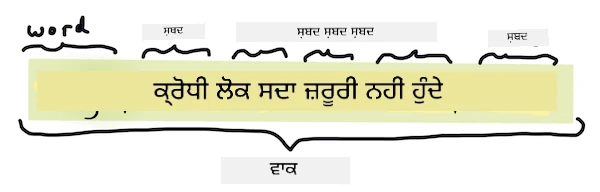
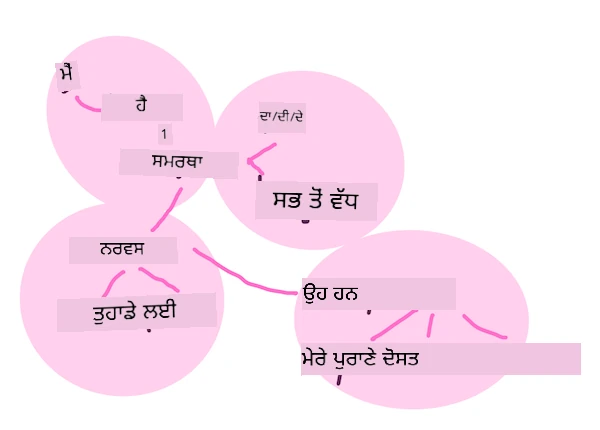
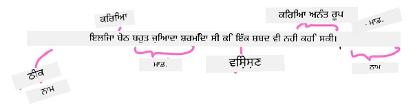
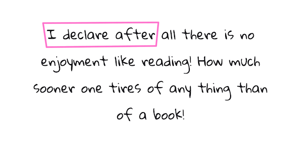

# ਆਮ ਕੁਦਰਤੀ ਭਾਸ਼ਾ ਪ੍ਰੋਸੈਸਿੰਗ ਦੇ ਕੰਮ ਅਤੇ ਤਕਨੀਕਾਂ

ਜ਼ਿਆਦਾਤਰ *ਕੁਦਰਤੀ ਭਾਸ਼ਾ ਪ੍ਰੋਸੈਸਿੰਗ* ਦੇ ਕੰਮ ਲਈ, ਪ੍ਰੋਸੈਸ ਕੀਤਾ ਜਾਣ ਵਾਲਾ ਲਿਖਤ ਤੁਹਾਨੂੰ ਟੁਕੜਿਆਂ ਵਿੱਚ ਵੱਖ ਕਰਨਾ ਪੈਂਦਾ ਹੈ, ਜਾਂਚਣਾ ਪੈਂਦਾ ਹੈ, ਅਤੇ ਨਤੀਜੇ ਸਟੋਰ ਕਰਨ ਜਾਂ ਨਿਯਮਾਂ ਅਤੇ ਡੇਟਾ ਸੈੱਟਾਂ ਨਾਲ ਸੰਬੰਧਿਤ ਕਰਨੇ ਪੈਂਦੇ ਹਨ। ਇਹ ਕੰਮ, ਪ੍ਰੋਗ੍ਰਾਮਰ ਨੂੰ ਲਿਖਤ ਵਿੱਚ ਸ਼ਬਦਾਂ ਅਤੇ ਸ਼ਬਦ ਬੰਦੀਆਂ ਦੀ _ਅਰਥ_ ਜਾਂ _ਮਕਸਦ_ ਜਾਂ ਸਿਰਫ _ਆਵ੍ਰਿਤੀ_ ਦਾ ਪਤਾ ਲਗਾਉਣ ਦਿੰਦੇ ਹਨ।

## [ਪਹਿਲੀ ਕਲਾਸ ਕਵੀਜ਼](https://ff-quizzes.netlify.app/en/ml/)

ਆਓ ਲਿਖਤ ਪ੍ਰੋਸੈਸਿੰਗ ਵਿੱਚ ਵਰਤੇ ਜਾਣ ਵਾਲੀਆਂ ਆਮ ਤਕਨੀਕਾਂ ਬਾਰੇ ਜਾਣਕਾਰੀ ਲਵਾਂ। ਮਸ਼ੀਨ ਲਰਨਿੰਗ ਨਾਲ ਮਿਲ ਕੇ, ਇਹ ਤਕਨੀਕਾ ਤੁਹਾਨੂੰ ਵੱਡੀ ਮਾਤਰਾ ਵਿੱਚ ਲਿਖਤ ਦਾ ਪ੍ਰਭਾਵਸ਼ਾਲੀ ਵਿਸ਼ਲੇਸ਼ਣ ਕਰਨ ਵਿੱਚ ਮਦਦ ਕਰਦੀਆਂ ਹਨ। ਹਾਲਾਂਕਿ ML ਨੂੰ ਇਹ ਕੰਮ ਕਰਨ ਤੋਂ ਪਹਿਲਾਂ, ਆਓ NLP ਵਿਸ਼ੇਸ਼ਜੱ ਦੀਆਂ ਮੁਸ਼ਕਲਾਂ ਨੂੰ ਸਮਝੀਏ।

## NLP ਲਈ ਆਮ ਕੰਮ

ਤੁਸੀਂ ਜਿਹੜੇ ਲਿਖਤ 'ਤੇ ਕੰਮ ਕਰ ਰਹੇ ਹੋ, ਉਸ ਨੂੰ ਵਿਸ਼ਲੇਸ਼ਣ ਕਰਨ ਦੇ ਵੱਖ-ਵੱਖ ਤਰੀਕੇ ਹਨ। ਤੁਸੀਂ ਕੁਝ ਕੰਮ ਕਰ ਸਕਦੇ ਹੋ ਅਤੇ ਇਨ੍ਹਾਂ ਕੰਮਾਂ ਰਾਹੀਂ ਤੁਸੀਂ ਲਿਖਤ ਨੂੰ ਸਮਝਣ ਵਿੱਚ ਯੋਗ ਹੋ ਜਾਉਂਦੇ ਹੋ ਅਤੇ ਨਤੀਜੇ ਕੱਢ ਸਕਦੇ ਹੋ। ਆਮ ਤੌਰ 'ਤੇ ਤੁਸੀਂ ਇਨ੍ਹਾਂ ਨਿਰਦੀਸ਼ਿਤ ਕ੍ਰਮ ਵਿੱਚ ਕਰਦੇ ਹੋ।

### ਟੋਕਨਾਈਜ਼ੇਸ਼ਨ

ਸਭ ਤੋਂ ਪਹਿਲਾਂ ਇਸ ਗੱਲ ਦੀ ਜ਼ਰੂਰਤ ਹੁੰਦੀ ਹੈ ਕਿ ਬਹੁਤ ਸਾਰੇ NLP ਅਲਗੋਰਿਧਮ ਲਿਖਤ ਨੂੰ ਟੋਕਨ ਜਾਂ ਸ਼ਬਦਾਂ ਵਿੱਚ ਵੰਡਾ ਜਾਣ। ਜਦ ਕਿ ਇਹ ਸਧਾਰਣ ਲੱਗਦਾ ਹੈ, ਪੰਕਚੂਏਸ਼ਨ ਅਤੇ ਵੱਖਰੇ ਭਾਸ਼ਾਵਾਂ ਦੇ ਸ਼ਬਦ ਅਤੇ ਵਾਕਾਂ ਦੇ delimiter ਮਦਦ ਨਾਲ ਇਹ ਮੁਸ਼ਕਲ ਹੋ ਸਕਦਾ ਹੈ। ਤੁਹਾਨੂੰ ਮਾਰਕ ਕਰਨ ਲਈ ਵੱਖ-ਵੱਖ ਤਰੀਕਿਆਂ ਦੀ ਲੋੜ ਪੈ ਸਕਦੀ ਹੈ।


> **Pride and Prejudice** ਦੀ ਇੱਕ ਵਾਕ ਦੀ ਟੋਕਨਾਈਜ਼ੇਸ਼ਨ। ਇਨਫੋਗ੍ਰਾਫਿਕ ਬਾਈ [Jen Looper](https://twitter.com/jenlooper)

### ਐਮਬੈਡਿੰਗਜ਼

[ਸ਼ਬਦ ਐਮਬੈਡਿੰਗਜ਼](https://wikipedia.org/wiki/Word_embedding) ਇੱਕ ਤਰੀਕਾ ਹੈ ਜੋ ਤੁਹਾਡੇ ਲਿਖਤੀ ਡਾਟਾ ਨੂੰ ਸੰਖਿਆਤਮਕ ਬਣਾਉਂਦੀਆਂ ਹਨ। ਐਮਬੈਡਿੰਗਜ਼ ਇਸ ਤਰੀਕੇ ਨਾਲ ਕੀਤਾ ਜਾਂਦਾ ਹੈ ਤਾਂ ਜੋ ਇਕੱਠੇ ਵਰਤੇ ਜਾਣ ਵਾਲੇ ਜਾਂ ਸਮਾਨ ਅਰਥ ਵਾਲੇ ਸ਼ਬਦ ਇੱਕ ਜਗ੍ਹਾ ਗਰੁੱਪ ਹੋ ਜਾਂ।


> "ਮੈਂ ਤੁਹਾਡੇ ਨਰਵੇਜ਼ ਦਾ ਮਾਣ ਕਰਦਾ ਹਾਂ, ਉਹ ਮੇਰੇ ਪੁਰਾਣੇ ਦੋਸਤ ਹਨ।" - **Pride and Prejudice** ਦੇ ਇੱਕ ਵਾਕ ਲਈ ਸ਼ਬਦ ਐਮਬੈਡਿੰਗਜ਼। ਇਨਫੋਗ੍ਰਾਫਿਕ ਬਾਈ [Jen Looper](https://twitter.com/jenlooper)

✅ ਸ਼ਬਦ ਐਮਬੈਡਿੰਗਜ਼ ਨਾਲ ਪ੍ਰਯੋਗ ਕਰਨ ਲਈ [ਇਹ ਦਿਲਚਸਪ ਟੂਲ](https://projector.tensorflow.org/) ਨੂੰ ਕੋਸ਼ਿਸ਼ ਕਰੋ। ਇੱਕ ਸ਼ਬਦ 'toy' 'disney', 'lego', 'playstation', ਅਤੇ 'console' ਵਰਗੇ ਸਮਾਨ ਸ਼ਬਦਾਂ ਨਾਲ ਗਰੁੱਪ ਬਣਾਉਂਦਾ ਹੈ।

### ਪਾਰਸਿੰਗ ਅਤੇ ਭਾਸ਼ਾ ਦੇ ਹਿੱਸੇ ਲਈ ਟੈਗਿੰਗ

ਹਰ ਇੱਕ ਟੋਕਨ ਸ਼ਬਦ ਨੂੰ ਭਾਸ਼ਾ ਦੇ ਹਿੱਸੇ ਵਜੋਂ ਟੈਗ ਕੀਤਾ ਜਾ ਸਕਦਾ ਹੈ - ਜਿਵੇਂ ਕਿ ਨਾਂ, ਕਿਰਿਆ, ਜਾਂ ਵਿਸ਼ੇਸ਼ਣ। `the quick red fox jumped over the lazy brown dog` ਦੇ ਵਾਕ ਨੂੰ POS ਟੈਗ ਕੀਤਾ ਜਾ ਸਕਦਾ ਹੈ fox = ਨਾਂ, jumped = ਕਿਰਿਆ।



> **Pride and Prejudice** ਦੀ ਇੱਕ ਵਾਕ ਦੀ ਪਾਰਸਿੰਗ। ਇਨਫੋਗ੍ਰਾਫਿਕ ਬਾਈ [Jen Looper](https://twitter.com/jenlooper)

ਪਾਰਸਿੰਗ, ਵਾਕ ਵਿੱਚ ਸਬਦਾਂ ਦੇ ਆਪਸੀ ਸੰਬੰਧਾਂ ਨੂੰ ਪਹਚਾਣਨਾ ਹੈ - ਉਦਾਹਰਨ ਵਜੋਂ `the quick red fox jumped` ਇੱਕ ਵਿਸ਼ੇਸ਼ਣ-ਨਾਂ-ਕਿਰਿਆ ਕ੍ਰਮ ਹੈ ਜੋ `lazy brown dog` ਦੇ ਕ੍ਰਮ ਤੋਂ ਵੱਖਰਾ ਹੈ।  

### ਸ਼ਬਦ ਅਤੇ ਵਾਕ-ਮਾਲਾ ਦੀ ਆਵ੍ਰਿਤੀ

ਵੱਡੇ ਲਿਖਤੀ ਸੰਗ੍ਰਹਿ ਦਾ ਵਿਸ਼ਲੇਸ਼ਣ ਕਰਨ ਵੇਲੇ ਇੱਕ ਬਹੁਤ ਉਪਯੋਗੀ ਪ੍ਰਕਿਰਿਆ ਹੈ ਹਰ ਸ਼ਬਦ ਜਾਂ ਵਾਕ-ਮਾਲਾ ਦੀ ਇਕ ਡਿਕਸ਼ਨਰੀ ਬਣਾਉਣਾ ਅਤੇ ਇਹ ਕਿੰਨੀ ਵਾਰੀ ਆਉਂਦਾ ਹੈ। `the quick red fox jumped over the lazy brown dog` ਦੀ ਸ਼ਬਦ ਆਵ੍ਰਿਤੀ 2 ਹੈ 'the' ਲਈ।

ਆਓ ਇੱਕ ਉਦਾਹਰਨ ਵਾਕ ਨੂੰ ਦੇਖੀਏ ਜਿੱਥੇ ਅਸੀਂ ਸ਼ਬਦਾਂ ਦੀ ਆਵ੍ਰਿਤੀ ਗਿਣ ਰਹੇ ਹਾਂ। ਰੁਡਯਾਰਡ ਕਿਪਲਿੰਗ ਦੀ ਕਵਿਤਾ The Winners ਵਿੱਚ ਇਹ ਕਵਿਤਾ ਵਾਲਾ ਹਿੱਸਾ ਹੈ:

```output
What the moral? Who rides may read.
When the night is thick and the tracks are blind
A friend at a pinch is a friend, indeed,
But a fool to wait for the laggard behind.
Down to Gehenna or up to the Throne,
He travels the fastest who travels alone.
```

ਜਿਵੇਂ ਕਿ ਵਾਕਾਂ ਦੀ ਆਵ੍ਰਿਤੀ ਲੋੜ ਅਨੁਸਾਰ ਕੇਸ-ਸੰਵੇਦਨਸ਼ੀਲ ਜਾਂ ਕੇਸ-ਅਸੰਵੇਦਨਸ਼ੀਲ ਹੋ ਸਕਦੀ ਹੈ, `a friend` ਦੀ ਆਵ੍ਰਿਤੀ 2 ਹੈ ਅਤੇ `the` ਦੀ 6 ਹੈ, ਅਤੇ `travels` 2 ਹੈ।

### ਐਨ-ਗ੍ਰਾਮਜ਼

ਇੱਕ ਲਿਖਤ ਨੂੰ ਵਰਡਾਂ ਦੀ ਲੰਬਾਈ ਵਾਲੀਆਂ ਲੜੀਆਂ ਵਿੱਚ ਵੰਡਿਆ ਜਾ ਸਕਦਾ ਹੈ, ਇੱਕਸ਼ਬਦੀ (ਯੂਨੀਗ੍ਰਾਮ), ਦੋਸ਼ਬਦੀ (ਬਾਈਗ੍ਰਾਮਜ਼), ਤਿੰਨ ਸ਼ਬਦਾਂ ਵਾਲੀਆਂ (ਟ੍ਰਾਈਗ੍ਰਾਮਜ਼) ਜਾਂ ਕਿਸੇ ਵੀ ਗਿਣਤੀ ਦੇ ਸ਼ਬਦ (ਐਨ-ਗ੍ਰਾਮਜ਼) ਹੋ ਸਕਦੇ ਹਨ।

ਉਦਾਹਰਨ ਲਈ, `the quick red fox jumped over the lazy brown dog` ਦਾ n-gram ਸਕੋਰ 2 ਲਈ ਹੇਠ ਲਿਖੇ n-ਗ੍ਰਾਮਜ਼ ਬਣਦੇ ਹਨ:

1. the quick 
2. quick red 
3. red fox
4. fox jumped 
5. jumped over 
6. over the 
7. the lazy 
8. lazy brown 
9. brown dog

ਇਸਨੂੰ ਇੱਕ ਵਾਕ ਤੇ ਸਲਾਈਡ ਕਰ ਰਹੀ ਝੋਲੀ ਵਾਂਗ ਸੋਚਣਾ ਆਸਾਨ ਹੋ ਸਕਦਾ ਹੈ। ਇੱਥੇ 3 ਸ਼ਬਦਾਂ ਵਾਲੇ n-ਗ੍ਰਾਮਜ਼ ਲਈ ਸਲਾਈਡਿੰਗ ਬਾਕਸ ਦਿੱਤਾ ਗਿਆ ਹੈ, ਹਰ ਇੱਕ ਵਾਕ ਵਿੱਚ n-ਗ੍ਰਾਮ ਬੋਲਡ ਵਿਚ ਹੈ:

1.   <u>**the quick red**</u> fox jumped over the lazy brown dog
2.   the **<u>quick red fox</u>** jumped over the lazy brown dog
3.   the quick **<u>red fox jumped</u>** over the lazy brown dog
4.   the quick red **<u>fox jumped over</u>** the lazy brown dog
5.   the quick red fox **<u>jumped over the</u>** lazy brown dog
6.   the quick red fox jumped **<u>over the lazy</u>** brown dog
7.   the quick red fox jumped over <u>**the lazy brown**</u> dog
8.   the quick red fox jumped over the **<u>lazy brown dog</u>**



> 3 ਦਾ n-ਗ੍ਰਾਮ ਮੁੱਲ: ਇਨਫੋਗ੍ਰਾਫਿਕ ਬਾਈ [Jen Looper](https://twitter.com/jenlooper)

### ਨਾਂ-ਵਾਕ ਮਾਲਾ ਨਿਕਾਲਣਾ

ਜ਼ਿਆਦਾਤਰ ਵਾਕਾਂ ਵਿੱਚ ਇੱਕ ਨਾਂ ਹੁੰਦਾ ਹੈ ਜੋ ਵਾਕ ਦਾ ਵਿਚਾਰਧਾਰਾ ਸਮੇਤ ਬਿੰਦੂ ਹੁੰਦਾ ਹੈ। ਅੰਗਰੇਜ਼ੀ ਵਿੱਚ, ਇਹ ਆਮ ਤੌਰ ਤੇ 'a', 'an' ਜਾਂ 'the' ਦੇ ਨਾਲ ਪਹਚਾਣ ਕੀਤਾ ਜਾਂਦਾ ਹੈ। ਨਾਂ-ਵਾਕ ਮਾਲਾ ਨੂੰ ਨਿਕਾਲ ਕੇ ਵਾਕ ਦਾ ਮਤਲਬ ਸਮਝਣਾ NLP ਵਿੱਚ ਆਮ ਕੰਮ ਹੈ।

✅ ਵਾਕ "I cannot fix on the hour, or the spot, or the look or the words, which laid the foundation. It is too long ago. I was in the middle before I knew that I had begun." ਵਿੱਚ, ਕੀ ਤੁਸੀਂ ਨਾਂ-ਵਾਕ ਮਾਲਾ ਪਛਾਣ ਸਕਦੇ ਹੋ?

ਵਾਕ `the quick red fox jumped over the lazy brown dog` ਵਿੱਚ 2 ਨਾਂ-ਵਾਕ ਮਾਲਾ ਹਨ: **quick red fox** ਅਤੇ **lazy brown dog**।

### ਭਾਵਨਾ ਵਿਸ਼ਲੇਸ਼ਣ

ਇੱਕ ਵਾਕ ਜਾਂ ਲਿਖਤ ਦੀ ਭਾਵਨਾ ਜਾਂ ਪੋਜ਼ੀਟਿਵ ਜਾਂ ਨੈਗੇਟਿਵ ਹੋਣ ਦੀ ਵਿਸ਼ਲੇਸ਼ਣਾ ਕੀਤੀ ਜਾ ਸਕਦੀ ਹੈ। ਭਾਵਨਾ ਦਾ ਮੂਲੱਅਕਾਂਕਣ *ਪੋਲਰਿਟੀ* ਅਤੇ *ਆਬਜੈਕਟਿਵਿਟੀ/ਸਬਜੈਕਟਿਵਿਟੀ* ਵਿੱਚ ਹੁੰਦਾ ਹੈ। ਪੋਲਰਿਟੀ -1.0 ਤੋਂ 1.0 ਤੱਕ ਮਾਪੀ ਜਾਂਦੀ ਹੈ (ਨੈਗੇਟਿਵ ਤੋਂ ਪੋਜ਼ੀਟਿਵ) ਅਤੇ 0.0 ਤੋਂ 1.0 ਤੱਕ (ਸਭ ਤੋਂ ਆਬਜੈਕਟਿਵ ਤੋਂ ਸਭ ਤੋਂ ਸਬਜੈਕਟਿਵ)।

✅ ਬਾਅਦ ਵਿੱਚ ਤੁਸੀਂ ਸਿੱਖੋਗੇ ਕਿ ਮਸ਼ੀਨ ਲਰਨਿੰਗ ਦੀ ਵਰਤੋਂ ਨਾਲ ਭਾਵਨਾ ਦੀ ਪਹਚਾਣ ਕਰਨ ਲਈ ਵੱਖ-ਵੱਖ ਤਰੀਕੇ ਹਨ, ਪਰ ਇੱਕ ਤਰੀਕਾ ਇਹ ਹੈ ਕਿ ਸ਼ਬਦਾਂ ਅਤੇ ਵਾਕ-ਮਾਲਾ ਦੀ ਸੂਚੀ ਬਣਾਈ ਜਾਵੇ ਜੋ ਮਨੁੱਖੀ ਵਿਸ਼ੇਸ਼ਗਿਆਨ ਦੁਆਰਾ ਪੋਜ਼ੀਟਿਵ ਜਾਂ ਨੈਗੇਟਿਵ ਵਰਗੀਕਰਨ ਹੁੰਦੀ ਹੈ ਅਤੇ ਉਸ ਮਾਡਲ ਨੂੰ ਲਿਖਤ 'ਤੇ ਲਾਗੂ ਕਰਕੇ ਪੋਲਰਿਟੀ ਸਕੋਰ ਕੱਢਿਆ ਜਾਵੇ। ਕੀ ਤੁਸੀਂ ਦੇਖ ਸਕਦੇ ਹੋ ਕਿ ਇਹ ਕੁਝ ਹਾਲਤਾਂ ਵਿੱਚ ਕਿਵੇਂ ਕੰਮ ਕਰੇਗਾ ਅਤੇ ਕੁਝ ਵਿੱਚ ਥੋੜ੍ਹਾ ਠੀਕ ਨਹੀਂ?

### ਇਨਫਲੇਕਸ਼ਨ

ਇਨਫਲੇਕਸ਼ਨ ਸਹਾਇਤਾ ਕਰਦਾ ਹੈ ਕਿ ਤੁਸੀਂ ਇੱਕ ਸ਼ਬਦ ਲੈ ਕੇ ਉਸਦਾ ਇੱਕਵਚਨ ਜਾਂ ਬਹੁਵਚਨ ਪ੍ਰਾਪਤ ਕਰ ਸਕੋ।

### ਲੈਮੈਟਾਈਜ਼ੇਸ਼ਨ

ਇੱਕ *ਲੈਮਾ* ਉਹ ਮੂਲ ਸ਼ਬਦ ਜਾਂ ਹੇਡਵਰਡ ਹੁੰਦਾ ਹੈ ਜਿਸ ਦੇ ਤਹਿਤ ਕਈ ਸ਼ਬਦ ਆਉਂਦੇ ਹਨ, ਉਦਾਹਰਨ ਵਜੋਂ *flew*, *flies*, *flying* ਦਾ ਲੈਮਾ ਕਿਰਿਆ *fly* ਹੈ।

NLP ਖੋਜਕਾਰ ਲਈ ਕੁਝ ਮਦਦਗਾਰ ਡੇਟਾਬੇਸ ਵੀ ਉਪਲਬਧ ਹਨ, ਜੋ ਕਿ ਮੁੱਖ ਤੌਰ 'ਤੇ:

### WordNet

[WordNet](https://wordnet.princeton.edu/) ਸ਼ਬਦਾਂ, ਸਮਾਨਾਰਥਕ, ਵਿਰੋਧਾਰਥਕ ਅਤੇ ਹੋਰ ਬਹੁਤ ਸਾਰੇ ਵੇਰਵੇਆਂ ਦਾ ਡੇਟਾਬੇਸ ਹੈ ਜੋ ਕਈ ਭਾਸ਼ਾਵਾਂ ਲਈ ਹੈ। ਇਹ ਕਿਸੇ ਵੀ ਕਿਸਮ ਦੇ ਅਨੁਵਾਦ, ਸਪੈੱਲ ਚੈੱਕਰ ਜਾਂ ਭਾਸ਼ਾ ਸੰਦ ਬਣਾਉਣ ਵੇਲੇ ਬਹੁਤ ਮਹੱਤਵਪੂਰਨ ਹੈ।

## NLP ਲਾਇਬ੍ਰੇਰੀਜ਼

ਖੁਸ਼ਕਿਸਮਤੀ ਨਾਲ, ਤੁਹਾਨੂੰ ਇਹ ਸਾਰੀਆਂ ਤਕਨੀਕਾਂ ਖੁਦ ਬਣਾਉਣ ਦੀ ਲੋੜ ਨਹੀਂ ਹੈ, ਕਿਉਂਕਿ ਬਹੁਤ ਵਧੀਆ Python ਲਾਇਬ੍ਰੇਰੀਆਂ ਉਪਲਬਧ ਹਨ ਜੋ NLP ਜਾਂ ਮਸ਼ੀਨ ਲਰਨਿੰਗ ਵਿੱਚ ਤਕਨੀਕੀ ਮਾਹਿਰ ਨਾ ਹੋਣ ਵਾਲੇ ਵਿਕਾਸਕਾਰਾਂ ਲਈ ਬਹੁਤ ਸੌਖਾ ਕਰਦੀਆਂ ਹਨ। ਅਗਲੇ ਪਾਠਾਂ ਵਿੱਚ ਇਹਨਾਂ ਦੀਆਂ ਹੋਰ ਉਦਾਹਰਣਾਂ ਹਨ, ਪਰ ਇੱਥੇ ਤੁਸੀਂ ਕੁਝ ਮਦਦਗਾਰ ਉਦਾਹਰਣ ਸਿੱਖੋਗੇ ਜੋ ਅਗਲੇ ਕੰਮ ਵਿੱਚ ਸਹਾਇਕ ਹੋਣਗੇ।

### ਅਭਿਆਸ - `TextBlob` ਲਾਇਬ੍ਰੇਰੀ ਦੀ ਵਰਤੋਂ

ਆਓ ਇੱਕ ਲਾਇਬ੍ਰੇਰੀ TextBlob ਵਰਤਾਂ ਜੋ ਇਹਨਾਂ ਕਿਸਮ ਦੇ ਕੰਮ ਕਰਨ ਲਈ ਮਦਦਗਾਰ APIs ਰੱਖਦੀ ਹੈ। TextBlob "[NLTK](https://nltk.org) ਅਤੇ [pattern](https://github.com/clips/pattern) ਦੇ ਵਿਸ਼ਾਲ ਭਰੋਸੇ 'ਤੇ ਖੜੀ ਹੈ ਅਤੇ ਦੋਵਾਂ ਨਾਲ ਵਧੀਆ ਤਰੀਕੇ ਨਾਲ ਕੰਮ ਕਰਦੀ ਹੈ।" ਇਸ API ਵਿੱਚ ਕਾਫੀ ਮਸ਼ੀਨ ਲਰਨਿੰਗ ਸ਼ਾਮਲ ਹੈ।

> ਨੋਟ: TextBlob ਲਈ ਇੱਕ ਮਦਦਗਾਰ [ਸ਼ੁਰੂਆਤੀ ਗਾਈਡ](https://textblob.readthedocs.io/en/dev/quickstart.html#quickstart) ਉਪਲਬਧ ਹੈ ਜੋ ਅਨੁਭਵੀ Python ਵਿਕਾਸਕਾਰਾਂ ਲਈ ਸਿਫਾਰਸ਼ੀ ਹੈ

ਨਾਂ-ਵਾਕ ਮਾਲਾ ਦੀ ਪਛਾਣ ਕਰਨ ਵੇਲੇ, TextBlob ਕੁਝ ਏਜ ਗ੍ਰਹਿਣ ਕਰਨ ਵਾਲੇ ਵਿਕਲਪ ਦਿੰਦਾ ਹੈ ਜੋ ਨਾਂ-ਵਾਕ ਮਾਲਾ ਖੋਜਦੇ ਹਨ।

1. `ConllExtractor` 'ਤੇ ਇੱਕ ਨਜ਼ਰ ਮਾਰੋ।

    ```python
    from textblob import TextBlob
    from textblob.np_extractors import ConllExtractor
    # ਆਯਾਤ ਕਰੋ ਅਤੇ ਬਾਅਦ ਵਿੱਚ ਵਰਤਣ ਲਈ ਇੱਕ ਕੌਨਲ ਇਕਸਟ੍ਰੈਕਟਰ ਬਣਾਓ
    extractor = ConllExtractor()
    
    # ਬਾਅਦ ਵਿੱਚ ਜਦੋਂ ਤੈਨੂੰ ਇੱਕ ਨਾਉਂ ਫਰੇਜ਼ ਇਕਸਟ੍ਰੈਕਟਰ ਦੀ ਲੋੜ ਹੋਵੇ:
    user_input = input("> ")
    user_input_blob = TextBlob(user_input, np_extractor=extractor)  # ਨੋਨ-ਡਿਫੌਲਟ ਇਕਸਟ੍ਰੈਕਟਰ ਨਿਰਧਾਰਿਤ ਕੀਤਾ ਗਿਆ ਹੈ
    np = user_input_blob.noun_phrases                                    
    ```

    > ਇੱਥੇ ਕੀ ਹੋ ਰਿਹਾ ਹੈ? [ConllExtractor](https://textblob.readthedocs.io/en/dev/api_reference.html?highlight=Conll#textblob.en.np_extractors.ConllExtractor) "ਇੱਕ ਨਾਂ-ਵਾਕ ਮਾਲਾ ਨਿਕਾਲਣ ਵਾਲਾ ਹੈ ਜੋ ConLL-2000 ਟ੍ਰੇਨਿੰਗ ਕਾਰਪਸ ਨਾਲ ਚੰਕ ਪਾਰਸਿੰਗ ਕਰਦਾ ਹੈ।" ConLL-2000 ਕਮਪਿਊਟੇਸ਼ਨਲ ਕੁਦਰਤੀ ਭਾਸ਼ਾ ਸਿੱਖਣ ਲਈ 2000 ਵਿੱਚ ਹੋਈ ਕਾਨਫਰੰਸ ਨਾਂ-ਚੰਕਿੰਗ ਸਮੱਸਿਆ ਨੂੰ ਲਕੜੀ ਜੀਵੇਂ ਸੀ। ਆਮ ਮਾਡਲ ਵਿੱਲ ਸਟਰੀਟ ਜਰਨਲ 'ਤੇ ਟ੍ਰੇਨ ਹੋਇਆ ਜਿਸ ਵਿੱਚ "ਐਲਾਨ 15-18 ਟ੍ਰੇਨਿੰਗ ਡਾਟਾ (211727 ਟੋਕਨ) ਅਤੇ ਐਲਾਨ 20 ਟੈਸਟ ਡਾਟਾ (47377 ਟੋਕਨ)" ਵਜੋਂ ਲਿਆ ਗਿਆ। ਤੁਸੀਂ ਇੱਥੇ ਪ੍ਰਕਿਰਿਆਵਾਂ ਦੇਖ ਸਕਦੇ ਹੋ [ਇੱਥੇ](https://www.clips.uantwerpen.be/conll2000/chunking/) ਅਤੇ [ਨਤੀਜੇ](https://ifarm.nl/erikt/research/np-chunking.html)।

### ਚੁਣੌਤੀ - ਆਪਣੇ ਬੋਟ ਨੂੰ NLP ਨਾਲ ਮਜ਼ਬੂਤ ਬਣਾਓ

ਪਿਛਲੇ ਪਾਠ ਵਿੱਚ ਤੁਸੀਂ ਇੱਕ ਬਹੁਤ ਸਧਾਰਣ Q&A ਬੋਟ ਬਣਾਇਆ ਸੀ। ਹੁਣ, ਤੁਸੀਂ ਮਾਰਵਿਨ ਨੂੰ ਥੋੜ੍ਹਾ ਜ਼ਿਆਦਾ ਸਮਝਦਾਰ ਬਣਾਉਣ ਲਈ ਭਾਵਨਾ ਦਾ ਵਿਸ਼ਲੇਸ਼ਣ ਕਰੋਗੇ ਅਤੇ ਉਸ ਦੀ ਭਾਵਨਾ ਦੇ ਅਨੁਸਾਰ ਜਵਾਬ ਛਾਪੋਗੇ। ਤੁਹਾਨੂੰ ਇੱਕ `noun_phrase` ਵੀ ਪਛਾਣਣਾ ਹੋਵੇਗਾ ਅਤੇ ਉਸ ਬਾਰੇ ਹੋਰ ਪੁੱਛਣਾ ਹੋਵੇਗਾ।

ਬਿਹਤਰ ਸੰਵਾਦੀ ਬੋਟ ਬਣਾਉਣ ਲਈ ਤੁਹਾਡੇ ਕਦਮ:

1. ਯੂਜ਼ਰ ਨੂੰ ਬੋਟ ਨਾਲ ਕਿਵੇਂ ਗੱਲਬਾਤ ਕਰਨੀ ਹੈ ਉਸ ਦੀ ਸੂਚਨਾ ਛਾਪੋ
2. ਲੂਪ ਸ਼ੁਰੂ ਕਰੋ
   1. ਯੂਜ਼ਰ ਇਨਪੁੱਟ ਲਵੋ
   2. ਜੇ ਯੂਜ਼ਰ ਨੇ ਬੰਦ ਕਰਨ ਲਈ ਕਿਹਾ, ਤਾਂ ਬੰਦ ਕਰੋ
   3. ਯੂਜ਼ਰ ਇਨਪੁੱਟ ਦਾ ਪ੍ਰੋਸੈਸ ਕਰੋ ਅਤੇ ਭਾਵਨਾ ਅਨੁਸਾਰ ਜਵਾਬ ਤੈਅ ਕਰੋ
   4. ਜੇ ਭਾਵਨਾ ਵਿੱਚ ਨਾਂ-ਵਾਕ ਮਾਲਾ ਪਛਾਣ ਹੋ ਗਿਆ, ਤਾਂ ਉਸਦਾ ਬਹੁਵਚਨ ਬਣਾਕੇ ਉਸ ਬਾਰੇ ਹੋਰ ਪੁੱਛੋ
   5. ਜਵਾਬ ਛਾਪੋ
3. ਕਦਮ 2 ਵੱਲ ਲੂਪ ਨੂੰ ਦੁਹਰਾਓ

ਇਸੇ ਤਰ੍ਹਾਂ, TextBlob ਦੀ ਵਰਤੋਂ ਨਾਲ ਭਾਵਨਾ ਨਿਰਧਾਰਿਤ ਕਰਨ ਦਾ ਕੋਡ ਟੁੱਟਾ ਦਿੱਤਾ ਗਿਆ ਹੈ। ਨੋਟ ਕਰੋ ਕਿ ਸਿਰਫ ਚਾਰ *ਭਾਵਨਾ ਦੇ ਗਰੇਡੀਐਂਟ* ਹਨ (ਤੁਸੀਂ ਵੱਧ ਵੀ ਰੱਖ ਸਕਦੇ ਹੋ):

```python
if user_input_blob.polarity <= -0.5:
  response = "Oh dear, that sounds bad. "
elif user_input_blob.polarity <= 0:
  response = "Hmm, that's not great. "
elif user_input_blob.polarity <= 0.5:
  response = "Well, that sounds positive. "
elif user_input_blob.polarity <= 1:
  response = "Wow, that sounds great. "
```

ਕੁਝ ਨਮੂਨਾ ਆਉਟਪੁੱਟ ਦਿੱਤਾ ਗਿਆ ਹੈ (ਯੂਜ਼ਰ ਇਨਪੁੱਟ > ਨਾਲ ਸ਼ੁਰੂ ਹੋ ਰਿਹਾਂ ਹਨ):

```output
Hello, I am Marvin, the friendly robot.
You can end this conversation at any time by typing 'bye'
After typing each answer, press 'enter'
How are you today?
> I am ok
Well, that sounds positive. Can you tell me more?
> I went for a walk and saw a lovely cat
Well, that sounds positive. Can you tell me more about lovely cats?
> cats are the best. But I also have a cool dog
Wow, that sounds great. Can you tell me more about cool dogs?
> I have an old hounddog but he is sick
Hmm, that's not great. Can you tell me more about old hounddogs?
> bye
It was nice talking to you, goodbye!
```

ਇਸ ਕੰਮ ਦਾ ਇੱਕ ਸੰਭਾਵਤ ਹੱਲ [ਇੱਥੇ](https://github.com/microsoft/ML-For-Beginners/blob/main/6-NLP/2-Tasks/solution/bot.py) ਹੈ

✅ ਗਿਆਨ ਜਾਂਚ

1. ਕੀ ਤੁਸੀਂ ਸੋਚਦੇ ਹੋ ਕਿ ਸਮਝਦਾਰ ਜਵਾਬ ਕਿਸੇ ਨੂੰ ਇਹ ਭਰਮ ਦਿਵਾਂ ਕਿ ਬੋਟ ਨੇ ਵਾਕਈ ਉਸਨੂੰ ਸਮਝਿਆ ਹੈ?
2. ਕੀ ਨਾਂ-ਵਾਕ ਮਾਲਾ ਪਛਾਣਣਾ ਬੋਟ ਨੂੰ ਵਧੇਰੇ 'ਵਿਸ਼ਵਾਸਯੋਗ' ਬਣਾਉਂਦਾ ਹੈ?
3. ਕਿਸੇ ਵਾਕ ਵਿਚੋਂ 'ਨਾਂ-ਵਾਕ ਮਾਲਾ' ਨਿਕਾਲਣਾ ਇਕ ਉਪਯੋਗੀ ਚੀਜ਼ ਕਿਉਂ ਹੈ?

---

ਪਿਛਲੇ ਗਿਆਨ ਜਾਂਚ ਵਿੱਚ ਦਿੱਤਾ ਬੋਟ ਬਣਾਉ ਅਤੇ ਕਿਸੇ ਦੋਸਤ ਉੱਤੇ ਇਸਦੀ ਜਾਂਚ ਕਰੋ। ਕੀ ਇਹ ਦੋਸਤ ਨੂੰ ਭਰਮਿਤ ਕਰ ਸਕਦਾ ਹੈ? ਕੀ ਤੁਸੀਂ ਆਪਣੇ ਬੋਟ ਨੂੰ ਵਧੇਰੇ 'ਵਿਸ਼ਵਾਸਯੋਗ' ਬਣਾ ਸਕਦੇ ਹੋ?

## 🚀ਚੁਣੌਤੀ

ਪਿਛਲੇ ਗਿਆਨ ਜਾਂਚ ਵਿੱਚੋਂ ਕੋਈ ਕੰਮ ਚੁਣ ਕੇ ਇਸ ਨੂੰ ਲਾਗੂ ਕਰਨ ਦੀ ਕੋਸ਼ਿਸ਼ ਕਰੋ। ਬੋਟ ਦੀ ਕਿਸੇ ਦੋਸਤ ਉੱਤੇ ਜਾਂਚ ਕਰੋ। ਕੀ ਇਹ ਉਸਨੂੰ ਭਰਮਿਤ ਕਰ ਸਕਦਾ ਹੈ? ਕੀ ਤੁਸੀਂ ਆਪਣੇ ਬੋਟ ਨੂੰ ਵਧੇਰੇ 'ਵਿਸ਼ਵਾਸਯੋਗ' ਬਣਾ ਸਕਦੇ ਹੋ?

## [ਬਾਦ ਦੀ ਕਲਾਸ ਕਵੀਜ਼](https://ff-quizzes.netlify.app/en/ml/)

## ਸਮੀਖਿਆ ਅਤੇ ਸਵੈ ਅਧਿਐਨ

ਅੱਗੇ ਦੇ ਕੁਝ ਪਾਠਾਂ ਵਿੱਚ ਤੁਸੀਂ ਭਾਵਨਾ ਵਿਸ਼ਲੇਸ਼ਣ ਬਾਰੇ ਹੋਰ ਜਾਣੋਗੇ। ਇਸ ਦਿਲਚਸਪ ਤਕਨੀਕ ਨੂੰ [KDNuggets](https://www.kdnuggets.com/tag/nlp) ਵਰਗੇ ਲੇਖਾਂ ਵਿੱਚ ਖੋਜੋ।

## ਅਸਾਈਨਮੈਂਟ 

[ਬੋਟ ਨਾਲ ਗੱਲਬਾਤ ਕਰਵਾਉ](assignment.md)

---

<!-- CO-OP TRANSLATOR DISCLAIMER START -->
**ਅਸਵੀਕਾਰੋਪਣ**:
ਇਸ ਦਸਤਾਵੇਜ਼ ਦਾ ਅਨੁਵਾਦ ਏਆਈ ਅਨੁਵਾਦ ਸੇਵਾ [Co-op Translator](https://github.com/Azure/co-op-translator) ਦੀ ਵਰਤੋਂ ਕਰਕੇ ਕੀਤਾ ਗਿਆ ਹੈ। ਜਦੋਂ ਕਿ ਅਸੀਂ ਸਹੀਤਾਵਾਂ ਲਈ ਯਤਨਸ਼ੀਲ ਹਾਂ, ਕਿਰਪਾ ਕਰਕੇ ਧਿਆਨ ਰੱਖੋ ਕਿ ਸਵੈਚਾਲਿਤ ਅਨੁਵਾਦਾਂ ਵਿੱਚ ਗਲਤੀਆਂ ਜਾਂ ਅਸਮੱਤਿਆਵਾਂ ਹੋ ਸਕਦੀਆਂ ਹਨ। ਮੂਲ ਦਸਤਾਵੇਜ਼ ਆਪਣੀ ਮੂਲ ਭਾਸ਼ਾ ਵਿੱਚ ਅਧਿਕਾਰਕ ਸਰੋਤ ਮੰਨਿਆ ਜਾਣਾ ਚਾਹੀਦਾ ਹੈ। ਜਰੂਰੀ ਜਾਣਕਾਰੀ ਲਈ, ਪੇਸ਼ੇਵਰ ਮਨੁੱਖੀ ਅਨੁਵਾਦ ਦੀ ਸਿਫ਼ਾਰਸ਼ ਕੀਤੀ ਜਾਂਦੀ ਹੈ। ਅਸੀਂ ਇਸ ਅਨੁਵਾਦ ਦੇ ਉਪਯੋਗ ਤੋਂ ਪੈਦਾ ਹੋਣ ਵਾਲੀਆਂ ਕਿਸੇ ਵੀ ਗਲਤਫਹਿਮੀਆਂ ਜਾਂ ਗਲਤ ਵਿਆਖਿਆਵਾਂ ਲਈ ਜਵਾਬਦੇਹ ਨਹੀਂ ਹਾਂ।
<!-- CO-OP TRANSLATOR DISCLAIMER END -->