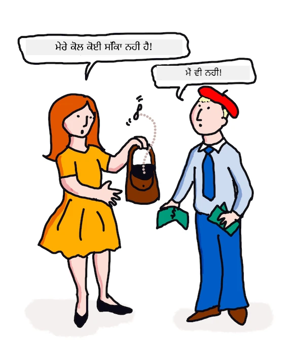

# ਐਮਐਲ ਨਾਲ ਅਨੁਵਾਦ ਅਤੇ ਭਾਵਨਾ ਵਿਸ਼ਲੇਸ਼ਣ

ਪਿਛਲੇ ਪਾਠਾਂ ਵਿੱਚ ਤੁਸੀਂ ਸਿੱਖਿਆ ਕਿ ਕਿਵੇਂ `TextBlob` ਦੀ ਵਰਤੋਂ ਕਰਕੇ ਇੱਕ ਬੁਨਿਆਦੀ ਬੋਟ ਬਣਾਈ ਜਾ ਸਕਦੀ ਹੈ, ਜੋ ਮਸ਼ੀਨ ਲਰਨਿੰਗ ਨੂੰ ਪਿਛੋਕੜ ਵਿੱਚ ਵਰਤਦਾ ਹੈ ਤਾਂ ਕਿ ਮੂਲ ਭਾਸ਼ਾ ਪ੍ਰਕਿਰਿਆ ਕੰਮ ਜਿਵੇਂ ਕਿ ਨਾਉਨ ਫ੍ਰੇਜ਼ ਨਿਕਾਸ ਕਰ ਸਕੇ। ਕਮਪਿਊਟੇਸ਼ਨਲ ਭਾਸ਼ਾਵਿਗਿਆਨ ਵਿੱਚ ਇੱਕ ਹੋਰ ਮਹੱਤਵਪੂਰਨ ਚੁਣੌਤੀ ਹੈ ਇੱਕ ਬੋਲੇ ਜਾਂ ਲਿਖਤੀ ਭਾਸ਼ਾ ਤੋਂ ਦੂਜੀ ਭਾਸ਼ਾ ਵਿੱਚ ਵਾਕ ਦਾ ਸਹੀ _ਅਨੁਵਾਦ_ ਕਰਨਾ।

## [ਪ੍ਰੀ-ਲੈਕਚਰ ਕਵਿਜ਼](https://ff-quizzes.netlify.app/en/ml/)

ਅਨੁਵਾਦ ਇੱਕ ਬਹੁਤ ਮੁਸ਼ਕਲ ਸਮੱਸਿਆ ਹੈ ਜਿਸ ਨੂੰ ਹਜ਼ਾਰਾਂ ਭਾਸ਼ਾਵਾਂ ਹੋਣ ਨਾਲ ਵਧਾ ਦਿੱਤਾ ਗਿਆ ਹੈ ਅਤੇ ਹਰ ਇਕ ਭਾਸ਼ਾ ਦੇ ਵਿਆਕਰਣ ਦੇ ਕਾਇਦੇ ਕਾਫੀ ਵੱਖਰੇ ਹੋ ਸਕਦੇ ਹਨ। ਇੱਕ ਤਰੀਕਾ ਇਹ ਹੈ ਕਿ ਇੱਕ ਭਾਸ਼ਾ, ਜਿਵੇਂ ਅੰਗ੍ਰੇਜ਼ੀ ਦੇ ਫਾਰਮਲ ਗ੍ਰੈਮਰ ਨਿਯਮਾਂ ਨੂੰ ਕਿਸੇ ਭਾਸ਼ਾ-ਨਿਰਪੇਕ ਸਰਚਨਾ ਵਿੱਚ ਬਦਲਿਆ ਜਾਵੇ, ਅਤੇ ਫਿਰ ਉਸ ਨੂੰ ਵਾਪਸ ਕਿਸੇ ਦੂਜੀ ਭਾਸ਼ਾ ਵਿੱਚ ਅਨੁਵਾਦ ਕਰਨ ਲਈ ਬਦਲਿਆ ਜਾਵੇ। ਇਸ ਤਰੀਕੇ ਨਾਲ ਤੁਸੀਂ ਹੇਠਲੀਆਂ ਕਦਮਾਂ ਨੂੰ ਲੈਂਦੇ:

1. **ਪਹਚਾਣ ਕਰੋ**। ਇਨਪੁੱਟ ਭਾਸ਼ਾ ਵਿੱਚ ਸ਼ਬਦਾਂ ਨੂੰ ਨਾਉਨ, ਵਰਬ ਆਦਿ ਵਜੋਂ ਪਹਚਾਣੋ ਜਾਂ ਟੈਗ ਕਰੋ।
2. **ਅਨੁਵਾਦ ਬਣਾਓ**। ਹਰ ਸ਼ਬਦ ਦਾ ਲਕੜੀ ਭਾਸ਼ਾ ਦੇ ਫਾਰਮੈਟ ਵਿੱਚ ਸਿੱਧਾ ਅਨੁਵਾਦ ਬਣਾਓ।

### ਉਦਾਹਰਨ ਵਾਕ, ਅੰਗ੍ਰੇਜ਼ੀ ਤੋਂ ਆਇਰਿਸ਼

'ਅੰਗ੍ਰੇਜ਼ੀ' ਵਿੱਚ, ਵਾਕ _I feel happy_ ਤਿੰਨ ਸ਼ਬਦਾਂ ਦਾ ਹੁੰਦਾ ਹੈ ਅਤੇ ਕ੍ਰਮ ਹੈ:

- **ਵਿਸ਼ਾ** (I)
- **ਕਿਰਿਆ** (feel)
- **ਵਿਸ਼ੇਸ਼ਣ** (happy)

ਪਰ 'ਆਇਰਿਸ਼' ਭਾਸ਼ਾ ਵਿੱਚ, ਉਹੀ ਵਾਕ ਕਾਫੀ ਵੱਖਰਾ ਵਿਅਾਕਰਣਕ ਡھانਚਾ ਰੱਖਦਾ ਹੈ - ਜਜ਼ਬਾਤ ਜਿਵੇਂ "*happy*" ਜਾਂ "*sad*" ਨੂੰ ਤੁਹਾਡੇ ਉੱਤੇ ਹੋਣ ਦੇ ਤੌਰ ’ਤੇ ਵਿਅਕਤ ਕੀਤਾ ਜਾਂਦਾ ਹੈ।

ਅੰਗ੍ਰੇਜ਼ੀ ਫਰੇਜ਼ `I feel happy` ਆਇਰਿਸ਼ ਵਿੱਚ `Tá athas orm` ਹੁੰਦਾ ਹੈ। ਇੱਕ *ਸ਼ਾਬਦਿਕ* ਅਨੁਵਾਦ ਹੋਵੇ ਤਾਂ `Happy is upon me`।

ਆਇਰਿਸ਼ ਬੋਲਣ ਵਾਲਾ ਜੋ ਅੰਗ੍ਰੇਜ਼ੀ ਵਿੱਚ ਅਨੁਵਾਦ ਕਰਦਾ ਹੈ ਉਹ ਕਹੇਗਾ `I feel happy`, ਨਾ ਕਿ `Happy is upon me`, ਕਿਉਂਕਿ ਉਹ ਵਾਕ ਦਾ ਮਤਲਬ ਸਮਝਦਾ ਹੈ, ਭਾਵੇਂ ਸ਼ਬਦ ਅਤੇ ਵਾਕ ਰਚਨਾ ਵੱਖਰੀ ਹੈ।

ਆਇਰਿਸ਼ ਵਿੱਚ ਵਾਕ ਦਾ ਫਾਰਮਲ ਕ੍ਰਮ ਹੈ:

- **ਕਿਰਿਆ** (Tá ਜਾਂ is)
- **ਵਿਸ਼ੇਸ਼ਣ** (athas ਜਾਂ happy)
- **ਵਿਸ਼ਾ** (orm ਜਾਂ upon me)

## ਅਨੁਵਾਦ

ਇੱਕ ਸਧਾਰਨ ਅਨੁਵਾਦ ਪ੍ਰੋਗਰਾਮ ਸਿਰਫ ਸ਼ਬਦਾਂ ਦਾ ਅਨੁਵਾਦ ਕਰ ਸਕਦਾ ਹੈ, ਵਾਕ ਦੇ ਸਰਚਨਾ ਨੂੰ ਨਜ਼ਰਅੰਦਾਜ਼ ਕਰਦਾ ਹੈ।

✅ ਜੇ ਤੁਸੀਂ ਵੱਡੇ ਹੋ ਕੇ ਦੂਜੀ (ਜਾਂ ਤੀਜੀ ਜਾਂ ਹੋਰ) ਭਾਸ਼ਾ ਸਿੱਖੀ ਹੈ, ਤਾਂ ਸ਼ੁਰੂ ਵਿੱਚ ਤੁਸੀਂ ਆਪਣੀ ਮੂਲ ਭਾਸ਼ਾ ਵਿੱਚ ਸੋਚਦੇ, ਦੂਜੀ ਭਾਸ਼ਾ ਵਿੱਚ ਸ਼ਬਦ-ਬ-ਸ਼ਬਦ ਅਨੁਵਾਦ ਕਰਦੇ ਅਤੇ ਫਿਰ ਬੋਲਦੇ ਹੋ। ਇਹ ਸਧਾਰਨ ਅਨੁਵਾਦ ਕਮਪਿਊਟਰ ਪ੍ਰੋਗਰਾਮਾਂ ਵਾਂਗ ਹੈ। ਫਲੂਐਨਸੀ ਪ੍ਰਾਪਤ ਕਰਨ ਲਈ ਇਸ ਪੜਾਅ ਤੋਂ ਉੱਪਰ ਜਾਣਾ ਜ਼ਰੂਰੀ ਹੈ!

ਸਧਾਰਨ ਅਨੁਵਾਦ ਗਲਤ (ਅਤੇ ਕਈ ਵਾਰੀ ਮਜ਼ੇਦਾਰ) ਮਿਸਅਨੁਵਾਦਾਂ ਨੂੰ ਜਨਮ ਦਿੰਦਾ ਹੈ: `I feel happy` ਆਇਰਿਸ਼ ਵਿੱਚ ਸ਼ਾਬਦਿਕ ਤੌਰ 'ਤੇ `Mise bhraitheann athas` ਹੁੰਦਾ ਹੈ। ਇਸਦਾ ਮਤਲਬ ਹੁੰਦਾ ਹੈ (ਸ਼ਾਬਦਿਕ) `ਮੈਨੂੰ ਮਹਿਸੂਸ ਹੁੰਦਾ ਹੈ ਖੁਸ਼ੀ` ਅਤੇ ਇਹ валਿਡ ਆਇਰਿਸ਼ ਵਾਕ ਨਹੀਂ ਹੈ। ਜਿੱਥੇ ਅੰਗ੍ਰੇਜ਼ੀ ਅਤੇ ਆਇਰਿਸ਼ ਦੋ ਨੇੜਲੇ ਟਾਪੂਆਂ ਉੱਤੇ ਬੋਲੀ ਜਾਂਦੀਆਂ ਭਾਸ਼ਾਵਾਂ ਹਨ, ਉਹ ਬਹੁਤ ਵੱਖਰੀਆਂ ਅਤੇ ਵੱਖਰੇ ਵਿਆਕਰਣ ਵਾਲੀਆਂ ਹਨ।

> ਤੁਸੀਂ ਆਇਰਿਸ਼ ਭਾਸ਼ਾ ਦੀਆਂ ਰਵਾਇਤੀ ਵਿਡੀਓਜ਼ ਇੱਥੇ ਵੇਖ ਸਕਦੇ ਹੋ, ਜਿਵੇਂ ਕਿ [ਇਹ ](https://www.youtube.com/watch?v=mRIaLSdRMMs)

### ਮਸ਼ੀਨ ਲਰਨਿੰਗ ਤਰੀਕੇ

ਹੁਣ ਤੱਕ ਤੁਸੀਂ ਫਾਰਮਲ ਨਿਯਮਾਂ ਦੀ ਭਾਸ਼ਾ ਪ੍ਰਕਿਰਿਆ ਬਾਰੇ ਸਿੱਖਿਆ ਹੈ। ਇੱਕ ਹੋਰ ਤਰੀਕਾ ਹੈ ਸ਼ਬਦਾਂ ਦੇ ਮਤਲਬ ਨੂੰ ਨਜ਼ਰਅੰਦਾਜ਼ ਕਰਕੇ ਮਸ਼ੀਨ ਲਰਨਿੰਗ ਦੀ ਵਰਤੋਂ ਕਰਕੇ ਪੈਟਰਨ ਦੀ ਪਹਚਾਣ ਕਰਨੀ। ਇਹ ਅਨੁਵਾਦ ਵਿੱਚ ਕੰਮ ਕਰ ਸਕਦਾ ਹੈ ਜੇ ਤੁਹਾਡੇ ਕੋਲ ਮੂਲ ਅਤੇ ਟਾਰਗਿਟ ਦੋਹਾਂ ਭਾਸ਼ਾਵਾਂ ਵਿੱਚ ਬਹੁਤ ਸਾਰਾ ਟੈਕਸਟ (ਕੋਰਪਸ) ਹੋਵੇ।

ਉਦਾਹਰਨ ਵਜੋਂ ਧਿਆਨ ਦਿਉ, *Pride and Prejudice* ਜੋ ਕਿ 1813 ਵਿੱਚ ਜੇਨ ਆસ્ટਿਨ ਦੁਆਰਾ ਲਿਖਿਆ ਗਿਆ ਜਾਣਾ-ਜਾਣਾ ਅੰਗ੍ਰੇਜ਼ੀ ਨਾਵਲ ਹੈ। ਜੇ ਤੁਸੀਂ ਕਿਤਾਬ ਅੰਗ੍ਰੇਜ਼ੀ ਵਿੱਚ ਅਤੇ ਇਸ ਦੀ ਫ੍ਰੈਂਚ ਵਿੱਚ ਮਨੁੱਖੀ ਅਨੁਵਾਦ ਵਿੱਚ ਤੁਲਨਾ ਕਰੋਗੇ, ਤਾਂ ਤੁਸੀਂ ਓਹਨਾਂ ਫਰੇਜ਼ਾਂ ਨੂੰ ਡਿੱਠੋਗੇ ਜੋ ਇਕ ਦੂਜੇ ਵਿੱਚ ਰੀਤਿਗਤ ਅਨੁਵਾਦ ਹਨ। ਤੁਸੀਂ ਇਹ ਕੁਝ ਸਮੇਂ ਵਿੱਚ ਕਰੋਗੇ।

ਉਦਾਹਰਨ ਵਜੋਂ, ਜਦੋਂ ਇੱਕ ਅੰਗ੍ਰੇਜ਼ੀ ਫਰੇਜ਼ `I have no money` ਨੂੰ ਸ਼ਾਬਦਿਕ ਤੌਰ 'ਤੇ ਫ੍ਰੈਂਚ ਵਿੱਚ ਅਨੁਵਾਦ ਕੀਤਾ ਜਾਂਦਾ ਹੈ, ਉਹ ਬਣ ਸਕਦਾ ਹੈ `Je n'ai pas de monnaie`। "Monnaie" ਇੱਕ ਮੁਸ਼ਕਲ ਫ੍ਰੈਂਚ 'ਫਾਲਸ ਕੋਗਨੇਟ' ਹੈ, ਕਿਉਂਕਿ 'money' ਅਤੇ 'monnaie' ਇਕੋ ਹੀ ਮਤਲਬ ਨਹੀਂ ਰੱਖਦੇ। ਇਕ ਚੰਗਾ ਅਨੁਵਾਦ ਜੋ ਮਨੁੱਖ ਕਰ ਸਕਦਾ ਹੈ ਉਹ ਹੋਵੇਗਾ `Je n'ai pas d'argent`, ਕਿਉਂਕਿ ਇਹ ਮਤਲਬ ਹੋਰ ਚੰਗੀ ਤਰ੍ਹਾਂ ਦੱਸਦਾ ਹੈ ਕਿ ਤੁਹਾਡੇ ਕੋਲ ਪੈਸਾ ਨਹੀਂ (ਜਿਹੜਾ 'monnaie' ਦਾ ਅਰਥ 'ਝੁਟੇ ਕਾਂਸੇ' ਜਾਂ ਵੱਡਾ ਸਿਕਾ ਨਹੀਂ ਹੈ)।



> ਚਿੱਤਰਕਾਰੀ [Jen Looper](https://twitter.com/jenlooper) ਵੱਲੋਂ

ਜੇ ਕਿਸੇ ਐਮਐਲ ਮਾਡਲ ਕੋਲ ਕਾਫੀ ਮਨੁੱਖੀ ਅਨੁਵਾਦ ਹਨ ਤਾਂ ਉਹ ਪਿਛਲੇ ਅਨੁਵਾਦਾਂ ਵਿੱਚ ਆਮ ਪੈਟਰਨਾਂ ਦੀ ਪਹਚਾਣ ਕਰਕੇ ਅਨੁਵਾਦ ਦੀ ਸ਼ੁੱਧਤਾ ਨੂੰ ਸੁਧਾਰ ਸਕਦਾ ਹੈ ਜੋ ਦੋਹਾਂ ਭਾਸ਼ਾਵਾਂ ਦੇ ਮਾਹਿਰ ਬੋਲਣ ਵਾਲਿਆਂ ਵੱਲੋਂ ਕੀਤੇ ਗਏ ਹਨ।

### ਅਭਿਆਸ - ਅਨੁਵਾਦ

ਤੁਸੀਂ ਵਾਕਾਂ ਦਾ ਅਨੁਵਾਦ ਕਰਨ ਲਈ `TextBlob` ਦੀ ਵਰਤੋਂ ਕਰ ਸਕਦੇ ਹੋ। ਕੋਸ਼ਿਸ਼ ਕਰੋ ਮਸ਼ਹੂਰ ਪਹਿਲੀ ਲਾਈਨ **Pride and Prejudice** ਦੀ:

```python
from textblob import TextBlob

blob = TextBlob(
    "It is a truth universally acknowledged, that a single man in possession of a good fortune, must be in want of a wife!"
)
print(blob.translate(to="fr"))

```

`TextBlob` ਅਨੁਵਾਦ ਨੂੰ ਕਾਫੀ ਵਧੀਆ ਬਣਾਉਂਦਾ ਹੈ: "C'est une vérité universellement reconnue, qu'un homme célibataire en possession d'une bonne fortune doit avoir besoin d'une femme!".

ਇਹ ਕਿਹਾ ਜਾ ਸਕਦਾ ਹੈ ਕਿ TextBlob ਦਾ ਅਨੁਵਾਦ ਕਿਤਾਬ ਦੇ 1932 ਦੇ ਫ੍ਰੈਂਚ ਅਨੁਵਾਦ ਨਾਲੋਂ ਕਾਫੀ ਅਸਲੀਅਤ ਦੇ ਨੇੜੇ ਹੈ ਜੋ ਕਿ V. Leconte ਅਤੇ Ch. Pressoir ਵੱਲੋਂ ਕੀਤਾ ਗਿਆ ਸੀ:

"C'est une vérité universelle qu'un célibataire pourvu d'une belle fortune doit avoir envie de se marier, et, si peu que l'on sache de son sentiment à cet egard, lorsqu'il arrive dans une nouvelle résidence, cette idée est si bien fixée dans l'esprit de ses voisins qu'ils le considèrent sur-le-champ comme la propriété légitime de l'une ou l'autre de leurs filles."

ਇਸ ਮਾਮਲੇ ਵਿੱਚ, ਐਮਐਲ ਨਾਲ ਸੂਚਿਤ ਅਨੁਵਾਦ ਮਨੁੱਖੀ ਅਨੁਵਾਦਕ ਨਾਲੋਂ ਵਧੀਆ ਕੰਮ ਕਰਦਾ ਹੈ ਜੋ ਮੂਲ ਲੇਖਕ ਦੇ ਸ਼ਬਦਾਂ ਵਿੱਚ ਜ਼ਰੂਰੀ ਤੋਂ ਜ਼ਿਆਦਾ ਸ਼ਬਦ ਜੋੜ ਰਿਹਾ ਹੈ ਤਾ ਕਿ 'ਸਪਸ਼ਟਤਾ' ਆ ਜਾਵੇ।

> ਇਹਥੇ ਕੀ ਕੀਤਾ ਜਾ ਰਿਹਾ ਹੈ? ਅਤੇ TextBlob ਅਨੁਵਾਦ ਵਿੱਚ ਇੰਨਾ ਵਧੀਆ ਕਿਉਂ ਹੈ? ਬੈਕਐਂਡ ਵਿੱਚ, ਇਹ Google translate ਦੀ ਵਰਤੋਂ ਕਰ ਰਿਹਾ ਹੈ, ਜੋ ਇੱਕ ਅਜਿਹਾ ਸੁੱਧਰ AI ਹੈ ਜੋ ਲੱਖਾਂ ਵਾਕਾਂ ਦਾ ਵਿਸ਼ਲੇਸ਼ਣ ਕਰਕੇ ਸਭ ਤੋਂ ਵਧੀਆ ਸੰਦ ਨੂੰ ਅਨੁਮਾਨਿਤ ਕਰਦਾ ਹੈ। ਇੱਥੇ ਕੋਈ ਮੈਨੂਅਲ ਕੰਮ ਨਹੀਂ ਹੁੰਦਾ ਅਤੇ `blob.translate` ਨੂੰ ਵਰਤਣ ਲਈ ਤੁਹਾਨੂੰ ਇੰਟਰਨੈੱਟ ਕਨੈਕਸ਼ਨ ਦੀ ਲੋੜ ਹੈ।

✅ ਹੋਰ ਵਾਕਾਂ ਨਾਲ ਕੋਸ਼ਿਸ਼ ਕਰੋ। ਕਿਹੜਾ ਵਧੀਆ ਹੈ, ਐਮਐਲ ਜਾਂ ਮਨੁੱਖੀ ਅਨੁਵਾਦ? ਕਿਹੜੇ ਮਾਮਲਿਆਂ ਵਿੱਚ?

## ਭਾਵਨਾ ਵਿਸ਼ਲੇਸ਼ਣ

ਮਸ਼ੀਨ ਲਰਨਿੰਗ ਇੱਕ ਹੋਰ ਖੇਤਰ ਹੈ ਜਿੱਥੇ ਇਹ ਬਹੁਤ ਵਧੀਆ ਕੰਮ ਕਰ ਸਕਦੀ ਹੈ, ਜਿਸ ਨੂੰ ਭਾਵਨਾ ਵਿਸ਼ਲੇਸ਼ਣ ਕਹਿੰਦੇ ਹਨ। ਭਾਵਨਾ ਦਾ ਗੈਰ-ਐਮਐਲ ਤਰੀਕਾ ਇਹ ਹੈ ਕਿ ਸ਼ਬਦਾਂ ਅਤੇ ਫਰੇਜ਼ਾਂ ਨੂੰ 'ਪੋਜ਼ਿਟਿਵ' ਅਤੇ 'ਨੇਗੇਟਿਵ' ਵਜੋਂ ਪਹਚਾਨਿਆ ਜਾਵੇ। ਫਿਰ, ਨਵੇਂ ਟੈਕਸਟ ਵਿੱਚ, ਪੋਜ਼ਿਟਿਵ, ਨੇਗੇਟਿਵ ਅਤੇ ਨਿਊਟ੍ਰਲ ਸ਼ਬਦਾਂ ਦਾ ਕੁੱਲ ਮੁੱਲ ਕੈਲਕੁਲੇਟ ਕਰਕੇ ਸਮੂਹਿਕ ਭਾਵਨਾ ਪਤਾ ਲਗਾਈ ਜਾਵੇ।

ਇਹ ਤਰੀਕਾ ਆਸਾਨੀ ਨਾਲ ਧੋਖਾਧੜੀ ਦਾ ਸ਼ਿਕਾਰ ਹੋ ਸਕਦਾ ਹੈ, ਜਿਵੇਂ ਤੁਸੀਂ ਮਾਰਵਿਨ ਟਾਸਕ ਵਿੱਚ ਦੇਖਿਆ ਸੀ - ਵਾਕ `Great, that was a wonderful waste of time, I'm glad we are lost on this dark road` ਇੱਕ ਵਿਆੰਗਯਾਤਮਕ, ਨਕਾਰਾਤਮਕ ਭਾਵਨਾ ਵਾਲਾ ਵਾਕ ਹੈ, ਪਰ ਸਾਦਾ ਅਲਗੋਰਿਦਮ 'great', 'wonderful', 'glad' ਨੂੰ ਪੋਜ਼ਿਟਿਵ ਅਤੇ 'waste', 'lost' ਅਤੇ 'dark' ਨੂੰ ਨੇਗੇਟਿਵ ਸਮਝਦਾ ਹੈ। ਸਮੂਹਿਕ ਭਾਵਨਾ ਇਨ੍ਹਾਂ ਵਿਰੋਧੀ ਸ਼ਬਦਾਂ ਨਾਲ ਪ੍ਰਭਾਵਿਤ ਹੁੰਦੀ ਹੈ।

✅ ਇੱਕ ਸੈਕੰਡ ਰੂਕੋ ਅਤੇ ਸੋਚੋ ਕਿ ਅਸੀਂ ਮਨੁੱਖਾਂ ਵਾਂਗ ਵਿਆੰਗ ਦਾ ਪ੍ਰਗਟਾਵਾ ਕਿਵੇਂ ਕਰਦੇ ਹਾਂ। ਸੁਰ ਦੀ ਉਚਾਰਣ ਅਹੰਕਾਰ ਮੁੱਖ ਭੂਮਿਕਾ ਨਿਭਾਉਂਦਾ ਹੈ। ਕਹਾਵਤ "Well, that film was awesome" ਨੂੰ ਵੱਖ-ਵੱਖ ਤਰੀਕਿਆਂ ਨਾਲ ਕਹਿਣ ਦੀ ਕੋਸ਼ਿਸ਼ ਕਰੋ ਅਤੇ ਜਾਣੋ ਕਿ ਤੁਹਾਡੀ ਆਵਾਜ਼ ਕਿਵੇਂ ਮਤਲਬ ਪਹੁੰਚਾਉਂਦੀ ਹੈ।

### ਐਮਐਲ ਤਰੀਕੇ

ਐਮਐਲ ਤਰੀਕੇ ਵਿੱਚ ਤੁਹਾਨੂੰ ਮਨੁੱਖੀ ਤੌਰ ਤੇ ਧਨਾਤਮਕ ਅਤੇ ਰਣਾਤਮਕ ਟੈਕਸਟ - ਟਵੀਟਾਂ, ਫਿਲਮ ਸਮੀਖਿਆਵਾਂ ਜਾਂ ਕੋਈ ਹੋਰ ਜਿੱਥੇ ਮਨੁੱਖ ਨੇ ਸਕੋਰ ਅਤੇ ਲਿਖਿਤ ਰਾਏ ਦਿੱਤੀ ਹੈ - ਇਕੱਠੀ ਕਰਨੀ ਪੈਂਦੀ ਹੈ। ਫਿਰ NLP ਤਕਨਾਲੋਜੀ ਨੂੰ ਰਾਏਆਂ ਅਤੇ ਸਕੋਰਾਂ 'ਤੇ ਲਗਾਇਆ ਜਾਂਦਾ ਹੈ ਤਾਂ ਕਿ ਪੈਟਰਨ ਸਾਹਮਣੇ ਆ ਸਕਣ (ਜਿਵੇਂ ਦਿੱਖਦਾ ਹੈ ਕਿ ਧਨਾਤਮਕ ਫਿਲਮ ਸਮੀਖਿਆਵਾਂ ਵਿੱਚ 'Oscar worthy' ਸ਼ਬਦ ਨੇਗੇਟਿਵ ਸਮੀਖਿਆਵਾਂ ਨਾਲੋਂ ਵੱਧ ਹੁੰਦੇ ਹਨ, ਜਾਂ ਧਨਾਤਮਕ ਰੈਸਟੋਰੈਂਟ ਸਮੀਖਿਆਵਾਂ ਵਿੱਚ 'gourmet' ਵੱਧ ਪ੍ਰਯੋਗ ਹੁੰਦਾ ਹੈ 'disgusting' ਦੀ ਤਲਨਾ ਵਿੱਚ)।

> ⚖️ **ਉਦਾਹਰਨ**: ਜੇ ਤੁਸੀਂ ਕਿਸੇ ਰਾਜਨੀਤੀ ਵਿਭਾਗ ਵਿੱਚ ਕੰਮ ਕਰਦੇ ਹੋ ਜਿੱਥੇ ਕੋਈ ਨਵਾਂ ਕਾਨੂੰਨ ਚਰਚਾ ਵਿੱਚ ਹੈ, ਤਾਂ ਲੋਕ ਆਪਣੇ ਦਲ ਵਿੱਚ ਸੁਪੋਰਟਮਈਲ ਜਾਂ ਵਿਰੋਧੀ ਈਮੇਲ ਭੇਜ ਸਕਦੇ ਹਨ। ਧਾਰ ਲਓ ਤੁਸੀਂ ਇਹ ਈਮੇਲ ਪੜ੍ਹ ਕੇ, *for* ਅਤੇ *against* ਦੋ ਹਿੱਸਿਆਂ ਵਿੱਚ ਵੱਖਰਾ ਕਰਨ ਲਈ ਕਹੇ ਗਏ ਹੋ। ਜੇ ਈਮੇਲਾਂ ਬਹੁਤ ਸਾਰੀਆਂ ਹਨ ਤਾਂ ਪੂਰੀਆਂ ਪੜ੍ਹਨ ਵਿੱਚ ਮੁਸ਼ਕਲ ਹੋ ਸਕਦੀ ਹੈ। ਕੀ ਹਾਲੇ ਨਹੀਂ ਚੰਗਾ ਹੋਵੇਗਾ ਜੇ ਕੋਈ ਬੋਟ ਇਹ ਸਾਰੇ ਈਮੇਲ ਪੜ੍ਹ ਕੇ ਸਮਝ ਸਕੇ ਅਤੇ ਦੱਸ ਸਕੇ ਕਿ ਹਰੇਕ ਈਮੇਲ ਕਿਸ ਹਿੱਸੇ ਵਿੱਚ ਆਉਂਦੀ ਹੈ?
> 
> ਇਸਨੂੰ ਹਾਸਲ ਕਰਨ ਦਾ ਇੱਕ ਤਰੀਕਾ ਮਸ਼ੀਨ ਲਰਨਿੰਗ ਦੀ ਵਰਤੋਂ ਹੈ। ਤੁਸੀਂ ਮਾਡਲ ਨੂੰ *against* ਈਮੇਲਾਂ ਅਤੇ *for* ਈਮੇਲਾਂ ਦੇ ਕੁਝ ਹਿੱਸਿਆਂ ਨਾਲ ਸਿੱਖਾਉਂਦੇ ਹੋ। ਮਾਡਲ ਕੁਝ ਪੈਟਰਨ ਐਸੋਸੀਏਟ ਕਰਦਾ ਹੈ ਪਰ ਇਸਨੂੰ ਸਮਗਰੀ ਦੀ ਸਮਝ ਨਹੀਂ ਹੁੰਦੀ, ਸਿਰਫ ਇਹ ਪਤਾ ਲਗਦਾ ਹੈ ਕਿ ਕੁਝ ਸ਼ਬਦ ਅਤੇ ਪੈਟਰਨ *against* ਜਾਂ *for* ਈਮੇਲਾਂ ਵਿੱਚ ਜ਼ਿਆਦਾ ਆਉਂਦੇ ਹਨ। ਤੁਸੀਂ ਮਾਡਲ ਦੀ ਜਾਂਚ ਕੁਝ ਹੋਰ ਈਮੇਲਾਂ ਨਾਲ ਕਰ ਸਕਦੇ ਹੋ ਜੋ ਮਾਡਲ ਨੂੰ ਸਿਖਾਉਣ ਵਿੱਚ ਵਰਤੇ ਨਹੀਂ ਗਏ, ਅਤੇ ਦੇਖੋਗੇ ਕਿ ਨਤੀਜਾ ਇੱਕੋ ਹੀ ਹੈ ਜਾਂ ਨਹੀਂ। ਫਿਰ ਜਦੋਂ ਤੁਸੀਂ ਮਾਡਲ ਦੀ ਸ਼ੁੱਧਤਾ ਨਾਲ ਖੁਸ਼ ਹੋਵੋਗੇ, ਤੁਹਾਨੂੰ ਹਰ ਨਵੀਂ ਈਮੇਲ ਮੈਨੂੰਅਲੀ ਪੜ੍ਹਣ ਦੀ ਲੋੜ ਨਹੀਂ ਰਹੇਗੀ।

✅ ਕੀ ਇਹ ਪ੍ਰਕਿਰਿਆ ਤੁਹਾਡੇ ਪਿਛਲੇ ਪਾਠਾਂ ਵਿੱਚ ਵਰਤੇ ਗਏ ਪ੍ਰਕਿਰਿਆਵਾਂ ਵਰਗੀ ਲੱਗਦੀ ਹੈ?

## ਅਭਿਆਸ - ਭਾਵਨਾਤਮਕ ਵਾਕਾਂ

ਭਾਵਨਾ ਨੂੰ *ਪੋਲਾਰਿਟੀ* -1 ਤੋਂ 1 ਤੱਕ ਦੇ ਸਕੋਰ ਨਾਲ ਮਾਪਿਆ ਜਾਂਦਾ ਹੈ, ਜਿੱਥੇ -1 ਸਭ ਤੋਂ ਨਕਾਰਾਤਮਕ ਭਾਵਨਾ ਅਤੇ 1 ਸਭ ਤੋਂ ਧਨਾਤਮਕ ਹੈ। ਭਾਵਨਾ ਨੂੰ 0 ਤੋਂ 1 ਤੱਕ ਓਬਜੈਕਟਿਵਿਟੀ (0) ਅਤੇ ਸਬਜੈਕਟਿਵਿਟੀ (1) ਦੇ ਸਕੋਰ ਨਾਲ ਵੀ ਮਾਪਿਆ ਜਾਂਦਾ ਹੈ।

ਜੇਨ ਆਸਟਿਨ ਦੀ *Pride and Prejudice* ਨੂੰ ਦੁਬਾਰਾ ਦੇਖੋ। ਲੇਖ ਇੱਥੇ ਉਪਲੱਬਧ ਹੈ [Project Gutenberg](https://www.gutenberg.org/files/1342/1342-h/1342-h.htm) 'ਤੇ। ਹੇਠਾਂ ਇੱਕ ਛੋਟਾ ਪ੍ਰੋਗਰਾਮ ਦਿੱਤਾ ਗਿਆ ਹੈ ਜੋ ਕਿਤਾਬ ਦੇ ਪਹਿਲੇ ਅਤੇ ਆਖਰੀ ਵਾਕਾਂ ਦੀ ਭਾਵਨਾ ਦਾ ਵਿਸ਼ਲੇਸ਼ਣ ਕਰਦਾ ਹੈ ਅਤੇ ਭਾਵਨਾ ਦੀ ਪੋਲਾਰਿਟੀ ਅਤੇ ਸਬਜੈਕਟਿਵਿਟੀ/ਓਬਜੈਕਟਿਵਿਟੀ ਸਕੋਰ ਦਿਖਾਉਂਦਾ ਹੈ।

ਤੁਸੀਂ ਅਗਲੇ ਕੰਮ ਲਈ `TextBlob` ਲਾਈਬ੍ਰੇਰੀ ਦੀ ਵਰਤੋਂ ਕਰੋਗੇ (ਜੋ ਉਪਰ ਵਰਨਿਤ ਕੀਤੀ ਗਈ ਹੈ) `sentiment` ਦਾ ਪਤਾ ਕਰਨ ਲਈ (ਤੁਹਾਨੂੰ ਆਪਣਾ ਭਾਵਨਾ ਕੈਲਕੁਲੇਟਰ ਲਿਖਣ ਦੀ ਲੋੜ ਨਹੀਂ)।

```python
from textblob import TextBlob

quote1 = """It is a truth universally acknowledged, that a single man in possession of a good fortune, must be in want of a wife."""

quote2 = """Darcy, as well as Elizabeth, really loved them; and they were both ever sensible of the warmest gratitude towards the persons who, by bringing her into Derbyshire, had been the means of uniting them."""

sentiment1 = TextBlob(quote1).sentiment
sentiment2 = TextBlob(quote2).sentiment

print(quote1 + " has a sentiment of " + str(sentiment1))
print(quote2 + " has a sentiment of " + str(sentiment2))
```

ਤੁਸੀਂ ਹੇਠ ਲਿਖਿਆ ਆਉਟਪੁੱਟ ਵੇਖੋਗੇ:

```output
It is a truth universally acknowledged, that a single man in possession of a good fortune, must be in want # of a wife. has a sentiment of Sentiment(polarity=0.20952380952380953, subjectivity=0.27142857142857146)

Darcy, as well as Elizabeth, really loved them; and they were
     both ever sensible of the warmest gratitude towards the persons
      who, by bringing her into Derbyshire, had been the means of
      uniting them. has a sentiment of Sentiment(polarity=0.7, subjectivity=0.8)
```

## ਚੈਲੇਂਜ - ਭਾਵਨਾ ਪੋਲਾਰਿਟੀ ਚੈੱਕ ਕਰੋ

ਤੁਹਾਡਾ ਕੰਮ ਹੈ ਪੋਲਾਰਿਟੀ ਦੀ ਵਰਤੋਂ ਕਰਕੇ ਇਹ ਪਤਾ ਲਗਾਉਣਾ ਕਿ *Pride and Prejudice* ਦੇ ਵਾਕ ਧਰੋ ਤੌਰ ਤੇ ਜ਼ਿਆਦਾ ਧਨਾਤਮਕ ਹਨ ਜਾਂ ਜ਼ਿਆਦਾ ਨਕਾਰਾਤਮਕ। ਇਸ ਕੰਮ ਲਈ, ਤੁਸੀਂ ਧਾਰਨਾ ਕਰ ਸਕਦੇ ਹੋ ਕਿ ਪੋਲਾਰਿਟੀ ਸਕੋਰ 1 ਜਾਂ -1 ਕਈ ਵਾਰੀ ਧਰੋ ਤੌਰ ਤੇ ਧਨਾਤਮਕ ਜਾਂ ਨਕਾਰਾਤਮਕ ਹੁੰਦਾ ਹੈ।

**ਕਦਮ:**

1. Project Gutenberg ਤੋਂ [Pride and Prejudice](https://www.gutenberg.org/files/1342/1342-h/1342-h.htm) ਦਾ .txt ਫਾਇਲ ਡਾਊਨਲੋਡ ਕਰੋ। ਫਾਇਲ ਦੇ ਸ਼ੁਰੂ ਅਤੇ ਅਖਿਰ ਵਿੱਚੋਂ ਮেটਾਡੇਟਾ ਹਟਾਓ, ਸਿਰਫ ਅਸਲੀ ਲੇਖ ਛੱਡੋ
2. ਫਾਇਲ ਨੂੰ ਪਾਇਥਨ ਵਿੱਚ ਖੋਲ੍ਹੋ ਅਤੇ ਸਮੱਗਰੀ ਨੂੰ ਸਟਰਿੰਗ ਵਜੋਂ ਕਢੋ
3. ਕਿਤਾਬ ਦੇ ਸਟਰਿੰਗ ਨਾਲ TextBlob ਬਣਾਓ
4. ਕਿਤਾਬ ਵਿੱਚ ਹਰ ਵਾਕ ਦਾ ਲੂਪ ਵਿੱਚ ਵਿਸ਼ਲੇਸ਼ਣ ਕਰੋ
   1. ਜੇ ਪੋਲਾਰਿਟੀ 1 ਜਾਂ -1 ਹੋਵੇ, ਤਾਂ ਵਾਕ ਨੂੰ ਧਨਾਤਮਕ ਜਾਂ ਨਕਾਰਾਤਮਕ ਸੁਨੇਹਿਆਂ ਦੀ ਸੂਚੀ ਵਿੱਚ ਸੰਭਾਲੋ
5. ਅੰਤ ਵਿੱਚ, ਸਾਰੇ ਧਨਾਤਮਕ ਅਤੇ ਨਕਾਰਾਤਮਕ ਵਾਕ (ਅਲੱਗ-ਅਲੱਗ) ਅਤੇ ਗਿਣਤੀ ਪ੍ਰਿੰਟ ਕਰੋ।

ਇਸਦਾ ਇੱਕ ਨਮੂਨਾ [ਹੱਲ](https://github.com/microsoft/ML-For-Beginners/blob/main/6-NLP/3-Translation-Sentiment/solution/notebook.ipynb) ਹੈ।

✅ ਗਿਆਨ ਚੈੱਕ

1. ਭਾਵਨਾ ਸ਼ਬਦਾਂ ਦੇ ਨਾਲ ਨਪਤੀ ਜਾਂਦੀ ਹੈ, ਪਰ ਕੀ ਕੋਡ ਸ਼ਬਦਾਂ ਨੂੰ *ਸਮਝਦਾ* ਹੈ?
2. ਕੀ ਤੁਸੀਂ ਸੋਚਦੇ ਹੋ ਕਿ ਭਾਵਨਾ ਦੀ ਪੋਲਾਰਿਟੀ ਸਹੀ ਹੈ, ਜਾਂ ਦੂਜੇ ਸ਼ਬਦਾਂ ਵਿੱਚ, ਕੀ ਤੁਸੀਂ ਸਕੋਰਾਂ ਨਾਲ *ਸਹਿਮਤ* ਹੋ?
   1. ਖਾਸ ਕਰਕੇ, ਕੀ ਤੁਸੀਂ ਹੇਠਾਂ ਦਿੱਤੇ ਵਾਕਾਂ ਦੀ ਪੂਰਨ **ਧਨਾਤਮਕ** ਪੋਲਾਰਿਟੀ ਨਾਲ ਸਹਿਮਤ ਹੋ ਜਾਂ ਨਹੀਂ?
      * “What an excellent father you have, girls!” said she, when the door was shut.
      * “Your examination of Mr. Darcy is over, I presume,” said Miss Bingley; “and pray what is the result?” “I am perfectly convinced by it that Mr. Darcy has no defect.
      * How wonderfully these sort of things occur!
      * I have the greatest dislike in the world to that sort of thing.
      * Charlotte is an excellent manager, I dare say.
      * “This is delightful indeed!
      * I am so happy!
      * Your idea of the ponies is delightful.
   2. ਅਗਲੇ 3 ਵਾਕਾਂ ਨੂੰ ਪੂਰਨ ਧਨਾਤਮਕ ਭਾਵਨਾ ਮਿਲੀ ਹੈ, ਪਰ ਧਿਆਨ ਨਾਲ ਪੜ੍ਹਨ 'ਤੇ ਇਹ ਧਨਾਤਮਕ ਨਹੀਂ ਹਨ। ਭਾਵਨਾ ਵਿਸ਼ਲੇਸ਼ਣ ਨੇ ਇਹ ਕਿਉਂ ਧਨਾਤਮਕ ਸਮਝੇ?
      * Happy shall I be, when his stay at Netherfield is over!” “I wish I could say anything to comfort you,” replied Elizabeth; “but it is wholly out of my power.
      * If I could but see you as happy!
      * Our distress, my dear Lizzy, is very great.
   3. ਕੀ ਤੁਸੀਂ ਹੇਠਾਂ ਦਿੱਤੇ ਵਾਕਾਂ ਦੀ ਪੂਰਨ **ਨਕਾਰਾਤਮਕ** ਪੋਲਾਰਿਟੀ ਨਾਲ ਸਹਿਮਤ ਹੋ ਜਾਂ ਨਹੀਂ?
      - Everybody is disgusted with his pride.
      - “I should like to know how he behaves among strangers.” “You shall hear then—but prepare yourself for something very dreadful.
      - The pause was to Elizabeth’s feelings dreadful.
      - It would be dreadful!

✅ ਜੇਨ ਆਸਟਿਨ ਦੇ ਕੋਈ ਵੀ ਪ੍ਰਸ਼ੰਸਕ ਸਮਝਦਾ ਹੈ ਕਿ ਉਹ ਅਕਸਰ ਆਪਣੀਆਂ ਕਿਤਾਬਾਂ ਰਾਹੀਂ ਅੰਗ੍ਰੇਜ਼ੀ ਰੀਜੈਂਸੀ ਸਮਾਜ ਦੇ ਮਜ਼ਾਕੀਆ ਪਹਲੂਆਂ ਦੀ ਟਿਕਾਣਾ ਲਗਾਉਂਦੀ ਹੈ। Elizabeth Bennett, ਜੋ *Pride and Prejudice* ਦੀ ਮੁੱਖ ਪਾਤਰ ਹੈ, ਇਕ ਨੁਕਤਾਬਹੁਰ ਸਮਾਜਣਾ ਹੈ (ਲੇਖਕ ਵਾਂਗ) ਅਤੇ ਉਸਦੀ ਭਾਸ਼ਾ ਅਕਸਰ ਬਹੁਤ ਸੁਵਿਧਾਵਾਂ ਵਾਲੀ ਹੁੰਦੀ ਹੈ। ਇ VEN Mr. Darcy (ਕਹਾਣੀ ਵਿੱਚ ਮੁਹੱਬਤ ਦਾ ਪਾਤਰ) ਵੀ Elizabeth ਦੇ ਖੇਡ-ਖੇਡ ਬੋਲਣ ਦੇ ਢੰਗ ਨੂੰ ਲੱਖਦਾ ਹੈ: "I have had the pleasure of your acquaintance long enough to know that you find great enjoyment in occasionally professing opinions which in fact are not your own."

---

## 🚀ਚੈਲੇਂਜ

ਕੀ ਤੁਸੀਂ ਮਾਰਵਿਨ ਨੂੰ ਹੋਰ ਬਿਹਤਰ ਬਣਾਉਣ ਲਈ ਯੂਜ਼ਰ ਦੀਆਂ ਇਨਪੁੱਟਾਂ ਤੋਂ ਹੋਰ ਫੀਚਰ ਨਿਕਾਲ ਸਕਦੇ ਹੋ?

## [ਪੋਸਟ-ਲੈਕਚਰ ਕਵਿਜ਼](https://ff-quizzes.netlify.app/en/ml/)

## ਸਮੀਖਿਆ ਅਤੇ ਖੁਦ ਅਧਿਐਨ


ਲਿਖਤ ਵਿੱਚੋਂ ਭਾਵਨਾ ਨੂੰ ਕੱਢਣ ਦੇ ਕਈ ਤਰੀਕੇ ਹਨ। ਸੋਚੋ ਕਿ ਕਿਹੜੀਆਂ ਵਪਾਰਕ ਐਪਲੀਕੇਸ਼ਨਾਂ ਇਸ ਤਕਨੀਕ ਦਾ ਇਸਤੇਮਾਲ ਕਰ ਸਕਦੀਆਂ ਹਨ। ਵਿਚਾਰ ਕਰੋ ਕਿ ਇਹ ਕਿਵੇਂ ਗਲਤ ਹੋ ਸਕਦਾ ਹੈ। ਇੰਝਾਨਣ ਵਾਲੇ ਉੱਦਯੋਗ ਤਿਆਰ ਸਿਸਟਮਾਂ ਬਾਰੇ ਵਧੇਰੇ ਪੜ੍ਹੋ ਜੋ ਭਾਵਨਾ ਦਾ ਵਿਸ਼ਲੇਸ਼ਣ ਕਰਦੇ ਹਨ ਜਿਵੇਂ ਕਿ [Azure Text Analysis](https://docs.microsoft.com/azure/cognitive-services/Text-Analytics/how-tos/text-analytics-how-to-sentiment-analysis?tabs=version-3-1?WT.mc_id=academic-77952-leestott)। ਉੱਪਰ ਦਿੱਤੇ ਗਏ Pride and Prejudice ਦੇ ਕੁਝ ਵਾਕਾਂ ਦੀ ਜਾਂਚ ਕਰੋ ਅਤੇ ਵੇਖੋ ਕਿ ਕੀ ਇਹ ਸੁਖਮਤਾ ਪਛਾਣ ਸਕਦਾ ਹੈ।

## ਅਸਾਈਨਮੈਂਟ 

[ਕਾਵਿ ਲਾਇਸੈਂਸ](assignment.md)

---

<!-- CO-OP TRANSLATOR DISCLAIMER START -->
**ਅਸਵੀਕਾਰੋਪਣ**:
ਇਸ ਦਸਤਾਵੇਜ਼ ਦਾ ਅਨੁਵਾਦ ਏਆਈ ਅਨੁਵਾਦ ਸੇਵਾ [Co-op Translator](https://github.com/Azure/co-op-translator) ਦੀ ਵਰਤੋਂ ਕਰਕੇ ਕੀਤਾ ਗਿਆ ਹੈ। ਜਦੋਂ ਕਿ ਅਸੀਂ ਸਹੀਤਾਵਾਂ ਲਈ ਯਤਨਸ਼ੀਲ ਹਾਂ, ਕਿਰਪਾ ਕਰਕੇ ਧਿਆਨ ਰੱਖੋ ਕਿ ਸਵੈਚਾਲਿਤ ਅਨੁਵਾਦਾਂ ਵਿੱਚ ਗਲਤੀਆਂ ਜਾਂ ਅਸਮੱਤਿਆਵਾਂ ਹੋ ਸਕਦੀਆਂ ਹਨ। ਮੂਲ ਦਸਤਾਵੇਜ਼ ਆਪਣੀ ਮੂਲ ਭਾਸ਼ਾ ਵਿੱਚ ਅਧਿਕਾਰਕ ਸਰੋਤ ਮੰਨਿਆ ਜਾਣਾ ਚਾਹੀਦਾ ਹੈ। ਜਰੂਰੀ ਜਾਣਕਾਰੀ ਲਈ, ਪੇਸ਼ੇਵਰ ਮਨੁੱਖੀ ਅਨੁਵਾਦ ਦੀ ਸਿਫ਼ਾਰਸ਼ ਕੀਤੀ ਜਾਂਦੀ ਹੈ। ਅਸੀਂ ਇਸ ਅਨੁਵਾਦ ਦੇ ਉਪਯੋਗ ਤੋਂ ਪੈਦਾ ਹੋਣ ਵਾਲੀਆਂ ਕਿਸੇ ਵੀ ਗਲਤਫਹਿਮੀਆਂ ਜਾਂ ਗਲਤ ਵਿਆਖਿਆਵਾਂ ਲਈ ਜਵਾਬਦੇਹ ਨਹੀਂ ਹਾਂ।
<!-- CO-OP TRANSLATOR DISCLAIMER END -->