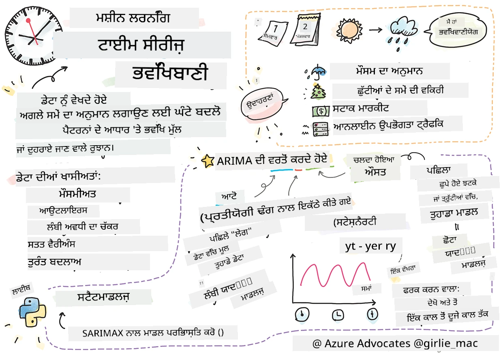
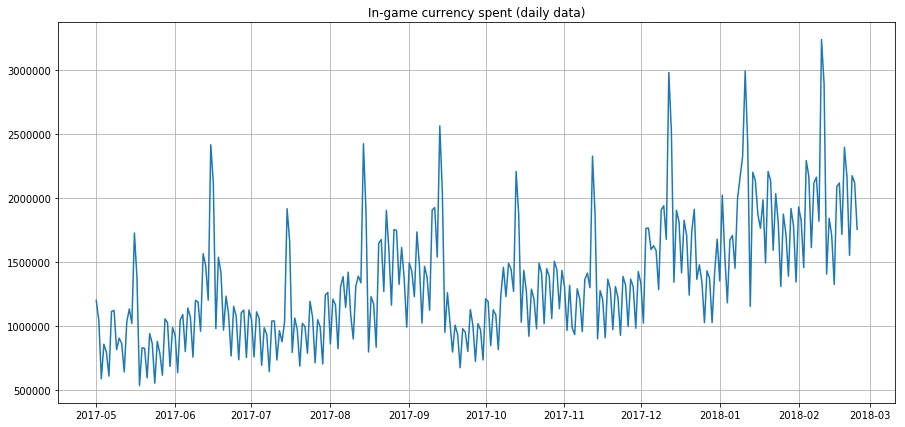
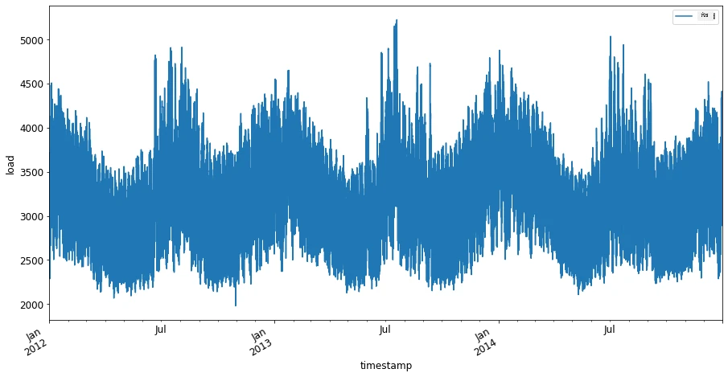
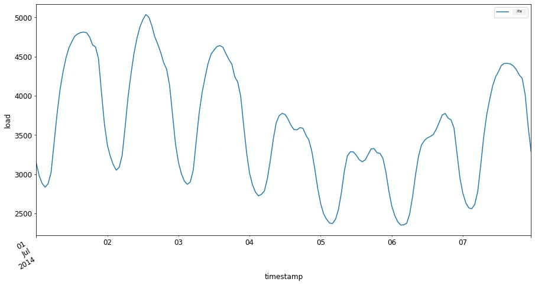

# ਸਮੇਂ ਦੀ ਲੜੀ ਅਨੁਮਾਨ ਲਗਾਉਣ ਦਾ ਪਰਿਚਯ



> ਸਕੈਚਨੋਟ [Tomomi Imura](https://www.twitter.com/girlie_mac) ਵਲੋਂ

ਇਸ ਪਾਠ ਅਤੇ ਅੱਗਲੇ ਵਿਚ, ਤੁਸੀਂ ਸਮੇਂ ਦੀ ਲੜੀ ਅਨੁਮਾਨ ਲਗਾਉਣ ਬਾਰੇ ਕੁਝ ਜਾਣੋਗੇ, ਜੋ ਕਿ ਇੱਕ ਮਨੋਹਰ ਅਤੇ ਕੀਮਤੀ ਹਿੱਸਾ ਹੈ ML ਵਿਗਿਆਨੀ ਦੇ ਕਲੇਕਸ਼ਨ ਦਾ, ਜੋ ਹੋਰ ਵਿਸ਼ਿਆਂ ਨਾਲੋਂ ਥੋੜ੍ਹਾ ਘੱਟ ਜਾਣਿਆ ਜਾਂਦਾ ਹੈ। ਸਮੇਂ ਦੀ ਲੜੀ ਅਨੁਮਾਨ ਲਗਾਉਣਾ ਇੱਕ ਤਰ੍ਹਾਂ ਦਾ 'ਕ੍ਰਿਸਟਲ ਬਾਲ' ਹੈ: ਕਿਸੇ ਵੈਰੀਏਬਲ ਜਿਵੇਂ ਕੀ ਕੀਮਤ ਦੇ ਪਿਛਲੇ ਪ੍ਰਦਰਸ਼ਨ ਦੇ ਆਧਾਰ 'ਤੇ, ਤੁਸੀਂ ਇਸ ਦੀ ਭਵਿੱਖੀ ਸੰਭਾਵਿਤ ਕੀਮਤ ਦੀ ਭਵਿੱਖਬਾਣੀ ਕਰ ਸਕਦੇ ਹੋ।

[](https://youtu.be/cBojo1hsHiI "ਸਮੇਂ ਦੀ ਲੜੀ ਅਨੁਮਾਨ ਲਗਾਉਣ ਦਾ ਪਰਿਚਯ")

> 🎥 ਸਮੇਂ ਦੀ ਲੜੀ ਅਨੁਮਾਨ ਲਗਾਉਣ ਬਾਰੇ ਵੀਡੀਓ ਲਈ ਉੱਪਰ ਦਿੱਤੀ ਤਸਵੀਰ 'ਤੇ ਕਲਿੱਕ ਕਰੋ

## [ਪ੍ਰੀ-ਲੇਕਚਰ ਕੁਇਜ਼](https://ff-quizzes.netlify.app/en/ml/)

ਇਹ ਇੱਕ ਲਾਭਕਾਰੀ ਅਤੇ ਮਨੋਹਰ ਖੇਤਰ ਹੈ ਜਿਸਦਾ ਕਾਰੋਬਾਰ ਵਿੱਚ ਵਾਸਤਵਿਕ ਮੁੱਲ ਹੈ, ਕਿਉਂਕਿ ਇਹ ਮੁਲਾਂਕਣ, ਜਥੇਬੰਦੀ, ਅਤੇ ਸਪਲਾਈ ਚੇਨ ਦੇ ਸਮੱਸਿਆਵਾਂ 'ਤੇ ਸਿੱਧੇ ਤੌਰ 'ਤੇ ਲਾਗੂ ਹੁੰਦਾ ਹੈ। ਹਾਲਾਂਕਿ ਡੀਪ ਲਰਨਿੰਗ ਤਕਨੀਕਾਂ ਨੂੰ ਭਵਿੱਖੀ ਪ੍ਰਦਰਸ਼ਨ ਨੂੰ ਵਧੀਆ ਤਰ੍ਹਾਂ ਭਵਿੱਖਬਾਣੀ ਕਰਨ ਲਈ ਜ਼ਿਆਦਾ ਅੰਦਰੂਨੀ ਜਾਣਕਾਰੀ ਪ੍ਰਾਪਤ ਕਰਨ ਲਈ ਵਰਤਣਾ ਸ਼ੁਰੂ ਕਰ ਦਿੱਤਾ ਗਿਆ ਹੈ, ਸਮੇਂ ਦੀ ਲੜੀ ਅਨੁਮਾਨ ਲਗਾਉਣਾ ਅਜੇ ਵੀ ਕਲਾਸਿਕ ML ਤਕਨੀਕਾਂ ਨਾਲ ਬਹੁਤ ਪ੍ਰਭਾਵਿਤ ਖੇਤਰ ਹੈ।

> ਪੈਨ ਸਟੇਟ ਦਾ ਲਾਭਕਾਰੀ ਸਮੇਂ ਦੀ ਲੜੀ ਯੋਜਨਾ [ਇੱਥੇ](https://online.stat.psu.edu/stat510/lesson/1) ਮਿਲ ਸਕਦੀ ਹੈ

## ਪਰਿਚਯ

ਧਾਰਾ ਕਰੋ ਕਿ ਤੁਸੀਂ ਸਮਾਰਟ ਪਾਰਕਿੰਗ ਮੀਟਰਾਂ ਦੀ ਇਕ ਐਰੇ ਨੂੰ ਦੇਖਭਾਲ ਕਰਦੇ ਹੋ ਜੋ ਇਹ ਡਾਟਾ ਦਿੰਦੇ ਹਨ ਕਿ ਉਹ ਕਿੰਨੀ ਵਾਰ ਅਤੇ ਕਿੰਨੇ ਸਮੇਂ ਲਈ ਵਰਤੇ ਗਏ ਹਨ।

> ਜੇ ਤੁਸੀਂ ਮੀਟਰ ਦੇ ਪਿਛਲੇ ਪ੍ਰਦਰਸ਼ਨ ਦੇ ਆਧਾਰ 'ਤੇ, ਸਪਲਾਈ ਅਤੇ ਡਿਮਾਂਡ ਦੇ ਕਾਨੂੰਨਾਂ ਅਨੁਸਾਰ, ਇਸ ਦੀ ਭਵਿੱਖੀ ਕੀਮਤ ਦੀ ਭਵਿੱਖਬਾਣੀ ਕਰ ਸਕਦੇ ਹੋ ਤਾਂ ਕੀ ਹੁੰਦਾ?

ਸਹੀ ਤਰੀਕੇ ਨਾਲ ਅਗਲੇ ਕਦਮ ਦੀ ਭਵਿੱਖਬਾਣੀ ਕਰਨਾ ਜੋ ਤੁਹਾਡੇ ਲਕੜੀ ਨੂੰ ਪੂਰਾ ਕਰੇ ਇੱਕ ਚੁਣੌਤੀ ਹੈ ਜੋ ਸਮੇਂ ਦੀ ਲੜੀ ਅਨੁਮਾਨ ਲਗਾਉਣ ਰਾਹੀਂ ਹੱਲ ਕੀਤੀ ਜਾ ਸਕਦੀ ਹੈ। ਰੁਜ਼gars਼ੀ ਵਾਰ 'ਤੇ ਵਧੇਰੇ ਚਾਰਜ ਲਾਇਆ ਜਾਣ ਵਾਲਾ ਹੁਣਦਾ ਤਾਂ ਲੋਕ ਖੁਸ਼ ਨਹੀਂ ਹੁੰਦੇ ਪਰ ਇਹ ਸੜਕਾਂ ਨੂੰ ਸਾਫ਼ ਕਰਨ ਲਈ ਵਿੱਤ ਪੈਦਾ ਕਰਨ ਦਾ ਨਿਸ਼ਚਿਤ ਤਰੀਕਾ ਹੁੰਦਾ!

ਆਓ ਸਮੇਂ ਦੀ ਲੜੀ ਦੇ ਕੁਝ ਐਲਗੋਰਿਧਮਾਂ ਦੀਆਂ ਕਿਸਮਾਂ ਨੂੰ ਵੇਖੀਏ ਅਤੇ ਕੁਝ ਡਾਟਾ ਸਾਫ਼ ਕਰਨ ਅਤੇ ਤਿਆਰ ਕਰਨ ਲਈ ਇੱਕ ਨੋਟਬੁੱਕ ਸ਼ੁਰੂ ਕਰੀਏ। ਤੁਸੀਂ ਜਿਹੜਾ ਡਾਟਾ ਵਿਸ਼ਲੇਸ਼ਣ ਕਰੋਗੇ ਉਹ GEFCom2014 ਅਨੁਮਾਨ ਲਗਾਉਣ ਮੁਕਾਬਲੇ ਤੋਂ ਲਿਆਇਆ ਗਿਆ ਹੈ। ਇਹ 2012 ਤੋਂ 2014 ਤੱਕ 3 ਸਾਲਾਂ ਦੇ ਘੰਟੇ ਵਾਰ ਬਿਜਲੀ ਬੋਝ ਅਤੇ ਤਾਪਮਾਨ ਮੁੱਲਾਂ ਦਾ ਸਮੇਤ ਹੈ। ਰਿਕਾਰਡ ਕੀਤੇ ਬਿਜਲੀ ਲੋਡ ਅਤੇ ਤਾਪਮਾਨ ਦੇ ਇਤਿਹਾਸਕ ਨਮੂਨਿਆਂ ਦੇ ਆਧਾਰ 'ਤੇ, ਤੁਸੀਂ ਭਵਿੱਖ ਦੇ ਬਿਜਲੀ ਲੋਡ ਨੂੰ ਅਨੁਮਾਨ ਲਗਾ ਸਕਦੇ ਹੋ।

ਇਸ ਉਦਾਹਰਨ ਵਿੱਚ, ਤੁਸੀਂ ਸਿੱਖੋਗੇ ਕਿ ਕੇਵਲ ਇਤਿਹਾਸਕ ਲੋਡ ਡਾਟਾ ਵਰਤ ਕੇ ਇਕ ਸਮੇਂ ਕਦਮ ਅੱਗੇ ਕਿਵੇਂ ਅਨੁਮਾਨ ਲਗਾਉਣਾ ਹੈ। ਸ਼ੁਰੂ ਕਰਨ ਤੋਂ ਪਹਿਲਾਂ, ਇਹ ਸਮਝਣਾ ਲਾਭਕਾਰੀ ਹੈ ਕਿ ਦ੍ਰਿਸ਼ ਮੰਡਲ ਦੇ ਪਿੱਛੇ ਕੀ ਹੋ ਰਿਹਾ ਹੈ।

## ਕੁਝ ਪਰਿਭਾਸ਼ਾਵਾਂ

'ਸਮੇਂ ਦੀ ਲੜੀ' ਸ਼ਬਦ ਮਿਲਣ 'ਤੇ ਤੁਹਾਨੂੰ ਇਹ ਸਮਝਣਾ ਚਾਹੀਦਾ ਹੈ ਕਿ ਇਹ ਕਈ ਵੱਖ-ਵੱਖ ਸੰਦਰਭਾਂ ਵਿੱਚ ਵਰਤਿਆ ਜਾਂਦਾ ਹੈ।

🎓 **ਸਮੇਂ ਦੀ ਲੜੀ**

ਗਣਿਤ ਵਿੱਚ, "ਸਮੇਂ ਦੀ ਲੜੀ ਉਹ ਡਾਟਾ ਬਿੰਦੂਆਂ ਦੀ ਲੜੀ ਹੁੰਦੀ ਹੈ ਜੋ ਸਮੇਂ ਦੇ ਕ੍ਰਮ ਵਿੱਚ ਸੂਚੀਬੱਧ (ਜਾਂ ਗ੍ਰਾਫ ਕੀਤੇ ਹੋਏ) ਹੁੰਦੇ ਹਨ। ਸਭ ਤੋਂ ਆਮ ਤਰੀਕੇ ਨਾਲ, ਇੱਕ ਸਮੇਂ ਦੀ ਲੜੀ ਸਮੇਂ ਵਿੱਚ ਬਰਾਬਰ ਖੰਡਿਤ ਤੀਕੜੇ 'ਤੇ ਲੈਈ ਗਈ ਲੜੀ ਹੁੰਦੀ ਹੈ।" ਸਮੇਂ ਦੀ ਲੜੀ ਦਾ ਉਦਾਹਰਨ ਹੈ [ਡਾਊ ਜੋਨਜ਼ ਇੰਡਸਟ੍ਰੀਅਲ ਐਵਰੇਜ਼](https://wikipedia.org/wiki/Time_series) ਦਾ ਰੋਜ਼ਾਨਾ ਕਲੋਜ਼ਿੰਗ ਮੁੱਲ। ਸਮੇਂ ਦੀ ਲੜੀ ਦੇ ਚਿੱਤਰ ਅਤੇ ਅੰਕੜਾ ਮਾਡਲਿੰਗ ਪਾਵਣੀ ਪ੍ਰਕਿਰਿਆ, ਮੌਸਮ ਦੇ ਭਵਿੱਖਬਾਣੀ, ਭੂਚਾਲ ਅਨੁਮਾਨ ਅਤੇ ਹੋਰ ਖੇਤਰਾਂ ਵਿੱਚ ਬਹੁਤ ਪ੍ਰਚਲਿਤ ਹਨ ਜਿੱਥੇ ਘਟਨਾਵਾਂ ਹੁੰਦੀਆਂ ਹਨ ਅਤੇ ਡਾਟਾ ਬਿੰਦੂ ਸਮੇਂ ਦੇ ਨਾਲ ਗ੍ਰਾਫ ਕੀਤੇ ਜਾ ਸਕਦੇ ਹਨ।

🎓 **ਸਮੇਂ ਦੀ ਲੜੀ ਵਿਸ਼ਲੇਸ਼ਣ**

ਸਮੇਂ ਦੀ ਲੜੀ ਵਿਸ਼ਲੇਸ਼ਣ ਉਪਰ ਦਿੱਤੇ ਸਮੇਂ ਦੀ ਲੜੀ ਡਾਟਾ ਦੀ ਵਿਸ਼ਲੇਸ਼ਣ ਹੈ। ਸਮੇਂ ਦੀ ਲੜੀ ਡਾਟਾ ਵੱਖ-ਵੱਖ ਰੂਪ ਲੈ ਸਕਦਾ ਹੈ, ਜਿਸ ਵਿੱਚ 'ਰੁੱਕੀ ਹੋਈ ਸਮੇਂ ਦੀ ਲੜੀ' ਵੀ ਸ਼ਾਮਲ ਹੈ ਜੋ ਕਿਸੇ ਰੁਕਾਵਟ ਵਾਕਏ ਤੋਂ ਪਹਿਲਾਂ ਅਤੇ ਬਾਅਦ ਸਮੇਂ ਦੀ ਲੜੀ ਦੇ ਵਿਕਾਸ ਵਿੱਚ ਰੁਝਾਨਾਂ ਦਾ ਪਤਾ ਲਗਾਉਂਦੀ ਹੈ। ਸਮੇਂ ਦੀ ਲੜੀ ਲਈ ਜਰੂਰੀ ਵਿਸ਼ਲੇਸ਼ਣ ਕਿਸਮ ਡਾਟਾ ਦੀ ਕੁਦਰਤ 'ਤੇ ਨਿਰਭਰ ਕਰਦਾ ਹੈ। ਸਮੇਂ ਦੀ ਲੜੀ ਡਾਟਾ ਅੱਖਰਾਂ ਜਾਂ ਅੰਕਾਂ ਦੀ ਲੜੀ ਦੇ ਰੂਪ ਵਿੱਚ ਹੋ ਸਕਦਾ ਹੈ।

ਕੀਤਾ ਜਾਣ ਵਾਲਾ ਵਿਸ਼ਲੇਸ਼ਣ ਵੱਖ-ਵੱਖ ਤਰੀਕਿਆਂ ਦਾ ਉਪਯੋਗ ਕਰਦਾ ਹੈ, ਜਿਸ ਵਿੱਚ ਫ੍ਰਿਕਵੈਂਸੀ-ਡੋਮੇਨ ਅਤੇ ਸਮੇਂ-ਡੋਮੇਨ, ਲੀਨੀਅਰ ਅਤੇ ਗੈਰ-ਲੀਨੀਅਰ, ਅਤੇ ਹੋਰ ਸ਼ਾਮਲ ਹਨ। [ਹੋਰ ਜਾਣੋ](https://www.itl.nist.gov/div898/handbook/pmc/section4/pmc4.htm) ਇਸ ਕਿਸਮ ਦੇ ਡਾਟਾ ਦਾ ਵਿਸ਼ਲੇਸ਼ਣ ਕਰਨ ਦੇ ਕਈ ਤਰੀਕੇ ਬਾਰੇ।

🎓 **ਸਮੇਂ ਦੀ ਲੜੀ ਅਨੁਮਾਨ ਲਗਾਉਣਾ**

ਸਮੇਂ ਦੀ ਲੜੀ ਅਨੁਮਾਨ ਲਗਾਉਣਾ ਇੱਕ ਮਾਡਲ ਦੀ ਵਰਤੋਂ ਕਰਕੇ ਭਵਿੱਖੀ ਮੁੱਲਾਂ ਦੀ ਪੂਰਵ ਅਨੁਮਾਨਾ ਲਗਾਉਣਾ ਹੈ ਜੋ ਪਿਛਲੇ ਡਾਟਾ ਤੋਂ ਪ੍ਰਗਟ ਹੋਏ ਨਮੂਨਿਆਂ 'ਤੇ ਆਧਾਰਿਤ ਹੁੰਦਾ ਹੈ। ਜਦੋਂ ਕਿ ਸਮੇਂ ਦੀ ਲੜੀ ਡਾਟਾ ਨੂੰ ਸਮੇਂ ਦੇ ਅੰਕਾਂ ਨੂੰ x ਚਰ ਵਜੋਂ ਵਰਤ ਕੇ ਰੈਗ੍ਰੈਸ਼ਨ ਮਾਡਲ ਨਾਲ ਪੜਤਾਲ ਕਰਨਾ ਸੰਭਵ ਹੈ, ਇਸ ਤਰ੍ਹਾਂ ਦਾ ਡਾਟਾ ਵਿਸ਼ਲੇਸ਼ਣ ਖਾਸ ਕਿਸਮਾਂ ਦੇ ਮਾਡਲਾਂ ਨਾਲ ਕੀਤਾ ਜਾਣਾ ਚਾਹੀਦਾ ਹੈ।

ਸਮੇਂ ਦੀ ਲੜੀ ਡਾਟਾ ਇੱਕ ਆਰਡਰਡ ਨਿਰੀਖਣਾਂ ਦੀ ਸੂਚੀ ਹੁੰਦੀ ਹੈ, ਜੋ ਕਿ ਸਧਾਰਨ ਰੈਗ੍ਰੈਸ਼ਨ ਨਾਲ ਵਿਸ਼ਲੇਸ਼ਣ ਨਾ ਕੀਤੇ ਜਾ ਸਕਣ ਵਾਲੇ ਡਾਟਾ ਤੋਂ ਵੱਖਰਾ ਹੈ। ਸਭ ਤੋਂ ਆਮ ਮਾਡਲ ਹੈ ARIMA, ਜੋ "ਆਟੋਰੈਗ੍ਰੈਸੀਵ ਇੰਟੇਗਰੇਟਿਡ ਮੂਵਿੰਗ ਐਵਰੇਜ਼" ਲਈ ਅਖਰ ਹੈ।

[ARIMA ਮਾਡਲ](https://online.stat.psu.edu/stat510/lesson/1/1.1) "ਇੱਕ ਲੜੀ ਦੇ ਵਰਤਮਾਨ ਮੁੱਲ ਨੂੰ ਪਿਛਲੇ ਮੁੱਲਾਂ ਅਤੇ ਪਿਛਲੇ ਅਨੁਮਾਨ ਗਲਤੀਆਂ ਨਾਲ ਜੋੜਦੇ ਹਨ।" ਇਹ ਸਭ ਤੋਂ ਉਚਿਤ ਹੁੰਦੇ ਹਨ ਸਮੇਂ-ਡੋਮੇਨ ਡਾਟਾ ਦੇ ਵਿਸ਼ਲੇਸ਼ਣ ਲਈ, ਜਿੱਥੇ ਡਾਟਾ ਸਮੇਂ ਦੇ ਆਰਡਰ ਵਿੱਚ ਹੁੰਦਾ ਹੈ।

> ARIMA ਮਾਡਲਾਂ ਦੀਆਂ ਕਈ ਕਿਸਮਾਂ ਹਨ, ਜਿਨ੍ਹਾਂ ਬਾਰੇ ਤੁਸੀਂ [ਇੱਥੇ](https://people.duke.edu/~rnau/411arim.htm) ਜਾਣ ਸਕਦੇ ਹੋ ਅਤੇ ਜੋ ਤੁਸੀਂ ਅਗਲੇ ਪਾਠ ਵਿੱਚ ਛੂਹੋਗੇ।

ਅਗਲੇ ਪਾਠ ਵਿੱਚ, ਤੁਸੀਂ ਇੱਕ ARIMA ਮਾਡਲ ਬਣਾ ਸਕੋਗੇ ਜੋ [ਯੂਨੀਵੈਰੀਏਟ ਟਾਈਮ ਸੀਰੀਜ਼](https://itl.nist.gov/div898/handbook/pmc/section4/pmc44.htm) 'ਤੇ ਧਿਆਨ ਕੇਂਦਰਤ ਕਰਦਾ ਹੈ, ਜੋ ਇੱਕ ਵੈਰੀਏਬਲ ਨੂੰ ਕਵਰ ਕਰਦਾ ਹੈ ਜੋ ਸਮੇਂ ਦੇ ਨਾਲ ਆਪਣੀ ਕੀਮਤ ਬਦਲਦਾ ਹੈ। ਇਸ ਕਿਸਮ ਦੇ ਡਾਟਾ ਦਾ ਉਦਾਹਰਨ ਹੈ [ਇਹ ਡਾਟਾਸੇਟ](https://itl.nist.gov/div898/handbook/pmc/section4/pmc4411.htm) ਜੋ ਮਾਉਨਾ ਲੋਆ ਐਬਜ਼ਰਵੇਟਰੀ ਵਿੱਚ ਮਹੀਨਾਵਾਰ CO2 ਸੰਘਣਾਪਣ ਨੂੰ ਦਰਜ਼ ਕਰਦਾ ਹੈ:

|  CO2   | YearMonth | ਸਾਲ  | ਮਹੀਨਾ |
| :----: | :-------: | :---: | :---: |
| 330.62 |  1975.04  | 1975  |   1   |
| 331.40 |  1975.13  | 1975  |   2   |
| 331.87 |  1975.21  | 1975  |   3   |
| 333.18 |  1975.29  | 1975  |   4   |
| 333.92 |  1975.38  | 1975  |   5   |
| 333.43 |  1975.46  | 1975  |   6   |
| 331.85 |  1975.54  | 1975  |   7   |
| 330.01 |  1975.63  | 1975  |   8   |
| 328.51 |  1975.71  | 1975  |   9   |
| 328.41 |  1975.79  | 1975  |  10   |
| 329.25 |  1975.88  | 1975  |  11   |
| 330.97 |  1975.96  | 1975  |  12   |

✅ ਇਸ ਡਾਟਾਸੇਟ ਵਿੱਚ ਉਹ ਵੈਰੀਏਬਲ ਪਛਾਣੋ ਜੋ ਸਮੇਂ ਦੇ ਨਾਲ ਬਦਲਦਾ ਹੈ

## ਸਮੇਂ ਦੀ ਲੜੀ ਡਾਟਾ ਦੀਆਂ ਵਿਸ਼ੇਸ਼ਤਾਵਾਂ ਜੋ ਧਿਆਨ ਵਿੱਚ ਲੈਣੀਆਂ ਚਾਹੀਦੀਆਂ ਹਨ

ਜਦੋਂ ਸਮੇਂ ਦੀ ਲੜੀ ਡਾਟਾ ਨੂੰ ਦੇਖਦੇ ਹੋ, ਤਾਂ ਤੁਸੀਂ ਜ਼ਾਹਰ ਕਰ ਸਕਦੇ ਹੋ ਕਿ ਇਸ ਵਿੱਚ [ਕੁਝ ਵਿਸ਼ੇਸ਼ਤਾਵਾਂ](https://online.stat.psu.edu/stat510/lesson/1/1.1) ਹੁੰਦੀਆਂ ਹਨ ਜਿਨ੍ਹਾਂ ਦਾ ਧਿਆਨ ਰੱਖਣਾ ਅਤੇ ਉਨ੍ਹਾਂ ਨੂੰ ਸੁਧਾਰਨਾ ਜ਼ਰੂਰੀ ਹੈ ਤਾਂ ਜੋ ਇਸਦੇ ਨਮੂਨਿਆਂ ਨੂੰ ਬੇਹਤਰ ਸਮਝਿਆ ਜਾ ਸਕੇ। ਜੇ ਤੁਸੀਂ ਸਮੇਂ ਦੀ ਲੜੀ ਡਾਟਾ ਨੂੰ ਇੱਕ 'ਸਿਗਨਲ' ਵਜੋਂ ਦੇਖਦੇ ਹੋ ਜੋ ਤੁਸੀਂ ਵਿਸ਼ਲੇਸ਼ਣ ਕਰਨਾ ਚਾਹੁੰਦੇ ਹੋ, ਤਾਂ ਇਸਦੀ ਵਿਸ਼ੇਸ਼ਤਾਵਾਂ ਨੂੰ 'ਸ਼ੋਰ' ਸਮਝਿਆ ਜਾ ਸਕਦਾ ਹੈ। ਤੁਹਾਨੂੰ ਅਕਸਰ ਇਹ 'ਸ਼ੋਰ' ਘਟਾਉਣ ਲਈ ਕੁਝ ਅੰਕੜਾ ਤਕਨੀਕਾਂ ਦੀ ਵਰਤੋਂ ਨਾਲ ਇਨ੍ਹਾਂ ਵਿਸ਼ੇਸ਼ਤਾਵਾਂ ਨੂੰ ਬਦਲਨਾ ਪੈਂਦਾ ਹੈ।

ਇੱਥੇ ਕੁਝ ਧਾਰਨਾਵਾਂ ਹਨ ਜਿਹਨਾਂ ਨੂੰ ਜਾਣਨਾ ਜ਼ਰੂਰੀ ਹੈ ਤਾਂ ਜੋ ਸਮੇਂ ਦੀ ਲੜੀ ਨਾਲ ਕੰਮ ਕੀਤਾ ਜਾ ਸਕੇ:

🎓 **ਰੁਝਾਨ (ਟ੍ਰੇੰਡਸ)**

ਰੁਝਾਨ ਸਮੇਂ ਦੇ ਨਾਲ ਮਾਪਣਯੋਗ ਵਾਧੇ ਅਤੇ ਘਟਾਓ ਵਜੋਂ ਪਰਿਭਾਸ਼ਿਤ ਹੁੰਦੇ ਹਨ। [ਹੋਰ ਪੜ੍ਹੋ](https://machinelearningmastery.com/time-series-trends-in-python)। ਸਮੇਂ ਦੀ ਲੜੀ ਦੇ ਸੰਦਰਭ ਵਿੱਚ, ਇਹ ਰੁਝਾਨਾਂ ਨੂੰ ਵਰਤਣ ਅਤੇ ਜੇ ਲੋੜ ਹੋਵੇ ਤਾਂ ਹਟਾਉਣ ਬਾਰੇ ਹੈ।

🎓 **[ਮੌਸਮੀਅਤ (ਸੀਜ਼ਨੈਲਿਟੀ)](https://machinelearningmastery.com/time-series-seasonality-with-python/)**

ਮੌਸਮੀਅਤ ਹੇਠ-ਲੇਖਕ ਦੌਰਾਨ ਵਾਪਰਣ ਵਾਲੀਆਂ ਮੁੜਦੇ ਘਟਨਾਵਾਂ ਵਜੋਂ ਪਰਿਭਾਸ਼ਿਤ ਹੁੰਦੀ ਹੈ, ਜਿਵੇਂ ਛੁੱਟੀਆਂ ਦੌਰਾਨ ਵੱਡੀ ਖਰੀਦਦਾਰੀ, ਉਦਾਹਰਨ ਲਈ। [ਇੱਕ ਨਜ਼ਰ ਮਾਰੋ](https://itl.nist.gov/div898/handbook/pmc/section4/pmc443.htm) ਕਿ ਕਿਵੇਂ ਵੱਖ-ਵੱਖ ਪ੍ਰਕਾਰ ਦੇ ਚਿੱਤਰ ਡਾਟਾ ਵਿੱਚ ਮੌਸਮੀਅਤ ਦਰਸਾਉਂਦੇ ਹਨ।

🎓 **ਆਉਟਲਾਇਰ**

ਆਉਟਲਾਇਰ ਮਿਆਰੀ ਡਾਟਾ ਵੈਰੀਅੰਸ ਤੋਂ ਕਾਫੀ ਦੂਰ ਹੁੰਦੇ ਹਨ।

🎓 **ਲੰਬੇ ਸਮੇਂ ਦਾ ਚੱਕਰ**

ਮੌਸਮੀਅਤ ਤੋਂ ਅਲੱਗ, ਡਾਟਾ ਇੱਕ ਲੰਬੀ ਮਿਆਦ ਦਾ ਚੱਕਰ ਦਿਖਾ ਸਕਦਾ ਹੈ, ਜਿਵੇਂ ਇੱਕ ਆਰਥਕ ਮੰਦਗੀ ਜੋ ਇੱਕ ਸਾਲ ਤੋਂ ਵੱਧ ਚੱਲੇ।

🎓 **ਲਗਾਤਾਰ ਵੈਰੀਅੰਸ**

ਸਮੇਂ ਦੇ ਨਾਲ ਕੁਝ ਡਾਟਾ ਲਗਾਤਾਰ ਉਤਾਰ-ਚੜ੍ਹਾਵ ਦਿਖਾਉਂਦਾ ਹੈ, ਜਿਵੇਂ ਦਿਨ ਅਤੇ ਰਾਤ ਦੀ ਊਰਜਾ ਦੀ ਵਰਤੋਂ।

🎓 **ਅਚਾਨਕ ਬਦਲਾਅ**

ਡਾਟਾ ਵਿੱਚ ਅਚਾਨਕ ਬਦਲਾਅ ਹੋ ਸਕਦਾ ਹੈ ਜਿਸ ਲਈ ਹੋਰ ਵਿਸ਼ਲੇਸ਼ਣ ਦੀ ਲੋੜ ਹੋ ਸਕਦੀ ਹੈ। COVID ਦੇ ਕਾਰਨ ਬਿਜ਼ਨਸ ਦੇ ਅਚਾਨਕ ਬੰਦ ਹੋ ਜਾਣ ਨਾਲ ਡਾਟਾ ਵਿੱਚ ਬਦਲਾਅ ਆਇਆ।

✅ ਇੱਥੇ ਇੱਕ [ਨਮੂਨਾ ਸਮੇਂ ਦੀ ਲੜੀ ਚਿੱਤਰ](https://www.kaggle.com/kashnitsky/topic-9-part-1-time-series-analysis-in-python) ਹੈ ਜੋ ਕੁਝ ਸਾਲਾਂ ਵਿੱਚ ਹਰ ਰੋਜ਼ ਖੇਡ ਦੇ ਕਰੰਸੀ ਖਰਚੇ ਦਿਖਾਉਂਦਾ ਹੈ। ਕੀ ਤੁਸੀਂ ਇਸ ਡਾਟਾ ਵਿੱਚ ਉਪਰੋਕਤ ਵਿਸ਼ੇਸ਼ਤਾਵਾਂ ਵਿੱਚੋਂ ਕੋਈ ਪਛਾਣ ਸਕਦੇ ਹੋ?



## ਕਸਰਤ - ਬਿਜਲੀ ਖਪਤ ਡਾਟਾ ਨਾਲ ਸ਼ੁਰੂਆਤ

ਆਓ ਇਸਤੋਂ ਪਹਿਲਾਂ ਕਮਾਈ ਹੋਈ ਬਿਜਲੀ ਖਪਤ ਦੇ ਆਧਾਰ 'ਤੇ ਭਵਿੱਖ ਦੀ ਬਿਜਲੀ ਖਪਤ ਦੀ ਭਵਿੱਖਬਾਣੀ ਕਰਨ ਲਈ ਸਮੇਂ ਦੀ ਲੜੀ ਮਾਡਲ ਬਣਾਈਏ।

> ਇਸ ਉਦਾਹਰਨ ਵਿੱਚ ਡਾਟਾ GEFCom2014 ਅਨੁਮਾਨ ਮੁਕਾਬਲੇ ਤੋਂ ਲਿਆ ਗਿਆ ਹੈ। ਇਹ 2012 ਤੋਂ 2014 ਤੱਕ 3 ਸਾਲਾਂ ਦੀਆਂ ਘੰਟੇਵਾਰ ਬਿਜਲੀ ਲੋਡ ਅਤੇ ਤਾਪਮਾਨ ਮੁੱਲਾਂ ਦਾ ਸਮੇਤ ਹੈ।
>
> Tao Hong, Pierre Pinson, Shu Fan, Hamidreza Zareipour, Alberto Troccoli ਅਤੇ Rob J. Hyndman, "ਸੰਭਾਵਿਤ ਊਰਜਾ ਅਨੁਮਾਨ: ਗ্লੋਬਲ ਊਰਜਾ ਅਨੁਮਾਨ ਮੁਕਾਬਲਾ 2014 ਅਤੇ ਅੱਗੇ", ਇੰਟਰਨੈਸ਼ਨਲ ਜਰਨਲ ਆਫ ਫੋਰਕਾਸਟਿੰਗ, ਵਾਤਾਵਰਨ. 32, ਨੰ.3, ਪੰਨੇ 896-913, ਜੁਲਾਈ-ਸਿਤੰਬਰ, 2016।

1. ਇਸ ਪਾਠ ਦੇ `working` ਫੋਲਡਰ ਵਿੱਚ, _notebook.ipynb_ ਫਾਇਲ ਖੋਲ੍ਹੋ। ਸ਼ੁਰੂ ਕਰੋ ਉਹ ਲਾਇਬ੍ਰੇਰੀਜ਼ ਜੋ ਤੁਹਾਨੂੰ ਡਾਟਾ ਲੋਡ ਕਰਨ ਅਤੇ ਵਿਜ਼ੂਅਲਾਈਜ਼ ਕਰਨ ਵਿੱਚ ਮਦਦ ਕਰਨਗੀਆਂ

    ```python
    import os
    import matplotlib.pyplot as plt
    from common.utils import load_data
    %matplotlib inline
    ```

    ਨੋਟ ਕਰੋ, ਤੁਸੀਂ ਸ਼ਾਮਿਲ ਕੀਤੇ `common` ਫੋਲਡਰ ਫਾਈਲਾਂ ਦੀ ਵਰਤੋਂ ਕਰ ਰਹੇ ਹੋ ਜੋ ਤੁਹਾਡੇ ਵਾਤਾਵਰਨ ਨੂੰ ਸੈਟ ਕਰਦਾ ਹੈ ਅਤੇ ਡਾਟਾ ਡਾਊਨਲੋਡ ਕਰਨ ਦੀ ਦੇਖਭਾਲ ਕਰਦਾ ਹੈ।

2. ਫਿਰ, ਡਾਟਾ ਨੂੰ ਇੱਕ ਡਾਟਾਫਰੇਮ ਵਜੋਂ `load_data()` ਅਤੇ `head()` ਕਾਲ ਕਰਕੇ ਦੇਖੋ:

    ```python
    data_dir = './data'
    energy = load_data(data_dir)[['load']]
    energy.head()
    ```

    ਤੁਸੀਂ ਵੇਖ ਸਕਦੇ ਹੋ ਕਿ ਦੋ ਕਾਲਮ ਹਨ ਜੋ ਤਾਰੀਖ ਅਤੇ ਲੋਡ ਨੂੰ ਦਰਸਾਉਂਦੇ ਹਨ:

    |                     |  ਲੋਡ  |
    | :-----------------: | :----: |
    | 2012-01-01 00:00:00 | 2698.0 |
    | 2012-01-01 01:00:00 | 2558.0 |
    | 2012-01-01 02:00:00 | 2444.0 |
    | 2012-01-01 03:00:00 | 2402.0 |
    | 2012-01-01 04:00:00 | 2403.0 |

3. ਹੁਣ, ਡਾਟਾ ਨੂੰ `plot()` ਕਾਲ ਕਰਕੇ ਚਿੱਤਰਿਤ ਕਰੋ:

    ```python
    energy.plot(y='load', subplots=True, figsize=(15, 8), fontsize=12)
    plt.xlabel('timestamp', fontsize=12)
    plt.ylabel('load', fontsize=12)
    plt.show()
    ```

    

4. ਹੁਣ, ਜੁਲਾਈ 2014 ਦੇ ਪਹਿਲੇ ਹਫ਼ਤੇ ਦਾ ਚਿੱਤਰ ਬਣਾਓ, ਜਿਸਨੂੰ `[from date]: [to date]` ਪੈਟਰਨ ਵਿੱਚ `energy` ਨੂੰ ਦਿੱਤਾ ਗਿਆ ਹੈ:

    ```python
    energy['2014-07-01':'2014-07-07'].plot(y='load', subplots=True, figsize=(15, 8), fontsize=12)
    plt.xlabel('timestamp', fontsize=12)
    plt.ylabel('load', fontsize=12)
    plt.show()
    ```

    

    ਇੱਕ ਖੂਬਸੂਰਤ ਚਿੱਤਰ! ਇਨ੍ਹਾਂ ਚਿੱਤਰਾਂ 'ਤੇ ਨਜ਼ਰ ਮਾਰੋ ਅਤੇ ਦੇਖੋ ਕਿ ਕੀ ਤੁਸੀਂ ਉਪਰ ਦਿੱਤੀ ਵਿਸ਼ੇਸ਼ਤਾਵਾਂ ਵਿੱਚੋਂ ਕੋਈ ਲੱਭ ਸਕਦੇ ਹੋ। ਡਾਟਾ ਨੂੰ ਵਿਜ਼ੂਅਲਾਈਜ਼ ਕਰਕੇ ਅਸੀਂ ਕੀ ਨਤੀਜੇ ਨਿਕਾਲ ਸਕਦੇ ਹਾਂ?

ਅਗਲੇ ਪਾਠ ਵਿੱਚ, ਤੁਸੀਂ ਇੱਕ ARIMA ਮਾਡਲ ਬਣਾਓਗੇ ਜੋ ਕੁਝ ਅਨੁਮਾਨ ਬਣਾਵੇਗਾ।

---

## 🚀ਚੁਣੌਤੀ

ਸਮੇਂ ਦੀ ਲੜੀ ਅਨੁਮਾਨ ਲਗਾਉਣ ਨਾਲ ਲਾਭਾਨਵਿਤ ਹੋਣ ਵਾਲੇ ਸਾਰੇ ਉਦਯੋਗਾਂ ਅਤੇ ਖੋਜ ਖੇਤਰਾਂ ਦੀ ਸੂਚੀ ਬਣਾਓ। ਕੀ ਤੁਸੀਂ ਕਲਾ ਵਿੱਚ, ਅਰਥਸ਼ਾਸਤਰ, ਪਰਿਸਥਿਤੀ ਵਿਗਿਆਨ, ਰਿਟੇਲ, ਉਦਯੋਗ, ਵਿੱਤ ਆਦਿ ਵਿੱਚ ਇਹ ਤਕਨੀਕਾਂ ਦੀ ਵਰਤੋਂ ਬਾਰੇ ਸੋਚ ਸਕਦੇ ਹੋ? ਹੋਰ ਕਿੱਥੇ?

## [ਪੋਸਟ-ਲੇਕਚਰ ਕੁਇਜ਼](https://ff-quizzes.netlify.app/en/ml/)

## ਸਮੀਖਿਆ ਅਤੇ ਸਵੈ-ਅਧਿਐਨ

ਹਾਲਾਂਕਿ ਅਸੀਂ ਇੱਥੇ ਇਸ ਬਾਰੇ ਚਰਚਾ ਨਹੀਂ ਕਰਾਂਗੇ, ਨਿਊਰਲ ਨੈੱਟਵਰਕ ਕਈ ਵਾਰੀ ਸਮੇਂ ਦੀ ਲੜੀ ਅਨੁਮਾਨ ਨੂੰ ਬਿਹਤਰ ਬਣਾਉਣ ਲਈ ਪਰੰਪਰਾਗਤ ਤਰੀਕਿਆਂ ਨੂੰ ਤੇਜ਼ ਕਰਨ ਲਈ ਵਰਤੇ ਜਾਂਦੇ ਹਨ। ਬਾਰੇ ਵਧੇਰੇ ਪੜ੍ਹੋ [ਇਸ ਲੇਖ ਵਿੱਚ](https://medium.com/microsoftazure/neural-networks-for-forecasting-financial-and-economic-time-series-6aca370ff412)

## ਕੱਮ

[ਹੋਰ ਕੁਝ ਸਮੇਂ ਦੀ ਲੜੀ ਦਾ ਵਿਜ਼ੂਅਲਾਈਜ਼ ਕਰੋ](assignment.md)

---

<!-- CO-OP TRANSLATOR DISCLAIMER START -->
**ਅਸਵੀਕਾਰੋਪਣ**:
ਇਸ ਦਸਤਾਵੇਜ਼ ਦਾ ਅਨੁਵਾਦ ਏਆਈ ਅਨੁਵਾਦ ਸੇਵਾ [Co-op Translator](https://github.com/Azure/co-op-translator) ਦੀ ਵਰਤੋਂ ਕਰਕੇ ਕੀਤਾ ਗਿਆ ਹੈ। ਜਦੋਂ ਕਿ ਅਸੀਂ ਸਹੀਤਾਵਾਂ ਲਈ ਯਤਨਸ਼ੀਲ ਹਾਂ, ਕਿਰਪਾ ਕਰਕੇ ਧਿਆਨ ਰੱਖੋ ਕਿ ਸਵੈਚਾਲਿਤ ਅਨੁਵਾਦਾਂ ਵਿੱਚ ਗਲਤੀਆਂ ਜਾਂ ਅਸਮੱਤਿਆਵਾਂ ਹੋ ਸਕਦੀਆਂ ਹਨ। ਮੂਲ ਦਸਤਾਵੇਜ਼ ਆਪਣੀ ਮੂਲ ਭਾਸ਼ਾ ਵਿੱਚ ਅਧਿਕਾਰਕ ਸਰੋਤ ਮੰਨਿਆ ਜਾਣਾ ਚਾਹੀਦਾ ਹੈ। ਜਰੂਰੀ ਜਾਣਕਾਰੀ ਲਈ, ਪੇਸ਼ੇਵਰ ਮਨੁੱਖੀ ਅਨੁਵਾਦ ਦੀ ਸਿਫ਼ਾਰਸ਼ ਕੀਤੀ ਜਾਂਦੀ ਹੈ। ਅਸੀਂ ਇਸ ਅਨੁਵਾਦ ਦੇ ਉਪਯੋਗ ਤੋਂ ਪੈਦਾ ਹੋਣ ਵਾਲੀਆਂ ਕਿਸੇ ਵੀ ਗਲਤਫਹਿਮੀਆਂ ਜਾਂ ਗਲਤ ਵਿਆਖਿਆਵਾਂ ਲਈ ਜਵਾਬਦੇਹ ਨਹੀਂ ਹਾਂ।
<!-- CO-OP TRANSLATOR DISCLAIMER END -->