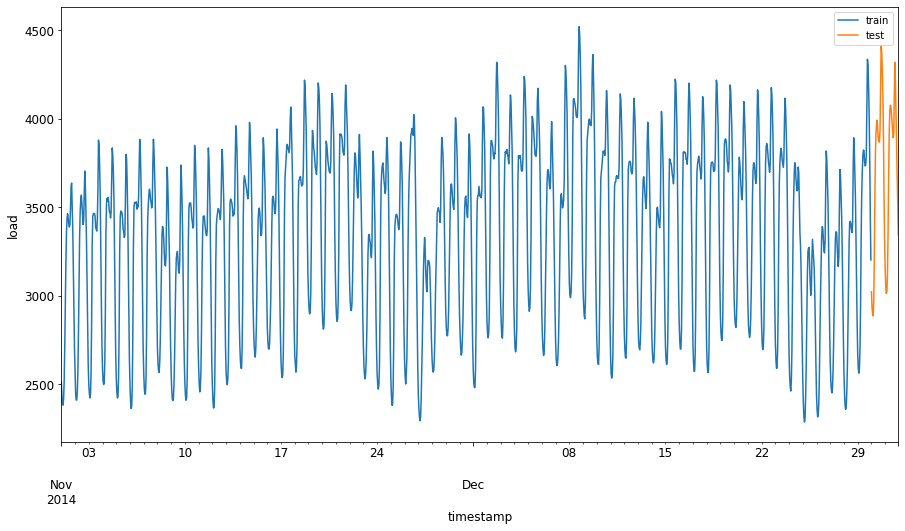

<!--
CO_OP_TRANSLATOR_METADATA:
{
  "original_hash": "2f400075e003e749fdb0d6b3b4787a99",
  "translation_date": "2025-08-29T16:59:56+00:00",
  "source_file": "7-TimeSeries/2-ARIMA/README.md",
  "language_code": "pa"
}
-->
# ਟਾਈਮ ਸੀਰੀਜ਼ ਫੋਰਕਾਸਟਿੰਗ ARIMA ਨਾਲ

ਪਿਛਲੇ ਪਾਠ ਵਿੱਚ, ਤੁਸੀਂ ਟਾਈਮ ਸੀਰੀਜ਼ ਫੋਰਕਾਸਟਿੰਗ ਬਾਰੇ ਕੁਝ ਸਿੱਖਿਆ ਅਤੇ ਇੱਕ ਡਾਟਾਸੈੱਟ ਲੋਡ ਕੀਤਾ ਜੋ ਇੱਕ ਸਮੇਂ ਦੇ ਦੌਰਾਨ ਬਿਜਲੀ ਦੇ ਲੋਡ ਵਿੱਚ ਉਤਾਰ-ਚੜ੍ਹਾਵਾਂ ਦਿਖਾਉਂਦਾ ਹੈ।

[](https://youtu.be/IUSk-YDau10 "ARIMA ਮਾਡਲਾਂ ਦਾ ਪਰਿਚਯ")

> 🎥 ਉੱਪਰ ਦਿੱਤੀ ਤਸਵੀਰ 'ਤੇ ਕਲਿੱਕ ਕਰੋ ਇੱਕ ਵੀਡੀਓ ਲਈ: ARIMA ਮਾਡਲਾਂ ਦਾ ਛੋਟਾ ਜਿਹਾ ਪਰਿਚਯ। ਉਦਾਹਰਣ R ਵਿੱਚ ਕੀਤਾ ਗਿਆ ਹੈ, ਪਰ ਸੰਕਲਪ ਵਿਸ਼ਵਵਿਆਪੀ ਹਨ।

## [ਪਾਠ-ਪਹਿਲਾਂ ਕਵਿਜ਼](https://gray-sand-07a10f403.1.azurestaticapps.net/quiz/43/)

## ਪਰਿਚਯ

ਇਸ ਪਾਠ ਵਿੱਚ, ਤੁਸੀਂ [ARIMA: *A*uto*R*egressive *I*ntegrated *M*oving *A*verage](https://wikipedia.org/wiki/Autoregressive_integrated_moving_average) ਨਾਲ ਮਾਡਲ ਬਣਾਉਣ ਦਾ ਇੱਕ ਖਾਸ ਤਰੀਕਾ ਖੋਜੋਗੇ। ARIMA ਮਾਡਲ ਖਾਸ ਤੌਰ 'ਤੇ ਉਸ ਡਾਟੇ ਲਈ ਉਚਿਤ ਹਨ ਜੋ [ਗੈਰ-ਸਥਿਰਤਾ](https://wikipedia.org/wiki/Stationary_process) ਦਿਖਾਉਂਦਾ ਹੈ।

## ਆਮ ਸੰਕਲਪ

ARIMA ਨਾਲ ਕੰਮ ਕਰਨ ਲਈ, ਕੁਝ ਸੰਕਲਪਾਂ ਨੂੰ ਸਮਝਣਾ ਜ਼ਰੂਰੀ ਹੈ:

- 🎓 **ਸਥਿਰਤਾ (Stationarity)**। ਅੰਕੜੇਵਿਜ਼ ਸੰਦਰਭ ਵਿੱਚ, ਸਥਿਰਤਾ ਉਸ ਡਾਟੇ ਨੂੰ ਕਿਹਾ ਜਾਂਦਾ ਹੈ ਜਿਸ ਦਾ ਵੰਡਨ ਸਮੇਂ ਦੇ ਨਾਲ ਨਹੀਂ ਬਦਲਦਾ। ਗੈਰ-ਸਥਿਰ ਡਾਟਾ ਉਹ ਹੈ ਜੋ ਰੁਝਾਨਾਂ ਦੇ ਕਾਰਨ ਉਤਾਰ-ਚੜ੍ਹਾਵਾਂ ਦਿਖਾਉਂਦਾ ਹੈ, ਜਿਸਨੂੰ ਵਿਸ਼ਲੇਸ਼ਣ ਕਰਨ ਲਈ ਬਦਲਣਾ ਪੈਂਦਾ ਹੈ। ਉਦਾਹਰਣ ਲਈ, ਮੌਸਮੀਅਤ ਡਾਟੇ ਵਿੱਚ ਉਤਾਰ-ਚੜ੍ਹਾਵਾਂ ਪੈਦਾ ਕਰ ਸਕਦੀ ਹੈ, ਜਿਸਨੂੰ 'ਮੌਸਮੀ-ਅੰਤਰ' ਦੀ ਪ੍ਰਕਿਰਿਆ ਦੁਆਰਾ ਹਟਾਇਆ ਜਾ ਸਕਦਾ ਹੈ।

- 🎓 **[ਅੰਤਰਕਰਨ (Differencing)](https://wikipedia.org/wiki/Autoregressive_integrated_moving_average#Differencing)**। ਅੰਤਰਕਰਨ ਦਾ ਮਤਲਬ ਹੈ ਗੈਰ-ਸਥਿਰ ਡਾਟੇ ਨੂੰ ਸਥਿਰ ਬਣਾਉਣ ਲਈ ਬਦਲਣਾ, ਜਿਸ ਨਾਲ ਗੈਰ-ਸਥਿਰ ਰੁਝਾਨ ਹਟਾਏ ਜਾਂਦੇ ਹਨ। "ਅੰਤਰਕਰਨ ਟਾਈਮ ਸੀਰੀਜ਼ ਦੇ ਪੱਧਰ ਵਿੱਚ ਬਦਲਾਵਾਂ ਨੂੰ ਹਟਾਉਂਦਾ ਹੈ, ਰੁਝਾਨ ਅਤੇ ਮੌਸਮੀਅਤ ਨੂੰ ਖਤਮ ਕਰਦਾ ਹੈ ਅਤੇ ਇਸ ਤਰ੍ਹਾਂ ਟਾਈਮ ਸੀਰੀਜ਼ ਦੇ ਮਤਲਬ ਨੂੰ ਸਥਿਰ ਕਰਦਾ ਹੈ।" [ਸ਼ਿਕਸਿਓਂਗ ਆਦਿ ਦੁਆਰਾ ਪੇਪਰ](https://arxiv.org/abs/1904.07632)

## ਟਾਈਮ ਸੀਰੀਜ਼ ਦੇ ਸੰਦਰਭ ਵਿੱਚ ARIMA

ਆਓ ARIMA ਦੇ ਹਿੱਸਿਆਂ ਨੂੰ ਖੋਲ੍ਹ ਕੇ ਸਮਝੀਏ ਕਿ ਇਹ ਟਾਈਮ ਸੀਰੀਜ਼ ਨੂੰ ਮਾਡਲ ਕਰਨ ਅਤੇ ਅਨੁਮਾਨ ਲਗਾਉਣ ਵਿੱਚ ਕਿਵੇਂ ਮਦਦ ਕਰਦਾ ਹੈ।

- **AR - AutoRegressive ਲਈ**। ਆਟੋਰੇਗਰੈਸਿਵ ਮਾਡਲ ਪਿਛਲੇ ਸਮੇਂ ਵਿੱਚ ਵਾਪਸ ਦੇਖਦੇ ਹਨ ਤਾਂ ਜੋ ਡਾਟੇ ਦੇ ਪਿਛਲੇ ਮੁੱਲਾਂ ਦਾ ਵਿਸ਼ਲੇਸ਼ਣ ਕੀਤਾ ਜਾ ਸਕੇ। ਇਹ ਪਿਛਲੇ ਮੁੱਲਾਂ ਨੂੰ 'ਲੈਗ' ਕਿਹਾ ਜਾਂਦਾ ਹੈ। ਉਦਾਹਰਣ ਲਈ, ਜੇ ਡਾਟਾ ਮਹੀਨਾਵਾਰ ਪੈਂਸਲਾਂ ਦੀ ਵਿਕਰੀ ਦਿਖਾਉਂਦਾ ਹੈ, ਤਾਂ ਹਰ ਮਹੀਨੇ ਦੀ ਵਿਕਰੀ ਨੂੰ ਡਾਟਾਸੈੱਟ ਵਿੱਚ ਇੱਕ 'ਵਿਕਾਸਸ਼ੀਲ ਚਰ' ਮੰਨਿਆ ਜਾਵੇਗਾ। ਇਹ ਮਾਡਲ ਇਸ ਤਰ੍ਹਾਂ ਬਣਾਇਆ ਜਾਂਦਾ ਹੈ ਕਿ "ਵਿਕਾਸਸ਼ੀਲ ਚਰ ਦੀ ਰੁਚੀ ਆਪਣੇ ਪਿਛਲੇ (ਅਰਥਾਤ ਪਿਛਲੇ) ਮੁੱਲਾਂ 'ਤੇ ਰਿਗਰੈਸ ਕੀਤੀ ਜਾਂਦੀ ਹੈ।" [ਵਿਕੀਪੀਡੀਆ](https://wikipedia.org/wiki/Autoregressive_integrated_moving_average)

- **I - Integrated ਲਈ**। ARIMA ਵਿੱਚ 'I' ਇਸਦੇ *[ਇੰਟੀਗ੍ਰੇਟਡ](https://wikipedia.org/wiki/Order_of_integration)* ਪੱਖ ਨੂੰ ਦਰਸਾਉਂਦਾ ਹੈ। ਗੈਰ-ਸਥਿਰਤਾ ਨੂੰ ਖਤਮ ਕਰਨ ਲਈ ਅੰਤਰਕਰਨ ਦੇ ਕਦਮ ਲਾਗੂ ਕੀਤੇ ਜਾਂਦੇ ਹਨ।

- **MA - Moving Average ਲਈ**। [ਮੂਵਿੰਗ-ਐਵਰੇਜ](https://wikipedia.org/wiki/Moving-average_model) ਮਾਡਲ ਦਾ ਪੱਖ ਇਸ ਗੱਲ ਨੂੰ ਦਰਸਾਉਂਦਾ ਹੈ ਕਿ ਆਉਟਪੁੱਟ ਵੈਰੀਏਬਲ ਮੌਜੂਦਾ ਅਤੇ ਪਿਛਲੇ ਲੈਗ ਮੁੱਲਾਂ ਦੇ ਅਧੀਨ ਹੁੰਦਾ ਹੈ।

ਸਾਰ: ARIMA ਨੂੰ ਇਸ ਤਰ੍ਹਾਂ ਮਾਡਲ ਬਣਾਉਣ ਲਈ ਵਰਤਿਆ ਜਾਂਦਾ ਹੈ ਜੋ ਟਾਈਮ ਸੀਰੀਜ਼ ਡਾਟੇ ਦੇ ਖਾਸ ਰੂਪ ਨੂੰ ਜਿੰਨਾ ਹੋ ਸਕੇ ਨੇੜੇ ਫਿੱਟ ਕਰ ਸਕੇ।

## ਅਭਿਆਸ - ARIMA ਮਾਡਲ ਬਣਾਓ

ਇਸ ਪਾਠ ਵਿੱਚ [_/working_](https://github.com/microsoft/ML-For-Beginners/tree/main/7-TimeSeries/2-ARIMA/working) ਫੋਲਡਰ ਖੋਲ੍ਹੋ ਅਤੇ [_notebook.ipynb_](https://github.com/microsoft/ML-For-Beginners/blob/main/7-TimeSeries/2-ARIMA/working/notebook.ipynb) ਫਾਈਲ ਲੱਭੋ।

1. ਨੋਟਬੁੱਕ ਚਲਾਓ ਤਾਂ ਜੋ `statsmodels` ਪਾਇਥਨ ਲਾਇਬ੍ਰੇਰੀ ਲੋਡ ਹੋ ਜਾਵੇ; ਤੁਹਾਨੂੰ ARIMA ਮਾਡਲਾਂ ਲਈ ਇਸਦੀ ਲੋੜ ਹੋਵੇਗੀ।

1. ਜ਼ਰੂਰੀ ਲਾਇਬ੍ਰੇਰੀਆਂ ਲੋਡ ਕਰੋ।

1. ਹੁਣ, ਡਾਟੇ ਨੂੰ ਪਲਾਟ ਕਰਨ ਲਈ ਹੋਰ ਲਾਇਬ੍ਰੇਰੀਆਂ ਲੋਡ ਕਰੋ:

    ```python
    import os
    import warnings
    import matplotlib.pyplot as plt
    import numpy as np
    import pandas as pd
    import datetime as dt
    import math

    from pandas.plotting import autocorrelation_plot
    from statsmodels.tsa.statespace.sarimax import SARIMAX
    from sklearn.preprocessing import MinMaxScaler
    from common.utils import load_data, mape
    from IPython.display import Image

    %matplotlib inline
    pd.options.display.float_format = '{:,.2f}'.format
    np.set_printoptions(precision=2)
    warnings.filterwarnings("ignore") # specify to ignore warning messages
    ```

1. `/data/energy.csv` ਫਾਈਲ ਤੋਂ ਡਾਟੇ ਨੂੰ Pandas ਡਾਟਾਫ੍ਰੇਮ ਵਿੱਚ ਲੋਡ ਕਰੋ ਅਤੇ ਵੇਖੋ:

    ```python
    energy = load_data('./data')[['load']]
    energy.head(10)
    ```

1. ਜਨਵਰੀ 2012 ਤੋਂ ਦਸੰਬਰ 2014 ਤੱਕ ਸਾਰੇ ਉਪਲਬਧ ਊਰਜਾ ਡਾਟੇ ਨੂੰ ਪਲਾਟ ਕਰੋ। ਕੋਈ ਹੈਰਾਨੀ ਨਹੀਂ ਹੋਣੀ ਚਾਹੀਦੀ ਕਿਉਂਕਿ ਅਸੀਂ ਇਹ ਡਾਟਾ ਪਿਛਲੇ ਪਾਠ ਵਿੱਚ ਵੇਖਿਆ ਸੀ:

    ```python
    energy.plot(y='load', subplots=True, figsize=(15, 8), fontsize=12)
    plt.xlabel('timestamp', fontsize=12)
    plt.ylabel('load', fontsize=12)
    plt.show()
    ```

    ਹੁਣ, ਆਓ ਇੱਕ ਮਾਡਲ ਬਣਾਈਏ!

### ਟ੍ਰੇਨਿੰਗ ਅਤੇ ਟੈਸਟਿੰਗ ਡਾਟਾਸੈੱਟ ਬਣਾਓ

ਹੁਣ ਤੁਹਾਡਾ ਡਾਟਾ ਲੋਡ ਹੋ ਗਿਆ ਹੈ, ਇਸਨੂੰ ਟ੍ਰੇਨ ਅਤੇ ਟੈਸਟ ਸੈੱਟ ਵਿੱਚ ਵੰਡੋ। ਤੁਸੀਂ ਆਪਣੇ ਮਾਡਲ ਨੂੰ ਟ੍ਰੇਨ ਸੈੱਟ 'ਤੇ ਟ੍ਰੇਨ ਕਰੋਗੇ। ਜਿਵੇਂ ਹੀ ਮਾਡਲ ਟ੍ਰੇਨਿੰਗ ਪੂਰੀ ਕਰ ਲੈਂਦਾ ਹੈ, ਤੁਸੀਂ ਇਸਦੀ ਸ਼ੁੱਧਤਾ ਨੂੰ ਟੈਸਟ ਸੈੱਟ ਦੀ ਵਰਤੋਂ ਕਰਕੇ ਮੁਲਾਂਕਣ ਕਰੋਗੇ। ਤੁਹਾਨੂੰ ਇਹ ਯਕੀਨੀ ਬਣਾਉਣਾ ਚਾਹੀਦਾ ਹੈ ਕਿ ਟੈਸਟ ਸੈੱਟ ਟ੍ਰੇਨਿੰਗ ਸੈੱਟ ਤੋਂ ਬਾਅਦ ਦੇ ਸਮੇਂ ਦੀ ਮਿਆਦ ਨੂੰ ਕਵਰ ਕਰਦਾ ਹੈ ਤਾਂ ਜੋ ਮਾਡਲ ਭਵਿੱਖ ਦੇ ਸਮੇਂ ਦੇ ਅੰਕੜਿਆਂ ਤੋਂ ਜਾਣਕਾਰੀ ਪ੍ਰਾਪਤ ਨਾ ਕਰੇ।

1. 1 ਸਤੰਬਰ ਤੋਂ 31 ਅਕਤੂਬਰ 2014 ਤੱਕ ਦੀ ਦੋ ਮਹੀਨੇ ਦੀ ਮਿਆਦ ਨੂੰ ਟ੍ਰੇਨਿੰਗ ਸੈੱਟ ਲਈ ਵੰਡੋ। ਟੈਸਟ ਸੈੱਟ ਵਿੱਚ 1 ਨਵੰਬਰ ਤੋਂ 31 ਦਸੰਬਰ 2014 ਤੱਕ ਦੀ ਦੋ ਮਹੀਨੇ ਦੀ ਮਿਆਦ ਸ਼ਾਮਲ ਹੋਵੇਗੀ:

    ```python
    train_start_dt = '2014-11-01 00:00:00'
    test_start_dt = '2014-12-30 00:00:00'
    ```

    ਕਿਉਂਕਿ ਇਹ ਡਾਟਾ ਊਰਜਾ ਦੀ ਦਿਨ-ਪ੍ਰਤੀ-ਦਿਨ ਖਪਤ ਨੂੰ ਦਰਸਾਉਂਦਾ ਹੈ, ਇਸ ਵਿੱਚ ਇੱਕ ਮਜ਼ਬੂਤ ਮੌਸਮੀ ਪੈਟਰਨ ਹੈ, ਪਰ ਖਪਤ ਹਾਲ ਹੀ ਦੇ ਦਿਨਾਂ ਵਿੱਚ ਹੋਣ ਵਾਲੀ ਖਪਤ ਦੇ ਸਭ ਤੋਂ ਵੱਧ ਸਮਾਨ ਹੈ।

1. ਅੰਤਰਾਂ ਨੂੰ ਦ੍ਰਿਸ਼ਮਾਨ ਬਣਾਓ:

    ```python
    energy[(energy.index < test_start_dt) & (energy.index >= train_start_dt)][['load']].rename(columns={'load':'train'}) \
        .join(energy[test_start_dt:][['load']].rename(columns={'load':'test'}), how='outer') \
        .plot(y=['train', 'test'], figsize=(15, 8), fontsize=12)
    plt.xlabel('timestamp', fontsize=12)
    plt.ylabel('load', fontsize=12)
    plt.show()
    ```

    

    ਇਸ ਲਈ, ਡਾਟੇ ਨੂੰ ਟ੍ਰੇਨ ਕਰਨ ਲਈ ਇੱਕ ਸਪੱਸ਼ਟ ਸਮੇਂ ਦੀ ਛੋਟੀ ਖਿੜਕੀ ਵਰਤਣਾ ਕਾਫ਼ੀ ਹੋਣਾ ਚਾਹੀਦਾ ਹੈ।

    > ਨੋਟ: ਕਿਉਂਕਿ ਅਸੀਂ ARIMA ਮਾਡਲ ਨੂੰ ਫਿੱਟ ਕਰਨ ਲਈ ਵਰਤਦੇ ਫੰਕਸ਼ਨ ਵਿੱਚ ਇਨ-ਸੈਂਪਲ ਵੈਲੀਡੇਸ਼ਨ ਦੀ ਵਰਤੋਂ ਕਰਦੇ ਹਾਂ, ਅਸੀਂ ਵੈਲੀਡੇਸ਼ਨ ਡਾਟੇ ਨੂੰ ਛੱਡ ਦੇਵਾਂਗੇ।

### ਟ੍ਰੇਨਿੰਗ ਲਈ ਡਾਟੇ ਦੀ ਤਿਆਰੀ

ਹੁਣ, ਤੁਹਾਨੂੰ ਫਿਲਟਰਿੰਗ ਅਤੇ ਸਕੇਲਿੰਗ ਦੁਆਰਾ ਆਪਣੇ ਡਾਟੇ ਨੂੰ ਟ੍ਰੇਨਿੰਗ ਲਈ ਤਿਆਰ ਕਰਨ ਦੀ ਲੋੜ ਹੈ। ਆਪਣੇ ਡਾਟਾਸੈੱਟ ਨੂੰ ਸਿਰਫ਼ ਜ਼ਰੂਰੀ ਸਮੇਂ ਦੀ ਮਿਆਦ ਅਤੇ ਕਾਲਮ ਸ਼ਾਮਲ ਕਰਨ ਲਈ ਫਿਲਟਰ ਕਰੋ, ਅਤੇ ਡਾਟੇ ਨੂੰ 0,1 ਦੇ ਅੰਤਰਾਲ ਵਿੱਚ ਪ੍ਰੋਜੈਕਟ ਕਰਨ ਲਈ ਸਕੇਲ ਕਰੋ।

1. ਮੂਲ ਡਾਟਾਸੈੱਟ ਨੂੰ ਸਿਰਫ਼ ਉਪਰੋਕਤ ਸਮੇਂ ਦੀ ਮਿਆਦ ਅਤੇ ਸਿਰਫ਼ ਲੋੜੀਂਦੇ ਕਾਲਮ 'ਲੋਡ' ਅਤੇ ਮਿਤੀ ਸ਼ਾਮਲ ਕਰਨ ਲਈ ਫਿਲਟਰ ਕਰੋ:

    ```python
    train = energy.copy()[(energy.index >= train_start_dt) & (energy.index < test_start_dt)][['load']]
    test = energy.copy()[energy.index >= test_start_dt][['load']]

    print('Training data shape: ', train.shape)
    print('Test data shape: ', test.shape)
    ```

    ਤੁਸੀਂ ਡਾਟੇ ਦੇ ਆਕਾਰ ਨੂੰ ਵੇਖ ਸਕਦੇ ਹੋ:

    ```output
    Training data shape:  (1416, 1)
    Test data shape:  (48, 1)
    ```

1. ਡਾਟੇ ਨੂੰ (0, 1) ਦੀ ਰੇਂਜ ਵਿੱਚ ਸਕੇਲ ਕਰੋ।

    ```python
    scaler = MinMaxScaler()
    train['load'] = scaler.fit_transform(train)
    train.head(10)
    ```

1. ਮੂਲ ਅਤੇ ਸਕੇਲ ਕੀਤੇ ਡਾਟੇ ਨੂੰ ਦ੍ਰਿਸ਼ਮਾਨ ਬਣਾਓ:

    ```python
    energy[(energy.index >= train_start_dt) & (energy.index < test_start_dt)][['load']].rename(columns={'load':'original load'}).plot.hist(bins=100, fontsize=12)
    train.rename(columns={'load':'scaled load'}).plot.hist(bins=100, fontsize=12)
    plt.show()
    ```

    

    > ਮੂਲ ਡਾਟਾ

    

    > ਸਕੇਲ ਕੀਤਾ ਡਾਟਾ

1. ਹੁਣ ਜਦੋਂ ਤੁਸੀਂ ਸਕੇਲ ਕੀਤੇ ਡਾਟੇ ਨੂੰ ਕੈਲੀਬ੍ਰੇਟ ਕਰ ਲਿਆ ਹੈ, ਤੁਸੀਂ ਟੈਸਟ ਡਾਟੇ ਨੂੰ ਸਕੇਲ ਕਰ ਸਕਦੇ ਹੋ:

    ```python
    test['load'] = scaler.transform(test)
    test.head()
    ```

### ARIMA ਲਾਗੂ ਕਰੋ

ਹੁਣ ਸਮਾਂ ਆ ਗਿਆ ਹੈ ARIMA ਲਾਗੂ ਕਰਨ ਦਾ! ਤੁਸੀਂ ਹੁਣ `statsmodels` ਲਾਇਬ੍ਰੇਰੀ ਦੀ ਵਰਤੋਂ ਕਰੋਗੇ ਜੋ ਤੁਸੀਂ ਪਹਿਲਾਂ ਇੰਸਟਾਲ ਕੀਤੀ ਸੀ।

ਹੁਣ ਤੁਹਾਨੂੰ ਕੁਝ ਕਦਮਾਂ ਦੀ ਪਾਲਣਾ ਕਰਨ ਦੀ ਲੋੜ ਹੈ:

1. ਮਾਡਲ ਨੂੰ ਪਰਿਭਾਸ਼ਿਤ ਕਰੋ `SARIMAX()` ਨੂੰ ਕਾਲ ਕਰਕੇ ਅਤੇ ਮਾਡਲ ਪੈਰਾਮੀਟਰ: p, d, ਅਤੇ q ਪੈਰਾਮੀਟਰ, ਅਤੇ P, D, ਅਤੇ Q ਪੈਰਾਮੀਟਰ ਪਾਸ ਕਰਕੇ।
2. ਟ੍ਰੇਨਿੰਗ ਡਾਟੇ ਲਈ ਮਾਡਲ ਨੂੰ ਤਿਆਰ ਕਰੋ `fit()` ਫੰਕਸ਼ਨ ਨੂੰ ਕਾਲ ਕਰਕੇ।
3. ਅਨੁਮਾਨ ਲਗਾਓ `forecast()` ਫੰਕਸ਼ਨ ਨੂੰ ਕਾਲ ਕਰਕੇ ਅਤੇ ਅਨੁਮਾਨ ਲਗਾਉਣ ਲਈ ਕਦਮਾਂ ਦੀ ਗਿਣਤੀ (ਹੋਰਾਈਜ਼ਨ) ਨਿਰਧਾਰਤ ਕਰੋ।

> 🎓 ਇਹ ਸਾਰੇ ਪੈਰਾਮੀਟਰ ਕਿਸ ਲਈ ਹਨ? ARIMA ਮਾਡਲ ਵਿੱਚ 3 ਪੈਰਾਮੀਟਰ ਹੁੰਦੇ ਹਨ ਜੋ ਟਾਈਮ ਸੀਰੀਜ਼ ਦੇ ਮੁੱਖ ਪੱਖਾਂ ਨੂੰ ਮਾਡਲ ਕਰਨ ਵਿੱਚ ਮਦਦ ਕਰਦੇ ਹਨ: ਮੌਸਮੀਅਤ, ਰੁਝਾਨ, ਅਤੇ ਸ਼ੋਰ। ਇਹ ਪੈਰਾਮੀਟਰ ਹਨ:

`p`: ਮਾਡਲ ਦੇ ਆਟੋ-ਰੇਗਰੈਸਿਵ ਪੱਖ ਨਾਲ ਸੰਬੰਧਿਤ ਪੈਰਾਮੀਟਰ, ਜੋ ਪਿਛਲੇ ਮੁੱਲਾਂ ਨੂੰ ਸ਼ਾਮਲ ਕਰਦਾ ਹੈ।  
`d`: ਮਾਡਲ ਦੇ ਇੰਟੀਗ੍ਰੇਟਡ ਪੱਖ ਨਾਲ ਸੰਬੰਧਿਤ ਪੈਰਾਮੀਟਰ, ਜੋ ਟਾਈਮ ਸੀਰੀਜ਼ 'ਤੇ ਲਾਗੂ ਕੀਤੇ ਜਾਣ ਵਾਲੇ ਅੰਤਰਕਰਨ ਦੀ ਮਾਤਰਾ ਨੂੰ ਪ੍ਰਭਾਵਿਤ ਕਰਦਾ ਹੈ।  
`q`: ਮਾਡਲ ਦੇ ਮੂਵਿੰਗ-ਐਵਰੇਜ ਪੱਖ ਨਾਲ ਸੰਬੰਧਿਤ ਪੈਰਾਮੀਟਰ।  

> ਨੋਟ: ਜੇ ਤੁਹਾਡੇ ਡਾਟੇ ਵਿੱਚ ਮੌਸਮੀ ਪੱਖ ਹੈ - ਜੋ ਕਿ ਇਸ ਡਾਟੇ ਵਿੱਚ ਹੈ - , ਅਸੀਂ ਮੌਸਮੀ ARIMA ਮਾਡਲ (SARIMA) ਦੀ ਵਰਤੋਂ ਕਰਦੇ ਹਾਂ। ਇਸ ਮਾਮਲੇ ਵਿੱਚ ਤੁਹਾਨੂੰ ਹੋਰ ਪੈਰਾਮੀਟਰ ਦੀ ਲੋੜ ਹੈ: `P`, `D`, ਅਤੇ `Q` ਜੋ `p`, `d`, ਅਤੇ `q` ਦੇ ਸਮਾਨ ਸੰਬੰਧਾਂ ਨੂੰ ਦਰਸਾਉਂਦੇ ਹਨ, ਪਰ ਮਾਡਲ ਦੇ ਮੌਸਮੀ ਪੱਖਾਂ ਨਾਲ ਸੰਬੰਧਿਤ ਹਨ।

1. ਪਹਿਲਾਂ ਆਪਣੀ ਪਸੰਦੀਦਾ ਹੋਰਾਈਜ਼ਨ ਮੁੱਲ ਸੈੱਟ ਕਰੋ। ਆਓ 3 ਘੰਟਿਆਂ ਦੀ ਕੋਸ਼ਿਸ਼ ਕਰੀਏ:

    ```python
    # Specify the number of steps to forecast ahead
    HORIZON = 3
    print('Forecasting horizon:', HORIZON, 'hours')
    ```

    ARIMA ਮਾਡਲ ਦੇ ਪੈਰਾਮੀਟਰਾਂ ਲਈ ਸਭ ਤੋਂ ਵਧੀਆ ਮੁੱਲਾਂ ਦੀ ਚੋਣ ਕਰਨਾ ਚੁਣੌਤੀਪੂਰਨ ਹੋ ਸਕਦਾ ਹੈ ਕਿਉਂਕਿ ਇਹ ਕੁਝ ਹੱਦ ਤੱਕ ਵਿਅਕਤੀਗਤ ਅਤੇ ਸਮੇਂ-ਖਪਤ ਵਾਲਾ ਹੁੰਦਾ ਹੈ। ਤੁਸੀਂ [`pyramid` ਲਾਇਬ੍ਰੇਰੀ](https://alkaline-ml.com/pmdarima/0.9.0/modules/generated/pyramid.arima.auto_arima.html) ਤੋਂ `auto_arima()` ਫੰਕਸ਼ਨ ਦੀ ਵਰਤੋਂ ਕਰਨ ਬਾਰੇ ਸੋਚ ਸਕਦੇ ਹੋ।

1. ਹੁਣ ਕੁਝ ਮੈਨੂਅਲ ਚੋਣਾਂ ਦੀ ਕੋਸ਼ਿਸ਼ ਕਰੋ ਤਾਂ ਜੋ ਇੱਕ ਵਧੀਆ ਮਾਡਲ ਲੱਭ ਸਕੋ।

    ```python
    order = (4, 1, 0)
    seasonal_order = (1, 1, 0, 24)

    model = SARIMAX(endog=train, order=order, seasonal_order=seasonal_order)
    results = model.fit()

    print(results.summary())
    ```

    ਨਤੀਜਿਆਂ ਦੀ ਇੱਕ ਸਾਰਣੀ ਪ੍ਰਿੰਟ ਕੀਤੀ ਜਾਂਦੀ ਹੈ।

ਤੁਸੀਂ ਆਪਣਾ ਪਹਿਲਾ ਮਾਡਲ ਬਣਾਇਆ ਹੈ! ਹੁਣ ਸਾਨੂੰ ਇਸਨੂੰ ਮੁਲਾਂਕਣ ਕਰਨ ਦਾ ਤਰੀਕਾ ਲੱਭਣ ਦੀ ਲੋੜ ਹੈ।

### ਆਪਣੇ ਮਾਡਲ ਦਾ ਮੁਲਾਂਕਣ ਕਰੋ

ਆਪਣੇ ਮਾਡਲ ਦਾ ਮੁਲਾਂਕਣ ਕਰਨ ਲਈ, ਤੁਸੀਂ ਇਸਨੂੰ `ਵਾਕ ਫਾਰਵਰਡ` ਵੈਲੀਡੇਸ਼ਨ ਦੇ ਰਾਹੀਂ ਕਰ ਸਕਦੇ ਹੋ। ਅਮਲ ਵਿੱਚ, ਟਾਈਮ ਸੀਰੀਜ਼ ਮਾਡਲ ਹਰ ਵਾਰ ਨਵਾਂ ਡਾਟਾ ਉਪਲਬਧ ਹੋਣ 'ਤੇ ਦੁਬਾਰਾ ਟ੍ਰੇਨ ਕੀਤਾ ਜਾਂਦਾ ਹੈ। ਇਹ ਮਾਡਲ ਨੂੰ ਹਰ ਸਮੇਂ ਦੇ ਕਦਮ 'ਤੇ ਸਭ ਤੋਂ ਵਧੀਆ ਅਨੁਮਾਨ ਲਗਾਉਣ ਦੀ ਆਗਿਆ ਦਿੰਦਾ ਹੈ।

ਇਸ ਤਕਨੀਕ ਦੀ ਵਰਤੋਂ ਕਰਦੇ ਹੋਏ ਟਾਈਮ ਸੀਰੀਜ਼ ਦੇ ਸ਼ੁਰੂ ਵਿੱਚ ਟ੍ਰੇਨ ਡਾਟਾ ਸੈੱਟ 'ਤੇ ਮਾਡਲ ਨੂੰ ਟ੍ਰੇਨ ਕਰੋ। ਫਿਰ ਅਗਲੇ ਸਮੇਂ ਦੇ ਕਦਮ 'ਤੇ ਇੱਕ ਅਨੁਮਾਨ ਲਗਾਓ। ਅਨੁਮਾਨ ਨੂੰ ਜਾਣੇ-ਪਛਾਣੇ ਮੁੱਲ ਦੇ ਖਿਲਾਫ ਮੁਲਾਂਕਣ ਕੀਤਾ ਜਾਂਦਾ ਹੈ। ਫਿਰ ਟ੍ਰੇਨਿੰਗ ਸੈੱਟ ਨੂੰ ਜਾਣੇ-ਪਛਾਣੇ ਮੁੱਲ ਨੂੰ ਸ਼ਾਮਲ ਕਰਨ ਲਈ ਵਧਾਇਆ ਜਾਂਦਾ ਹੈ ਅਤੇ ਪ੍ਰਕਿਰਿਆ ਨੂੰ ਦੁਹਰਾਇਆ ਜਾਂਦਾ ਹੈ।

> ਨੋਟ: ਤੁਹਾਨੂੰ ਟ੍ਰੇਨਿੰਗ ਸੈੱਟ ਦੀ ਖਿੜਕੀ ਨੂੰ ਜ਼ਿਆਦਾ ਕੁਸ਼ਲ ਟ੍ਰੇਨਿੰਗ ਲਈ ਸਥਿਰ ਰੱਖਣਾ ਚਾਹੀਦਾ ਹੈ ਤਾਂ ਜੋ ਹਰ ਵਾਰ ਤੁਸੀਂ ਟ੍ਰੇਨਿੰਗ ਸੈੱਟ ਵਿੱਚ ਇੱਕ ਨਵਾਂ ਅਵਲੋਕਨ ਸ਼ਾਮਲ ਕਰੋ, ਤੁਸੀਂ ਸੈੱਟ ਦੇ ਸ਼ੁਰੂ ਤੋਂ ਅਵਲੋਕਨ ਨੂੰ ਹਟਾ ਦਿਓ।

ਇਹ ਪ੍ਰਕਿਰਿਆ ਇਸ ਗੱਲ ਦਾ ਇੱਕ ਵਧੀਆ ਅੰਦਾਜ਼ਾ ਪ੍ਰਦਾਨ ਕਰਦੀ ਹੈ ਕਿ ਅਮਲ ਵਿੱਚ ਮਾਡਲ ਕਿਵੇਂ ਕੰਮ ਕਰੇਗਾ। ਹਾਲਾਂਕਿ, ਇਹ ਬਹੁਤ ਸਾਰੇ ਮਾਡਲ ਬਣਾਉਣ ਦੀ ਗਣਨਾ ਦੀ ਲਾਗਤ 'ਤੇ ਆਉਂਦਾ ਹੈ। ਜੇ ਡਾਟਾ ਛੋਟਾ ਹੈ ਜਾਂ ਮਾਡਲ ਸਧਾਰਨ ਹੈ ਤਾਂ ਇਹ ਸਵੀਕਾਰਯੋਗ ਹੈ, ਪਰ ਵੱਡੇ ਪੱਧਰ 'ਤੇ ਇਹ ਸਮੱਸਿਆ ਹੋ ਸਕਦੀ ਹੈ।

ਵਾਕ-ਫਾਰਵਰਡ ਵੈਲੀਡੇਸ਼ਨ ਟਾਈਮ ਸੀਰੀਜ਼ ਮਾਡਲ ਮੁਲਾਂਕਣ ਦਾ ਸੋਨੇ ਦਾ ਮਿਆਰ ਹੈ ਅਤੇ ਤੁਹਾਡੇ ਆਪਣੇ ਪ੍ਰੋਜੈਕਟਾਂ ਲਈ ਸਿਫਾਰਸ਼ ਕੀਤੀ ਜਾਂਦੀ ਹੈ।


> **🧮 ਗਣਿਤ ਦਿਖਾਓ**
>
> 
>
> [MAPE](https://www.linkedin.com/pulse/what-mape-mad-msd-time-series-allameh-statistics/) ਦੀ ਵਰਤੋਂ ਪੇਸ਼ਗੋਈ ਦੀ ਸਹੀਤਾ ਨੂੰ ਦਰਸਾਉਣ ਲਈ ਕੀਤੀ ਜਾਂਦੀ ਹੈ, ਜੋ ਉਪਰੋਕਤ ਫਾਰਮੂਲੇ ਦੁਆਰਾ ਪਰਿਭਾਸ਼ਿਤ ਅਨੁਪਾਤ ਹੈ। ਅਸਲ ਅਤੇ ਅਨੁਮਾਨਿਤ ਦੇ ਵਿਚਕਾਰ ਅੰਤਰ ਨੂੰ ਅਸਲ ਨਾਲ ਵੰਡਿਆ ਜਾਂਦਾ ਹੈ।
>
> "ਇਸ ਗਣਨਾ ਵਿੱਚ ਮੂਲ ਭਾਵ ਨੂੰ ਹਰ ਪੇਸ਼ਗੀਤ ਸਮੇਂ ਦੇ ਬਿੰਦੂ ਲਈ ਜੋੜਿਆ ਜਾਂਦਾ ਹੈ ਅਤੇ ਫਿੱਟ ਕੀਤੇ ਗਏ ਬਿੰਦੂਆਂ ਦੀ ਗਿਣਤੀ n ਨਾਲ ਵੰਡਿਆ ਜਾਂਦਾ ਹੈ।" [ਵਿਕੀਪੀਡੀਆ](https://wikipedia.org/wiki/Mean_absolute_percentage_error)
1. ਸਮੀਕਰਨ ਨੂੰ ਕੋਡ ਵਿੱਚ ਪ੍ਰਗਟ ਕਰੋ:

    ```python
    if(HORIZON > 1):
        eval_df['APE'] = (eval_df['prediction'] - eval_df['actual']).abs() / eval_df['actual']
        print(eval_df.groupby('h')['APE'].mean())
    ```

1. ਇੱਕ ਕਦਮ ਦੇ MAPE ਦੀ ਗਣਨਾ ਕਰੋ:

    ```python
    print('One step forecast MAPE: ', (mape(eval_df[eval_df['h'] == 't+1']['prediction'], eval_df[eval_df['h'] == 't+1']['actual']))*100, '%')
    ```

    ਇੱਕ ਕਦਮ ਦੀ ਭਵਿੱਖਵਾਣੀ MAPE:  0.5570581332313952 %

1. ਬਹੁ-ਕਦਮ ਦੀ ਭਵਿੱਖਵਾਣੀ MAPE ਪ੍ਰਿੰਟ ਕਰੋ:

    ```python
    print('Multi-step forecast MAPE: ', mape(eval_df['prediction'], eval_df['actual'])*100, '%')
    ```

    ```output
    Multi-step forecast MAPE:  1.1460048657704118 %
    ```

    ਇੱਕ ਵਧੀਆ ਘੱਟ ਸੰਖਿਆ ਸਭ ਤੋਂ ਚੰਗੀ ਹੈ: ਸੋਚੋ ਕਿ ਜੇਕਰ ਕਿਸੇ ਭਵਿੱਖਵਾਣੀ ਦਾ MAPE 10 ਹੈ, ਤਾਂ ਇਸਦਾ ਮਤਲਬ ਹੈ ਕਿ ਇਹ 10% ਤੱਕ ਗਲਤ ਹੈ।

1. ਪਰ ਹਮੇਸ਼ਾ ਦੀ ਤਰ੍ਹਾਂ, ਇਸ ਤਰ੍ਹਾਂ ਦੀ ਸਹੀ ਮਾਪ ਨੂੰ ਵਿਜੁਅਲ ਤੌਰ 'ਤੇ ਦੇਖਣਾ ਆਸਾਨ ਹੁੰਦਾ ਹੈ, ਤਾਂ ਆਓ ਇਸਨੂੰ ਪਲਾਟ ਕਰੀਏ:

    ```python
     if(HORIZON == 1):
        ## Plotting single step forecast
        eval_df.plot(x='timestamp', y=['actual', 'prediction'], style=['r', 'b'], figsize=(15, 8))

    else:
        ## Plotting multi step forecast
        plot_df = eval_df[(eval_df.h=='t+1')][['timestamp', 'actual']]
        for t in range(1, HORIZON+1):
            plot_df['t+'+str(t)] = eval_df[(eval_df.h=='t+'+str(t))]['prediction'].values

        fig = plt.figure(figsize=(15, 8))
        ax = plt.plot(plot_df['timestamp'], plot_df['actual'], color='red', linewidth=4.0)
        ax = fig.add_subplot(111)
        for t in range(1, HORIZON+1):
            x = plot_df['timestamp'][(t-1):]
            y = plot_df['t+'+str(t)][0:len(x)]
            ax.plot(x, y, color='blue', linewidth=4*math.pow(.9,t), alpha=math.pow(0.8,t))

        ax.legend(loc='best')

    plt.xlabel('timestamp', fontsize=12)
    plt.ylabel('load', fontsize=12)
    plt.show()
    ```

    

🏆 ਇੱਕ ਬਹੁਤ ਵਧੀਆ ਪਲਾਟ, ਜੋ ਇੱਕ ਮਾਡਲ ਨੂੰ ਚੰਗੀ ਸਹੀਤਾ ਨਾਲ ਦਿਖਾਉਂਦਾ ਹੈ। ਸ਼ਾਬਾਸ਼!

---

## 🚀ਚੁਣੌਤੀ

ਸਮੇਂ ਦੀ ਲੜੀ ਮਾਡਲ ਦੀ ਸਹੀਤਾ ਦੀ ਜਾਂਚ ਕਰਨ ਦੇ ਤਰੀਕਿਆਂ ਵਿੱਚ ਖੋਜ ਕਰੋ। ਅਸੀਂ ਇਸ ਪਾਠ ਵਿੱਚ MAPE ਬਾਰੇ ਗੱਲ ਕਰਦੇ ਹਾਂ, ਪਰ ਕੀ ਹੋਰ ਤਰੀਕੇ ਹਨ ਜੋ ਤੁਸੀਂ ਵਰਤ ਸਕਦੇ ਹੋ? ਉਨ੍ਹਾਂ ਦੀ ਖੋਜ ਕਰੋ ਅਤੇ ਉਨ੍ਹਾਂ ਨੂੰ ਵਿਆਖਿਆਤਮਕ ਬਣਾਓ। ਇੱਕ ਮਦਦਗਾਰ ਦਸਤਾਵੇਜ਼ [ਇੱਥੇ](https://otexts.com/fpp2/accuracy.html) ਮਿਲ ਸਕਦਾ ਹੈ।

## [ਪਾਠ-ਪ੍ਰਸ਼ਨੋਤਰੀ](https://gray-sand-07a10f403.1.azurestaticapps.net/quiz/44/)

## ਸਮੀਖਿਆ ਅਤੇ ਖੁਦ ਅਧਿਐਨ

ਇਹ ਪਾਠ ARIMA ਨਾਲ ਸਮੇਂ ਦੀ ਲੜੀ ਦੀ ਭਵਿੱਖਵਾਣੀ ਦੇ ਸਿਰਫ ਬੁਨਿਆਦੀਆਂ ਬਾਰੇ ਗੱਲ ਕਰਦਾ ਹੈ। ਆਪਣੇ ਗਿਆਨ ਨੂੰ ਗਹਿਰਾ ਕਰਨ ਲਈ ਸਮਾਂ ਲਓ ਅਤੇ [ਇਸ ਰਿਪੋਜ਼ਟਰੀ](https://microsoft.github.io/forecasting/) ਅਤੇ ਇਸਦੇ ਵੱਖ-ਵੱਖ ਮਾਡਲ ਪ੍ਰਕਾਰਾਂ ਵਿੱਚ ਖੋਜ ਕਰੋ, ਤਾਂ ਜੋ ਸਮੇਂ ਦੀ ਲੜੀ ਦੇ ਮਾਡਲ ਬਣਾਉਣ ਦੇ ਹੋਰ ਤਰੀਕੇ ਸਿੱਖ ਸਕੋ।

## ਅਸਾਈਨਮੈਂਟ

[ਇੱਕ ਨਵਾਂ ARIMA ਮਾਡਲ](assignment.md)

---

**ਅਸਵੀਕਤੀ**:  
ਇਹ ਦਸਤਾਵੇਜ਼ AI ਅਨੁਵਾਦ ਸੇਵਾ [Co-op Translator](https://github.com/Azure/co-op-translator) ਦੀ ਵਰਤੋਂ ਕਰਕੇ ਅਨੁਵਾਦ ਕੀਤਾ ਗਿਆ ਹੈ। ਜਦੋਂ ਕਿ ਅਸੀਂ ਸਹੀਅਤ ਲਈ ਯਤਨਸ਼ੀਲ ਹਾਂ, ਕਿਰਪਾ ਕਰਕੇ ਧਿਆਨ ਦਿਓ ਕਿ ਸਵੈਚਾਲਿਤ ਅਨੁਵਾਦਾਂ ਵਿੱਚ ਗਲਤੀਆਂ ਜਾਂ ਅਸੁੱਤੀਆਂ ਹੋ ਸਕਦੀਆਂ ਹਨ। ਮੂਲ ਦਸਤਾਵੇਜ਼ ਨੂੰ ਇਸਦੀ ਮੂਲ ਭਾਸ਼ਾ ਵਿੱਚ ਅਧਿਕਾਰਤ ਸਰੋਤ ਮੰਨਿਆ ਜਾਣਾ ਚਾਹੀਦਾ ਹੈ। ਮਹੱਤਵਪੂਰਨ ਜਾਣਕਾਰੀ ਲਈ, ਪੇਸ਼ੇਵਰ ਮਨੁੱਖੀ ਅਨੁਵਾਦ ਦੀ ਸਿਫਾਰਸ਼ ਕੀਤੀ ਜਾਂਦੀ ਹੈ। ਇਸ ਅਨੁਵਾਦ ਦੀ ਵਰਤੋਂ ਤੋਂ ਪੈਦਾ ਹੋਣ ਵਾਲੇ ਕਿਸੇ ਵੀ ਗਲਤਫਹਿਮੀ ਜਾਂ ਗਲਤ ਵਿਆਖਿਆ ਲਈ ਅਸੀਂ ਜ਼ਿੰਮੇਵਾਰ ਨਹੀਂ ਹਾਂ।