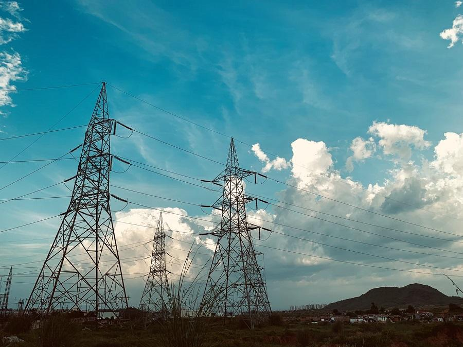

<!--
CO_OP_TRANSLATOR_METADATA:
{
  "original_hash": "61342603bad8acadbc6b2e4e3aab3f66",
  "translation_date": "2025-08-29T16:56:46+00:00",
  "source_file": "7-TimeSeries/README.md",
  "language_code": "pa"
}
-->
# ਟਾਈਮ ਸੀਰੀਜ਼ ਫੋਰਕਾਸਟਿੰਗ ਦਾ ਪਰਚੇ

ਟਾਈਮ ਸੀਰੀਜ਼ ਫੋਰਕਾਸਟਿੰਗ ਕੀ ਹੈ? ਇਹ ਪਿਛਲੇ ਰੁਝਾਨਾਂ ਦਾ ਵਿਸ਼ਲੇਸ਼ਣ ਕਰਕੇ ਭਵਿੱਖ ਦੇ ਘਟਨਾਵਾਂ ਦੀ ਭਵਿੱਖਵਾਣੀ ਕਰਨ ਬਾਰੇ ਹੈ।

## ਖੇਤਰੀ ਵਿਸ਼ਾ: ਦੁਨੀਆ ਭਰ ਵਿੱਚ ਬਿਜਲੀ ਦੀ ਖਪਤ ✨

ਇਨ੍ਹਾਂ ਦੋ ਪਾਠਾਂ ਵਿੱਚ, ਤੁਹਾਨੂੰ ਟਾਈਮ ਸੀਰੀਜ਼ ਫੋਰਕਾਸਟਿੰਗ ਨਾਲ ਜਾਣੂ ਕਰਵਾਇਆ ਜਾਵੇਗਾ, ਜੋ ਕਿ ਮਸ਼ੀਨ ਲਰਨਿੰਗ ਦਾ ਇੱਕ ਥੋੜ੍ਹਾ ਘੱਟ ਜਾਣਿਆ ਗਿਆ ਖੇਤਰ ਹੈ ਪਰ ਫਿਰ ਵੀ ਉਦਯੋਗ ਅਤੇ ਕਾਰੋਬਾਰ ਦੇ ਅਰਜ਼ੀਆਂ ਸਮੇਤ ਹੋਰ ਖੇਤਰਾਂ ਲਈ ਬਹੁਤ ਹੀ ਕੀਮਤੀ ਹੈ। ਜਦੋਂ ਕਿ ਨਿਊਰਲ ਨੈਟਵਰਕਸ ਨੂੰ ਇਨ੍ਹਾਂ ਮਾਡਲਾਂ ਦੀ ਯੂਟਿਲਿਟੀ ਵਧਾਉਣ ਲਈ ਵਰਤਿਆ ਜਾ ਸਕਦਾ ਹੈ, ਅਸੀਂ ਇਨ੍ਹਾਂ ਨੂੰ ਕਲਾਸਿਕ ਮਸ਼ੀਨ ਲਰਨਿੰਗ ਦੇ ਸੰਦਰਭ ਵਿੱਚ ਅਧਿਐਨ ਕਰਾਂਗੇ ਕਿਉਂਕਿ ਮਾਡਲ ਪਿਛਲੇ ਡਾਟੇ ਦੇ ਆਧਾਰ 'ਤੇ ਭਵਿੱਖ ਦੇ ਪ੍ਰਦਰਸ਼ਨ ਦੀ ਭਵਿੱਖਵਾਣੀ ਕਰਨ ਵਿੱਚ ਮਦਦ ਕਰਦੇ ਹਨ।

ਸਾਡਾ ਖੇਤਰੀ ਧਿਆਨ ਦੁਨੀਆ ਵਿੱਚ ਬਿਜਲੀ ਦੀ ਖਪਤ 'ਤੇ ਹੈ, ਜੋ ਕਿ ਭਵਿੱਖ ਵਿੱਚ ਬਿਜਲੀ ਦੀ ਖਪਤ ਦੀ ਭਵਿੱਖਵਾਣੀ ਕਰਨ ਲਈ ਪਿਛਲੇ ਲੋਡ ਦੇ ਪੈਟਰਨਾਂ ਦੇ ਆਧਾਰ 'ਤੇ ਸਿੱਖਣ ਲਈ ਇੱਕ ਦਿਲਚਸਪ ਡਾਟਾਸੈਟ ਹੈ। ਤੁਸੀਂ ਦੇਖ ਸਕਦੇ ਹੋ ਕਿ ਇਸ ਤਰ੍ਹਾਂ ਦੀ ਫੋਰਕਾਸਟਿੰਗ ਕਾਰੋਬਾਰੀ ਮਾਹੌਲ ਵਿੱਚ ਕਿੰਨੀ ਮਦਦਗਾਰ ਹੋ ਸਕਦੀ ਹੈ।

ਫੋਟੋ [Peddi Sai hrithik](https://unsplash.com/@shutter_log?utm_source=unsplash&utm_medium=referral&utm_content=creditCopyText) ਵੱਲੋਂ, ਜੋ ਕਿ ਰਾਜਸਥਾਨ ਵਿੱਚ ਸੜਕ 'ਤੇ ਬਿਜਲੀ ਦੇ ਟਾਵਰਾਂ ਦੀ ਹੈ, [Unsplash](https://unsplash.com/s/photos/electric-india?utm_source=unsplash&utm_medium=referral&utm_content=creditCopyText) 'ਤੇ।

## ਪਾਠ

1. [ਟਾਈਮ ਸੀਰੀਜ਼ ਫੋਰਕਾਸਟਿੰਗ ਦਾ ਪਰਚੇ](1-Introduction/README.md)  
2. [ARIMA ਟਾਈਮ ਸੀਰੀਜ਼ ਮਾਡਲ ਬਣਾਉਣਾ](2-ARIMA/README.md)  
3. [ਟਾਈਮ ਸੀਰੀਜ਼ ਫੋਰਕਾਸਟਿੰਗ ਲਈ ਸਪੋਰਟ ਵੈਕਟਰ ਰਿਗ੍ਰੈਸਰ ਬਣਾਉਣਾ](3-SVR/README.md)  

## ਸ਼੍ਰੇਯ

"ਟਾਈਮ ਸੀਰੀਜ਼ ਫੋਰਕਾਸਟਿੰਗ ਦਾ ਪਰਚੇ" ਨੂੰ ⚡️ ਨਾਲ [Francesca Lazzeri](https://twitter.com/frlazzeri) ਅਤੇ [Jen Looper](https://twitter.com/jenlooper) ਵੱਲੋਂ ਲਿਖਿਆ ਗਿਆ ਸੀ। ਨੋਟਬੁੱਕ ਪਹਿਲਾਂ [Azure "Deep Learning For Time Series" repo](https://github.com/Azure/DeepLearningForTimeSeriesForecasting) ਵਿੱਚ ਆਨਲਾਈਨ ਪ੍ਰਕਾਸ਼ਿਤ ਹੋਈਆਂ ਸਨ, ਜੋ ਮੁਢਲੀਆਂ ਤੌਰ 'ਤੇ Francesca Lazzeri ਵੱਲੋਂ ਲਿਖੀਆਂ ਗਈਆਂ ਸਨ। SVR ਪਾਠ [Anirban Mukherjee](https://github.com/AnirbanMukherjeeXD) ਵੱਲੋਂ ਲਿਖਿਆ ਗਿਆ ਸੀ।

---

**ਅਸਵੀਕਤੀ**:  
ਇਹ ਦਸਤਾਵੇਜ਼ AI ਅਨੁਵਾਦ ਸੇਵਾ [Co-op Translator](https://github.com/Azure/co-op-translator) ਦੀ ਵਰਤੋਂ ਕਰਕੇ ਅਨੁਵਾਦ ਕੀਤਾ ਗਿਆ ਹੈ। ਜਦੋਂ ਕਿ ਅਸੀਂ ਸਹੀਤਾ ਲਈ ਯਤਨਸ਼ੀਲ ਹਾਂ, ਕਿਰਪਾ ਕਰਕੇ ਧਿਆਨ ਦਿਓ ਕਿ ਸਵੈਚਾਲਿਤ ਅਨੁਵਾਦਾਂ ਵਿੱਚ ਗਲਤੀਆਂ ਜਾਂ ਅਸੁਚਨਾਵਾਂ ਹੋ ਸਕਦੀਆਂ ਹਨ। ਮੂਲ ਦਸਤਾਵੇਜ਼ ਨੂੰ ਇਸਦੀ ਮੂਲ ਭਾਸ਼ਾ ਵਿੱਚ ਅਧਿਕਾਰਤ ਸਰੋਤ ਮੰਨਿਆ ਜਾਣਾ ਚਾਹੀਦਾ ਹੈ। ਮਹੱਤਵਪੂਰਨ ਜਾਣਕਾਰੀ ਲਈ, ਪੇਸ਼ੇਵਰ ਮਨੁੱਖੀ ਅਨੁਵਾਦ ਦੀ ਸਿਫਾਰਸ਼ ਕੀਤੀ ਜਾਂਦੀ ਹੈ। ਇਸ ਅਨੁਵਾਦ ਦੀ ਵਰਤੋਂ ਤੋਂ ਪੈਦਾ ਹੋਣ ਵਾਲੇ ਕਿਸੇ ਵੀ ਗਲਤਫਹਿਮੀ ਜਾਂ ਗਲਤ ਵਿਆਖਿਆ ਲਈ ਅਸੀਂ ਜ਼ਿੰਮੇਵਾਰ ਨਹੀਂ ਹਾਂ।