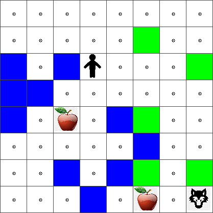

<!--
CO_OP_TRANSLATOR_METADATA:
{
  "original_hash": "0ffe994d1cc881bdeb49226a064116e5",
  "translation_date": "2025-08-29T18:11:19+00:00",
  "source_file": "8-Reinforcement/1-QLearning/README.md",
  "language_code": "pa"
}
-->
# ਰੀਇਨਫੋਰਸਮੈਂਟ ਲਰਨਿੰਗ ਅਤੇ ਕਿਊ-ਲਰਨਿੰਗ ਦਾ ਪਰਚੇ


> ਸਕੈਚਨੋਟ [ਟੋਮੋਮੀ ਇਮੂਰਾ](https://www.twitter.com/girlie_mac) ਵੱਲੋਂ

ਰੀਇਨਫੋਰਸਮੈਂਟ ਲਰਨਿੰਗ ਵਿੱਚ ਤਿੰਨ ਮਹੱਤਵਪੂਰਨ ਧਾਰਨਾਵਾਂ ਸ਼ਾਮਲ ਹਨ: ਏਜੰਟ, ਕੁਝ ਸਟੇਟਸ, ਅਤੇ ਹਰ ਸਟੇਟ ਲਈ ਕਾਰਵਾਈਆਂ ਦਾ ਇੱਕ ਸੈੱਟ। ਕਿਸੇ ਨਿਰਧਾਰਿਤ ਸਟੇਟ ਵਿੱਚ ਕਾਰਵਾਈ ਕਰਨ ਨਾਲ, ਏਜੰਟ ਨੂੰ ਇੱਕ ਇਨਾਮ ਮਿਲਦਾ ਹੈ। ਫਿਰ ਸੋਚੋ ਕਿ ਤੁਸੀਂ ਕੰਪਿਊਟਰ ਗੇਮ ਸੁਪਰ ਮਾਰਿਓ ਖੇਡ ਰਹੇ ਹੋ। ਤੁਸੀਂ ਮਾਰਿਓ ਹੋ, ਤੁਸੀਂ ਇੱਕ ਗੇਮ ਲੈਵਲ ਵਿੱਚ ਹੋ, ਇੱਕ ਖੱਡ ਦੇ ਕਿਨਾਰੇ ਖੜ੍ਹੇ ਹੋ। ਤੁਹਾਡੇ ਉੱਪਰ ਇੱਕ ਸਿੱਕਾ ਹੈ। ਤੁਸੀਂ ਮਾਰਿਓ ਹੋ, ਇੱਕ ਗੇਮ ਲੈਵਲ ਵਿੱਚ, ਇੱਕ ਖਾਸ ਸਥਿਤੀ ਵਿੱਚ ... ਇਹ ਤੁਹਾਡੀ ਸਟੇਟ ਹੈ। ਸੱਜੇ ਪਾਸੇ ਇੱਕ ਕਦਮ ਚਲਣਾ (ਇੱਕ ਕਾਰਵਾਈ) ਤੁਹਾਨੂੰ ਖੱਡ ਵਿੱਚ ਲੈ ਜਾਵੇਗਾ, ਅਤੇ ਇਸ ਨਾਲ ਤੁਹਾਨੂੰ ਘੱਟ ਅੰਕ ਮਿਲਣਗੇ। ਹਾਲਾਂਕਿ, ਜੰਪ ਬਟਨ ਦਬਾਉਣ ਨਾਲ ਤੁਹਾਨੂੰ ਇੱਕ ਅੰਕ ਮਿਲੇਗਾ ਅਤੇ ਤੁਸੀਂ ਜਿਊਂਦੇ ਰਹੋਗੇ। ਇਹ ਇੱਕ ਸਕਾਰਾਤਮਕ ਨਤੀਜਾ ਹੈ ਅਤੇ ਇਸ ਲਈ ਤੁਹਾਨੂੰ ਇੱਕ ਸਕਾਰਾਤਮਕ ਅੰਕ ਮਿਲਣਾ ਚਾਹੀਦਾ ਹੈ।

ਰੀਇਨਫੋਰਸਮੈਂਟ ਲਰਨਿੰਗ ਅਤੇ ਇੱਕ ਸਿਮੂਲੇਟਰ (ਗੇਮ) ਦੀ ਵਰਤੋਂ ਕਰਕੇ, ਤੁਸੀਂ ਗੇਮ ਖੇਡਣ ਦਾ ਤਰੀਕਾ ਸਿੱਖ ਸਕਦੇ ਹੋ ਤਾਂ ਜੋ ਇਨਾਮ ਨੂੰ ਵਧਾਇਆ ਜਾ ਸਕੇ, ਜੋ ਕਿ ਜਿਊਂਦੇ ਰਹਿਣ ਅਤੇ ਜਿੰਨੇ ਅੰਕ ਸੰਭਵ ਹੋ ਸਕਣ ਇਕੱਠੇ ਕਰਨ ਵਿੱਚ ਹੈ।

[](https://www.youtube.com/watch?v=lDq_en8RNOo)

> 🎥 ਉੱਪਰ ਦਿੱਤੀ ਤਸਵੀਰ 'ਤੇ ਕਲਿੱਕ ਕਰੋ ਤਾਂ ਜੋ ਦਿਮਿਤਰੀ ਰੀਇਨਫੋਰਸਮੈਂਟ ਲਰਨਿੰਗ ਬਾਰੇ ਗੱਲ ਕਰ ਸਕੇ

## [ਪ੍ਰੀ-ਲੈਕਚਰ ਕਵਿਜ਼](https://gray-sand-07a10f403.1.azurestaticapps.net/quiz/45/)

## ਪੂਰਵ ਸ਼ਰਤਾਂ ਅਤੇ ਸੈਟਅੱਪ

ਇਸ ਪਾਠ ਵਿੱਚ, ਅਸੀਂ ਪਾਇਥਨ ਵਿੱਚ ਕੁਝ ਕੋਡ ਨਾਲ ਪ੍ਰਯੋਗ ਕਰਾਂਗੇ। ਤੁਹਾਨੂੰ ਇਹ ਯੋਗਤਾ ਹੋਣੀ ਚਾਹੀਦੀ ਹੈ ਕਿ ਤੁਸੀਂ ਆਪਣੇ ਕੰਪਿਊਟਰ ਜਾਂ ਕਲਾਉਡ ਵਿੱਚ ਕਿਤੇ ਵੀ ਜੂਪਿਟਰ ਨੋਟਬੁੱਕ ਕੋਡ ਚਲਾ ਸਕੋ।

ਤੁਸੀਂ [ਪਾਠ ਨੋਟਬੁੱਕ](https://github.com/microsoft/ML-For-Beginners/blob/main/8-Reinforcement/1-QLearning/notebook.ipynb) ਖੋਲ੍ਹ ਸਕਦੇ ਹੋ ਅਤੇ ਇਸ ਪਾਠ ਨੂੰ ਬਣਾਉਣ ਲਈ ਇਸਨੂੰ ਪੜ੍ਹ ਸਕਦੇ ਹੋ।

> **ਨੋਟ:** ਜੇ ਤੁਸੀਂ ਇਹ ਕੋਡ ਕਲਾਉਡ ਤੋਂ ਖੋਲ੍ਹ ਰਹੇ ਹੋ, ਤਾਂ ਤੁਹਾਨੂੰ [`rlboard.py`](https://github.com/microsoft/ML-For-Beginners/blob/main/8-Reinforcement/1-QLearning/rlboard.py) ਫਾਈਲ ਵੀ ਲੈਣੀ ਪਵੇਗੀ, ਜੋ ਕਿ ਨੋਟਬੁੱਕ ਕੋਡ ਵਿੱਚ ਵਰਤੀ ਜਾਂਦੀ ਹੈ। ਇਸਨੂੰ ਨੋਟਬੁੱਕ ਵਾਲੇ ਹੀ ਡਾਇਰੈਕਟਰੀ ਵਿੱਚ ਸ਼ਾਮਲ ਕਰੋ।

## ਪਰਚੇ

ਇਸ ਪਾਠ ਵਿੱਚ, ਅਸੀਂ **[ਪੀਟਰ ਐਂਡ ਦ ਵੁਲਫ](https://en.wikipedia.org/wiki/Peter_and_the_Wolf)** ਦੀ ਦੁਨੀਆ ਦੀ ਖੋਜ ਕਰਾਂਗੇ, ਜੋ ਕਿ ਇੱਕ ਰੂਸੀ ਸੰਗੀਤਕਾਰ [ਸਰਗੇਈ ਪ੍ਰੋਕੋਫੀਵ](https://en.wikipedia.org/wiki/Sergei_Prokofiev) ਦੀ ਇੱਕ ਸੰਗੀਤਮਈ ਪਰੀਆਂ ਕਹਾਣੀ ਤੋਂ ਪ੍ਰੇਰਿਤ ਹੈ। ਅਸੀਂ **ਰੀਇਨਫੋਰਸਮੈਂਟ ਲਰਨਿੰਗ** ਦੀ ਵਰਤੋਂ ਕਰਾਂਗੇ ਤਾਂ ਜੋ ਪੀਟਰ ਆਪਣੇ ਵਾਤਾਵਰਣ ਦੀ ਖੋਜ ਕਰ ਸਕੇ, ਸੁਆਦਲੇ ਸੇਬ ਇਕੱਠੇ ਕਰ ਸਕੇ ਅਤੇ ਭੇੜੇ ਨਾਲ ਮਿਲਣ ਤੋਂ ਬਚ ਸਕੇ।

**ਰੀਇਨਫੋਰਸਮੈਂਟ ਲਰਨਿੰਗ** (RL) ਇੱਕ ਸਿੱਖਣ ਦੀ ਤਕਨੀਕ ਹੈ ਜੋ ਸਾਨੂੰ ਕਿਸੇ **ਵਾਤਾਵਰਣ** ਵਿੱਚ ਇੱਕ **ਏਜੰਟ** ਦੇ ਸ੍ਰੇਸ਼ਠ ਵਿਹਾਰ ਨੂੰ ਸਿੱਖਣ ਦੀ ਆਗਿਆ ਦਿੰਦੀ ਹੈ ਕਈ ਪ੍ਰਯੋਗਾਂ ਚਲਾਉਣ ਦੁਆਰਾ। ਇਸ ਵਾਤਾਵਰਣ ਵਿੱਚ ਇੱਕ ਏਜੰਟ ਦਾ ਕੁਝ **ਲਕਸ਼** ਹੋਣਾ ਚਾਹੀਦਾ ਹੈ, ਜੋ ਕਿ ਇੱਕ **ਇਨਾਮ ਫੰਕਸ਼ਨ** ਦੁਆਰਾ ਪਰਿਭਾਸ਼ਿਤ ਕੀਤਾ ਜਾਂਦਾ ਹੈ।

## ਵਾਤਾਵਰਣ

ਸਰਲਤਾ ਲਈ, ਆਓ ਪੀਟਰ ਦੀ ਦੁਨੀਆ ਨੂੰ `width` x `height` ਦੇ ਆਕਾਰ ਦੇ ਵਰਗ ਬੋਰਡ ਵਜੋਂ ਮੰਨਦੇ ਹਾਂ, ਇਸ ਤਰ੍ਹਾਂ:


ਇਸ ਬੋਰਡ ਵਿੱਚ ਹਰ ਸੈੱਲ ਇਹ ਹੋ ਸਕਦੀ ਹੈ:

* **ਜ਼ਮੀਨ**, ਜਿਸ 'ਤੇ ਪੀਟਰ ਅਤੇ ਹੋਰ ਜੀਵ ਚੱਲ ਸਕਦੇ ਹਨ।
* **ਪਾਣੀ**, ਜਿਸ 'ਤੇ ਤੁਸੀਂ ਸਪਸ਼ਟ ਤੌਰ 'ਤੇ ਨਹੀਂ ਚੱਲ ਸਕਦੇ।
* ਇੱਕ **ਦਰੱਖਤ** ਜਾਂ **ਘਾਹ**, ਇੱਕ ਥਾਂ ਜਿੱਥੇ ਤੁਸੀਂ ਆਰਾਮ ਕਰ ਸਕਦੇ ਹੋ।
* ਇੱਕ **ਸੇਬ**, ਜੋ ਕਿ ਕੁਝ ਪੀਟਰ ਖੁਸ਼ੀ ਨਾਲ ਲੱਭੇਗਾ ਤਾਂ ਜੋ ਉਹ ਆਪਣੇ ਆਪ ਨੂੰ ਖਾਣ ਲਈ ਕੁਝ ਲੱਭ ਸਕੇ।
* ਇੱਕ **ਭੇੜਾ**, ਜੋ ਖਤਰਨਾਕ ਹੈ ਅਤੇ ਇਸ ਤੋਂ ਬਚਣਾ ਚਾਹੀਦਾ ਹੈ।

ਇੱਕ ਵੱਖਰਾ ਪਾਇਥਨ ਮੋਡੀਊਲ, [`rlboard.py`](https://github.com/microsoft/ML-For-Beginners/blob/main/8-Reinforcement/1-QLearning/rlboard.py), ਇਸ ਵਾਤਾਵਰਣ ਨਾਲ ਕੰਮ ਕਰਨ ਲਈ ਕੋਡ ਸ਼ਾਮਲ ਕਰਦਾ ਹੈ। ਕਿਉਂਕਿ ਇਹ ਕੋਡ ਸਾਡੇ ਧਾਰਨਾਵਾਂ ਨੂੰ ਸਮਝਣ ਲਈ ਮਹੱਤਵਪੂਰਨ ਨਹੀਂ ਹੈ, ਅਸੀਂ ਮੋਡੀਊਲ ਨੂੰ ਇੰਪੋਰਟ ਕਰਾਂਗੇ ਅਤੇ ਇਸਨੂੰ ਨਮੂਨਾ ਬੋਰਡ ਬਣਾਉਣ ਲਈ ਵਰਤਾਂਗੇ (ਕੋਡ ਬਲਾਕ 1):

```python
from rlboard import *

width, height = 8,8
m = Board(width,height)
m.randomize(seed=13)
m.plot()
```

ਇਹ ਕੋਡ ਉੱਪਰ ਦਿੱਤੇ ਵਾਤਾਵਰਣ ਦੀ ਤਸਵੀਰ ਵਰਗਾ ਨਤੀਜਾ ਪ੍ਰਿੰਟ ਕਰੇਗਾ।

## ਕਾਰਵਾਈਆਂ ਅਤੇ ਨੀਤੀ

ਸਾਡੇ ਉਦਾਹਰਨ ਵਿੱਚ, ਪੀਟਰ ਦਾ ਲਕਸ਼ ਸੇਬ ਲੱਭਣਾ ਹੋਵੇਗਾ, ਭੇੜੇ ਅਤੇ ਹੋਰ ਰੁਕਾਵਟਾਂ ਤੋਂ ਬਚਦੇ ਹੋਏ। ਇਸ ਲਈ, ਉਹ ਅਸਲ ਵਿੱਚ ਸੇਬ ਲੱਭਣ ਤੱਕ ਇੱਧਰ-ਉੱਧਰ ਚੱਲ ਸਕਦਾ ਹੈ।

ਇਸ ਲਈ, ਕਿਸੇ ਵੀ ਸਥਿਤੀ ਵਿੱਚ, ਉਹ ਹੇਠਾਂ ਦਿੱਤੀਆਂ ਕਾਰਵਾਈਆਂ ਵਿੱਚੋਂ ਇੱਕ ਚੁਣ ਸਕਦਾ ਹੈ: ਉੱਪਰ, ਹੇਠਾਂ, ਖੱਬੇ ਅਤੇ ਸੱਜੇ।

ਅਸੀਂ ਉਹਨਾਂ ਕਾਰਵਾਈਆਂ ਨੂੰ ਇੱਕ ਡਿਕਸ਼ਨਰੀ ਵਜੋਂ ਪਰਿਭਾਸ਼ਿਤ ਕਰਾਂਗੇ ਅਤੇ ਉਹਨਾਂ ਨੂੰ ਸੰਬੰਧਤ ਕੋਆਰਡੀਨੇਟ ਬਦਲਾਅ ਦੇ ਜੋੜਿਆਂ ਨਾਲ ਨਕਸ਼ਾ ਕਰਾਂਗੇ। ਉਦਾਹਰਨ ਲਈ, ਸੱਜੇ ਵੱਲ ਚਲਣਾ (`R`) ਇੱਕ ਜੋੜੇ `(1,0)` ਦੇ ਅਨੁਕੂਲ ਹੋਵੇਗਾ। (ਕੋਡ ਬਲਾਕ 2):

```python
actions = { "U" : (0,-1), "D" : (0,1), "L" : (-1,0), "R" : (1,0) }
action_idx = { a : i for i,a in enumerate(actions.keys()) }
```

ਸੰਖੇਪ ਵਿੱਚ, ਇਸ ਦ੍ਰਿਸ਼ਟੀਕੋਣ ਅਤੇ ਲਕਸ਼ ਨੂੰ ਹੇਠਾਂ ਦਿੱਤੇ ਤਰੀਕੇ ਨਾਲ ਸੰਖੇਪ ਕੀਤਾ ਜਾ ਸਕਦਾ ਹੈ:

- **ਦ੍ਰਿਸ਼ਟੀਕੋਣ**, ਸਾਡੇ ਏਜੰਟ (ਪੀਟਰ) ਦੀ, ਇੱਕ **ਨੀਤੀ** ਦੁਆਰਾ ਪਰਿਭਾਸ਼ਿਤ ਕੀਤੀ ਜਾਂਦੀ ਹੈ। ਇੱਕ ਨੀਤੀ ਇੱਕ ਫੰਕਸ਼ਨ ਹੈ ਜੋ ਕਿਸੇ ਵੀ ਦਿੱਤੀ ਸਟੇਟ ਵਿੱਚ ਕਾਰਵਾਈ ਵਾਪਸ ਕਰਦਾ ਹੈ। ਸਾਡੇ ਮਾਮਲੇ ਵਿੱਚ, ਸਮੱਸਿਆ ਦੀ ਸਟੇਟ ਬੋਰਡ ਦੁਆਰਾ ਪ੍ਰਸਤੁਤ ਕੀਤੀ ਜਾਂਦੀ ਹੈ, ਜਿਸ ਵਿੱਚ ਖਿਡਾਰੀ ਦੀ ਮੌਜੂਦਾ ਸਥਿਤੀ ਸ਼ਾਮਲ ਹੈ।

- **ਲਕਸ਼**, ਰੀਇਨਫੋਰਸਮੈਂਟ ਲਰਨਿੰਗ ਦਾ, ਆਖਰਕਾਰ ਇੱਕ ਚੰਗੀ ਨੀਤੀ ਸਿੱਖਣਾ ਹੈ ਜੋ ਸਾਨੂੰ ਸਮੱਸਿਆ ਨੂੰ ਕੁਸ਼ਲਤਾਪੂਰਵਕ ਹੱਲ ਕਰਨ ਦੀ ਆਗਿਆ ਦੇਵੇ। ਹਾਲਾਂਕਿ, ਇੱਕ ਬੇਸਲਾਈਨ ਵਜੋਂ, ਆਓ ਸਭ ਤੋਂ ਸਧਾਰਨ ਨੀਤੀ ਨੂੰ ਮੰਨਦੇ ਹਾਂ ਜਿਸਨੂੰ **ਰੈਂਡਮ ਵਾਕ** ਕਿਹਾ ਜਾਂਦਾ ਹੈ।

## ਰੈਂਡਮ ਵਾਕ

ਆਓ ਪਹਿਲਾਂ ਰੈਂਡਮ ਵਾਕ ਰਣਨੀਤੀ ਨੂੰ ਲਾਗੂ ਕਰਕੇ ਆਪਣੀ ਸਮੱਸਿਆ ਦਾ ਹੱਲ ਕਰੀਏ। ਰੈਂਡਮ ਵਾਕ ਨਾਲ, ਅਸੀਂ ਅਗਲੀ ਕਾਰਵਾਈ ਨੂੰ ਇਜਾਜ਼ਤ ਪ੍ਰਾਪਤ ਕਾਰਵਾਈਆਂ ਵਿੱਚੋਂ ਰੈਂਡਮ ਤੌਰ 'ਤੇ ਚੁਣਾਂਗੇ, ਜਦ ਤੱਕ ਅਸੀਂ ਸੇਬ ਤੱਕ ਨਹੀਂ ਪਹੁੰਚਦੇ (ਕੋਡ ਬਲਾਕ 3)।

1. ਹੇਠਾਂ ਦਿੱਤੇ ਕੋਡ ਨਾਲ ਰੈਂਡਮ ਵਾਕ ਲਾਗੂ ਕਰੋ:

    ```python
    def random_policy(m):
        return random.choice(list(actions))
    
    def walk(m,policy,start_position=None):
        n = 0 # number of steps
        # set initial position
        if start_position:
            m.human = start_position 
        else:
            m.random_start()
        while True:
            if m.at() == Board.Cell.apple:
                return n # success!
            if m.at() in [Board.Cell.wolf, Board.Cell.water]:
                return -1 # eaten by wolf or drowned
            while True:
                a = actions[policy(m)]
                new_pos = m.move_pos(m.human,a)
                if m.is_valid(new_pos) and m.at(new_pos)!=Board.Cell.water:
                    m.move(a) # do the actual move
                    break
            n+=1
    
    walk(m,random_policy)
    ```

    `walk` ਨੂੰ ਕਾਲ ਕਰਨ ਨਾਲ ਸੰਬੰਧਤ ਰਸਤੇ ਦੀ ਲੰਬਾਈ ਵਾਪਸ ਆਉਣੀ ਚਾਹੀਦੀ ਹੈ, ਜੋ ਇੱਕ ਚਲਾਉਣ ਤੋਂ ਦੂਜੇ ਚਲਾਉਣ ਤੱਕ ਵੱਖ-ਵੱਖ ਹੋ ਸਕਦੀ ਹੈ।

1. ਵਾਕ ਪ੍ਰਯੋਗ ਨੂੰ ਕਈ ਵਾਰ ਚਲਾਓ (ਕਹੋ, 100 ਵਾਰ), ਅਤੇ ਨਤੀਜੇ ਦੇ ਅੰਕੜੇ ਪ੍ਰਿੰਟ ਕਰੋ (ਕੋਡ ਬਲਾਕ 4):

    ```python
    def print_statistics(policy):
        s,w,n = 0,0,0
        for _ in range(100):
            z = walk(m,policy)
            if z<0:
                w+=1
            else:
                s += z
                n += 1
        print(f"Average path length = {s/n}, eaten by wolf: {w} times")
    
    print_statistics(random_policy)
    ```

    ਧਿਆਨ ਦਿਓ ਕਿ ਰਸਤੇ ਦੀ ਔਸਤ ਲੰਬਾਈ ਲਗਭਗ 30-40 ਕਦਮ ਹੈ, ਜੋ ਕਿ ਕਾਫ਼ੀ ਹੈ, ਇਹ ਮੰਨਦੇ ਹੋਏ ਕਿ ਸਭ ਤੋਂ ਨੇੜਲੇ ਸੇਬ ਤੱਕ ਔਸਤ ਦੂਰੀ ਲਗਭਗ 5-6 ਕਦਮ ਹੈ।

    ਤੁਸੀਂ ਇਹ ਵੀ ਦੇਖ ਸਕਦੇ ਹੋ ਕਿ ਰੈਂਡਮ ਵਾਕ ਦੌਰਾਨ ਪੀਟਰ ਦੀ ਚਾਲ ਕਿਵੇਂ ਦਿਖਦੀ ਹੈ:

    

## ਇਨਾਮ ਫੰਕਸ਼ਨ

ਸਾਡੀ ਨੀਤੀ ਨੂੰ ਹੋਰ ਸਮਝਦਾਰ ਬਣਾਉਣ ਲਈ, ਸਾਨੂੰ ਇਹ ਸਮਝਣ ਦੀ ਲੋੜ ਹੈ ਕਿ ਕਿਹੜੀਆਂ ਚਾਲਾਂ "ਵਧੀਆ" ਹਨ। ਇਸ ਲਈ, ਸਾਨੂੰ ਆਪਣਾ ਲਕਸ਼ ਪਰਿਭਾਸ਼ਿਤ ਕਰਨ ਦੀ ਲੋੜ ਹੈ।

ਲਕਸ਼ ਨੂੰ ਇੱਕ **ਇਨਾਮ ਫੰਕਸ਼ਨ** ਦੇ ਰੂਪ ਵਿੱਚ ਪਰਿਭਾਸ਼ਿਤ ਕੀਤਾ ਜਾ ਸਕਦਾ ਹੈ, ਜੋ ਹਰ ਸਟੇਟ ਲਈ ਕੁਝ ਸਕੋਰ ਮੁੱਲ ਵਾਪਸ ਕਰੇਗਾ। ਜਿੰਨਾ ਵੱਡਾ ਨੰਬਰ, ਉਨਾ ਵਧੀਆ ਇਨਾਮ ਫੰਕਸ਼ਨ। (ਕੋਡ ਬਲਾਕ 5)

```python
move_reward = -0.1
goal_reward = 10
end_reward = -10

def reward(m,pos=None):
    pos = pos or m.human
    if not m.is_valid(pos):
        return end_reward
    x = m.at(pos)
    if x==Board.Cell.water or x == Board.Cell.wolf:
        return end_reward
    if x==Board.Cell.apple:
        return goal_reward
    return move_reward
```

ਇਨਾਮ ਫੰਕਸ਼ਨਾਂ ਬਾਰੇ ਦਿਲਚਸਪ ਗੱਲ ਇਹ ਹੈ ਕਿ ਜ਼ਿਆਦਾਤਰ ਮਾਮਲਿਆਂ ਵਿੱਚ, *ਸਾਨੂੰ ਖੇਡ ਦੇ ਅੰਤ ਵਿੱਚ ਹੀ ਇੱਕ ਵੱਡਾ ਇਨਾਮ ਮਿਲਦਾ ਹੈ*। ਇਸਦਾ ਮਤਲਬ ਹੈ ਕਿ ਸਾਡਾ ਐਲਗੋਰਿਥਮ ਕਿਸੇ ਤਰੀਕੇ ਨਾਲ "ਵਧੀਆ" ਕਦਮਾਂ ਨੂੰ ਯਾਦ ਰੱਖਣਾ ਚਾਹੀਦਾ ਹੈ ਜੋ ਅੰਤ ਵਿੱਚ ਸਕਾਰਾਤਮਕ ਇਨਾਮ ਵੱਲ ਲੈ ਜਾਂਦੇ ਹਨ, ਅਤੇ ਉਹਨਾਂ ਦੀ ਮਹੱਤਤਾ ਵਧਾਉਣੀ ਚਾਹੀਦੀ ਹੈ। ਇਸੇ ਤਰ੍ਹਾਂ, ਸਾਰੇ ਕਦਮ ਜੋ ਖਰਾਬ ਨਤੀਜਿਆਂ ਵੱਲ ਲੈ ਜਾਂਦੇ ਹਨ ਉਹਨਾਂ ਨੂੰ ਹੌਸਲਾ ਨਹੀਂ ਦੇਣਾ ਚਾਹੀਦਾ।

## ਕਿਊ-ਲਰਨਿੰਗ

ਇੱਕ ਐਲਗੋਰਿਥਮ ਜਿਸ ਬਾਰੇ ਅਸੀਂ ਇੱਥੇ ਗੱਲ ਕਰਾਂਗੇ ਉਸਨੂੰ **ਕਿਊ-ਲਰਨਿੰਗ** ਕਿਹਾ ਜਾਂਦਾ ਹੈ। ਇਸ ਐਲਗੋਰਿਥਮ ਵਿੱਚ, ਨੀਤੀ ਨੂੰ ਇੱਕ ਫੰਕਸ਼ਨ (ਜਾਂ ਡਾਟਾ ਸਟ੍ਰਕਚਰ) ਦੁਆਰਾ ਪਰਿਭਾਸ਼ਿਤ ਕੀਤਾ ਜਾਂਦਾ ਹੈ ਜਿਸਨੂੰ **ਕਿਊ-ਟੇਬਲ** ਕਿਹਾ ਜਾਂਦਾ ਹੈ। ਇਹ ਦਿੱਤੀ ਸਟੇਟ ਵਿੱਚ ਹਰ ਕਾਰਵਾਈ ਦੀ "ਵਧੀਆ" ਗੁਣਵੱਤਾ ਨੂੰ ਦਰਜ ਕਰਦਾ ਹੈ।

ਇਸਨੂੰ ਕਿਊ-ਟੇਬਲ ਕਿਹਾ ਜਾਂਦਾ ਹੈ ਕਿਉਂਕਿ ਇਸਨੂੰ ਇੱਕ ਟੇਬਲ ਜਾਂ ਬਹੁ-ਮਾਪੀ ਐਰੇ ਵਜੋਂ ਪ੍ਰਸਤੁਤ ਕਰਨਾ ਆਸਾਨ ਹੁੰਦਾ ਹੈ। ਕਿਉਂਕਿ ਸਾਡੇ ਬੋਰਡ ਦੇ ਮਾਪ `width` x `height` ਹਨ, ਅਸੀਂ ਕਿਊ-ਟੇਬਲ ਨੂੰ ਇੱਕ ਨੰਪੀ ਐਰੇ ਦੀ ਵਰਤੋਂ ਕਰਕੇ ਪ੍ਰਸਤੁਤ ਕਰ ਸਕਦੇ ਹਾਂ ਜਿਸਦਾ ਆਕਾਰ `width` x `height` x `len(actions)` ਹੈ: (ਕੋਡ ਬਲਾਕ 6)

```python
Q = np.ones((width,height,len(actions)),dtype=np.float)*1.0/len(actions)
```

ਧਿਆਨ ਦਿਓ ਕਿ ਅਸੀਂ ਕਿਊ-ਟੇਬਲ ਦੇ ਸਾਰੇ ਮੁੱਲਾਂ ਨੂੰ ਇੱਕੋ ਜੇਹੇ ਮੁੱਲ ਨਾਲ ਸ਼ੁਰੂ ਕਰਦੇ ਹਾਂ, ਸਾਡੇ ਮਾਮਲੇ ਵਿੱਚ - 0.25। ਇਹ "ਰੈਂਡਮ ਵਾਕ" ਨੀਤੀ ਦੇ ਅਨੁਕੂਲ ਹੈ, ਕਿਉਂਕਿ ਹਰ ਸਟੇਟ ਵਿੱਚ ਸਾਰੀਆਂ ਚਾਲਾਂ ਇੱਕੋ ਜੇਹੀਆਂ ਹਨ। ਅਸੀਂ ਕਿਊ-ਟੇਬਲ ਨੂੰ ਬੋਰਡ 'ਤੇ ਦਿਖਾਉਣ ਲਈ `plot` ਫੰਕਸ਼ਨ ਨੂੰ ਪਾਸ ਕਰ ਸਕਦੇ ਹਾਂ: `m.plot(Q)`।



ਹਰ ਸੈੱਲ ਦੇ ਕੇਂਦਰ ਵਿੱਚ ਇੱਕ "ਤੀਰ" ਹੈ ਜੋ ਚਾਲ ਦੇ ਪਸੰਦੀਦਾ ਦਿਸ਼ਾ ਨੂੰ ਦਰਸਾਉਂਦਾ ਹੈ। ਕਿਉਂਕਿ ਸਾਰੀਆਂ ਦਿਸ਼ਾਵਾਂ ਇੱਕੋ ਜੇਹੀਆਂ ਹਨ, ਇੱਕ ਬਿੰਦੂ ਦਿਖਾਇਆ ਜਾਂਦਾ ਹੈ।

ਹੁਣ ਸਾਨੂੰ ਸਿਮੂਲੇਸ਼ਨ ਚਲਾਉਣ ਦੀ ਲੋੜ ਹੈ, ਆਪਣੇ ਵਾਤਾਵਰਣ ਦੀ ਖੋਜ ਕਰਨ ਦੀ ਲੋੜ ਹੈ, ਅਤੇ ਕਿਊ-ਟੇਬਲ ਮੁੱਲਾਂ ਦੇ ਇੱਕ ਵਧੀਆ ਵੰਡ ਨੂੰ ਸਿੱਖਣ ਦੀ ਲੋੜ ਹੈ, ਜੋ ਸਾਨੂੰ ਸੇਬ ਤੱਕ ਬਹੁਤ ਤੇਜ਼ੀ ਨਾਲ ਰਸਤਾ ਲੱਭਣ ਦੀ ਆਗਿਆ ਦੇਵੇਗਾ।

## ਕਿਊ-ਲਰਨਿੰਗ ਦਾ ਮੂਲ: ਬੈਲਮੈਨ ਸਮੀਕਰਨ

ਜਦੋਂ ਅਸੀਂ ਚਲਣਾ ਸ਼ੁਰੂ ਕਰਦੇ ਹਾਂ, ਹਰ ਕਾਰਵਾਈ ਦਾ ਇੱਕ ਸੰਬੰਧਤ ਇਨਾਮ ਹੁੰਦਾ ਹੈ, ਅਰਥਾਤ ਅਸੀਂ ਸਿਧਾਂਤਕ ਤੌਰ 'ਤੇ ਸਭ ਤੋਂ ਵੱਧ ਤੁਰੰਤ ਇਨਾਮ ਦੇ ਆਧਾਰ 'ਤੇ ਅਗਲੀ ਕਾਰਵਾਈ ਚੁਣ ਸਕਦੇ ਹਾਂ। ਹਾਲਾਂਕਿ, ਜ਼ਿਆਦਾਤਰ ਸਟੇਟਸ ਵਿੱਚ, ਚਾਲ ਸਾਡੇ ਲਕਸ਼ ਤੱਕ ਨਹੀਂ ਪਹੁੰਚੇਗੀ, ਅਤੇ ਇਸ ਲਈ ਅਸੀਂ ਤੁਰੰਤ ਫੈਸਲਾ ਨਹੀਂ ਕਰ ਸਕਦੇ ਕਿ ਕਿਹੜੀ ਦਿਸ਼ਾ ਵਧੀਆ ਹੈ।

> ਯਾਦ ਰੱਖੋ ਕਿ ਤੁਰੰਤ ਨਤੀਜਾ ਮਹੱਤਵਪੂਰਨ ਨਹੀਂ ਹੈ, ਬਲਕਿ ਅੰਤ ਵਿੱਚ ਪ੍ਰਾਪਤ ਹੋਣ ਵਾਲਾ ਅੰਤਿਮ ਨਤੀਜਾ ਮਹੱਤਵਪੂਰਨ ਹੈ।

ਇਸ ਤੁਰੰਤ ਇਨਾਮ ਨੂੰ ਧਿਆਨ ਵਿੱਚ ਰੱਖਣ ਲਈ, ਸਾਨੂੰ **[ਡਾਇਨਾਮਿਕ ਪ੍ਰੋਗਰਾਮਿੰਗ](https://en.wikipedia.org/wiki/Dynamic_programming)** ਦੇ ਸਿਧਾਂਤਾਂ ਦੀ ਵਰਤੋਂ ਕਰਨ ਦੀ ਲੋੜ ਹੈ, ਜੋ ਸਾਨੂੰ ਆਪਣੀ ਸਮੱਸਿਆ ਬਾਰੇ ਦੁਹਰਾਓਵਾਂ ਵਿੱਚ ਸੋਚਣ ਦੀ ਆਗਿਆ ਦਿੰਦੇ ਹਨ।

ਮੰਨੋ ਅਸੀਂ ਹੁਣ ਸਟੇਟ *s* 'ਤੇ ਹਾਂ, ਅਤੇ ਅਸੀਂ ਅਗਲੇ ਸਟੇਟ *s'* ਵੱਲ ਜਾਣਾ ਚਾਹੁੰਦੇ ਹਾਂ। ਇਸ ਤਰ੍ਹਾਂ ਕਰਨ ਨਾਲ, ਸਾਨੂੰ ਤੁਰੰਤ ਇਨਾਮ *r(s,a)* ਮਿਲੇਗਾ, ਜੋ ਇਨਾਮ ਫੰਕਸ਼ਨ ਦੁਆਰਾ ਪਰਿਭਾਸ਼ਿਤ ਕੀਤਾ ਗਿਆ ਹੈ, ਪਲਸ ਕੁਝ ਭਵਿੱਖ ਦਾ ਇਨਾਮ। ਜੇ ਅਸੀਂ ਮੰਨ ਲਵਾਂ ਕਿ ਸਾਡਾ ਕਿਊ-ਟੇਬਲ ਹਰ ਕਾਰਵਾਈ ਦੀ "ਆਕਰਸ਼ਕਤਾ" ਨੂੰ ਸਹੀ ਤੌਰ 'ਤੇ ਦਰਸਾਉਂਦਾ ਹੈ, ਤਾਂ ਸਟੇਟ *s'* 'ਤੇ ਅਸੀਂ ਇੱਕ ਕਾਰਵਾਈ *a* ਚੁਣਾਂਗੇ ਜੋ *Q(s',a')* ਦੇ

## ਨੀਤੀ ਦੀ ਜਾਂਚ

ਕਿਉਂਕਿ Q-Table ਹਰ ਰਾਜ ਵਿੱਚ ਹਰ ਕ੍ਰਿਆ ਦੀ "ਆਕਰਸ਼ਣਸ਼ੀਲਤਾ" ਦਿਖਾਉਂਦਾ ਹੈ, ਇਸਨੂੰ ਵਰਤ ਕੇ ਸਾਡੇ ਜਗਤ ਵਿੱਚ ਕੁਸ਼ਲ ਨੈਵੀਗੇਸ਼ਨ ਨੂੰ ਪਰਿਭਾਸ਼ਿਤ ਕਰਨਾ ਬਹੁਤ ਆਸਾਨ ਹੈ। ਸਭ ਤੋਂ ਸਧਾਰਣ ਮਾਮਲੇ ਵਿੱਚ, ਅਸੀਂ ਸਭ ਤੋਂ ਉੱਚੇ Q-Table ਮੁੱਲ ਦੇ ਅਨੁਸਾਰ ਕ੍ਰਿਆ ਚੁਣ ਸਕਦੇ ਹਾਂ: (ਕੋਡ ਬਲਾਕ 9)

```python
def qpolicy_strict(m):
        x,y = m.human
        v = probs(Q[x,y])
        a = list(actions)[np.argmax(v)]
        return a

walk(m,qpolicy_strict)
```

> ਜੇ ਤੁਸੀਂ ਉਪਰੋਕਤ ਕੋਡ ਨੂੰ ਕਈ ਵਾਰ ਚਲਾਉਂਦੇ ਹੋ, ਤਾਂ ਤੁਸੀਂ ਧਿਆਨ ਦੇ ਸਕਦੇ ਹੋ ਕਿ ਕਈ ਵਾਰ ਇਹ "ਅਟਕ" ਜਾਂਦਾ ਹੈ, ਅਤੇ ਤੁਹਾਨੂੰ ਇਸਨੂੰ ਰੋਕਣ ਲਈ ਨੋਟਬੁੱਕ ਵਿੱਚ STOP ਬਟਨ ਦਬਾਉਣ ਦੀ ਲੋੜ ਪੈਂਦੀ ਹੈ। ਇਹ ਇਸ ਲਈ ਹੁੰਦਾ ਹੈ ਕਿਉਂਕਿ ਕੁਝ ਹਾਲਾਤਾਂ ਵਿੱਚ ਦੋ ਰਾਜ "ਆਪਸੀ" Q-Value ਦੇ ਅਨੁਸਾਰ ਇੱਕ ਦੂਜੇ ਵੱਲ ਇਸ਼ਾਰਾ ਕਰਦੇ ਹਨ, ਜਿਸ ਕਾਰਨ ਏਜੰਟ ਉਹਨਾਂ ਰਾਜਾਂ ਵਿੱਚ ਅਨੰਤ ਤੱਕ ਘੁੰਮਦਾ ਰਹਿੰਦਾ ਹੈ।

## 🚀ਚੁਣੌਤੀ

> **ਟਾਸਕ 1:** `walk` ਫੰਕਸ਼ਨ ਨੂੰ ਸੋਧੋ ਤਾਂ ਜੋ ਰਸਤੇ ਦੀ ਵੱਧ ਤੋਂ ਵੱਧ ਲੰਬਾਈ ਨੂੰ ਇੱਕ ਨਿਰਧਾਰਤ ਕਦਮਾਂ ਦੀ ਗਿਣਤੀ (ਕਹੋ, 100) ਤੱਕ ਸੀਮਿਤ ਕੀਤਾ ਜਾ ਸਕੇ, ਅਤੇ ਉਪਰੋਕਤ ਕੋਡ ਨੂੰ ਵਾਰ-ਵਾਰ ਇਸ ਮੁੱਲ ਨੂੰ ਵਾਪਸ ਕਰਦੇ ਦੇਖੋ।

> **ਟਾਸਕ 2:** `walk` ਫੰਕਸ਼ਨ ਨੂੰ ਸੋਧੋ ਤਾਂ ਜੋ ਇਹ ਉਹਨਾਂ ਥਾਵਾਂ ਤੇ ਵਾਪਸ ਨਾ ਜਾਵੇ ਜਿੱਥੇ ਇਹ ਪਹਿਲਾਂ ਹੀ ਜਾ ਚੁੱਕਾ ਹੈ। ਇਹ `walk` ਨੂੰ ਲੂਪ ਕਰਨ ਤੋਂ ਰੋਕੇਗਾ, ਹਾਲਾਂਕਿ, ਏਜੰਟ ਫਿਰ ਵੀ ਇੱਕ ਅਜਿਹੀ ਜਗ੍ਹਾ ਵਿੱਚ "ਫਸ" ਸਕਦਾ ਹੈ ਜਿੱਥੋਂ ਇਹ ਬਾਹਰ ਨਹੀਂ ਨਿਕਲ ਸਕਦਾ।

## ਨੈਵੀਗੇਸ਼ਨ

ਇੱਕ ਵਧੀਆ ਨੈਵੀਗੇਸ਼ਨ ਨੀਤੀ ਉਹ ਹੋਵੇਗੀ ਜੋ ਅਸੀਂ ਟ੍ਰੇਨਿੰਗ ਦੌਰਾਨ ਵਰਤੀ ਸੀ, ਜੋ ਸ਼ੋਸ਼ਣ ਅਤੇ ਖੋਜ ਨੂੰ ਮਿਲਾਉਂਦੀ ਹੈ। ਇਸ ਨੀਤੀ ਵਿੱਚ, ਅਸੀਂ ਹਰ ਕ੍ਰਿਆ ਨੂੰ ਇੱਕ ਨਿਰਧਾਰਤ ਸੰਭਾਵਨਾ ਨਾਲ ਚੁਣਾਂਗੇ, ਜੋ Q-Table ਵਿੱਚ ਮੁੱਲਾਂ ਦੇ ਅਨੁਪਾਤ ਵਿੱਚ ਹੋਵੇਗੀ। ਇਹ ਰਣਨੀਤੀ ਫਿਰ ਵੀ ਏਜੰਟ ਨੂੰ ਇੱਕ ਪਦਵੀ 'ਤੇ ਵਾਪਸ ਜਾਣ ਦਾ ਕਾਰਨ ਬਣ ਸਕਦੀ ਹੈ ਜਿੱਥੇ ਇਹ ਪਹਿਲਾਂ ਹੀ ਪਹੁੰਚ ਚੁੱਕਾ ਹੈ, ਪਰ, ਜਿਵੇਂ ਕਿ ਤੁਸੀਂ ਹੇਠਾਂ ਦਿੱਤੇ ਕੋਡ ਤੋਂ ਦੇਖ ਸਕਦੇ ਹੋ, ਇਹ ਚਾਹੀਦੀ ਜਗ੍ਹਾ ਤੱਕ ਬਹੁਤ ਛੋਟੀ ਔਸਤ ਲੰਬਾਈ ਵਾਲੇ ਰਸਤੇ ਦਾ ਕਾਰਨ ਬਣਦੀ ਹੈ (ਯਾਦ ਰੱਖੋ ਕਿ `print_statistics` ਸਿਮੂਲੇਸ਼ਨ ਨੂੰ 100 ਵਾਰ ਚਲਾਉਂਦਾ ਹੈ): (ਕੋਡ ਬਲਾਕ 10)

```python
def qpolicy(m):
        x,y = m.human
        v = probs(Q[x,y])
        a = random.choices(list(actions),weights=v)[0]
        return a

print_statistics(qpolicy)
```

ਇਹ ਕੋਡ ਚਲਾਉਣ ਤੋਂ ਬਾਅਦ, ਤੁਹਾਨੂੰ ਪਹਿਲਾਂ ਨਾਲੋਂ ਬਹੁਤ ਛੋਟੀ ਔਸਤ ਰਸਤੇ ਦੀ ਲੰਬਾਈ ਮਿਲਣੀ ਚਾਹੀਦੀ ਹੈ, ਜੋ 3-6 ਦੇ ਰੇਂਜ ਵਿੱਚ ਹੋਵੇਗੀ।

## ਸਿੱਖਣ ਦੀ ਪ੍ਰਕਿਰਿਆ ਦੀ ਜਾਂਚ

ਜਿਵੇਂ ਕਿ ਅਸੀਂ ਦੱਸਿਆ ਹੈ, ਸਿੱਖਣ ਦੀ ਪ੍ਰਕਿਰਿਆ ਖੋਜ ਅਤੇ ਸਮੱਸਿਆ ਦੇ ਖੇਤਰ ਦੀ ਬਣਤਰ ਬਾਰੇ ਪ੍ਰਾਪਤ ਗਿਆਨ ਦੀ ਖੋਜ ਦੇ ਵਿਚਕਾਰ ਇੱਕ ਸੰਤੁਲਨ ਹੈ। ਅਸੀਂ ਦੇਖਿਆ ਹੈ ਕਿ ਸਿੱਖਣ ਦੇ ਨਤੀਜੇ (ਏਜੰਟ ਨੂੰ ਲਕਸ਼ ਤੱਕ ਛੋਟਾ ਰਸਤਾ ਲੱਭਣ ਵਿੱਚ ਮਦਦ ਕਰਨ ਦੀ ਯੋਗਤਾ) ਵਿੱਚ ਸੁਧਾਰ ਹੋਇਆ ਹੈ, ਪਰ ਇਹ ਵੀ ਦਿਲਚਸਪ ਹੈ ਕਿ ਸਿੱਖਣ ਦੀ ਪ੍ਰਕਿਰਿਆ ਦੌਰਾਨ ਔਸਤ ਰਸਤੇ ਦੀ ਲੰਬਾਈ ਕਿਵੇਂ ਵਤੀਰਦੀ ਹੈ:

ਸਿੱਖਿਆ ਤੋਂ ਸਿੱਟੇ ਇਸ ਤਰ੍ਹਾਂ ਸੰਖੇਪ ਕੀਤੇ ਜਾ ਸਕਦੇ ਹਨ:

- **ਔਸਤ ਰਸਤੇ ਦੀ ਲੰਬਾਈ ਵਧਦੀ ਹੈ।** ਅਸੀਂ ਇੱਥੇ ਦੇਖਦੇ ਹਾਂ ਕਿ ਸ਼ੁਰੂ ਵਿੱਚ, ਔਸਤ ਰਸਤੇ ਦੀ ਲੰਬਾਈ ਵਧਦੀ ਹੈ। ਇਹ ਸ਼ਾਇਦ ਇਸ ਲਈ ਹੈ ਕਿ ਜਦੋਂ ਸਾਨੂੰ ਵਾਤਾਵਰਣ ਬਾਰੇ ਕੁਝ ਨਹੀਂ ਪਤਾ ਹੁੰਦਾ, ਤਾਂ ਅਸੀਂ ਮੰਦੇ ਰਾਜਾਂ, ਜਿਵੇਂ ਕਿ ਪਾਣੀ ਜਾਂ ਭੇੜੀਆ ਵਿੱਚ ਫਸਣ ਦੀ ਸੰਭਾਵਨਾ ਰੱਖਦੇ ਹਾਂ। ਜਿਵੇਂ ਜਿਵੇਂ ਅਸੀਂ ਹੋਰ ਸਿੱਖਦੇ ਹਾਂ ਅਤੇ ਇਸ ਗਿਆਨ ਨੂੰ ਵਰਤਦੇ ਹਾਂ, ਅਸੀਂ ਵਾਤਾਵਰਣ ਦੀ ਹੋਰ ਖੋਜ ਕਰ ਸਕਦੇ ਹਾਂ, ਪਰ ਅਜੇ ਵੀ ਸਾਨੂੰ ਸੇਬਾਂ ਦੀ ਸਥਿਤੀ ਬਾਰੇ ਬਹੁਤ ਵਧੀਆ ਪਤਾ ਨਹੀਂ ਹੁੰਦਾ।

- **ਰਸਤੇ ਦੀ ਲੰਬਾਈ ਘਟਦੀ ਹੈ, ਜਿਵੇਂ ਜਿਵੇਂ ਅਸੀਂ ਹੋਰ ਸਿੱਖਦੇ ਹਾਂ।** ਜਦੋਂ ਅਸੀਂ ਕਾਫੀ ਸਿੱਖ ਲੈਂਦੇ ਹਾਂ, ਤਾਂ ਏਜੰਟ ਲਈ ਲਕਸ਼ ਹਾਸਲ ਕਰਨਾ ਆਸਾਨ ਹੋ ਜਾਂਦਾ ਹੈ, ਅਤੇ ਰਸਤੇ ਦੀ ਲੰਬਾਈ ਘਟਣ ਲੱਗਦੀ ਹੈ। ਹਾਲਾਂਕਿ, ਅਸੀਂ ਅਜੇ ਵੀ ਖੋਜ ਲਈ ਖੁੱਲੇ ਹਾਂ, ਇਸ ਲਈ ਅਸੀਂ ਅਕਸਰ ਸਭ ਤੋਂ ਵਧੀਆ ਰਸਤੇ ਤੋਂ ਹਟ ਜਾਂਦੇ ਹਾਂ ਅਤੇ ਨਵੇਂ ਵਿਕਲਪਾਂ ਦੀ ਖੋਜ ਕਰਦੇ ਹਾਂ, ਜਿਸ ਨਾਲ ਰਸਤਾ ਲੰਬਾ ਹੋ ਜਾਂਦਾ ਹੈ।

- **ਲੰਬਾਈ ਅਚਾਨਕ ਵਧਦੀ ਹੈ।** ਜੋ ਅਸੀਂ ਇਸ ਗ੍ਰਾਫ 'ਤੇ ਵੀ ਦੇਖਦੇ ਹਾਂ ਉਹ ਇਹ ਹੈ ਕਿ ਕਿਸੇ ਸਮੇਂ, ਲੰਬਾਈ ਅਚਾਨਕ ਵਧ ਗਈ। ਇਹ ਪ੍ਰਕਿਰਿਆ ਦੀ ਸਟੋਕੈਸਟਿਕ ਪ੍ਰਕਿਰਤੀ ਨੂੰ ਦਰਸਾਉਂਦਾ ਹੈ, ਅਤੇ ਇਹ ਕਿ ਅਸੀਂ ਕਿਸੇ ਸਮੇਂ Q-Table ਦੇ ਗੁਣਾਂ ਨੂੰ ਨਵੇਂ ਮੁੱਲਾਂ ਨਾਲ ਓਵਰਰਾਈਟ ਕਰਕੇ "ਖਰਾਬ" ਕਰ ਸਕਦੇ ਹਾਂ। ਇਸਨੂੰ ਆਦਰਸ਼ ਤੌਰ 'ਤੇ ਸਿੱਖਣ ਦੀ ਦਰ ਨੂੰ ਘਟਾ ਕੇ ਘਟਾਇਆ ਜਾਣਾ ਚਾਹੀਦਾ ਹੈ (ਉਦਾਹਰਣ ਲਈ, ਸਿੱਖਣ ਦੇ ਅੰਤ ਵਿੱਚ, ਅਸੀਂ Q-Table ਦੇ ਮੁੱਲਾਂ ਨੂੰ ਸਿਰਫ ਇੱਕ ਛੋਟੇ ਮੁੱਲ ਨਾਲ ਸੋਧਦੇ ਹਾਂ)।

ਕੁੱਲ ਮਿਲਾ ਕੇ, ਇਹ ਯਾਦ ਰੱਖਣਾ ਮਹੱਤਵਪੂਰਨ ਹੈ ਕਿ ਸਿੱਖਣ ਦੀ ਪ੍ਰਕਿਰਿਆ ਦੀ ਸਫਲਤਾ ਅਤੇ ਗੁਣਵੱਤਾ ਪੈਰਾਮੀਟਰਾਂ 'ਤੇ ਕਾਫੀ ਹੱਦ ਤੱਕ ਨਿਰਭਰ ਕਰਦੀ ਹੈ, ਜਿਵੇਂ ਕਿ ਸਿੱਖਣ ਦੀ ਦਰ, ਸਿੱਖਣ ਦੀ ਦਰ ਦਾ ਘਟਾਅ, ਅਤੇ ਡਿਸਕਾਊਂਟ ਫੈਕਟਰ। ਇਹਨਾਂ ਨੂੰ ਅਕਸਰ **ਹਾਈਪਰਪੈਰਾਮੀਟਰ** ਕਿਹਾ ਜਾਂਦਾ ਹੈ, ਤਾਂ ਜੋ ਉਹਨਾਂ ਨੂੰ **ਪੈਰਾਮੀਟਰਾਂ** ਤੋਂ ਵੱਖਰਾ ਕੀਤਾ ਜਾ ਸਕੇ, ਜਿਨ੍ਹਾਂ ਨੂੰ ਅਸੀਂ ਸਿੱਖਣ ਦੌਰਾਨ ਅਨੁਕੂਲਿਤ ਕਰਦੇ ਹਾਂ (ਉਦਾਹਰਣ ਲਈ, Q-Table ਦੇ ਗੁਣਾਂ)। ਸਭ ਤੋਂ ਵਧੀਆ ਹਾਈਪਰਪੈਰਾਮੀਟਰ ਮੁੱਲਾਂ ਨੂੰ ਲੱਭਣ ਦੀ ਪ੍ਰਕਿਰਿਆ ਨੂੰ **ਹਾਈਪਰਪੈਰਾਮੀਟਰ ਅਨੁਕੂਲਤਾ** ਕਿਹਾ ਜਾਂਦਾ ਹੈ, ਅਤੇ ਇਹ ਇੱਕ ਵੱਖਰੇ ਵਿਸ਼ੇ ਦੀ ਹੱਕਦਾਰ ਹੈ।

## [ਪੋਸਟ-ਲੈਕਚਰ ਪ੍ਰਸ਼ਨੋਤਰੀ](https://gray-sand-07a10f403.1.azurestaticapps.net/quiz/46/)

## ਅਸਾਈਨਮੈਂਟ  
[ਇੱਕ ਹੋਰ ਹਕੀਕਤੀ ਜਗਤ](assignment.md)

---

**ਅਸਵੀਕਰਤੀ**:  
ਇਹ ਦਸਤਾਵੇਜ਼ AI ਅਨੁਵਾਦ ਸੇਵਾ [Co-op Translator](https://github.com/Azure/co-op-translator) ਦੀ ਵਰਤੋਂ ਕਰਕੇ ਅਨੁਵਾਦ ਕੀਤਾ ਗਿਆ ਹੈ। ਜਦੋਂ ਕਿ ਅਸੀਂ ਸਹੀ ਹੋਣ ਦਾ ਯਤਨ ਕਰਦੇ ਹਾਂ, ਕਿਰਪਾ ਕਰਕੇ ਧਿਆਨ ਦਿਓ ਕਿ ਸਵੈਚਾਲਿਤ ਅਨੁਵਾਦਾਂ ਵਿੱਚ ਗਲਤੀਆਂ ਜਾਂ ਅਸੁੱਤੀਆਂ ਹੋ ਸਕਦੀਆਂ ਹਨ। ਇਸ ਦੀ ਮੂਲ ਭਾਸ਼ਾ ਵਿੱਚ ਮੌਜੂਦ ਮੂਲ ਦਸਤਾਵੇਜ਼ ਨੂੰ ਪ੍ਰਮਾਣਿਕ ਸਰੋਤ ਮੰਨਿਆ ਜਾਣਾ ਚਾਹੀਦਾ ਹੈ। ਮਹੱਤਵਪੂਰਨ ਜਾਣਕਾਰੀ ਲਈ, ਪੇਸ਼ੇਵਰ ਮਨੁੱਖੀ ਅਨੁਵਾਦ ਦੀ ਸਿਫਾਰਸ਼ ਕੀਤੀ ਜਾਂਦੀ ਹੈ। ਇਸ ਅਨੁਵਾਦ ਦੇ ਪ੍ਰਯੋਗ ਤੋਂ ਪੈਦਾ ਹੋਣ ਵਾਲੇ ਕਿਸੇ ਵੀ ਗਲਤਫਹਿਮੀ ਜਾਂ ਗਲਤ ਵਿਆਖਿਆ ਲਈ ਅਸੀਂ ਜ਼ਿੰਮੇਵਾਰ ਨਹੀਂ ਹਾਂ।  