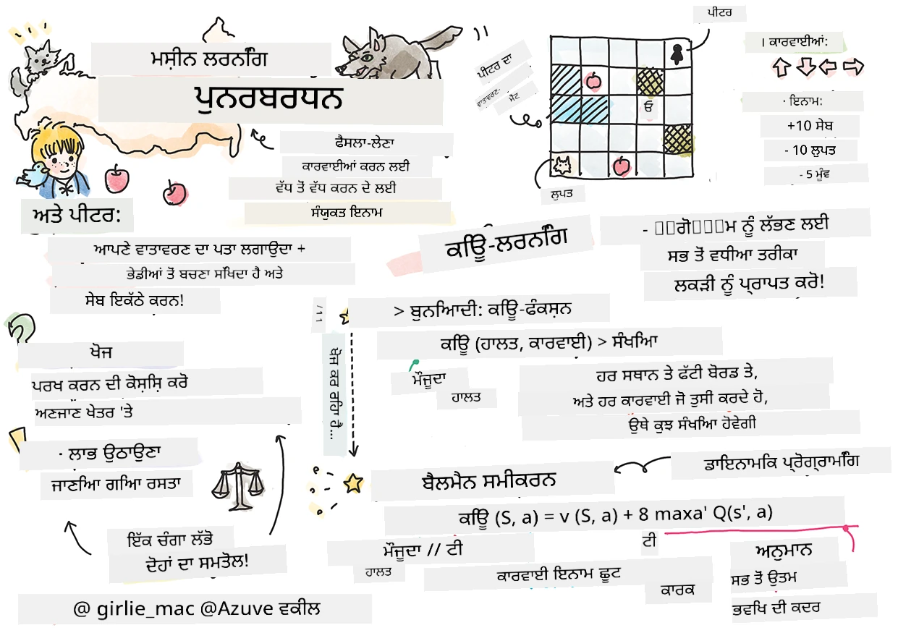
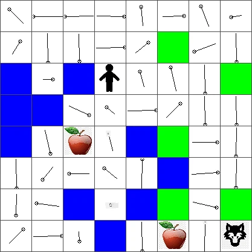

# ਰੀਇਨਫੋਰਸਮੈਂਟ ਲਰਨਿੰਗ ਅਤੇ ਕਿਊ-ਲਰਨਿੰਗ ਦਾ ਪਰਿਚਯ


> ਸਕੈਚਨੋਟ [ਟੋਮੋਮੀ ਇਮੁਰਾ](https://www.twitter.com/girlie_mac) ਵੱਲੋਂ

ਰੀਇਨਫੋਰਸਮੈਂਟ ਲਰਨਿੰਗ ਵਿੱਚ ਤਿੰਨ ਮਹੱਤਵਪੂਰਣ ਧਾਰਣਾਵਾਂ ਸ਼ਾਮਲ ਹੁੰਦੀਆਂ ਹਨ: ਏਜੰਟ, ਕੁਝ ਸਥਿਤੀਆਂ, ਅਤੇ ਹਰ ਸਥਿਤੀ 'ਚ ਕਾਰਵਾਈਆਂ ਦਾ ਸੈੱਟ। ਕਿਸੇ ਨਿਰਧਾਰਤ ਸਥਿਤੀ ਵਿੱਚ ਇੱਕ ਕਾਰਵਾਈ ਕਰਕੇ, ਏਜੰਟ ਨੂੰ ਇਨਾਮ ਮਿਲਦਾ ਹੈ। ਫਿਰ ਸੋਚੋ ਕਮਪਿਊਟਰ ਖੇਡ ਸੂਪਰ ਮਾਰੀਓ ਦੀ। ਤੁਸੀਂ ਮਾਰੀਓ ਹੋ, ਤੁਸੀਂ ਇੱਕ ਖੇਡ ਸਤਰ ਵਿੱਚ ਹੋ, ਇੱਕ ਖੱਡ ਦੇ ਕਿਨਾਰੇ ਖੜੇ ਹੋ। ਤੁਹਾਡੇ ਉਪਰ ਇੱਕ ਸਿੱਕਾ ਹੈ। ਤੁਸੀਂ ਮਾਰੀਓ ਹੋ, ਇੱਕ ਖੇਡ ਸਤਰ ਵਿੱਚ, ਇੱਕ ਖਾਸ ਸਥਿਤੀ ਵਿੱਚ ... ਇਹ ਤੁਹਾਡੀ ਸਥਿਤੀ ਹੈ। ਸੱਜੇ ਵੱਲ ਇੱਕ ਕਦਮ ਚਲਣਾ (ਇੱਕ ਕਾਰਵਾਈ) ਤੁਹਾਨੂੰ ਕਿਨਾਰੇ ਤੋਂ ਥੱਲੇ ਲੈ ਜਾਵੇਗਾ, ਅਤੇ ਇਹ ਤੁਹਾਨੂੰ ਨੀਵਾਂ ਗਿਣਤੀ ਸкоਰ ਦੇਵੇਗਾ। ਹਾਲਾਂਕਿ, ਕੂਦਨ ਵਾਲਾ ਬਟਨ ਦਬਾਉਣ ਨਾਲ ਤੁਹਾਨੂੰ ਇੱਕ ਅੰਕ ਮਿਲੇਗਾ ਅਤੇ ਤੁਸੀਂ ਜੀਵਤ ਰਹੋਗੇ। ਇਹ ਇੱਕ ਸਕਾਰਾਤਮਕ ਨਤੀਜਾ ਹੈ ਅਤੇ ਇਸਦਾ ਇਨਾਮ ਇੱਕ ਸਕਾਰਾਤਮਕ ਗਿਣਤੀ ਸкоਰ ਹੋਣਾ ਚਾਹੀਦਾ ਹੈ।

ਰੀਇਨਫੋਰਸਮੈਂਟ ਲਰਨਿੰਗ ਅਤੇ ਸਿਮ्युਲੇਟਰ (ਖੇਡ) ਦੀ ਵਰਤੋਂ ਕਰਕੇ, ਤੁਸੀਂ ਖੇਡ ਕਿਵੇਂ ਖੇਡਣੀ ਹੈ ਇਹ ਸਿੱਖ ਸਕਦੇ ਹੋ ਤਾਂ ਕਿ ਇਨਾਮ ਵੱਧ ਤੋਂ ਵੱਧ ਹੋਵੇ ਜਿਹੜਾ ਕਿ ਜੀਵਤ ਰਹਿਣ ਅਤੇ ਜਿੰਨਾ ਹੋ ਸਕੇ ਅੰਕ ਪ੍ਰਾਪਤ ਕਰਨ ਵਿੱਚ ਹੈ।

[](https://www.youtube.com/watch?v=lDq_en8RNOo)

> 🎥 ਉਪਰ ਦਿੱਤੀ ਚਿੱਤਰ 'ਤੇ ਕਲਿਕ ਕਰਕੇ ਡਿਮਿਤਰੀ ਨੂੰ ਰੀਇਨਫੋਰਸਮੈਂਟ ਲਰਨਿੰਗ ਬਾਰੇ ਵਿਚਾਰ ਕਰਦੇ ਸੁਣੋ

## [ਪ੍ਰੀ-ਲੈਕਚਰ ਕਿਊਜ਼](https://ff-quizzes.netlify.app/en/ml/)

## ਪਹਿਲਾਂ ਦੀਆਂ ਲੋੜਾਂ ਅਤੇ ਸੈਟਅੱਪ

ਇਸ ਪਾਠ ਵਿੱਚ, ਅਸੀਂ Python ਵਿੱਚ ਕੁਝ ਕੋਡ ਨਾਲ ਪ੍ਰਯੋਗ ਕਰਾਂਗੇ। ਤੁਹਾਨੂੰ ਇਸ ਪਾਠ ਦਾ Jupyter Notebook ਕੋਡ ਚਲਾਉਣ ਦੇ ਯੋਗ ਹੋਣਾ ਚਾਹੀਦਾ ਹੈ, ਚਾਹੇ ਉਹ ਤੁਹਾਡੇ ਕੰਪਿਊਟਰ 'ਤੇ ਹੋਵੇ ਜਾਂ ਕੁਝ ਬੱਦਲ ਵਿੱਚ।

ਤੁਸੀਂ [ਲੇਸਨ ਨੋਟਬੁੱਕ](https://github.com/microsoft/ML-For-Beginners/blob/main/8-Reinforcement/1-QLearning/notebook.ipynb) ਖੋਲ੍ਹ ਸਕਦੇ ਹੋ ਅਤੇ ਇਸ ਪਾਠ ਦੇ ਨਾਲ ਤਿਆਰ ਕਰ ਸਕਦੇ ਹੋ।

> **ਨੋਟ:** ਜੇ ਤੁਸੀਂ ਇਹ ਕੋਡ ਬੱਦਲ ਵਿੱਚ ਖੋਲ੍ਹ ਰਹੇ ਹੋ, ਤਾਂ ਤੁਹਾਨੂੰ [`rlboard.py`](https://github.com/microsoft/ML-For-Beginners/blob/main/8-Reinforcement/1-QLearning/rlboard.py) ਫਾਈਲ ਵੀ ਲੈਣੀ ਪਵੇਗੀ, ਜੋ ਕਿ ਨੋਟਬੁੱਕ ਕੋਡ ਵਿੱਚ ਵਰਤੀ ਜਾਂਦੀ ਹੈ। ਇਨ੍ਹਾਂ ਨੂੰ ਨੋਟਬੁੱਕ ਦੇ ਸਮੇਤ ਡਾਇਰੈਕਟਰੀ ਵਿੱਚ ਰੱਖੋ।

## ਪਰਿਚਯ

ਇਸ ਪਾਠ ਵਿੱਚ, ਅਸੀਂ **[ਪੀਟਰ ਅਤੇ ਵੁਲਫ](https://en.wikipedia.org/wiki/Peter_and_the_Wolf)** ਦੀ ਦੁਨੀਆ ਦਾ ਪਤਾ ਲਗਾਵਾਂਗੇ, ਜੋ ਕਿ ਰੂਸੀ ਸੰਗੀਤਕਾਰ [ਸੇਰਗਈ ਪ੍ਰੋਕੋਫੀਏਵ](https://en.wikipedia.org/wiki/Sergei_Prokofiev) ਦੀ ਸੰਗੀਤਕ ਲੋਕ-ਕਹਾਣੀ ਤੋਂ ਪ੍ਰੇਰਿਤ ਹੈ। ਅਸੀਂ **ਰੀਇਨਫੋਰਸਮੈਂਟ ਲਰਨਿੰਗ** ਦੀ ਵਰਤੋਂ ਕਰਾਂਗੇ ਤਾਂ ਜੋ ਪੀਟਰ ਆਪਣੇ ਵਾਤਾਵਰਣ ਦੀ ਖੋਜ ਕਰ ਸਕੇ, ਸੁਆਦਲੇ ਸੇਬ ਇਕੱਠੇ ਕਰ ਸਕੇ ਅਤੇ ਵੁਲਫ ਤੱਕ ਪਹੁੰਚਣ ਤੋਂ ਬਚ ਸਕੇ।

**ਰੀਇਨਫੋਰਸਮੈਂਟ ਲਰਨਿੰਗ** (RL) ਇੱਕ ਸਿੱਖਣ ਦੀ ਤਕਨੀਕ ਹੈ ਜੋ ਸਾਨੂੰ ਕਈ ਪ੍ਰਯੋਗਾਂ ਨੂੰ ਚਲਾਕੇ ਇੱਕ **ਏਜੰਟ** ਦਾ ਸਭ ਤੋਂ ਵਧੀਆ ਵਿਹਾਰ ਸਿੱਖਣ ਦੀ ਆਗਿਆ ਦਿੰਦੀ ਹੈ ਕੁਝ **ਵਾਤਾਵਰਣ** ਵਿੱਚ। ਇਸ ਵਾਤਾਵਰਣ ਵਿੱਚ ਏਜੰਟ ਦਾ ਇੱਕ ਕੁਝ **ਲਕੜੀ** ਹੋਣਾ ਚਾਹੀਦਾ ਹੈ, ਜੋ ਕਿ ਇੱਕ **ਇਨਾਮ ਕਾਰਜ** ਨਾਲ ਪਰਿਭਾਸ਼ਿਤ ਹੁੰਦਾ ਹੈ।

## ਵਾਤਾਵਰਣ

ਸਾਦਗੀ ਲਈ, ਆਓ ਪੀਟਰ ਦੀ ਦੁਨੀਆ ਨੂੰ `width` x `height` ਸਾਈਜ਼ ਦੀ ਇੱਕ ਵਰਗ ਬੋਰਡ ਸਮਝੀਏ, ਜਿਵੇਂ ਕਿ ਇੱਥੇ ਦਿੱਤਾ ਗਿਆ ਹੈ:


ਇਸ ਬੋਰਡ ਦੇ ਹਰ ਸੈੱਲ ਵਿੱਚ ਹੋ ਸਕਦਾ ਹੈ:

* **ਜ਼ਮੀਨ**, ਜਿਸ 'ਤੇ ਪੀਟਰ ਅਤੇ ਹੋਰ ਜੀਵ ਚੱਲ ਸਕਦੇ ਹਨ।
* **ਪਾਣੀ**, ਜਿਸ 'ਤੇ ਤੁਹਾਡੇ ਲਈ ਚੱਲਣਾ ਸੰਭਵ ਨਹੀਂ ਹੈ।
* ਇੱਕ **ਟ੍ਰੀ** ਜਾਂ **ਘਾਸ**, ਜਿੱਥੇ ਤੁਸੀਂ ਆਰਾਮ ਕਰ ਸਕਦੇ ਹੋ।
* ਇੱਕ **ਸੇਬ**, ਜੋ ਕਿ ਪੀਟਰ ਲਈ ਖਾਣ ਲਈ ਖੋਜਣਯੋਗਤਾ ਦਰਸਾਉਂਦਾ ਹੈ।
* ਇੱਕ **ਵੁਲਫ**, ਜੋ ਕਿ ਖਤਰਨਾਕ ਹੈ ਅਤੇ ਬਚਣਾ ਚਾਹੀਦਾ ਹੈ।

ਇੱਕ ਵੱਖਰਾ Python ਮਾਡਿਊਲ ਹੈ, [`rlboard.py`](https://github.com/microsoft/ML-For-Beginners/blob/main/8-Reinforcement/1-QLearning/rlboard.py), ਜਿਸ ਵਿੱਚ ਇਹ ਵਾਤਾਵਰਣ ਨਾਲ ਕੰਮ ਕਰਨ ਲਈ ਕੋਡ ਹੈ। ਕਿਉਂਕਿ ਇਹ ਕੋਡ ਸਾਡੇ ਧਾਰਣਾਵਾਂ ਨੂੰ ਸਮਝਣ ਲਈ ਮਹੱਤਵਪੂਰਣ ਨਹੀਂ ਹੈ, ਅਸੀਂ ਮਾਡਿਊਲ ਨੂੰ ਇੰਪੋਰਟ ਕਰਾਂਗੇ ਅਤੇ ਨਮੂਨਾ ਬੋਰਡ ਬਣਾਉਣ ਲਈ ਇਸਦੀ ਵਰਤੋਂ ਕਰਾਂਗੇ (ਕੋਡ ਬਲਾਕ 1):

```python
from rlboard import *

width, height = 8,8
m = Board(width,height)
m.randomize(seed=13)
m.plot()
```

ਇਹ ਕੋਡ ਉਪਰ ਦਿੱਤਾ ਵਾਤਾਵਰਣ ਦੀ ਤਸਵੀਰ ਪ੍ਰਿੰਟ ਕਰਨੀ ਚਾਹੀਦੀ ਹੈ।

## ਕਾਰਵਾਈਆਂ ਅਤੇ ਨੀਤੀ

ਸਾਡੇ ਉਦਾਹਰਨ ਵਿੱਚ, ਪੀਟਰ ਦਾ ਲਕੜੀ ਇੱਕ ਸੇਬ ਖੋਜਣ ਲਈ ਹੋਵੇਗਾ, ਜਦਕਿ ਵੁਲਫ ਅਤੇ ਹੋਰ ਰੁਕਾਵਟਾਂ ਤੋਂ ਬਚਦੇ ਹੋਏ। ਇਸ ਲਈ, ਉਹ ਬੁਨਿਆਦੀ ਤੌਰ 'ਤੇ ਚੱਲਦਾ ਰਹੇਗਾ ਜਦ ਤੱਕ ਉਹ ਸੇਬ ਨਹੀਂ ਲੱਭ ਲੈਂਦਾ।

ਇਸ ਲਈ, ਕਿਸੇ ਵੀ ਸਥਿਤੀ 'ਚ, ਉਹ ਹੇਠ ਲਿਖੀਆਂ ਕਾਰਵਾਈਆਂ ਵਿੱਚੋਂ ਇੱਕ ਚੁਣ ਸਕਦਾ ਹੈ: ਉਪਰ, ਹੇਠਾਂ, ਖੱਬੇ ਅਤੇ ਸੱਜੇ।

ਅਸੀਂ ਇਹ ਕਾਰਵਾਈਆਂ ਇੱਕ ਡਿਕਸ਼ਨਰੀ ਵਜੋਂ ਪਰਿਭਾਸ਼ਿਤ ਕਰਾਂਗੇ, ਅਤੇ ਉਨ੍ਹਾਂ ਨੂੰ ਸਮੇਂਨੁਸਾਰ ਕੋਆਰਡੀਨੇਟ ਬਦਲਾਅ ਨਾਲ ਜੋੜਾਂਗੇ। ਉਦਾਹਰਨ ਵਜੋਂ, ਸੱਜੇ ਵੱਲ ਜਾਣਾ (`R`) ਜੋ `(1,0)` ਜੋੜ ਨਾਲ ਮੇਲ ਖਾਂਦਾ ਹੈ। (ਕੋਡ ਬਲਾਕ 2):

```python
actions = { "U" : (0,-1), "D" : (0,1), "L" : (-1,0), "R" : (1,0) }
action_idx = { a : i for i,a in enumerate(actions.keys()) }
```

ਸੰਖੇਪ ਕਰਨ ਲਈ, ਇਸ ਦ੍ਰਿਸ਼ ਦਾ ਰਣਨੀਤੀ ਅਤੇ ਲਕੜੀ ਐਸਾ ਹੈ:

- **ਰਣਨੀਤੀ**, ਸਾਡੇ ਏਜੰਟ (ਪੀਟਰ) ਦੀ ਨੀਤੀ ਨਾਲ ਪਰਿਭਾਸ਼ਿਤ ਹੁੰਦੀ ਹੈ। ਨੀਤੀ ਇੱਕ ਐਸਾ ਕਾਰਜ ਹੁੰਦਾ ਹੈ ਜੋ ਕਿਸੇ ਵੀ ਸਥਿਤੀ 'ਚ ਕਾਰਵਾਈ ਵਾਪਸ ਕਰਦਾ ਹੈ। ਸਾਡੇ ਮਾਮਲੇ ਵਿੱਚ, ਸਮੱਸਿਆ ਦੀ ਸਥਿਤੀ ਬੋਰਡ ਨਾਲ ਦਰਸਾਈ ਜਾਂਦੀ ਹੈ, ਜਿਸ ਵਿੱਚ ਖਿਡਾਰੀ ਦੀ ਮੌਜੂਦਾ ਸਥਿਤੀ ਸ਼ਾਮਲ ਹੈ।

- **ਲਕੜੀ**, ਰੀਇਨਫੋਰਸਮੈਂਟ ਲਰਨਿੰਗ ਦਾ ਮਨੋਰਥ ਅੰਤ ਵਿੱਚ ਇੱਕ ਚੰਗੀ ਨੀਤੀ ਸਿੱਖਣਾ ਹੈ ਜੋ ਸਮੱਸਿਆ ਨੂੰ ਪ੍ਰਭਾਵਸ਼ਾਲੀ ਢੰਗ ਨਾਲ ਹੱਲ ਕਰੇ। ਹਾਲਾਂਕਿ, ਇੱਕ ਮੂਲ ਨੀਤੀ ਵਜੋਂ, ਆਓ ਸਭ ਤੋਂ ਸਧਾਰਨ ਨੀਤੀ ਜੋ ਕਿ **ਅਲੋਚਨਾਤਮਕ ਕਦਮ** ਆਖੀ ਜਾਵੇ ਨੂੰ ਸੋਚੀਏ।

## ਰੈਂਡਮ ਵਾਕ

ਸਭ ਤੋਂ ਪਹਿਲਾਂ, ਅਸੀਂ ਆਪਣੀ ਸਮੱਸਿਆ ਨੂੰ ਇੱਕ ਰੈਂਡਮ ਵਾਕ ਰਣਨੀਤੀ ਨਾਲ ਹੱਲ ਕਰਾਂਗੇ। ਰੈਂਡਮ ਵਾਕ ਵਿੱਚ, ਅਸੀਂ ਅਗਲੀ ਕਾਰਵਾਈ ਬਿਨਾਂ ਕਿਸੇ ਵਿਸ਼ੇਸ਼ ਚੋਣ ਤੋਂ ਬਿਨਾ ਬਾਹਰੀ ਕਾਰਵਾਈਆਂ ਵਿਚੋਂ ਚੁਣਾਂਗੇ, ਜਦ ਤੱਕ ਅਸੀਂ ਸੇਬ ਤੱਕ ਨਹੀਂ ਪਹੁੰਚ ਜਾਂਦੇ (ਕੋਡ ਬਲਾਕ 3)।

1. ਹੇਠਾਂ ਦਿੱਤੇ ਕੋਡ ਨਾਲ ਰੈਂਡਮ ਵਾਕ ਨੂੰ ਲਾਗੂ ਕਰੋ:

    ```python
    def random_policy(m):
        return random.choice(list(actions))
    
    def walk(m,policy,start_position=None):
        n = 0 # ਕਦਮਾਂ ਦੀ ਗਿਣਤੀ
        # ਸ਼ੁਰੂਆਤੀ ਸਥਾਨ ਸੈਟ ਕਰੋ
        if start_position:
            m.human = start_position 
        else:
            m.random_start()
        while True:
            if m.at() == Board.Cell.apple:
                return n # ਸਫਲਤਾ!
            if m.at() in [Board.Cell.wolf, Board.Cell.water]:
                return -1 # ਭੇਦੀਆ ਨੇ ਖਾ ਲਿਆ ਜਾਂ ਡੁੱਬ ਗਿਆ
            while True:
                a = actions[policy(m)]
                new_pos = m.move_pos(m.human,a)
                if m.is_valid(new_pos) and m.at(new_pos)!=Board.Cell.water:
                    m.move(a) # ਅਸਲ ਚਾਲ ਕਰੋ
                    break
            n+=1
    
    walk(m,random_policy)
    ```

      `walk` ਕਾਲ ਨੂੰ ਸਬੰਧਤ ਰਸਤੇ ਦੀ ਲੰਬਾਈ ਵਾਪਸ ਕਰਨੀ ਚਾਹੀਦੀ ਹੈ, ਜੋ ਕਿ ਇੱਕ ਦੌੜ ਤੋਂ ਦੂਜੇ ਦੌੜ ਤੱਕ ਵੱਖ ਹੋ ਸਕਦੀ ਹੈ। 

1. ਵਾਕ ਪ੍ਰਯੋਗ ਨੂੰ ਕੁਝ ਵਾਰ (ਜਿਵੇਂ 100) ਚਲਾਓ ਅਤੇ ਨਤੀਜੇ ਵਾਲੀ ਸਾਂਖਿਕੀ ਪ੍ਰਿੰਟ ਕਰੋ (ਕੋਡ ਬਲਾਕ 4):

    ```python
    def print_statistics(policy):
        s,w,n = 0,0,0
        for _ in range(100):
            z = walk(m,policy)
            if z<0:
                w+=1
            else:
                s += z
                n += 1
        print(f"Average path length = {s/n}, eaten by wolf: {w} times")
    
    print_statistics(random_policy)
    ```

    ਧਿਆਨ ਦਿਓ ਕਿ ਇੱਕ ਰਸਤੇ ਦੀ ਔਸਤ ਲੰਬਾਈ ਲਗਭਗ 30-40 ਕਦਮ ਹੁੰਦੀ ਹੈ, ਜੋ ਕਿ ਕਾਫੀ ਵੱਧ ਹੈ, ਇਹ ਸੋਚਦੇ ਹੋਏ ਕਿ ਸਭ ਤੋਂ ਨੇੜੇ ਸੇਬ ਵਿੱਚ ਔਸਤ ਦੂਰੀ ਲਗਭਗ 5-6 ਕਦਮ ਹੈ।

    ਤੁਸੀਂ ਵੇਖ ਸਕਦੇ ਹੋ ਕਿ ਪੀਟਰ ਦੀ ਚਾਲ ਰੈਂਡਮ ਵਾਕ ਦੌਰਾਨ ਕਿਵੇਂ ਦਿਖਦੀ ਹੈ:

    

## ਇਨਾਮ ਕਾਰਜ

ਸਾਡੀ ਨੀਤੀ ਨੂੰ ਹੋਰ ਸਮਝਦਾਰ ਬਣਾਉਣ ਲਈ, ਸਾਨੂੰ ਸਮਝਣਾ ਪਏਗਾ ਕਿ ਕਿਹੜੇ ਕਦਮ ਦੂਜੇ ਨਾਲੋਂ "ਚੰਗੇ" ਹਨ। ਇਸ ਲਈ ਸਾਨੂੰ ਆਪਣਾ ਮਨੋਰਥ ਪਰਿਭਾਸ਼ਿਤ ਕਰਨ ਦੀ ਲੋੜ ਹੈ।

ਮਨੋਰਥ ਨੂੰ ਇੱਕ **ਇਨਾਮ ਕਾਰਜ** ਦੇ ਰੂਪ ਵਿੱਚ ਪਰਿਭਾਸ਼ਿਤ ਕੀਤਾ ਜਾ ਸਕਦਾ ਹੈ, ਜੋ ਹਰੇਕ ਸਥਿਤੀ ਲਈ ਕੁਝ ਸਕੋਰ ਮੁੱਲ ਵਾਪਸ ਕਰਦਾ ਹੈ। ਜਿਥੇ ਨੰਬਰ ਵੱਧ ਹੁੰਦਾ ਹੈ, ਉਥੇ ਇਨਾਮ ਕਾਰਜ ਵਧੀਆ ਹੁੰਦਾ ਹੈ। (ਕੋਡ ਬਲਾਕ 5)

```python
move_reward = -0.1
goal_reward = 10
end_reward = -10

def reward(m,pos=None):
    pos = pos or m.human
    if not m.is_valid(pos):
        return end_reward
    x = m.at(pos)
    if x==Board.Cell.water or x == Board.Cell.wolf:
        return end_reward
    if x==Board.Cell.apple:
        return goal_reward
    return move_reward
```

ਇਨਾਮ ਕਾਰਜਾਂ ਬਾਰੇ ਇਕ ਦਿਲਚਸਪ ਗੱਲ ਇਹ ਹੈ ਕਿ ਅਕਸਰ ਕੇਸਜ਼ ਵਿੱਚ, *ਸਾਨੂੰ ਕੇਵਲ ਖੇਡ ਦੇ ਅੰਤ 'ਤੇ ਮਹੱਤਵਪੂਰਣ ਇਨਾਮ ਮਿਲਦਾ ਹੈ*। ਇਸਦਾ ਅਰਥ ਹੈ ਕਿ ਸਾਡਾ ਐਲਗੋਰਿਥਮ ਕਿਸੇ ਤਰੀਕੇ ਨਾਲ "ਚੰਗੇ" ਕਦਮ ਯਾਦ ਰੱਖਣਾ ਚਾਹੀਦਾ ਹੈ ਜੋ ਖੇਡ ਦੇ ਅੰਤ ਵਿੱਚ ਸਕਾਰਾਤਮਕ ਇਨਾਮ ਵੱਲ ਲੈ ਜਾਂਦੇ ਹਨ, ਅਤੇ ਉਨ੍ਹਾਂ ਦੀ ਮਹੱਤਤਾ ਵਧਾਉਣੀ ਚਾਹੀਦੀ ਹੈ। ਇਸੇ ਤਰ੍ਹਾਂ, ਜਿਹੜੇ ਬੁਰੇ ਨਤੀਜੇ ਵੱਲ ਲੈ ਜਾਣ ਵਾਲੇ ਕਦਮ ਹਨ, ਉਨ੍ਹਾਂ ਨੂੰ ਹਤਾਇਤ ਕੀਤਾ ਜਾਣਾ ਚਾਹੀਦਾ ਹੈ।

## ਕਿਊ-ਲਰਨਿੰਗ

ਇਕ ਐਲਗੋਰਿਥਮ ਜਿਸ ਬਾਰੇ ਅਸੀਂ ਇੱਥੇ ਗੱਲ ਕਰਾਂਗੇ ਉਸਨੂੰ **ਕਿਊ-ਲਰਨਿੰਗ** ਕਹਿੰਦੇ ਹਨ। ਇਸ ਐਲਗੋਰਿਥਮ ਵਿੱਚ, ਨੀਤੀ ਇੱਕ ਕਾਰਜ (ਜਾਂ ਡੇਟਾ ਸਟ੍ਰਕਚਰ) ਨਾਲ ਪਰਿਭਾਸ਼ਿਤ ਹੁੰਦੀ ਹੈ ਜਿਸਨੂੰ **ਕਿਊ-ਟੇਬਲ** ਕਹਿੰਦੇ ਹਨ। ਇਹ ਹਰ ਸਥਿਤੀ ਵਿੱਚ ਹਰ ਕਾਰਵਾਈ ਦੀ "ਚੰਗਾਈ" ਨੂੰ ਦਰਜ ਕਰਦਾ ਹੈ।

ਇਹ ਕਿਊ-ਟੇਬਲ ਕਿਉਂਕਿ ਅਕਸਰ ਸਾਰਣੀ ਜਾਂ ਬਹੁ-ਆਯਾਮੀ ਐਰੇ ਵਜੋਂ ਦਰਸਾਉਣਾ ਸੁਵਿਧਾਜਨਕ ਹੁੰਦਾ ਹੈ ਇਸ ਲਈ ਇਸਨੂੰ ਕਿਊ-ਟੇਬਲ ਕਿਹਾ ਜਾਂਦਾ ਹੈ। ਚੁੱਕੀ ਸਾਡਾ ਬੋਰਡ `width` x `height` ਪੈਮਾਨਿਆਂ ਦਾ ਹੈ, ਅਸੀਂ ਕਿਊ-ਟੇਬਲ ਨੂੰ numpy ਐਰੇ ਵਰਗਾ ਪ੍ਰਤਿਨਿਧਿਤ ਕਰ ਸਕਦੇ ਹਾਂ ਜਿਸ ਦਾ ਆਕਾਰ `width` x `height` x `len(actions)` ਹੁੰਦਾ ਹੈ: (ਕੋਡ ਬਲਾਕ 6)

```python
Q = np.ones((width,height,len(actions)),dtype=np.float)*1.0/len(actions)
```

ਧਿਆਨ ਦਿਓ ਕਿ ਅਸੀਂ ਕਿਊ-ਟੇਬਲ ਦੇ ਸਾਰੇ ਮੁੱਲ ਇੱਕੋ ਜਿਹਾ ਮੁੱਲ ਸਥਾਪਿਤ ਕਰਦੇ ਹਾਂ, ਸਾਡੇ ਮਾਮਲੇ ਵਿੱਚ - 0.25। ਇਹ "ਅਲੋਚਨਾਤਮਕ ਵਾਕ" ਨੀਤੀ ਨੂੰ ਦਰਸਾਉਂਦਾ ਹੈ, ਕਿਉਂਕਿ ਹਰ ਸਥਿਤੀ ਵਿੱਚ ਸਾਰੀਆਂ ਕਾਰਵਾਈਆਂ ਬਰਾਬਰ ਚੰਗੀਆਂ ਹਨ। ਅਸੀਂ `plot` ਫੰਕਸ਼ਨ ਨੂੰ ਕਿਊ-ਟੇਬਲ ਦੇ ਸਕਦੇ ਹਾਂ ਤਾਂ ਜੋ ਬੋਰਡ 'ਤੇ ਸਾਰਣੀ ਨੂੰ ਦਰਸਾਇਆ ਜਾ ਸਕੇ: `m.plot(Q)`.


ਹਰ ਸੈੱਲ ਦੇ ਵਿਚਕਾਰ ਇਕ "ਤੇਜ਼ੀ" ਦਰਸਾਉਂਦਾ ਬाण ਹੈ ਜੋ ਪ੍ਰਸਤੀਤ ਚਾਲ ਦੀ ਦਿਸ਼ਾ ਦਰਸਾਉਂਦਾ ਹੈ। ਕਿਉਂਕਿ ਸਾਰੀਆਂ ਦਿਸ਼ਾਵਾਂ ਬਰਾਬਰ ਹਨ, ਇਸ ਲਈ ਇੱਕ ਨਿਸ਼ਾਨ (ਡਾਟ) ਦਿਖਾਇਆ ਗਿਆ ਹੈ।

ਹੁਣ ਸਾਨੂੰ ਸਿਮ्युਲੇਸ਼ਨ ਚਲਾਣਾ ਪਵੇਗਾ, ਆਪਣੇ ਵਾਤਾਵਰਣ ਦੀ ਖੋਜ ਕਰਨੀ ਪਵੇਗੀ, ਅਤੇ ਕਿਊ-ਟੇਬਲ ਮੁੱਲਾਂ ਦਾ ਬਿਹਤਰ ਵੰਡ ਸਿੱਖਣਾ ਪਵੇਗਾ, ਜੋ ਸਾਨੂੰ ਸੇਬ ਤੱਕ ਦਾ ਰਸਤਾ ਤੇਜ਼ੀ ਨਾਲ ਲੱਭਣ ਦੀ ਆਗਿਆ ਦੇਵੇਗਾ।

## ਕਿਊ-ਲਰਨਿੰਗ ਦਾ ਸਾਰ: ਬੇਲਮੈਨ ਸਮੀਕਰਨ

ਜਦੋਂ ਅਸੀਂ ਚੱਲਣਾ ਸ਼ੁਰੂ ਕਰਦੇ ਹਾਂ, ਤਾਂ ਹਰ ਕਾਰਵਾਈ ਦਾ ਇੱਕ ਸੰਬੰਧਤ ਇਨਾਮ ਹੁੰਦਾ ਹੈ, ਅਰਥਾਤ ਅਸੀਂ ਸਿਧਾ ਤੌਰ 'ਤੇ ਸਭ ਤੋਂ ਵੱਧ ਤੁਰੰਤ ਇਨਾਮ ਦੇ ਆਧਾਰ 'ਤੇ ਅਗਲੀ ਕਾਰਵਾਈ ਚੁਣ ਸਕਦੇ ਹਾਂ। ਹਾਲਾਂਕਿ, ਬਹੁਤ ਸਾਰੀਆਂ ਸਥਿਤੀਆਂ ਵਿੱਚ, ਚਾਲ ਸਾਡੇ ਲਕੜੀ ਨੂੰ ਪੂਰਾ ਨਹੀਂ ਕਰਦੀ ਜਿਸ ਦਾ ਮਨੋਰਥ ਸੇਬ ਤੱਕ ਪਹੁੰਚਣਾ ਹੈ, ਅਤੇ ਇਸ ਲਈ ਅਸੀਂ ਤੁਰੰਤ ਫੈਸਲਾ ਨਹੀਂ ਕਰ ਸਕਦੇ ਕਿ ਕਿਹੜੀ ਦਿਸ਼ਾ ਵਧੀਆ ਹੈ।

> ਯਾਦ ਰੱਖੋ ਕਿ ਇਹ ਤੁਰੰਤ ਨਤੀਜਾ ਨਹੀਂ ਹੈ ਜੋ ਮਾਇਨੇ ਰੱਖਦਾ ਹੈ, ਸਗੋਂ ਆਖਰ ਦਾ ਨਤੀਜਾ ਜੋ ਅਸੀਂ ਸਿਮੁਲੇਸ਼ਨ ਦੇ ਅੰਤ ਵਿੱਚ ਪ੍ਰਾਪਤ ਕਰਾਂਗੇ।

ਇਸ ਵਿਲੰਬਿਤ ਇਨਾਮ ਨੂੰ ਧਿਆਨ ਵਿੱਚ ਰੱਖਣ ਲਈ, ਸਾਨੂੰ **[ਡਾਇਨਾਮਿਕ ਪ੍ਰੋਗ੍ਰਾਮਿੰਗ](https://en.wikipedia.org/wiki/Dynamic_programming)** ਦੇ ਸਿਧਾਂਤ ਵਰਤਣੇ ਪੈਣਗੇ, ਜੋ ਸਾਨੂੰ ਸਮੱਸਿਆ ਨੂੰ ਪੁਨਰਾਵਰਤੀ ਤਰੀਕੇ ਨਾਲ ਸੋਚਣ ਦੀ ਆਗਿਆ ਦਿੰਦੇ ਹਨ।

ਮਾਨੋ ਕਿ ਅਸੀਂ ਹੁਣ ਸਥਿਤੀ *s* 'ਚ ਹਾਂ ਅਤੇ ਅਸੀਂ ਅਗਲੀ ਸਥਿਤੀ *s'* ਵੱਲ ਜਾਣਾ ਚਾਹੁੰਦੇ ਹਾਂ। ਇਸ ਨਾਲ, ਅਸੀਂ ਤੁਰੰਤ ਇਨਾਮ *r(s,a)* ਪ੍ਰਾਪਤ ਕਰਾਂਗੇ ਜੋ ਇਨਾਮ ਕਾਰਜ ਨਾਲ ਪਰਿਭਾਸ਼ਿਤ ਹੈ, ਨਾਲ ਹੀ ਕੁਝ ਭਵਿੱਖੀ ਇਨਾਮ ਵੀ ਮਿਲੇਗਾ। ਜੇ ਅਸੀਂ ਮੰਨ ਲਈਏ ਕਿ ਸਾਡੀ ਕਿਊ-ਟੇਬਲ ਹਰ ਕਾਰਵਾਈ ਦੀ "ਆਕਰਸ਼ਣ" ਨੂੰ ਵਧੀਆ ਢੰਗ ਨਾਲ ਦਰਸਾਉਂਦੀ ਹੈ, ਤਾਂ ਸਥਿਤੀ *s'* 'ਚ ਅਸੀਂ ਉਹ ਕਾਰਵਾਈ *a'* ਚੁਣਾਂਗੇ ਜੋ *Q(s',a')* ਦੀ ਵੱਧ ਤੋਂ ਵੱਧ ਮੁੱਲ ਨੂੰ ਦਰਸਾਉਂਦੀ ਹੈ। ਇਸ ਤਰ੍ਹਾਂ, ਸਥਿਤੀ *s* 'ਚ ਅਸੀਂ ਸਭ ਤੋਂ ਵਧੀਆ ਸੰਭਾਵਿਤ ਭਵਿੱਖੀ ਇਨਾਮ ਲਭ ਸਕਦੇ ਹਾਂ ਜੋ ਇਸ ਤਰ੍ਹਾਂ ਪਰਿਭਾਸ਼ਿਤ ਹੁੰਦਾ ਹੈ: `max`<sub>a'</sub>*Q(s',a')* (ਇੱਥੇ ਵੱਧ ਤੋਂ ਵੱਧ ਕੀਤੀ ਗਈ ਹੈ ਸਮਭਾਵਤ ਕਾਰਵਾਈਆਂ *a'* 'ਤੇ ਸਥਿਤੀ *s'* ਵਿੱਚ)।

ਇਹ ਸਥਿਤੀ *s* 'ਤੇ ਕਾਰਵਾਈ *a* ਲਈ ਕਿਊ-ਟੇਬਲ ਦਾ ਮੁੱਲ ਕਲਕੁਲੇਟ ਕਰਨ ਲਈ **ਬੇਲਮੈਨ ਫਾਰਮੂਲਾ** ਹੈ:


ਇੱਥੇ γ ਇੱਕ **ਛੂਟਾ ਗੁਣਾ** ਹੁੰਦਾ ਹੈ ਜੋ ਇਹ ਤੈਅ ਕਰਦਾ ਹੈ ਕਿ ਤੁਸੀਂ ਭਵਿੱਖੀ ਇਨਾਮ ਨਾਲੋਂ ਮੌਜੂਦਾ ਇਨਾਮ ਨੂੰ ਕਿੰਨਾ ਤਰਜੀਹ ਦਿੰਦੇ ਹੋ ਜਾਂ ਇਸਦੇ ਉਲਟ।

## ਲਰਨਿੰਗ ਐਲਗੋਰਿਥਮ

ਉਪਰ ਦਿੱਤੇ ਸਮੀਕਰਨ ਦੇ ਅਧਾਰ 'ਤੇ, ਅਸੀਂ ਹੁਣ ਸਾਡੇ ਲਰਨਿੰਗ ਐਲਗੋਰਿਥਮ ਲਈ ਛਦਮ-ਕੋਡ ਲਿਖ ਸਕਦੇ ਹਾਂ:

* ਸਭ ਸਥਿਤੀਆਂ ਅਤੇ ਕਾਰਵਾਈਆਂ ਲਈ ਕਿਊ-ਟੇਬਲ Q ਦੀ ਸ਼ੁਰੂਆਤ ਇੱਕੋ ਜਿਹੇ ਨੰਬਰਾਂ ਨਾਲ ਕਰੋ
* ਲਰਨਿੰਗ ਰੇਟ α ← 1 ਸੈੱਟ ਕਰੋ
* ਬਹੁਤ ਵਾਰੀ ਸਿਮੁਲੇਸ਼ਨ ਨੂੰ ਦੁਹਰਾਓ
   1. ਕਿਸੇ ਬੇਤਕਲੀਫ ਸਥਿਤੀ ਤੋਂ ਸ਼ੁਰੂ ਕਰੋ
   1. ਦੁਹਰਾਓ
        1. ਸਥਿਤੀ *s* 'ਚ ਕਾਰਵਾਈ *a* ਚੁਣੋ
        2. ਨਵੀਂ ਸਥਿਤੀ *s'* 'ਤੇ ਚੱਲ ਕੇ ਕਾਰਵਾਈ ਕਰੋ
        3. ਜੇ ਅਸੀਂ ਖੇਡ ਦੇ ਅੰਤ ਦੀ ਸਥਿਤੀ ਨੂੰ ਮਿਲਦੇ ਹਾਂ, ਜਾਂ ਕੁੱਲ ਇਨਾਮ ਬਹੁਤ ਲਘੂ ਹੈ - ਸਿਮੁਲੇਸ਼ਨ ਤੋਂ ਬਾਹਰ ਨਿਕਲੋ  
        4. ਨਵੀਂ ਸਥਿਤੀ 'ਚ ਇਨਾਮ *r* ਦੀ ਗਣਨਾ ਕਰੋ
        5. ਬੇਲਮੈਨ ਸਮੀਕਰਨ ਮੁਤਾਬਕ Q-ਕਾਰਜ ਨੂੰ ਅਪਡੇਟ ਕਰੋ: *Q(s,a)* ← *(1-α)Q(s,a)+α(r+γ max<sub>a'</sub>Q(s',a'))*
        6. *s* ← *s'*
        7. ਕੁੱਲ ਇਨਾਮ ਅਪਡੇਟ ਕਰੋ ਅਤੇ α ਘਟਾਓ।

## ਖੋਜ ਅਤੇ ਸ਼ੋਧ

ਉਪਰ ਦਿੱਤੇ ਐਲਗੋਰਿਥਮ ਵਿੱਚ, ਅਸੀਂ ਇਹ ਨਹੀਂ ਦੱਸਿਆ ਕਿ ਅਸੀਂ ਕਿਵੇਂ ਸਥਿਤੀ 2.1 ਉੱਤੇ ਕਾਰਵਾਈ ਚੁਣਾਂਗੇ। ਜੇ ਅਸੀਂ ਕਾਰਵਾਈ ਬੇਤਕਲਤੀ ਚੁਣਦੇ ਹਾਂ, ਤਾਂ ਅਸੀਂ ਵਾਤਾਵਰਣ ਨੂੰ ਬੇਤਕਲਤੀ ਤਰੀਕੇ ਨਾਲ **ਖੋਜਾਂਗੇ**, ਅਤੇ ਅਸੀਂ ਅਕਸਰ ਮਰ ਸਕਦੇ ਹਾਂ ਜਿਵੇਂ ਕਿ ਅਸੀਂ ਉਸ ਖੇਤਰ ਦੀ ਖੋਜ ਕਰ ਰਹੇ ਹਾਂ ਜਿੱਥੇ ਅਸੀਂ ਆਮ ਤੌਰ 'ਤੇ ਨਹੀਂ ਜਾਂਦੇ। ਇੱਕ ਵਿਕਲਪਕ ਤਰੀਕਾ ਇਹ ਹੋਵੇਗਾ ਕਿ ਅਸੀਂ ਪਹਿਲਾਂ ਹੀ ਜਾਣੇ ਹੋਏ ਕਿਊ-ਟੇਬਲ ਮੁੱਲਾਂ ਨੂੰ **ਫਾਇਦਾ ਉਠਾਈਏ**, ਅਤੇ ਇਸ ਤਰ੍ਹਾਂ ਸਥਿਤੀ *s* 'ਚ ਸਭ ਤੋਂ ਵਧੀਆ ਕਾਰਵਾਈ ਚੁਣੋ। ਇਹ, ਹਾਲਾਂਕਿ, ਨਵੇਂ ਸਥਿਤੀਆਂ ਦੀ ਖੋਜ ਵਿੱਚ ਰੁਕਾਵਟ ਪੈਦਾ ਕਰੇਗਾ, ਅਤੇ ਸੰਭਾਵਨਾ ਹੈ ਕਿ ਅਸੀਂ ਸਭ ਤੋਂ ਵਧੀਆ ਹੱਲ ਨਹੀਂ ਲੱਭ ਸਕਾਂਗੇ।

ਇਸ ਲਈ, ਸਭ ਤੋਂ ਵਧੀਆ ਤਰੀਕਾ ਖੋਜ ਅਤੇ ਫਾਇਦੇ ਦੇ ਵਿਚਕਾਰ ਸੰਤੁਲਨ ਬਣਾਉਣਾ ਹੈ। ਇਹ ਕਿਸੇ ਸਥਿਤੀ *s* 'ਚ ਕਾਰਵਾਈ ਚੁਣਕੇ ਕੀਤਾ ਜਾ ਸਕਦਾ ਹੈ ਜਿਸਦੀ ਸੰਭਾਵਨਾ ਕਿਊ-ਟੇਬਲ ਮੁੱਲਾਂ ਨਾਲ ਅਨੁਪਾਤੀ ਹੁੰਦੀ ਹੈ। ਸ਼ੁਰੂ ਵਿੱਚ, ਜਦੋਂ ਕਿਊ-ਟੇਬਲ ਮੁੱਲ ਇੱਕੋ ਜਿਹੇ ਹੁੰਦੇ ਹਨ, ਇਹ ਅਲੋਚਨਾਤਮਕ ਚੋਣ ਵਾਂਗ ਹੋਵੇਗੀ, ਪਰ ਜਿਵੇਂ ਅਸੀਂ ਆਪਣੇ ਵਾਤਾਵਰਣ ਬਾਰੇ ਹੋਰ ਸਿੱਖਦੇ ਹਾਂ, ਅਸੀਂ ਸਭ ਤੋਂ ਵਧੀਆ ਰਸਤੇ ਦੀ ਪਾਲਣਾ ਜ਼ਿਆਦਾ ਕਰਨਗੇ ਤੇ ਕਦੇ-ਕਦੇ ਏਜੰਟ ਨੂੰ ਅਜਾਣੇ ਰਸਤੇ ਤੇ ਜਾਣਾ ਦਿੱਤਾ ਜਾਵੇਗਾ।

## ਪਾਈਥਨ ਅਮਲਦਾਰੀ

ਹੁਣ ਅਸੀਂ ਲਰਨਿੰਗ ਐਲਗੋਰਿਥਮ ਨੂੰ ਲਾਗੂ ਕਰਨ ਲਈ ਤਿਆਰ ਹਾਂ। ਇਸ ਤੋਂ ਪਹਿਲਾਂ, ਸਾਨੂੰ ਕੁਝ ਅਜਿਹੇ ਫੰਕਸ਼ਨ ਦੀ ਲੋੜ ਹੈ ਜੋ ਕਿਊ-ਟੇਬਲ ਦੇ ਬੇਤਰਤੀਬ ਨੰਬਰਾਂ ਨੂੰ ਕਾਰਵਾਈਆਂ ਲਈ ਸੰਭਾਵਨਾ ਵੈਕਟਰ ਵਿੱਚ ਬਦਲ ਸਕਦਾ ਹੈ।

1. ਇੱਕ ਫੰਕਸ਼ਨ `probs()` ਬਣਾਓ:

    ```python
    def probs(v,eps=1e-4):
        v = v-v.min()+eps
        v = v/v.sum()
        return v
    ```

    ਅਸੀਂ ਮੂਲ ਵੈਕਟਰ ਵਿੱਚ ਕੁਝ `eps` ਜੋੜਦੇ ਹਾਂ ਤਾਂ ਜੋ ਸ਼ੁਰੂਆਤੀ ਸਥਿਤੀ ਵਿੱਚ ਜਦੋਂ ਸਾਰੇ ਕੰਪੋਨੈਂਟ ਇੱਕੋ ਜਿਹੇ ਹੁੰਦੇ ਹਨ, 0 ਨਾਲ ਭਾਜਨ ਤੋਂ ਬਚਾ ਜਾ ਸਕੇ।

ਇਸ ਐਲਗੋਰਿਥਮ ਨੂੰ 5000 ਪ੍ਰਯੋਗਾਂ ਜਾਂ **ਐਪੋਕਸ** ਵਿੱਚ ਚਲਾਓ: (ਕੋਡ ਬਲਾਕ 8)
```python
    for epoch in range(5000):
    
        # ਸ਼ੁਰੂਆਤੀ ਸਥਾਨ ਚੁਣੋ
        m.random_start()
        
        # ਯਾਤਰਾ ਸ਼ੁਰੂ ਕਰੋ
        n=0
        cum_reward = 0
        while True:
            x,y = m.human
            v = probs(Q[x,y])
            a = random.choices(list(actions),weights=v)[0]
            dpos = actions[a]
            m.move(dpos,check_correctness=False) # ਅਸੀਂ ਖਿਡਾਰੀ ਨੂੰ ਬੋਰਡ ਤੋਂ ਬਾਹਰ ਜਾਣ ਦੀ ਆਗਿਆ ਦਿੰਦੇ ਹਾਂ, ਜੋ ਕਿ ਐਪੀਸੋਡ ਖਤਮ ਕਰਦਾ ਹੈ
            r = reward(m)
            cum_reward += r
            if r==end_reward or cum_reward < -1000:
                lpath.append(n)
                break
            alpha = np.exp(-n / 10e5)
            gamma = 0.5
            ai = action_idx[a]
            Q[x,y,ai] = (1 - alpha) * Q[x,y,ai] + alpha * (r + gamma * Q[x+dpos[0], y+dpos[1]].max())
            n+=1
```

ਇਸ ਐਲਗੋਰਿਥਮ ਨੂੰ ਚਲਾਉਣ ਤੋਂ ਬਾਅਦ, ਕਿਊ-ਟੇਬਲ ਨੂੰ ਅਪਡੇਟ ਕੀਤਾ ਜਾਣਾ ਚਾਹੀਦਾ ਹੈ ਜਿਸਦੇ ਮੁੱਲ ਵੱਖ-ਵੱਖ ਕਾਰਵਾਈਆਂ ਦੀ ਆਕਰਸ਼ਣਤਾ ਦਰਸਾਉਂਦੇ ਹਨ। ਅਸੀਂ ਕਿਊ-ਟੇਬਲ ਨੂੰ ਦਿਖਾਉਣ ਲਈ ਹਰ ਸੈੱਲ ਵਿੱਚ ਇੱਕ ਵੈਕਟਰ ਬਣਾਉਣਾ ਕੋਸ਼ਿਸ਼ ਕਰਾਂਗੇ ਜੋ ਚਾਲ ਦੀ ਇੱਛਿਤ ਦਿਸ਼ਾ ਵੱਲ ਸੰਕੇਤ ਕਰੇਗਾ। ਸਾਦਗੀ ਲਈ, ਅਸੀਂ ਤੀਰ ਮਗਰੋਂ ਛੋਟਾ ਗੋਲ ਘੇਰਾ ਖਿੱਚਦੇ ਹਾਂ।



## ਨੀਤੀ ਦੀ ਜਾਂਚ

ਕਿਊ-ਟੇਬਲ ਸਾਰੇ ਕਾਰਵਾਈਆਂ ਦੀ "ਆਕਰਸ਼ਣਤਾ" ਦਿਖਾਉਂਦਾ ਹੈ, ਇਸ ਲਈ ਸਾਡੀ ਦੁਨੀਆ ਵਿੱਚ ਪ੍ਰਭਾਵਸ਼ਾਲੀ ਨੇਵੀਗੇਸ਼ਨ ਲਈ ਇਸਨੂੰ ਵਰਤਣਾ ਕਾਫੀ ਅਸਾਨ ਹੈ। ਸਭ ਤੋਂ ਸਧਾਰਨ ਮਾਮਲੇ ਵਿੱਚ, ਅਸੀਂ ਸਭ ਤੋਂ ਵਧੀਆ ਕਿਊ-ਟੇਬਲ ਮੁੱਲ ਵਾਲੀ ਕਾਰਵਾਈ ਚੁਣ ਸਕਦੇ ਹਾਂ: (ਕੋਡ ਬਲਾਕ 9)

```python
def qpolicy_strict(m):
        x,y = m.human
        v = probs(Q[x,y])
        a = list(actions)[np.argmax(v)]
        return a

walk(m,qpolicy_strict)
```


> ਜੇ ਤੁਸੀਂ ਉਪਰੋਕਤ ਕੋਡ ਨੂੰ ਕਈ ਵਾਰੀ ਕੋਸ਼ਿਸ਼ ਕਰਦੇ ਹੋ, ਤਾਂ ਤੁਸੀਂ ਦੇਖ ਸਕਦੇ ਹੋ ਕਿ ਕਈ ਵਾਰੀ ਇਹ "ਫਸ ਜਾਂਦਾ ਹੈ", ਅਤੇ ਤੁਹਾਨੂੰ ਇਸ ਨੂੰ ਰੋਕਣ ਲਈ ਨੋਟਬੁੱਕ ਵਿੱਚ STOP ਬਟਨ ਦਬਾਉਣਾ ਪੈਂਦਾ ਹੈ। ਇਹ ਇਸ ਲਈ ਹੁੰਦਾ ਹੈ ਕਿਉਂਕਿ ਕਈ ਵਾਰੀ ਐਸੀਆਂ ਸਥਿਤੀਆਂ ਹੁੰਦੀਆਂ ਹਨ ਜਦੋਂ ਦੋ ਰਾਜ "ਆਪਸ ਵਿੱਚ ਨਿਰਧਾਰਿਤ Q-ਮੁੱਲ ਦੇ ਮਾਮਲੇ ਵਿੱਚ" ਇਕ ਦੂਜੇ ਨੂੰ ਸੂਚਿਤ ਕਰਦੇ ਹਨ, ਜਿਸਦੇ ਨਤੀਜੇ ਵਜੋਂ ਏਜੰਟ ਬੇਅੰਤ ਸਮੇਂ ਲਈ ਉਹਨਾਂ ਰਾਜਾਂ ਵਿੱਚ ਗੁੰਮਦਾ ਰਹਿੰਦਾ ਹੈ।

## 🚀ਚੈਲੰਜ

> **ਕਾਰਜ 1:** `walk` ਫੰਕਸ਼ਨ ਵਿੱਚ ਤਬਦੀਲੀ ਕਰੋ ਤਾਂ ਜੋ ਪੱਥ ਦੀ ਵੱਧ ਤੋਂ ਵੱਧ ਲੰਬਾਈ ਕੁਝ ਕਦਮਾਂ (ਮੰਨ ਲਓ, 100) ਤੱਕ ਸੀਮਿਤ ਕੀਤੀ ਜਾ ਸਕੇ, ਅਤੇ ਉਪਰੋਕਤ ਕੋਡ ਕਈ ਵਾਰੀ ਇਸ ਮੁੱਲ ਨੂੰ ਵਾਪਸ ਕਰਦਾ ਹੋਇਆ ਵੇਖੋ।

> **ਕਾਰਜ 2:** `walk` ਫੰਕਸ਼ਨ ਨੂੰ ਅਜਿਹਾ ਬਦਲੋ ਕਿ ਇਹ ਉਨ੍ਹਾਂ ਥਾਵਾਂ ਤੇ ਫਿਰ ਨਾ ਜਾਵੇ ਜਿੱਥੇ ਇਹ ਪਹਿਲਾਂ ਹੀ ਗਿਆ ਹੋਵੇ। ਇਸ ਨਾਲ `walk` ਦੇ ਲੂਪ ਵਿੱਚ ਫਸਣ ਤੋਂ ਬਚਾਅ ਹੋਵੇਗਾ, ਪਰ ਹਾਲਾਂਕਿ, ਏਜੰਟ ਅਜੇ ਵੀ ਅਜਿਹੇ ਸਥਾਨ 'ਚ "ਫਸ" ਸਕਦਾ ਹੈ ਜਿੱਥੋਂ ਇਹ ਬਚ ਕੇ ਨਹੀਂ ਨਿਕਲ ਸਕਦਾ।

## ਨੈਵੀਗੇਸ਼ਨ

ਇੱਕ ਵਧੀਆ ਨੈਵੀਗੇਸ਼ਨ ਨੀਤੀ ਉਹ ਹੈ ਜੋ ਅਸੀਂ ਟ੍ਰੇਨਿੰਗ ਦੌਰਾਨ ਵਰਤੀ ਸੀ, ਜੋ ਐਕਸਪਲਾਇਟੇਸ਼ਨ ਅਤੇ ਐਕਸਪਲੋਰੇਸ਼ਨ ਨੂੰ ਜੋੜਦੀ ਹੈ। ਇਸ ਨੀਤੀ ਵਿੱਚ, ਅਸੀਂ ਹਰੇਕ ਕਾਰਵਾਈ ਨੂੰ ਕੁਝ ਸੰਭਾਵਨਾ ਨਾਲ ਚੁਣਾਂਗੇ, ਜੋ ਕਿ Q-ਟੇਬਲ ਵਿੱਚ ਮੌਜੂਦ ਮੁੱਲਾਂ ਦੇ ਅਨੁਪਾਤ ਵਿੱਚ ਹੁੰਦੀ ਹੈ। ਇਹ ਰਣਨੀਤੀ ਅਜੇ ਵੀ ਏਜੰਟ ਨੂੰ उस ਸਥਾਨ 'ਤੇ ਵਾਪਸ ਜਾਣ ਦਾ ਕਾਰਨ ਬਣ ਸਕਦੀ ਹੈ ਜਿਸ ਨੂੰ ਉਸਨੇ ਪਹਿਲਾਂ ਹੀ ਖੋਜਿਆ ਹੈ, ਪਰ, ਜਿਵੇਂ ਕਿ ਤੁਸੀਂ ਹੇਠਾਂ ਦਿੱਤੇ ਕੋਡ ਵਿੱਚ ਵੇਖ ਸਕਦੇ ਹੋ, ਇਹ ਇੱਛਿਤ ਸਥਾਨ ਤੱਕ ਬਹੁਤ ਛੋਟੀ ਔਸਤ ਪੱਥ ਲੈਂਥ ਦਿੰਦਾ ਹੈ (ਯਾਦ ਰਕ्खੋ ਕਿ `print_statistics` ਸਿਮੂਲੇਸ਼ਨ 100 ਵਾਰੀ ਚਲਾਉਂਦਾ ਹੈ): (ਕੋਡ ਬਲਾਕ 10)

```python
def qpolicy(m):
        x,y = m.human
        v = probs(Q[x,y])
        a = random.choices(list(actions),weights=v)[0]
        return a

print_statistics(qpolicy)
```

ਇਸ ਕੋਡ ਨੂੰ ਚਲਾਉਣ ਤੋਂ ਬਾਅਦ, ਤੁਹਾਨੂੰ ਪਹਿਲਾਂ ਨਾਲੋਂ ਕਾਫੀ ਛੋਟੀ ਔਸਤ ਪੱਥ ਦੀ ਲੰਬਾਈ ਮਿਲਣੀ ਚਾਹੀਦੀ ਹੈ, ਲਗਭਗ 3-6 ਦੇ ਦਾਇਰੇ ਵਿੱਚ।

## ਸਿੱਖਣ ਦੀ ਪ੍ਰਕਿਰਿਆ ਦੀ ਜਾਂਚ

ਜਿਵੇਂ ਅਸੀਂ ਕਿਹਾ ਹੈ, ਸਿੱਖਣ ਦੀ ਪ੍ਰਕਿਰਿਆ ਐਕਸਪਲੋਰੇਸ਼ਨ ਅਤੇ ਪ੍ਰਾਪਤ ਗਿਆਨ ਦੀ ਢਾਂਚਾ ਵਿਸ਼ਲੇਸ਼ਣ ਵਿੱਚ ਸन्तੁਲਨ ਹੁੰਦੀ ਹੈ। ਅਸੀਂ ਵੇਖਿਆ ਹੈ ਕਿ ਸਿੱਖਣ ਦੇ ਨਤੀਜੇ (ਏਜੰਟ ਨੂੰ ਲਕੜੀ ਦੇ ਮਕਸਦ ਤੱਕ ਛੋਟਾ ਰਾਹ ਲੱਭਣ ਵਿੱਚ ਸਹਾਇਤਾ ਦਾ ਸਮਰੱਥਾ) ਵਿੱਚ ਸੁਧਾਰ ਆਇਆ ਹੈ, ਪਰ ਇਹ ਵੀ ਰੁਚਿਕਰ ਹੈ ਕਿ ਸਿੱਖਣ ਦੀ ਪ੍ਰਕਿਰਿਆ ਦੌਰਾਨ ਔਸਤ ਰਾਹ ਦੀ ਲੰਬਾਈ ਕਿਵੇਂ ਵਤੀਰਤ ਹੁੰਦੀ ਹੈ:


ਸਿੱਖਣ ਦੀਆਂ ਮੁੱਖ ਗੱਲਾਂ ਸਾਰ ਦਿਤੀਆਂ ਜਾ ਸਕਦੀਆਂ ਹਨ:

- **ਔਸਤ ਰਾਹ ਦੀ ਲੰਬਾਈ ਵੱਧਦੀ ਹੈ**। ਇੱਥੇ ਅਸੀਂ ਦੇਖਦੇ ਹਾਂ ਕਿ ਸ਼ੁਰੂ ਵਿੱਚ ਔਸਤ ਰਾਹ ਦੀ ਲੰਬਾਈ ਵਧਦੀ ਹੈ। ਇਹ ਸਾਇਦ ਇਸ ਕਰਕੇ ਹੈ ਕਿ ਜਦੋਂ ਸਾਨੂੰ ਵਾਤਾਵਰਨ ਬਾਰੇ ਕੁਝ ਨਹੀਂ ਪਤਾ, ਅਸੀਂ ਮਾੜੇ ਰਾਜਾਂ, ਪਾਣੀ ਜਾਂ ਭੇੜੀ 'ਚ ਫਸ ਸਕਦੇ ਹਾਂ। ਜਦੋਂ ਅਸੀਂ ਸਿੱਖਦੇ ਹਾਂ ਅਤੇ ਇਸ ਗਿਆਨ ਦੀ ਵਰਤੋਂ ਕਰਦੇ ਹਾਂ, ਤਾਂ ਅਸੀਂ ਵਾਤਾਵਰਨ ਨੂੰ ਲੰਮੀ ਸਮੇਂ ਲਈ ਖੋਜ ਸਕਦੇ ਹਾਂ, ਪਰ ਅਜੇ ਵੀ ਸਾਨੂੰ ਇਹ ਨਹੀਂ ਪਤਾ ਕਿ ਸੇਬ ਕਿੱਥੇ ਬਹੁਤ ਵਧੀਆ ਹਨ।

- **ਜਿਵੇਂ ਸਿੱਖਦੇ ਹਾਂ ਤਿਵੇਂ ਰਾਹ ਦੀ ਲੰਬਾਈ ਘਟਦੀ ਹੈ**। ਜਦੋਂ ਅਸੀਂ ਕਾਫੀ ਸਿੱਖ ਜਾਂਦੇ ਹਾਂ, ਤਾਂ ਏਜੰਟ ਲਈ ਮਕਸਦ ਪ੍ਰਾਪਤ ਕਰਨਾ ਆਸਾਨ ਹੋ ਜਾਂਦਾ ਹੈ ਅਤੇ ਰਾਹ ਦੀ ਲੰਬਾਈ ਘਟਣ ਲੱਗਦੀ ਹੈ। ਹਾਲਾਂਕਿ, ਅਸੀਂ ਅਜੇ ਵੀ ਐਕਸਪਲੋਰੇਸ਼ਨ ਲਈ ਖੁੱਲੇ ਹਾਂ, ਇਸ ਲਈ ਅਕਸਰ ਅਸੀਂ ਸਭ ਤੋਂ ਵਧੀਆ ਰਾਹ ਤੋਂ ਦੂਰ ਜਾਂਦੇ ਹਾਂ ਅਤੇ ਨਵੇਂ ਵਿਕਲਪਾਂ ਦੀ ਖੋਜ ਕਰਦੇ ਹਾਂ, ਜਿਸ ਨਾਲ ਰਾਹ ਸ最佳்த்துੋਂ ਲੰਬਾ ਹੋ ਜਾਂਦਾ ਹੈ।

- **ਲੰਬਾਈ ਅਚਾਨਕ ਵਧਦੀ ਹੈ**। ਇਸ ਗ੍ਰਾਫ ਵਿੱਚ ਅਸੀਂ ਇਹ ਵੀ ਵੇਖਦੇ ਹਾਂ ਕਿ ਕਿਸੇ ਸਮੇਂ ਰਾਹ ਦੀ ਲੰਬਾਈ ਅਚਾਨਕ ਵਧ ਗਈ। ਇਹ ਪ੍ਰਕਿਰਿਆ ਦੀ ਐਸਟੋਕੈਸਟਿਕ ਪ੍ਰਕ੍ਰਿਤੀ ਦਿਖਾਉਂਦਾ ਹੈ, ਅਤੇ ਕਿ ਅਸੀਂ ਕਿਸੇ ਸਮੇਂ Q-ਟੇਬਲ ਦੇ ਗੁਣਾਂ ਨੂੰ ਨਵੇਂ ਮੁੱਲਾਂ ਨਾਲ ਓਵਰਰਾਈਟ ਕਰ ਕੇ ਖਰਾਬ ਕਰ ਸਕਦੇ ਹਾਂ। ਇਸ ਨੂੰ ਘਟਾਉਣਾ ਚਾਹੀਦਾ ਹੈ ਜਿਵੇਂ ਕਿ ਸਿੱਖਣ ਦੀ ਦਰ ਨੂੰ ਘਟਾ ਕੇ (ਉਦਾਹਰਨ ਵਜੋਂ, ਟ੍ਰੇਨਿੰਗ ਦੇ ਅੰਤ ਵਿੱਚ ਸਾਨੂੰ ਸਿਰਫ ਛੋਟੇ ਮੁੱਲ ਨਾਲ Q-ਟੇਬਲ ਦੇ ਗੁਣ ਅਪਡੇਟ ਕਰਨੇ ਚਾਹੀਦੇ ਹਨ)।

ਕੁੱਲ ਮਿਲਾ ਕੇ, ਇਹ ਯਾਦ ਰਖਣਾ ਮਹੱਤਵਪੂਰਨ ਹੈ ਕਿ ਸਿੱਖਣ ਦੀ ਪ੍ਰਕਿਰਿਆ ਦੀ ਸਫਲਤਾ ਅਤੇ ਗੁਣਵੱਤਾ ਕਈ ਪਰਮੇਟਰਾਂ 'ਤੇ ਨਿਰਭਰ ਕਰਦੀ ਹੈ, ਜਿਵੇਂ ਸਿੱਖਣ ਦੀ ਦਰ, ਸਿੱਖਣ ਦੀ ਦਰ ਦਾ ਘਟਾਓ, ਅਤੇ ਛੂਟ ਕਾਰਕ। ਇਹਨਾਂ ਨੂੰ ਆਮ ਤੌਰ 'ਤੇ **ਹਾਈਪਰਪੈਰਾਮੀਟਰ** ਕਿਹਾ ਜਾਂਦਾ ਹੈ, ਜੋ ਕਿ **ਪੈਰਾਮੀਟਰਾਂ** ਤੋਂ ਵੱਖਰੇ ਹੁੰਦੇ ਹਨ, ਜਿਨ੍ਹਾਂ ਨੂੰ ਅਸੀਂ ਟ੍ਰੇਨਿੰਗ ਦੌਰਾਨ ਅਨੁਕੂਲਿਤ ਕਰਦੇ ਹਾਂ (ਮਿਸਾਲ ਵਜੋਂ, Q-ਟੇਬਲ ਦੇ ਗੁਣ)। ਸਭ ਤੋਂ ਵਧੀਆ ਹਾਈਪਰਪੈਰਾਮੀਟਰ ਮੁੱਲਾਂ ਨੂੰ ਲਭਣ ਦੀ ਪ੍ਰਕਿਰਿਆ ਨੂੰ **ਹਾਈਪਰਪੈਰਾਮੀਟਰ ਅਪਟੀਮਾਈਜ਼ੇਸ਼ਨ** ਕਹਿੰਦੇ ਹਨ, ਅਤੇ ਇਹ ਇਕ ਵੱਖਰਾ ਵਿਸ਼ਾ ਹੈ।

## [ਪੋਸਟ-ਲੈਕਚਰ ਕਵਿਜ਼](https://ff-quizzes.netlify.app/en/ml/)

## ਅਸਾਈਨਮੈਂਟ
[ਇੱਕ ਹੋਰ ਹਕੀਕਤੀ ਦੁਨੀਆ](assignment.md)

---

<!-- CO-OP TRANSLATOR DISCLAIMER START -->
**ਅਸਵੀਕਾਰੋਪਣ**:
ਇਸ ਦਸਤਾਵੇਜ਼ ਦਾ ਅਨੁਵਾਦ ਏਆਈ ਅਨੁਵਾਦ ਸੇਵਾ [Co-op Translator](https://github.com/Azure/co-op-translator) ਦੀ ਵਰਤੋਂ ਕਰਕੇ ਕੀਤਾ ਗਿਆ ਹੈ। ਜਦੋਂ ਕਿ ਅਸੀਂ ਸਹੀਤਾਵਾਂ ਲਈ ਯਤਨਸ਼ੀਲ ਹਾਂ, ਕਿਰਪਾ ਕਰਕੇ ਧਿਆਨ ਰੱਖੋ ਕਿ ਸਵੈਚਾਲਿਤ ਅਨੁਵਾਦਾਂ ਵਿੱਚ ਗਲਤੀਆਂ ਜਾਂ ਅਸਮੱਤਿਆਵਾਂ ਹੋ ਸਕਦੀਆਂ ਹਨ। ਮੂਲ ਦਸਤਾਵੇਜ਼ ਆਪਣੀ ਮੂਲ ਭਾਸ਼ਾ ਵਿੱਚ ਅਧਿਕਾਰਕ ਸਰੋਤ ਮੰਨਿਆ ਜਾਣਾ ਚਾਹੀਦਾ ਹੈ। ਜਰੂਰੀ ਜਾਣਕਾਰੀ ਲਈ, ਪੇਸ਼ੇਵਰ ਮਨੁੱਖੀ ਅਨੁਵਾਦ ਦੀ ਸਿਫ਼ਾਰਸ਼ ਕੀਤੀ ਜਾਂਦੀ ਹੈ। ਅਸੀਂ ਇਸ ਅਨੁਵਾਦ ਦੇ ਉਪਯੋਗ ਤੋਂ ਪੈਦਾ ਹੋਣ ਵਾਲੀਆਂ ਕਿਸੇ ਵੀ ਗਲਤਫਹਿਮੀਆਂ ਜਾਂ ਗਲਤ ਵਿਆਖਿਆਵਾਂ ਲਈ ਜਵਾਬਦੇਹ ਨਹੀਂ ਹਾਂ।
<!-- CO-OP TRANSLATOR DISCLAIMER END -->