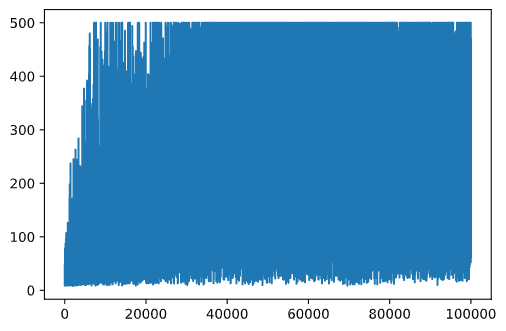

<!--
CO_OP_TRANSLATOR_METADATA:
{
  "original_hash": "9660fbd80845c59c15715cb418cd6e23",
  "translation_date": "2025-08-29T18:16:22+00:00",
  "source_file": "8-Reinforcement/2-Gym/README.md",
  "language_code": "pa"
}
-->
## ਪੂਰਵ ਸ਼ਰਤਾਂ

ਇਸ ਪਾਠ ਵਿੱਚ, ਅਸੀਂ **OpenAI Gym** ਨਾਮਕ ਲਾਇਬ੍ਰੇਰੀ ਦੀ ਵਰਤੋਂ ਕਰਾਂਗੇ ਜੋ ਵੱਖ-ਵੱਖ **ਮਾਹੌਲਾਂ** ਦੀ ਨਕਲ ਕਰਦੀ ਹੈ। ਤੁਸੀਂ ਇਸ ਪਾਠ ਦਾ ਕੋਡ ਆਪਣੇ ਸਥਾਨਕ ਸਿਸਟਮ (ਜਿਵੇਂ Visual Studio Code) 'ਤੇ ਚਲਾ ਸਕਦੇ ਹੋ, ਜਿਸ ਵਿੱਚ ਸਿਮੂਲੇਸ਼ਨ ਇੱਕ ਨਵੀਂ ਵਿੰਡੋ ਵਿੱਚ ਖੁੱਲੇਗਾ। ਜੇ ਤੁਸੀਂ ਕੋਡ ਆਨਲਾਈਨ ਚਲਾ ਰਹੇ ਹੋ, ਤਾਂ ਤੁਹਾਨੂੰ ਕੁਝ ਕੋਡ ਵਿੱਚ ਤਬਦੀਲੀਆਂ ਕਰਨ ਦੀ ਲੋੜ ਹੋ ਸਕਦੀ ਹੈ, ਜਿਵੇਂ ਕਿ [ਇੱਥੇ](https://towardsdatascience.com/rendering-openai-gym-envs-on-binder-and-google-colab-536f99391cc7) ਵਰਣਨ ਕੀਤਾ ਗਿਆ ਹੈ।

## OpenAI Gym

ਪਿਛਲੇ ਪਾਠ ਵਿੱਚ, ਖੇਡ ਦੇ ਨਿਯਮ ਅਤੇ ਸਥਿਤੀ ਨੂੰ `Board` ਕਲਾਸ ਦੁਆਰਾ ਪਰਿਭਾਸ਼ਿਤ ਕੀਤਾ ਗਿਆ ਸੀ, ਜਿਸ ਨੂੰ ਅਸੀਂ ਖੁਦ ਬਣਾਇਆ ਸੀ। ਇੱਥੇ ਅਸੀਂ ਇੱਕ ਵਿਸ਼ੇਸ਼ **ਸਿਮੂਲੇਸ਼ਨ ਮਾਹੌਲ** ਦੀ ਵਰਤੋਂ ਕਰਾਂਗੇ, ਜੋ ਬੈਲੰਸਿੰਗ ਪੋਲ ਦੇ ਭੌਤਿਕ ਵਿਗਿਆਨ ਦੀ ਨਕਲ ਕਰੇਗਾ। ਰੀਇਨਫੋਰਸਮੈਂਟ ਲਰਨਿੰਗ ਐਲਗੋਰਿਥਮਾਂ ਨੂੰ ਸਿਖਾਉਣ ਲਈ ਸਭ ਤੋਂ ਪ੍ਰਸਿੱਧ ਸਿਮੂਲੇਸ਼ਨ ਮਾਹੌਲਾਂ ਵਿੱਚੋਂ ਇੱਕ [Gym](https://gym.openai.com/) ਹੈ, ਜਿਸਨੂੰ [OpenAI](https://openai.com/) ਦੁਆਰਾ ਸੰਭਾਲਿਆ ਜਾਂਦਾ ਹੈ। ਇਸ Gym ਦੀ ਵਰਤੋਂ ਕਰਕੇ ਅਸੀਂ ਵੱਖ-ਵੱਖ **ਮਾਹੌਲਾਂ** ਬਣਾਉਣ ਦੇ ਯੋਗ ਹੋ ਜਾਵਾਂਗੇ, ਜਿਵੇਂ ਕਿ cartpole simulation ਤੋਂ Atari games ਤੱਕ।

> **Note**: ਤੁਸੀਂ OpenAI Gym ਦੁਆਰਾ ਉਪਲਬਧ ਹੋਰ ਮਾਹੌਲਾਂ ਨੂੰ [ਇੱਥੇ](https://gym.openai.com/envs/#classic_control) ਦੇਖ ਸਕਦੇ ਹੋ।

ਸਭ ਤੋਂ ਪਹਿਲਾਂ, Gym ਨੂੰ ਇੰਸਟਾਲ ਕਰੋ ਅਤੇ ਲੋੜੀਂਦੇ ਲਾਇਬ੍ਰੇਰੀਜ਼ ਨੂੰ ਇੰਪੋਰਟ ਕਰੋ (code block 1):

```python
import sys
!{sys.executable} -m pip install gym 

import gym
import matplotlib.pyplot as plt
import numpy as np
import random
```

## ਅਭਿਆਸ - ਇੱਕ cartpole ਮਾਹੌਲ ਸ਼ੁਰੂ ਕਰੋ

Cartpole ਬੈਲੰਸਿੰਗ ਸਮੱਸਿਆ 'ਤੇ ਕੰਮ ਕਰਨ ਲਈ, ਸਾਨੂੰ ਸੰਬੰਧਿਤ ਮਾਹੌਲ ਸ਼ੁਰੂ ਕਰਨ ਦੀ ਲੋੜ ਹੈ। ਹਰ ਮਾਹੌਲ ਨਾਲ ਜੁੜਿਆ ਹੁੰਦਾ ਹੈ:

- **Observation space** ਜੋ ਮਾਹੌਲ ਤੋਂ ਪ੍ਰਾਪਤ ਜਾਣਕਾਰੀ ਦੀ ਬਣਤਰ ਨੂੰ ਪਰਿਭਾਸ਼ਿਤ ਕਰਦਾ ਹੈ। Cartpole ਸਮੱਸਿਆ ਲਈ, ਸਾਨੂੰ ਪੋਲ ਦੀ ਸਥਿਤੀ, ਗਤੀ ਅਤੇ ਕੁਝ ਹੋਰ ਮੁੱਲ ਪ੍ਰਾਪਤ ਹੁੰਦੇ ਹਨ।

- **Action space** ਜੋ ਸੰਭਾਵਿਤ ਕਾਰਵਾਈਆਂ ਨੂੰ ਪਰਿਭਾਸ਼ਿਤ ਕਰਦਾ ਹੈ। ਸਾਡੇ ਕੇਸ ਵਿੱਚ, action space discrete ਹੈ, ਅਤੇ ਇਸ ਵਿੱਚ ਦੋ ਕਾਰਵਾਈਆਂ ਹਨ - **ਖੱਬੇ** ਅਤੇ **ਸੱਜੇ**। (code block 2)

1. ਸ਼ੁਰੂ ਕਰਨ ਲਈ, ਹੇਠਾਂ ਦਿੱਤਾ ਕੋਡ ਲਿਖੋ:

    ```python
    env = gym.make("CartPole-v1")
    print(env.action_space)
    print(env.observation_space)
    print(env.action_space.sample())
    ```

ਮਾਹੌਲ ਕਿਵੇਂ ਕੰਮ ਕਰਦਾ ਹੈ, ਇਹ ਦੇਖਣ ਲਈ, ਆਓ 100 ਕਦਮਾਂ ਲਈ ਇੱਕ ਛੋਟੀ ਸਿਮੂਲੇਸ਼ਨ ਚਲਾਈਏ। ਹਰ ਕਦਮ 'ਤੇ, ਅਸੀਂ ਇੱਕ ਕਾਰਵਾਈ ਪ੍ਰਦਾਨ ਕਰਦੇ ਹਾਂ - ਇਸ ਸਿਮੂਲੇਸ਼ਨ ਵਿੱਚ ਅਸੀਂ ਸਿਰਫ਼ `action_space` ਤੋਂ ਇੱਕ ਕਾਰਵਾਈ ਨੂੰ ਰੈਂਡਮ ਤਰੀਕੇ ਨਾਲ ਚੁਣਦੇ ਹਾਂ।

1. ਹੇਠਾਂ ਦਿੱਤਾ ਕੋਡ ਚਲਾਓ ਅਤੇ ਦੇਖੋ ਕਿ ਇਹ ਕੀ ਨਤੀਜਾ ਦਿੰਦਾ ਹੈ।

    ✅ ਯਾਦ ਰੱਖੋ ਕਿ ਇਹ ਕੋਡ ਸਥਾਨਕ Python ਇੰਸਟਾਲੇਸ਼ਨ 'ਤੇ ਚਲਾਉਣਾ ਵਧੀਆ ਹੈ! (code block 3)

    ```python
    env.reset()
    
    for i in range(100):
       env.render()
       env.step(env.action_space.sample())
    env.close()
    ```

    ਤੁਹਾਨੂੰ ਕੁਝ ਇਸ ਤਰ੍ਹਾਂ ਦੀ ਤਸਵੀਰ ਦੇਖਣੀ ਚਾਹੀਦੀ ਹੈ:

    

1. ਸਿਮੂਲੇਸ਼ਨ ਦੌਰਾਨ, ਸਾਨੂੰ ਨਿਰਣਯ ਲੈਣ ਲਈ observations ਪ੍ਰਾਪਤ ਕਰਨ ਦੀ ਲੋੜ ਹੁੰਦੀ ਹੈ। ਅਸਲ ਵਿੱਚ, step function ਮੌਜੂਦਾ observations, ਇੱਕ reward function, ਅਤੇ done flag ਵਾਪਸ ਕਰਦਾ ਹੈ ਜੋ ਇਹ ਦਰਸਾਉਂਦਾ ਹੈ ਕਿ ਸਿਮੂਲੇਸ਼ਨ ਜਾਰੀ ਰੱਖਣ ਦਾ ਕੋਈ ਮਤਲਬ ਹੈ ਜਾਂ ਨਹੀਂ: (code block 4)

    ```python
    env.reset()
    
    done = False
    while not done:
       env.render()
       obs, rew, done, info = env.step(env.action_space.sample())
       print(f"{obs} -> {rew}")
    env.close()
    ```

    ਤੁਹਾਨੂੰ ਨੋਟਬੁੱਕ ਆਉਟਪੁੱਟ ਵਿੱਚ ਕੁਝ ਇਸ ਤਰ੍ਹਾਂ ਦੇਖਣ ਨੂੰ ਮਿਲੇਗਾ:

    ```text
    [ 0.03403272 -0.24301182  0.02669811  0.2895829 ] -> 1.0
    [ 0.02917248 -0.04828055  0.03248977  0.00543839] -> 1.0
    [ 0.02820687  0.14636075  0.03259854 -0.27681916] -> 1.0
    [ 0.03113408  0.34100283  0.02706215 -0.55904489] -> 1.0
    [ 0.03795414  0.53573468  0.01588125 -0.84308041] -> 1.0
    ...
    [ 0.17299878  0.15868546 -0.20754175 -0.55975453] -> 1.0
    [ 0.17617249  0.35602306 -0.21873684 -0.90998894] -> 1.0
    ```

    ਸਿਮੂਲੇਸ਼ਨ ਦੇ ਹਰ ਕਦਮ 'ਤੇ ਵਾਪਸ ਕੀਤੇ ਗਏ observation vector ਵਿੱਚ ਹੇਠਾਂ ਦਿੱਤੇ ਮੁੱਲ ਸ਼ਾਮਲ ਹੁੰਦੇ ਹਨ:
    - Cart ਦੀ ਸਥਿਤੀ
    - Cart ਦੀ ਗਤੀ
    - Pole ਦਾ ਕੋਣ
    - Pole ਦੀ ਘੁੰਮਣ ਦੀ ਦਰ

1. ਉਹਨਾਂ ਨੰਬਰਾਂ ਦੇ ਘੱਟੋ-ਘੱਟ ਅਤੇ ਵੱਧ ਤੋਂ ਵੱਧ ਮੁੱਲ ਪ੍ਰਾਪਤ ਕਰੋ: (code block 5)

    ```python
    print(env.observation_space.low)
    print(env.observation_space.high)
    ```

    ਤੁਸੀਂ ਇਹ ਵੀ ਨੋਟ ਕਰ ਸਕਦੇ ਹੋ ਕਿ ਹਰ ਸਿਮੂਲੇਸ਼ਨ ਕਦਮ 'ਤੇ reward value ਹਮੇਸ਼ਾ 1 ਹੁੰਦੀ ਹੈ। ਇਹ ਇਸ ਲਈ ਹੈ ਕਿਉਂਕਿ ਸਾਡਾ ਲਕਸ਼ ਹੈ ਜਿੰਨਾ ਹੋ ਸਕੇ ਲੰਬੇ ਸਮੇਂ ਲਈ ਪੋਲ ਨੂੰ ਇੱਕ ਸਮਝਦਾਰ vertical ਸਥਿਤੀ ਵਿੱਚ ਰੱਖਣਾ।

    ✅ ਅਸਲ ਵਿੱਚ, CartPole ਸਿਮੂਲੇਸ਼ਨ ਨੂੰ solved ਮੰਨਿਆ ਜਾਂਦਾ ਹੈ ਜੇਕਰ ਅਸੀਂ 100 ਲਗਾਤਾਰ ਟ੍ਰਾਇਲਾਂ 'ਤੇ 195 ਦਾ ਔਸਤ reward ਪ੍ਰਾਪਤ ਕਰ ਸਕਦੇ ਹਾਂ।

## ਸਥਿਤੀ ਨੂੰ discrete ਬਣਾਉਣਾ

Q-Learning ਵਿੱਚ, ਸਾਨੂੰ Q-Table ਬਣਾਉਣ ਦੀ ਲੋੜ ਹੁੰਦੀ ਹੈ ਜੋ ਹਰ ਸਥਿਤੀ 'ਤੇ ਕੀ ਕਰਨਾ ਹੈ ਇਹ ਪਰਿਭਾਸ਼ਿਤ ਕਰਦਾ ਹੈ। ਇਹ ਕਰਨ ਲਈ, ਸਥਿਤੀ **discreet** ਹੋਣੀ ਚਾਹੀਦੀ ਹੈ, ਜ਼ਿਆਦਾ ਸਹੀ ਤੌਰ 'ਤੇ, ਇਸ ਵਿੱਚ finite number of discrete values ਹੋਣੀਆਂ ਚਾਹੀਦੀਆਂ ਹਨ। ਇਸ ਲਈ, ਸਾਨੂੰ ਕਿਸੇ ਤਰੀਕੇ ਨਾਲ ਆਪਣੇ observations ਨੂੰ **discretize** ਕਰਨਾ ਪਵੇਗਾ, ਅਤੇ ਉਨ੍ਹਾਂ ਨੂੰ finite set of states ਵਿੱਚ ਮੈਪ ਕਰਨਾ ਪਵੇਗਾ।

ਇਸ ਨੂੰ ਕਰਨ ਦੇ ਕੁਝ ਤਰੀਕੇ ਹਨ:

- **Bins ਵਿੱਚ ਵੰਡੋ**। ਜੇਕਰ ਸਾਨੂੰ ਕਿਸੇ ਮੁੱਲ ਦੇ interval ਦਾ ਪਤਾ ਹੈ, ਤਾਂ ਅਸੀਂ ਇਸ interval ਨੂੰ ਕੁਝ **bins** ਵਿੱਚ ਵੰਡ ਸਕਦੇ ਹਾਂ, ਅਤੇ ਫਿਰ ਉਸ ਮੁੱਲ ਨੂੰ ਉਸ bin number ਨਾਲ ਬਦਲ ਸਕਦੇ ਹਾਂ ਜਿਸ ਵਿੱਚ ਇਹ ਸ਼ਾਮਲ ਹੈ। ਇਹ numpy ਦੇ [`digitize`](https://numpy.org/doc/stable/reference/generated/numpy.digitize.html) ਵਿਧੀ ਦੀ ਵਰਤੋਂ ਕਰਕੇ ਕੀਤਾ ਜਾ ਸਕਦਾ ਹੈ। ਇਸ ਕੇਸ ਵਿੱਚ, ਸਾਨੂੰ state size ਦਾ ਸਹੀ ਪਤਾ ਹੋਵੇਗਾ, ਕਿਉਂਕਿ ਇਹ bins ਦੀ ਗਿਣਤੀ 'ਤੇ ਨਿਰਭਰ ਕਰੇਗਾ ਜੋ ਅਸੀਂ digitalization ਲਈ ਚੁਣਦੇ ਹਾਂ।

✅ ਅਸੀਂ linear interpolation ਦੀ ਵਰਤੋਂ ਕਰਕੇ ਮੁੱਲਾਂ ਨੂੰ finite interval (ਜਿਵੇਂ -20 ਤੋਂ 20) ਵਿੱਚ ਲਿਆ ਸਕਦੇ ਹਾਂ, ਅਤੇ ਫਿਰ rounding ਕਰਕੇ ਨੰਬਰਾਂ ਨੂੰ integers ਵਿੱਚ ਬਦਲ ਸਕਦੇ ਹਾਂ। ਇਸ ਤਰੀਕੇ ਨਾਲ ਸਾਨੂੰ state size 'ਤੇ ਘੱਟ ਕੰਟਰੋਲ ਮਿਲਦਾ ਹੈ, ਖਾਸ ਕਰਕੇ ਜੇਕਰ ਸਾਨੂੰ input values ਦੇ exact ranges ਦਾ ਪਤਾ ਨਹੀਂ ਹੈ। ਉਦਾਹਰਨ ਲਈ, ਸਾਡੇ ਕੇਸ ਵਿੱਚ 4 ਵਿੱਚੋਂ 2 ਮੁੱਲਾਂ ਦੇ ਉੱਪਰ/ਹੇਠਾਂ ਦੀਆਂ ਹੱਦਾਂ ਨਹੀਂ ਹਨ, ਜਿਸ ਨਾਲ states ਦੀ infinite ਗਿਣਤੀ ਹੋ ਸਕਦੀ ਹੈ।

ਸਾਡੇ ਉਦਾਹਰਨ ਵਿੱਚ, ਅਸੀਂ ਦੂਜੇ ਤਰੀਕੇ ਨਾਲ ਜਾਵਾਂਗੇ। ਜਿਵੇਂ ਤੁਸੀਂ ਬਾਅਦ ਵਿੱਚ ਨੋਟਿਸ ਕਰ ਸਕਦੇ ਹੋ, undefined upper/lower bounds ਦੇ ਬਾਵਜੂਦ, ਉਹ ਮੁੱਲ ਕਦੇ-ਕਦੇ finite intervals ਤੋਂ ਬਾਹਰ ਜਾਂਦੇ ਹਨ, ਇਸ ਲਈ ਉਹ states ਜਿਨ੍ਹਾਂ ਦੇ extreme values ਹਨ, ਬਹੁਤ ਹੀ rare ਹੋਣਗੇ।

1. ਇਹ function ਹੈ ਜੋ ਸਾਡੇ ਮਾਡਲ ਤੋਂ observation ਲਵੇਗਾ ਅਤੇ 4 integer values ਦੇ tuple ਨੂੰ produce ਕਰੇਗਾ: (code block 6)

    ```python
    def discretize(x):
        return tuple((x/np.array([0.25, 0.25, 0.01, 0.1])).astype(np.int))
    ```

1. ਆਓ bins ਦੀ ਵਰਤੋਂ ਕਰਕੇ ਹੋਰ ਇੱਕ discretization ਤਰੀਕੇ ਦੀ ਵੀ ਜਾਂਚ ਕਰੀਏ: (code block 7)

    ```python
    def create_bins(i,num):
        return np.arange(num+1)*(i[1]-i[0])/num+i[0]
    
    print("Sample bins for interval (-5,5) with 10 bins\n",create_bins((-5,5),10))
    
    ints = [(-5,5),(-2,2),(-0.5,0.5),(-2,2)] # intervals of values for each parameter
    nbins = [20,20,10,10] # number of bins for each parameter
    bins = [create_bins(ints[i],nbins[i]) for i in range(4)]
    
    def discretize_bins(x):
        return tuple(np.digitize(x[i],bins[i]) for i in range(4))
    ```

1. ਹੁਣ ਇੱਕ ਛੋਟੀ ਸਿਮੂਲੇਸ਼ਨ ਚਲਾਓ ਅਤੇ ਉਹਨਾਂ discrete environment values ਨੂੰ observe ਕਰੋ। `discretize` ਅਤੇ `discretize_bins` ਦੋਵਾਂ ਨੂੰ try ਕਰਨ ਲਈ ਖੁੱਲ੍ਹਾ ਮਹਿਸੂਸ ਕਰੋ ਅਤੇ ਦੇਖੋ ਕਿ ਕੀ ਕੋਈ ਫਰਕ ਹੈ।

    ✅ `discretize_bins` bin number ਵਾਪਸ ਕਰਦਾ ਹੈ, ਜੋ ਕਿ 0-based ਹੁੰਦਾ ਹੈ। ਇਸ ਲਈ input variable ਦੇ ਮੁੱਲਾਂ ਦੇ ਆਸ-ਪਾਸ 0 ਲਈ ਇਹ interval ਦੇ ਵਿਚਕਾਰ (10) ਤੋਂ ਨੰਬਰ ਵਾਪਸ ਕਰਦਾ ਹੈ। `discretize` ਵਿੱਚ, ਅਸੀਂ output values ਦੀ range ਦੀ ਚਿੰਤਾ ਨਹੀਂ ਕੀਤੀ, ਜਿਸ ਨਾਲ ਉਹ state values shift ਨਹੀਂ ਹੁੰਦੀਆਂ, ਅਤੇ 0 0 ਨੂੰ ਦਰਸਾਉਂਦਾ ਹੈ। (code block 8)

    ```python
    env.reset()
    
    done = False
    while not done:
       #env.render()
       obs, rew, done, info = env.step(env.action_space.sample())
       #print(discretize_bins(obs))
       print(discretize(obs))
    env.close()
    ```

    ✅ env.render ਨਾਲ ਸ਼ੁਰੂ ਹੋਣ ਵਾਲੀ line ਨੂੰ uncomment ਕਰੋ ਜੇਕਰ ਤੁਸੀਂ ਦੇਖਣਾ ਚਾਹੁੰਦੇ ਹੋ ਕਿ ਮਾਹੌਲ ਕਿਵੇਂ execute ਹੁੰਦਾ ਹੈ। ਨਹੀਂ ਤਾਂ ਤੁਸੀਂ ਇਸਨੂੰ background ਵਿੱਚ execute ਕਰ ਸਕਦੇ ਹੋ, ਜੋ ਕਿ ਤੇਜ਼ ਹੈ। ਅਸੀਂ ਆਪਣੇ Q-Learning ਪ੍ਰਕਿਰਿਆ ਦੌਰਾਨ ਇਸ "ਅਦ੍ਰਿਸ਼" execution ਦੀ ਵਰਤੋਂ ਕਰਾਂਗੇ।

## Q-Table ਦੀ ਬਣਤਰ

ਪਿਛਲੇ ਪਾਠ ਵਿੱਚ, state ਇੱਕ ਸਧਾਰਨ ਜੋੜੇ ਨੰਬਰਾਂ ਤੋਂ 0 ਤੋਂ 8 ਤੱਕ ਸੀ, ਅਤੇ ਇਸ ਲਈ Q-Table ਨੂੰ numpy tensor ਦੁਆਰਾ shape 8x8x2 ਨਾਲ ਦਰਸਾਉਣਾ ਸੁਵਿਧਾਜਨਕ ਸੀ। ਜੇਕਰ ਅਸੀਂ bins discretization ਦੀ ਵਰਤੋਂ ਕਰਦੇ ਹਾਂ, state vector ਦਾ size ਵੀ ਜਾਣਿਆ ਜਾਂਦਾ ਹੈ, ਇਸ ਲਈ ਅਸੀਂ ਉਹੀ ਤਰੀਕਾ ਵਰਤ ਸਕਦੇ ਹਾਂ ਅਤੇ state ਨੂੰ shape 20x20x10x10x2 ਦੇ array ਦੁਆਰਾ ਦਰਸਾ ਸਕਦੇ ਹਾਂ (ਇੱਥੇ 2 action space ਦਾ dimension ਹੈ, ਅਤੇ ਪਹਿਲੀਆਂ dimensions observation space ਵਿੱਚ ਹਰ parameter ਲਈ bins ਦੀ ਗਿਣਤੀ ਨੂੰ ਦਰਸਾਉਂਦੀਆਂ ਹਨ)।

ਹਾਲਾਂਕਿ, ਕਈ ਵਾਰ observation space ਦੇ precise dimensions ਜਾਣੇ ਨਹੀਂ ਜਾਂਦੇ। `discretize` function ਦੇ ਕੇਸ ਵਿੱਚ, ਅਸੀਂ ਕਦੇ ਵੀ ਇਹ ਯਕੀਨ ਨਹੀਂ ਕਰ ਸਕਦੇ ਕਿ state ਕੁਝ ਹੱਦਾਂ ਵਿੱਚ ਰਹੇਗੀ, ਕਿਉਂਕਿ ਕੁਝ original values bound ਨਹੀਂ ਹਨ। ਇਸ ਲਈ, ਅਸੀਂ ਥੋੜ੍ਹਾ ਵੱਖਰਾ ਤਰੀਕਾ ਵਰਤਾਂਗੇ ਅਤੇ Q-Table ਨੂੰ dictionary ਦੁਆਰਾ ਦਰਸਾਉਂਦੇ ਹਾਂ।

1. *(state,action)* ਜੋੜੇ ਨੂੰ dictionary key ਵਜੋਂ ਵਰਤੋ, ਅਤੇ value Q-Table entry value ਨੂੰ ਦਰਸਾਉਂਦੀ ਹੋਵੇਗੀ। (code block 9)

    ```python
    Q = {}
    actions = (0,1)
    
    def qvalues(state):
        return [Q.get((state,a),0) for a in actions]
    ```

    ਇੱਥੇ ਅਸੀਂ ਇੱਕ function `qvalues()` ਵੀ define ਕਰਦੇ ਹਾਂ, ਜੋ ਦਿੱਤੇ state ਲਈ Q-Table values ਦੀ list ਵਾਪਸ ਕਰਦਾ ਹੈ ਜੋ ਸਾਰੀਆਂ ਸੰਭਾਵਿਤ actions ਨੂੰ ਦਰਸਾਉਂਦੀ ਹੈ। ਜੇਕਰ Q-Table ਵਿੱਚ entry ਮੌਜੂਦ ਨਹੀਂ ਹੈ, ਤਾਂ ਅਸੀਂ default ਵਜੋਂ 0 ਵਾਪਸ ਕਰਾਂਗੇ।

## ਆਓ Q-Learning ਸ਼ੁਰੂ ਕਰੀਏ

ਹੁਣ ਅਸੀਂ ਪੀਟਰ ਨੂੰ ਬੈਲੰਸ ਸਿਖਾਉਣ ਲਈ ਤਿਆਰ ਹਾਂ!

1. ਸਭ ਤੋਂ ਪਹਿਲਾਂ, ਕੁਝ hyperparameters ਸੈਟ ਕਰੀਏ: (code block 10)

    ```python
    # hyperparameters
    alpha = 0.3
    gamma = 0.9
    epsilon = 0.90
    ```

    ਇੱਥੇ, `alpha` **learning rate** ਹੈ ਜੋ ਇਹ ਦਰਸਾਉਂਦਾ ਹੈ ਕਿ Q-Table ਦੇ ਮੌਜੂਦਾ ਮੁੱਲਾਂ ਨੂੰ ਹਰ ਕਦਮ 'ਤੇ ਕਿੰਨਾ adjust ਕਰਨਾ ਚਾਹੀਦਾ ਹੈ। ਪਿਛਲੇ ਪਾਠ ਵਿੱਚ ਅਸੀਂ 1 ਨਾਲ ਸ਼ੁਰੂ ਕੀਤਾ ਸੀ, ਅਤੇ ਫਿਰ ਸਿਖਲਾਈ ਦੌਰਾਨ `alpha` ਨੂੰ ਘਟਾ ਕੇ ਘੱਟ ਮੁੱਲਾਂ 'ਤੇ ਲਿਆ। ਇਸ ਉਦਾਹਰਨ ਵਿੱਚ ਅਸੀਂ ਇਸਨੂੰ ਸਿਰਫ ਸਧਾਰਨਤਾ ਲਈ constant ਰੱਖਾਂਗੇ, ਅਤੇ ਤੁਸੀਂ ਬਾਅਦ ਵਿੱਚ `alpha` ਮੁੱਲਾਂ ਨੂੰ adjust ਕਰਨ ਦੇ ਨਾਲ experiment ਕਰ ਸਕਦੇ ਹੋ।

    `gamma` **discount factor** ਹੈ ਜੋ ਇਹ ਦਰਸਾਉਂਦਾ ਹੈ ਕਿ ਅਸੀਂ ਭਵਿੱਖ ਦੇ reward ਨੂੰ ਮੌਜੂਦਾ reward ਦੇ ਉੱਤੇ ਕਿੰਨਾ ਤਰਜੀਹ ਦੇਣੀ ਚਾਹੀਦੀ ਹੈ।

    `epsilon` **exploration/exploitation factor** ਹੈ ਜੋ ਇਹ ਨਿਰਧਾਰਤ ਕਰਦਾ ਹੈ ਕਿ ਅਸੀਂ exploration ਨੂੰ exploitation ਦੇ ਉੱਤੇ ਤਰਜੀਹ ਦੇਣੀ ਚਾਹੀਦੀ ਹੈ ਜਾਂ vice versa। ਸਾਡੇ algorithm ਵਿੱਚ, ਅਸੀਂ `epsilon` percent ਕੇਸਾਂ ਵਿੱਚ Q-Table values ਦੇ ਅਨੁਸਾਰ ਅਗਲੀ action ਚੁਣਾਂਗੇ, ਅਤੇ ਬਾਕੀ ਕੇਸਾਂ ਵਿੱਚ ਅਸੀਂ random action execute ਕਰਾਂਗੇ। ਇਹ ਸਾਨੂੰ search space ਦੇ ਉਹਨਾਂ ਖੇਤਰਾਂ ਦੀ ਜਾਂਚ ਕਰਨ ਦੀ ਆਗਿਆ ਦੇਵੇਗਾ ਜੋ ਅਸੀਂ ਪਹਿਲਾਂ ਕਦੇ ਨਹੀਂ ਦੇਖੇ।

    ✅ ਬੈਲੰਸਿੰਗ ਦੇ ਹਿਸਾਬ ਨਾਲ - random action (exploration) ਚੁਣਨਾ ਇੱਕ random punch ਵਜੋਂ ਕੰਮ ਕਰੇਗਾ ਜੋ ਗਲਤ ਦਿਸ਼ਾ ਵਿੱਚ ਹੋਵੇਗਾ, ਅਤੇ pole ਨੂੰ ਉਹਨਾਂ "ਗਲਤੀਆਂ" ਤੋਂ ਬੈਲੰਸ ਨੂੰ ਮੁੜ ਪ੍ਰਾਪਤ ਕਰਨ ਦਾ ਸਿਖਣਾ ਪਵੇਗਾ।

### Algorithm ਨੂੰ ਸੁਧਾਰੋ

ਅਸੀਂ ਪਿਛਲੇ ਪਾਠ ਦੇ algorithm ਵਿੱਚ ਦੋ ਸੁਧਾਰ ਕਰ ਸਕਦੇ ਹਾਂ:

- **Average cumulative reward ਦੀ ਗਣਨਾ ਕਰੋ**, ਕਈ simulations ਦੇ ਔਸਤ ਦੇ ਅਧਾਰ 'ਤੇ। ਅਸੀਂ ਹਰ 5000 iterations 'ਤੇ progress print ਕਰਾਂਗੇ, ਅਤੇ ਅਸੀਂ cumulative reward ਨੂੰ ਉਸ ਸਮੇਂ ਦੇ ਅਧਾਰ 'ਤੇ average ਕਰਾਂਗੇ। ਇਸਦਾ ਮਤਲਬ ਹੈ ਕਿ ਜੇਕਰ ਅਸੀਂ 195 point ਤੋਂ ਵੱਧ ਪ੍ਰਾਪਤ ਕਰਦੇ ਹਾਂ - ਅਸੀਂ ਸਮੱਸਿਆ ਨੂੰ solved ਮੰਨ ਸਕਦੇ ਹਾਂ, ਜੇਕਰ quality required ਤੋਂ ਵੀ ਉੱਚੀ ਹੋਵੇ।

- **Maximum average cumulative result ਦੀ ਗਣਨਾ ਕਰੋ**, `Qmax`, ਅਤੇ ਅਸੀਂ ਉਸ Q-Table ਨੂੰ ਸਟੋਰ ਕਰਾਂਗੇ ਜੋ ਉਸ result ਨੂੰ ਦਰਸਾਉਂਦਾ ਹੈ। ਜਦੋਂ ਤੁਸੀਂ ਸਿਖਲਾਈ ਚਲਾਉਂਦੇ ਹੋ, ਤਾਂ ਤੁਸੀਂ ਨੋਟਿਸ ਕਰੋਗੇ ਕਿ ਕਈ ਵਾਰ average cumulative result ਘਟਣਾ ਸ਼ੁਰੂ ਕਰ ਦਿੰਦਾ ਹੈ, ਅਤੇ ਅਸੀਂ Q-Table ਦੇ ਉਹ values ਨੂੰ ਰੱਖਣਾ ਚਾਹੁੰਦੇ ਹਾਂ ਜੋ ਸਿਖਲਾਈ ਦੌਰਾਨ observed ਕੀਤੇ ਗਏ best model ਨੂੰ ਦਰਸਾਉਂਦੇ ਹਨ।

1. ਹਰ simulation 'ਤੇ ਸਾਰੇ cumulative rewards ਨੂੰ `rewards` vector ਵਿੱਚ ਇਕੱਠਾ ਕਰੋ ਜੋ plotting ਲਈ ਵਰਤਿਆ ਜਾਵੇਗਾ। (code block 11)

    ```python
    def probs(v,eps=1e-4):
        v = v-v.min()+eps
        v = v/v.sum()
        return v
    
    Qmax = 0
    cum_rewards = []
    rewards = []
    for epoch in range(100000):
        obs = env.reset()
        done = False
        cum_reward=0
        # == do the simulation ==
        while not done:
            s = discretize(obs)
            if random.random()<epsilon:
                # exploitation - chose the action according to Q-Table probabilities
                v = probs(np.array(qvalues(s)))
                a = random.choices(actions,weights=v)[0]
            else:
                # exploration - randomly chose the action
                a = np.random.randint(env.action_space.n)
    
            obs, rew, done, info = env.step(a)
            cum_reward+=rew
            ns = discretize(obs)
            Q[(s,a)] = (1 - alpha) * Q.get((s,a),0) + alpha * (rew + gamma * max(qvalues(ns)))
        cum_rewards.append(cum_reward)
        rewards.append(cum_reward)
        # == Periodically print results and calculate average reward ==
        if epoch%5000==0:
            print(f"{epoch}: {np.average(cum_rewards)}, alpha={alpha}, epsilon={epsilon}")
            if np.average(cum_rewards) > Qmax:
                Qmax = np.average(cum_rewards)
                Qbest = Q
            cum_rewards=[]
    ```

ਇਹਨਾਂ ਨਤੀਜਿਆਂ ਤੋਂ ਤੁਸੀਂ ਕੀ ਨੋਟਿਸ ਕਰ ਸਕਦੇ ਹੋ:

- **ਸਾਡੇ ਲਕਸ਼ ਦੇ ਨੇੜੇ**। ਅਸੀਂ 100+ ਲਗਾਤਾਰ simulations ਦੇ ਔਸਤ rewards ਦੇ 195 cumulative rewards ਪ੍ਰਾਪਤ ਕਰਨ ਦੇ ਲਕਸ਼ ਦੇ ਬਹੁਤ ਨੇੜੇ ਹਾਂ, ਜਾਂ ਅਸੀਂ ਇਸਨੂੰ ਹਾਸਲ ਕਰ ਲਿਆ ਹੈ! ਜੇਕਰ ਅਸੀਂ ਛੋਟੇ ਨੰਬਰ ਪ੍ਰਾਪਤ ਕਰਦੇ ਹਾਂ, ਤਾਂ ਅਸੀਂ ਅਜੇ ਵੀ ਨਹੀਂ ਜਾਣਦੇ, ਕਿਉਂਕਿ ਅਸੀਂ 5000 runs ਦੇ ਔਸਤ 'ਤੇ ਗਿਣਤੀ ਕਰਦੇ ਹਾਂ, ਅਤੇ ਸਿਰਫ 100 runs formal criteria ਵਿੱਚ ਲੋੜੀਂਦੇ ਹਨ।

- **Reward ਘਟਣਾ ਸ਼ੁਰੂ ਕਰਦਾ ਹੈ**। ਕਈ ਵਾਰ reward ਘਟਣਾ ਸ਼ੁਰੂ ਕਰ ਦਿੰਦਾ ਹੈ, ਜਿਸਦਾ ਮਤਲਬ ਹੈ ਕਿ ਅਸੀਂ Q-Table ਵਿੱਚ ਪਹਿਲਾਂ ਸਿੱਖੇ ਮੁੱਲਾਂ ਨੂੰ "ਨਸ਼ਟ" ਕਰ ਸਕਦੇ ਹਾਂ ਜੋ ਸਥਿਤੀ ਨੂੰ ਬਦਤਰ ਬਣਾਉਂਦੇ ਹਨ।

ਇਹ observation training progress ਨੂੰ plot ਕਰਨ 'ਤੇ ਹੋਰ ਸਪਸ਼ਟ ਤਰੀਕੇ ਨਾਲ ਦਿਖਾਈ ਦਿੰਦੀ ਹੈ।

## Training Progress ਨੂੰ Plot ਕਰਨਾ

ਸਿਖਲਾਈ ਦੌਰਾਨ, ਅਸੀਂ cumulative reward value ਨੂੰ `rewards` vector ਵਿੱਚ ਹਰ iteration 'ਤੇ ਇਕੱਠਾ ਕੀਤਾ। ਇਹ graph ਵਿੱਚ iteration number ਦੇ ਖਿਲਾਫ plot ਕਰਨ 'ਤੇ ਇਸ ਤਰ੍ਹਾਂ ਦਿਖਾਈ ਦਿੰਦਾ ਹੈ:

```python
plt.plot(rewards)
```



ਇਸ graph ਤੋਂ ਕੁਝ ਵੀ ਕਹਿਣਾ ਸੰਭਵ ਨਹੀਂ ਹੈ, ਕਿਉਂਕਿ stochastic training process ਦੀ nature ਦੇ ਕਾਰਨ training sessions ਦੀ ਲੰਬਾਈ ਬਹੁਤ ਵੱਖ-ਵੱਖ ਹੁੰਦੀ ਹੈ। ਇਸ graph ਨੂੰ ਹੋਰ ਸਮਝਣਯੋਗ ਬਣਾਉਣ ਲਈ, ਅਸੀਂ 100 simulations ਦੇ ਔਸਤ 'ਤੇ **running average** ਦੀ ਗਣਨਾ ਕਰ ਸਕਦੇ ਹਾਂ। ਇਹ `np.convolve` ਦੀ ਵਰਤੋਂ ਕਰਕੇ ਸੁਵਿਧਾਜਨਕ ਤਰੀਕੇ ਨਾਲ ਕੀਤਾ ਜਾ ਸਕਦਾ ਹੈ: (code block 12)

```python
def running_average(x,window):
    return np.convolve(x,np.ones(window)/window,mode='valid')

plt.plot(running_average(rewards,100))
```


## Hyperparameters ਨੂੰ ਵੱਖ-ਵੱਖ
> **ਕਿਰਿਆ 1**: ਹਾਈਪਰਪੈਰਾਮੀਟਰ ਮੁੱਲਾਂ ਨਾਲ ਖੇਡੋ ਅਤੇ ਵੇਖੋ ਕਿ ਕੀ ਤੁਸੀਂ ਵਧੇਰੇ ਕੁੱਲ ਇਨਾਮ ਪ੍ਰਾਪਤ ਕਰ ਸਕਦੇ ਹੋ। ਕੀ ਤੁਸੀਂ 195 ਤੋਂ ਉੱਪਰ ਪ੍ਰਾਪਤ ਕਰ ਰਹੇ ਹੋ?
> **ਟਾਸਕ 2**: ਸਮੱਸਿਆ ਨੂੰ ਔਪਚਾਰਿਕ ਤੌਰ 'ਤੇ ਹੱਲ ਕਰਨ ਲਈ, ਤੁਹਾਨੂੰ 100 ਲਗਾਤਾਰ ਦੌੜਾਂ ਵਿੱਚ 195 ਔਸਤ ਇਨਾਮ ਪ੍ਰਾਪਤ ਕਰਨਾ ਹੋਵੇਗਾ। ਟ੍ਰੇਨਿੰਗ ਦੌਰਾਨ ਇਸ ਨੂੰ ਮਾਪੋ ਅਤੇ ਯਕੀਨੀ ਬਣਾਓ ਕਿ ਤੁਸੀਂ ਸਮੱਸਿਆ ਨੂੰ ਔਪਚਾਰਿਕ ਤੌਰ 'ਤੇ ਹੱਲ ਕਰ ਲਿਆ ਹੈ!

## ਨਤੀਜੇ ਨੂੰ ਕਾਰਵਾਈ ਵਿੱਚ ਦੇਖਣਾ

ਇਹ ਦਿਲਚਸਪ ਹੋਵੇਗਾ ਕਿ ਸੱਚਮੁੱਚ ਦੇਖਿਆ ਜਾਵੇ ਕਿ ਟ੍ਰੇਨ ਕੀਤੇ ਮਾਡਲ ਦਾ ਵਿਹਾਰ ਕਿਵੇਂ ਹੁੰਦਾ ਹੈ। ਆਓ ਸਿਮੂਲੇਸ਼ਨ ਚਲਾਈਏ ਅਤੇ ਟ੍ਰੇਨਿੰਗ ਦੌਰਾਨ ਵਰਤੀ ਗਈ ਇੱਕੋ ਜਿਹੀ ਐਕਸ਼ਨ ਚੋਣ ਰਣਨੀਤੀ ਦੀ ਪਾਲਣਾ ਕਰੀਏ, Q-Table ਵਿੱਚ ਸੰਭਾਵਨਾ ਵੰਡ ਅਨੁਸਾਰ ਸੈਂਪਲਿੰਗ ਕਰਦੇ ਹੋਏ: (ਕੋਡ ਬਲਾਕ 13)

```python
obs = env.reset()
done = False
while not done:
   s = discretize(obs)
   env.render()
   v = probs(np.array(qvalues(s)))
   a = random.choices(actions,weights=v)[0]
   obs,_,done,_ = env.step(a)
env.close()
```

ਤੁਹਾਨੂੰ ਕੁਝ ਇਸ ਤਰ੍ਹਾਂ ਦੇਖਣ ਨੂੰ ਮਿਲੇਗਾ:


---

## 🚀ਚੁਣੌਤੀ

> **ਟਾਸਕ 3**: ਇੱਥੇ, ਅਸੀਂ Q-Table ਦੀ ਅੰਤਮ ਕਾਪੀ ਵਰਤ ਰਹੇ ਸੀ, ਜੋ ਸ਼ਾਇਦ ਸਭ ਤੋਂ ਵਧੀਆ ਨਾ ਹੋਵੇ। ਯਾਦ ਰੱਖੋ ਕਿ ਅਸੀਂ ਸਭ ਤੋਂ ਵਧੀਆ ਪ੍ਰਦਰਸ਼ਨ ਕਰਨ ਵਾਲੀ Q-Table ਨੂੰ `Qbest` ਵੈਰੀਏਬਲ ਵਿੱਚ ਸਟੋਰ ਕੀਤਾ ਹੈ! `Qbest` ਨੂੰ `Q` ਵਿੱਚ ਕਾਪੀ ਕਰਕੇ ਅਤੇ ਇਹ ਦੇਖ ਕੇ ਕਿ ਕੀ ਤੁਸੀਂ ਕੋਈ ਅੰਤਰ ਮਹਿਸੂਸ ਕਰਦੇ ਹੋ, ਇਸੇ ਉਦਾਹਰਨ ਨੂੰ ਸਭ ਤੋਂ ਵਧੀਆ Q-Table ਨਾਲ ਅਜ਼ਮਾਓ।

> **ਟਾਸਕ 4**: ਇੱਥੇ ਅਸੀਂ ਹਰ ਕਦਮ 'ਤੇ ਸਭ ਤੋਂ ਵਧੀਆ ਐਕਸ਼ਨ ਨਹੀਂ ਚੁਣ ਰਹੇ ਸੀ, ਸਗੋਂ ਸੰਭਾਵਨਾ ਵੰਡ ਦੇ ਅਨੁਸਾਰ ਸੈਂਪਲਿੰਗ ਕਰ ਰਹੇ ਸੀ। ਕੀ ਇਹ ਜ਼ਿਆਦਾ ਮਾਨਸਿਕ ਹੋਵੇਗਾ ਕਿ ਹਮੇਸ਼ਾ ਸਭ ਤੋਂ ਵਧੀਆ ਐਕਸ਼ਨ ਚੁਣਿਆ ਜਾਵੇ, ਜਿਸਦਾ Q-Table ਮੁੱਲ ਸਭ ਤੋਂ ਉੱਚਾ ਹੋਵੇ? ਇਹ `np.argmax` ਫੰਕਸ਼ਨ ਦੀ ਵਰਤੋਂ ਕਰਕੇ ਕੀਤਾ ਜਾ ਸਕਦਾ ਹੈ, ਜੋ ਸਭ ਤੋਂ ਉੱਚੇ Q-Table ਮੁੱਲ ਦੇ ਅਨੁਸਾਰ ਐਕਸ਼ਨ ਨੰਬਰ ਦਾ ਪਤਾ ਲਗਾਉਂਦਾ ਹੈ। ਇਸ ਰਣਨੀਤੀ ਨੂੰ ਲਾਗੂ ਕਰੋ ਅਤੇ ਦੇਖੋ ਕਿ ਕੀ ਇਹ ਸੰਤੁਲਨ ਵਿੱਚ ਸੁਧਾਰ ਕਰਦਾ ਹੈ।

## [ਪੋਸਟ-ਲੈਕਚਰ ਕਵਿਜ਼](https://gray-sand-07a10f403.1.azurestaticapps.net/quiz/48/)

## ਅਸਾਈਨਮੈਂਟ
[ਮਾਊਂਟੇਨ ਕਾਰ ਨੂੰ ਟ੍ਰੇਨ ਕਰੋ](assignment.md)

## ਨਿਸਕਰਸ਼

ਅਸੀਂ ਹੁਣ ਸਿੱਖ ਲਿਆ ਹੈ ਕਿ ਕੇਵਲ ਇੱਕ ਇਨਾਮ ਫੰਕਸ਼ਨ ਪ੍ਰਦਾਨ ਕਰਕੇ, ਜੋ ਖੇਡ ਦੀ ਇੱਛਿਤ ਸਥਿਤੀ ਨੂੰ ਪਰਿਭਾਸ਼ਿਤ ਕਰਦਾ ਹੈ, ਅਤੇ ਉਨ੍ਹਾਂ ਨੂੰ ਸਮਰਥਕ ਤਰੀਕੇ ਨਾਲ ਖੋਜ ਸਥਾਨ ਦੀ ਪੜਚੋਲ ਕਰਨ ਦਾ ਮੌਕਾ ਦੇ ਕੇ, ਏਜੰਟਾਂ ਨੂੰ ਚੰਗੇ ਨਤੀਜੇ ਪ੍ਰਾਪਤ ਕਰਨ ਲਈ ਕਿਵੇਂ ਟ੍ਰੇਨ ਕੀਤਾ ਜਾ ਸਕਦਾ ਹੈ। ਅਸੀਂ ਸਫਲਤਾਪੂਰਵਕ Q-Learning ਐਲਗੋਰਿਥਮ ਨੂੰ ਵਿਸ਼ੇਸ਼ ਅਤੇ ਲਗਾਤਾਰ ਵਾਤਾਵਰਣਾਂ ਦੇ ਮਾਮਲਿਆਂ ਵਿੱਚ ਲਾਗੂ ਕੀਤਾ ਹੈ, ਪਰ ਵਿਸ਼ੇਸ਼ ਕਾਰਵਾਈਆਂ ਨਾਲ।

ਇਹ ਵੀ ਅਹਿਮ ਹੈ ਕਿ ਉਹ ਸਥਿਤੀਆਂ ਦਾ ਅਧਿਐਨ ਕੀਤਾ ਜਾਵੇ ਜਿੱਥੇ ਕਾਰਵਾਈ ਸਥਿਤੀ ਵੀ ਲਗਾਤਾਰ ਹੁੰਦੀ ਹੈ, ਅਤੇ ਜਦੋਂ ਅਵਲੋਕਨ ਸਥਾਨ ਕਾਫੀ ਜਟਿਲ ਹੁੰਦਾ ਹੈ, ਜਿਵੇਂ ਕਿ Atari ਗੇਮ ਸਕਰੀਨ ਦੀ ਚਿੱਤਰ। ਉਹਨਾਂ ਸਮੱਸਿਆਵਾਂ ਵਿੱਚ ਅਕਸਰ ਚੰਗੇ ਨਤੀਜੇ ਪ੍ਰਾਪਤ ਕਰਨ ਲਈ ਹੋਰ ਸ਼ਕਤੀਸ਼ਾਲੀ ਮਸ਼ੀਨ ਲਰਨਿੰਗ ਤਕਨੀਕਾਂ ਦੀ ਲੋੜ ਹੁੰਦੀ ਹੈ, ਜਿਵੇਂ ਕਿ ਨਿਊਰਲ ਨੈਟਵਰਕ। ਉਹ ਹੋਰ ਅਗਰਗਤੀ ਵਿਸ਼ੇ ਅਸੀਂ ਆਪਣੇ ਆਉਣ ਵਾਲੇ ਅਗਰਗਤੀ AI ਕੋਰਸ ਵਿੱਚ ਕਵਰ ਕਰਾਂਗੇ।

---

**ਅਸਵੀਕਾਰਨਾ**:  
ਇਹ ਦਸਤਾਵੇਜ਼ AI ਅਨੁਵਾਦ ਸੇਵਾ [Co-op Translator](https://github.com/Azure/co-op-translator) ਦੀ ਵਰਤੋਂ ਕਰਕੇ ਅਨੁਵਾਦ ਕੀਤਾ ਗਿਆ ਹੈ। ਹਾਲਾਂਕਿ ਅਸੀਂ ਸਹੀਅਤ ਲਈ ਯਤਨਸ਼ੀਲ ਹਾਂ, ਕਿਰਪਾ ਕਰਕੇ ਧਿਆਨ ਦਿਓ ਕਿ ਸਵੈਚਾਲਿਤ ਅਨੁਵਾਦਾਂ ਵਿੱਚ ਗਲਤੀਆਂ ਜਾਂ ਅਸੁੱਤੀਆਂ ਹੋ ਸਕਦੀਆਂ ਹਨ। ਮੂਲ ਦਸਤਾਵੇਜ਼, ਜੋ ਇਸਦੀ ਮੂਲ ਭਾਸ਼ਾ ਵਿੱਚ ਹੈ, ਨੂੰ ਅਧਿਕਾਰਤ ਸਰੋਤ ਮੰਨਿਆ ਜਾਣਾ ਚਾਹੀਦਾ ਹੈ। ਮਹੱਤਵਪੂਰਨ ਜਾਣਕਾਰੀ ਲਈ, ਪੇਸ਼ੇਵਰ ਮਨੁੱਖੀ ਅਨੁਵਾਦ ਦੀ ਸਿਫਾਰਸ਼ ਕੀਤੀ ਜਾਂਦੀ ਹੈ। ਇਸ ਅਨੁਵਾਦ ਦੀ ਵਰਤੋਂ ਤੋਂ ਪੈਦਾ ਹੋਣ ਵਾਲੇ ਕਿਸੇ ਵੀ ਗਲਤਫਹਿਮੀ ਜਾਂ ਗਲਤ ਵਿਆਖਿਆ ਲਈ ਅਸੀਂ ਜ਼ਿੰਮੇਵਾਰ ਨਹੀਂ ਹਾਂ।