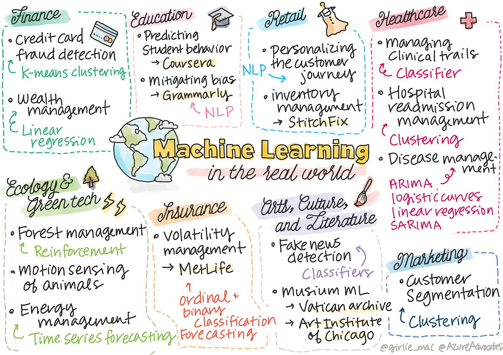

<!--
CO_OP_TRANSLATOR_METADATA:
{
  "original_hash": "20f18ff565638be615df4174858e4a7f",
  "translation_date": "2025-08-29T17:23:09+00:00",
  "source_file": "9-Real-World/1-Applications/README.md",
  "language_code": "pa"
}
-->
# ਪੋਸਟਸਕ੍ਰਿਪਟ: ਅਸਲ ਦੁਨੀਆ ਵਿੱਚ ਮਸ਼ੀਨ ਲਰਨਿੰਗ

> ਸਕੈਚਨੋਟ [ਟੋਮੋਮੀ ਇਮੁਰਾ](https://www.twitter.com/girlie_mac) ਦੁਆਰਾ

ਇਸ ਕੋਰਸ ਵਿੱਚ, ਤੁਸੀਂ ਡਾਟਾ ਨੂੰ ਟ੍ਰੇਨਿੰਗ ਲਈ ਤਿਆਰ ਕਰਨ ਅਤੇ ਮਸ਼ੀਨ ਲਰਨਿੰਗ ਮਾਡਲ ਬਣਾਉਣ ਦੇ ਕਈ ਤਰੀਕੇ ਸਿੱਖੇ ਹਨ। ਤੁਸੀਂ ਕਲਾਸਿਕ ਰਿਗ੍ਰੈਸ਼ਨ, ਕਲੱਸਟਰਿੰਗ, ਕਲਾਸੀਫਿਕੇਸ਼ਨ, ਪ੍ਰਾਕ੍ਰਿਤਿਕ ਭਾਸ਼ਾ ਪ੍ਰਕਿਰਿਆ ਅਤੇ ਸਮੇਂ ਦੀ ਲੜੀ ਦੇ ਮਾਡਲ ਬਣਾਏ। ਮੁਬਾਰਕਾਂ! ਹੁਣ, ਤੁਸੀਂ ਸੋਚ ਰਹੇ ਹੋ ਸਕਦੇ ਹੋ ਕਿ ਇਹ ਸਾਰਾ ਕਿਸ ਲਈ ਹੈ... ਇਹ ਮਾਡਲ ਅਸਲ ਦੁਨੀਆ ਵਿੱਚ ਕਿਵੇਂ ਵਰਤੇ ਜਾਂਦੇ ਹਨ?

ਜਦੋਂ ਕਿ ਉਦਯੋਗ ਵਿੱਚ ਡੀਪ ਲਰਨਿੰਗ 'ਤੇ ਆਧਾਰਿਤ AI ਨੇ ਕਾਫ਼ੀ ਧਿਆਨ ਖਿੱਚਿਆ ਹੈ, ਕਲਾਸੀਕਲ ਮਸ਼ੀਨ ਲਰਨਿੰਗ ਮਾਡਲਾਂ ਦੇ ਵੀ ਕਈ ਕੀਮਤੀ ਉਪਯੋਗ ਹਨ। ਤੁਸੀਂ ਅੱਜ ਵੀ ਇਨ੍ਹਾਂ ਵਿੱਚੋਂ ਕੁਝ ਉਪਯੋਗਤਾਵਾਂ ਵਰਤ ਰਹੇ ਹੋ ਸਕਦੇ ਹੋ! ਇਸ ਪਾਠ ਵਿੱਚ, ਤੁਸੀਂ ਦੇਖੋਗੇ ਕਿ ਕਿਵੇਂ ਅੱਠ ਵੱਖ-ਵੱਖ ਉਦਯੋਗ ਅਤੇ ਵਿਸ਼ੇਸ਼ ਖੇਤਰ ਇਨ੍ਹਾਂ ਮਾਡਲਾਂ ਨੂੰ ਆਪਣੇ ਐਪਲੀਕੇਸ਼ਨਾਂ ਨੂੰ ਹੋਰ ਪ੍ਰਭਾਵਸ਼ਾਲੀ, ਭਰੋਸੇਯੋਗ, ਸਮਰੱਥ ਅਤੇ ਉਪਭੋਗਤਾਵਾਂ ਲਈ ਕੀਮਤੀ ਬਣਾਉਣ ਲਈ ਵਰਤਦੇ ਹਨ।

## [ਪ੍ਰੀ-ਲੈਕਚਰ ਕਵਿਜ਼](https://gray-sand-07a10f403.1.azurestaticapps.net/quiz/49/)

## 💰 ਵਿੱਤ

ਵਿੱਤ ਖੇਤਰ ਵਿੱਚ ਮਸ਼ੀਨ ਲਰਨਿੰਗ ਲਈ ਕਈ ਮੌਕੇ ਹਨ। ਇਸ ਖੇਤਰ ਦੀਆਂ ਕਈ ਸਮੱਸਿਆਵਾਂ ਨੂੰ ਮਾਡਲ ਬਣਾਉਣ ਅਤੇ ML ਦੀ ਵਰਤੋਂ ਨਾਲ ਹੱਲ ਕੀਤਾ ਜਾ ਸਕਦਾ ਹੈ।

### ਕ੍ਰੈਡਿਟ ਕਾਰਡ ਧੋਖਾਧੜੀ ਦੀ ਪਛਾਣ

ਅਸੀਂ ਕੋਰਸ ਵਿੱਚ ਪਹਿਲਾਂ [k-means ਕਲੱਸਟਰਿੰਗ](../../5-Clustering/2-K-Means/README.md) ਬਾਰੇ ਸਿੱਖਿਆ ਸੀ, ਪਰ ਇਹ ਕਿਵੇਂ ਕ੍ਰੈਡਿਟ ਕਾਰਡ ਧੋਖਾਧੜੀ ਨਾਲ ਸੰਬੰਧਿਤ ਸਮੱਸਿਆਵਾਂ ਨੂੰ ਹੱਲ ਕਰਨ ਲਈ ਵਰਤੀ ਜਾ ਸਕਦੀ ਹੈ?

k-means ਕਲੱਸਟਰਿੰਗ ਕ੍ਰੈਡਿਟ ਕਾਰਡ ਧੋਖਾਧੜੀ ਦੀ ਪਛਾਣ ਦੀ ਤਕਨੀਕ ਵਿੱਚ ਮਦਦਗਾਰ ਸਾਬਤ ਹੁੰਦੀ ਹੈ ਜਿਸਨੂੰ **ਆਊਟਲਾਇਰ ਡਿਟੈਕਸ਼ਨ** ਕਿਹਾ ਜਾਂਦਾ ਹੈ। ਆਊਟਲਾਇਰ, ਜਾਂ ਡਾਟਾ ਸੈੱਟ ਵਿੱਚ ਅਸਧਾਰਨ ਵੇਖਣਾਂ, ਸਾਨੂੰ ਦੱਸ ਸਕਦੇ ਹਨ ਕਿ ਕ੍ਰੈਡਿਟ ਕਾਰਡ ਆਮ ਤੌਰ 'ਤੇ ਵਰਤਿਆ ਜਾ ਰਿਹਾ ਹੈ ਜਾਂ ਕੁਝ ਗਲਤ ਹੋ ਰਿਹਾ ਹੈ। ਹੇਠਾਂ ਦਿੱਤੇ ਪੇਪਰ ਵਿੱਚ ਦਿਖਾਇਆ ਗਿਆ ਹੈ ਕਿ ਤੁਸੀਂ k-means ਕਲੱਸਟਰਿੰਗ ਐਲਗੋਰਿਥਮ ਦੀ ਵਰਤੋਂ ਕਰਕੇ ਕ੍ਰੈਡਿਟ ਕਾਰਡ ਡਾਟਾ ਨੂੰ ਕਲੱਸਟਰਾਂ ਵਿੱਚ ਵੰਡ ਸਕਦੇ ਹੋ ਅਤੇ ਹਰ ਲੈਣ-ਦੇਣ ਨੂੰ ਇਸ ਗੱਲ ਦੇ ਆਧਾਰ 'ਤੇ ਇੱਕ ਕਲੱਸਟਰ ਵਿੱਚ ਰੱਖ ਸਕਦੇ ਹੋ ਕਿ ਇਹ ਕਿੰਨਾ ਆਊਟਲਾਇਰ ਹੈ। ਫਿਰ, ਤੁਸੀਂ ਧੋਖਾਧੜੀ ਵਾਲੇ ਅਤੇ ਵੈਧ ਲੈਣ-ਦੇਣਾਂ ਲਈ ਸਭ ਤੋਂ ਖਤਰਨਾਕ ਕਲੱਸਟਰਾਂ ਦਾ ਮੁਲਾਂਕਣ ਕਰ ਸਕਦੇ ਹੋ।
[ਹਵਾਲਾ](https://citeseerx.ist.psu.edu/viewdoc/download?doi=10.1.1.680.1195&rep=rep1&type=pdf)

### ਵਿੱਤੀ ਪ੍ਰਬੰਧਨ

ਵਿੱਤੀ ਪ੍ਰਬੰਧਨ ਵਿੱਚ, ਕੋਈ ਵਿਅਕਤੀ ਜਾਂ ਕੰਪਨੀ ਆਪਣੇ ਗਾਹਕਾਂ ਦੀਆਂ ਨਿਵੇਸ਼ਾਂ ਨੂੰ ਸੰਭਾਲਦੀ ਹੈ। ਉਨ੍ਹਾਂ ਦਾ ਕੰਮ ਲੰਬੇ ਸਮੇਂ ਤੱਕ ਧਨ ਨੂੰ ਕਾਇਮ ਰੱਖਣਾ ਅਤੇ ਵਧਾਉਣਾ ਹੁੰਦਾ ਹੈ, ਇਸ ਲਈ ਇਹ ਜ਼ਰੂਰੀ ਹੈ ਕਿ ਉਹ ਨਿਵੇਸ਼ ਚੁਣਨ ਜੋ ਚੰਗਾ ਪ੍ਰਦਰਸ਼ਨ ਕਰਦੇ ਹੋਣ।

ਕਿਸੇ ਖਾਸ ਨਿਵੇਸ਼ ਦੇ ਪ੍ਰਦਰਸ਼ਨ ਦਾ ਮੁਲਾਂਕਣ ਕਰਨ ਦਾ ਇੱਕ ਤਰੀਕਾ ਸਾਂਖਿਆਕੀ ਰਿਗ੍ਰੈਸ਼ਨ ਹੈ। [ਲਿਨੀਅਰ ਰਿਗ੍ਰੈਸ਼ਨ](../../2-Regression/1-Tools/README.md) ਇਹ ਸਮਝਣ ਲਈ ਇੱਕ ਕੀਮਤੀ ਸਾਧਨ ਹੈ ਕਿ ਕੋਈ ਫੰਡ ਕਿਸੇ ਬੈਂਚਮਾਰਕ ਦੇ ਮੁਕਾਬਲੇ ਕਿਵੇਂ ਪ੍ਰਦਰਸ਼ਨ ਕਰਦਾ ਹੈ। ਅਸੀਂ ਇਹ ਵੀ ਨਿਕਾਲ ਸਕਦੇ ਹਾਂ ਕਿ ਰਿਗ੍ਰੈਸ਼ਨ ਦੇ ਨਤੀਜੇ ਸਾਂਖਿਆਤਿਕ ਤੌਰ 'ਤੇ ਮਹੱਤਵਪੂਰਨ ਹਨ ਜਾਂ ਨਹੀਂ, ਜਾਂ ਇਹ ਗਾਹਕਾਂ ਦੀਆਂ ਨਿਵੇਸ਼ਾਂ ਨੂੰ ਕਿੰਨਾ ਪ੍ਰਭਾਵਿਤ ਕਰਨਗੇ। ਤੁਸੀਂ ਆਪਣੇ ਵਿਸ਼ਲੇਸ਼ਣ ਨੂੰ ਮਲਟੀਪਲ ਰਿਗ੍ਰੈਸ਼ਨ ਦੀ ਵਰਤੋਂ ਕਰਕੇ ਹੋਰ ਵੀ ਵਧਾ ਸਕਦੇ ਹੋ, ਜਿੱਥੇ ਵਾਧੂ ਜੋਖਮ ਕਾਰਕਾਂ ਨੂੰ ਧਿਆਨ ਵਿੱਚ ਰੱਖਿਆ ਜਾ ਸਕਦਾ ਹੈ। ਇਸਦਾ ਇੱਕ ਉਦਾਹਰਣ ਹੇਠਾਂ ਦਿੱਤੇ ਪੇਪਰ ਵਿੱਚ ਦਿੱਤਾ ਗਿਆ ਹੈ, ਜਿੱਥੇ ਰਿਗ੍ਰੈਸ਼ਨ ਦੀ ਵਰਤੋਂ ਕਰਕੇ ਫੰਡ ਦੇ ਪ੍ਰਦਰਸ਼ਨ ਦਾ ਮੁਲਾਂਕਣ ਕੀਤਾ ਗਿਆ ਹੈ।
[ਹਵਾਲਾ](http://www.brightwoodventures.com/evaluating-fund-performance-using-regression/)

## 🎓 ਸਿੱਖਿਆ

ਸਿੱਖਿਆ ਖੇਤਰ ਵੀ ਇੱਕ ਬਹੁਤ ਹੀ ਦਿਲਚਸਪ ਖੇਤਰ ਹੈ ਜਿੱਥੇ ML ਲਾਗੂ ਕੀਤਾ ਜਾ ਸਕਦਾ ਹੈ। ਇੱਥੇ ਦਿਲਚਸਪ ਸਮੱਸਿਆਵਾਂ ਹਨ ਜਿਵੇਂ ਕਿ ਟੈਸਟ ਜਾਂ ਲੇਖਾਂ ਵਿੱਚ ਧੋਖਾਧੜੀ ਦੀ ਪਛਾਣ ਕਰਨਾ ਜਾਂ ਸਹੀ ਕਰਨ ਦੀ ਪ੍ਰਕਿਰਿਆ ਵਿੱਚ ਅਜਾਣੇ ਜਾਂ ਜਾਣ-ਬੁੱਝ ਕੇ ਪੱਖਪਾਤ ਦਾ ਪ੍ਰਬੰਧਨ ਕਰਨਾ।

### ਵਿਦਿਆਰਥੀ ਦੇ ਵਿਵਹਾਰ ਦੀ ਭਵਿੱਖਬਾਣੀ

[ਕੋਰਸੇਰਾ](https://coursera.com), ਇੱਕ ਆਨਲਾਈਨ ਖੁੱਲ੍ਹਾ ਕੋਰਸ ਪ੍ਰਦਾਤਾ, ਦੇ ਤਕਨੀਕੀ ਬਲੌਗ ਵਿੱਚ ਕਈ ਇੰਜੀਨੀਅਰਿੰਗ ਫੈਸਲਿਆਂ ਬਾਰੇ ਚਰਚਾ ਕੀਤੀ ਗਈ ਹੈ। ਇਸ ਕੇਸ ਅਧਿਐਨ ਵਿੱਚ, ਉਨ੍ਹਾਂ ਨੇ ਇੱਕ ਰਿਗ੍ਰੈਸ਼ਨ ਲਾਈਨ ਪਲਾਟ ਕੀਤੀ ਤਾਂ ਜੋ ਘੱਟ NPS (ਨੈੱਟ ਪ੍ਰੋਮੋਟਰ ਸਕੋਰ) ਰੇਟਿੰਗ ਅਤੇ ਕੋਰਸ ਰਿਟੇਨਸ਼ਨ ਜਾਂ ਡਰੌਪ-ਆਫ਼ ਦੇ ਵਿਚਕਾਰ ਕੋਈ ਸੰਬੰਧ ਪਤਾ ਲਗਾਇਆ ਜਾ ਸਕੇ।
[ਹਵਾਲਾ](https://medium.com/coursera-engineering/controlled-regression-quantifying-the-impact-of-course-quality-on-learner-retention-31f956bd592a)

### ਪੱਖਪਾਤ ਦਾ ਪ੍ਰਬੰਧਨ

[ਗ੍ਰਾਮਰਲੀ](https://grammarly.com), ਇੱਕ ਲਿਖਣ ਵਾਲਾ ਸਹਾਇਕ ਜੋ ਸਪੈਲਿੰਗ ਅਤੇ ਗ੍ਰਾਮਰ ਦੀਆਂ ਗਲਤੀਆਂ ਦੀ ਜਾਂਚ ਕਰਦਾ ਹੈ, ਆਪਣੇ ਉਤਪਾਦਾਂ ਵਿੱਚ ਸੁਧਾਰਿਤ [ਪ੍ਰਾਕ੍ਰਿਤਿਕ ਭਾਸ਼ਾ ਪ੍ਰਕਿਰਿਆ ਪ੍ਰਣਾਲੀਆਂ](../../6-NLP/README.md) ਦੀ ਵਰਤੋਂ ਕਰਦਾ ਹੈ। ਉਨ੍ਹਾਂ ਨੇ ਆਪਣੇ ਤਕਨੀਕੀ ਬਲੌਗ ਵਿੱਚ ਇੱਕ ਦਿਲਚਸਪ ਕੇਸ ਅਧਿਐਨ ਪ੍ਰਕਾਸ਼ਿਤ ਕੀਤਾ ਕਿ ਉਨ੍ਹਾਂ ਨੇ ਮਸ਼ੀਨ ਲਰਨਿੰਗ ਵਿੱਚ ਲਿੰਗ ਪੱਖਪਾਤ ਨਾਲ ਕਿਵੇਂ ਨਜਿੱਠਿਆ, ਜਿਸ ਬਾਰੇ ਤੁਸੀਂ ਸਾਡੇ [ਪੱਖਪਾਤ ਪਾਠ](../../1-Introduction/3-fairness/README.md) ਵਿੱਚ ਸਿੱਖਿਆ ਸੀ।
[ਹਵਾਲਾ](https://www.grammarly.com/blog/engineering/mitigating-gender-bias-in-autocorrect/)

## 👜 ਰਿਟੇਲ

ਰਿਟੇਲ ਖੇਤਰ ਮਸ਼ੀਨ ਲਰਨਿੰਗ ਦੀ ਵਰਤੋਂ ਨਾਲ ਜ਼ਰੂਰ ਲਾਭ ਪ੍ਰਾਪਤ ਕਰ ਸਕਦਾ ਹੈ, ਜਿਵੇਂ ਕਿ ਗਾਹਕਾਂ ਦੀ ਯਾਤਰਾ ਨੂੰ ਬਿਹਤਰ ਬਣਾਉਣਾ ਜਾਂ ਸਟਾਕ ਇਨਵੈਂਟਰੀ ਨੂੰ ਅਨੁਕੂਲ ਬਣਾਉਣਾ।

### ਗਾਹਕ ਯਾਤਰਾ ਨੂੰ ਵਿਅਕਤੀਗਤ ਬਣਾਉਣਾ

ਵੇਫੇਅਰ, ਇੱਕ ਕੰਪਨੀ ਜੋ ਫਰਨੀਚਰ ਵਰਗੀਆਂ ਘਰੇਲੂ ਚੀਜ਼ਾਂ ਵੇਚਦੀ ਹੈ, ਗਾਹਕਾਂ ਨੂੰ ਉਨ੍ਹਾਂ ਦੇ ਸੁਆਦ ਅਤੇ ਜ਼ਰੂਰਤਾਂ ਲਈ ਸਹੀ ਉਤਪਾਦ ਲੱਭਣ ਵਿੱਚ ਮਦਦ ਕਰਨਾ ਬਹੁਤ ਮਹੱਤਵਪੂਰਨ ਸਮਝਦੀ ਹੈ। ਇਸ ਲੇਖ ਵਿੱਚ, ਕੰਪਨੀ ਦੇ ਇੰਜੀਨੀਅਰ ਵਰਣਨ ਕਰਦੇ ਹਨ ਕਿ ਉਹ ਮਸ਼ੀਨ ਲਰਨਿੰਗ ਅਤੇ NLP ਦੀ ਵਰਤੋਂ ਕਰਕੇ "ਗਾਹਕਾਂ ਲਈ ਸਹੀ ਨਤੀਜੇ ਪ੍ਰਦਰਸ਼ਿਤ" ਕਰਦੇ ਹਨ। ਖਾਸ ਤੌਰ 'ਤੇ, ਉਨ੍ਹਾਂ ਦੇ ਕਵੈਰੀ ਇੰਟੈਂਟ ਇੰਜਨ ਨੂੰ ਗਾਹਕ ਸਮੀਖਿਆਵਾਂ 'ਤੇ ਐਨਟੀਟੀ ਐਕਸਟਰੈਕਸ਼ਨ, ਕਲਾਸੀਫਾਇਰ ਟ੍ਰੇਨਿੰਗ, ਐਸੈਟ ਅਤੇ ਰਾਏ ਐਕਸਟਰੈਕਸ਼ਨ, ਅਤੇ ਸੈਂਟੀਮੈਂਟ ਟੈਗਿੰਗ ਕਰਨ ਲਈ ਬਣਾਇਆ ਗਿਆ ਹੈ। ਇਹ ਆਨਲਾਈਨ ਰਿਟੇਲ ਵਿੱਚ NLP ਦੇ ਕੰਮ ਕਰਨ ਦਾ ਇੱਕ ਕਲਾਸਿਕ ਕੇਸ ਹੈ।
[ਹਵਾਲਾ](https://www.aboutwayfair.com/tech-innovation/how-we-use-machine-learning-and-natural-language-processing-to-empower-search)

### ਇਨਵੈਂਟਰੀ ਪ੍ਰਬੰਧਨ

[ਸਟਿਚਫਿਕਸ](https://stitchfix.com) ਵਰਗੀਆਂ ਨਵੀਂ ਅਤੇ ਚੁਸਤ ਕੰਪਨੀਆਂ, ਜੋ ਗਾਹਕਾਂ ਨੂੰ ਕੱਪੜਿਆਂ ਦੇ ਬਾਕਸ ਭੇਜਦੀਆਂ ਹਨ, ਸਿਫਾਰਸ਼ਾਂ ਅਤੇ ਇਨਵੈਂਟਰੀ ਪ੍ਰਬੰਧਨ ਲਈ ਬਹੁਤ ਹੱਦ ਤੱਕ ML 'ਤੇ ਨਿਰਭਰ ਕਰਦੀਆਂ ਹਨ। ਉਨ੍ਹਾਂ ਦੀ ਸਟਾਈਲਿੰਗ ਟੀਮਾਂ ਉਨ੍ਹਾਂ ਦੀ ਮਰਚੈਂਡਾਈਜ਼ਿੰਗ ਟੀਮਾਂ ਨਾਲ ਮਿਲ ਕੇ ਕੰਮ ਕਰਦੀਆਂ ਹਨ। "ਸਾਡੇ ਇੱਕ ਡਾਟਾ ਸਾਇੰਟਿਸਟ ਨੇ ਇੱਕ ਜੈਨੇਟਿਕ ਐਲਗੋਰਿਥਮ ਨਾਲ ਪ੍ਰਯੋਗ ਕੀਤਾ ਅਤੇ ਇਸਨੂੰ ਕੱਪੜਿਆਂ 'ਤੇ ਲਾਗੂ ਕੀਤਾ ਤਾਂ ਜੋ ਇਹ ਅਨੁਮਾਨ ਲਗਾਇਆ ਜਾ ਸਕੇ ਕਿ ਕਿਹੜਾ ਕੱਪੜਾ ਸਫਲ ਹੋਵੇਗਾ ਜੋ ਅਜੇ ਤੱਕ ਮੌਜੂਦ ਨਹੀਂ ਹੈ।"
[ਹਵਾਲਾ](https://www.zdnet.com/article/how-stitch-fix-uses-machine-learning-to-master-the-science-of-styling/)

## 🏥 ਸਿਹਤ ਸੇਵਾਵਾਂ

ਸਿਹਤ ਸੇਵਾਵਾਂ ਖੇਤਰ ਵਿੱਚ ML ਨੂੰ ਖੋਜ ਕਾਰਜਾਂ ਅਤੇ ਲਾਜ਼ਮੀ ਸਮੱਸਿਆਵਾਂ ਜਿਵੇਂ ਕਿ ਮਰੀਜ਼ਾਂ ਨੂੰ ਦੁਬਾਰਾ ਦਾਖਲ ਕਰਨ ਜਾਂ ਬਿਮਾਰੀਆਂ ਦੇ ਫੈਲਣ ਨੂੰ ਰੋਕਣ ਲਈ ਵਰਤਿਆ ਜਾ ਸਕਦਾ ਹੈ।

### ਕਲੀਨਿਕਲ ਟ੍ਰਾਇਲ ਪ੍ਰਬੰਧਨ

ਕਲੀਨਿਕਲ ਟ੍ਰਾਇਲਾਂ ਵਿੱਚ ਵਿਸ਼ਾਕਤਤਾ ਦਵਾਈ ਬਣਾਉਣ ਵਾਲਿਆਂ ਲਈ ਇੱਕ ਵੱਡੀ ਚਿੰਤਾ ਹੈ। ਕਿੰਨੀ ਵਿਸ਼ਾਕਤਤਾ ਸਹਿਣਯੋਗ ਹੈ? ਇਸ ਅਧਿਐਨ ਵਿੱਚ, ਵੱਖ-ਵੱਖ ਕਲੀਨਿਕਲ ਟ੍ਰਾਇਲ ਤਰੀਕਿਆਂ ਦਾ ਵਿਸ਼ਲੇਸ਼ਣ ਕਰਕੇ ਕਲੀਨਿਕਲ ਟ੍ਰਾਇਲ ਦੇ ਨਤੀਜਿਆਂ ਦੇ ਸੰਭਾਵਨਾਵਾਂ ਦੀ ਭਵਿੱਖਬਾਣੀ ਲਈ ਇੱਕ ਨਵੀਂ ਪਹੁੰਚ ਵਿਕਸਿਤ ਕੀਤੀ ਗਈ। ਖਾਸ ਤੌਰ 'ਤੇ, ਉਨ੍ਹਾਂ ਨੇ ਰੈਂਡਮ ਫਾਰੈਸਟ ਦੀ ਵਰਤੋਂ ਕਰਕੇ ਇੱਕ [ਕਲਾਸੀਫਾਇਰ](../../4-Classification/README.md) ਬਣਾਇਆ ਜੋ ਦਵਾਈਆਂ ਦੇ ਸਮੂਹਾਂ ਵਿੱਚ ਅੰਤਰ ਕਰ ਸਕਦਾ ਹੈ।
[ਹਵਾਲਾ](https://www.sciencedirect.com/science/article/pii/S2451945616302914)

### ਹਸਪਤਾਲ ਰੀਐਡਮਿਸ਼ਨ ਪ੍ਰਬੰਧਨ

ਹਸਪਤਾਲ ਦੀ ਦੇਖਭਾਲ ਮਹਿੰਗੀ ਹੁੰਦੀ ਹੈ, ਖਾਸ ਕਰਕੇ ਜਦੋਂ ਮਰੀਜ਼ਾਂ ਨੂੰ ਦੁਬਾਰਾ ਦਾਖਲ ਕਰਨਾ ਪੈਂਦਾ ਹੈ। ਇਸ ਪੇਪਰ ਵਿੱਚ ਇੱਕ ਕੰਪਨੀ ਦੀ ਚਰਚਾ ਕੀਤੀ ਗਈ ਹੈ ਜੋ [ਕਲੱਸਟਰਿੰਗ](../../5-Clustering/README.md) ਐਲਗੋਰਿਥਮ ਦੀ ਵਰਤੋਂ ਕਰਕੇ ਰੀਐਡਮਿਸ਼ਨ ਸੰਭਾਵਨਾ ਦੀ ਭਵਿੱਖਬਾਣੀ ਕਰਦੀ ਹੈ। ਇਹ ਕਲੱਸਟਰ ਵਿਸ਼ਲੇਸ਼ਕਾਂ ਨੂੰ "ਰੀਐਡਮਿਸ਼ਨ ਦੇ ਸਮੂਹਾਂ ਦੀ ਖੋਜ ਕਰਨ ਵਿੱਚ ਮਦਦ ਕਰਦੇ ਹਨ ਜੋ ਸ਼ਾਇਦ ਇੱਕ ਸਾਂਝੇ ਕਾਰਨ ਨੂੰ ਸਾਂਝਾ ਕਰਦੇ ਹੋਣ।"
[ਹਵਾਲਾ](https://healthmanagement.org/c/healthmanagement/issuearticle/hospital-readmissions-and-machine-learning)

### ਬਿਮਾਰੀ ਪ੍ਰਬੰਧਨ

ਹਾਲੀਆ ਮਹਾਮਾਰੀ ਨੇ ਇਹ ਦਿਖਾਇਆ ਹੈ ਕਿ ਮਸ਼ੀਨ ਲਰਨਿੰਗ ਬਿਮਾਰੀਆਂ ਦੇ ਫੈਲਣ ਨੂੰ ਰੋਕਣ ਵਿੱਚ ਕਿਵੇਂ ਮਦਦਗਾਰ ਹੋ ਸਕਦੀ ਹੈ। ਇਸ ਲੇਖ ਵਿੱਚ, ਤੁਸੀਂ ARIMA, ਲੌਜਿਸਟਿਕ ਕਰਵਜ਼, ਲਿਨੀਅਰ ਰਿਗ੍ਰੈਸ਼ਨ, ਅਤੇ SARIMA ਦੀ ਵਰਤੋਂ ਨੂੰ ਪਛਾਣੋਗੇ। "ਇਹ ਕੰਮ ਇਸ ਵਾਇਰਸ ਦੇ ਫੈਲਣ ਦੀ ਦਰ ਦੀ ਗਿਣਤੀ ਕਰਨ ਅਤੇ ਇਸ ਤਰ੍ਹਾਂ ਮੌਤਾਂ, ਸਿਹਤਯਾਬੀਆਂ, ਅਤੇ ਪੁਸ਼ਟੀਕਰਤ ਕੇਸਾਂ ਦੀ ਭਵਿੱਖਬਾਣੀ ਕਰਨ ਦੀ ਕੋਸ਼ਿਸ਼ ਹੈ, ਤਾਂ ਜੋ ਇਹ ਸਾਨੂੰ ਬਿਹਤਰ ਤਿਆਰ ਕਰਨ ਅਤੇ ਬਚਣ ਵਿੱਚ ਮਦਦ ਕਰ ਸਕੇ।"
[ਹਵਾਲਾ](https://www.ncbi.nlm.nih.gov/pmc/articles/PMC7979218/)

## 🌲 ਪਰਿਆਵਰਣ ਅਤੇ ਗ੍ਰੀਨ ਟੈਕ

ਕੁਦਰਤ ਅਤੇ ਪਰਿਆਵਰਣ ਵਿੱਚ ਕਈ ਸੰਵੇਦਨਸ਼ੀਲ ਪ੍ਰਣਾਲੀਆਂ ਹੁੰਦੀਆਂ ਹਨ ਜਿੱਥੇ ਜਾਨਵਰਾਂ ਅਤੇ ਕੁਦਰਤ ਦੇ ਵਿਚਕਾਰ ਸੰਬੰਧ ਮਹੱਤਵਪੂਰਨ ਹੁੰਦੇ ਹਨ। ਇਹ ਜ਼ਰੂਰੀ ਹੈ ਕਿ ਇਨ੍ਹਾਂ ਪ੍ਰਣਾਲੀਆਂ ਨੂੰ ਸਹੀ ਤੌਰ 'ਤੇ ਮਾਪਿਆ ਜਾਵੇ ਅਤੇ ਜੇ ਕੁਝ ਹੋਵੇ ਤਾਂ ਸਹੀ ਕਾਰਵਾਈ ਕੀਤੀ ਜਾਵੇ, ਜਿਵੇਂ ਕਿ ਜੰਗਲ ਦੀ ਅੱਗ ਜਾਂ ਜਾਨਵਰਾਂ ਦੀ ਗਿਣਤੀ ਵਿੱਚ ਕਮੀ।

### ਜੰਗਲ ਪ੍ਰਬੰਧਨ

ਤੁਸੀਂ ਪਿਛਲੇ ਪਾਠਾਂ ਵਿੱਚ [ਰਿਨਫੋਰਸਮੈਂਟ ਲਰਨਿੰਗ](../../8-Reinforcement/README.md) ਬਾਰੇ ਸਿੱਖਿਆ ਸੀ। ਇਹ ਕੁਦਰਤ ਵਿੱਚ ਪੈਟਰਨ ਦੀ ਭਵਿੱਖਬਾਣੀ ਕਰਨ ਦੀ ਕੋਸ਼ਿਸ਼ ਕਰਨ ਵੇਲੇ ਬਹੁਤ ਹੀ ਲਾਭਦਾਇਕ ਹੋ ਸਕਦੀ ਹੈ। ਖਾਸ ਕਰਕੇ, ਇਸਨੂੰ ਜੰਗਲ ਦੀਆਂ ਸਮੱਸਿਆਵਾਂ ਜਿਵੇਂ ਕਿ ਜੰਗਲ ਦੀ ਅੱਗ ਅਤੇ ਘੁਸਪੈਠੀ ਪ੍ਰਜਾਤੀਆਂ ਦੇ ਫੈਲਣ ਨੂੰ ਟ੍ਰੈਕ ਕਰਨ ਲਈ ਵਰਤਿਆ ਜਾ ਸਕਦਾ ਹੈ। ਕੈਨੇਡਾ ਵਿੱਚ, ਇੱਕ ਗਰੁੱਪ ਨੇ ਰਿਨਫੋਰਸਮੈਂਟ ਲਰਨਿੰਗ ਦੀ ਵਰਤੋਂ ਕਰਕੇ ਸੈਟੇਲਾਈਟ ਚਿੱਤਰਾਂ ਤੋਂ ਜੰਗਲ ਦੀ ਅੱਗ ਦੇ ਗਤੀਸ਼ੀਲ ਮਾਡਲ ਬਣਾਏ। ਉਨ੍ਹਾਂ ਨੇ ਇੱਕ ਨਵੀਂ "ਸਪੇਸ਼ਲੀ ਫੈਲਣ ਵਾਲੀ ਪ੍ਰਕਿਰਿਆ (SSP)" ਦੀ ਵਰਤੋਂ ਕੀਤੀ, ਜਿਸ ਵਿੱਚ ਉਨ੍ਹਾਂ ਨੇ ਜੰਗਲ ਦੀ ਅੱਗ ਨੂੰ "ਲੈਂਡਸਕੇਪ ਵਿੱਚ ਕਿਸੇ ਵੀ ਸਥਾਨ 'ਤੇ ਏਜੰਟ" ਵਜੋਂ ਦਿਖਾਇਆ। "ਜੰਗਲ ਦੀ ਅੱਗ ਕਿਸੇ ਸਥਾਨ ਤੋਂ ਕਿਸੇ ਵੀ ਸਮੇਂ ਉੱਤਰ, ਦੱਖਣ, ਪੂਰਬ, ਪੱਛਮ ਜਾਂ ਨਾ ਫੈਲਣ ਦੇ ਕਾਰਵਾਈ ਕਰ ਸਕਦੀ ਹੈ।"
[ਹਵਾਲਾ](https://www.frontiersin.org/articles/10.3389/fict.2018.00006/full)

### ਜਾਨਵਰਾਂ ਦੀ ਗਤੀ ਦਾ ਪਤਾ ਲਗਾਉਣਾ

ਜਦੋਂ ਕਿ ਡੀਪ ਲਰਨਿੰਗ ਨੇ ਜਾਨਵਰਾਂ ਦੀ ਗਤੀ ਨੂੰ ਵਿਜੁਅਲ ਟ੍ਰੈਕ ਕਰਨ ਵਿੱਚ ਕ੍ਰਾਂਤੀ ਲਿਆਈ ਹੈ (ਤੁਸੀਂ ਆਪਣਾ [ਪੋਲਰ ਬੇਅਰ ਟ੍ਰੈਕਰ](https://docs.microsoft.com/learn/modules/build-ml-model-with-azure-stream-analytics/?WT.mc_id=academic-77952-leestott) ਇੱਥੇ ਬਣਾਉਣ ਦੀ ਕੋਸ਼ਿਸ਼ ਕਰ ਸਕਦੇ ਹੋ), ਕਲਾਸਿਕ ML ਅਜੇ ਵੀ ਇਸ ਕੰਮ ਵਿੱਚ ਆਪਣੀ ਜਗ੍ਹਾ ਰੱਖਦਾ ਹੈ।

ਫਾਰਮ ਜਾਨਵਰਾਂ ਦੀ ਗਤੀ
ਹੋਰ ਕੋਈ ਖੇਤਰ ਪਛਾਣੋ ਜੋ ਇਸ ਪਾਠਕ੍ਰਮ ਵਿੱਚ ਸਿੱਖੀਆਂ ਗਈਆਂ ਤਕਨੀਕਾਂ ਤੋਂ ਲਾਭ ਉਠਾਉਂਦਾ ਹੈ, ਅਤੇ ਪਤਾ ਲਗਾਓ ਕਿ ਉਹ ML ਨੂੰ ਕਿਵੇਂ ਵਰਤਦਾ ਹੈ।

## [ਪਾਠ ਬਾਅਦ ਕਵਿਜ਼](https://gray-sand-07a10f403.1.azurestaticapps.net/quiz/50/)

## ਸਮੀਖਿਆ ਅਤੇ ਸਵੈ ਅਧਿਐਨ

Wayfair ਡਾਟਾ ਸਾਇੰਸ ਟੀਮ ਨੇ ਕਈ ਦਿਲਚਸਪ ਵੀਡੀਓਜ਼ ਬਣਾਈਆਂ ਹਨ ਜਿਨ੍ਹਾਂ ਵਿੱਚ ਉਹ ਦੱਸਦੇ ਹਨ ਕਿ ਉਹ ਆਪਣੇ ਕੰਪਨੀ ਵਿੱਚ ML ਨੂੰ ਕਿਵੇਂ ਵਰਤਦੇ ਹਨ। ਇਹ [ਦੇਖਣ](https://www.youtube.com/channel/UCe2PjkQXqOuwkW1gw6Ameuw/videos) ਵਾਲਾ ਯੋਗ ਹੈ!

## ਅਸਾਈਨਮੈਂਟ

[ਇੱਕ ML ਸਕੈਵੈਂਜਰ ਹੰਟ](assignment.md)

---

**ਅਸਵੀਕਾਰਨਾ**:  
ਇਹ ਦਸਤਾਵੇਜ਼ AI ਅਨੁਵਾਦ ਸੇਵਾ [Co-op Translator](https://github.com/Azure/co-op-translator) ਦੀ ਵਰਤੋਂ ਕਰਕੇ ਅਨੁਵਾਦ ਕੀਤਾ ਗਿਆ ਹੈ। ਜਦੋਂ ਕਿ ਅਸੀਂ ਸਹੀਤਾ ਲਈ ਯਤਨਸ਼ੀਲ ਹਾਂ, ਕਿਰਪਾ ਕਰਕੇ ਧਿਆਨ ਦਿਓ ਕਿ ਸਵੈਚਾਲਿਤ ਅਨੁਵਾਦਾਂ ਵਿੱਚ ਗਲਤੀਆਂ ਜਾਂ ਅਸੁਚਨਾਵਾਂ ਹੋ ਸਕਦੀਆਂ ਹਨ। ਮੂਲ ਦਸਤਾਵੇਜ਼ ਨੂੰ ਇਸਦੀ ਮੂਲ ਭਾਸ਼ਾ ਵਿੱਚ ਅਧਿਕਾਰਤ ਸਰੋਤ ਮੰਨਿਆ ਜਾਣਾ ਚਾਹੀਦਾ ਹੈ। ਮਹੱਤਵਪੂਰਨ ਜਾਣਕਾਰੀ ਲਈ, ਪੇਸ਼ੇਵਰ ਮਨੁੱਖੀ ਅਨੁਵਾਦ ਦੀ ਸਿਫਾਰਸ਼ ਕੀਤੀ ਜਾਂਦੀ ਹੈ। ਇਸ ਅਨੁਵਾਦ ਦੀ ਵਰਤੋਂ ਤੋਂ ਪੈਦਾ ਹੋਣ ਵਾਲੇ ਕਿਸੇ ਵੀ ਗਲਤਫਹਿਮੀ ਜਾਂ ਗਲਤ ਵਿਆਖਿਆ ਲਈ ਅਸੀਂ ਜ਼ਿੰਮੇਵਾਰ ਨਹੀਂ ਹਾਂ।