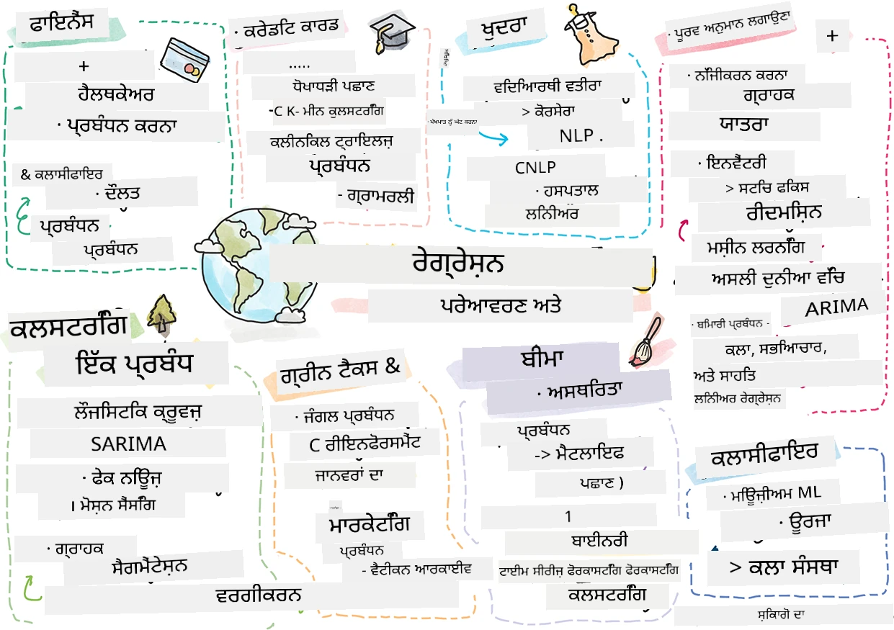

# ਪੋਸਟਸਕ੍ਰਿਪਟ: ਅਸਲ ਦੁਨੀਆ ਵਿੱਚ ਮਸ਼ੀਨ ਲਰਨਿੰਗ

> ਸ੍ਕੇਟਚਨੋਟ [Tomomi Imura](https://www.twitter.com/girlie_mac) ਵੱਲੋਂ

ਇਸ ਕੋਰਸ ਵਿੱਚ, ਤੁਸੀਂ ਡਾਟਾ ਨੂੰ ਪ੍ਰਸ਼ਿਕਸ਼ਣ ਲਈ ਤਿਆਰ ਕਰਨ ਅਤੇ ਮਸ਼ੀਨ ਲਰਨਿੰਗ ਮਾਡਲ ਬਣਾਉਣ ਦੇ ਕਈ ਤਰੀਕੇ ਸਿਖੇ ਹਨ। ਤੁਸੀਂ ਕਲਾਸਿਕ ਰਿਗ੍ਰੈਸ਼ਨ, ਕਲੱਸਟਰਿੰਗ, ਵਰਗੀਕਰਨ, ਕੁਦਰਤੀ ਭਾਸ਼ਾ ਪ੍ਰਕਿਰਿਆ, ਅਤੇ ਸਮਾਂ ਸੀਰੀਜ਼ ਮਾਡਲਾਂ ਦੀ ਇੱਕ ਸੀਰੀਜ਼ ਬਣਾਈ ਹੈ। ਵਧਾਈਆਂ! ਹੁਣ, ਤੁਸੀਂ ਸੋਚ ਰਹੇ ਹੋਵੋਗੇ ਇਸ ਦਾ ਸਾਰੇ ਦਾ ਸਾਰੇ ਮਕਸਦ ਕੀ ਹੈ... ਇਹ ਮਾਡਲ ਸੱਚਮੁੱਚ ਦੁਨੀਆ ਵਿੱਚ ਕਿਵੇਂ ਲਾਗੂ ਹੁੰਦੀਆਂ ਹਨ?

ਜਦੋਂ ਕਿ ਉਦਯੋਗ ਵਿੱਚ ਬਹੁਤ ਸਾਰਾ ਧਿਆਨ ਏ.ਆਈ. ਉੱਤੇ ਕੇਂਦਰਿਤ ਹੈ, ਜੋ ਆਮ ਤੌਰ 'ਤੇ ਡੀਪ ਲਰਨਿੰਗ ਨੂੰ ਵਰਤਦਾ ਹੈ, ਫਿਰ ਵੀ ਕਲਾਸਿਕ ਮਸ਼ੀਨ ਲਰਨਿੰਗ ਮਾਡਲਾਂ ਲਈ ਕੀਮਤੀ ਲਾਗੂਤਾਂ ਮੌਜੂਦ ਹਨ। ਤੁਸੀਂ ਆਜੇ ਵੀ ਇਨ੍ਹਾਂ ਵਿੱਚੋਂ ਕੁਝ ਲਾਗੂਤਾ ਵਰਤ ਰਹੇ ਹੋ ਸਕਦੇ ਹੋ! ਇਸ ਪਾਠ ਵਿੱਚ, ਤੁਸੀਂ ਅੱਠ ਵੱਖ-ਵੱਖ ਉਦਯੋਗਾਂ ਅਤੇ ਵਿਸ਼ਾ ਖੇਤਰਾਂ ਨੂੰ ਖੋਜੋਗੇ ਜੋ ਇਨ੍ਹਾਂ ਕਿਸਮ ਦੇ ਮਾਡਲਾਂ ਨੂੰ ਆਪਣੇ ਐਪਲੀਕੇਸ਼ਨਾਂ ਨੂੰ ਹੋਰ ਪ੍ਰਦਰਸ਼ਨਸ਼ੀਲ, ਭਰੋਸੇਯੋਗ, ਬੁੱਧਿਮਾਨ ਅਤੇ ਉਪਭੋਗਤਾਵਾਂ ਲਈ ਕੀਮਤੀ ਬਣਾਉਣ ਲਈ ਵਰਤਦੇ ਹਨ।

## [ਪੂਰਵ-ਲੈਕਚਰ ਕਵਿਜ਼](https://ff-quizzes.netlify.app/en/ml/)

## 💰 ਵਿੱਤੀ ਖੇਤਰ

ਵਿੱਤ ਖੇਤਰ ਮਸ਼ੀਨ ਲਰਨਿੰਗ ਲਈ ਬਹੁਤ ਸਾਰੀਆਂ ਮੌਕਿਆਂ ਦੀ ਪੇਸ਼ਕਸ਼ ਕਰਦਾ ਹੈ। ਇਸ ਖੇਤਰ ਦੇ ਬਹੁਤ ਸਾਰੇ ਸਮੱਸਿਆਵਾਂ ਨੂੰ ML ਦੀ ਵਰਤੋਂ ਕਰਕੇ ਮਾਡਲ ਅਤੇ ਹੱਲ ਕੀਤਾ ਜਾ ਸਕਦਾ ਹੈ।

### ਕਰੈਡਿਟ ਕਾਰਡ ਧੋਖਾਧੜੀ ਦਾ ਪਤਾ ਲਗਾਉਣਾ

ਅਸੀਂ ਇਸ ਕੋਰਸ ਵਿੱਚ ਪਹਿਲਾਂ [k-ਮੀਨ ਕਲੱਸਟਰਿੰਗ](../../5-Clustering/2-K-Means/README.md) ਬਾਰੇ ਸਿੱਖਿਆ ਸੀ, ਪਰ ਇਹ ਕਰੈਡਿਟ ਕਾਰਡ ਧੋਖਾਧੜੀ ਨਾਲ ਸੰਬੰਧਤ ਸਮੱਸਿਆਵਾਂ ਨੂੰ ਕਿਵੇਂ ਹੱਲ ਕਰ ਸਕਦਾ ਹੈ?

k-ਮੀਨ ਕਲੱਸਟਰਿੰਗ ਉਹ ਸਮੇਂ ਮਦਦਗਾਰ ਹੁੰਦੀ ਹੈ ਜਦੋਂ ਕੀਤਾ ਜਾਂਦਾ ਹੈ ਧੋਖਾਧੜੀ ਖੋਜਣ ਲਈ ਇੱਕ ਤਕਨੀਕ ‘ਆਉਟਲਾਇਰ ਡੀਟੈਕਸ਼ਨ’। ਆਉਟਲਾਇਰਜ਼ ਜਾਂ ਡਾਟਾ ਦੇ ਦੇਖਣ ਵਾਲੇ ਅੰਕੜਿਆਂ ਵਿੱਚ ਵਿਲੱਖਣਤਾ ਦੱਸ ਸਕਦੀ ਹੈ ਕਿ ਇੱਕ ਕਰੈਡਿਟ ਕਾਰਡ ਸਧਾਰਣ ਤਰੀਕੇ ਨਾਲ ਵਰਤਿਆ ਜਾ ਰਿਹਾ ਹੈ ਜਾਂ ਕੁਝ ਅਸਧਾਰਣ ਹੋ ਰਿਹਾ ਹੈ। ਹੇਠਾਂ ਦਿੱਤੇ ਕਾਗਜ਼ ਵਿੱਚ ਦਰਸਾਇਆ ਗਿਆ ਹੈ ਕਿ ਤੁਸੀਂ k-ਮੀਨ ਕਲੱਸਟਰਿੰਗ ਐਲਗੋਰਿਦਮ ਦੀ ਵਰਤੋਂ ਕਰਕੇ ਕਰੈਡਿਟ ਕਾਰਡ ਡਾਟਾ ਸੋਰਟ ਕਰ ਸਕਦੇ ਹੋ ਅਤੇ ਹਰ ਲੈਣ-ਦੇਣ ਨੂੰ ਉਸ ਕਲੱਸਟਰ ਵਿੱਚ ਮੁਕੱਦਰ ਕਰ ਸਕਦੇ ਹੋ ਜਿੱਥੇ ਉਹ ਆਉਟਲਾਇਰ ਵੱਜੋਂ ਮੰਨਿਆ ਜਾਂਦਾ ਹੈ। ਫਿਰ, ਤੁਸੀਂ ਸਭ ਤੋਂ ਖ਼ਤਰਨਾਕ ਕਲੱਸਟਰਾਂ ਨੂੰ ਧੋਖਾਧੜੀ ਅਤੇ جائز ਲੈਣ-ਦੇਣ ਲਈ ਮੂਲਿਆਕਣ ਕਰ ਸਕਦੇ ਹੋ।
[Reference](https://citeseerx.ist.psu.edu/viewdoc/download?doi=10.1.1.680.1195&rep=rep1&type=pdf)

### ਧਨ ਪ੍ਰਬੰਧਨ

ਧਨ ਪ੍ਰਬੰਧਨ ਵਿੱਚ, ਇੱਕ ਵਿਅਕਤੀ ਜਾਂ ਕੰਪਨੀ ਆਪਣੇ ਗਾਹਕਾਂ ਵੱਲੋਂ ਨਿਵੇਸ਼ ਨੂੰ ਸੰਭਾਲਦਾ ਹੈ। ਉਨ੍ਹਾਂ ਦਾ ਕੰਮ ਲੰਬੇ ਸਮੇਂ ਲਈ ਧਨ ਨੂੰ ਕਾਇਮ ਅਤੇ ਵਧਾਉਣਾ ਹੁੰਦਾ ਹੈ, ਇਸ ਲਈ ਵਧੀਆ ਕਾਰਗੁਜ਼ਾਰੀ ਵਾਲੇ ਨਿਵੇਸ਼ ਚੁਣਨਾ ਜਰੂਰੀ ਹੈ।

ਕਿਸੇ ਵਿਸ਼ੇਸ਼ ਨਿਵੇਸ਼ ਦੀ ਕਾਰਗੁਜ਼ਾਰੀ ਦਾ ਮੁਲੰਕਣ ਕਰਨ ਦਾ ਇੱਕ ਤਰੀਕਾ ਸਾਂਖਿਆਕੀ ਰਿਗ੍ਰੈਸ਼ਨ ਹੈ। [ਰੇਖੀ ਰਿਗ੍ਰੈਸ਼ਨ](../../2-Regression/1-Tools/README.md) ਇੱਕ ਅਹੰਕਾਰਪੂਰਨ ਸੰਦ ਹੈ ਜੋ ਇਹ ਸਮਝਦਾ ਹੈ ਕਿ ਕਿਸ ਤਰ੍ਹਾਂ ਕੋਈ ਨਿਧੀ ਕੁਝ ਮਾਪਦੰਡਾਂ ਨਾਲ ਤੁਲਨਾ ਵਿੱਚ ਕਾਰਗੁਜ਼ਾਰੀ ਕਰਦੀ ਹੈ। ਅਸੀਂ ਇਹ ਵੀ ਸਮਝ ਸਕਦੇ ਹਾਂ ਕਿ ਰਿਗ੍ਰੈਸ਼ਨ ਦੇ ਨਤੀਜੇ ਕੀ ਸਾਂਖਿਆਕੀ ਤੌਰ 'ਤੇ ਪ੍ਰਮਾਣਿਤ ਹਨ ਜਾਂ ਨਹੀਂ, ਜਾਂ ਇਹ ਗਾਹਕ ਦੇ ਨਿਵੇਸ਼ਾਂ ਨੂੰ ਕਿੰਨਾ ਪ੍ਰਭਾਵਿਤ ਕਰ ਸਕਦੇ ਹਨ। ਤੁਸੀਂ ਹੋਰ ਮੂੰਹ ਫੈਲਾ ਕੇ ਬਹੁ-ਰਿਗ੍ਰੈਸ਼ਨ ਦੀ ਵਰਤੋਂ ਕਰਕੇ ਆਪਣੀ ਵਿਸ਼ਲੇਸ਼ਣ ਨੂੰ ਵਧਾ ਸਕਦੇ ਹੋ, ਜਿੱਥੇ ਵਾਧੂ ਜੋਖਮ ਕਾਰਕਾਂ ਨੂੰ ਧਿਆਨ ਵਿੱਚ ਰੱਖਿਆ ਜਾ ਸਕਦਾ ਹੈ। ਕਿਸੇ ਖਾਸ ਨਿਧੀ ਲਈ ਇਹ ਕਿਵੇਂ ਕੰਮ ਕਰੇਗਾ, ਇਸ ਬਾਰੇ ਹੇਠਾਂ ਦਿੱਤੇ ਲੇਖ ਨੂੰ ਵੇਖੋ ਜਿਸ ਵਿੱਚ ਰਿਗ੍ਰੈਸ਼ਨ ਦੀ ਵਰਤੋਂ ਕਰਕੇ ਨਿਧੀ ਦੇ ਕਾਰਗੁਜ਼ਾਰੀ ਦੀ ਮੁਲਾਂਕਣ ਕਿੱਥੇ ਗਿਆ ਹੈ।
[Reference](http://www.brightwoodventures.com/evaluating-fund-performance-using-regression/)

## 🎓 ਸਿੱਖਿਆ

ਸਿੱਖਿਆ ਖੇਤਰ ਵੀ ਬਹੁਤ ਰੁਚਿਕਰ ਖੇਤਰ ਹੈ ਜਿੱਥੇ ML ਨੂੰ ਲਾਗੂ ਕੀਤਾ ਜਾ ਸਕਦਾ ਹੈ। ਇਥੇ ਗੁਪਤ ਆਪਣੇ ਟੈਸਟਾਂ ਜਾਂ ਨਿਬੰਧਾਂ 'ਤੇ ਚੀਟ ਕਰਨ ਦਾ ਪਤਾ ਲਗਾਉਣਾ ਜਾਂ ਸੋਧ ਪ੍ਰਕਿਰਿਆ ਵਿੱਚ ਪੱਖਪਾਤ ਜਾਂ ਸਲਾਹਬੁੱਧੀ ਦਾ ਪ੍ਰਬੰਧਨ ਕਰਨਾ ਜਿਹਾ ਚੁਣੌਤੀਪੂਰਨ ਸਮੱਸਿਆਵਾਂ ਹਨ।

### ਵਿਦਿਆਰਥੀ ਦੇ ਵਰਤਾਰਾ ਦੀ ਪੇਸ਼ਗੋਈ

[Coursera](https://coursera.com), ਇੱਕ ਆਨਲਾਈਨ ਮੁਫ਼ਤ ਕੋਰਸ ਪ੍ਰਦਾਤਾ, ਆਪਣੇ ਟੈਕ ਨੋਟਾਂ ਵਿੱਚ ਕਈ ਇੰਜੀਨੀਅਰਿੰਗ ਫੈਸਲੇ ਚਰਚਾ ਕਰਦਾ ਹੈ। ਇਸ ਕੇਸ ਸਟਡੀ ਵਿੱਚ, ਉਹਨਾਂ ਨੇ ਇੱਕ ਰਿਗ੍ਰੈਸ਼ਨ ਲਾਈਨ ਬਣਾਈ ਹੈ ਜਿਸ ਨਾਲ ਨੀਚੇ NPS (ਨੈੱਟ ਪ੍ਰੋਮੋਟਰ ਸਕੋਰ) ਦਰ ਅਤੇ ਕੋਰਸ ਖਤਮ ਕਰਨ ਜਾਂ ਛੱਡਣ ਵਿੱਚ ਸੰਬੰਧ ਦਾ ਪਤਾ ਲੱਗਾਉਣ ਦੀ ਕੋਸ਼ਿਸ਼ ਕੀਤੀ ਹੈ।
[Reference](https://medium.com/coursera-engineering/controlled-regression-quantifying-the-impact-of-course-quality-on-learner-retention-31f956bd592a)

### ਪੱਖਪਾਤ ਨੂੰ ਘਟਾਉਣਾ

[Grammarly](https://grammarly.com), ਇੱਕ ਲਿਖਤੀ ਸਹਾਇਕ ਜੋ ਸ਼ਾਬਦਿਕ ਅਤੇ ਵਿਅਾਕਰਨ ਦੀਆਂ ਗਲਤੀਆਂ ਚੈੱਕ ਕਰਦਾ ਹੈ, ਆਪਣੇ ਉਤਪਾਦਾਂ ਵਿੱਚ [ਕੁਦਰਤੀ ਭਾਸ਼ਾ ਪ੍ਰਕਿਰਿਆ ਪ੍ਰਣਾਲੀਆਂ](../../6-NLP/README.md) ਦੀ ਵਰਤੋਂ ਕਰਦਾ ਹੈ। ਉਹਨਾਂ ਨੇ ਆਪਣੇ ਟੈਕ ਬਲੌਗ ਵਿੱਚ ਇੱਕ ਦਿਲਚਸਪ ਕੇਸ ਸਟਡੀ ਪ੍ਰਕਾਸ਼ਿਤ ਕੀਤੀ ਹੈ ਕਿ ਕਿਵੇਂ ਉਹ ਮਸ਼ੀਨ ਲਰਨਿੰਗ ਵਿੱਚ ਲਿੰਗ ਪੱਖਪਾਤ ਨੂੰ ਸੰਭਾਲਦੇ ਹਨ, ਜਿਸ ਬਾਰੇ ਤੁਸੀਂ ਸਾਡੇ [ਪ੍ਰਾਰੰਭਿਕ ਨਿਰਪੱਖਤਾ ਪਾਠ](../../1-Introduction/3-fairness/README.md) ਵਿੱਚ ਸਿੱਖਿਆ ਸੀ।
[Reference](https://www.grammarly.com/blog/engineering/mitigating-gender-bias-in-autocorrect/)

## 👜 ਰਿਟੇਲ

ਰਿਟੇਲ ਖੇਤਰ ਵਿਸ਼ਵਾਸਨਯੋਗ ਹੈ ML ਦੀ ਵਰਤੋਂ ਤੋਂ ਗਾਹਕਾਂ ਦੇ ਸਫ਼ਰ ਨੂੰ ਵਧੀਆ ਬਨਾਉਣ ਤੋਂ ਲੈ ਕੇ ਸਟੌਕ ਇਨਵੈਂਟਰੀ ਨੂੰ ਅੱਛੇ ਤਰੀਕੇ ਨਾਲ ਸੰਭਾਲਣ ਤੱਕ ਬਹੁਤ ਫਾਇਦਾ ਲੈ ਸਕਦਾ ਹੈ।

### ਗਾਹਕਾਂ ਦੇ ਸਫ਼ਰ ਨੂੰ ਨਿੱਜੀਕਰਨ

Wayfair ਵਿੱਚ, ਜੋ ਘਰੇਲੂ ਸਮਾਨ ਜਿਵੇਂ ਕਿ ਫਰਨੀਚਰ ਵੇਚਦਾ ਹੈ, ਗਾਹਕਾਂ ਨੂੰ ਉਨ੍ਹਾਂ ਦੇ ਰੁਚੀ ਅਤੇ ਜ਼ਰੂਰਤਾਂ ਅਨੁਸਾਰ ਉਸਤੋਂ ਉਤਪਾਦ ਲੱਭਣ ਵਿੱਚ ਮਦਦ ਕਰਨਾ ਬਹੁਤ ਜਰੂਰੀ ਹੈ। ਇਸ ਲੇਖ ਵਿੱਚ, ਕੰਪਨੀ ਦੇ ਇੰਜੀਨੀਅਰ ਦੱਸਦੇ ਹਨ ਕਿ ਉਹ ਸੰਸਾਰਕ ਭਾਸ਼ਾ ਪ੍ਰਕਿਰਿਆ ਅਤੇ ML ਦੀ ਵਰਤੋਂ ਨਾਲ "ਸਹੀ ਨਤੀਜੇ ਗਾਹਕਾਂ ਲਈ ਪੇਸ਼ ਕਰਦੇ ਹਨ"। ਖਾਸ ਤੌਰ 'ਤੇ, ਉਨ੍ਹਾਂ ਦਾ Query Intent Engine ਐਨਟੀਟੀ ਐਕਸਟ੍ਰੈਕਸ਼ਨ, ਕਲਾਸੀਫਾਇਰ ਪ੍ਰਸ਼ਿਖਣ, ਸੰਪਤੀ ਅਤੇ ਰਾਏ ਦੀ ਕਾਢ, ਅਤੇ ਗਾਹਕ ਸਮੀਖਿਆਵਾਂ 'ਤੇ ਭਾਵਨਾ ਟੈਗਿੰਗ ਦੀ ਵਰਤੋਂ ਕਰਦਾ ਹੈ। ਇਹ NLP ਦੇ ਰਿਟੇਲ ਵਿੱਚ ਪੁਰਾਣਾ ਵਰਤਾਰਾਂ ਦਾ ਉਦਾਹਰਨ ਹੈ।
[Reference](https://www.aboutwayfair.com/tech-innovation/how-we-use-machine-learning-and-natural-language-processing-to-empower-search)

### ਸਟੌਕ ਇਨਵੈਂਟਰੀ ਪ੍ਰਬੰਧਨ

ਨਵੀਨੀਕਰਨਸ਼ੀਲ, ਤੇਜ਼ ਕੰਪਨੀਆਂ ਜਿਵੇਂ ਕਿ [StitchFix](https://stitchfix.com), ਜੋ ਗਾਹਕਾਂ ਨੂੰ ਕਪੜੇ ਭੇਜਦੀ ਹੈ, ਸਿਫਾਰਸ਼ਾਂ ਅਤੇ ਇਨਵੈਂਟਰੀ ਪ੍ਰਬੰਧਨ ਲਈ ML 'ਤੇ ਭਾਰੀ ਤੌਰ 'ਤੇ ਨਿਰਭਰ ਕਰਦੀਆਂ ਹਨ। ਉਨ੍ਹਾਂ ਦੀਆਂ ਸਟਾਈਲਿੰਗ ਟੀਮਾਂ ਆਪਣੇ ਮਰਚੈਂਡਾਈਜ਼ਿੰਗ ਟੀਮਾਂ ਨਾਲ ਮਿਲ ਕੇ ਕੰਮ ਕਰਦੀਆਂ ਹਨ: "ਸਾਡਾ ਇੱਕ ਡਾਟਾ ਸਾਇੰਟਿਸਟ ਜਨੈਟਿਕ ਐਲਗੋਰਿਦਮ ਨਾਲ ਖੇਡਦਾ ਸੀ ਅਤੇ ਇਸ ਨੂੰ ਕਪੜਿਆਂ 'ਤੇ ਲਾਗੂ ਕਰਕੇ ਅਜਿਹਾ ਕਪੜਾ ਭਵਿੱਖਬਾਣੀ ਕੀਤਾ ਜੋ ਅਜੇ ਤੱਕ ਮੌਜੂਦ ਨਹੀਂ ਸੀ। ਅਸੀਂ ਇਹ ਮਰਚੈਂਡਾਈਜ਼ ਟੀਮ ਨੂੰ ਦਿੱਤਾ ਅਤੇ ਹੁਣ ਉਹ ਇਸਨੂੰ ਸੰਦ ਵਜੋਂ ਵਰਤ ਸਕਦੇ ਹਨ।"
[Reference](https://www.zdnet.com/article/how-stitch-fix-uses-machine-learning-to-master-the-science-of-styling/)

## 🏥 ਸਿਹਤ ਸੇਵਾ

ਸਿਹਤ ਸੇਵਾ ਖੇਤਰ ਖੋਜ ਕਾਰਜਾਂ ਅਤੇ ਤਰਕਸ਼ੀਲ ਸਮੱਸਿਆਵਾਂ ਜਿਵੇਂ ਮਰੀਜ਼ਾਂ ਦਾ ਦੁਬਾਰਾ ਦਾਖਲਾ ਅਤੇ ਬਿਮਾਰੀਆਂ ਦੇ ਫੈਲਣ ਨੂੰ ਰੋਕਣ ਦਾ ਤਰੀਕਾ ਵੇਖਣ ਲਈ ML ਦਾ ਲਾਭ ਲੈ ਸਕਦਾ ਹੈ।

### ਕਲਿਨੀਕਲ ਟ੍ਰਾਇਲ ਪ੍ਰਬੰਧਨ

ਕਲਿਨੀਕਲ ਟ੍ਰਾਇਲਾਂ ਵਿੱਚ ਜਹਿਰੀਲਾਪਣ ਦਵਾਈ ਬਣਾਉਣ ਵਾਲਿਆਂ ਲਈ ਇੱਕ ਵੱਡੀ ਚਿੰਤਾ ਹੈ। ਕਿੰਨੀ ਜਹਿਰੀਲਾਪਣ ਬਰਦਾਸ਼ਤ ਕੀਤੀ ਜਾ ਸਕਦੀ ਹੈ? ਇਸ ਅਧਿਐਨ ਵਿੱਚ, ਕਈ ਕਲਿਨੀਕਲ ਟ੍ਰਾਇਲ ਤਰੀਕਿਆਂ ਦੇ ਵਿਸ਼ਲੇਸ਼ਣ ਤੋਂ ਇੱਕ ਨਵਾਂ ਤਰੀਕਾ ਵਿਕਸਿਤ ਕੀਤਾ ਗਿਆ ਜੋ ਟ੍ਰਾਇਲ ਨਤੀਜਿਆਂ ਦੀ ਸੰਭਾਵਨਾ ਦੀ ਭਵਿੱਖਬਾਣੀ ਕਰਦਾ ਹੈ। ਖਾਸ ਤੌਰ 'ਤੇ, ਉਹ ਰੈਂਡਮ ਫਾਰੈਸਟ ਦੀ ਵਰਤੋਂ ਕਰਕੇ ਇੱਕ [ਕਲਾਸੀਫਾਇਰ](../../4-Classification/README.md) ਬਣਾਉਣ ਵਿੱਚ ਸਫਲ ਹੋਏ ਜੋ ਦਵਾਈਆਂ ਦੇ ਗਰੁੱਪਾਂ ਨੂੰ ਫਰਕ ਕਰ ਸਕਦਾ ਹੈ।
[Reference](https://www.sciencedirect.com/science/article/pii/S2451945616302914)

### ਹਸਪਤਾਲ ਦੁਬਾਰਾ ਦਾਖਲਾ ਪ੍ਰਬੰਧਨ

ਹਸਪਤਾਲ ਦੀ ਦੇਖਭਾਲ ਮਹਿੰਗੀ ਹੈ, ਖ਼ਾਸਕਰ ਜਦੋਂ ਮਰੀਜ਼ਾਂ ਨੂੰ ਦੁਬਾਰਾ ਦਾਖਲ ਕਰਨਾ ਪੈਂਦਾ ਹੈ। ਇਸ ਕਾਗਜ਼ ਵਿੱਚ ਇੱਕ ਕੰਪਨੀ ਦੀ ਚਰਚਾ ਹੈ ਜੋ ML ਦੀ ਵਰਤੋਂ ਕਰਕੇ ਦੁਬਾਰਾ ਦਾਖਲੇ ਦੀ ਸੰਭਾਵਨਾ ਦਾ ਅੰਦਾਜ਼ਾ ਲਗਾਉਂਦਾ ਹੈ [ਕਲੱਸਟਰਿੰਗ](../../5-Clustering/README.md) ਐਲਗੋਰਿਦਮਾਂ ਦੀ ਮਦਦ ਨਾਲ। ਇਹ ਕਲੱਸਟਰ ਵਿਸ਼ਲੇਸ਼ਕਾਂ ਨੂੰ " ਦੁਬਾਰਾ ਦਾਖਲ ਹੋਣ ਵਾਲੇ ਗਰੁੱਪਾਂ ਦਾ ਪਤਾ ਲਗਾਉਣ ਵਿੱਚ ਮਦਦ ਕਰਦੇ ਹਨ ਜੋ ਸਾਂਝੇ ਕਾਰਨ ਨਾਲ ਜੁੜੇ ਹੋ ਸਕਦੇ ਹਨ।"
[Reference](https://healthmanagement.org/c/healthmanagement/issuearticle/hospital-readmissions-and-machine-learning)

### ਬਿਮਾਰੀ ਪ੍ਰਬੰਧਨ

ਹਾਲੀਆ ਮਹਾਮਾਰੀ ਨੇ ਇਸ ਗੱਲ ‘ਤੇ ਚਮਕਾਇਆ ਹੈ ਕਿ ਮਸ਼ੀਨ ਲਰਨਿੰਗ ਬਿਮਾਰੀ ਦੇ ਫੈਲਾਅ ਨੂੰ ਰੋਕਣ ਵਿੱਚ ਕਿਵੇਂ ਸਹਾਇਤਾ ਕਰ ਸਕਦਾ ਹੈ। ਇਸ ਲੇਖ ਵਿੱਚ, ਤੁਸੀਂ ARIMA, ਲੌਜਿਸਟਿਕ ਕਰਵਜ਼, ਲੀਨੀਅਰ ਰਿਗ੍ਰੈਸ਼ਨ ਅਤੇ SARIMA ਦੀ ਵਰਤੋਂ ਦੇਖੋਗੇ। "ਇਹ ਕੰਮ ਇਸ ਵਾਇਰਸ ਦੇ ਫੈਲਾਅ ਦੀ ਦਰ ਦਾ ਲੇਖਾ-ਜੋਖਾ ਕਰਨ ਅਤੇ ਇਸ ਤਰ੍ਹਾਂ ਮੌਤਾਂ, ਠੀਕ ਹੋਣ ਅਤੇ ਪੁਸ਼ਟੀ ਕੀਤੀਆਂ ਮਾਮਲਿਆਂ ਦੀ ਭਵਿੱਖਬਾਣੀ ਕਰਨ ਦੀ ਕੋਸ਼ਿਸ਼ ਹੈ, ਤਾਂ ਜੋ ਸਾਨੂੰ ਬਿਹਤਰ ਤਿਆਰੀ ਕਰਨ ਅਤੇ ਜਿਊਂਦਗੀ ਬਚਾਉਣ ਵਿੱਚ ਮਦਦ ਮਿਲੇ।"
[Reference](https://www.ncbi.nlm.nih.gov/pmc/articles/PMC7979218/)

## 🌲 ਜੋਂਗ ਅਤੇ ਹਰਾ ਤਕਨੀਕ

ਕੁਦਰਤ ਅਤੇ ਜੋਂਗ ਕਈ ਸੰਵੇਦਨਸ਼ੀਲ ਪ੍ਰਣਾਲੀਆਂ ਦੇ ਸਮੂਹ ਹਨ ਜਿੱਥੇ ਜਾਨਵਰਾਂ ਅਤੇ ਕੁਦਰਤ ਦੇ ਵਿਚਕਾਰ ਪਰਸਪਰਕਿਰਿਆ ਦਾ ਕੇਂਦਰ ਬਣਦਾ ਹੈ। ਇਹ ਜਰੂਰੀ ਹੈ ਕਿ ਅਸੀਂ ਇਹਨਾਂ ਪ੍ਰਣਾਲੀਆਂ ਨੂੰ ਸਹੀ ਤਰੀਕੇ ਨਾਲ ਮਾਪ ਕਰੀਏ ਅਤੇ ਜੇ ਕੁਝ ਵਾਪਰੇ ਜਿਵੇਂ ਕਿ ਜੰਗਲਾਂ ਵਿੱਚ ਅੱਗ ਜਾਂ ਜਾਨਵਰਾਂ ਦੀ ਗਿਣਤੀ ਘਟਣ, ਤਾਂ ਢੰਗ ਨਾਲ ਕਾਰਵਾਈ ਕਰੀਏ।

### ਜੰਗਲ ਪ੍ਰਬੰਧਨ

ਤੁਸੀਂ ਪਿਛਲੇ ਪਾਠਾਂ ਵਿੱਚ [ਰੀਇਨਫੋਰਸਮੈਂਟ ਲਰਨਿੰਗ](../../8-Reinforcement/README.md) ਬਾਰੇ ਸਿੱਖਿਆ ਸੀ। ਇਹ ਕੁਦਰਤ ਵਿੱਚ ਨਮੂਨੇ ਭਵਿੱਖਬਾਣੀ ਕਰਨ ਵਿੱਚ ਬਹੁਤ ਮਦਦਗਾਰ ਹੋ ਸਕਦਾ ਹੈ। ਖਾਸ ਕਰਕੇ ਇਹ ਜੰਗਲਾਂ ਵਿੱਚ ਅੱਗ ਜਾਂ ਘੁਸਪੈਠੀਆਂ ਜੀਵ-ਜੰਤੂਆਂ ਦੇ ਫੈਲਾਅ ਵਰਗੀਆਂ ਪਰਿਸਥਿਤੀਕ ਸਮੱਸਿਆਵਾਂ ਨੂੰ ਟਰੈਕ ਕਰਨ ਲਈ ਵਰਤਿਆ ਜਾ ਸਕਦਾ ਹੈ। ਕੈਨੇਡਾ ਵਿੱਚ, ਇੱਕ ਸਮੂਹ ਨੇ ਸੈਟੇਲਾਈਟ ਤਸਵੀਰਾਂ ਤੋਂ ਜੰਗਲ ਦੀ ਅੱਗ ਦੇ ਗਤੀਵਿਧੀ ਮਾਡਲ ਬਣਾਉਣ ਲਈ ਰੀਇਨਫੋਰਸਮੈਂਟ ਲਰਨਿੰਗ ਦੀ ਵਰਤੋਂ ਕੀਤੀ। ਇਨ੍ਹਾਂ ਨੇ ਇੱਕ ਨਵਾਂ "ਸਪੇਸ਼ਲੀ ਸਪਰੇਡਿੰਗ ਪ੍ਰੋਸੈਸ (SSP)" ਵਰਤ ਕੇ ਜੰਗਲ ਦੀ ਅੱਗ ਨੂੰ ਡੂੰਘਾਈ ਵਿੱਚ "ਲੈਂਡਸਕੇਪ ਵਿੱਚ ਕਿਸੇ ਵੀ ਸੈੱਲ 'ਤੇ ਏਜੰਟ" ਵੱਜੋਂ ਵੇਖਿਆ। "ਅੱਗ, ਕਿਸੇ ਵੀ ਸਮੇਂ ਕਿਸੇ ਥਾਂ ਤੋਂ ਉੱਤਰ, ਦੱਖਣ, ਪੂਰਬ ਜਾਂ ਪੱਛਮ ਵੱਲ ਫੈਲ ਸਕਦੀ ਹੈ ਜਾਂ ਨਹੀਂ ਵੀ ਫੈਲ ਸਕਦੀ।"

ਇਹ ਤਰੀਕਾ ਆਮ RL ਸੈਟਅਪ ਨੂੰ ਵੱਪਸ ਕਰਦਾ ਹੈ ਕਿਉਂਕਿ ਅਨੁਕੂਲ ਮਾਰਕੋਵ ਡਿਸੀਜ਼ਨ ਪ੍ਰੋਸੈਸ (MDP) ਲਈ ਜੰਗਲ ਦੀ ਅੱਗ ਦੇ ਫੈਲਾਅ ਦੀ ਗਤੀਵਿਧੀ ਇੱਕ ਜਾਣੀ-ਪਹਚਾਣੀ ਫੰਕਸ਼ਨ ਹੈ।" ਇਸ ਸਮੂਹ ਵੱਲੋਂ ਵਰਤੇ ਗਏ ਕਲਾਸਿਕ ਐਲਗੋਰਿਦਮਾਂ ਬਾਰੇ ਹੋਰ ਪੜ੍ਹੋ ਹੇਠਾਂ ਦਿੱਤੇ ਲਿੰਕ ਵਿੱਚ।
[Reference](https://www.frontiersin.org/articles/10.3389/fict.2018.00006/full)

### ਜਾਨਵਰਾਂ ਦੀ ਗਤੀ ਇੰਦਾਜ਼

ਜਦਕਿ ਡੀਪ ਲਰਨਿੰਗ ਨੇ ਜੀਵਾਂ ਦੀਆਂ ਹਰਕਤਾਂ ਨੂੰ ਵਿਜ਼ੂਅਲੀ ਟਰੈਕ ਕਰਨ ਵਿੱਚ ਇਕ ਇਨਕਲਾਬ ਪੈਦਾ ਕੀਤਾ ਹੈ (ਤੁਸੀਂ ਇੱਥੇ ਆਪਣਾ [ਪੋਲਰ ਬੇਅਰ ਟਰੈਕਰ](https://docs.microsoft.com/learn/modules/build-ml-model-with-azure-stream-analytics/?WT.mc_id=academic-77952-leestott) ਬਣਾ ਸਕਦੇ ਹੋ), ਪਰ ਕਲਾਸਿਕ ML ਨੂੰ ਇਸ ਕੰਮ ਵਿੱਚ ਅਜੇ ਵੀ ਜਗ੍ਹਾ ਮਿਲਦੀ ਹੈ।

ਫਾਰਮ ਜਾਨਵਰਾਂ ਦੀਆਂ ਹਿੱਲਚਲਾਂ ਨੂੰ ਟਰੈਕ ਕਰਨ ਲਈ ਸੈਂਸਰ ਅਤੇ IoT ਇਸ ਕਿਸਮ ਦੀ ਵਿਜ਼ੂਅਲ ਪ੍ਰਕਿਰਿਆ ਨੂੰ ਵਰਤਦੇ ਹਨ, ਪਰ ਆਧੁਨਿਕ MLM ਤਕਨੀਕਾਂ ਡਾਟਾ ਦੀ ਪੂਰਵ-ਸੰਭਾਲ ਲਈ ਮਦਦਗਾਰ ਹਨ। ਉਦਾਹਰਨ ਵਜੋਂ, ਇਸ ਕਾਗਜ਼ ਵਿੱਚ ਭੇਂਸਾਂ ਦੇ ਅਸਥਾਨਾਂ ਦੀ ਨਿਗਰਾਨੀ ਅਤੇ ਵਿਸ਼ਲੇਸ਼ਣ ਵੱਖ-ਵੱਖ ਕਲਾਸੀਫਾਇਰ ਐਲਗੋਰਿਦਮਾਂ ਦੀ ਵਰਤੋਂ ਨਾਲ ਕੀਤੀ ਗਈ। ਤੁਸੀਂ ਸਫ਼ਾ 335 ਤੇ ROC ਕ੍ਰਿਵ ਨੂੰ ਪਛਾਣ ਸਕਦੇ ਹੋ।
[Reference](https://druckhaus-hofmann.de/gallery/31-wj-feb-2020.pdf)

### ⚡️ ਊਰਜਾ ਦੀ ਪ੍ਰਬੰਧਕੀ
  
ਸਾਡੇ [ਸਮਾਂ ਸੀਰੀਜ਼ ਪੇਸ਼ਗੀ](../../7-TimeSeries/README.md) ਦੇ ਪਾਠਾਂ ਵਿੱਚ, ਅਸੀਂ ਸਪਲਾਈ ਅਤੇ ਮੰਗ ਨੂੰ ਸਮਝ ਕੇ ਸ਼ਹਿਰ ਲਈ ਰੇਵਨਿਊ ਬਣਾਉਣ ਲਈ ਸਮਾਰਟ ਪਾਰਕਿੰਗ ਮੀਟਰਾਂ ਦਾ ਸੰਕਲਪ ਦਿੱਖਾਇਆ ਸੀ। ਇਹ ਲੇਖ ਵਿਸਥਾਰ ਨਾਲ ਚਰਚਾ ਕਰਦਾ ਹੈ ਕਿ ਕਿਵੇਂ ਕਲੱਸਟਰਿੰਗ, ਰਿਗ੍ਰੈਸ਼ਨ ਅਤੇ ਸਮਾਂ ਸੀਰੀਜ਼ ਪੇਸ਼ਗੀ ਸਿੱਖ ਕੇਸ਼ਨ/ਸਮਾਰਟ ਮੀਟਰਿੰਗ ਦੀ ਆਧਾਰ 'ਤੇ ਆਇਰਲੈਂਡ ਵਿੱਚ ਭਵਿੱਖ ਵਿੱਚ ਊਰਜਾ ਦੀ ਵਰਤੋਂ ਦਾ ਅੰਦਾਜ਼ਾ ਲਗਾਉਣ ਵਾਲੀ ਮਦਦ ਕਰਦੇ ਹਨ।
[Reference](https://www-cdn.knime.com/sites/default/files/inline-images/knime_bigdata_energy_timeseries_whitepaper.pdf)

## 💼 ਬੀਮਾ

ਬੀਮਾ ਖੇਤਰ ਵੀ ਇੱਕ ਹੋਰ ਖੇਤਰ ਹੈ ਜੋ ML ਨੂੰ ਪ੍ਰਭਾਵਸ਼ਾਲੀ ਅਤੇ ਲਾਭਕਾਰੀ ਵਿੱਤੀ ਅਤੇ ਕਾਰਜਕੁਸ਼ਲ ਮਾਡਲ ਬਣਾਉਣ ਵਿਚ ਵਰਤਦਾ ਹੈ।

### ਅਸਥਿਰਤਾ ਪ੍ਰਬੰਧਨ

MetLife, ਇੱਕ ਜੀਵਨ ਬੀਮਾ ਪ੍ਰਦਾਤਾ, ਖੁੱਲ੍ਹ ਕੇ ਗੱਲ ਕਰਦਾ ਹੈ ਕਿ ਉਹ ਆਪਣੇ ਵਿੱਤੀ ਮਾਡਲਾਂ ਵਿੱਚ ਅਸਥਿਰਤਾ ਦਾ ਵਿਸ਼ਲੇਸ਼ਣ ਅਤੇ ਨਿਯੰਤਰਣ ਕਿਵੇਂ ਕਰਦਾ ਹੈ। ਇਸ ਲੇਖ ਵਿੱਚ ਤੁਸੀਂ ਬਾਈਨਰੀ ਅਤੇ ਓਰਡੀਨਲ ਕਲਾਸੀਫਿਕੇਸ਼ਨ ਵਿਜ਼ੂਅਲਜ਼ ਦੇਖੋਗੇ। ਤੁਸੀਂ ਪੇਸ਼ਗੀ ਸਾਧਨਾਂ ਦੇ ਵੀ ਵਿਜ਼ੂਅਲਜ਼ ਵੇਖੋਗੇ।
[Reference](https://investments.metlife.com/content/dam/metlifecom/us/investments/insights/research-topics/macro-strategy/pdf/MetLifeInvestmentManagement_MachineLearnedRanking_070920.pdf)

## 🎨 ਕਲਾ, ਸਭਿਆਚਾਰ ਅਤੇ ਸਾਹਿਤ

ਕਲਾਵਾਂ ਵਿੱਚ, ਉਦਾਹਰਨ ਲਈ ਪੱਤਰਕਾਰਤਾ ਵਿੱਚ, ਬਹੁਤ ਸਾਰੀਆਂ ਦਿਲਚਸਪ ਸਮੱਸਿਆਵਾਂ ਹਨ। ਨਕਲੀ ਖਬਰਾਂ ਦਾ ਪਤਾ ਲਗਾਉਣਾ ਇੱਕ ਵੱਡੀ ਸਮੱਸਿਆ ਹੈ ਕਿਉਂਕਿ ਇਹ ਲੋਕਾਂ ਦੀ ਰਾਏ ਨੂੰ ਪ੍ਰਭਾਵਿਤ ਕਰਦੀਆਂ ਹਨ ਅਤੇ ਇੱਥੇ ਤਕ ਕਿ ਲੋਕਤੰਤਰਾਂ ਨੂੰ ਪਿੱਟਾਅਨ ਵਾਲੀਆਂ ਵੀ ਹੋ ਸਕਦੀਆਂ ਹਨ। ਮਿਊਜ਼ੀਅਮ ਵੀ ਐਮ ਐਲ ਵਰਤ ਕੇ ਕਈ ਕੰਮਾਂ ਵਿੱਚ ਲਾਭ ਲੈ ਸਕਦੇ ਹਨ ਜਿਵੇਂ ਕਿ ਕਲੈਕਸ਼ਨਾਂ ਵਿਚਕਾਰ ਲਿੰਕ ਲੱਭਣਾ ਜਾਂ ਸਰੋਤ ਯੋਜਨਾ ਬਣਾਉਣਾ।

### ਨਕਲੀ ਖਬਰਾਂ ਦਾ ਪਤਾ ਲਗਾਉਣਾ

ਇਸ ਸਮੇਂ ਦੀ ਮੀਡੀਆ ਵਿੱਚ ਨਕਲੀ ਖਬਰਾਂ ਨੂੰ ਪਹਿਚਾਣਣਾ ਇੱਕ ਬਿੱਲੀ-ਚੂਹਾ ਖੇਡ ਬਣ ਚੁੱਕੀ ਹੈ। ਇਸ ਲੇਖ ਵਿੱਚ, ਖੋਜ ਵਿਗਿਆਨੀਆਂ ਦਾ ਕਹਿਣਾ ਹੈ ਕਿ ਇਕ ਐਸਾ ਸਿਸਟਮ ਜੋ ਕਈ ML ਤਕਨੀਕਾਂ ਨੂੰ ਜੋੜਦਾ ਹੈ, ਟੈਸਟ ਕੀਤਾ ਜਾ ਸਕਦਾ ਹੈ ਅਤੇ ਸਭ ਤੋਂ ਵਧੀਆ ਮਾਡਲ ਤੈਨਾਤ ਕੀਤਾ ਜਾ ਸਕਦਾ ਹੈ: "ਇਹ ਸਿਸਟਮ ਕੁਦਰਤੀ ਭਾਸ਼ਾ ਪ੍ਰਕਿਰਿਆ 'ਤੇ ਆਧਾਰਿਤ ਹੈ ਜੋ ਡਾਟਾ ਤੋਂ ਵਿਸ਼ੇਸ਼ਤਾਵਾਂ ਕੱਢਦਾ ਹੈ ਅਤੇ ਫਿਰ ਇਹ ਵਿਸ਼ੇਸ਼ਤਾਵਾਂ ਮਸ਼ੀਨ ਲਰਨਿੰਗ ਕਲਾਸੀਫਾਇਰਾਂ ਜਿਵੇਂ ਦਾ Naive Bayes, Support Vector Machine (SVM), Random Forest (RF), Stochastic Gradient Descent (SGD), ਅਤੇ Logistic Regression (LR) ਲਈ ਪ੍ਰਸ਼ਿਖਣ ਲਈ ਵਰਤੀ ਜਾਂਦੀਆਂ ਹਨ।"
[Reference](https://www.irjet.net/archives/V7/i6/IRJET-V7I6688.pdf)

ਇਹ ਲੇਖ ਦਰਸਾਉਂਦਾ ਹੈ ਕਿ ਕਿਵੇਂ ਵੱਖ-ਵੱਖ ML ਖੇਤਰਾਂ ਦੇ ਸਮੀਕਰਨ ਨਾਲ ਦਿਲਚਸਪ ਨਤੀਜੇ ਪ੍ਰਾਪਤ ਕੀਤੇ ਜਾ ਸਕਦੇ ਹਨ ਜੋ ਨਕਲੀ ਖਬਰਾਂ ਦੇ ਫੈਲਾਅ ਅਤੇ ਸਹੀ ਨੁਕਸਾਨ ਪਹੁੰਚਾਉਣ ਤੋਂ ਰੋਕਣ ਵਿੱਚ ਮਦਦ ਕਰ ਸਕਦੇ ਹਨ; ਇਸ ਮਾਮਲੇ ਵਿੱਚ, ਕਾਰਨ COVID ਇਲਾਜ ਬਾਰੇ ਅਫਵਾਹਾਂ ਦੇ ਫੈਲਾਅ ਨੇ ਹਿੰਸਾ ਨੂੰ ਵਧਾਇਆ।

### ਮਿਊਜ਼ੀਅਮ ਐਮ.ਐੱਲ.

ਮਿਊਜ਼ੀਅਮ ਇਸ ਸਮੇਂ ਏ.ਆਈ. ਇਨਕਲਾਬ ਦੇ ਕੰਨ੍ਹੇ ਤੇ ਹਨ ਜਿੱਥੇ ਕੈਟਲੌਗਿੰਗ ਅਤੇ ਕਲੈਕਸ਼ਨਾਂ ਨੂੰ ਡਿਜਿਟਾਈਜ਼ ਕਰਨ ਅਤੇ ਕਲੈਕਸ਼ਨਾਂ ਵਿੱਚੋਂ ਲਿੰਕ ਲੱਭਣਾ ਆਸਾਨ ਹੋ ਰਿਹਾ ਹੈ। ਪ੍ਰੋਜੈਕਟਾਂ ਜਿਵੇਂ [In Codice Ratio](https://www.sciencedirect.com/science/article/abs/pii/S0306457321001035#:~:text=1.,studies%20over%20large%20historical%20sources.) ਵੈਟਿਕਨ ਆਰਕਾਈਵਜ਼ ਦੀਆਂ ਗੁਪਤ ਕਲੈਕਸ਼ਨਾਂ ਨੂੰ ਖੋਲ੍ਹਣ ਵਿੱਚ ਮਦਦ ਕਰ ਰਹੇ ਹਨ। ਪਰ, ਮਿਊਜ਼ੀਅਮ ਦੇ ਵਪਾਰਕ ਪੱਖ ਨੂੰ ਵੀ ਮਸ਼ੀਨ ਲਰਨਿੰਗ ਮਾਡਲਾਂ ਤੋਂ ਲਾਭ ਹੁੰਦਾ ਹੈ।

ਉਦਾਹਰਨ ਲਈ, ਚਿਕਾਗੋ ਦੇ ਆਰਟ ਇੰਸਟਿਟਿਊਟ ਨੇ ਮਾਡਲ ਬਣਾਏ ਹਨ ਜੋ ਪੇਸ਼ਗੋਈ ਕਰਦੇ ਹਨ ਕਿ ਦਰਸ਼ਕ ਕਿਸ ਚੀਜ਼ ਵਿੱਚ ਦਿਲਚਸਪੀ ਰੱਖਦੇ ਹਨ ਅਤੇ ਕਦੋਂ ਉਹ ਪ੍ਰਦਰਸ਼ਨੀ ਵਿੱਚ ਸ਼ਿਰਕਤ ਕਰਨਗੇ। ਲਕੜੀ ਇਹ ਹੈ ਕਿ ਹਰ ਵਾਰੀ ਜਦੋਂ ਉਪਭੋਗਤਾ ਮਿਊਜ਼ੀਅਮ ਆਉਂਦਾ ਹੈ, ਉਸ ਲਈ ਵਿਅਕਤੀਗਤ ਅਤੇ ਸੁਧਰਿਆ ਹੋਇਆ ਅਨੁਭਵ ਬਣਾਇਆ ਜਾਵੇ। "ਵਿੱਤੀ سال 2017 ਦੌਰਾਨ, ਇਹ ਮਾਡਲ ਹਾਜ਼ਰੀ ਅਤੇ ਦਾਖਲੇ ਦੀ ਭਵਿੱਖਬਾਣੀ 1 ਪ੍ਰਤੀਸ਼ਤ ਨੁਕਸਾਨ ਨਾਲ ਕੀਤੀ ਸੀ," ਐਂਡਰੂ ਸਿਮਨਿਕ, ਸੀਨੀਅਰ ਵਾਈਸ ਪ੍ਰੈਜ਼ਿਡੈਂਟ ਆਰਟ ਇੰਸਟਿਟਿਊਟ ਵਿੱਚ ਕਹਿੰਦੇ ਹਨ।
[Reference](https://www.chicagobusiness.com/article/20180518/ISSUE01/180519840/art-institute-of-chicago-uses-data-to-make-exhibit-choices)

## 🏷 ਮਾਰਕਿਟਿੰਗ

### ਗਾਹਕ ਵੰਡ

ਸਭ ਤੋਂ ਪ੍ਰਭਾਵਸ਼ਾਲੀ ਮਾਰਕਿਟਿੰਗ ਰਣਨੀਤੀਆਂ ਵੱਖ-ਵੱਖ ਗਾਹਕਾਂ ਨੂੰ ਵੱਖ-ਵੱਖ ਤਰੀਕਿਆਂ ਨਾਲ ਨਿਸ਼ਾਨਾ ਬਣਾਉਂਦੀਆਂ ਹਨ ਵੱਖ-ਵੱਖ ਸਮੂਹਾਂ ਦੇ ਅਧਾਰ 'ਤੇ। ਇਸ ਲੇਖ ਵਿੱਚ, ਕਲੱਸਟਰਿੰਗ ਐਲਗੋਰਿਦਮ ਦੀ ਵਰਤੋਂ ਵੱਖ-ਵੱਖ ਮਾਰਕਿਟਿੰਗ ਨੂੰ ਸਮਰਥਨ ਕਰਨ ਲਈ ਚਰਚਾ ਕੀਤੀ ਗਈ ਹੈ। ਵੱਖ-ਵੱਖ ਮਾਰਕਿਟਿੰਗ ਕੰਪਨੀਆਂ ਨੂੰ ਬ੍ਰਾਂਡ ਦੀ ਪਛਾਣ ਬਹਿਬੁਧ, ਵੱਧ ਗਾਹਕ ਤੱਕ ਪਹੁੰਚਣ ਅਤੇ ਵੱਧ ਪੈਸਾ ਕਮਾਉਣ ਵਿੱਚ ਮਦਦ ਕਰਦੀ ਹੈ।
[Reference](https://ai.inqline.com/machine-learning-for-marketing-customer-segmentation/)

## 🚀 ਚੁਣੌਤੀ

ਕਿਸੇ ਹੋਰ ਖੇਤਰ ਦੀ ਪਹਿਚਾਣ ਕਰੋ ਜੋ ਇਸ ਕੋਰਸ ਵਿੱਚ ਸਿੱਖੀਆਂ ਕੁਝ ਤਕਨੀਕਾਂ ਤੋਂ ਲਾਭ ਪ੍ਰਾਪਤ ਕਰਦਾ ਹੋਵੇ, ਅਤੇ ਖੋਜੋ ਕਿ ਉਹ ਕਿਵੇਂ ਮਸ਼ੀਨ ਲਰਨਿੰਗ ਵਰਤਦਾ ਹੈ।

## [ਪੋਸਟ-ਲੈਕਚਰ ਕੁਇਜ਼](https://ff-quizzes.netlify.app/en/ml/)

## ਸਮੀਖਿਆ ਅਤੇ ਸਵੈ ਅਧਿਐਨ

ਵੇਅਫੇਅਰ ਡੇਟਾ ਸਾਇੰਸ ਟੀਮ ਕੋਲ ਕਈ ਦਿਲਚਸਪ ਵੀਡੀਓਜ਼ ਹਨ ਜਿਨ੍ਹਾਂ ਵਿੱਚ ਉਹ ਆਪਣੇ ਕੰਪਨੀ ਵਿੱਚ ਐਮਐਲ ਕਿਵੇਂ ਵਰਤਦੇ ਹਨ। ਇਸ ਨੂੰ [ਦੇਖਣਾ ਲਾਇਕ ਹੈ](https://www.youtube.com/channel/UCe2PjkQXqOuwkW1gw6Ameuw/videos)!

## ਅਸਾਈਨਮੈਂਟ

[ਇੱਕ ਐਮਐਲ ਸਕੈਵੈਂਜਰ ਹੰਟ](assignment.md)

---

<!-- CO-OP TRANSLATOR DISCLAIMER START -->
**ਅਸਵੀਕਾਰੋਪਣ**:
ਇਸ ਦਸਤਾਵੇਜ਼ ਦਾ ਅਨੁਵਾਦ ਏਆਈ ਅਨੁਵਾਦ ਸੇਵਾ [Co-op Translator](https://github.com/Azure/co-op-translator) ਦੀ ਵਰਤੋਂ ਕਰਕੇ ਕੀਤਾ ਗਿਆ ਹੈ। ਜਦੋਂ ਕਿ ਅਸੀਂ ਸਹੀਤਾਵਾਂ ਲਈ ਯਤਨਸ਼ੀਲ ਹਾਂ, ਕਿਰਪਾ ਕਰਕੇ ਧਿਆਨ ਰੱਖੋ ਕਿ ਸਵੈਚਾਲਿਤ ਅਨੁਵਾਦਾਂ ਵਿੱਚ ਗਲਤੀਆਂ ਜਾਂ ਅਸਮੱਤਿਆਵਾਂ ਹੋ ਸਕਦੀਆਂ ਹਨ। ਮੂਲ ਦਸਤਾਵੇਜ਼ ਆਪਣੀ ਮੂਲ ਭਾਸ਼ਾ ਵਿੱਚ ਅਧਿਕਾਰਕ ਸਰੋਤ ਮੰਨਿਆ ਜਾਣਾ ਚਾਹੀਦਾ ਹੈ। ਜਰੂਰੀ ਜਾਣਕਾਰੀ ਲਈ, ਪੇਸ਼ੇਵਰ ਮਨੁੱਖੀ ਅਨੁਵਾਦ ਦੀ ਸਿਫ਼ਾਰਸ਼ ਕੀਤੀ ਜਾਂਦੀ ਹੈ। ਅਸੀਂ ਇਸ ਅਨੁਵਾਦ ਦੇ ਉਪਯੋਗ ਤੋਂ ਪੈਦਾ ਹੋਣ ਵਾਲੀਆਂ ਕਿਸੇ ਵੀ ਗਲਤਫਹਿਮੀਆਂ ਜਾਂ ਗਲਤ ਵਿਆਖਿਆਵਾਂ ਲਈ ਜਵਾਬਦੇਹ ਨਹੀਂ ਹਾਂ।
<!-- CO-OP TRANSLATOR DISCLAIMER END -->