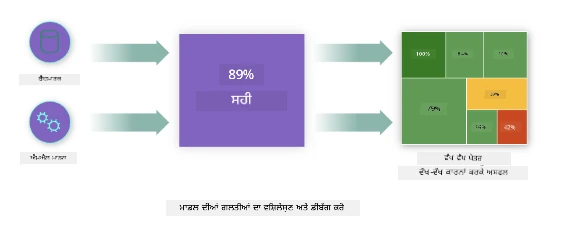
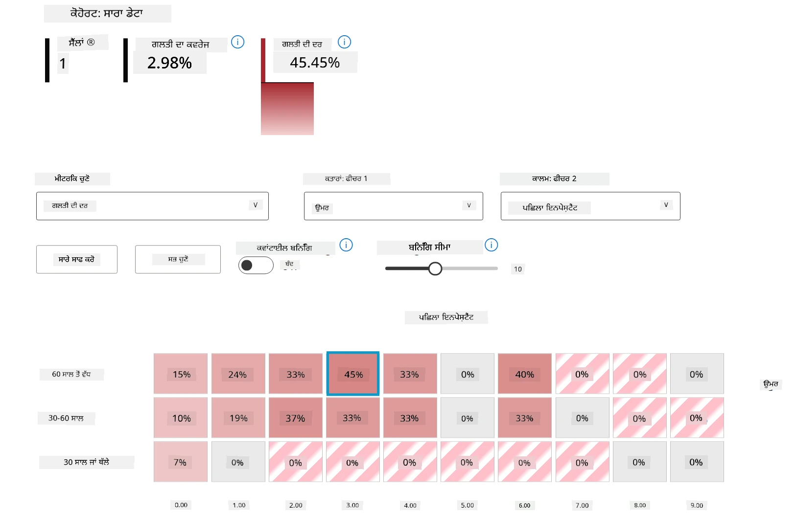
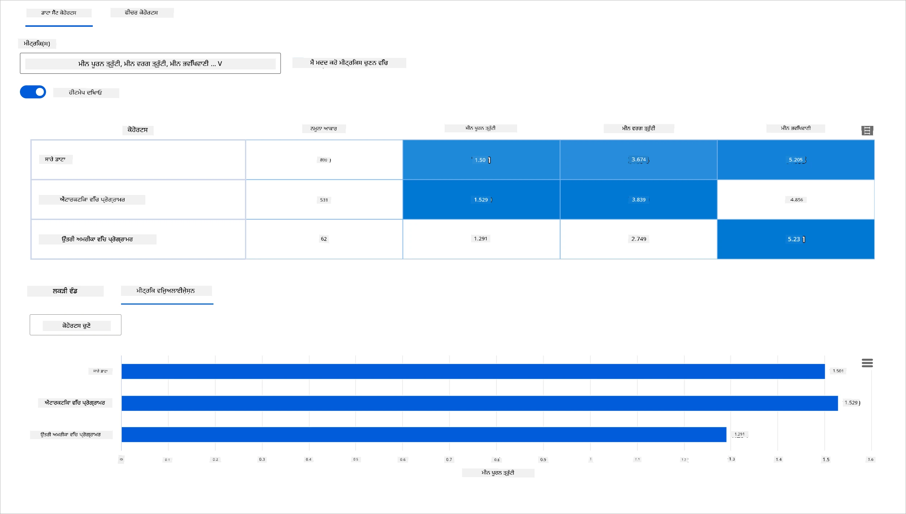
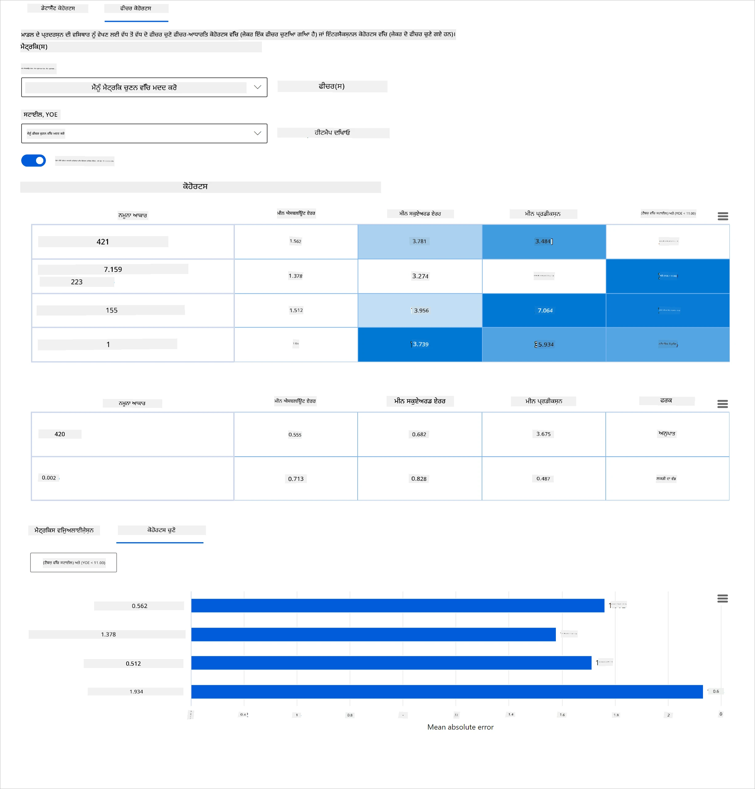
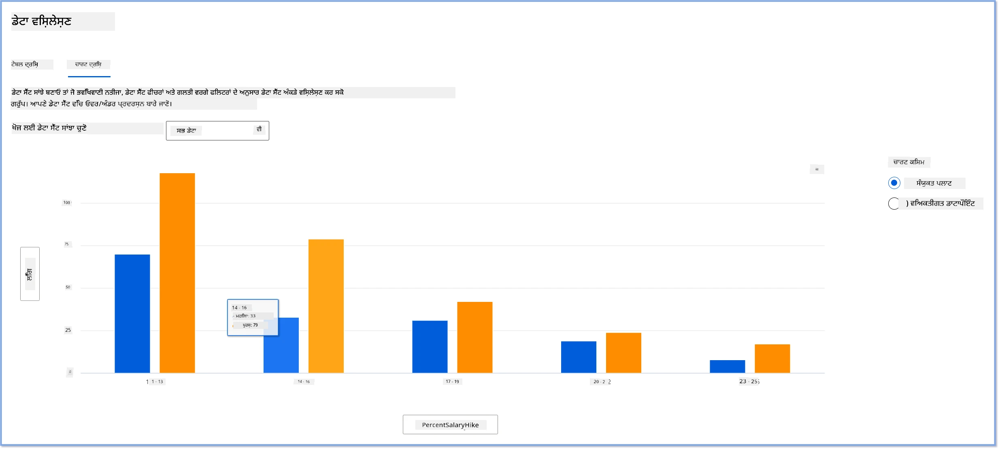
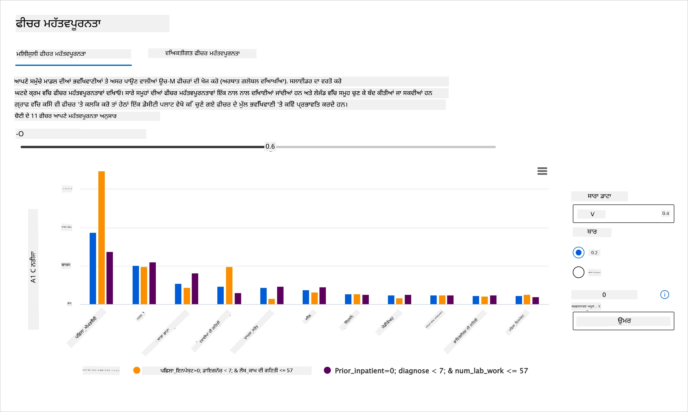
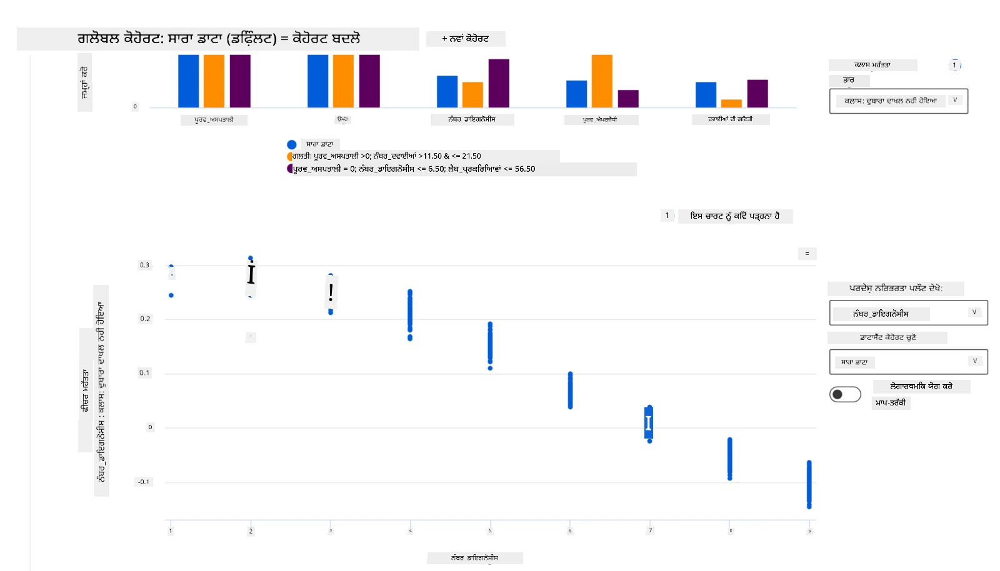

# ਪੋਸਟਸਕ੍ਰਿਪਟ: ਜ਼ਿੰਮੇਵਾਰ AI ਡੈਸ਼ਬੋਰਡ ਕੰਪੋਨੈਂਟਸ ਦੀ ਵਰਤੋਂ ਨਾਲ ਮਸ਼ੀਨ ਲਰਣਿੰਗ ਵਿੱਚ ਮਾਡਲ ਡੀਬੱਗਿੰਗ
 

## [ਪ੍ਰੀ-ਲੈਕਚਰ ਕਵਿਜ਼](https://ff-quizzes.netlify.app/en/ml/)
 
## ਪਰਿਚਯ

ਮਸ਼ੀਨ ਲਰਣਿੰਗ ਸਾਡੇ ਰੋਜ਼ਾਨਾ ਜੀਵਨ ਨੂੰ ਪ੍ਰਭਾਵਿਤ ਕਰਦੀ ਹੈ। AI ਸਾਡੇ ਅਤੇ ਸਾਡੀ ਸਮਾਜ ਨੂੰ ਪ੍ਰਭਾਵਿਤ ਕਰਨ ਵਾਲੀਆਂ ਕੁਝ ਅਹਿਮ ਪ੍ਰਣਾਲੀਆਂ ਵਿੱਚ ਆਪਣੀ ਜਗ੍ਹਾ ਬਣਾਉਂਦਾ ਜਾ ਰਿਹਾ ਹੈ, ਜਿਵੇਂ ਕਿ ਹੈਲਥਕੇਅਰ, ਵਿੱਤ, ਸਿੱਖਿਆ ਅਤੇ ਰੋਜ਼ਗਾਰ। ਉਦਾਹਰਨ ਵਜੋਂ, ਪ੍ਰਣਾਲੀਆਂ ਅਤੇ ਮਾਡਲ ਰੋਜ਼ਾਨਾ ਫੈਸਲੇ ਕਰਨ ਵਾਲੇ ਕੰਮਾਂ ਵਿੱਚ ਸ਼ਾਮਿਲ ਹਨ, ਜਿਵੇਂ ਕਿ ਸਿਹਤ ਸੇਵਾਵਾਂ ਦੀ ਪਹਚਾਣ ਜਾਂ ਧੋਖਾਧੜੀ ਦਾ ਪਤਾ ਲਗਾਉਣਾ। ਇਸ ਲਈ AI ਵਿੱਚ ਤਰੱਕੀ ਅਤੇ ਤੇਜ਼ੀ ਨਾਲ ਗ੍ਰਹਿਣ ਕਰਨ ਦੇ ਨਾਲ, ਸਮਾਜਕ ਉਮੀਦਾਂ ਵਿਕਸਤ ਹੋ ਰਹੀਆਂ ਹਨ ਅਤੇ ਨਿਯਮਕਰਨ ਵੱਧ ਰਹੀ ਹੈ। ਅਸੀਂ ਅਕਸਰ ਦੇਖਦੇ ਹਾਂ ਕਿ AI ਪ੍ਰਣਾਲੀਆਂ ਉਮੀਦਾਂ ‘ਤੇ ਖਰਾ ਨਹੀਂ ਔਤਰੀਆਂ; ਇਹ ਨਵੀਆਂ ਚੁਣੌਤੀਆਂ ਪੇਸ਼ ਕਰਦੀਆਂ ਹਨ ਅਤੇ ਸਰਕਾਰਾਂ AI ਹੱਲਾਂ ਨੂੰ ਨਿਯਮਤ ਕਰਨਾ ਸ਼ੁਰੂ ਕਰ ਰਹੀਆਂ ਹਨ। ਇਸ ਲਈ ਇਹ ਜ਼ਰੂਰੀ ਹੈ ਕਿ ਇਹ ਮਾਡਲ ਪਰਖੇ ਜਾਣ ਤਾ ਕਿ ਹਰ ਕਿਸੇ ਲਈ ਨਿਆਂਸੂਚਕ, ਭਰੋਸੇਯੋਗ, ਸ਼ਾਮਿਲ ਕਰਨ ਵਾਲੇ, ਪਾਰਦਰਸ਼ੀ ਅਤੇ ਜ਼ਿੰਮੇਵਾਰ ਨਤੀਜੇ ਦਿੱਤੇ ਜਾਣ।

ਇਸ ਕੋਰਸ ਵਿੱਚ, ਅਸੀਂ ਇਹ ਦੇਖਾਂਗੇ ਕਿ ਕਿਹੜੇ ਪ੍ਰਯੋਗਕਾਰੀ ਸੰਦ ਵਰਤੇ ਜਾ ਸਕਦੇ ਹਨ ਇਹ ਮੈੱਥੋਂ ਪਤਾ ਲੱਗੇ ਕਿ ਮਾਡਲ ਵਿੱਚ ਜ਼ਿੰਮੇਵਾਰ AI ਸਬੰਧੀ ਸਮੱਸਿਆਵਾਂ ਹਨ ਕਿ ਨਹੀਂ। ਰਵਾਇਤੀ ਮਸ਼ੀਨ ਲਰਣਿੰਗ ਡੀਬੱਗਿੰਗ ਤਕਨੀਕਾਂ ਅਕਸਰ ਮਾਤਰਾਤਮਕ ਗਣਨਾਵਾਂ ‘ਤੇ ਆਧਾਰਿਤ ਹੁੰਦੀਆਂ ਹਨ, ਜਿਵੇਂ ਕਿ ਇਕੱਠੇ ਕੀਤੀ ਗਈ ਸਹੀਤਾ ਜਾਂ ਔਸਤ ਗਲਤੀ ਦਾ ਨੁਕਸਾਨ। ਸੋਚੋ ਜਦੋਂ ਤੁਸੀਂ ਇਹ ਮਾਡਲ ਬਣਾਉਣ ਲਈ ਵਰਤੀ ਜਾ ਰਹੀ ਡੇਟਾ ਵਿੱਚ ਕੁਝ ਡੈਮੋਗ੍ਰਾਫਿਕ ਮਿਸੜੀ ਹੈ, ਜਿਵੇਂ ਕਿ ਨਸਲ, ਲਿੰਗ, ਰਾਜਨੀਤਕ ਦ੍ਰਿਸ਼ਟਿਕੋਣ, ਧਰਮ ਜਾਂ ਅਜਿਹੇ ਡੈਮੋਗ੍ਰਾਫਿਕ ਨੂੰ ਬੇਫ਼ਰਮਾ ਰੂਪ ਵਿੱਚ ਦਰਸਾਉਂਦੀ ਹੈ। ਜਦੋਂ ਮਾਡਲ ਦੇ ਨਤੀਜੇ ਕਿਸੇ ਡੈਮੋਗ੍ਰਾਫਿਕ ਨੂੰ ਪੱਖਪਾਤੀ ਰੂਪ ਵਿੱਚ ਸਮਝੇ ਜਾਂਦੇ ਹਨ? ਇਹ ਸਵੇਂਸਟੀਵ ਫੀਚਰ ਸਮੂਹਾਂ ਦੀ ਓਵਰ ਜਾਂ ਅੰਡਰ ਪ੍ਰਸਤੁਤੀਸ਼ੀਲਤਾ ਨੂੰ ਜਨਮ ਦੇ ਸਕਦਾ ਹੈ ਜਿਹੜਾ ਨਿਆਂਸੂਚਕਤਾ, ਸ਼ਾਮਿਲ ਕਰਨ ਵਾਲੇ ਅਤੇ ਭਰੋਸੇਯੋਗਤਾ ਨਾਲ ਸੰਬੰਧਿਤ ਸਮੱਸਿਆਵਾਂ ਪੈਦਾ ਕਰਦਾ ਹੈ। ਦੂਜਾ ਕਾਰਕ ਇਹ ਹੈ ਕਿ ਮਸ਼ੀਨ ਲਰਣਿੰਗ ਮਾਡਲ ਕਾਲੇ ਡੱਬੇ ਸਮਾਨ ਹਨ, ਜਿਸ ਕਾਰਨ ਇਸ ਨੂੰ ਸਮਝਣਾ ਅਤੇ ਵਿਆਖਿਆ ਕਰਨਾ ਮੁਸ਼ਕਲ ਹੁੰਦਾ ਹੈ ਕਿ ਮਾਡਲ ਦੀ ਭਵਿੱਖਵਾਣੀ ਕਿਵੇਂ ਬਣਦੀ ਹੈ। ਇਹ ਸਾਰੀਆਂ ਚੁਣੌਤੀਆਂ ਡੇਟਾ ਵਿਗਿਆਨੀਆਂ ਅਤੇ AI ਵਿਕਾਸਕਾਰਾਂ ਦੇ ਸਾਹਮਣੇ ਹੁੰਦੀਆਂ ਹਨ ਜਦੋਂ ਉਨ੍ਹਾਂ ਕੋਲ ਮਾਡਲ ਦੀ ਨਿਆਂਸੂਚਕਤਾ ਜਾਂ ਭਰੋਸੇਯੋਗਤਾ ਜाँचਣ ਅਤੇ ਡੀਬੱਗ ਕਰਨ ਲਈ ਢੁਕਵਾਂ ਸੰਦ ਨਹੀਂ ਹੁੰਦੇ।

ਇਸ ਪਾਠ ਵਿੱਚ, ਤੁਸੀਂ ਸਿੱਖੋਗੇ ਕਿ ਕਿਵੇਂ ਆਪਣੇ ਮਾਡਲਾਂ ਨੂੰ ਡੀਬੱਗ ਕਰਨਾ ਹੈ:

-	**ਗਲਤੀ ਵਿਸ਼ਲੇਸ਼ਣ**: ਪਛਾਣ ਕਰੋ ਕਿ ਤੁਹਾਡੇ ਡੇਟਾ ਵੰਡ ਵਿੱਚ ਮਾਡਲ ਕਿੱਥੇ ਜ਼ਿਆਦਾ ਗਲਤੀਆੰ ਕਰ ਰਿਹਾ ਹੈ।
-	**ਮਾਡਲ ਓਵਰਵਿਊ**: ਵੱਖ-ਵੱਖ ਡੇਟਾ ਸਮੂਹਾਂ ਵਿੱਚ ਤੁਲਨਾਤਮਕ ਵਿਸ਼ਲੇਸ਼ਣ ਕਰੋ ਤਾਂ ਜੋ ਮਾਡਲ ਦੇ ਪ੍ਰਦਰਸ਼ਨ ਮੈਟ੍ਰਿਕਸ ਵਿੱਚ ਫਰਕ ਪਤਾ ਲੱਗ ਸਕੇ।
-	**ਡੇਟਾ ਵਿਸ਼ਲੇਸ਼ਣ**: ਜਾਂਚ ਕਰੋ ਕਿ ਤੁਹਾਡੇ ਡੇਟਾ ਵਿੱਚ ਕਿਸੇ ਡੈਮੋਗ੍ਰਾਫਿਕ ਦੀ ਓਵਰ ਜਾਂ ਅੰਡਰ ਪ੍ਰਸਤੁਤੀਸ਼ੀਲਤਾ ਕਿੱਥੇ ਹੈ ਜੋ ਮਾਡਲ ਨੂੰ ਕਿਸੇ ਇਕ ਡੈਮੋਗ੍ਰਾਫਿਕ ਨੂੰ ਪੱਖ ਪਾਸਾ ਦਿਵਾਉਂਦੀ ਹੈ।
-	**ਫੀਚਰ ਮਹੱਤਵ**: ਸਮਝੋ ਕਿ ਕਿਹੜੇ ਫੀਚਰ ਇੱਕ ਗਲੋਬਲ ਜਾਂ ਸਥਾਨਕ ਪੱਧਰ 'ਤੇ ਤੁਹਾਡੇ ਮਾਡਲ ਦੀ ਭਵਿੱਖਵਾਣੀ ਨੂੰ ਚਲਾ ਰਹੇ ਹਨ।

## ਅਗਾਂਹ ਵਧਣ ਦੀ ਲੋੜ

ਅਗਾਂਹ ਵਧਣ ਲਈ, ਕਿਰਪਾ ਕਰਕੇ ਸਮੀਖਿਆ ਕਰੋ [Responsible AI tools for developers](https://www.microsoft.com/ai/ai-lab-responsible-ai-dashboard)

> 

## ਗਲਤੀ ਵਿਸ਼ਲੇਸ਼ਣ

ਮਾਡਲ ਪ੍ਰਦਰਸ਼ਨ ਮੈਟ੍ਰਿਕਸ ਜਿਹੜੇ ਸਹੀਤਾ ਮਾਪਣ ਲਈ ਵਰਤੇ ਜਾਂਦੇ ਹਨ, ਅਕਸਰ ਸਹੀ ਅਤੇ ਗਲਤ ਭਵਿੱਖਵਾਣੀਆਂ ਦੀ ਗਿਣਤੀ ‘ਤੇ ਅਧਾਰਿਤ ਹੁੰਦੇ ਹਨ। ਉਦਾਹਰਨ ਵਜੋਂ, ਜੇ ਮਾਡਲ 89% ਸਮੇਂ ਸਹੀ ਹੋਵੇ ਅਤੇ ਗਲਤੀ ਕੋਸ਼ਿਸ਼ 0.001 ਹੋਵੇ, ਤਾਂ ਇਹ ਵਧੀਆ ਪ੍ਰਦਰਸ਼ਨ ਮੰਨਿਆ ਜਾ ਸਕਦਾ ਹੈ। ਗਲਤੀਆਂ ਆਮ ਤੌਰ ‘ਤੇ ਤੁਹਾਡੇ ਮੂਲ ਡੇਟਾਸੈੱਟ ਵਿੱਚ ਇੱਕਸਾਰ ਵੰਡੀਆਂ ਨਹੀਂ ਹੁੰਦੀਆਂ। ਤੁਸੀਂ 89% ਸਹੀਤਾ ਪ੍ਰਾਪਤ ਕਰ ਸਕਦੇ ਹੋ ਪਰ ਪਤਾ ਲੱਗ ਸਕਦਾ ਹੈ ਕਿ ਕੁਝ ਡੇਟਾ ਖੇਤਰਾਂ ਵਿੱਚ ਮਾਡਲ 42% ਸਮੇਂ ਨਾਕਾਮ ਰਹਿੰਦਾ ਹੈ। ਇਹ ਨਾਕਾਮੀ ਦੇ ਪੈਟਰਨ ਸਬੰਧਤ ਡੇਟਾ ਸਮੂਹਾਂ ਦੇ ਸੰਦਰਭ ਵਿੱਚ ਨਿਆਂਸੂਚਕਤਾ ਜਾਂ ਭਰੋਸੇਯੋਗਤਾ ਦੀਆਂ ਸਮੱਸਿਆਵਾਂ ਪੈਦਾ ਕਰ ਸਕਦੇ ਹਨ। ਇਹ ਅਹਿਮ ਹੈ ਕਿ ਸਮਝਿਆ ਜਾਵੇ ਕਿ ਮਾਡਲ ਕਿਸ ਜਗ੍ਹਾ ਚੰਗਾ ਕਰ ਰਿਹਾ ਹੈ ਅਤੇ ਕਿੱਥੇ ਨਹੀਂ। ਉਹ ਡੇਟਾ ਖੇਤਰ ਜਿੱਥੇ ਮਾਡਲ ਵਿੱਚ ਗਲਤੀਆਂ ਵੱਧ ਹਨ, ਮਹੱਤਵਪੂਰਨ ਡੈਮੋਗ੍ਰਾਫਿਕ ਹੋ ਸਕਦੇ ਹਨ।

RAI ਡੈਸ਼ਬੋਰਡ 'ਤੇ ਗਲਤੀ ਵਿਸ਼ਲੇਸ਼ਣ ਕਾਂਪੋਨੈਂਟ ਦਰਸਾਉਂਦਾ ਹੈ ਕਿ ਕਿਵੇਂ ਮਾਡਲ ਦੀ ਨਾਕਾਮੀ ਵੱਖ-ਵੱਖ ਸਮੂਹਾਂ ਵਿੱਚ ਵੰਡ ਦਿੱਤੀ ਗਈ ਹੈ ਇੱਕ ਟ੍ਰੀ ਵਿਜ਼ੂਅਲਾਈਜ਼ੇਸ਼ਨ ਰਾਹੀਂ। ਇਹ ਉਪਯੋਗੀ ਹੈ ਇਹ ਪਛਾਣਣ ਲਈ ਕਿ ਕਿਹੜੇ ਫੀਚਰ ਜਾਂ ਖੇਤਰਾਂ ਵਿੱਚ ਤੁਹਾਡੇ ਡੇਟਾਸੈੱਟ ਨਾਲ ਉੱਚ ਗਲਤੀ ਦਰ ਹੈ। ਜਦੋਂ ਤੁਸੀਂ ਵੇਖਦੇ ਹੋ ਕਿ ਮਾਡਲ ਦੀਆਂ ਆਮ ਗਲਤੀਆਂ ਕਿੱਥੋਂ ਆ ਰਹੀਆਂ ਹਨ, ਤਾਂ ਤੁਸੀਂ ਮੂਲ ਕਾਰਨ ਦੀ ਜਾਂਚ ਕਰ ਸਕਦੇ ਹੋ। ਤੁਸੀਂ ਡੇਟਾ ਦੇ ਸਮੂਹ ਬਣਾਉਂਦੇ ਹੋਏ ਵਿਸ਼ਲੇਸ਼ਣ ਕਰ ਸਕਦੇ ਹੋ। ਇਹ ਡੇਟਾ ਸਮੂਹ ਡੀਬੱਗਿੰਗ ਪ੍ਰਕਿਰਿਆ ਵਿੱਚ ਮਦਦ ਕਰਦੇ ਹਨ ਕਿ ਕਿਸ ਲਈ ਮਾਡਲ ਇੱਕ ਸਮੂਹ ਵਿੱਚ ਚੰਗਾ ਅਤੇ ਦੂਜੇ ਵਿੱਚ ਗਲਤ ਅਮਲ ਕਰ ਰਿਹਾ ਹੈ।

ਟ੍ਰੀ ਮੈਪ ‘ਤੇ ਵਿਜ਼ੂਅਲ ਇੰਗ੍ਰਾਮ ਮਦਦ ਕਰਦੇ ਹਨ ਸਮੱਸਿਆਵਾਂ ਨੂੰ ਤੁਰੰਤ ਲੱਭਣ ਵਿੱਚ। ਉਦਾਹਰਨ ਵਜੋਂ, ਜਿੰਨੀ ਗਹਿਰੀ ਲਾਲ ਛਾਇਆ ਟ੍ਰੀ ਨੋਡ 'ਤੇ ਹੋਵੇ, ਉਨ੍ਹਾਂ ਵੱਧ ਗਲਤੀ ਦਰ ਦਰਸਾਉਂਦੀ ਹੈ।

ਹੀਟ ਮੈਪ ਇਕ ਹੋਰ ਵਿਜ਼ੂਅਲਾਈਜ਼ੇਸ਼ਨ ਵਰਗਾ ਹੈ ਜੋ ਵਰਤੋਂਕਾਰ ਇੱਕ ਜਾਂ ਦੋ ਫੀਚਰਾਂ ਦੀ ਵਰਤੋਂ ਕਰਕੇ ਪੂਰੇ ਡੇਟਾਸੈੱਟ ਜਾਂ ਸਮੂਹਾਂ ਵਿੱਚ ਮਾਡਲ ਦੀਆਂ ਗਲਤੀਆਂ ਵਿੱਚ ਯੋਗਦਾਨ ਦਾ ਪਤਾ ਕਰ ਸਕਦੇ ਹਨ।

ਜਦ ਤੁਹਾਨੂੰ ਲੋੜ ਹੋਵੇ ਤਾਂ ਗਲਤੀ ਵਿਸ਼ਲੇਸ਼ਣ ਦੀ ਵਰਤੋਂ ਕਰੋ:

* ਮਾਡਲ ਦੀਆਂ ਨਾਕਾਮੀਆਂ ਕਿਵੇਂ ਵੱਖ-ਵੱਖ ਡੇਟਾਸੈੱਟ ਅਤੇ ਫੀਚਰ ਦੀਆਂ ਮਾਪਦੰਡਾਂ ਵਿੱਚ ਵੰਡੀਆਂ ਗਈਆਂ ਹਨ, ਇਸ ਦੀ ਡੂੰਘੀ ਸਮਝ ਪ੍ਰਾਪਤ ਕਰਨ ਲਈ।
* ਕੁੱਲ ਪ੍ਰਦਰਸ਼ਨ ਮੈਟ੍ਰਿਕਸ ਨੂੰ ਇਹਤਿਆਤ ਨਾਲ ਤੋੜ ਕੇ ਸ਼ੁੱਧ ਕੀਤੇ ਸਮੂਹਾਂ ਦੀ ਖੋਜ ਕਰਨ ਲਈ ਜਿਨ੍ਹਾਂ ਵਿੱਚ ਗਲਤੀਆ ਹਨ ਤਾਂ ਕਿ ਨਿਸ਼ਾਨਾ ਬਣਾਈ ਗਈ ਰੋਕਥਾਮ ਦੀ ਕਾਰਵਾਈ ਕੀਤੀ ਜਾ ਸਕੇ।

## ਮਾਡਲ ਓਵਰਵਿਊ

ਮਸ਼ੀਨ ਲਰਣਿੰਗ ਮਾਡਲ ਦੇ ਪ੍ਰਦਰਸ਼ਨ ਦਾ ਮੁਲਾਂਕਣ ਕਰਨਾ ਮਾਡਲ ਦੇ ਵਿਹਾਰ ਦੀ ਸਮਗ੍ਰੀ ਸਮਝ ਪ੍ਰਾਪਤ ਕਰਨ ਦੀ ਮੰਗ ਕਰਦਾ ਹੈ। ਇਹ ਕੀਤਾ ਜਾ ਸਕਦਾ ਹੈ ਵੱਖ-ਵੱਖ ਮੈਟ੍ਰਿਕਸ ਜਿਵੇਂ ਗਲਤੀ ਦਰ, ਸਹੀਤਾ, ਰੀਕਾਲ, ਪ੍ਰੀਸੀਸ਼ਨ, ਜਾਂ MAE (ਮੀਨ ਐਬਸੋਲਿਊਟ ਐਰਰ) ਦੀ ਸਮੀਖਿਆ ਕਰਕੇ ਤਾਕਿ ਵੱਖ-ਵੱਖ ਪ੍ਰਦਰਸ਼ਨ ਦੇ ਮੈਟ੍ਰਿਕਸਾਂ ਵਿੱਚ ਵੱਖਰਾਪਨ ਸਮਝ ਆ ਸਕੇ। ਇੱਕ ਮੈਟ੍ਰਿਕ ਬਹੁਤ ਚੰਗਾ ਲੱਗ ਸਕਦਾ ਹੈ ਪਰ ਕਿਸੇ ਹੋਰ ਮੈਟ੍ਰਿਕ ਵਿੱਚ ਗਲਤੀਆਂ ਸਾਹਮਣੇ ਆ ਸਕਦੀਆਂ ਹਨ। ਨਾਲ ਨਾਲ, ਪੂਰੇ ਡੇਟਾਸੈੱਟ ਜਾਂ ਸਮੂਹਾਂ ਵਿੱਚ ਮੈਟ੍ਰਿਕਸਾਂ ਦੀ ਤੁਲਨਾ ਕਰਕੇ ਇਹ ਪਤਾ ਲੱਗਦਾ ਹੈ ਕਿ ਮਾਡਲ ਕਿੱਥੇ ਚੰਗਾ ਕਰ ਰਿਹਾ ਹੈ ਜਾਂ ਨਹੀਂ। ਇਹ ਵਿਸ਼ੇਸ਼ ਤੌਰ ਤੇ ਅਹੰਮੀਅਤ ਰੱਖਦਾ ਹੈ ਜਦੋਂ ਮਾਡਲ ਦੇ ਪ੍ਰਦਰਸ਼ਨ ਨੂੰ ਸਵੇਂਸਟੀਵ ਅਤੇ ਗੈਰ-ਸਵੇਂਸਟੀਵ ਫੀਚਰਾਂ (ਉਦਾਹਰਨ ਵਜੋਂ, ਮਰੀਜ਼ ਦੀ ਨਸਲ, ਲਿੰਗ ਜਾਂ ਉਮਰ) ਦੇ ਅਧਾਰ ‘ਤੇ ਦੇਖਿਆ ਜਾਵੇ ਤਾਂ सम्भਾਵਿਤ ਅਨਿਆਂਤਾ ਦਾ ਪਤਾ ਲੱਗ ਸਕੇ। ਉਦਾਹਰਨ ਵਜੋਂ, ਜੇ ਮਾਡਲ ਕਿਸੇ ਸਮੂਹ ਵਿੱਚ ਜੋ ਸਵੇਂਸਟੀਵ ਫੀਚਰਾਂ ਰੱਖਦਾ ਹੈ ਜ਼ਿਆਦਾ ਗਲਤ ਪਾਇਆ ਜਾਵੇ ਤਾਂ ਇਹ ਸੰਭਾਵਿਤ ਅਨਿਆਂਤਾ ਦਿਖਾ ਸਕਦਾ ਹੈ ਜੋ ਮਾਡਲ ਵਿੱਚ ਮੌਜੂਦ ਹੋ ਸਕਦੀ ਹੈ।

RAI ਡੈਸ਼ਬੋਰਡ ਦਾ ਮਾਡਲ ਓਵਰਵਿਊ ਕਾਂਪੋਨੈਂਟ ਨਾ ਸਿਰਫ ਮਾਡਲ ਪ੍ਰਦਰਸ਼ਨ ਮੈਟ੍ਰਿਕਸਾਂ ਦੀ ਵਿਸ਼ਲੇਸ਼ਣਾ ਵਿੱਚ ਮਦਦ ਕਰਦਾ ਹੈ, ਸਗੋਂ ਵਰਤੋਂਕਾਰਾਂ ਨੂੰ ਵੱਖ-ਵੱਖ ਸਮੂਹਾਂ ਵਿੱਚ ਮਾਡਲ ਦੇ ਵਿਹਾਰ ਦੀ ਤੁਲਨਾ ਕਰਨ ਦੀ ਸਮਰਥਾ ਵੀ ਦਿੰਦਾ ਹੈ।

ਇਸ ਕਾਂਪੋਨੈਂਟ ਦੀ ਫੀਚਰ-ਅਧਾਰਿਤ ਵਿਸ਼ਲੇਸ਼ਣ ਯੋਗਤਾ ਵਰਤੋਂਕਾਰਾਂ ਨੂੰ ਇੱਕ ਵਿਸ਼ੇਸ਼ ਫੀਚਰ ਦੇ ਅੰਦਰ ਡੇਟਾ ਦੇ ਉਪ-ਸਮੂਹਾਂ ਨੂੰ ਨਿੱਘੜੀ ਪੱਧਰ ‘ਤੇ ਅਸਮਾਨਤਾਵਾਂ ਪਛਾਣਨ ਲਈ ਸੰਕੁਚਿਤ ਕਰਨ ਦੀ ਆਗਿਆ ਦਿੰਦੀ ਹੈ। ਉਦਾਹਰਨ ਲਈ, ਡੈਸ਼ਬੋਰਡ ਵਿੱਚ ਬਿਲਟ ਇੰਟੈਲੀਜੈਂਸ ਹੈ ਜੋ ਵਰਤੋਂਕਾਰ-ਚੁਣੇ ਗਏ ਫੀਚਰ (ਜਿਵੇਂ *"time_in_hospital < 3"* ਜਾਂ *"time_in_hospital >= 7"*) ਲਈ ਆਪਣੇ ਆਪ ਸਮੂਹ ਬਣਾਉਂਦਾ ਹੈ। ਇਹ ਵਰਤੋਂਕਾਰ ਨੂੰ ਵੱਡੇ ਡੇਟਾ ਸਮੂਹ ਤੋਂ ਕਿਸੇ ਨਿਰੀਕਰਨ ਯੋਗ ਫੀਚਰ ਨੂੰ ਇਕਾਂਤ ਕਰਕੇ ਦੇਖਣ ਦੀ ਆਗਿਆ ਦਿੰਦਾ ਹੈ ਕਿ ਉਹ ਮਾਡਲ ਦੇ ਗਲਤ ਨਤੀਜਿਆਂ ਦਾ ਮੁੱਖ ਕਾਰਕ ਹੈ ਕਿ ਨਹੀਂ।

ਮਾਡਲ ਓਵਰਵਿਊ ਕਾਂਪੋਨੈਂਟ ਦੋ ਕਿਸਮਾਂ ਦੇ ਅਸਮਾਨਤਾ ਮੈਟ੍ਰਿਕਸਾਂ ਦੇ ਸਮਰਥਕ ਹੈ:

**ਮਾਡਲ ਪ੍ਰਦਰਸ਼ਨ ਵਿੱਚ ਅਸਮਾਨਤਾ**: ਇਹ ਮੈਟ੍ਰਿਕਸ ਚੁਣੇ ਗਏ ਪ੍ਰਦਰਸ਼ਨ ਮੈਟ੍ਰਿਕਸ ਦੇ ਮੁੱਲਾਂ ਵਿੱਚ ਡੇਟਾ ਦੇ ਉਪ-ਸਮੂਹਾਂ ਵਿਚਕਾਰ ਅੰਤਰ (ਫਰਕ) ਦਾ ਹਿਸਾਬ ਲਗਾਉਂਦੇ ਹਨ। ਕੁਝ ਉਦਾਹਰਨਾਂ ਹਨ:

* ਸਹੀਤਾ ਦਰ ਵਿੱਚ ਅਸਮਾਨਤਾ
* ਗਲਤੀ ਦਰ ਵਿੱਚ ਅਸਮਾਨਤਾ
* ਪ੍ਰੀਸੀਸ਼ਨ ਵਿੱਚ ਅਸਮਾਨਤਾ
* ਰੀਕਾਲ ਵਿੱਚ ਅਸਮਾਨਤਾ
* ਮੀਨ ਐਬਸੋਲਿਊਟ ਐਰਰ (MAE) ਵਿੱਚ ਅਸਮਾਨਤਾ

**ਚੁਣਾਈ ਦਰ ਵਿੱਚ ਅਸਮਾਨਤਾ**: ਇਹ ਮੈਟ੍ਰਿਕ ਭਿੰਨ-ਭਿੰਨ ਸਮੂਹਾਂ ਵਿੱਚ ਚੁਣਾਈ ਦਰ (ਪੱਖਪਾਤੀ ਭਵਿੱਖਵਾਣੀ) ਵਿੱਚ ਅੰਤਰ ਨੂੰ ਦਰਸਾਉਂਦਾ ਹੈ। ਉਦਾਹਰਨ ਲਈ, ਲੋਨ मंजੂਰੀ ਦਰ ਵਿੱਚ ਅਸਮਾਨਤਾ। ਚੁਣਾਈ ਦਰ ਦਾ ਅਰਥ ਹੈ ਹਰ ਵਰਗੀ ਵਿੱਚ ਡੇਟਾ ਪਾਇੰਟਾਂ ਦਾ ਉਹ ਹਿੱਸਾ ਜਿਹੜਾ 1 (ਬਾਈਨਰੀ ਕਲਾਸੀਫਿਕੇਸ਼ਨ ਵਿੱਚ) ਜਾਂ ਪ੍ਰੇਡੀਕਸ਼ਨ ਮੁੱਲਾਂ ਦੀ ਵੰਡ (ਰੇਗ੍ਰੈਸ਼ਨ ਵਿੱਚ) ਦੇ ਤੌਰ ‘ਤੇ ਵਰਗੀਕ੍ਰਿਤ ਕੀਤਾ ਗਿਆ ਹੋਵੇ।

## ਡੇਟਾ ਵਿਸ਼ਲੇਸ਼ਣ

> "ਜੇ ਤੁਸੀਂ ਡੇਟਾ ਨੂੰ ਕਾਫੀ ਦੇਰ ਤਕ ਤਕਲੀਫ਼ ਦਿੰਦੇ ਰਹੋ, ਤਾਂ ਇਹ ਕਿਸੇ ਵੀ ਗੱਲ ਦਾ ਇਜ਼ਹਾਰ ਕਰੇਗਾ" - ਰੋਨਾਲਡ ਕੋਸ

ਇਹ ਬਿਆਨ ਕਾਫੀ ਕਠੋਰ ਸੁਣਾਈ ਦੇਂਦਾ ਹੈ, ਪਰ ਇਹ ਸੱਚ ਹੈ ਕਿ ਡੇਟਾ ਨੂੰ ਕਿਸੇ ਵੀ ਨਤੀਜੇ ਦੇ ਹੱਕ ਵਿੱਚ ਤਬਦੀਲ ਕੀਤਾ ਜਾ ਸਕਦਾ ਹੈ। ਅਜਿਹਾ ਕਈ ਵਾਰੀ ਬਿਨਾਂ ਇਰਾਦੇ ਵੀ ਹੁੰਦਾ ਹੈ। ਮਨੁੱਖੀ ਹੋਣ ਦੇ ਨਾਤੇ ਸਾਡੀ ਆਪਣੀ ਪੱਖਪਾਤੀ ਹੁੰਦੀ ਹੈ ਅਤੇ ਇਹ ਜਾਣਣਾ ਮੁਸ਼ਕਲ ਹੁੰਦਾ ਹੈ ਕਿ ਤੁਹਾਡੇ ਡੇਟਾ ਵਿੱਚ ਪੱਖਪਾਤ ਕਿਵੇਂ ਆ ਰਿਹਾ ਹੈ। AI ਅਤੇ ਮਸ਼ੀਨ ਲਰਣਿੰਗ ਵਿੱਚ ਨਿਆਂਸੂਚਕਤਾ ਬਰਕਾਰ ਰੱਖਣਾ ਇੱਕ ਕਠਿਨ ਚੁਣੌਤੀ ਹੈ। 

ਡੇਟਾ ਰਵਾਇਤੀ ਮਾਡਲ ਪ੍ਰਦਰਸ਼ਨ ਮੈਟ੍ਰਿਕਸ ਲਈ ਇੱਕ ਵੱਡਾ ਅੰਧਕਾਰ ਖੇਤਰ ਹੈ। ਤੁਹਾਡੇ ਕੋਲ ਉੱਚ ਸਹੀਤਾ ਸਕੋਰ ਹੋ ਸਕਦਾ ਹੈ, ਪਰ ਇਹ ਸਦਾਈ ਤੁਹਾਡੇ ਡੇਟਾਸੈੱਟ ਵਿੱਚ ਹੋ ਸਕਣ ਵਾਲੇ ਪੱਖਪਾਤ ਨੂੰ ਦਰਸਾਉਂਦਾ ਨਹੀਂ। ਉਦਾਹਰਨ ਵਜੋਂ, ਜੇਕਰ ਕਰਮਚਾਰੀਆਂ ਦੇ ਡੇਟਾਸੈੱਟ ਵਿੱਚ 27% ਮਹਿਲਾਵਾਂ ਸਾਂਭਣ ਵਾਲੀਆਂ ਪੋਜ਼ੀਸ਼ਨਾਂ ਤੇ ਹਨ ਅਤੇ 73% ਪੁਰਸ਼ ਉਸੇ ਪੱਧਰ ਤੇ ਹਨ, ਤਾਂ ਇਸ ਡੇਟਾ ਤੇ ਤਿਆਰ ਕੀਤਾ ਗਏ ਸੌਫਟਵੇਅਰ ਮਾਡਲ ਵੱਡੇ ਪੱਧਰ ਦੀਆਂ ਨੌਕਰੀਆਂ ਲਈ ਜ਼ਿਆਦਾਤਰ ਪੁਰਸ਼ਾਂ ਨੂੰ ਨਿਸ਼ਾਨਾ ਬਣਾ ਸਕਦਾ ਹੈ। ਇਸ ਵਾਰਗੇ ਡੇਟਾ ਵਿੱਚ ਅਸਮਤੁਲਨ ਮਾਡਲ ਦੇ ਨਤੀਜੇ ਨੂੰ ਇਕ ਲਿੰਗ ਲਈ ਪੱਖਪਾਤੀ ਬਣਾ ਦਿੰਦਾ ਹੈ। ਇਹ ਨਿਆਂਸੂਚਕਤਾ ਦੀ ਸਮੱਸਿਆ ਨੂੰ ਦਰਸਾਉਂਦਾ ਹੈ ਜਿਥੇ AI ਮਾਡਲ ਵਿੱਚ ਲਿੰਗ ਪੱਖਪਾਤ ਹੁੰਦਾ ਹੈ।

RAI ਡੈਸ਼ਬੋਰਡ 'ਤੇ ਡੇਟਾ ਵਿਸ਼ਲੇਸ਼ਣ ਕਾਂਪੋਨੈਂਟ ਮਦਦ ਕਰਦਾ ਹੈ ਇਹ ਪਛਾਣ ਕਰਨ ਵਿੱਚ ਕਿ ਡੇਟਾਸੈੱਟ ਵਿੱਚ ਕਿੱਥੇ ਓਵਰ-ਪ੍ਰਸਤੁਤੀਸ਼ੀਲਤਾ ਅਤੇ ਅੰਡਰ-ਪ੍ਰਸਤੁਤੀਸ਼ੀਲਤਾ ਹਨ। ਇਹ ਵਰਤੋਂਕਾਰਾਂ ਨੂੰ ਗਲਤੀ ਅਤੇ ਨਿਆਂਸੂਚਕਤਾ ਸਮੱਸਿਆਵਾਂ ਦੇ ਮੂਲ ਕਾਰਨ ਦੀ ਜਾਂਚ ਕਰਨ ਵਿੱਚ ਮਦਦ ਕਰਦਾ ਹੈ ਜੋ ਡੇਟਾ ਅਸਮਤੁਲਨ ਜਾਂ ਖਾਸ ਡੇਟਾ ਸਮੂਹ ਦੀ ਘੱਟ ਪ੍ਰਸਤੁਤੀਸ਼ੀਲਤਾ ਕਾਰਨ ਹੁੰਦੀਆਂ ਹਨ। ਇਹ ਵਰਤੋਂਕਾਰਾਂ ਨੂੰ ਇਹ ਸਮਰਥਾ ਦਿੰਦਾ ਹੈ ਕਿ ਉਹ ਭਵਿੱਖਵਾਣੀ ਅਤੇ ਹਕੀਕਤੀ ਨਤੀਜਿਆਂ, ਗਲਤੀ ਸਮੂਹਾਂ ਅਤੇ ਖਾਸ ਫੀਚਰਾਂ ਦੇ ਆਧਾਰ ‘ਤੇ ਡੇਟਾਸੈੱਟ ਦੀ ਗਰਾਫਿਕ ਸਰਵੇਖਣ ਕਰ ਸਕਣ। ਕਈ ਵਾਰੀ ਅੰਡਰ-ਪ੍ਰਸਤੁਤ ਡੇਟਾ ਸਮੂਹ ਪਣ ਇਸ ਗੱਲ ਨੂੰ ਬਤਾਉਂਦਾ ਹੈ ਕਿ ਮਾਡਲ ਸਮਝਦਾਰੀ ਨਾਲ ਨਹੀਂ ਸਿੱਖ ਰਿਹਾ, ਇਸ ਲਈ ਗਲਤੀਆਂ ਵੱਧ ਹਨ। ਡੇਟਾ ਪੱਖਪਾਤ ਵਾਲਾ ਮਾਡਲ ਸਿਰਫ ਨਿਆਂਸੂਚਕਤਾ ਦੀ ਸਮੱਸਿਆ ਨਹੀਂ ਹੈ, ਸਗੋਂ ਦਿਖਾਉਂਦਾ ਹੈ ਕਿ ਮਾਡਲ ਸ਼ਾਮਿਲ ਕਰਨਯੋਗ ਅਤੇ ਭਰੋਸੇਯੋਗ ਨਹੀਂ ਹੈ।

ਜਦ ਤੁਹਾਨੂੰ ਲੋੜ ਹੋਵੇ ਤਦ ਡੇਟਾ ਵਿਸ਼ਲੇਸ਼ਣ ਦੀ ਵਰਤੋਂ ਕਰੋ:

* ਆਪਣੇ ਡੇਟਾ ਸੈੱਟ ਦੇ ਅੰਕੜਿਆਂ ਦੀ ਖੋਜ ਕਰੋ ਵੱਖ-ਵੱਖ ਫਿਲਟਰਾਂ ਦੀ ਚੋਣ ਕਰਕੇ ਤਾਂ ਜੋ ਡੇਟਾ ਨੂੰ ਵੱਖ-ਵੱਖ ਵਿਕਾਸਾਂ ਵਿੱਚ ਵੰਡਿਆ ਜਾ ਸਕੇ (ਜਿਹਨੂੰ ਸਮੂਹ ਵੀ ਕਹਿ ਸਕਦੇ ਹਨ)।
* ਸਮਝੋ ਕਿ ਡੇਟਾ ਸੈੱਟ ਵੱਖ-ਵੱਖ ਸਮੂਹਾਂ ਅਤੇ ਫੀਚਰ ਸਮੂਹਾਂ ਵਿੱਚ ਕਿਵੇਂ ਵੰਡਿਆ ਗਿਆ ਹੈ।
* ਨਿਸ਼ਚਿਤ ਕਰੋ ਕਿ ਨਿਆਂਸੂਚਕਤਾ, ਗਲਤੀ ਵਿਸ਼ਲੇਸ਼ਣ ਅਤੇ ਕਾਰਟੀ (ਜੋ ਹੋਰ ਡੈਸ਼ਬੋਰਡ ਕੰਪੋਨੈਂਟਸ ਤੋਂ ਪ੍ਰਾਪਤ ਹੈ) ਨਾਲ ਸੰਬੰਧਤ ਤੁਹਾਡੇ ਨਤੀਜੇ ਡੇਟਾ ਸੈੱਟ ਦੇ ਵੰਡ ਦਾ ਨਤੀਜਾ ਹਨ ਕਿ ਨਹੀਂ।
* ਇਹ ਫ਼ੈਸਲਾ ਕਰੋ ਕਿ ਕਿਹੜੇ ਖੇਤਰਾਂ ਵਿੱਚ ਜ਼ਿਆਦਾ ਡੇਟਾ ਇਕੱਠਾ ਕਰਨਾ ਚਾਹੀਦਾ ਹੈ ਤਾਂ ਜੋ ਉਹ ਅਸਮਤੁਲਨ ਜਾਂ ਨਿਸ਼ਾਨਾਬੰਦੀ ਗਲਤੀਆਂ ਨੂੰ ਘਟਾ ਸਕੇ।

## ਮਾਡਲ ਬੂਝਣਯੋਗਤਾ

ਮਸ਼ੀਨ ਲਰਣਿੰਗ ਮਾਡਲ ਅਕਸਰ ਕਾਲੇ ਡੱਬਿਆਂ ਵਾਂਗ ਹੁੰਦੇ ਹਨ। ਇਹ ਜਾਣਣਾ ਔਖਾ ਹੁੰਦਾ ਹੈ ਕਿ ਕਿਹੜੇ ਮੁੱਖ ਡੇਟਾ ਫੀਚਰ ਇੱਕ ਮਾਡਲ ਦੀ ਭਵਿੱਖਵਾਣੀ ਨੂੰ ਚਲਾਉਂਦੇ ਹਨ। ਇਹ ਜਰੂਰੀ ਹੈ ਕਿ ਇੱਕ ਮਾਡਲ ਭਵਿੱਖਵਾਣੀ ਕਿਉਂ ਕਰਦਾ ਹੈ, ਇਸ ਬਾਰੇ ਪਾਰਦਰਸ਼ਤਾ ਮਿਲੇ। ਉਦਾਹਰਨ ਵਜੋਂ, ਜੇ ਕੋਈ AI ਪ੍ਰਣਾਲੀ ਭਵਿੱਖਵਾਣੀ ਕਰਦੀ ਹੈ ਕਿ ਇੱਕ ਡਾਇਬਟੀਜ਼ ਮਰੀਜ਼ 30 ਦਿਨਾਂ ਵਿੱਚ ਹਸਪਤਾਲ ਵਾਪਸ ਆ ਸਕਦਾ ਹੈ, ਤਾਂ ਇਸ ਨੂੰ ਸਹਾਇਕ ਡੇਟਾ ਦੇਣਾ ਚਾਹੀਦਾ ਹੈ ਜਿਸ ਨੇ ਇਹ ਭਵਿੱਖਵਾਣੀ ਕਰਵਾਈ। ਇਹ ਸਹਾਇਕ ਡੇਟਾ ਸੂਚਕ ਪਾਰਦਰਸ਼ਤਾ ਲਿਆਉਂਦਾ ਹੈ ਜੋ ਡਾਕਟਰਾਂ ਜਾਂ ਹਸਪਤਾਲਾਂ ਨੂੰ ਬਿਹਤਰ ਫੈਸਲੇ ਕਰਨ ਵਿੱਚ ਮਦਦ ਕਰਦਾ ਹੈ। ਨਾਲ ਹੀ, ਇਹ ਸਮਝਾਉਣਾ ਕਿ ਮਾਡਲ ਨੇ ਕਿਸੇ ਵਿਅਕਤੀਗਤ ਮਰੀਜ਼ ਲਈ ਭਵਿੱਖਵਾਣੀ ਕਿਉਂ ਕੀਤੀ, ਸਿਹਤ ਸੰਬੰਧੀ ਨਿਯਮਾਂ ਨਾਲ ਜ਼ਿੰਮੇਵਾਰੀ ਜੋੜਦਾ ਹੈ। ਜਦੋਂ ਤੁਸੀਂ ਮਸ਼ੀਨ ਲਰਣਿੰਗ ਮਾਡਲਜ਼ ਨੂੰ ਇਸ ਤਰੀਕੇ ਨਾਲ ਵਰਤਦੇ ਹੋ ਜੋ ਲੋਕਾਂ ਦੀ ਜ਼ਿੰਦਗੀ ਨੂੰ ਪ੍ਰਭਾਵਿਤ ਕਰਦੀ ਹੋਵੇ, ਤਾਂ ਇਹ ਬਹੁਤ ਜ਼ਰੂਰੀ ਹੈ ਕਿ ਤੁਸੀਂ ਸਮਝੋ ਅਤੇ ਸਮਝਾਓ ਕਿ ਮਾਡਲ ਦਾ ਵਿਹਾਰ ਕੀ ਚੀਜ਼ ਪ੍ਰਭਾਵਿਤ ਕਰ ਰਹੀ ਹੈ। ਮਾਡਲ ਦੀ ਵਿਆਖਿਆ ਅਤੇ ਬੂਝਣਯੋਗਤਾ ਹੇਠਾਂ ਦਿੱਤੀਆਂ ਸਥਿਤੀਆਂ ਵਿੱਚ ਸਵਾਲਾਂ ਦੇ ਜਵਾਬਾਂ ਵਿੱਚ ਮਦਦ ਕਰਦੀ ਹੈ:

* ਮਾਡਲ ਡੀਬੱਗਿੰਗ: ਮੇਰਾ ਮਾਡਲ ਇਹ ਗਲਤੀ ਕਿਉਂ ਕਰਦਾ ਹੈ? ਮੈਂ ਆਪਣੇ ਮਾਡਲ ਨੂੰ ਕਿਵੇਂ ਸੁਧਾਰ ਕਰ ਸਕਦਾ ਹਾਂ?
* ਮਨੁੱਖ-AI ਸਹਿਯੋਗ: ਮੈਂ ਮਾਡਲ ਦੇ ਫੈਸਲਿਆਂ ਨੂੰ ਕਿਵੇਂ ਸਮਝਾਂ ਅਤੇ ਭਰੋਸਾ ਕਰਾਂ?
* ਨਿਯਮਕ ਅਨੁਕੂਲਤਾ: ਕੀ ਮੇਰਾ ਮਾਡਲ ਕਾਨੂੰਨੀ ਮਿਆਰਾਂ ਨੂੰ ਪੂਰਾ ਕਰਦਾ ਹੈ?

RAI ਡੈਸ਼ਬੋਰਡ ਦਾ ਫੀਚਰ ਮਹੱਤਵ ਕਾਂਪੋਨੈਂਟ ਤੁਹਾਡੇ ਮਾਡਲਾਂ ਨੂੰ ਡੀਬੱਗ ਕਰਨ ਅਤੇ ਸਮਝਣ ਵਿੱਚ ਮਦਦ ਕਰਦਾ ਹੈ ਕਿ ਉਹ ਮਾਡਲ ਭਵਿੱਖਵਾਣੀ ਕਿਵੇਂ ਕਰਦਾ ਹੈ। ਇਹ ਮਸ਼ੀਨ ਲਰਣਿੰਗ ਮਾਹਿਰਾਂ ਅਤੇ ਫੈਸਲਾ-ਲੈਣ ਵਾਲਿਆਂ ਲਈ ਇੱਕ ਲਾਭਦਾਇਕ ਸੰਦ ਹੈ ਜੋ ਮਾਡਲ ਦੇ ਵਿਹਾਰ ਨੂੰ ਪ੍ਰਭਾਵਿਤ ਕਰਨ ਵਾਲੇ ਫੀਚਰਾਂ ਨੂੰ ਸਮਝਾਉਣ ਅਤੇ ਦਿਖਾਉਣ ਵਿੱਚ ਮਦਦ ਕਰਦਾ ਹੈ, ਖਾਸ ਕਰਕੇ ਨਿਯਮਕ ਮਾਨਕਾਂ ਦੀ ਪਾਲਣਾ ਦੇ ਲਈ। ਵਰਤੋਂਕਾਰ ਗਲੋਬਲ ਅਤੇ ਸਥਾਨਕ ਵਿਆਖਿਆਵਾਂ ਨੂੰ ਵੀ ਖੋਜ ਸਕਦੇ ਹਨ, ਜੋ ਇਹ ਪ੍ਰਮਾਣਿਤ ਕਰਦੀਆਂ ਹਨ ਕਿ ਕਿਹੜੇ ਫੀਚਰ ਮਾਡਲ ਦੀ ਭਵਿੱਖਵਾਣੀ ਚਲਾਉਂਦੇ ਹਨ। ਗਲੋਬਲ ਵਿਆਖਿਆਵਾਂ ਉਹ ਸਿਖਰਲੇ ਫੀਚਰ ਹਨ ਜਿਨ੍ਹਾਂ ਨੇ ਮਾਡਲ ਦੀ ਕੁੱਲ ਭਵਿੱਖਵਾਣੀ ਨੂੰ ਪ੍ਰਭਾਵਿਤ ਕੀਤਾ। ਸਥਾਨਕ ਵਿਆਖਿਆਵਾਂ ਦਿਖਾਉਂਦੀਆਂ ਹਨ ਕਿ ਕਿਸੇ ਇਕਲੌਤੇ ਕੇਸ ਲਈ ਮਾਡਲ ਨੇ ਭਵਿੱਖਵਾਣੀ ਕਿਵੇਂ ਕੀਤੀ। ਸਥਾਨਕ ਵਿਆਖਿਆਵਾਂ ਦੀ ਸਮੀਖਿਆ ਕਰਨਾ ਕਿਸੇ ਖਾਸ ਕੇਸ ਨੂੰ ਡੀਬੱਗ ਕਰਨ ਜਾਂ ਆਡਿਟ ਕਰਨ ਵਿੱਚ ਵੀ ਮਦਦ ਕਰਦਾ ਹੈ ਤਾਂ ਜੋ ਸਮਝਿਆ ਜਾ ਸਕੇ ਕਿ ਮਾਡਲ ਨੇ ਸਹੀ ਜਾਂ ਗਲਤ ਭਵਿੱਖਵਾਣੀ ਕਿਉਂ ਕੀਤੀ।

* ਗਲੋਬਲ ਵਿਆਖਿਆਵਾਂ: ਉਦਾਹਰਨ ਲਈ, ਕਿਹੜੇ ਫੀਚਰ ਇੱਕ ਡਾਇਬਟੀਜ਼ ਹਸਪਤਾਲ ਦੀ ਵਾਪਸੀ ਮਾਡਲ ਦੇ ਕੁੱਲ ਵਿਹਾਰ ਨੂੰ ਪ੍ਰਭਾਵਿਤ ਕਰਦੇ ਹਨ?
* ਸਥਾਨਕ ਵਿਆਖਿਆਵਾਂ: ਉਦਾਹਰਨ ਲਈ, ਇੱਕ 60 ਸਾਲ ਤੋਂ ਵੱਧ ਉਮਰ ਵਾਲੇ ਡਾਇਬਟੀਜ਼ ਮਰੀਜ਼ ਜੋ ਪਹਿਲਾਂ ਹਸਪਤਾਲ ਵਿੱਚ ਦਾਖਲ ਸੀ, ਇਹ ਕਿਉਂ ਭਵਿੱਖਵਾਣੀ ਕੀਤੀ ਗਈ ਕਿ ਉਹ 30 ਦਿਨਾਂ ਵਿੱਚ ਹਸਪਤਾਲ ਵਾਪਸ ਜਾਵੇਗਾ ਜਾਂ ਨਹੀਂ?

ਮਾਡਲ ਦੀਆਂ ਵੱਖ-ਵੱਖ ਕੋਹੋਰਟਾਂ ਵਿੱਚ ਪ੍ਰਦਰਸ਼ਨ ਦੀ ਜਾਂਚ ਦੌਰਾਨ, ਫੀਚਰ ਮਹੱਤਵ ਦਿਖਾਉਂਦਾ ਹੈ ਕਿ ਕਿਸ ਪੱਧਰ ‘ਤੇ ਇੱਕ ਫੀਚਰ ਨੇ ਨਤੀਜਿਆਂ ਨੂੰ ਪ੍ਰਭਾਵਿਤ ਕੀਤਾ। ਇਹ ਅਸਮਾਨਤਾਵਾਂ ਨੂੰ ਪ੍ਰਕਟ ਕਰਨ ਵਿੱਚ ਸਹਾਇਕ ਹੈ ਜਦੋਂ ਇੱਕ ਸਮੂਹ ਵਿੱਚ ਫੀਚਰ ਦੇ ਪ੍ਰਭਾਵ ਦਾ ਪੱਧਰ ਮਾਡਲ ਦੀਆਂ ਗਲਤ ਭਵਿੱਖਵਾਣੀਆਂ ਵਾਲੇ ਹੋਵੇ। ਫੀਚਰ ਮਹੱਤਵ ਤੁਹਾਨੂੰ ਦਿਖਾ ਸਕਦਾ ਹੈ ਕਿ ਕਿਸ ਮੂਲ ਵਿੱਚ ਇੱਕ ਫੀਚਰ ਮਾਡਲ ਦੇ ਨਤੀਜੇ ਨੂੰ ਸੁੰਦਰ ਜਾਂ ਨਕਾਰਤਮਕ ਰੂਪ ਵਿੱਚ ਪ੍ਰਭਾਵਿਤ ਕਰਦਾ ਹੈ। ਉਦਾਹਰਨ ਲਈ, ਜੇ ਮਾਡਲ ਨੇ ਗਲਤ ਭਵਿੱਖਵਾਣੀ ਕੀਤੀ ਹੈ, ਤਾਂ ਇਹ ਕਾਂਪੋਨੈਂਟ ਤੁਹਾਨੂੰ ਗਹਿਰਾਈ ਵਿੱਚ ਜਾ ਕੇ ਇਹ ਪਤਾ ਲਗਾਉਣ ਦੀ ਆਗਿਆ ਦਿੰਦਾ ਹੈ ਕਿ ਕਿਹੜੇ ਫੀਚਰ ਜਾਂ ਫੀਚਰ ਮੁੱਲਾਂ ਨੇ ਇਹ ਭਵਿੱਖਵਾਣੀ ਚਲਾਈ। ਇਹ ਪੱਧਰ ਸਿਰਫ ਡੀਬੱਗਿੰਗ ਵਿੱਚ ਨਹੀਂ, ਸਗੋਂ ਪਾਰਦਰਸ਼ਤਾ ਅਤੇ ਜ਼ਿੰਮੇਵਾਰੀ ਲਈ ਵੀ ਲਾਭਦਾਇਕ ਹੈ। ਅੰਤ ਵਿੱਚ, ਕਾਂਪੋਨੈਂਟ ਨਿਆਂਸੂਚਕਤਾ ਦੀਆਂ ਸਮੱਸਿਆਵਾਂ ਦੀ ਪਛਾਣ ਕਰਨ ਵਿੱਚ ਮਦਦ ਕਰ ਸਕਦਾ ਹੈ। ਉਦਾਹਰਨ ਲਈ, ਜੇ ਕਿਸੇ ਸਵੇਂਸਟੀਵ ਫੀਚਰ ਜਿਵੇਂ ਕਿ ਨਸਲ ਜਾਂ ਲਿੰਗ ਦਾ ਬਹੁਤ ਪ੍ਰਭਾਵ ਹੈ ਮਾਡਲ ਦੀ ਭਵਿੱਖਵਾਣੀ ‘ਚ, ਤਾਂ ਇਹ ਮਾਡਲ ਵਿੱਚ ਨਸਲ ਜਾਂ ਲਿੰਗ ਪੱਖਪਾਤ ਦਾ ਸੰਕੇਤ ਹੋ ਸਕਦਾ ਹੈ।

ਜਦੋਂ ਤੁਹਾਨੂੰ ਬੂਝਣਯੋਗਤਾ ਦੀ ਲੋੜ ਹੋਵੇ ਤਾਂ ਇਸਦੀ ਵਰਤੋਂ ਕਰੋ:

* ਇਹ ਨਿਰਣੇ ਕਰੋ ਕਿ ਤੁਹਾਡੇ AI ਸਿਸਟਮ ਦੀਆਂ ਭਵਿੱਖਵਾਣੀਆਂ ਕਿੰਨੀ ਭਰੋਸੇਯੋਗ ਹਨ ਫੀਚਰਾਂ ਨੂੰ ਸਮਝ ਕੇ ਜੋ ਸਭ ਤੋਂ ਜ਼ਿਆਦਾ ਮਹੱਤਵਪੂਰਨ ਹੁੰਦੇ ਹਨ।
* ਆਪਣੇ ਮਾਡਲ ਨੂੰ ਪਹਿਲਾਂ ਸਮਝ ਕੇ ਅਤੇ ਇਹ ਪਛਾਣ ਕੇ ਕਿ ਕੀ ਮਾਡਲ ਸਹੀ ਫੀਚਰਾਂ ਨੂੰ ਵਰਤ ਰਿਹਾ ਹੈ ਜਾਂ ਸਿਰਫ ਗਲਤ ਤਲੁਕਾਤਾਂ ਦੀ ਵਰਤੋਂ ਕਰ ਰਿਹਾ ਹੈ, ਡੀਬੱਗਿੰਗ ਕਰਨਾ ਸ਼ੁਰੂ ਕਰੋ।
* ਸੰਭਾਵਿਤ ਅਨਿਆਂਤਾ ਦੇ ਸਰੋਤ ਖੋਲ੍ਹੋ ਇਹ ਜਾਣ ਕੇ ਕਿ ਕੀ ਮਾਡਲ ਭਵਿੱਖਵਾਣੀਆਂ ਸਵੇਂਸਟੀਵ ਫੀਚਰਾਂ ਉੱਤੇ ਆਧਾਰਿਤ ਕਰ ਰਿਹਾ ਹੈ ਜਾਂ ਉਹਨਾਂ ਨਾਲ ਗਹਿਰਾਈ ਨਾਲ ਜੁੜੇ ਹੋਏ ਫੀਚਰਾਂ ਉੱਤੇ।
* ਆਪਣੇ ਮਾਡਲ ਦੇ ਫੈਸਲਿਆਂ ਵਿੱਚ ਉਪਭੋਗਤਾ ਭਰੋਸਾ ਬਣਾਓ ਸਥਾਨਕ ਵਿਆਖਿਆਵਾਂ ਤਿਆਰ ਕਰਕੇ ਜੋ ਨਤੀਜਿਆਂ ਨੂੰ ਦਰਸਾਉਂਦੀਆਂ ਹਨ।
* AI ਪ੍ਰਣਾਲੀ ਦੀ ਨਿਯਮਕ ਜਾਂਚ ਪੂਰੀ ਕਰੋ ਮਾਡਲਾਂ ਨੂੰ ਮਨਜ਼ੂਰੀ ਦੇਣ ਅਤੇ ਮਨੁੱਖਾਂ ‘ਤੇ ਮਾਡਲ ਫੈਸਲਿਆਂ ਦੇ ਪ੍ਰਭਾਵ ਨੂੰ ਨਿਗਰਾਨੀ ਕਰਨ ਲਈ।

## ਨਤੀਜਾ

ਸਾਰੇ RAI ਡੈਸ਼ਬੋਰਡ ਕੰਪੋਨੈਂਟ ਪ੍ਰਯੋਗਕਾਰੀ ਸੰਦ ਹਨ ਜੋ ਤੁਹਾਨੂੰ ਮਸ਼ੀਨ ਲਰਣਿੰਗ ਮਾਡਲ ਬਣਾਉਣ ਵਿੱਚ ਮਦਦ ਕਰਦੇ ਹਨ ਜੋ ਸਮਾਜ ਲਈ ਘੱਟ ਨੁਕਸਾਨਦਾਇਕ ਅਤੇ ਜ਼ਿਆਦਾ ਭਰੋਸੇਯੋਗ ਹੁੰਦੇ ਹਨ। ਇਹ ਮਨੁੱਖੀ ਹੱਕਾਂ ਦੀ ਰੱਖਿਆ, ਕੁਝ ਸਮੂਹਾਂ ਦਾ ਭੇਦਭਾਵ ਜਾਂ ਜੀਵਨ ਦੇ ਮੌਕੇ ਤੋਂ ਬਾਹਰ ਰੱਖਣ ਅਤੇ ਸਰੀਰਕ ਜਾਂ ਮਨੋਵਿਗਿਆਨਕ ਚੋਟ ਦੇ ਖ਼ਤਰੇ ਨੂੰ ਘਟਾਉਂਦਾ ਹੈ। ਇਹ ਤੁਹਾਡੇ ਮਾਡਲ ਦੇ ਫੈਸਲਿਆਂ ਵਿੱਚ ਭਰੋਸਾ ਬਣਾਉਂਦਾ ਹੈ ਸਥਾਨਕ ਵਿਆਖਿਆਵਾਂ ਤਿਆਰ ਕਰਕੇ ਜੋ ਉਹਨਾਂ ਦੇ ਨਤੀਜੇ ਦਰਸਾਉਂਦੀਆਂ ਹਨ। ਕੁਝ ਸੰਭਾਵਿਤ ਨੁਕਸਾਨ ਇਸ ਤਰ੍ਹਾਂ ਵਰਗੀਕ੍ਰਿਤ ਕੀਤੇ ਜਾ ਸਕਦੇ ਹਨ:

- **ਵੰਡ**, ਜੇ ਲਿੰਗ ਜਾਂ ਨਸਲ ਉਦਾਹਰਨ ਵਜੋਂ ਕਿਸੇ ਹੋਰ ਨਾਲੋਂ ਜ਼ਿਆਦਾ ਪਸੰਦ ਕੀਤਾ ਜਾਵੇ।
- **ਸੇਵਾ ਦੀ ਗੁਣਵੱਤਾ**। ਜੇ ਤੁਸੀਂ ਡੇਟਾ ਇੱਕ ਖਾਸ ਦ੍ਰਿਸ਼ਟਕੋਣ ਲਈ ਸਿਖਾਉਂਦੇ ਹੋ ਪਰ ਹਕੀਕਤ ਕਾਫੀ ਜ਼ਿਆਦਾ ਜਟਿਲ ਹੈ, ਤਾਂ ਇਸ ਨਾਲ ਖਰਾਬ ਪ੍ਰਦਰਸ਼ਨ ਵਾਲੀ ਸੇਵਾ ਹੁੰਦੀ ਹੈ।
- **ਸਟੀਰੀਓਟਾਈਪਿੰਗ**। ਕਿਸੇ ਸਮੂਹ ਨੂੰ ਪਹਿਲਾਂ ਨਿਰਧਾਰਤ ਖਾਸੀਅਤਾਂ ਨਾਲ ਜੋੜਨਾ।

- **ਨਿੰਦਾ**। ਕਿਸੇ ਚੀਜ਼ ਜਾਂ ਕਿਸੇ ਵਿਅਕਤੀ ਦੀ ਨਿਆਂਸੰਗਤ ਤੌਰ 'ਤੇ ਆਲੋਚਨਾ ਕਰਨਾ ਅਤੇ ਲੇਬਲ ਕਰਨਾ।
- **ਅਧਿਕ ਜਾਂ ਘੱਟ ਪ੍ਰਤੀਨਿਧਿਤ੍ਵ**। ਇਸ ਵਿਚਾਰ ਦਾ ਮਤਲਬ ਹੈ ਕਿ ਇੱਕ ਨਿਰਧਾਰਿਤ ਗਰੁੱਪ ਕਿਸੇ ਨਿਰਧਾਰਿਤ ਪੇਸ਼ੇ ਵਿਚ ਨਹੀਂ ਦਿਖਾਈ ਦੇਂਦਾ, ਅਤੇ ਕੋਈ ਵੀ ਸੇਵਾ ਜਾਂ ਫੰਕਸ਼ਨ ਜੋ ਇਸ ਨੂੰ ਬਰਕਰਾਰ ਰੱਖਤਾ ਹੈ, ਉਹ ਨੁਕਸਾਨ ਪਹੁੰਚਾਉਣ ਵਿਚ ਯੋਗਦਾਨ ਪਾ ਰਿਹਾ ਹੈ।

### ਐਜ਼ੂਅਰ RAI ਡੈਸ਼ਬੋਰਡ
 
[ਐਜ਼ੂਅਰ RAI ਡੈਸ਼ਬੋਰਡ](https://learn.microsoft.com/en-us/azure/machine-learning/concept-responsible-ai-dashboard?WT.mc_id=aiml-90525-ruyakubu) ਖੁੱਲ੍ਹੇ ਸ੍ਰੋਤ ਸੰਦਾਂ 'ਤੇ ਬਣਾਇਆ ਗਿਆ ਹੈ ਜੋ ਪ੍ਰਮੁੱਖ ਸ਼ੈੱਧਾਂਤਿਕ ਸਥਾਪਨਾਵਾਂ ਅਤੇ ਸੰਗਠਨਾਂ ਦੁਆਰਾ ਵਿਕਸਿਤ ਕੀਤੇ ਗਏ ਹਨ, ਜਿਸ ਵਿੱਚ ਮਾਇਕਰੋਸੌਫਟ ਵੀ ਸ਼ਾਮਿਲ ਹੈ, ਇਹ ਡੇਟਾ ਵਿਗਿਆਨੀ ਅਤੇ AI ਵਿਕਾਸਕਾਰਾਂ ਲਈ ਮਾਡਲ ਦੇ ਵਿਹਾਰ ਨੂੰ ਵਧੀਆ ਤਰੀਕੇ ਨਾਲ ਸਮਝਣ, ਅਣਚਾਹੀਆਂ ਸਮੱਸਿਆਵਾਂ ਦੀ ਪਹਿਚਾਣ ਅਤੇ ਉਨ੍ਹਾਂ ਨੂੰ ਦੂਰ ਕਰਨ ਵਿੱਚ ਮਦਦਗਾਰ ਹਨ।

- ਵੱਖ-ਵੱਖ ਹਿੱਸਿਆਂ ਨੂੰ ਕਿਵੇਂ ਵਰਤਣਾ ਹੈ, ਇਹ ਜਾਣਨ ਲਈ RAI ਡੈਸ਼ਬੋਰਡ ਦੇ [ਡਾਕਯੂਮੈਂਟਸ](https://learn.microsoft.com/en-us/azure/machine-learning/how-to-responsible-ai-dashboard?WT.mc_id=aiml-90525-ruyakubu) ਨੂੰ ਦੇਖੋ।

- ਐਜ਼ੂਅਰ ਮਸ਼ੀਨ ਲਰਨਿੰਗ ਵਿੱਚ ਹੋਰ ਜ਼ਿੰਮੇਵਾਰ AI ਸਥਿਤੀਆਂ ਦੀ ਡਿਬੱਗਿੰਗ ਲਈ ਕੁਝ RAI ਡੈਸ਼ਬੋਰਡ [ਨਮੂਨਾ ਨੋਟਬੁਕ](https://github.com/Azure/RAI-vNext-Preview/tree/main/examples/notebooks) ਵੇਖੋ। 
  
---
## 🚀 ਚੁਣੌਤੀ 
 
ਪਹਿਲਾਂ ਹੀ ਸੰਖਿਆਤੀ ਜਾਂ ਡੇਟਾ ਪੱਖਪਾਤ ਨੂੰ ਰੋਕਣ ਲਈ, ਸਾਨੂੰ ਇਹ ਕਰਨ ਦੀ ਲੋੜ ਹੈ: 

- ਜਿਹੜੇ ਵਿਅਕਤੀ ਪ੍ਰਣਾਲੀਆਂ 'ਤੇ ਕੰਮ ਕਰ ਰਹੇ ਹਨ, ਉਹਨਾਂ ਵਿੱਚ ਵੱਖ-ਵੱਖ ਪਿਛੋਕੜ ਅਤੇ ਨਜ਼ਰੀਏ ਹੋਣ ਚਾਹੀਦੇ ਹਨ।
- ਅਜਿਹੇ ਡੇਟਾਸੈੱਟ ਵਿੱਚ ਨਿਵੇਸ਼ ਕਰੋ ਜੋ ਸਾਡੇ ਸਮਾਜ ਦੀ ਵੱਖਰਾ ਹਨੇਰੀ ਨੂੰ ਦਰਸਾਉਂਦੇ ਹਨ।
- ਜਦੋਂ ਪੱਖਪਾਤ ਹੁੰਦਾ ਹੈ ਤਾਂ ਉਸ ਦੀ ਪਹਿਚਾਣ ਅਤੇ ਸਹੀ ਕਰਨ ਲਈ ਵਧੀਆ ਤਰੀਕੇ ਵਿਕਸਿਤ ਕਰੋ।

ਅਸਲੀ ਜ਼ਿੰਦਗੀ ਦੀਆਂ ਸਥਿਤੀਆਂ ਬਾਰੇ ਸੋਚੋ ਜਿੱਥੇ ਮਾਡਲ-ਬਿਲਡਿੰਗ ਅਤੇ ਵਰਤੋਂ ਵਿੱਚ ਅਨਿਆਇਤਾ ਸਪਸ਼ਟ ਹੈ। ਹੋਰ ਕਿਹੜੀਆਂ ਚੀਜ਼ਾਂ ਨੂੰ ਅਸੀਂ ਧਿਆਨ ਵਿੱਚ ਰੱਖਣਾ ਚਾਹੀਦਾ ਹੈ?

## [ਪੋਸਟ-ਲੇਕਚਰ ਕਵਿਜ਼](https://ff-quizzes.netlify.app/en/ml/)
## ਸਮੀਖਿਆ ਅਤੇ ਸਵੈ ਅਧਿਐਨ 
 
ਇਸ ਪਾਠ ਵਿੱਚ, ਤੁਸੀਂ ਜ਼ਿੰਮੇਵਾਰ AI ਨੂੰ ਮਸ਼ੀਨ ਲਰਨਿੰਗ ਵਿੱਚ ਸ਼ਾਮਲ ਕਰਨ ਦੇ ਕੁਝ ਵਿਹਾਰਿਕ ਸੰਦ ਸਿੱਖੇ ਹਨ।  

ਇਸ ਵਰਕਸ਼ਾਪ ਨੂੰ ਵੇਖੋ ਤਾਂ ਜੋ ਮੌਜੂਦ ਵਿਸ਼ਿਆਂ ਵਿੱਚ ਹੋਰ ਗਹਿਰਾਈ ਨਾਲ ਜਾਣ ਸਕੋ: 

- ਜ਼ਿੰਮੇਵਾਰ AI ਡੈਸ਼ਬੋਰਡ: ਪ੍ਰਾਕਟਿਸ ਵਿੱਚ RAI ਨੂੰ ਓਪਰੇਸ਼ਨਲ ਬਣਾਉਣ ਲਈ ਇਕੋ ਥਾਂ, ਲੇਖਕ: ਬੇਸਮੀਰਾ ਨੂਸ਼ੀ ਅਤੇ ਮੇਹਰਨੂਸ਼ ਸਮੇਕੀ

> 🎥 ਵੀਡੀਓ ਲਈ ਉੱਤੇ ਦੀ ਚਿੱਤਰ ਤੇ ਕਲਿੱਕ ਕਰੋ: ਜ਼ਿੰਮੇਵਾਰ AI ਡੈਸ਼ਬੋਰਡ: ਪ੍ਰਾਕਟਿਸ ਵਿੱਚ RAI ਨੂੰ ਓਪਰੇਸ਼ਨਲ ਬਣਾਉਣ ਲਈ ਇਕੋ ਥਾਂ, ਲੇਖਕ ਬੇਸਮੀਰਾ ਨੂਸ਼ੀ ਅਤੇ ਮੇਹਰਨੂਸ਼ ਸਮੇਕੀ
 
ਹੇਠਾਂ ਦਿੱਤੇ ਸਮੱਗਰੀ ਨੂੰ ਸੰਦਰਭ ਲਓ ਤਾਂ ਜੋ ਜ਼ਿੰਮੇਵਾਰ AI ਬਾਰੇ ਹੋਰ ਜਾਣੋ ਅਤੇ ਕਿਸ ਤਰ੍ਹਾਂ ਹੋਰ ਭਰੋਸੇਮੰਦ ਮਾਡਲ ਬਣਾਏ ਜਾਣ:

- ਮਾਇਕਰੋਸੌਫਟ ਦੇ RAI ਡੈਸ਼ਬੋਰਡ ਸੰਦ ਮਸ਼ੀਨ ਲਰਨਿੰਗ ਮਾਡਲਾਂ ਦੀ ਡਿਬੱਗਿੰਗ ਲਈ: [ਜ਼ਿੰਮੇਵਾਰ AI ਸੰਦ ਸਰੋਤ](https://aka.ms/rai-dashboard)

- ਜ਼ਿੰਮੇਵਾਰ AI ਟੂਲਕਿਟ ਜਾਚੋ: [ਗਿਟਹੱਬ](https://github.com/microsoft/responsible-ai-toolbox)

- ਮਾਇਕਰੋਸੌਫਟ ਦਾ RAI ਸ੍ਰੋਤ ਕੇਂਦਰ: [ਜ਼ਿੰਮੇਵਾਰ AI ਸਰੋਤ – ਮਾਇਕਰੋਸੌਫਟ AI](https://www.microsoft.com/ai/responsible-ai-resources?activetab=pivot1%3aprimaryr4) 

- ਮਾਇਕਰੋਸੌਫਟ ਦੀ FATE ਰਿਸਰਚ ਟੀਮ: [FATE: ਨਿਆਂਸੰਗਤਾ, ਜਵਾਬਦੇਹੀ, ਪਾਰਦਰਸ਼ਤਾ ਅਤੇ ਨੈਤਿਕਤਾ AI ਵਿੱਚ - ਮਾਇਕਰੋਸੌਫਟ ਖੋਜ](https://www.microsoft.com/research/theme/fate/) 

## ਅਸਾਈਨਮੈਂਟ

[RAI ਡੈਸ਼ਬੋਰਡ ਖੋਜੋ](assignment.md)

---

<!-- CO-OP TRANSLATOR DISCLAIMER START -->
**ਅਸਵੀਕਾਰੋਪਣ**:
ਇਸ ਦਸਤਾਵੇਜ਼ ਦਾ ਅਨੁਵਾਦ ਏਆਈ ਅਨੁਵਾਦ ਸੇਵਾ [Co-op Translator](https://github.com/Azure/co-op-translator) ਦੀ ਵਰਤੋਂ ਕਰਕੇ ਕੀਤਾ ਗਿਆ ਹੈ। ਜਦੋਂ ਕਿ ਅਸੀਂ ਸਹੀਤਾਵਾਂ ਲਈ ਯਤਨਸ਼ੀਲ ਹਾਂ, ਕਿਰਪਾ ਕਰਕੇ ਧਿਆਨ ਰੱਖੋ ਕਿ ਸਵੈਚਾਲਿਤ ਅਨੁਵਾਦਾਂ ਵਿੱਚ ਗਲਤੀਆਂ ਜਾਂ ਅਸਮੱਤਿਆਵਾਂ ਹੋ ਸਕਦੀਆਂ ਹਨ। ਮੂਲ ਦਸਤਾਵੇਜ਼ ਆਪਣੀ ਮੂਲ ਭਾਸ਼ਾ ਵਿੱਚ ਅਧਿਕਾਰਕ ਸਰੋਤ ਮੰਨਿਆ ਜਾਣਾ ਚਾਹੀਦਾ ਹੈ। ਜਰੂਰੀ ਜਾਣਕਾਰੀ ਲਈ, ਪੇਸ਼ੇਵਰ ਮਨੁੱਖੀ ਅਨੁਵਾਦ ਦੀ ਸਿਫ਼ਾਰਸ਼ ਕੀਤੀ ਜਾਂਦੀ ਹੈ। ਅਸੀਂ ਇਸ ਅਨੁਵਾਦ ਦੇ ਉਪਯੋਗ ਤੋਂ ਪੈਦਾ ਹੋਣ ਵਾਲੀਆਂ ਕਿਸੇ ਵੀ ਗਲਤਫਹਿਮੀਆਂ ਜਾਂ ਗਲਤ ਵਿਆਖਿਆਵਾਂ ਲਈ ਜਵਾਬਦੇਹ ਨਹੀਂ ਹਾਂ।
<!-- CO-OP TRANSLATOR DISCLAIMER END -->