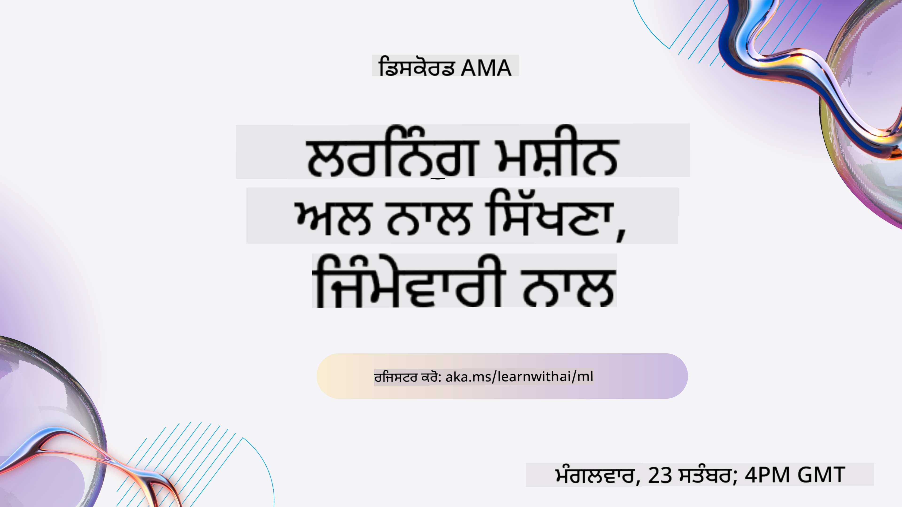
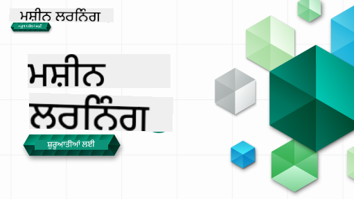

<!--
CO_OP_TRANSLATOR_METADATA:
{
  "original_hash": "7a13afb3674838f557d61f8d67e4d5f8",
  "translation_date": "2025-10-24T09:04:02+00:00",
  "source_file": "README.md",
  "language_code": "pa"
}
-->

### 🌐 ਬਹੁ-ਭਾਸ਼ਾ ਸਹਾਇਤਾ

#### GitHub Action ਰਾਹੀਂ ਸਹਾਇਤਾ ਪ੍ਰਾਪਤ (ਆਟੋਮੈਟਿਕ ਅਤੇ ਹਮੇਸ਼ਾ ਅਪ-ਟੂ-ਡੇਟ)

<!-- CO-OP TRANSLATOR LANGUAGES TABLE START -->
[ਅਰਬੀ](../ar/README.md) | [ਬੰਗਾਲੀ](../bn/README.md) | [ਬੁਲਗਾਰੀਆਈ](../bg/README.md) | [ਬਰਮੀ (ਮਿਆਂਮਾਰ)](../my/README.md) | [ਚੀਨੀ (ਸਰਲ)](../zh/README.md) | [ਚੀਨੀ (ਪ੍ਰੰਪਰਾਗਤ, ਹਾਂਗ ਕਾਂਗ)](../hk/README.md) | [ਚੀਨੀ (ਪ੍ਰੰਪਰਾਗਤ, ਮਕਾਉ)](../mo/README.md) | [ਚੀਨੀ (ਪ੍ਰੰਪਰਾਗਤ, ਤਾਈਵਾਨ)](../tw/README.md) | [ਕਰੋਏਸ਼ੀਆਈ](../hr/README.md) | [ਚੈਕ](../cs/README.md) | [ਡੈਨਿਸ਼](../da/README.md) | [ਡੱਚ](../nl/README.md) | [ਐਸਟੋਨੀਆਈ](../et/README.md) | [ਫਿਨਿਸ਼](../fi/README.md) | [ਫਰਾਂਸੀਸੀ](../fr/README.md) | [ਜਰਮਨ](../de/README.md) | [ਗ੍ਰੀਕ](../el/README.md) | [ਹਿਬਰੂ](../he/README.md) | [ਹਿੰਦੀ](../hi/README.md) | [ਹੰਗਰੀਆਈ](../hu/README.md) | [ਇੰਡੋਨੇਸ਼ੀਆਈ](../id/README.md) | [ਇਟਾਲੀਅਨ](../it/README.md) | [ਜਾਪਾਨੀ](../ja/README.md) | [ਕੋਰੀਆਈ](../ko/README.md) | [ਲਿਥੂਆਨੀਆਈ](../lt/README.md) | [ਮਲੇ](../ms/README.md) | [ਮਰਾਠੀ](../mr/README.md) | [ਨੇਪਾਲੀ](../ne/README.md) | [ਨਾਰਵੇਜੀਅਨ](../no/README.md) | [ਫਾਰਸੀ (ਪਾਰਸੀ)](../fa/README.md) | [ਪੋਲਿਸ਼](../pl/README.md) | [ਪੁਰਤਗਾਲੀ (ਬ੍ਰਾਜ਼ੀਲ)](../br/README.md) | [ਪੁਰਤਗਾਲੀ (ਪੁਰਤਗਾਲ)](../pt/README.md) | [ਪੰਜਾਬੀ (ਗੁਰਮੁਖੀ)](./README.md) | [ਰੋਮਾਨੀਆਈ](../ro/README.md) | [ਰੂਸੀ](../ru/README.md) | [ਸਰਬੀਆਈ (ਸਿਰਿਲਿਕ)](../sr/README.md) | [ਸਲੋਵਾਕ](../sk/README.md) | [ਸਲੋਵੇਨੀਆਈ](../sl/README.md) | [ਸਪੇਨੀ](../es/README.md) | [ਸਵਾਹਿਲੀ](../sw/README.md) | [ਸਵੀਡਿਸ਼](../sv/README.md) | [ਟੈਗਾਲੋਗ (ਫਿਲੀਪੀਨੋ)](../tl/README.md) | [ਤਮਿਲ](../ta/README.md) | [ਥਾਈ](../th/README.md) | [ਤੁਰਕੀ](../tr/README.md) | [ਯੂਕਰੇਨੀ](../uk/README.md) | [ਉਰਦੂ](../ur/README.md) | [ਵਿਅਤਨਾਮੀ](../vi/README.md)
<!-- CO-OP TRANSLATOR LANGUAGES TABLE END -->

#### ਸਾਡੇ ਸਮੁਦਾਇ ਵਿੱਚ ਸ਼ਾਮਲ ਹੋਵੋ

ਅਸੀਂ ਇੱਕ Discord 'Learn with AI' ਸੀਰੀਜ਼ ਚਲਾ ਰਹੇ ਹਾਂ। ਹੋਰ ਜਾਣਕਾਰੀ ਲਈ ਅਤੇ ਸਾਡੇ ਨਾਲ 18 - 30 ਸਤੰਬਰ, 2025 ਨੂੰ [Learn with AI Series](https://aka.ms/learnwithai/discord) 'ਤੇ ਸ਼ਾਮਲ ਹੋਵੋ। ਤੁਸੀਂ GitHub Copilot ਨੂੰ ਡਾਟਾ ਸਾਇੰਸ ਲਈ ਵਰਤਣ ਦੇ ਟਿਪਸ ਅਤੇ ਟ੍ਰਿਕਸ ਸਿੱਖੋਗੇ।

# ਸ਼ੁਰੂਆਤੀ ਲਈ ਮਸ਼ੀਨ ਲਰਨਿੰਗ - ਇੱਕ ਪਾਠਕ੍ਰਮ

> 🌍 ਦੁਨੀਆ ਦੇ ਸੱਭਿਆਚਾਰਾਂ ਰਾਹੀਂ ਮਸ਼ੀਨ ਲਰਨਿੰਗ ਦੀ ਖੋਜ ਕਰਦੇ ਹੋਏ ਦੁਨੀਆ ਦਾ ਦੌਰਾ ਕਰੋ 🌍

Microsoft ਦੇ Cloud Advocates ਤੁਹਾਨੂੰ **ਮਸ਼ੀਨ ਲਰਨਿੰਗ** ਬਾਰੇ 12 ਹਫ਼ਤਿਆਂ, 26 ਪਾਠਾਂ ਦਾ ਪਾਠਕ੍ਰਮ ਪੇਸ਼ ਕਰਨ ਵਿੱਚ ਖੁਸ਼ ਹਨ। ਇਸ ਪਾਠਕ੍ਰਮ ਵਿੱਚ, ਤੁਸੀਂ **ਕਲਾਸਿਕ ਮਸ਼ੀਨ ਲਰਨਿੰਗ** ਬਾਰੇ ਸਿੱਖੋਗੇ, ਮੁੱਖ ਤੌਰ 'ਤੇ Scikit-learn ਨੂੰ ਇੱਕ ਲਾਇਬ੍ਰੇਰੀ ਵਜੋਂ ਵਰਤਦੇ ਹੋਏ ਅਤੇ ਡੀਪ ਲਰਨਿੰਗ ਤੋਂ ਬਚਦੇ ਹੋਏ, ਜੋ ਸਾਡੇ [AI for Beginners' curriculum](https://aka.ms/ai4beginners) ਵਿੱਚ ਕਵਰ ਕੀਤਾ ਗਿਆ ਹੈ। ਇਸ ਪਾਠਕ੍ਰਮ ਨੂੰ ਸਾਡੇ ['Data Science for Beginners' curriculum](https://aka.ms/ds4beginners) ਨਾਲ ਜੋੜੋ!

ਸਾਡੇ ਨਾਲ ਦੁਨੀਆ ਦੇ ਵੱਖ-ਵੱਖ ਖੇਤਰਾਂ ਦੇ ਡਾਟਾ 'ਤੇ ਇਹ ਕਲਾਸਿਕ ਤਕਨੀਕਾਂ ਲਾਗੂ ਕਰਦੇ ਹੋਏ ਯਾਤਰਾ ਕਰੋ। ਹਰ ਪਾਠ ਵਿੱਚ ਪਾਠ ਤੋਂ ਪਹਿਲਾਂ ਅਤੇ ਬਾਅਦ ਦੇ ਕਵਿਜ਼, ਪਾਠ ਪੂਰਾ ਕਰਨ ਲਈ ਲਿਖਤ ਨਿਰਦੇਸ਼, ਇੱਕ ਹੱਲ, ਇੱਕ ਅਸਾਈਨਮੈਂਟ, ਅਤੇ ਹੋਰ ਬਹੁਤ ਕੁਝ ਸ਼ਾਮਲ ਹੈ। ਸਾਡੇ ਪ੍ਰੋਜੈਕਟ-ਅਧਾਰਿਤ ਪੈਡਾਗੌਜੀ ਤੁਹਾਨੂੰ ਸਿੱਖਣ ਦੇ ਦੌਰਾਨ ਬਣਾਉਣ ਦੀ ਆਗਿਆ ਦਿੰਦੀ ਹੈ, ਜੋ ਨਵੀਆਂ ਕੌਸ਼ਲਾਂ ਨੂੰ 'ਚਿਪਕਾਉਣ' ਦਾ ਸਾਬਤ ਤਰੀਕਾ ਹੈ।

**✍️ ਸਾਡੇ ਲੇਖਕਾਂ ਨੂੰ ਦਿਲੋਂ ਧੰਨਵਾਦ** Jen Looper, Stephen Howell, Francesca Lazzeri, Tomomi Imura, Cassie Breviu, Dmitry Soshnikov, Chris Noring, Anirban Mukherjee, Ornella Altunyan, Ruth Yakubu ਅਤੇ Amy Boyd

**🎨 ਸਾਡੇ ਚਿੱਤਰਕਾਰਾਂ ਨੂੰ ਵੀ ਧੰਨਵਾਦ** Tomomi Imura, Dasani Madipalli, ਅਤੇ Jen Looper

**🙏 ਵਿਸ਼ੇਸ਼ ਧੰਨਵਾਦ 🙏 ਸਾਡੇ Microsoft Student Ambassador ਲੇਖਕਾਂ, ਸਮੀਖਾਕਾਰਾਂ, ਅਤੇ ਸਮੱਗਰੀ ਯੋਗਦਾਨਕਰਤਾਵਾਂ ਨੂੰ**, ਖਾਸ ਤੌਰ 'ਤੇ Rishit Dagli, Muhammad Sakib Khan Inan, Rohan Raj, Alexandru Petrescu, Abhishek Jaiswal, Nawrin Tabassum, Ioan Samuila, ਅਤੇ Snigdha Agarwal

**🤩 ਵਾਧੂ ਧੰਨਵਾਦ Microsoft Student Ambassadors Eric Wanjau, Jasleen Sondhi, ਅਤੇ Vidushi Gupta ਨੂੰ ਸਾਡੇ R ਪਾਠਾਂ ਲਈ!**

# ਸ਼ੁਰੂਆਤ ਕਰਨਾ

ਇਹ ਕਦਮ ਅਨੁਸਰਣ ਕਰੋ:
1. **Repository ਨੂੰ Fork ਕਰੋ**: ਇਸ ਪੇਜ ਦੇ ਸਿਖਰ-ਦਾਖਣੇ 'Fork' ਬਟਨ 'ਤੇ ਕਲਿਕ ਕਰੋ।
2. **Repository ਨੂੰ Clone ਕਰੋ**:   `git clone https://github.com/microsoft/ML-For-Beginners.git`

> [ਇਸ ਕੋਰਸ ਲਈ ਸਾਰੇ ਵਾਧੂ ਸਰੋਤ Microsoft Learn ਕਲੈਕਸ਼ਨ ਵਿੱਚ ਲੱਭੋ](https://learn.microsoft.com/en-us/collections/qrqzamz1nn2wx3?WT.mc_id=academic-77952-bethanycheum)

> 🔧 **ਮਦਦ ਦੀ ਲੋੜ ਹੈ?** ਸਾਡੇ [Troubleshooting Guide](TROUBLESHOOTING.md) ਵਿੱਚ ਇੰਸਟਾਲੇਸ਼ਨ, ਸੈਟਅਪ, ਅਤੇ ਪਾਠਾਂ ਚਲਾਉਣ ਨਾਲ ਸੰਬੰਧਿਤ ਆਮ ਸਮੱਸਿਆਵਾਂ ਲਈ ਹੱਲ ਲੱਭੋ।

**[ਵਿਦਿਆਰਥੀ](https://aka.ms/student-page)**, ਇਸ ਪਾਠਕ੍ਰਮ ਨੂੰ ਵਰਤਣ ਲਈ, ਪੂਰੇ ਰਿਪੋ ਨੂੰ ਆਪਣੇ GitHub ਖਾਤੇ ਵਿੱਚ Fork ਕਰੋ ਅਤੇ ਅਪਣੇ ਆਪ ਜਾਂ ਇੱਕ ਸਮੂਹ ਨਾਲ ਅਭਿਆਸ ਪੂਰਾ ਕਰੋ:

- ਪਾਠ ਤੋਂ ਪਹਿਲਾਂ ਕਵਿਜ਼ ਨਾਲ ਸ਼ੁਰੂ ਕਰੋ।
- ਪਾਠ ਪੜ੍ਹੋ ਅਤੇ ਗਤੀਵਿਧੀਆਂ ਪੂਰੀਆਂ ਕਰੋ, ਹਰ ਗਿਆਨ ਜਾਂਚ 'ਤੇ ਰੁਕਦੇ ਅਤੇ ਵਿਚਾਰ ਕਰਦੇ ਹੋਏ।
- ਪਾਠਾਂ ਨੂੰ ਸਮਝ ਕੇ ਪ੍ਰੋਜੈਕਟ ਬਣਾਉਣ ਦੀ ਕੋਸ਼ਿਸ਼ ਕਰੋ ਨਾ ਕਿ ਹੱਲ ਕੋਡ ਚਲਾਉਣ ਦੀ; ਹਾਲਾਂਕਿ ਉਹ ਕੋਡ ਹਰ ਪ੍ਰੋਜੈਕਟ-ਅਧਾਰਿਤ ਪਾਠ ਵਿੱਚ `/solution` ਫੋਲਡਰ ਵਿੱਚ ਉਪਲਬਧ ਹੈ।
- ਪਾਠ ਤੋਂ ਬਾਅਦ ਕਵਿਜ਼ ਲਵੋ।
- ਚੁਣੌਤੀ ਪੂਰੀ ਕਰੋ।
- ਅਸਾਈਨਮੈਂਟ ਪੂਰੀ ਕਰੋ।
- ਪਾਠ ਸਮੂਹ ਪੂਰਾ ਕਰਨ ਤੋਂ ਬਾਅਦ, [Discussion Board](https://github.com/microsoft/ML-For-Beginners/discussions) 'ਤੇ ਜਾਓ ਅਤੇ "ਜਾਣਕਾਰੀ ਸਾਂਝੀ ਕਰੋ" ਦੁਆਰਾ ਉਚਿਤ PAT ਰੂਬ੍ਰਿਕ ਭਰੋ। 'PAT' ਇੱਕ ਪ੍ਰਗਤੀ ਮੁਲਾਂਕਣ ਸੰਦ ਹੈ ਜੋ ਇੱਕ ਰੂਬ੍ਰਿਕ ਹੈ ਜਿਸ ਨੂੰ ਤੁਸੀਂ ਆਪਣੇ ਸਿੱਖਣ ਨੂੰ ਹੋਰ ਅੱਗੇ ਵਧਾਉਣ ਲਈ ਭਰਦੇ ਹੋ। ਤੁਸੀਂ ਹੋਰ PATs 'ਤੇ ਪ੍ਰਤੀਕਿਰਿਆ ਵੀ ਦੇ ਸਕਦੇ ਹੋ ਤਾਂ ਕਿ ਅਸੀਂ ਇਕੱਠੇ ਸਿੱਖ ਸਕੀਏ।

> ਹੋਰ ਅਧਿਐਨ ਲਈ, ਅਸੀਂ ਇਹ [Microsoft Learn](https://docs.microsoft.com/en-us/users/jenlooper-2911/collections/k7o7tg1gp306q4?WT.mc_id=academic-77952-leestott) ਮੋਡਿਊਲ ਅਤੇ ਸਿੱਖਣ ਦੇ ਰਾਹਾਂ ਦੀ ਪਾਲਣਾ ਕਰਨ ਦੀ ਸਿਫਾਰਸ਼ ਕਰਦੇ ਹਾਂ।

**ਅਧਿਆਪਕ**, ਅਸੀਂ [ਇਸ ਪਾਠਕ੍ਰਮ ਨੂੰ ਵਰਤਣ ਲਈ ਕੁਝ ਸੁਝਾਅ](for-teachers.md) ਸ਼ਾਮਲ ਕੀਤੇ ਹਨ।

---

## ਵੀਡੀਓ ਵਾਕਥਰੂ

ਕੁਝ ਪਾਠ ਛੋਟੇ ਰੂਪ ਵਿੱਚ ਵੀਡੀਓ ਵਜੋਂ ਉਪਲਬਧ ਹਨ। ਤੁਸੀਂ ਇਹ ਸਾਰੇ ਪਾਠਾਂ ਵਿੱਚ ਲਾਈਨ ਵਿੱਚ ਲੱਭ ਸਕਦੇ ਹੋ, ਜਾਂ [Microsoft Developer YouTube channel](https://aka.ms/ml-beginners-videos) 'ਤੇ ML for Beginners ਪਲੇਲਿਸਟ 'ਤੇ ਕਲਿਕ ਕਰਕੇ ਹੇਠਾਂ ਦਿੱਤੇ ਚਿੱਤਰ 'ਤੇ ਲੱਭ ਸਕਦੇ ਹੋ।

---

## ਟੀਮ ਨਾਲ ਮਿਲੋ

**Gif by** [Mohit Jaisal](https://linkedin.com/in/mohitjaisal)

> 🎥 ਉਪਰੋਕਤ ਚਿੱਤਰ 'ਤੇ ਕਲਿਕ ਕਰੋ ਪ੍ਰੋਜੈਕਟ ਅਤੇ ਇਸ ਨੂੰ ਬਣਾਉਣ ਵਾਲੇ ਲੋਕਾਂ ਬਾਰੇ ਵੀਡੀਓ ਲਈ!

---

## ਪੈਡਾਗੌਜੀ

ਅਸੀਂ ਇਸ ਪਾਠਕ੍ਰਮ ਨੂੰ ਬਣਾਉਣ ਦੌਰਾਨ ਦੋ ਪੈਡਾਗੌਜੀਕਲ ਸਿਧਾਂਤਾਂ ਨੂੰ ਚੁਣਿਆ ਹੈ: ਇਹ ਯਕੀਨੀ ਬਣਾਉਣਾ ਕਿ ਇਹ ਹੱਥ-ਅਧਾਰਿਤ **ਪ੍ਰੋਜੈਕਟ-ਅਧਾਰਿਤ** ਹੈ ਅਤੇ ਇਹ **ਅਕਸਰ ਕਵਿਜ਼** ਸ਼ਾਮਲ ਕਰਦਾ ਹੈ। ਇਸ ਤੋਂ ਇਲਾਵਾ, ਇਸ ਪਾਠਕ੍ਰਮ ਵਿੱਚ ਇੱਕ ਸਾਂਝੀ **ਥੀਮ** ਹੈ ਜੋ ਇਸ ਨੂੰ ਇਕੱਠਾ ਰੱਖਦੀ ਹੈ।

ਸੁਨਿਸ਼ਚਿਤ ਕਰਕੇ ਕਿ ਸਮੱਗਰੀ ਪ੍ਰੋਜੈਕਟਾਂ ਨਾਲ ਸੰਗਤ ਰੱਖਦੀ ਹੈ, ਪ੍ਰਕਿਰਿਆ ਵਿਦਿਆਰਥੀਆਂ ਲਈ ਹੋਰ ਰੁਚਿਕਰ ਬਣਾਈ ਜਾਂਦੀ ਹੈ ਅਤੇ ਧਾਰਨਾਵਾਂ ਦੀ ਰਿਟੇਨਸ਼ਨ ਵਧਾਈ ਜਾਂਦੀ ਹੈ। ਇਸ ਤੋਂ ਇਲਾਵਾ, ਕਲਾਸ ਤੋਂ ਪਹਿਲਾਂ ਇੱਕ ਘੱਟ-ਦਬਾਅ ਵਾਲਾ ਕਵਿਜ਼ ਵਿਦਿਆਰਥੀ ਨੂੰ ਇੱਕ ਵਿਸ਼ੇ ਸਿੱਖਣ ਵੱਲ ਧਿਆਨ ਕੇਂਦਰਿਤ ਕਰਨ ਲਈ ਸੈਟ ਕਰਦਾ ਹੈ, ਜਦਕਿ ਕਲਾਸ ਤੋਂ ਬਾਅਦ ਦੂਜਾ ਕਵਿਜ਼ ਹੋਰ ਰਿਟੇਨਸ਼ਨ ਯਕੀਨੀ ਬਣਾਉਂਦਾ ਹੈ। ਇਹ ਪਾਠਕ੍ਰਮ ਲਚਕੀਲਾ ਅਤੇ ਮਜ਼ੇਦਾਰ ਬਣਾਇਆ ਗਿਆ ਸੀ ਅਤੇ ਪੂਰੇ ਜਾਂ ਅੰਸ਼ ਵਿੱਚ ਲਿਆ ਜਾ ਸਕਦਾ ਹੈ। ਪ੍ਰੋਜੈਕਟ ਛੋਟੇ ਸ਼ੁਰੂ ਹੁੰਦੇ ਹਨ ਅਤੇ 12 ਹਫ਼ਤਿਆਂ ਦੇ ਚੱਕਰ ਦੇ ਅੰਤ ਤੱਕ ਵਧਦੇ ਹਨ। ਇਸ ਪਾਠਕ੍ਰਮ ਵਿੱਚ ML ਦੇ ਅਸਲ-ਦੁਨੀਆ ਦੇ ਐਪਲੀਕੇਸ਼ਨਾਂ 'ਤੇ ਇੱਕ ਪੋਸਟਸਕ੍ਰਿਪਟ ਵੀ ਸ਼ਾਮਲ ਹੈ, ਜਿਸਨੂੰ ਵਾਧੂ ਕ੍ਰੈਡਿਟ ਵਜੋਂ ਜਾਂ ਚਰਚਾ ਦੇ ਅਧਾਰ ਵਜੋਂ ਵਰਤਿਆ ਜਾ ਸਕਦਾ ਹੈ।

> ਸਾਡੇ [Code of Conduct](CODE_OF_CONDUCT.md), [Contributing](CONTRIBUTING.md), [Translation](TRANSLATIONS.md), ਅਤੇ [Troubleshooting](TROUBLESHOOTING.md) ਦਿਸ਼ਾ-ਨਿਰਦੇਸ਼ ਲੱਭੋ। ਅਸੀਂ ਤੁਹਾਡੇ ਰਚਨਾਤਮਕ ਫੀਡਬੈਕ ਦਾ ਸਵਾਗਤ ਕਰਦੇ ਹਾਂ!

## ਹਰ ਪਾਠ ਵਿੱਚ ਸ਼ਾਮਲ ਹੈ

- ਵਿਕਲਪਿਕ ਸਕੈਚਨੋਟ
- ਵਿਕਲਪਿਕ ਵਾਧੂ ਵੀਡੀਓ
- ਵੀਡੀਓ ਵਾਕਥਰੂ (ਕੁਝ ਪਾਠਾਂ ਲਈ)
- [ਪਾਠ ਤੋਂ ਪਹਿਲਾਂ ਵਾਰਮਅਪ ਕਵਿਜ਼](https://ff-quizzes.netlify.app/en/ml/)
- ਲਿਖਤ ਪਾਠ
- ਪ੍ਰੋਜੈਕਟ-ਅਧਾਰਿਤ ਪਾਠਾਂ ਲਈ, ਪ੍ਰੋਜੈਕਟ ਬਣਾਉਣ ਦੇ ਕਦਮ-ਦਰ-ਕਦਮ ਗਾਈਡ
- ਗਿਆਨ ਜਾਂਚ
- ਇੱਕ ਚੁਣੌਤੀ
- ਵਾਧੂ ਪੜ੍ਹਾਈ
- ਅਸਾਈਨਮੈਂਟ
- [ਪਾਠ ਤੋਂ ਬਾਅਦ ਕਵਿਜ਼](https://ff-quizzes.netlify.app/en/ml/)

> **ਭਾਸ਼ਾਵਾਂ ਬਾਰੇ ਇੱਕ ਨੋਟ**: ਇਹ ਪਾਠ ਮੁੱਖ ਤੌਰ 'ਤੇ Python ਵਿੱਚ ਲਿਖੇ ਗਏ ਹਨ, ਪਰ ਬਹੁਤ ਸਾਰੇ R ਵਿੱਚ ਵੀ ਉਪਲਬਧ ਹਨ। R ਪਾਠ ਪੂਰਾ ਕਰਨ ਲਈ, `/solution` ਫੋਲਡਰ ਵਿੱਚ ਜਾਓ ਅਤੇ R ਪਾਠ ਲੱਭੋ। ਇਹ .rmd ਐਕਸਟੈਂਸ਼ਨ ਸ਼ਾਮਲ ਕਰਦੇ ਹਨ ਜੋ **R Markdown** ਫਾਈਲ ਨੂੰ ਦਰਸਾਉਂਦਾ ਹੈ ਜੋ `code chunks` (R ਜਾਂ ਹੋਰ ਭਾਸ਼ਾਵਾਂ ਦੇ) ਅਤੇ `YAML header` (ਜੋ ਆਉਟਪੁੱਟਾਂ ਨੂੰ ਜਿਵੇਂ PDF ਫਾਰਮੈਟ ਕਰਨ ਲਈ ਗਾਈਡ ਕਰਦਾ ਹੈ) ਨੂੰ `Markdown document` ਵਿੱਚ ਸ਼ਾਮਲ ਕਰਦਾ ਹੈ। ਇਸ ਤਰ੍ਹਾਂ, ਇਹ ਡਾਟਾ ਸਾਇੰਸ ਲਈ ਇੱਕ ਸ਼੍ਰੇਸ਼ਠ ਲੇਖਕ ਫਰੇਮਵਰਕ ਵਜੋਂ ਸੇਵਾ ਕਰਦਾ ਹੈ ਕਿਉਂਕਿ ਇਹ ਤੁਹਾਨੂੰ ਆਪਣੇ ਕੋਡ, ਇਸਦੀ ਆਉਟਪੁੱਟ, ਅਤੇ
|      01       |                ਮਸ਼ੀਨ ਲਰਨਿੰਗ ਦਾ ਪਰਿਚਯ                |      [Introduction](1-Introduction/README.md)       | ਮਸ਼ੀਨ ਲਰਨਿੰਗ ਦੇ ਮੂਲ ਸੰਕਲਪਾਂ ਬਾਰੇ ਸਿੱਖੋ                                                                                |                                             [Lesson](1-Introduction/1-intro-to-ML/README.md)                                             |                       ਮੁਹੰਮਦ                       |
|      02       |                ਮਸ਼ੀਨ ਲਰਨਿੰਗ ਦਾ ਇਤਿਹਾਸ                 |      [Introduction](1-Introduction/README.md)       | ਇਸ ਖੇਤਰ ਦੇ ਪਿਛਲੇ ਇਤਿਹਾਸ ਬਾਰੇ ਸਿੱਖੋ                                                                                         |                                            [Lesson](1-Introduction/2-history-of-ML/README.md)                                            |                     ਜੈਨ ਅਤੇ ਐਮੀ                      |
|      03       |                 ਨਿਆਂ ਅਤੇ ਮਸ਼ੀਨ ਲਰਨਿੰਗ                  |      [Introduction](1-Introduction/README.md)       | ਨਿਆਂ ਦੇ ਮਹੱਤਵਪੂਰਨ ਦਰਸ਼ਨਿਕ ਮੁੱਦਿਆਂ ਬਾਰੇ ਕੀ ਹੈ ਜੋ ਵਿਦਿਆਰਥੀਆਂ ਨੂੰ ਮਸ਼ੀਨ ਲਰਨਿੰਗ ਮਾਡਲ ਬਣਾਉਣ ਅਤੇ ਲਾਗੂ ਕਰਨ ਵੇਲੇ ਵਿਚਾਰ ਕਰਨੇ ਚਾਹੀਦੇ ਹਨ? |                                              [Lesson](1-Introduction/3-fairness/README.md)                                               |                        ਟੋਮੋਮੀ                        |
|      04       |                ਮਸ਼ੀਨ ਲਰਨਿੰਗ ਲਈ ਤਕਨੀਕਾਂ                 |      [Introduction](1-Introduction/README.md)       | ਮਸ਼ੀਨ ਲਰਨਿੰਗ ਮਾਡਲ ਬਣਾਉਣ ਲਈ ਮਸ਼ੀਨ ਲਰਨਿੰਗ ਖੋਜਕਰਤਾ ਕਿਹੜੀਆਂ ਤਕਨੀਕਾਂ ਵਰਤਦੇ ਹਨ?                                                                       |                                          [Lesson](1-Introduction/4-techniques-of-ML/README.md)                                           |                    ਕ੍ਰਿਸ ਅਤੇ ਜੈਨ                     |
|      05       |                   ਰਿਗਰੈਸ਼ਨ ਦਾ ਪਰਿਚਯ                   |        [Regression](2-Regression/README.md)         | ਰਿਗਰੈਸ਼ਨ ਮਾਡਲਾਂ ਲਈ ਪਾਇਥਨ ਅਤੇ ਸਕਾਈਕਿਟ-ਲਰਨ ਨਾਲ ਸ਼ੁਰੂਆਤ ਕਰੋ                                                                  |         [Python](2-Regression/1-Tools/README.md) • [R](../../2-Regression/1-Tools/solution/R/lesson_1.html)         |      ਜੈਨ • ਐਰਿਕ ਵਾਂਜਾਉ       |
|      06       |                ਉੱਤਰੀ ਅਮਰੀਕੀ ਕੱਦੂ ਦੀਆਂ ਕੀਮਤਾਂ 🎃                |        [Regression](2-Regression/README.md)         | ਮਸ਼ੀਨ ਲਰਨਿੰਗ ਲਈ ਡਾਟਾ ਨੂੰ ਵਿਜੁਅਲਾਈਜ਼ ਅਤੇ ਸਾਫ਼ ਕਰੋ                                                                                  |          [Python](2-Regression/2-Data/README.md) • [R](../../2-Regression/2-Data/solution/R/lesson_2.html)          |      ਜੈਨ • ਐਰਿਕ ਵਾਂਜਾਉ       |
|      07       |                ਉੱਤਰੀ ਅਮਰੀਕੀ ਕੱਦੂ ਦੀਆਂ ਕੀਮਤਾਂ 🎃                |        [Regression](2-Regression/README.md)         | ਲੀਨੀਅਰ ਅਤੇ ਪੋਲੀਨੋਮਿਅਲ ਰਿਗਰੈਸ਼ਨ ਮਾਡਲ ਬਣਾਓ                                                                                   |        [Python](2-Regression/3-Linear/README.md) • [R](../../2-Regression/3-Linear/solution/R/lesson_3.html)        |      ਜੈਨ ਅਤੇ ਦਿਮਿਤਰੀ • ਐਰਿਕ ਵਾਂਜਾਉ       |
|      08       |                ਉੱਤਰੀ ਅਮਰੀਕੀ ਕੱਦੂ ਦੀਆਂ ਕੀਮਤਾਂ 🎃                |        [Regression](2-Regression/README.md)         | ਲੌਜਿਸਟਿਕ ਰਿਗਰੈਸ਼ਨ ਮਾਡਲ ਬਣਾਓ                                                                                               |     [Python](2-Regression/4-Logistic/README.md) • [R](../../2-Regression/4-Logistic/solution/R/lesson_4.html)      |      ਜੈਨ • ਐਰਿਕ ਵਾਂਜਾਉ       |
|      09       |                          ਇੱਕ ਵੈੱਬ ਐਪ 🔌                          |           [Web App](3-Web-App/README.md)            | ਆਪਣੇ ਟ੍ਰੇਨ ਕੀਤੇ ਮਾਡਲ ਨੂੰ ਵਰਤਣ ਲਈ ਇੱਕ ਵੈੱਬ ਐਪ ਬਣਾਓ                                                                                       |                                                 [Python](3-Web-App/1-Web-App/README.md)                                                  |                         ਜੈਨ                          |
|      10       |                 ਵਰਗੀਕਰਨ ਦਾ ਪਰਿਚਯ                 |    [Classification](4-Classification/README.md)     | ਆਪਣੇ ਡਾਟਾ ਨੂੰ ਸਾਫ਼ ਕਰੋ, ਤਿਆਰ ਕਰੋ ਅਤੇ ਵਿਜੁਅਲਾਈਜ਼ ਕਰੋ; ਵਰਗੀਕਰਨ ਦਾ ਪਰਿਚਯ                                                            | [Python](4-Classification/1-Introduction/README.md) • [R](../../4-Classification/1-Introduction/solution/R/lesson_10.html)  | ਜੈਨ ਅਤੇ ਕੈਸੀ • ਐਰਿਕ ਵਾਂਜਾਉ |
|      11       |             ਸੁਆਦਿਸ਼ਟ ਏਸ਼ੀਆਈ ਅਤੇ ਭਾਰਤੀ ਖਾਣੇ 🍜             |    [Classification](4-Classification/README.md)     | ਵਰਗੀਕਰਨ ਕਰਨ ਵਾਲੇ ਮਾਡਲਾਂ ਦਾ ਪਰਿਚਯ                                                                                                     | [Python](4-Classification/2-Classifiers-1/README.md) • [R](../../4-Classification/2-Classifiers-1/solution/R/lesson_11.html) | ਜੈਨ ਅਤੇ ਕੈਸੀ • ਐਰਿਕ ਵਾਂਜਾਉ |
|      12       |             ਸੁਆਦਿਸ਼ਟ ਏਸ਼ੀਆਈ ਅਤੇ ਭਾਰਤੀ ਖਾਣੇ 🍜             |    [Classification](4-Classification/README.md)     | ਹੋਰ ਵਰਗੀਕਰਨ ਕਰਨ ਵਾਲੇ ਮਾਡਲ                                                                                                                | [Python](4-Classification/3-Classifiers-2/README.md) • [R](../../4-Classification/3-Classifiers-2/solution/R/lesson_12.html) | ਜੈਨ ਅਤੇ ਕੈਸੀ • ਐਰਿਕ ਵਾਂਜਾਉ |
|      13       |             ਸੁਆਦਿਸ਼ਟ ਏਸ਼ੀਆਈ ਅਤੇ ਭਾਰਤੀ ਖਾਣੇ 🍜             |    [Classification](4-Classification/README.md)     | ਆਪਣੇ ਮਾਡਲ ਦੀ ਵਰਤੋਂ ਕਰਕੇ ਇੱਕ ਰਿਕਮੈਂਡਰ ਵੈੱਬ ਐਪ ਬਣਾਓ                                                                                    |                                              [Python](4-Classification/4-Applied/README.md)                                              |                         ਜੈਨ                          |
|      14       |                   ਕਲੱਸਟਰਿੰਗ ਦਾ ਪਰਿਚਯ                   |        [Clustering](5-Clustering/README.md)         | ਆਪਣੇ ਡਾਟਾ ਨੂੰ ਸਾਫ਼ ਕਰੋ, ਤਿਆਰ ਕਰੋ ਅਤੇ ਵਿਜੁਅਲਾਈਜ਼ ਕਰੋ; ਕਲੱਸਟਰਿੰਗ ਦਾ ਪਰਿਚਯ                                                                |         [Python](5-Clustering/1-Visualize/README.md) • [R](../../5-Clustering/1-Visualize/solution/R/lesson_14.html)         |      ਜੈਨ • ਐਰਿਕ ਵਾਂਜਾਉ       |
|      15       |              ਨਾਈਜੀਰੀਆਈ ਸੰਗੀਤਕ ਰੁਚੀਆਂ ਦੀ ਖੋਜ 🎧              |        [Clustering](5-Clustering/README.md)         | ਕੇ-ਮੀਨਜ਼ ਕਲੱਸਟਰਿੰਗ ਵਿਧੀ ਦੀ ਖੋਜ                                                                                           |           [Python](5-Clustering/2-K-Means/README.md) • [R](../../5-Clustering/2-K-Means/solution/R/lesson_15.html)           |      ਜੈਨ • ਐਰਿਕ ਵਾਂਜਾਉ       |
|      16       |        ਕੁਦਰਤੀ ਭਾਸ਼ਾ ਪ੍ਰੋਸੈਸਿੰਗ ਦਾ ਪਰਿਚਯ ☕️         |   [Natural language processing](6-NLP/README.md)    | ਇੱਕ ਸਧਾਰਨ ਬੋਟ ਬਣਾਉਣ ਦੁਆਰਾ NLP ਬਾਰੇ ਮੂਲ ਭਾਗ ਸਿੱਖੋ                                                                             |                                             [Python](6-NLP/1-Introduction-to-NLP/README.md)                                              |                       ਸਟੀਫਨ                        |
|      17       |                      ਆਮ NLP ਕੰਮ ☕️                      |   [Natural language processing](6-NLP/README.md)    | ਭਾਸ਼ਾ ਸੰਰਚਨਾਵਾਂ ਨਾਲ ਨਿਪਟਣ ਵੇਲੇ ਲੋੜੀਂਦੇ ਆਮ ਕੰਮਾਂ ਨੂੰ ਸਮਝ ਕੇ ਆਪਣੇ NLP ਗਿਆਨ ਨੂੰ ਵਧਾਓ                          |                                                    [Python](6-NLP/2-Tasks/README.md)                                                     |                       ਸਟੀਫਨ                        |
|      18       |             ਅਨੁਵਾਦ ਅਤੇ ਭਾਵਨਾ ਵਿਸ਼ਲੇਸ਼ਣ ♥️              |   [Natural language processing](6-NLP/README.md)    | ਜੇਨ ਆਸਟਿਨ ਨਾਲ ਅਨੁਵਾਦ ਅਤੇ ਭਾਵਨਾ ਵਿਸ਼ਲੇਸ਼ਣ                                                                             |                                            [Python](6-NLP/3-Translation-Sentiment/README.md)                                             |                       ਸਟੀਫਨ                        |
|      19       |                  ਯੂਰਪ ਦੇ ਰੋਮਾਂਟਿਕ ਹੋਟਲ ♥️                  |   [Natural language processing](6-NLP/README.md)    | ਹੋਟਲ ਸਮੀਖਿਆਵਾਂ ਨਾਲ ਭਾਵਨਾ ਵਿਸ਼ਲੇਸ਼ਣ 1                                                                                         |                                               [Python](6-NLP/4-Hotel-Reviews-1/README.md)                                                |                       ਸਟੀਫਨ                        |
|      20       |                  ਯੂਰਪ ਦੇ ਰੋਮਾਂਟਿਕ ਹੋਟਲ ♥️                  |   [Natural language processing](6-NLP/README.md)    | ਹੋਟਲ ਸਮੀਖਿਆਵਾਂ ਨਾਲ ਭਾਵਨਾ ਵਿਸ਼ਲੇਸ਼ਣ 2                                                                                         |                                               [Python](6-NLP/5-Hotel-Reviews-2/README.md)                                                |                       ਸਟੀਫਨ                        |
|      21       |            ਸਮੇਂ ਦੀ ਲੜੀ ਅਨੁਮਾਨਕਰਨ ਦਾ ਪਰਿਚਯ             |        [Time series](7-TimeSeries/README.md)        | ਸਮੇਂ ਦੀ ਲੜੀ ਅਨੁਮਾਨਕਰਨ ਦਾ ਪਰਿਚਯ                                                                                         |                                             [Python](7-TimeSeries/1-Introduction/README.md)                                              |                      ਫ੍ਰਾਂਸੇਸਕਾ                       |
|      22       | ⚡️ ਵਿਸ਼ਵ ਪਾਵਰ ਦੀ ਵਰਤੋਂ ⚡️ - ARIMA ਨਾਲ ਸਮੇਂ ਦੀ ਲੜੀ ਅਨੁਮਾਨਕਰਨ |        [Time series](7-TimeSeries/README.md)        | ARIMA ਨਾਲ ਸਮੇਂ ਦੀ ਲੜੀ ਅਨੁਮਾਨਕਰਨ                                                                                              |                                                 [Python](7-TimeSeries/2-ARIMA/README.md)                                                 |                      ਫ੍ਰਾਂਸੇਸਕਾ                       |
|      23       |  ⚡️ ਵਿਸ਼ਵ ਪਾਵਰ ਦੀ ਵਰਤੋਂ ⚡️ - SVR ਨਾਲ ਸਮੇਂ ਦੀ ਲੜੀ ਅਨੁਮਾਨਕਰਨ  |        [Time series](7-TimeSeries/README.md)        | ਸਪੋਰਟ ਵੇਕਟਰ ਰਿਗਰੈਸਰ ਨਾਲ ਸਮੇਂ ਦੀ ਲੜੀ ਅਨੁਮਾਨਕਰਨ                                                                           |                                                  [Python](7-TimeSeries/3-SVR/README.md)                                                  |                       ਅਨੀਰਬਨ                        |
|      24       |             ਰੀਇਨਫੋਰਸਮੈਂਟ ਲਰਨਿੰਗ ਦਾ ਪਰਿਚਯ             | [Reinforcement learning](8-Reinforcement/README.md) | Q-ਲਰਨਿੰਗ ਨਾਲ ਰੀਇਨਫੋਰਸਮੈਂਟ ਲਰਨਿੰਗ ਦਾ ਪਰਿਚਯ                                                                          |                                             [Python](8-Reinforcement/1-QLearning/README.md)                                              |                        ਦਿਮਿਤਰੀ                        |
|      25       |                 ਪੀਟਰ ਨੂੰ ਭੇੜੀਆ ਤੋਂ ਬਚਾਓ! 🐺                  | [Reinforcement learning](8-Reinforcement/README.md) | ਰੀਇਨਫੋਰਸਮੈਂਟ ਲਰਨਿੰਗ ਜਿਮ                                                                                                      |                                                [Python](8-Reinforcement/2-Gym/README.md)                                                 |                        ਦਿਮਿਤਰੀ                        |
|  Postscript   |            ਅਸਲ-ਦੁਨੀਆ ਦੇ ਮਸ਼ੀਨ ਲਰਨਿੰਗ ਦ੍ਰਿਸ਼ਾਂ ਅਤੇ ਐਪਲੀਕੇਸ਼ਨ            |      [ML in the Wild](9-Real-World/README.md)       | ਕਲਾਸਿਕ ਮਸ਼ੀਨ ਲਰਨਿੰਗ ਦੇ ਦਿਲਚਸਪ ਅਤੇ ਖੁਲਾਸਾ ਕਰਨ ਵਾਲੇ ਅਸਲ-ਦੁਨੀਆ ਦੇ ਐਪਲੀਕੇਸ਼ਨ                                                               |                                             [Lesson](9-Real-World/1-Applications/README.md)                                              |                         ਟੀਮ                         |
|  Postscript   |            RAI ਡੈਸ਼ਬੋਰਡ ਦੀ ਵਰਤੋਂ ਕਰਕੇ ਮਸ਼ੀਨ ਲਰਨਿੰਗ ਵਿੱਚ ਮਾਡਲ ਡੀਬੱਗਿੰਗ          |      [ML in the Wild](9-Real-World/README.md)       | ਜਿੰਮੇਵਾਰ AI ਡੈਸ਼ਬੋਰਡ ਕੰਪੋਨੈਂਟ ਦੀ ਵਰਤੋਂ ਕਰਕੇ ਮਸ਼ੀਨ ਲਰਨਿੰਗ ਵਿੱਚ ਮਾਡਲ ਡੀਬੱਗਿੰਗ                                                              |                                             [Lesson](9-Real-World/2-Debugging-ML-Models/README.md)                                              |                         ਰੁਥ ਯਾਕੂਬ                       |

> [ਇਸ ਕੋਰਸ ਲਈ ਸਾਰੇ ਵਾਧੂ ਸਰੋਤ Microsoft Learn ਕਲੈਕਸ਼ਨ ਵਿੱਚ ਲੱਭੋ](https://learn.microsoft.com/en-us/collections/qrqzamz1nn2wx3?WT.mc_id=academic-77952-bethanycheum)

## ਆਫਲਾਈਨ ਪਹੁੰਚ

ਤੁਸੀਂ [Docsify](https://docsify.js.org/#/) ਦੀ ਵਰਤੋਂ ਕਰਕੇ ਇਸ ਦਸਤਾਵੇਜ਼ ਨੂੰ ਆਫਲਾਈਨ ਚਲਾ ਸਕਦੇ ਹੋ। ਇਸ ਰਿਪੋ ਨੂੰ ਫੋਰਕ ਕਰੋ, [Docsify ਇੰਸਟਾਲ ਕਰੋ](https://docsify.js.org/#/quickstart) ਆਪਣੇ ਸਥਾਨਕ ਮਸ਼ੀਨ 'ਤੇ, ਅਤੇ ਫਿਰ ਇਸ ਰਿਪੋ ਦੇ ਰੂਟ ਫੋਲਡਰ ਵਿੱਚ `docsify serve` ਟਾਈਪ ਕਰੋ। ਵੈੱਬਸਾਈਟ ਤੁਹਾਡੇ ਲੋਕਲਹੋਸਟ `localhost:3000` 'ਤੇ ਪੋਰਟ 3000 'ਤੇ ਸਰਵ ਕੀਤੀ ਜਾਵੇਗੀ।

## PDFs

ਲਿੰਕਾਂ ਨਾਲ ਕੋਰਸ ਦਾ PDF [ਇੱਥੇ](https://microsoft.github.io/ML-For-Beginners/pdf/readme.pdf) ਲੱਭੋ।

## 🎒 ਹੋਰ ਕੋਰਸ 

ਸਾਡੀ ਟੀਮ ਹੋਰ ਕੋਰਸ ਤਿਆਰ ਕਰਦੀ ਹੈ! ਵੇਖੋ:

### Azure / Edge / MCP / Agents

---

### Generative AI Series

[-9333EA?style=for-the-badge&labelColor=E5E7EB&color=9333EA)](https://github.com/microsoft/Generative-AI-for-beginners-dotnet?WT.mc_id=academic-105485-koreyst)
[-C084FC?style=for-the-badge&labelColor=E5E7EB&color=C084FC)](https://github.com/microsoft/generative-ai-for-beginners-java?WT.mc_id=academic-105485-koreyst)
[-E879F9?style=for-the-badge&labelColor=E5E7EB&color=E879F9)](https://github.com/microsoft/generative-ai-with-javascript?WT.mc_id=academic-105485-koreyst)

--- 

### ਮੁੱਖ ਸਿੱਖਣ
  
  
  
  
  
  
  

---

### Copilot ਸੀਰੀਜ਼  
  
  
  

## ਮਦਦ ਪ੍ਰਾਪਤ ਕਰਨਾ  

ਜੇ ਤੁਸੀਂ ਫਸ ਜਾਂਦੇ ਹੋ ਜਾਂ AI ਐਪਸ ਬਣਾਉਣ ਬਾਰੇ ਕੋਈ ਸਵਾਲ ਹੈ, ਤਾਂ ਸ਼ਾਮਲ ਹੋਵੋ:  

  

ਜੇ ਤੁਹਾਨੂੰ ਉਤਪਾਦ ਫੀਡਬੈਕ ਦੀ ਲੋੜ ਹੈ ਜਾਂ ਬਣਾਉਣ ਦੌਰਾਨ ਗਲਤੀਆਂ ਆਉਂਦੀਆਂ ਹਨ, ਤਾਂ ਜਾਓ:  

  

---

**ਅਸਵੀਕਰਤਾ**:  
ਇਹ ਦਸਤਾਵੇਜ਼ AI ਅਨੁਵਾਦ ਸੇਵਾ [Co-op Translator](https://github.com/Azure/co-op-translator) ਦੀ ਵਰਤੋਂ ਕਰਕੇ ਅਨੁਵਾਦ ਕੀਤਾ ਗਿਆ ਹੈ। ਜਦੋਂ ਕਿ ਅਸੀਂ ਸਹੀ ਹੋਣ ਦੀ ਕੋਸ਼ਿਸ਼ ਕਰਦੇ ਹਾਂ, ਕਿਰਪਾ ਕਰਕੇ ਧਿਆਨ ਦਿਓ ਕਿ ਸਵੈਚਾਲਿਤ ਅਨੁਵਾਦਾਂ ਵਿੱਚ ਗਲਤੀਆਂ ਜਾਂ ਅਸੁੱਤੀਆਂ ਹੋ ਸਕਦੀਆਂ ਹਨ। ਇਸ ਦੀ ਮੂਲ ਭਾਸ਼ਾ ਵਿੱਚ ਮੂਲ ਦਸਤਾਵੇਜ਼ ਨੂੰ ਅਧਿਕਾਰਤ ਸਰੋਤ ਮੰਨਿਆ ਜਾਣਾ ਚਾਹੀਦਾ ਹੈ। ਮਹੱਤਵਪੂਰਨ ਜਾਣਕਾਰੀ ਲਈ, ਪੇਸ਼ੇਵਰ ਮਨੁੱਖੀ ਅਨੁਵਾਦ ਦੀ ਸਿਫਾਰਸ਼ ਕੀਤੀ ਜਾਂਦੀ ਹੈ। ਇਸ ਅਨੁਵਾਦ ਦੀ ਵਰਤੋਂ ਤੋਂ ਪੈਦਾ ਹੋਣ ਵਾਲੇ ਕਿਸੇ ਵੀ ਗਲਤਫਹਿਮੀ ਜਾਂ ਗਲਤ ਵਿਆਖਿਆ ਲਈ ਅਸੀਂ ਜ਼ਿੰਮੇਵਾਰ ਨਹੀਂ ਹਾਂ।