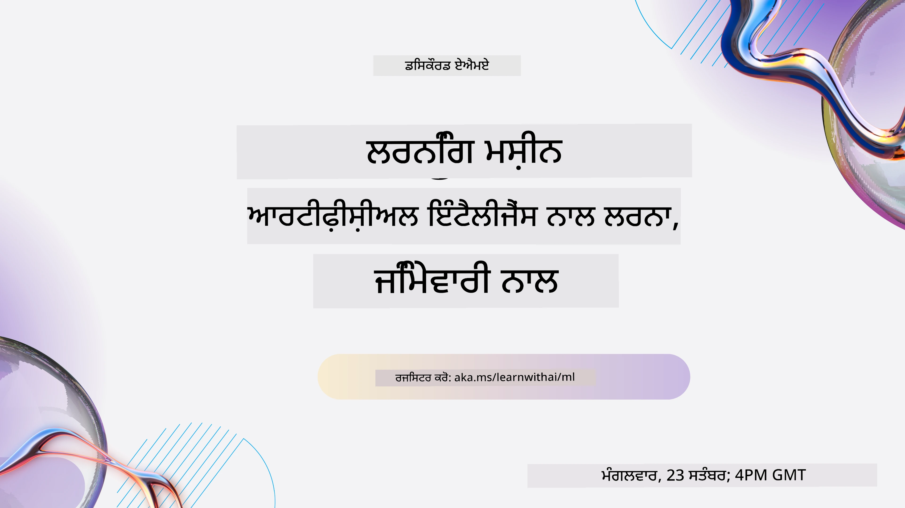
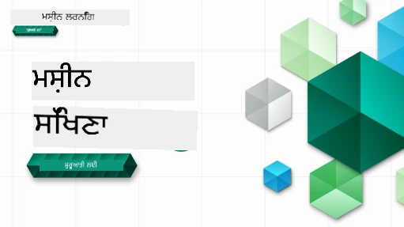

[](https://github.com/microsoft/ML-For-Beginners/blob/master/LICENSE)
[](https://GitHub.com/microsoft/ML-For-Beginners/graphs/contributors/)
[](https://GitHub.com/microsoft/ML-For-Beginners/issues/)
[](https://GitHub.com/microsoft/ML-For-Beginners/pulls/)
[](http://makeapullrequest.com)

[](https://GitHub.com/microsoft/ML-For-Beginners/watchers/)
[](https://GitHub.com/microsoft/ML-For-Beginners/network/)
[](https://GitHub.com/microsoft/ML-For-Beginners/stargazers/)

### 🌐 ਬਹੁ-ਭਾਸ਼ਾਈ ਸਹਾਇਤਾ

#### GitHub ਐਕਸ਼ਨ ਰਾਹੀਂ ਸਮਰਥਿਤ (ਆਟੋਮੈਟਿਕ ਅਤੇ ਹਮੇਸ਼ਾ ਅੱਪ-ਟੂ-ਡੇਟ)

<!-- CO-OP TRANSLATOR LANGUAGES TABLE START -->
[Arabic](../ar/README.md) | [Bengali](../bn/README.md) | [Bulgarian](../bg/README.md) | [Burmese (Myanmar)](../my/README.md) | [Chinese (Simplified)](../zh-CN/README.md) | [Chinese (Traditional, Hong Kong)](../zh-HK/README.md) | [Chinese (Traditional, Macau)](../zh-MO/README.md) | [Chinese (Traditional, Taiwan)](../zh-TW/README.md) | [Croatian](../hr/README.md) | [Czech](../cs/README.md) | [Danish](../da/README.md) | [Dutch](../nl/README.md) | [Estonian](../et/README.md) | [Finnish](../fi/README.md) | [French](../fr/README.md) | [German](../de/README.md) | [Greek](../el/README.md) | [Hebrew](../he/README.md) | [Hindi](../hi/README.md) | [Hungarian](../hu/README.md) | [Indonesian](../id/README.md) | [Italian](../it/README.md) | [Japanese](../ja/README.md) | [Kannada](../kn/README.md) | [Khmer](../km/README.md) | [Korean](../ko/README.md) | [Lithuanian](../lt/README.md) | [Malay](../ms/README.md) | [Malayalam](../ml/README.md) | [Marathi](../mr/README.md) | [Nepali](../ne/README.md) | [Nigerian Pidgin](../pcm/README.md) | [Norwegian](../no/README.md) | [Persian (Farsi)](../fa/README.md) | [Polish](../pl/README.md) | [Portuguese (Brazil)](../pt-BR/README.md) | [Portuguese (Portugal)](../pt-PT/README.md) | [Punjabi (Gurmukhi)](./README.md) | [Romanian](../ro/README.md) | [Russian](../ru/README.md) | [Serbian (Cyrillic)](../sr/README.md) | [Slovak](../sk/README.md) | [Slovenian](../sl/README.md) | [Spanish](../es/README.md) | [Swahili](../sw/README.md) | [Swedish](../sv/README.md) | [Tagalog (Filipino)](../tl/README.md) | [Tamil](../ta/README.md) | [Telugu](../te/README.md) | [Thai](../th/README.md) | [Turkish](../tr/README.md) | [Ukrainian](../uk/README.md) | [Urdu](../ur/README.md) | [Vietnamese](../vi/README.md)

> **ਕੀ ਤੁਸੀਂ ਲੋਕਲ ਤੌਰ 'ਤੇ ਕਲੋਨ ਕਰਨਾ ਪਸੰਦ ਕਰਦੇ ਹੋ?**
>
> ਇਸ ਰਿਪੋਜ਼ਿਟਰੀ ਵਿੱਚ 50+ ਭਾਸ਼ਾ ਦੇ ਅਨੁਵਾਦ ਸ਼ਾਮਲ ਹਨ ਜੋ ਡਾਊਨਲੋਡ ਸਾਈਜ਼ ਨੂੰ ਮਹੱਤਵਪੂਰਨ ਤੌਰ ਤੇ ਵਧਾਉਂਦੇ ਹਨ। ਬਿਨਾ ਅਨੁਵਾਦਾਂ ਦੇ ਕਲੋਨ ਕਰਨ ਲਈ, ਸਪਾਰਸ ਚੈੱਕਆਊਟ ਵਰਤੋ:
>
> **Bash / macOS / Linux:**
> ```bash
> git clone --filter=blob:none --sparse https://github.com/microsoft/ML-For-Beginners.git
> cd ML-For-Beginners
> git sparse-checkout set --no-cone '/*' '!translations' '!translated_images'
> ```
>
> **CMD (ਵਿੰਡੋਜ਼):**
> ```cmd
> git clone --filter=blob:none --sparse https://github.com/microsoft/ML-For-Beginners.git
> cd ML-For-Beginners
> git sparse-checkout set --no-cone "/*" "!translations" "!translated_images"
> ```
>
> ਇਹ ਤੁਹਾਨੂੰ ਕੋਰਸ ਪੂਰਾ ਕਰਨ ਲਈ ਸਾਰੀ ਲੋੜੀਂਦੀ ਚੀਜ਼ ਤੇਜ਼ ਡਾਊਨਲੋਡ ਨਾਲ ਦਿੰਦਾ ਹੈ।
<!-- CO-OP TRANSLATOR LANGUAGES TABLE END -->

#### ਸਾਡੀ ਕਮਿিউਨਿਟੀ ਵਿੱਚ ਸ਼ਾਮਿਲ ਹੋਵੋ

[](https://discord.gg/nTYy5BXMWG)

ਸਾਡੇ ਕੋਲ ਏ ਆਈ ਦੇ ਨਾਲ ਸਿੱਖਣ ਦੀ ਇੱਕ ਡਿਸਕੋਰਡ ਸਿਰੀਜ਼ ਚੱਲ ਰਹੀ ਹੈ, ਹੋਰ ਜਾਣਕਾਰੀ ਲਈ ਅਤੇ ਸਾਡੇ ਨਾਲ ਜੁੜਨ ਲਈ [Learn with AI Series](https://aka.ms/learnwithai/discord) ਵਿੱਚ 18 - 30 ਸਤੰਬਰ, 2025 ਨੂੰ ਸ਼ਾਮਿਲ ਹੋਵੋ। ਤੁਹਾਨੂੰ ਡਾਟਾ ਸਾਇੰਸ ਲਈ GitHub Copilot ਦੇ ਉਪਯੋਗ ਦੇ ਟਿਪਸ ਅਤੇ ਟ੍ਰਿਕਸ ਮਿਲਣਗੇ।



# ਸ਼ੁਰੂਆਤੀ ਲਈ ਮਸ਼ੀਨ ਲਰਨਿੰਗ - ਇੱਕ ਕਰੀਕੁਲਮ

> 🌍 ਦੁਨੀਆ ਦੀ ਸੈਰ ਕਰੋ ਜਿਵੇਂ ਕਿ ਅਸੀਂ ਦੁਨੀਆ ਦੇ ਸਭਿਆਚਾਰਾਂ ਦੇ ਜ਼ਰੀਏ ਮਸ਼ੀਨ ਲਰਨਿੰਗ ਨੂੰ ਖੋਜਦੇ ਹਾਂ 🌍

ਮਾਇਕ੍ਰੋਸਾਫਟ ਵਿਖੇ ਕਲਾਉਡ ਐਡਵੋਕੇਟ ਖੁਸ਼ ਹਨ ਕਿ ਉਹ 12-ਹਫਤਿਆਂ ਦਾ, 26-ਪਾਠਾਂ ਵਾਲਾ ਕਰੀਕੁਲਮ ਪੇਸ਼ ਕਰਦੇ ਹਨ ਜੋ ਕੁੱਲ ਮਿਲਾ ਕੇ **ਮਸ਼ੀਨ ਲਰਨਿੰਗ** ਬਾਰੇ ਹੈ। ਇਸ ਕਰੀਕੁਲਮ ਵਿੱਚ, ਤੁਸੀਂ ਕਿਸੇ ਵੇਲੇ ਕਿਹਾ ਜਾਣ ਵਾਲੇ **ਕਲਾਸਿਕ ਮਸ਼ੀਨ ਲਰਨਿੰਗ** ਬਾਰੇ ਸਿੱਖੋਗੇ, ਮੁੱਖ ਤੌਰ 'ਤੇ Scikit-learn ਲਾਇਬ੍ਰੇਰੀ ਵਰਤਦੇ ਹੋਏ ਅਤੇ ਡੀਪ ਲਰਨਿੰਗ ਨੂੰ ਬਚਕੇ, ਜੋ ਸਾਡੀ [AI for Beginners' curriculum](https://aka.ms/ai4beginners) ਵਿੱਚ ਕਵਰ ਕੀਤਾ ਗਿਆ ਹੈ। ਇਨ੍ਹਾਂ ਪਾਠਾਂ ਨੂੰ ਸਾਡੇ ['Data Science for Beginners' curriculum](https://aka.ms/ds4beginners) ਨਾਲ ਵੀ ਜੋੜੋ।

ਸਾਡੇ ਨਾਲ ਦੁਨੀਆ ਦੀ ਸੈਰ ਕਰੋ ਜਦੋਂ ਅਸੀਂ ਇਨ੍ਹਾਂ ਕਲਾਸਿਕ ਤਕਨੀਕਾਂ ਨੂੰ ਦੁਨੀਆਂ ਦੇ ਕਈ ਖੇਤਰਾਂ ਦੇ ਡਾਟਾ 'ਤੇ ਲਾਗੂ ਕਰਦੇ ਹਾਂ। ਹਰ ਪਾਠ ਵਿਚ ਪੂਰਵ ਅਤੇ ਬਾਅਦ ਦੇ ਕਵਿਜ਼, ਲਿਖਤੀ ਹੁਕਮਾਂ ਨਾਲ ਪਾਠ ਪੂਰਾ ਕਰਨ ਲਈ, ਇਕ ਹੱਲ, ਇੱਕ ਅਸਾਈਨਮੈਂਟ ਅਤੇ ਹੋਰ ਸ਼ਾਮਲ ਹਨ। ਸਾਡੀ ਪ੍ਰੋਜੈਕਟ-ਆਧਾਰਿਤ ਪੈਡਾਗੌਜੀ ਤੁਹਾਨੂੰ ਸਿਖਾਉਂਦੀ ਹੈ ਜਦੋਂ ਤੁਸੀਂ ਬਣਾਉਂਦੇ ਹੋ, ਜੋ ਨਵੀਆਂ ਸਿੱਖਣੀਆਂ ਚੀਜਾਂ ਲਈ ਇੱਕ ਸਾਬਤ ਤਰੀਕਾ ਹੈ।

**✍️ ਸਾਡੇ ਲੇਖਕਾਂ ਦਾ ਦਿਲੋਂ ਧੰਨਵਾਦ** ਜੇਨ ਲੂਪਰ, ਸਟੀਫਨ ਹਾਵਲ, ਫ੍ਰਾਂਚੇਸਕਾ ਲਾਜ਼ੇਰੀ, ਟੋਮੋਮੀ ਇਮੁਰਾ, ਕਿਸੀ ਬਰੇਵਿਊ, ਡਿਮਿਟਰੀ ਸੋਸ਼ਨਿਕੋਵ, ਕ੍ਰਿਸ ਨੋਰਿੰਗ, ਅਨੀਰਬਨ ਮੁਖਰਜੀ, ਓਰਨੈਲਾ ਅਲਟੁਨਯਾਨ, ਰੁਥ ਯਾਕ਼ੂਬੂ ਅਤੇ ਏਮੀ ਬੌਇਡ

**🎨 ਸਾਡੇ ਇਲਸਟਰਟਰਾਂ ਲਈ ਵੀ ਧੰਨਵਾਦ** ਟੋਮੋਮੀ ਇਮੁਰਾ, ਦਾਸਨੀ ਮਾਡਿਪੱਲੀ, ਅਤੇ ਜੇਨ ਲੂਪਰ

**🙏 ਵਿਸ਼ੇਸ਼ ਧੰਨਵਾਦ 🙏 ਸਾਡੇ Microsoft ਸਟੂਡੈਂਟ ਅੰਬੈਸਡਰ ਲੇਖਕਾਂ, ਸਮੀਖਿਆਕਾਰਾਂ ਅਤੇ ਸਮੱਗਰੀ ਸਹਿਯੋਗੀਆਂ ਨੂੰ**, ਖ਼ਾਸ ਕਰਕੇ ਰਿਸ਼ਿਤ ਡਾਗਲੀ, ਮੁਹੰਮਦ ਸਕੀਬ ਖਾਨ ਇਨਾਨ, ਰੋਹਨ ਰਾਜ, ਅਲੈਕਜ਼ੈਂਡਰ ਪੇਤਰੇਸਕੂ, ਅਭੀਸ਼ੇਕ ਜੈਸਵਾਲ, ਨਵਰੀਨ ਤਬੱਸਮ, ਇਓਅਨ ਸਮੁਇਲਾ, ਅਤੇ ਸਨਿਗਧਾ ਅਗਰਵਾਲ

**🤩 ਸਾਡੇ R ਪਾਠਾਂ ਲਈ Microsoft ਸਟੂਡੈਂਟ ਅੰਬੈਸਡਰ ਐਰਿਕ ਵਾਂਜਾਊ, ਜਸਲੀਨ ਸੋਂਧੀ ਅਤੇ ਵਿਦੂਸ਼ੀ ਗੁਪਤਾ ਦਾ ਵਧੀਆ ਧੰਨਵਾਦ!**

# ਸ਼ੁਰੂਆਤ ਕਰਨਾ

ਇਹ ਕਦਮ ਅਪਣਾੳ:
1. **ਰਿਪੋਜ਼ਿਟਰੀ ਨੂੰ ਫੋਰਕ ਕਰੋ**: ਇਸ ਪੇਜ ਦੇ ਸੱਜੇ-ਵਰਗੇ ਕੋਨੇ 'Fork' ਬਟਨ 'ਤੇ ਕਲਿੱਕ ਕਰੋ।
2. **ਰਿਪੋਜ਼ਿਟਰੀ ਨੂੰ ਕਲੋਨ ਕਰੋ**:   `git clone https://github.com/microsoft/ML-For-Beginners.git`

> 💡 **ਫਟਾਫਟ ਸ਼ੁਰੂਆਤ ਟਿਪ:** ਕੀ ਤੁਸੀਂ ਬਿਨਾ ਆਪਣੀ ਮਸ਼ੀਨ ਉੱਤੇ Python ਸੈਟਅੱਪ ਕੀਤੇ ਬ੍ਰਾਊਜ਼ਰ ਵਿੱਚ ਸ਼ੁਰੂ ਕਰਨਾ ਚਾਹੁੰਦੇ ਹੋ? ਆਪਣੇ ਫੋਰਕ ਲਈ ਇੱਕ ਕਲਾਉਡ ਡਿਵੈਲਪਮੈਂਟ ਵਾਤਾਵਰਨ ਬਣਾਉਣ ਲਈ [GitHub Codespaces](https://github.com/features/codespaces) ਵਰਤੋ। ਹਰੇ **Code** ਮੇਨੂ ਨੂੰ ਖੋਲ੍ਹੋ, **Codespaces** ਚੁਣੋ ਅਤੇ ਇੱਕ ਕੋਡਸਪੇਸ ਬਣਾਓ; ਹਰੇਕ ਪਾਠ ਦੀ ਲੋੜੀਂਦੀDependencies ਇਸ ਦੇ ਅੰਦਰ ਤੌਰ ਤੇ ਇੰਸਟਾਲ ਕਰੋ।

> [ਸਾਡੀ Microsoft Learn ਕਲੇਕਸ਼ਨ ਵਿੱਚ ਇਸ ਕੋਰਸ ਲਈ ਸਾਰੇ ਵਾਧੂ ਸਰੋਤ ਲੱਭੋ](https://learn.microsoft.com/en-us/collections/qrqzamz1nn2wx3?WT.mc_id=academic-77952-bethanycheum)

> 🔧 **ਮਦਦ ਚਾਹੀਦੀ ਹੈ?** ਸਥਾਪਨਾ, ਸੈਟਅਪ ਅਤੇ ਪਾਠਾਂ ਚਲਾਉਣ ਵਿੱਚ ਆਮ ਸਮੱਸਿਆਵਾਂ ਲਈ ਸਾਡਾ [Troubleshooting Guide](TROUBLESHOOTING.md) ਵੇਖੋ।


**[ਵਿਦਿਆਰਥੀ](https://aka.ms/student-page)**, ਇਸ ਕਰੀਕੁਲਮ ਨੂੰ ਵਰਤਣ ਲਈ, ਸਾਰਾ ਰਿਪੋ ਆਪਣੇ GitHub ਖਾਤੇ ਵਿੱਚ ਫੋਰਕ ਕਰੋ ਅਤੇ ਅਭਿਆਸ ਆਪਣੇ ਆਪ ਜਾਂ ਸਮੂਹ ਨਾਲ ਪੂਰੇ ਕਰੋ:

- ਪਹਿਲਾਂ ਪ੍ਰੀ-ਲੈਕਚਰ ਕਵਿਜ਼ ਤੋਂ ਸ਼ੁਰੂ ਕਰੋ।
- ਲੈਕਚਰ ਪੜ੍ਹੋ ਅਤੇ ਗਤੀਵਿਧੀਆਂ ਪੂਰੀਆਂ ਕਰੋ, ਹਰ ਗਿਆਨ ਜਾਂਚ 'ਤੇ ਰੁਕ ਕੇ ਅਤੇ ਸੋਚਦੇ ਹੋਏ।
- ਸਮਝ ਕੇ ਪ੍ਰੋਜੈਕਟ ਬਣਾਉਣ ਦੀ ਕੋਸ਼ਿਸ਼ ਕਰੋ, ਸਿੱਧੀ ਹੱਲ ਕੋਡ ਚਲਾਉਣ ਦੀ bajay; ਹਾਲਾਂਕਿ ਉਹ ਕੋਡ ਹਰ ਪ੍ਰੋਜੈਕਟ-ਕੇਂਦਰਿਤ ਪਾਠ ਦੇ `/solution` ਫੋਲਡਰਾਂ ਵਿੱਚ ਉਪਲਬਧ ਹੈ।
- ਪੋਸਟ-ਲੈਕਚਰ ਕਵਿਜ਼ ਲਵੋ।
- ਚੈਲੇਂਜ ਪੂਰਾ ਕਰੋ।
- ਅਸਾਈਨਮੈਂਟ ਪੂਰਾ ਕਰੋ।
- ਇਕ ਪਾਠ ਸਮੂਹ ਪੂਰਾ ਕਰਨ ਤੋਂ ਬਾਅਦ, [Discussion Board](https://github.com/microsoft/ML-For-Beginners/discussions) 'ਤੇ ਜਾਓ ਅਤੇ ਸਬੰਧਿਤ PAT ਰੂਬ੍ਰਿਕ ਭਰ ਕੇ "ਜੋਸ਼ ਨਾਲ ਸਿੱਖੋ"। ‘PAT’ ਇੱਕ ਪ੍ਰੋਗਰੈਸ ਅਸੈਸਮੈਂਟ ਟੂਲ ਹੈ ਜੋ ਤੁਸੀਂ ਆਪਣੀ ਸਿੱਖਿਆ ਅੱਗੇ ਵਧਾਉਣ ਲਈ ਭਰਦੇ ਹੋ। ਤੁਸੀਂ ਹੋਰ PATs ਨੂੰ ਵੀ ਪ੍ਰਤੀਕਿਰਿਆ ਦੇ ਸਕਦੇ ਹੋ ਤਾਂ ਜੋ ਅਸੀਂ ਮਿਲ ਕੇ ਸਿੱਖ ਸਕੀਏ।

> ਅੱਗੇ ਦੀ ਪੜਾਈ ਲਈ, ਅਸੀਂ ਇਹ [Microsoft Learn](https://docs.microsoft.com/en-us/users/jenlooper-2911/collections/k7o7tg1gp306q4?WT.mc_id=academic-77952-leestott) ਮੋਡੀਊਲ ਅਤੇ ਸਿੱਖਣ ਦੇ ਰਸਤੇ ਅਨਸਾਰ ਕਰਨ ਦੀ ਸਿਫਾਰਿਸ਼ ਕਰਦੇ ਹਾਂ।

**ਅਧਿਆਪਕ**, ਅਸੀਂ ਇਸ ਕਰੀਕੁਲਮ ਨੂੰ ਵਰਤਣ ਬਾਰੇ ਕੁਝ [ਸੁਝਾਵ](for-teachers.md) ਸ਼ਾਮਲ ਕੀਤੇ ਹਨ।

---

## ਵੀਡੀਓ ਵਾਕਥਰੂ

ਕੁਝ ਪਾਠ ਛੋਟੀ ਫੌਰਮ ਵਾਲੇ ਵੀਡੀਓ ਵਿੱਚ ਉਪਲਬਧ ਹਨ। ਤੁਸੀਂ ਇਹ ਸਾਰੇ ਪਾਠਾਂ ਵਿੱਚ ਇਨ-ਲਾਈਨ, ਜਾਂ ਮਾਇਕ੍ਰੋਸਾਫਟ ਡਿਵੈਲਪਰ ਯੂਟਿਊਬ ਚੈਨਲ ਦੇ [ML for Beginners playlist](https://aka.ms/ml-beginners-videos) 'ਤੇ ਨੀਵੇਂ ਤਸਵੀਰ 'ਤੇ ਕਲਿੱਕ ਕਰਕੇ ਦੇਖ ਸਕਦੇ ਹੋ।

[](https://aka.ms/ml-beginners-videos)

---

## ਟੀਮ ਨਾਲ ਮਿਲੋ

[](https://youtu.be/Tj1XWrDSYJU)

**Gif ਦੁਆਰਾ** [Mohit Jaisal](https://linkedin.com/in/mohitjaisal)

> 🎥 ਪ੍ਰੋਜੈਕਟ ਅਤੇ ਉਸ ਨੂੰ ਬਣਾਉਣ ਵਾਲਿਆਂ ਬਾਰੇ ਵੀਡੀਓ ਲਈ ਉੱਪਰ ਦਿੱਤੀ ਤਸਵੀਰ 'ਤੇ ਕਲਿੱਕ ਕਰੋ!

---

## ਪੈਡਾਗੌਜੀ

ਇਸ ਕਰੀਕੁਲਮ ਬਣਾਉਂਦੇ ਸਮੇਂ ਅਸੀਂ ਦੋ ਪੈਡਾਗੌਜਿਕਲੀ ਸਿਧਾਂਤਾਂ ਚੁਣੀਆਂ ਹਨ: ਇਹ ਨਿਸ਼ਚਿਤ ਕਰਨਾ ਕਿ ਇਹ ਹੱਥੋਂ-ਹੱਥ ਦਾ **ਪ੍ਰੋਜੈਕਟ-ਆਧਾਰਿਤ** ਹੈ ਅਤੇ ਇਸ ਵਿੱਚ **ਅਕਸਰ ਕਵਿਜ਼** ਸ਼ਾਮਲ ਹਨ। ਇਸਤੋਂ ਇਲਾਵਾ, ਇਸ ਕਰੀਕੁਲਮ ਵਿੱਚ ਇੱਕ ਸਾਂਝਾ **ਥੀਮ** ਵੀ ਹੈ ਜੋ ਇਸਨੂੰ ਇਕਠੇ ਰੱਖਦਾ ਹੈ।

ਸਮੱਗਰੀ ਨੂੰ ਪ੍ਰੋਜੈਕਟਾਂ ਨਾਲ ਮੇਲ ਖਾਂਡਾ ਕਰਕੇ, ਇਸ ਪ੍ਰਕਿਰਿਆ ਵਿਦਿਆਰਥੀਆਂ ਲਈ ਜ਼ਿਆਦਾ ਮਨੋਹਰ ਬਣਾਈ ਜਾਂਦੀ ਹੈ ਅਤੇ ਸੰਕਲਪਾਂ ਦੀ ਸੰਜਮ ਹੋਵੇਗੀ। ਇਸਤੋਂ ਇਲਾਵਾ, ਇੱਕ ਨੀਵਾਂ ਕਵਿਜ਼ ਕਲਾਸ ਤੋਂ ਪਹਿਲਾਂ ਵਿਦਿਆਰਥੀ ਦੀ ਸਿੱਖਣ ਦੀ ਨੀਤੀ ਬਣਾਉਂਦਾ ਹੈ, ਜਦਕਿ ਕਲਾਸ ਤੋਂ ਬਾਅਦ ਦੂਜਾ ਕਵਿਜ਼ ਹੋਰ ਸੰਜਮ ਦਾ ਨਿਸ਼ਚਿਤ ਕਰਦਾ ਹੈ। ਇਹ ਕਰੀਕੁਲਮ ਲਚਕੀਲਾ ਅਤੇ ਮਜ਼ੇਦਾਰ ਬਣਾਇਆ ਗਿਆ ਹੈ ਅਤੇ ਪੂਰਾ ਜਾਂ ਅੰਸ਼ਕ ਤੌਰ 'ਤੇ ਕੀਤਾ ਜਾ ਸਕਦਾ ਹੈ। ਪ੍ਰੋਜੈਕਟ ਛੋਟੇ ਤੋਂ ਸ਼ੁਰੂ ਹੁੰਦੇ ਹਨ ਅਤੇ 12-ਹਫਤਿਆਂ ਦੇ ਚੱਕਰ ਦੇ ਅਖੀਰ ਤੱਕ ਵਿਕਸਤ ਹੁੰਦੇ ਹਨ। ਇਹ ਕਰੀਕੁਲਮ ਮਸ਼ੀਨ ਲਰਨਿੰਗ ਦੇ ਅਸਲ ਦੁਨੀਆ ਦੇ ਇਸ਼ਤਿਹਾਰ ਬਾਰੇ ਇੱਕ ਪੋਸਟਸਕ੍ਰਿਪਟ ਵੀ ਸ਼ਾਮਲ ਕਰਦਾ ਹੈ, ਜੋ ਵਾਧੂ ਕਰੈਡਿਟ ਜਾਂ ਚਰਚਾ ਲਈ ਆਧਾਰ ਵਜੋਂ ਵਰਤਿਆ ਜਾ ਸਕਦਾ ਹੈ।

> ਸਾਡਾ [Code of Conduct](CODE_OF_CONDUCT.md), [Contributing](CONTRIBUTING.md), [Translations](..), ਅਤੇ [Troubleshooting](TROUBLESHOOTING.md) ਨਿਯਮਾਂ ਨੂੰ ਲੱਭੋ। ਅਸੀਂ ਤੁਹਾਡੇ ਸੰਰਚਨਾਤਮਕ ਪ੍ਰਤੀਕਰਮ ਦੀ ਸਵਾਗਤ ਕਰਦੇ ਹਾਂ!

## ਹਰ ਪਾਠ ਵਿੱਚ ਸ਼ਾਮਿਲ ਹੈ

- ਵਿਕਲਪਕ ਸਕੈਚਨੋਟ
- ਵਿਕਲਪਕ ਸਹਾਇਕ ਵੀਡੀਓ
- ਵੀਡੀਓ ਵਾਕਥਰੂ (ਕੁਝ ਹੀ ਪਾਠ)
- [ਪੂਰਵ-ਲੈਕਚਰ ਵਾਰਮਅਪ ਕਵਿਜ਼](https://ff-quizzes.netlify.app/en/ml/)
- ਲਿਖਤੀ ਪਾਠ
- ਪ੍ਰੋਜੈਕਟ-ਆਧਾਰਿਤ ਪਾਠਾਂ ਲਈ, ਪ੍ਰੋਜੈਕਟ ਬਣਾਉਣ ਲਈ ਕਦਮ-ਦਰ-কਦਮ ਮਾਰਗਦਰਸ਼ਨ
- ਗਿਆਨ ਜਾਂਚ
- ਇੱਕ ਚੈਲੇਂਜ
- ਸਹਾਇਕ ਪਾਠ
- ਅਸਾਈਨਮੈਂਟ
- [ਪੋਸਟ-ਲੈਕਚਰ ਕਵਿਜ਼](https://ff-quizzes.netlify.app/en/ml/)

> **ਭਾਸ਼ਾਵਾਂ ਬਾਰੇ ਇੱਕ ਨੋਟ**: ਇਹ ਪਾਠ ਮੁੱਖਤੌਰ 'ਤੇ Python ਵਿੱਚ ਲਿਖੇ ਗਏ ਹਨ, ਪਰ ਬਹੁਤ ਸਾਰੇ R ਵਿੱਚ ਵੀ ਉਪਲਬਧ ਹਨ। ਇੱਕ R ਪਾਠ ਪੂਰਾ ਕਰਨ ਲਈ, `/solution` ਫੋਲਡਰ ਵਿੱਚ ਜਾਓ ਅਤੇ R ਪਾਠਾਂ ਦੀ ਖੋਜ ਕਰੋ। ਇਹ .rmd ਵਿਆਪਕਤਾਵਾਦਨ ਸ਼ਾਮਲ ਹਨ ਜੋ ਕਿ **R ਮਾਰਕਡਾਊਨ** ਫਾਈਲ ਹੈ ਜੋ ਆਸਾਨੀ ਨਾਲ `code chunks` (R ਜਾਂ ਹੋਰ ਭਾਸ਼ਾਵਾਂ ਦੇ) ਅਤੇ `YAML header` (ਜੋ ਨਤੀਜਿਆਂ ਨੂੰ PDF ਵਰਗੇ ਫਾਰਮੈਟਾਂ ਵਿੱਚ ਫਾਰਮੈਟ ਕਰਦੇ ਹਨ) ਨੂੰ ਜੋੜਨ ਵਾਸਤੇ ਸਮਝਾਇਆ ਜਾ ਸਕਦਾ ਹੈ। ਇਸ ਤਰ੍ਹਾਂ, ਇਹ ਡਾਟਾ ਸਾਇੰਸ ਲਈ ਇਕ ਚੰਗਾ ਲਿਖਣ ਦਾ ਫਰੇਮਵਰਕ ਹੈ ਕਿਉਂਕਿ ਇਹ ਤੁਹਾਡੇ ਕੋਡ, ਉਸ ਦਾ ਨਤੀਜਾ ਅਤੇ ਤੁਹਾਡੇ ਵਿਚਾਰਾਂ ਨੂੰ Markdown ਵਿੱਚ ਲਿਖਣ ਦੀ ਆਗਿਆ ਦਿੰਦਾ ਹੈ। ਇਨ੍ਹਾਂ R ਮਾਰਕਡਾਊਨ ਦਸਤਾਵੇਜ਼ਾਂ ਨੂੰ PDF, HTML ਜਾਂ Word ਵਰਗੇ ਨਤੀਜੇ ਫਾਰਮੈਟਾਂ ਵਿੱਚ ਵੀ ਤਿਆਰ ਕੀਤਾ ਜਾ ਸਕਦਾ ਹੈ।

> **ਕਵਿਜ਼ਾਂ ਬਾਰੇ ਇੱਕ ਨੋਟ**: ਸਾਰੇ ਕਵਿਜ਼ [Quiz App ਫੋਲਡਰ](../../quiz-app) ਵਿੱਚ ਹਨ, ਜੋ ਕੁੱਲ 52 ਕਵਿਜ਼ ਹਨ ਜ਼ਿਹਨਾਂ ਵਿੱਚ ਹਰ ਇੱਕ ਵਿੱਚ ਤਿੰਨ ਸਵਾਲ ਹਨ। ਇਹਨਾਂ ਨੂੰ ਪਾਠਾਂ ਵਿੱਚ ਲਿੰਕ ਕੀਤਾ ਗਿਆ ਹੈ ਪਰ ਕਵਿਜ਼ ਐਪ ਨੂੰ ਲੋਕਲ ਤੌਰ 'ਤੇ ਚਲਾਇਆ ਜਾ ਸਕਦਾ ਹੈ; `quiz-app` ਫੋਲਡਰ ਵਿੱਚ ਦਿਓ ਗਇਆ ਨਿਰਦੇਸ਼ਾਂ ਅਨੁਸਾਰ ਲੋਕਲ ਹੋਸਟ ਜਾਂ ਐਜ਼ਯੂਰ 'ਤੇ ਡਿਪਲੌਇ ਕਰੋ।

| ਪਾਠ ਨੰਬਰ |                             ਵਿਸ਼ਾ                              |                   ਪਾਠ ਸਮੂਹ                   | ਸਿੱਖਣ ਦੇ ਉਦੇਸ਼                                                                                                             |                                                              ਲਿੰਕ ਪਾਠ                                                               |                        ਲੇਖਕ                        |
| :-----------: | :------------------------------------------------------------: | :-------------------------------------------------: | ------------------------------------------------------------------------------------------------------------------------------- | :--------------------------------------------------------------------------------------------------------------------------------------: | :--------------------------------------------------: |
|      01       |                ਮਸ਼ੀਨ ਲਰਨਿੰਗ ਦਾ ਪਰੀਚਯ                            |      [Introduction](1-Introduction/README.md)       | ਮਸ਼ੀਨ ਲਰਨਿੰਗ ਦੇ ਮੂਲ ਸੰਕਲਪ ਸਿੱਖੋ                                                                                             |                                             [Lesson](1-Introduction/1-intro-to-ML/README.md)                                             |                       ਮੁਹੰਮਦ                         |
|      02       |                ਮਸ਼ੀਨ ਲਰਨਿੰਗ ਦਾ ਇਤਿਹਾਸ                           |      [Introduction](1-Introduction/README.md)       | ਇਸ ਖੇਤਰ ਦੀ ਇਤਿਹਾਸਕ ਜਾਣਕਾਰੀ ਸਿੱਖੋ                                                                                             |                                            [Lesson](1-Introduction/2-history-of-ML/README.md)                                            |                     ਜੈਨ ਅਤੇ ਐਮੀ                     |
|      03       |                 ਨਿਆਇਕੀਤਾ ਅਤੇ ਮਸ਼ੀਨ ਲਰਨਿੰਗ                     |      [Introduction](1-Introduction/README.md)       | ਨਿਆਇਕੀਤਾ ਦੇ ਮੁੱਖ ਦਰਸ਼ਨਸ਼ਾਸਤਰੀ ਮੁੱਦੇ ਕੀ ਹਨ ਜੋ ਵਿਦਿਆਰਥੀਆਂ ਨੂੰ ਮਸ਼ੀਨ ਲਰਨਿੰਗ ਮਾਡਲ ਬਣਾਉਣ ਅਤੇ ਲਾਗੂ ਕਰਨ ਸਮੇਂ ਵਿਚਾਰ ਕਰਨੇ ਚਾਹੀਦੇ ਹਨ?        |                                              [Lesson](1-Introduction/3-fairness/README.md)                                               |                        ਤੋਮੋਮੀ                         |
|      04       |                ਮਸ਼ੀਨ ਲਰਨਿੰਗ ਲਈ ਤਕਨੀਕਾਂ                       |      [Introduction](1-Introduction/README.md)       | ਮਸ਼ੀਨ ਲਰਨਿੰਗ ਖੋਜਕਰਤਾ ਕਿਸ ਤਰ੍ਹਾਂ ਦੀਆਂ ਤਕਨੀਕਾਂ ਵਰਤਦੇ ਹਨ ਮਸ਼ੀਨ ਲਰਨਿੰਗ ਮਾਡਲ ਬਣਾਉਣ ਲਈ?                                             |                                          [Lesson](1-Introduction/4-techniques-of-ML/README.md)                                           |                    ਕਰਿਸ ਅਤੇ ਜੈਨ                       |
|      05       |                   ਰੈਗਰੈਸ਼ਨ ਦਾ ਪਰੀਚਯ                           |        [Regression](2-Regression/README.md)         | ਰੈਗਰੈਸ਼ਨ ਮਾਡਲਾਂ ਲਈ Python ਅਤੇ Scikit-learn ਨਾਲ ਸ਼ੁਰੂਆਤ ਕਰੋ                                                                 |         [Python](2-Regression/1-Tools/README.md) • [R](../../2-Regression/1-Tools/solution/R/lesson_1.html)         |      ਜੈਨ • ਏਰਿਕ ਵਾਂਜਾਵ                     |
|      06       |                ਉੱਤਰੀ ਅਮਰੀਕੀ ਕੱਦੂਆਂ ਦੀ ਕੀਮਤਾਂ 🎃                |        [Regression](2-Regression/README.md)         | ਮਸ਼ੀਨ ਲਰਨਿੰਗ ਲਈ ਡਾਟਾ ਨੂੰ ਵੇਖੋ ਅਤੇ ਸਾਫ ਕਰੋ                                                                                     |          [Python](2-Regression/2-Data/README.md) • [R](../../2-Regression/2-Data/solution/R/lesson_2.html)          |      ਜੈਨ • ਏਰਿਕ ਵਾਂਜਾਵ                     |
|      07       |                ਉੱਤਰੀ ਅਮਰੀਕੀ ਕੱਦੂਆਂ ਦੀ ਕੀਮਤਾਂ 🎃                |        [Regression](2-Regression/README.md)         | ਰੇਖੀਅ ਅਤੇ ਬਹੁਪਦ ਰੈਗਰੈਸ਼ਨ ਮਾਡਲ ਬਣਾਓ                                                                                          |        [Python](2-Regression/3-Linear/README.md) • [R](../../2-Regression/3-Linear/solution/R/lesson_3.html)        |      ਜੈਨ ਅਤੇ ਦਿਮਿਤਰੀ • ਏਰਿਕ ਵਾਂਜਾਵ         |
|      08       |                ਉੱਤਰੀ ਅਮਰੀਕੀ ਕੱਦੂਆਂ ਦੀ ਕੀਮਤਾਂ 🎃                |        [Regression](2-Regression/README.md)         | ਲਾਜਿਸਟਿਕ ਰੈਗਰੈਸ਼ਨ ਮਾਡਲ ਬਣਾਓ                                                                                                 |     [Python](2-Regression/4-Logistic/README.md) • [R](../../2-Regression/4-Logistic/solution/R/lesson_4.html)      |      ਜੈਨ • ਏਰਿਕ ਵਾਂਜਾਵ                     |
|      09       |                          ਇਕ ਵੈੱਬ ਐਪ 🔌                          |           [Web App](3-Web-App/README.md)            | ਆਪਣੇ ਤਿਆਰ ਕੀਤੇ ਮਾਡਲ ਲਈ ਵੈੱਬ ਐਪ ਬਣਾਓ                                                                                        |                                                 [Python](3-Web-App/1-Web-App/README.md)                                                  |                         ਜੈਨ                          |
|      10       |                 ਦਰਜਾਬੰਦੀ ਦਾ ਪਰੀਚਯ                           |    [Classification](4-Classification/README.md)     | ਆਪਣੇ ਡਾਟਾ ਨੂੰ ਸਾਫ਼ ਕਰੋ, ਤਿਆਰ ਕਰੋ ਅਤੇ ਵੇਖੋ; ਦਰਜਾਬੰਦੀ ਦਾ ਪਰੀਚਯ                                                               | [Python](4-Classification/1-Introduction/README.md) • [R](../../4-Classification/1-Introduction/solution/R/lesson_10.html)  | ਜੈਨ ਅਤੇ ਕੈਸੀ • ਏਰਿਕ ਵਾਂਜਾਵ           |
|      11       |             ਸੁਆਦਿਸ਼ਟ ਏਸ਼ੀਆਈ ਅਤੇ ਭਾਰਤੀ ਖਾਣੇ 🍜                 |    [Classification](4-Classification/README.md)     | ਦਰਜਾਬੰਦੀ ਕਰਨ ਵਾਲਿਆਂ ਦਾ ਪਰੀਚਯ                                                                                              | [Python](4-Classification/2-Classifiers-1/README.md) • [R](../../4-Classification/2-Classifiers-1/solution/R/lesson_11.html) | ਜੈਨ ਅਤੇ ਕੈਸੀ • ਏਰਿਕ ਵਾਂਜਾਵ           |
|      12       |             ਸੁਆਦਿਸ਼ਟ ਏਸ਼ੀਆਈ ਅਤੇ ਭਾਰਤੀ ਖਾਣੇ 🍜                 |    [Classification](4-Classification/README.md)     | ਹੋਰ ਦਰਜਾਬੰਦੀ ਕਰਨ ਵਾਲੇ                                                                                                       | [Python](4-Classification/3-Classifiers-2/README.md) • [R](../../4-Classification/3-Classifiers-2/solution/R/lesson_12.html) | ਜੈਨ ਅਤੇ ਕੈਸੀ • ਏਰਿਕ ਵਾਂਜਾਵ           |
|      13       |             ਸੁਆਦਿਸ਼ਟ ਏਸ਼ੀਆਈ ਅਤੇ ਭਾਰਤੀ ਖਾਣੇ 🍜                 |    [Classification](4-Classification/README.md)     | ਆਪਣੇ ਮਾਡਲ ਦੀ ਵਰਤੋਂ ਕਰ ਕੇ ਇੱਕ ਰਿਕਮੈਂਡਰ ਵੈੱਬ ਐਪ ਬਣਾਓ                                                                           |                                              [Python](4-Classification/4-Applied/README.md)                                              |                         ਜੈਨ                          |
|      14       |                   ਕਲੱਸਟਰਿੰਗ ਦਾ ਪਰੀਚਯ                         |        [Clustering](5-Clustering/README.md)         | ਆਪਣੇ ਡਾਟਾ ਨੂੰ ਸਾਫ਼ ਕਰੋ, ਤਿਆਰ ਕਰੋ ਅਤੇ ਵੇਖੋ; ਕਲੱਸਟਰਿੰਗ ਦਾ ਪਰੀਚਯ                                                                |         [Python](5-Clustering/1-Visualize/README.md) • [R](../../5-Clustering/1-Visualize/solution/R/lesson_14.html)         |      ਜੈਨ • ਏਰਿਕ ਵਾਂਜਾਵ                     |
|      15       |              ਨਾਈਜੀਰੀਆਈ ਸੰਗੀਤਕ ਸਵਾਦਾਂ ਦਾ ਪਤਾ ਲਗਾਉਣਾ 🎧       |        [Clustering](5-Clustering/README.md)         | K-Means ਕਲੱਸਟਰਿੰਗ ਤਰੀਕੇ ਦੀ ਖੋਜ ਕਰੋ                                                                                            |           [Python](5-Clustering/2-K-Means/README.md) • [R](../../5-Clustering/2-K-Means/solution/R/lesson_15.html)           |      ਜੈਨ • ਏਰਿਕ ਵਾਂਜਾਵ                     |
|      16       |        ਕੁਦਰਤੀ ਭਾਸ਼ਾ ਪ੍ਰਕਿਰਿਆ ਦਾ ਪਰੀਚਯ ☕️                     |   [Natural language processing](6-NLP/README.md)    | ਇੱਕ ਸਧਾਰਣ ਬੌਟ ਬਣਾਕੇ NLP ਬਾਰੇ ਮੁਢਲੀ ਜਾਣਕਾਰੀ ਪ੍ਰਾਪਤ ਕਰੋ                                                                         |                                             [Python](6-NLP/1-Introduction-to-NLP/README.md)                                              |                       ਸਟੀਫਨ                         |
|      17       |                      ਆਮ NLP ਕਾਰਜ ☕️                          |   [Natural language processing](6-NLP/README.md)    | ਭਾਸ਼ਾ ਦੀਆਂ ਸੰਰਚਨਾਵਾਂ ਨਾਲ ਨਜਿੱਠਣ ਲਈ ਲੋੜੀਂਦੇ ਆਮ ਕਾਰਜਾਂ ਨੂੰ ਸਮਝ ਕੇ ਆਪਣੀ NLP ਜਾਣਕਾਰੀ ਗਹਿਰੀ ਕਰੋ                                |                                                    [Python](6-NLP/2-Tasks/README.md)                                                     |                       ਸਟੀਫਨ                         |
|      18       |             ਅਨੁਵਾਦ ਅਤੇ ਭਾਵ-ਵਿਸ਼ਲੇਸ਼ਣ ♥️                        |   [Natural language processing](6-NLP/README.md)    | ਜੇਨ ਆਸਟਿਨ ਨਾਲ ਅਨੁਵਾਦ ਅਤੇ ਭਾਵ-ਵਿਸ਼ਲੇਸ਼ਕ                                                                                    |                                            [Python](6-NLP/3-Translation-Sentiment/README.md)                                             |                       ਸਟੀਫਨ                         |
|      19       |                  ਯੂਰਪ ਦੇ ਰੋਮਾਂਟਿਕ ਹੋਟਲ ♥️                     |   [Natural language processing](6-NLP/README.md)    | ਹੋਟਲ ਸਮੀਖਿਆਵਾਂ ਨਾਲ ਭਾਵ-ਵਿਸ਼ਲੇਸ਼ਣ 1                                                                                         |                                               [Python](6-NLP/4-Hotel-Reviews-1/README.md)                                                |                       ਸਟੀਫਨ                         |
|      20       |                  ਯੂਰਪ ਦੇ ਰੋਮਾਂਟਿਕ ਹੋਟਲ ♥️                     |   [Natural language processing](6-NLP/README.md)    | ਹੋਟਲ ਸਮੀਖਿਆਵਾਂ ਨਾਲ ਭਾਵ-ਵਿਸ਼ਲੇਸ਼ਣ 2                                                                                         |                                               [Python](6-NLP/5-Hotel-Reviews-2/README.md)                                                |                       ਸਟੀਫਨ                         |
|      21       |            ਸਮਾਂ ਖੇੜੀ ਅੰਦਾਜ਼ਾ ਲਗਾਉਣ ਦਾ ਪਰੀਚਯ                 |        [Time series](7-TimeSeries/README.md)        | ਸਮਾਂ ਖੇੜੀ ਅੰਦਾਜ਼ਾ ਲਗਾਉਣ ਦਾ ਮੁਢਲਾ ਪਰੀਚਯ                                                                                     |                                             [Python](7-TimeSeries/1-Introduction/README.md)                                              |                      ਫ੍ਰਾਂਸੇਸਕਾ                     |
|      22       | ⚡️ ਦੁਨੀਆ ਦੀ ਬਿਜਲੀ ਦੀ ਵਰਤੋ ⚡️ - ARIMA ਨਾਲ ਸਮਾਂ ਖੇੜੀ ਅੰਦਾਜ਼ਾ |        [Time series](7-TimeSeries/README.md)        | ARIMA ਨਾਲ ਸਮਾਂ ਖੇੜੀ ਅੰਦਾਜ਼ਾ                                                                                                    |                                                 [Python](7-TimeSeries/2-ARIMA/README.md)                                                 |                      ਫ੍ਰਾਂਸੇਸਕਾ                     |
|      23       |  ⚡️ ਦੁਨੀਆ ਦੀ ਬਿਜਲੀ ਦੀ ਵਰਤੋ ⚡️ - SVR ਨਾਲ ਸਮਾਂ ਖੇੜੀ ਅੰਦਾਜ਼ਾ    |        [Time series](7-TimeSeries/README.md)        | Support Vector Regressor ਨਾਲ ਸਮਾਂ ਖੇੜੀ ਅੰਦਾਜ਼ਾ                                                                                 |                                                  [Python](7-TimeSeries/3-SVR/README.md)                                                  |                       ਅਨੀਰਬਨ                         |
|      24       |             ਰੀਇਨਫੋਰਸਮੈਂਟ ਲਰਨਿੰਗ ਦਾ ਪਰੀਚਯ                   | [Reinforcement learning](8-Reinforcement/README.md) | Q-Learning ਨਾਲ ਰੀਇਨਫੋਰਸਮੈਂਟ ਲਰਨਿੰਗ ਦਾ ਪਰੀਚਯ                                                                                |                                             [Python](8-Reinforcement/1-QLearning/README.md)                                              |                        ਦਿਮਿਤਰੀ                        |
|      25       |                 ਪੀਟਰ ਨੂੰ ਭਿਆਕੜੋਂ ਤੋਂ ਬਚਾਉਣ ਵਿੱਚ ਮਦਦ ਕਰੋ! 🐺   | [Reinforcement learning](8-Reinforcement/README.md) | ਰੀਇਨਫੋਰਸਮੈਂਟ ਲਰਨਿੰਗ ਜਿਮ                                                                                                |                                                [Python](8-Reinforcement/2-Gym/README.md)                                                 |                        ਦਿਮਿਤਰੀ                        |
|  Postscript   |            ਅਸਲੀ ਦੁਨੀਆ ਦੇ ਮਸ਼ੀਨ ਲਰਨਿੰਗ ਦ੍ਰਿਸ਼ਯ ਅਤੇ ਲਾਗੂ       |      [ML in the Wild](9-Real-World/README.md)       | ਕਲਾਸਿਕ ਮਸ਼ੀਨ ਲਰਨਿੰਗ ਦੇ ਦਿਲਚਸਪ ਅਤੇ ਖੁਲਾਸਾ ਕਰਨ ਵਾਲੇ ਅਸਲੀ ਦੁਨੀਆ ਦੇ ਲਾਗੂ                                                       |                                             [Lesson](9-Real-World/1-Applications/README.md)                                              |                         ਟੀਮ                           |
|  Postscript   |            ਮਾਡਲ ਡੀਬੱਗਿੰਗ RAI ਡੈਸ਼ਬੋਰਡ ਦੀ ਵਰਤੋਂ ਨਾਲ                  |      [ML in the Wild](9-Real-World/README.md)       | ਰਿਸਪਾਂਸਬਲ AI ਡੈਸ਼ਬੋਰਡ ਕੰਪੋਨੈਂਟਾਂ ਦੀ ਵਰਤੋਂ ਨਾਲ ਮਸ਼ੀਨ ਲਰਨਿੰਗ ਵਿੱਚ ਮਾਡਲ ਡੀਬੱਗਿੰਗ                                                     |                                             [Lesson](9-Real-World/2-Debugging-ML-Models/README.md)                                              |                     ਰੂਥ ਯਾਕੂਬੂ                      |

> [ਇਸ ਕੋਰਸ ਲਈ ਸਾਰੇ ਵਾਧੂ ਸਰੋਤ ਸਾਡੇ Microsoft Learn ਕਲੈਕਸ਼ਨ ਵਿੱਚ ਲੱਭੋ](https://learn.microsoft.com/en-us/collections/qrqzamz1nn2wx3?WT.mc_id=academic-77952-bethanycheum)

## ਔਫਲਾਈਨ ਪਹੁੰਚ

ਤੁਸੀਂ [Docsify](https://docsify.js.org/#/) ਦੀ ਵਰਤੋਂ ਕਰਕੇ ਇਹ ਦਸਤਾਵੇਜ਼ ਔਫਲਾਈਨ ਚਲਾ ਸਕਦੇ ਹੋ। ਇਸ ਰਿਪੋ ਨੂੰ ਫੋਰਕ ਕਰੋ, ਆਪਣੀ ਲੋਕਲ ਮਸ਼ੀਨ 'ਤੇ [Docsify install ਕਰੋ](https://docsify.js.org/#/quickstart), ਅਤੇ ਫਿਰ ਇਸ ਰਿਪੋ ਦੀ ਮੂਲ ਫੋਲਡਰ ਵਿੱਚ `docsify serve` ਟਾਈਪ ਕਰੋ। ਵੈੱਬਸਾਈਟ ਤੁਹਾਡੇ ਲੋਕਲਹੋਸਟ 'ਤੇ ਪੋਰਟ 3000 'ਤੇ ਚੱਲੇਗੀ: `localhost:3000`।

## PDF ਫਾਈਲਾਂ

ਕਰਿਕੁਲਮ ਦੀ ਇੱਕ PDF ਫਾਈਲ ਲਿੰਕਾਂ ਦੇ ਨਾਲ [ਇੱਥੇ](https://microsoft.github.io/ML-For-Beginners/pdf/readme.pdf) ਮਿਲੇਗੀ।


## 🎒 ਹੋਰ ਕੋਰਸ

ਸਾਡੀ ਟੀਮ ਹੋਰ ਕੋਰਸ ਵੀ ਤਿਆਰ ਕਰਦੀ ਹੈ! ਚੈੱਕ ਕਰੋ:

<!-- CO-OP TRANSLATOR OTHER COURSES START -->
### LangChain
[](https://aka.ms/langchain4j-for-beginners)
[](https://aka.ms/langchainjs-for-beginners?WT.mc_id=m365-94501-dwahlin)
[](https://github.com/microsoft/langchain-for-beginners?WT.mc_id=m365-94501-dwahlin)
---

### Azure / Edge / MCP / ਏਜੰਟ
[](https://github.com/microsoft/AZD-for-beginners?WT.mc_id=academic-105485-koreyst)
[](https://github.com/microsoft/edgeai-for-beginners?WT.mc_id=academic-105485-koreyst)
[](https://github.com/microsoft/mcp-for-beginners?WT.mc_id=academic-105485-koreyst)
[](https://github.com/microsoft/ai-agents-for-beginners?WT.mc_id=academic-105485-koreyst)

---
 
### ਜਨਰੇਟਿਵ AI ਸਿਰੀਜ਼
[](https://github.com/microsoft/generative-ai-for-beginners?WT.mc_id=academic-105485-koreyst)
[-9333EA?style=for-the-badge&labelColor=E5E7EB&color=9333EA)](https://github.com/microsoft/Generative-AI-for-beginners-dotnet?WT.mc_id=academic-105485-koreyst)
[-C084FC?style=for-the-badge&labelColor=E5E7EB&color=C084FC)](https://github.com/microsoft/generative-ai-for-beginners-java?WT.mc_id=academic-105485-koreyst)
[-E879F9?style=for-the-badge&labelColor=E5E7EB&color=E879F9)](https://github.com/microsoft/generative-ai-with-javascript?WT.mc_id=academic-105485-koreyst)

---
 
### ਕੋਰ ਸਿੱਖਿਆ
[](https://aka.ms/ml-beginners?WT.mc_id=academic-105485-koreyst)
[](https://aka.ms/datascience-beginners?WT.mc_id=academic-105485-koreyst)
[](https://aka.ms/ai-beginners?WT.mc_id=academic-105485-koreyst)
[](https://github.com/microsoft/Security-101?WT.mc_id=academic-96948-sayoung)
[](https://aka.ms/webdev-beginners?WT.mc_id=academic-105485-koreyst)
[](https://aka.ms/iot-beginners?WT.mc_id=academic-105485-koreyst)
[](https://github.com/microsoft/xr-development-for-beginners?WT.mc_id=academic-105485-koreyst)

---
 
### ਕੋਪਾਇਲਟ ਸਿਰੀਜ਼
[](https://aka.ms/GitHubCopilotAI?WT.mc_id=academic-105485-koreyst)
[](https://github.com/microsoft/mastering-github-copilot-for-dotnet-csharp-developers?WT.mc_id=academic-105485-koreyst)
[](https://github.com/microsoft/CopilotAdventures?WT.mc_id=academic-105485-koreyst)
<!-- CO-OP TRANSLATOR OTHER COURSES END -->

## ਸਹਾਇਤਾ ਪ੍ਰਾਪਤ ਕਰਨਾ

ਮਸ਼ੀਨ ਲਰਨਿੰਗ ਸਿੱਖਣ ਜਾਂ AI ਐਪਲੀਕੇਸ਼ਨ ਬਣਾਉਣ ਦੌਰਾਨ ਜੇ ਤੁਸੀਂ ਫਸ ਜਾਓ ਜਾਂ ਸਵਾਲਾਂ ਹੋਣ, ਤਾਂ ਚਿੰਤਾ ਨਾ ਕਰੋ — ਮਦਦ ਉਪਲਬਧ ਹੈ।

ਤੁਸੀਂ ਹੋਰ ਸਿੱਖਣ ਵਾਲਿਆਂ ਅਤੇ ਡਿਵੈਲਪਰਾਂ ਨਾਲ ਗੱਲਬਾਤ ਵਿੱਚ ਸ਼ਾਮਿਲ ਹੋ ਸਕਦੇ ਹੋ, ਸਵਾਲ ਪੁੱਛ ਸਕਦੇ ਹੋ ਅਤੇ ਸਮੁਦਾਇ ਨਾਲ ਆਪਣੇ ਵਿਚਾਰ ਸਾਂਝੇ ਕਰ ਸਕਦੇ ਹੋ।

- ਸਵਾਲ ਪੁੱਛਣ ਅਤੇ ਹੋਰਾਂ ਨਾਲ ਸਿੱਖਣ ਲਈ ਸਮੁਦਾਇ ਵਿੱਚ ਸ਼ਾਮਿਲ ਹੋਵੋ
- ਮਸ਼ੀਨ ਲਰਨਿੰਗ ਸੰਕਲਪਾਂ ਅਤੇ ਪ੍ਰੋਜੈਕਟ ਵਿਚਾਰਾਂ 'ਤੇ ਚਰਚਾ ਕਰੋ
- ਅਨੁਭਵੀ ਡਿਵੈਲਪਰਾਂ ਤੋਂ ਮਦਦ ਲਵੋ

ਇੱਕ ਸਹਾਇਕ ਸਮੁਦਾਇ ਤੁਹਾਡੇ ਹੁਨਰ ਵਧਾਉਣ ਅਤੇ ਸਮੱਸਿਆਵਾਂ ਨੂੰ ਜਲਦੀ ਹੱਲ ਕਰਨ ਦਾ ਵਧੀਆ ਤਰੀਕਾ ਹੈ।

[Microsoft Foundry Discord Community](https://discord.gg/nTYy5BXMWG)

ਜੇ ਤੁਹਾਨੂੰ ਬੱਗਸ, ਗਲਤੀਆਂ ਜਾਂ ਸੁਧਾਰ ਲਈ ਸੁਝਾਵ ਮਿਲਦੇ ਹਨ, ਤਾਂ ਤੁਸੀਂ ਇਸ ਰਿਪੋਜ਼ਿਟਰੀ ਵਿੱਚ ਇੱਕ **Issue** ਖੋਲ੍ਹ ਕੇ ਸਮੱਸਿਆ ਦਰਜ ਕਰ ਸਕਦੇ ਹੋ।

ਉਤਪਾਦ ਫੀਡਬੈਕ ਲਈ ਜਾਂ ਮੌਜੂਦਾ ਸਮੁਦਾਇ ਪੋਸਟਾਂ ਦੀ ਤਲਾਸ਼ ਲਈ, ਡਿਵੈਲਪਰ ਫੋਰਮ 'ਤੇ ਜਾਓ:

[](https://aka.ms/foundry/forum)

## ਵਾਧੂ ਸਿੱਖਣ ਸੁਝਾਅ

- ਹਰ ਪਾਠ ਤੋਂ ਬਾਅਦ ਨੋਟਬੁੱਕ ਸਮੀਖਿਆ ਕਰੋ ਤਾਂ ਜੋ ਚੰਗੀ ਸਮਝ ਬਣੇ।
- ਖੁਦ ਅਲਗੋਰਿਦਮ ਆਜ਼ਮਾਈਏ।
- ਸਿੱਖੇ ਹੋਏ ਸੰਕਲਪਾਂ ਦੀ ਵਰਤੋਂ ਕਰਕੇ ਅਸਲੀ ਦੁਨੀਆ ਦੇ ਡਾਟਾ ਸੈੱਟ ਖੰਗਾਲੋ।

---

<!-- CO-OP TRANSLATOR DISCLAIMER START -->
**ਅਸਵੀਕਾਰੋਪਣ**:
ਇਸ ਦਸਤਾਵੇਜ਼ ਦਾ ਅਨੁਵਾਦ ਏਆਈ ਅਨੁਵਾਦ ਸੇਵਾ [Co-op Translator](https://github.com/Azure/co-op-translator) ਦੀ ਵਰਤੋਂ ਕਰਕੇ ਕੀਤਾ ਗਿਆ ਹੈ। ਜਦੋਂ ਕਿ ਅਸੀਂ ਸਹੀਤਾਵਾਂ ਲਈ ਯਤਨਸ਼ੀਲ ਹਾਂ, ਕਿਰਪਾ ਕਰਕੇ ਧਿਆਨ ਰੱਖੋ ਕਿ ਸਵੈਚਾਲਿਤ ਅਨੁਵਾਦਾਂ ਵਿੱਚ ਗਲਤੀਆਂ ਜਾਂ ਅਸਮੱਤਿਆਵਾਂ ਹੋ ਸਕਦੀਆਂ ਹਨ। ਮੂਲ ਦਸਤਾਵੇਜ਼ ਆਪਣੀ ਮੂਲ ਭਾਸ਼ਾ ਵਿੱਚ ਅਧਿਕਾਰਕ ਸਰੋਤ ਮੰਨਿਆ ਜਾਣਾ ਚਾਹੀਦਾ ਹੈ। ਜਰੂਰੀ ਜਾਣਕਾਰੀ ਲਈ, ਪੇਸ਼ੇਵਰ ਮਨੁੱਖੀ ਅਨੁਵਾਦ ਦੀ ਸਿਫ਼ਾਰਸ਼ ਕੀਤੀ ਜਾਂਦੀ ਹੈ। ਅਸੀਂ ਇਸ ਅਨੁਵਾਦ ਦੇ ਉਪਯੋਗ ਤੋਂ ਪੈਦਾ ਹੋਣ ਵਾਲੀਆਂ ਕਿਸੇ ਵੀ ਗਲਤਫਹਿਮੀਆਂ ਜਾਂ ਗਲਤ ਵਿਆਖਿਆਵਾਂ ਲਈ ਜਵਾਬਦੇਹ ਨਹੀਂ ਹਾਂ।
<!-- CO-OP TRANSLATOR DISCLAIMER END -->