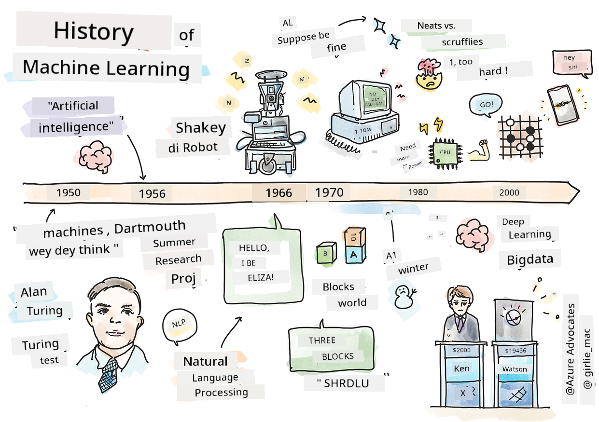

<!--
CO_OP_TRANSLATOR_METADATA:
{
  "original_hash": "6a05fec147e734c3e6bfa54505648e2b",
  "translation_date": "2025-11-18T18:24:32+00:00",
  "source_file": "1-Introduction/2-history-of-ML/README.md",
  "language_code": "pcm"
}
-->
# History of machine learning

> Sketchnote by [Tomomi Imura](https://www.twitter.com/girlie_mac)

## [Pre-lecture quiz](https://ff-quizzes.netlify.app/en/ml/)

---

> 🎥 Click di image wey dey up for short video wey go explain dis lesson.

For dis lesson, we go waka through di big milestones for di history of machine learning and artificial intelligence.

Di history of artificial intelligence (AI) as one field dey join body with di history of machine learning, because di algorithms and di computational progress wey dey support ML na im help AI development. E good make we remember say, even though dis fields as separate areas of study start to dey clear for di 1950s, important [algorithmic, statistical, mathematical, computational and technical discoveries](https://wikipedia.org/wiki/Timeline_of_machine_learning) don dey before and dey overlap dis time. In fact, people don dey reason dis kind questions for [hundreds of years](https://wikipedia.org/wiki/History_of_artificial_intelligence): dis article dey talk about di historical intellectual foundation of di idea of 'thinking machine.'

---
## Notable discoveries

- 1763, 1812 [Bayes Theorem](https://wikipedia.org/wiki/Bayes%27_theorem) and di things wey dey before am. Dis theorem and di way dem dey use am dey explain inference, how probability of one event fit happen based on wetin we sabi before.
- 1805 [Least Square Theory](https://wikipedia.org/wiki/Least_squares) by French mathematician Adrien-Marie Legendre. Dis theory, wey you go learn for our Regression unit, dey help for data fitting.
- 1913 [Markov Chains](https://wikipedia.org/wiki/Markov_chain), wey dem name after Russian mathematician Andrey Markov, dey describe sequence of possible events based on di state wey dey before.
- 1957 [Perceptron](https://wikipedia.org/wiki/Perceptron) na one type of linear classifier wey American psychologist Frank Rosenblatt invent, e dey support di progress for deep learning.

---

- 1967 [Nearest Neighbor](https://wikipedia.org/wiki/Nearest_neighbor) na algorithm wey dem first design to map routes. For ML, e dey help detect patterns.
- 1970 [Backpropagation](https://wikipedia.org/wiki/Backpropagation) dey train [feedforward neural networks](https://wikipedia.org/wiki/Feedforward_neural_network).
- 1982 [Recurrent Neural Networks](https://wikipedia.org/wiki/Recurrent_neural_network) na artificial neural networks wey dem derive from feedforward neural networks wey dey create temporal graphs.

✅ Do small research. Which other dates dey important for di history of ML and AI?

---
## 1950: Machines wey dey think

Alan Turing, one person wey dey very remarkable, wey people vote [for 2019](https://wikipedia.org/wiki/Icons:_The_Greatest_Person_of_the_20th_Century) as di greatest scientist for di 20th century, na im dem dey credit say e help lay di foundation for di concept of 'machine wey fit think.' E face people wey no gree and e own need for evidence of dis concept by creating di [Turing Test](https://www.bbc.com/news/technology-18475646), wey you go learn for our NLP lessons.

---
## 1956: Dartmouth Summer Research Project

"Di Dartmouth Summer Research Project on artificial intelligence na one big event for artificial intelligence as one field," and na here dem coin di term 'artificial intelligence' ([source](https://250.dartmouth.edu/highlights/artificial-intelligence-ai-coined-dartmouth)).

> Every aspect of learning or any other feature of intelligence fit dey described well well so dat machine fit dey simulate am.

---

Di lead researcher, mathematics professor John McCarthy, hope "to proceed based on di idea say every aspect of learning or any other feature of intelligence fit dey described well well so dat machine fit dey simulate am." Di participants include another big name for di field, Marvin Minsky.

Di workshop dey credit say e start and encourage plenty discussions like "di rise of symbolic methods, systems wey focus on limited domains (early expert systems), and deductive systems versus inductive systems." ([source](https://wikipedia.org/wiki/Dartmouth_workshop)).

---
## 1956 - 1974: "Di golden years"

From di 1950s go reach di mid '70s, hope dey high say AI fit solve plenty problems. For 1967, Marvin Minsky talk confidently say "Within one generation ... di problem of creating 'artificial intelligence' go dey solved well well." (Minsky, Marvin (1967), Computation: Finite and Infinite Machines, Englewood Cliffs, N.J.: Prentice-Hall)

Natural language processing research dey grow, search dey improve and dey more powerful, and di concept of 'micro-worlds' dey created, where simple tasks dey completed using plain language instructions.

---

Research dey well funded by government agencies, progress dey for computation and algorithms, and prototypes of intelligent machines dey built. Some of dis machines include:

* [Shakey di robot](https://wikipedia.org/wiki/Shakey_the_robot), wey fit move and decide how e go do tasks 'intelligently'.

    
    > Shakey for 1972

---

* Eliza, one early 'chatterbot', fit talk with people and act like one basic 'therapist'. You go learn more about Eliza for di NLP lessons.

    
    > One version of Eliza, one chatbot

---

* "Blocks world" na example of micro-world where blocks fit dey stacked and sorted, and experiments to teach machines how to make decisions fit dey tested. Progress wey dem build with libraries like [SHRDLU](https://wikipedia.org/wiki/SHRDLU) help push language processing forward.

    

    > 🎥 Click di image wey dey up for video: Blocks world with SHRDLU

---
## 1974 - 1980: "AI Winter"

By di mid 1970s, e don clear say di complexity of making 'intelligent machines' don dey underestimated and di promise, based on di available compute power, don dey overhyped. Funding stop and confidence for di field slow down. Some issues wey affect confidence include:
---
- **Limitations**. Compute power no dey enough.
- **Combinatorial explosion**. Di number of parameters wey need training dey grow plenty as more dey asked of computers, without compute power and capability wey dey grow alongside.
- **Paucity of data**. Data no plenty enough to test, develop, and refine algorithms.
- **We dey ask di right questions?**. Di questions wey dem dey ask start to dey questioned. Researchers start to face criticism about di way dem dey approach di matter:
  - Turing tests dey questioned by ideas like di 'chinese room theory' wey talk say, "programming one digital computer fit make am look like e understand language but e no fit produce real understanding." ([source](https://plato.stanford.edu/entries/chinese-room/))
  - Di ethics of introducing artificial intelligences like di "therapist" ELIZA into society dey challenged.

---

At di same time, different AI schools of thought start to form. One division dey between ["scruffy" vs. "neat AI"](https://wikipedia.org/wiki/Neats_and_scruffies) practices. _Scruffy_ labs dey tweak programs for hours until dem get di result wey dem want. _Neat_ labs "dey focus on logic and formal problem solving". ELIZA and SHRDLU na popular _scruffy_ systems. For di 1980s, as demand grow to make ML systems reproducible, di _neat_ approach gradually take front because e result dey more explainable.

---
## 1980s Expert systems

As di field dey grow, e benefit to business dey clear, and for di 1980s di spread of 'expert systems' dey increase. "Expert systems na di first successful forms of artificial intelligence (AI) software." ([source](https://wikipedia.org/wiki/Expert_system)).

Dis type of system na _hybrid_, e get rules engine wey dey define business requirements, and inference engine wey dey use di rules system to find new facts.

Dis time also see more attention for neural networks.

---
## 1987 - 1993: AI 'Chill'

Di spread of specialized expert systems hardware get one bad effect, e dey too specialized. Di rise of personal computers dey compete with dis big, specialized, centralized systems. Di democratization of computing don start, and e later open road for di modern explosion of big data.

---
## 1993 - 2011

Dis time bring new era for ML and AI to fit solve some of di problems wey lack of data and compute power cause before. Di amount of data start to grow fast and dey more available, for better and for worse, especially as smartphone show around 2007. Compute power grow plenty, and algorithms dey evolve alongside. Di field start to mature as di freewheeling days of di past dey turn into one true discipline.

---
## Now

Today machine learning and AI dey touch almost every part of our lives. Dis time dey call for careful understanding of di risks and di possible effects of dis algorithms on human lives. As Microsoft's Brad Smith talk, "Information technology dey bring issues wey dey go di heart of fundamental human-rights protections like privacy and freedom of expression. Dis issues dey increase di responsibility for tech companies wey dey create dis products. For our view, dem also dey call for thoughtful government regulation and for di development of norms around acceptable uses" ([source](https://www.technologyreview.com/2019/12/18/102365/the-future-of-ais-impact-on-society/)).

---

E still dey remain to see wetin di future go bring, but e dey important to understand dis computer systems and di software and algorithms wey dem dey run. We hope say dis curriculum go help you understand better so you fit decide for yourself.

> 🎥 Click di image wey dey up for video: Yann LeCun dey talk about di history of deep learning for dis lecture

---
## 🚀Challenge

Look into one of dis historical moments and learn more about di people wey dey behind am. Di characters dey interesting, and no scientific discovery dey happen for one cultural vacuum. Wetin you discover?

## [Post-lecture quiz](https://ff-quizzes.netlify.app/en/ml/)

---
## Review & Self Study

Here be things to watch and listen to:

[Dis podcast wey Amy Boyd dey talk about di evolution of AI](http://runasradio.com/Shows/Show/739)

---

## Assignment

[Create one timeline](assignment.md)

---

<!-- CO-OP TRANSLATOR DISCLAIMER START -->
**Disclaimer**:  
Dis docu wey you dey see don use AI translation service [Co-op Translator](https://github.com/Azure/co-op-translator) take translate am. Even though we dey try make sure say e correct, abeg no forget say machine translation fit get mistake or no too accurate. Di original docu for di language wey dem first write am na di main correct one. If na important matter, e go better make you use professional human translation. We no go fit take blame for any misunderstanding or wrong interpretation wey fit happen because you use dis translation.
<!-- CO-OP TRANSLATOR DISCLAIMER END -->