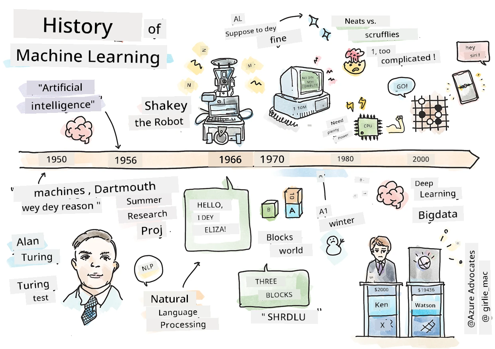
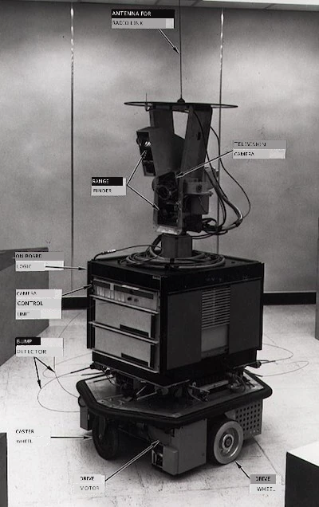
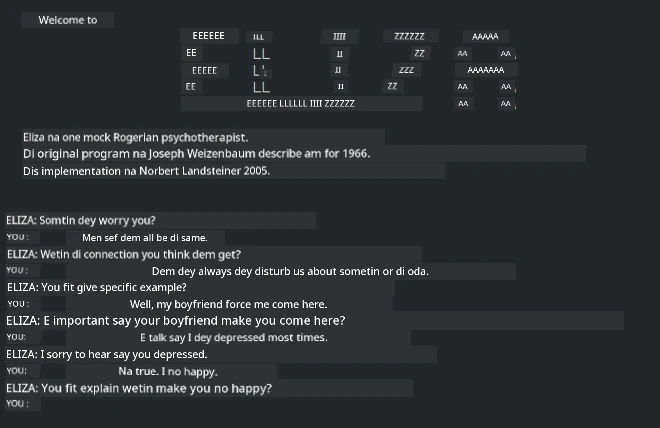

# History of machine learning

> Sketchnote by [Tomomi Imura](https://www.twitter.com/girlie_mac)

## [Pre-lecture quiz](https://ff-quizzes.netlify.app/en/ml/)

---

> 🎥 Click the image above for a short video working through this lesson.

For dis lesson, we go waka through di main milestones inside di history of machine learning and artificial intelligence.

Di history of artificial intelligence (AI) as one field combine with di history of machine learning, because di algorithms and computer advances wey dey support ML help for di development of AI. E good make you remember say, even if dis fields as separate things start clear for 1950s, important [algorithmic, statistical, mathematical, computational and technical discoveries](https://wikipedia.org/wiki/Timeline_of_machine_learning) happen before and around dat time. For real, people don dey reason these things for [hundreds of years](https://wikipedia.org/wiki/History_of_artificial_intelligence): dis article talk about di old brain ideas behind di 'thinking machine' concept.

---
## Notable discoveries

- 1763, 1812 [Bayes Theorem](https://wikipedia.org/wiki/Bayes%27_theorem) and dia predecessors. Dis theorem and wetin e fit do na di foundation of inference, wey yarn di chance of wetin fit happen based on wetin we sabi before.
- 1805 [Least Square Theory](https://wikipedia.org/wiki/Least_squares) by French mathematician Adrien-Marie Legendre. Dis theory, wey you go learn about for our Regression unit, dey help data fitting.
- 1913 [Markov Chains](https://wikipedia.org/wiki/Markov_chain), wey get name from Russian mathematician Andrey Markov, dey describe sequence of things wey fit happen based on say one thing happen before.
- 1957 [Perceptron](https://wikipedia.org/wiki/Perceptron) na one kind linear classifier wey American psychologist Frank Rosenblatt invent, e follow make deep learning better.

---

- 1967 [Nearest Neighbor](https://wikipedia.org/wiki/Nearest_neighbor) na algorithm wey dem first design to map roads. For ML, e dey used to find patterns.
- 1970 [Backpropagation](https://wikipedia.org/wiki/Backpropagation) na method to train [feedforward neural networks](https://wikipedia.org/wiki/Feedforward_neural_network).
- 1982 [Recurrent Neural Networks](https://wikipedia.org/wiki/Recurrent_neural_network) na kain artificial neural networks wey come from feedforward neural networks wey fit create time-based graph.

✅ Do small research. Which other dates stand out as important for di history of ML and AI?

---
## 1950: Machines wey fit think

Alan Turing, man wey well well and who di people vote [by di public for 2019](https://wikipedia.org/wiki/Icons:_The_Greatest_Person_of_the_20th_Century) as di best scientist of di 20th century, na im get credit for helping set di base for di idea of 'machine wey fit think.' E fight with people weh no believe and e need proof for dis idea partly by making [Turing Test](https://www.bbc.com/news/technology-18475646), wey you go see for our NLP lessons.

---
## 1956: Dartmouth Summer Research Project

"Di Dartmouth Summer Research Project on artificial intelligence na important event for AI as one field," and na there dem first call di thing 'artificial intelligence' ([source](https://250.dartmouth.edu/highlights/artificial-intelligence-ai-coined-dartmouth)).

> Every part of learning or any other intelligence fit be talk true well well so dat machine fit do am like e be true.

---

Di main researcher, math professor John McCarthy, hope say "dem fit move near di belief say every part of learning or any other intelligence fit be talk true well well so dat machine fit do am like e be true." People wey join join na other big brain for di field, Marvin Minsky.

Di workshop get credit for starting and supporting plenty talks inside AI like "di rise of symbolic methods, systems wey focus on small areas (early expert systems), and deductive systems vs inductive systems." ([source](https://wikipedia.org/wiki/Dartmouth_workshop)).

---
## 1956 - 1974: "The golden years"

From di 1950s go hit mid 70s, hope high say AI go fit solve many many wahala. For 1967, Marvin Minsky talk sure sure say "Within a generation ... di problem of making 'artificial intelligence' go mostly solve." (Minsky, Marvin (1967), Computation: Finite and Infinite Machines, Englewood Cliffs, N.J.: Prentice-Hall)

Natural language processing research grow well well, search improve and powerful, and di idea of 'micro-worlds' come out, wey simple tasks fit get done with basic language commands.

---

Research get correct money from government, computation and algorithms improve, and intelligent machine prototypes get build. Some of dia machines na:

* [Shakey the robot](https://wikipedia.org/wiki/Shakey_the_robot), wey fit waka and decide how to do things 'intelligently'.

    
    > Shakey for 1972

---

* Eliza, one early 'chatterbot', fit tok with people and act like one simple 'therapist'. You go learn more about Eliza in di NLP lessons.

    
    > One version of Eliza, one chatbot

---

* "Blocks world" na example of small-world where blocks fit stack and sort, and dem fit test teaching machine how to make decisions. Progress wey come from libraries like [SHRDLU](https://wikipedia.org/wiki/SHRDLU) help grammar processing waka well.

    

    > 🎥 Click di picture above for video: Blocks world with SHRDLU

---
## 1974 - 1980: "AI Winter"

By mid 1970s, e don clear say di wahala to build 'intelligent machines' big pass as e look, and di hope wey dem get finish because di computer power dem get no too enough. Money finish and faith for di field slow down. Some of di problems wey kill confidence na:
---
- **Limitations**. Computer power no too strong.
- **Combinatorial explosion**. Di amount of parameters wey dem gats train grow kpata kpata as dem ask computer make dem do more, but computer power no grow.
- **Paucity of data**. No get enough data wey fit help for testing, building, and fixing algorithms.
- **We dey ask di correct questions?**. Di questions wey dem dey ask start to be question themselves. Researchers start to face criticism about their method:
  - Turing tests start get question marks through ideas like 'chinese room theory' wey talk say, "programming digital computer fit make e look like e understand language but e no fit truly understand." ([source](https://plato.stanford.edu/entries/chinese-room/))
  - Ethics to put artificial intelligences like "therapist" ELIZA inside society get wahala.

---

For dis same time, different AI schools come out. Dem divide between ["scruffy" vs. "neat AI"](https://wikipedia.org/wiki/Neats_and_scruffies) style. _Scruffy_ labs dey fix programs till dem get wetin dem want. _Neat_ labs dey focus for logic and proper problem solving. ELIZA and SHRDLU be popular _scruffy_ systems. For 1980s, as demand come to make ML systems fit repeat, _neat_ style begin win as e results dey easy to explain.

---
## 1980s Expert systems

As di field grow, im benefit for business show well, and for 1980s expert systems spread. "Expert systems na some of di first real successful forms of artificial intelligence (AI) software." ([source](https://wikipedia.org/wiki/Expert_system)).

Dis kind system be _hybrid_, e get part rules engine wey define business needs, and inference engine wey use di rules make new facts.

For dis time, neural networks begin get better attention.

---
## 1987 - 1993: AI 'Chill'

Di spread of specialized expert systems hardware make dem too specialized. Increase of personal computers compete with these big, special, centralized systems. Computing dem begin open to everybody, and dat waka open road for big data boom.

---
## 1993 - 2011

Dis time mark new chapter for ML and AI as dem fit solve some problems wey create before when no get enough data and computing power. Data full ground quick quick and people begin get am everywhere, good and bad, especially with smartphone wey show around 2007. Computing power increase kpata kpata, algorithms dey also grow. Di field begin mature as di free days don start become real discipline.

---
## Now

Today machine learning and AI dey touch almost every side of our lives. Dis time demand say we understand good good the risks and how these algorithms fit affect human lives. As Microsoft's Brad Smith talk, "Information technology dey raise questions wey concern core human-right protections like privacy and freedom of expression. Dis kain issues put more work for tech companies wey make these products. For us, e still mean say government must think well to make rules and create norms for how dem suppose use am" ([source](https://www.technologyreview.com/2019/12/18/102365/the-future-of-ais-impact-on-society/)).

---

E still dey unknown wetin future go bring, but e important make we understand these computer systems and di software and algorithms wey dey run dem. We hop say dis curriculum go help you sabi am well make you fit decide for yourself.

> 🎥 Click di picture above for video: Yann LeCun dey explain di history of deep learning for dis lecture

---
## 🚀Challenge

Make you dig inside one of these historic moment and learn more about di people behind am. Dem get interesting character dem, and no scientific discovery ever happen for cultural vacuum. Wetin you discover?

## [Post-lecture quiz](https://ff-quizzes.netlify.app/en/ml/)

---
## Review & Self Study

Here na di things wey you fit watch and listen to:

[Dis podcast wey Amy Boyd discuss di evolution of AI](http://runasradio.com/Shows/Show/739)

---

## Assignment

[Make one timeline](assignment.md)

---

<!-- CO-OP TRANSLATOR DISCLAIMER START -->
**Disclaimer**:
Dis document don translate wit AI translation service [Co-op Translator](https://github.com/Azure/co-op-translator). Even tho we dey try make am correct, abeg make you know say automated translation fit get errors or mistakes. Di original document for dia own language na im be di correct source. For important info, make person wey sabi human translation do am. We no go responsible for any misunderstanding or wrong understanding wey fit happen because of dis translation.
<!-- CO-OP TRANSLATOR DISCLAIMER END -->