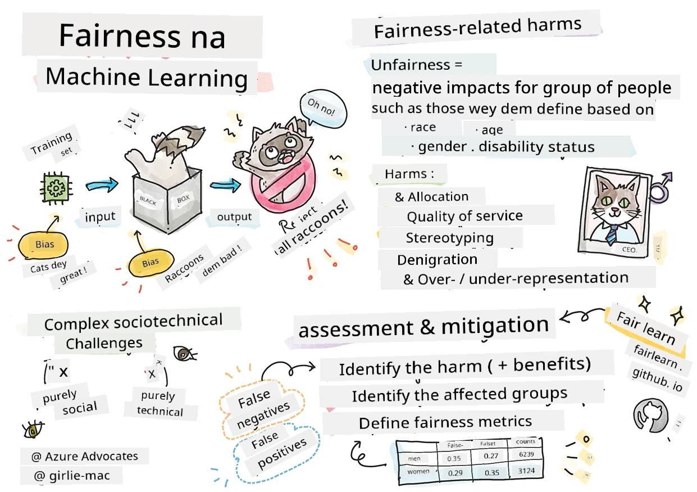
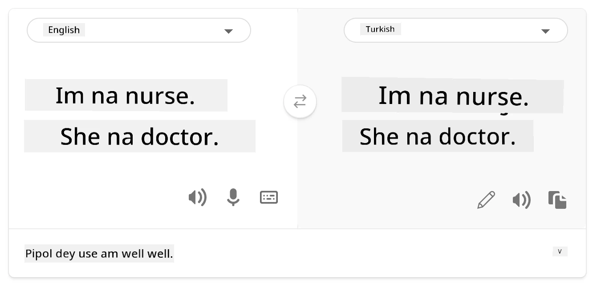
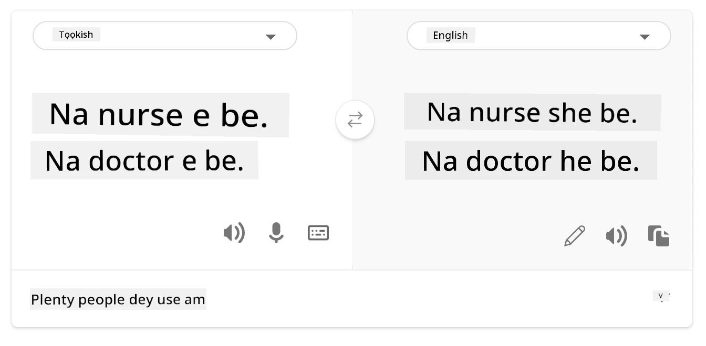
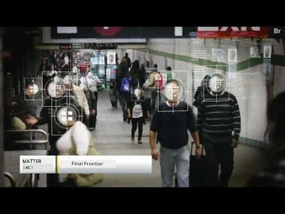

# Di Build Machine Learning solutions with responsible AI
 

> Sketchnote by [Tomomi Imura](https://www.twitter.com/girlie_mac)

## [Pre-lecture quiz](https://ff-quizzes.netlify.app/en/ml/)
 
## Introduction

For dis curriculum, you go start to discover how machine learning fit impact and dey impact our everyday life. Even now, systems and models dey involved for daily decision-making tasks, like health care diagnoses, loan approvals or detecting fraud. So, e important say make these models dey work well to deliver results wey people fit trust. Just like any software application, AI systems fit miss expectations or get bad outcome. Na why e dey important to fit sabi and explain how AI model dey behave.

Imagine wetin fit happen if di data wey you dey use to build these models no get some people groups, like race, gender, political view, religion, or if e too represent some groups pass others. Wetin if di model result show say e dey favor some group? Wetin dat mean for di app? Plus, wetin fit happen if di model run bad and e harm people? Who suppose take charge for di AI system behavior? Na some questions we go tok about for dis curriculum.

For dis lesson, you go:

- Make you sabi why fairness be important for machine learning and the harm wey fit come from unfairness.
- Make you dey familiar with how to find outliers and unusual situations to make sure sey everything go well and safe.
- Understand why e necessary to make sure say we design systems wey include everybody.
- Explore why e important to protect data and people privacy and security.
- See why e good to get clear way to explain how AI models dey behave.
- Remember say accountability na key to build trust for AI systems.

## Prerequisite

As prerequisite, abeg make you do the "Responsible AI Principles" Learn Path and watch di video wey dey below about di topic:

Learn more about Responsible AI by following this [Learning Path](https://docs.microsoft.com/learn/modules/responsible-ai-principles/?WT.mc_id=academic-77952-leestott)

> 🎥 Click the image above for a video: Microsoft's Approach to Responsible AI

## Fairness

AI systems suppose treat everybody fair and no make different groups of people suffer different kain wahala. For example, if AI systems dey show guidance on medical treatment, loan applications, or work, dem suppose recommend the same thing to everyone wey get similar symptoms, financial situation, or qualifications. Every one of us as human get bias wey we inherit wey affect how we dey decide and act. These biases fit show for data wey we use train AI systems. Sometimes, dis kain manipulation no be done on purpose. E hard to sabi when you dey put bias for data without wahala.

**“Unfairness”** mean di negative effect, or “harm”, wey fit happen to group of people like dem wey be defined by race, gender, age, or disability. The main fairness wahala fit be:

- **Allocation**, if gender or ethnicity dem for example dey favored pass others.
- **Quality of service**. If you train data for one kain situation but the real thing na complex pass, e go make service poor. For example, one hand soap dispenser wey no fit sabi people with dark skin. [Reference](https://gizmodo.com/why-cant-this-soap-dispenser-identify-dark-skin-1797931773)
- **Denigration**. To unfairly talk bad or label something or someone. Like how one image labeling system misslabel images of dark-skinned people as gorillas.
- **Over- or under- representation**. The idea be say some group no dey some profession, and if any service or function dey promote dis, e dey cause harm.
- **Stereotyping**. To join one group with certain qualities wey people don pre-decide. For example, one language translation system between English and Turkish fit get mistake because some words get stereotypical links to gender.

> translation to Turkish

> translation back to English

When you dey design and test AI system, e good to make sure say AI dey fair and no program make am do biased or discriminatory decisions, wey humans also no suppose do. Make AI and machine learning fair still get serious challenge for society and technology. 

### Reliability and safety

To make people trust dem, AI systems need to be reliable, safe, and steady for normal and unexpected situations. E important to know how AI systems go behave for different situations, especially for outliers. When we dey build AI solutions, we must focus well on how to handle all kinds different situation wey AI fit face. For example, self-driving car suppose put people's safety first. So, the AI inside the car must think about all possible things wey fit happen like night, thunderstorm or blizzard, pikin wey dey run cross road, animals, road work, and so on. How well AI system handle all these things fit show how well data scientist or AI developer plan am from the start.  

> [🎥 Click the here for a video: ](https://www.microsoft.com/videoplayer/embed/RE4vvIl)

### Inclusiveness

AI systems suppose dey design to involve and empower everybody. When data scientists and AI developers dey design and put AI systems, dem go find and fix any barrier wey fit stop people from using the system. For example, 1 billion people get disabilities for di world. With AI progress, dem fit reach plenty info and chance easier for their daily life. If we fix barriers, e go create chance to make better AI products wey go benefit everybody. 

> [🎥 Click the here for a video: inclusiveness in AI](https://www.microsoft.com/videoplayer/embed/RE4vl9v)

### Security and privacy 

AI systems suppose dey safe and respect people privacy. People no dey trust systems wey fit threaten their privacy, info, or life. When we dey train machine learning models, we dey rely on data to make better results. But we must think about where data come from and if e trustworthy. For example, data fit be user submitted or public data. As we dey work with data, e important to make AI systems wey fit protect secret info and resist attacks. As AI dey increase, to protect privacy and keep important personal and business info safe na serious and hard work. Privacy and data security matter well well for AI because AI need data to make correct and informed prediction and decisions about people.

> [🎥 Click the here for a video: security in AI](https://www.microsoft.com/videoplayer/embed/RE4voJF)

- As an industry we don make big progress for Privacy & security, especially with laws like GDPR (General Data Protection Regulation). 
- But for AI systems we must know say e dey tension between needing more personal data to make systems better and the need for privacy. 
- Just like how internet bring more security problems, AI dey bring more security challenges too. 
- But AI dey also help improve security. For example, many modern anti-virus scanners dey use AI heuristics now. 
- We suppose make sure say our Data Science process go well with the latest privacy and security practices. 

### Transparency
AI systems suppose dey easy to understand. One important part of transparency na to explain how AI systems and their parts dey behave. To improve understanding of AI systems, stakeholders must sabi how and why dem dey work so dem fit find any performance wahala, safety and privacy risks, bias, exclusion, or unintended outcomes. We also believe say people wey use AI systems suppose dey honest about when, why, and how dem choose to use am. Plus the limits of the system dem dey use. For example, if bank dey use AI to help them decide who to lend money, e important to check di results and sabi which data affect the AI system recommendations. Governments don begin dey regulate AI for different industries so data scientists and organizations must fit show if AI system meet regulation, especially if e get bad result.

> [🎥 Click the here for a video: transparency in AI](https://www.microsoft.com/videoplayer/embed/RE4voJF)

- Because AI systems complex well well, e hard to understand how dem work and explain results. 
- This kain lack of understanding affect how dem dey manage, operate, and document these systems. 
- More importantly, this lack of understanding affect decisions wey people dey make from the results wey AI systems produce. 

### Accountability 
 
People wey design and deploy AI systems must take responsibility for how their systems dey work. Accountability matter plenty for sensitive tech like facial recognition. Recently, demand for facial recognition don grow, especially for law enforcement wey dey find missing pikin. But this technology fit also be used by government to put people fundamental freedoms for risk like continuous surveillance on particular people. So, data scientists and organizations must be responsible for how their AI systems impact people or society.

> 🎥 Click the image above for a video: Warnings of Mass Surveillance Through Facial Recognition 

At last, one big question for our generation, as di first wey dey bring AI to society, be how to make sure say computers go still take responsibility to people and how to make sure people wey design the computers go still get responsibility to everybody else.

## Impact assessment 

Before you train machine learning model, e important to do impact assessment to understand why AI system dey build; how e go take work; where dem go put am; and who go dey interact with am. This go help testers or reviewers sabi wetin to consider when dem dey check risk and wetin fit happen.

These be wetin you suppose focus on when you dey do impact assessment:

* **Adverse impact on individuals**. Make you sabi if any restriction or condition, unsupported use or limitation fit make system no work well. This go help make sure system no harm individuals.
* **Data requirements**. Make you understand how and where system go use data to help reviewers check data requirements (like GDPR or HIPAA). Also check if data source or quantity enough for training.
* **Summary of impact**. List all possible harm wey fit happen because of system use. For whole ML lifecycle, check if these issues dem try fix.
* **Applicable goals** for all six core principles. Check if goals of each principle don meet and if any gap dey.

## Debugging with responsible AI  

Like how you go take debug software app, debugging AI system na important way to find and fix wahala for system. Plenty things fit cause model no perform well or no dey responsible. Most normal model performance metrics na just number wey just sum model performance which no fit show how model fit break responsible AI principles. Plus, machine learning model na black box wey hard to sabi wetin dey cause result or explain when e make mistake. Later for this course, we go learn how to use Responsible AI dashboard to help debug AI systems. Dashboard na a tool wey data scientists and AI developers go use to do:

* **Error analysis**. To find error pattern wey fit affect system fairness or reliability.
* **Model overview**. To find difference for model performance for different data groups.
* **Data analysis**. To understand data pattern and find any bias wey fit cause fairness, inclusiveness, and reliability problems.
* **Model interpretability**. To understand wetin affect or influence model prediction. Dis dey help explain model behavior, wey important for transparency and accountability.

## 🚀 Challenge 
 
To stop harms from showing at first, we suppose: 

- get different kinds background and perspectives among people wey dey work on systems 
- invest in datasets wey show the diversity of our society 
- develop better ways throughout machine learning life cycle to find and fix responsible AI problems when e happen 

Think about real life situations wey model no fit be trusted for building and use. Wetin else we suppose consider? 

## [Post-lecture quiz](https://ff-quizzes.netlify.app/en/ml/)

## Review & Self Study 
 

For dis lesson, you don learn some basics about di tins dem wey concern fairness and unfairness for machine learning.  
 
Make you watch dis workshop make you fit sabi di matter well-well: 

- For di chase of responsible AI: How to take principles put for practice by Besmira Nushi, Mehrnoosh Sameki and Amit Sharma

> 🎥 Click di picture wey dey above for video: RAI Toolbox: An open-source framework for building responsible AI by Besmira Nushi, Mehrnoosh Sameki, and Amit Sharma

E good make you read: 

- Microsoft RAI resource center: [Responsible AI Resources – Microsoft AI](https://www.microsoft.com/ai/responsible-ai-resources?activetab=pivot1%3aprimaryr4) 

- Microsoft FATE research group: [FATE: Fairness, Accountability, Transparency, and Ethics in AI - Microsoft Research](https://www.microsoft.com/research/theme/fate/) 

RAI Toolbox: 

- [Responsible AI Toolbox GitHub repository](https://github.com/microsoft/responsible-ai-toolbox)

Read about Azure Machine Learning tool dem wey dey help hold fairness:

- [Azure Machine Learning](https://docs.microsoft.com/azure/machine-learning/concept-fairness-ml?WT.mc_id=academic-77952-leestott) 

## Assignment

[Explore RAI Toolbox](assignment.md)

---

<!-- CO-OP TRANSLATOR DISCLAIMER START -->
**Disclaimer**:
Dis document don translate wit AI translation service [Co-op Translator](https://github.com/Azure/co-op-translator). Even tho we dey try make am correct, abeg make you know say automated translation fit get errors or mistakes. Di original document for dia own language na im be di correct source. For important info, make person wey sabi human translation do am. We no go responsible for any misunderstanding or wrong understanding wey fit happen because of dis translation.
<!-- CO-OP TRANSLATOR DISCLAIMER END -->