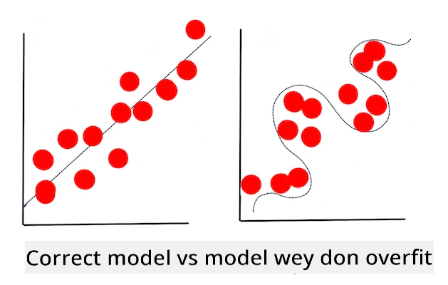

<!--
CO_OP_TRANSLATOR_METADATA:
{
  "original_hash": "9d91f3af3758fdd4569fb410575995ef",
  "translation_date": "2025-11-18T18:26:10+00:00",
  "source_file": "1-Introduction/4-techniques-of-ML/README.md",
  "language_code": "pcm"
}
-->
# Techniques of Machine Learning

Di process wey dem dey use build, use, and maintain machine learning models and di data wey dem dey use no be di same as oda development workflows. For dis lesson, we go break di process down, and show di main techniques wey you need sabi. You go:

- Understand di processes wey dey under machine learning for high level.
- Check base concepts like 'models', 'predictions', and 'training data'.

## [Pre-lecture quiz](https://ff-quizzes.netlify.app/en/ml/)

> 🎥 Click di image wey dey up to watch short video wey explain dis lesson.

## Introduction

For high level, di work wey dem dey do to create machine learning (ML) processes get plenty steps:

1. **Decide di question**. Most ML processes dey start by asking question wey no fit get answer with simple conditional program or rules-based engine. Dis kind question dey usually about predictions based on data wey dem collect.
2. **Collect and prepare data**. To fit answer your question, you need data. Di quality and sometimes di quantity of your data go determine how well you fit answer di question. To see di data well, you go need visualize am. Dis phase still include how you go divide di data into training and testing group to build di model.
3. **Choose training method**. Based on your question and di kind data wey you get, you go choose how you wan train di model to fit reflect di data well and make correct predictions. Dis part of ML process need special skill and sometimes plenty trial and error.
4. **Train di model**. With your training data, you go use different algorithms to train di model to sabi di patterns wey dey di data. Di model fit use internal weights wey dem fit adjust to focus on some parts of di data to make di model better.
5. **Evaluate di model**. You go use data wey di model never see before (your testing data) to check how di model dey perform.
6. **Parameter tuning**. Based on how di model perform, you fit start di process again with different parameters or variables wey dey control di behavior of di algorithms wey dem use train di model.
7. **Predict**. Use new inputs to test di accuracy of your model.

## Wetin you go ask?

Computers sabi well well how to find hidden patterns for data. Dis skill dey help researchers wey get questions about one area wey no fit get answer with conditionally-based rules engine. For example, if dem wan calculate di life expectancy of smokers vs non-smokers, data scientist fit create rules for am.

But if di question get plenty variables, ML model fit dey more efficient to predict future life expectancy based on past health history. Another example fit be to predict weather for April for one place based on data like latitude, longitude, climate change, how close di place dey to di ocean, jet stream patterns, and more.

✅ Dis [slide deck](https://www2.cisl.ucar.edu/sites/default/files/2021-10/0900%20June%2024%20Haupt_0.pdf) about weather models dey give historical perspective on how dem dey use ML for weather analysis.  

## Before you start to build

Before you start to build your model, you go need do some tasks. To test your question and form hypothesis based on di model predictions, you go need identify and set some things.

### Data

To fit answer your question well, you need plenty data wey dey correct. You go do two things for dis stage:

- **Collect data**. Remember di lesson wey we talk about fairness for data analysis, collect your data well. Know di source of di data, any bias wey fit dey inside, and write down where you get am from.
- **Prepare data**. Di process to prepare data get steps. You fit need join data together and normalize am if e come from different sources. You fit improve di quality and quantity of di data by converting strings to numbers (like we do for [Clustering](../../5-Clustering/1-Visualize/README.md)). You fit still generate new data from di original one (like we do for [Classification](../../4-Classification/1-Introduction/README.md)). You fit clean and edit di data (like we go do before di [Web App](../../3-Web-App/README.md) lesson). Finally, you fit need randomize and shuffle di data, depending on di training techniques.

✅ After you don collect and process your data, check if di shape of di data go fit help you answer di question wey you wan solve. E fit be say di data no go work well for di task, like we see for our [Clustering](../../5-Clustering/1-Visualize/README.md) lessons!

### Features and Target

[Feature](https://www.datasciencecentral.com/profiles/blogs/an-introduction-to-variable-and-feature-selection) na measurable property of your data. For many datasets, e dey show as column heading like 'date', 'size', or 'color'. Your feature variable, wey dem dey usually represent as `X` for code, na di input variable wey dem go use train di model.

Target na di thing wey you wan predict. Dem dey usually represent target as `y` for code, and e dey answer di question wey you dey ask from your data: for December, which **color** of pumpkin go cheap pass? For San Francisco, which neighborhood go get di best real estate **price**? Sometimes, dem dey call target label attribute.

### How to choose your feature variable

🎓 **Feature Selection and Feature Extraction** How you go sabi which variable to choose when you dey build model? You go probably go through process of feature selection or feature extraction to choose di correct variables for di best model. But dem no be di same thing: "Feature extraction dey create new features from functions of di original features, but feature selection dey return subset of di features." ([source](https://wikipedia.org/wiki/Feature_selection))

### Visualize your data

One important tool wey data scientist dey use na di power to visualize data with libraries like Seaborn or MatPlotLib. To show your data visually fit help you see hidden correlations wey you fit use. Your visualizations fit still help you see bias or unbalanced data (like we see for [Classification](../../4-Classification/2-Classifiers-1/README.md)).

### Split your dataset

Before you train, you go need divide your dataset into two or more parts wey no dey equal but still represent di data well.

- **Training**. Dis part of di dataset na di one wey you go use train di model. E dey make up di majority of di original dataset.
- **Testing**. Test dataset na independent group of data, wey you go use check di performance of di model wey you don build.
- **Validating**. Validation set na smaller independent group of examples wey you go use tune di model hyperparameters or architecture to improve di model. Depending on di size of your data and di question wey you dey ask, you fit no need build dis third set (like we talk for [Time Series Forecasting](../../7-TimeSeries/1-Introduction/README.md)).

## How to build model

With your training data, your goal na to build model, or statistical representation of your data, using different algorithms to **train** am. Training di model go expose am to di data and e go make assumptions about di patterns wey e see, validate, and accept or reject.

### Choose training method

Based on your question and di kind data wey you get, you go choose method to train am. If you check [Scikit-learn's documentation](https://scikit-learn.org/stable/user_guide.html) - wey we dey use for dis course - you go see plenty ways to train model. Based on your experience, you fit need try different methods to build di best model. You go likely go through process where data scientists dey check di performance of di model by giving am data wey e never see before, check for accuracy, bias, and oda issues, and choose di best training method for di task.

### Train di model

With your training data, you go 'fit' am to create model. You go notice say for many ML libraries, you go see code like 'model.fit' - na dis time you go send your feature variable as array of values (usually 'X') and target variable (usually 'y').

### Evaluate di model

Once di training process don complete (e fit take many iterations, or 'epochs', to train big model), you go fit evaluate di model quality by using test data to check how e perform. Dis data na subset of di original data wey di model never analyze before. You fit print table of metrics about di model quality.

🎓 **Model fitting**

For machine learning, model fitting mean how accurate di model function dey as e dey try analyze data wey e no sabi.

🎓 **Underfitting** and **overfitting** na common problems wey dey reduce di quality of di model, as di model fit no fit well or e fit too fit. Dis one dey make di model predictions either too close or too far from di training data. Overfit model dey predict training data too well because e don sabi di details and noise of di data too much. Underfit model no dey accurate because e no fit analyze di training data or di data wey e never see well.

> Infographic by [Jen Looper](https://twitter.com/jenlooper)

## Parameter tuning

After your first training, check di quality of di model and think of how you fit improve am by adjusting di 'hyperparameters'. Read more about di process [for di documentation](https://docs.microsoft.com/en-us/azure/machine-learning/how-to-tune-hyperparameters?WT.mc_id=academic-77952-leestott).

## Prediction

Dis na di time wey you go use new data to test di model accuracy. For 'applied' ML setting, where you dey build web assets to use di model for production, dis process fit involve collecting user input (like button press) to set variable and send am to di model for inference or evaluation.

For dis lessons, you go learn how to use dis steps to prepare, build, test, evaluate, and predict - all di work wey data scientist dey do and more, as you dey progress to become 'full stack' ML engineer.

---

## 🚀Challenge

Draw flow chart wey show di steps of ML practitioner. Where you dey now for di process? Where you think say you go get difficulty? Wetin dey easy for you?

## [Post-lecture quiz](https://ff-quizzes.netlify.app/en/ml/)

## Review & Self Study

Search online for interviews with data scientists wey dey talk about their daily work. Here na [one](https://www.youtube.com/watch?v=Z3IjgbbCEfs).

## Assignment

[Interview a data scientist](assignment.md)

---

<!-- CO-OP TRANSLATOR DISCLAIMER START -->
**Disclaimer**:  
Dis dokyument don use AI transleto service [Co-op Translator](https://github.com/Azure/co-op-translator) do di translation. Even as we dey try make am correct, abeg sabi say machine translation fit get mistake or no dey accurate well. Di original dokyument for im native language na di main source wey you go fit trust. For important mata, e good make professional human transleto check am. We no go fit take blame for any misunderstanding or wrong interpretation wey fit happen because you use dis translation.
<!-- CO-OP TRANSLATOR DISCLAIMER END -->