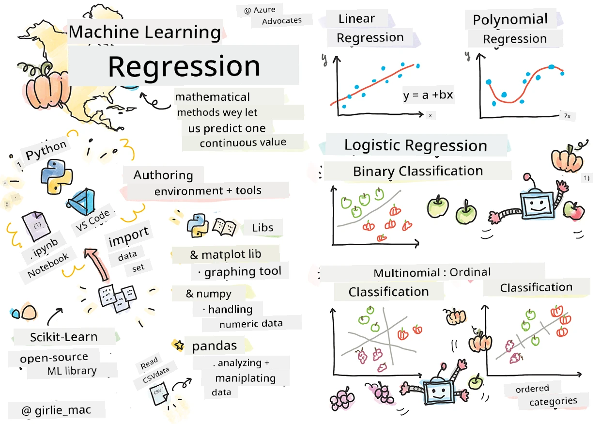
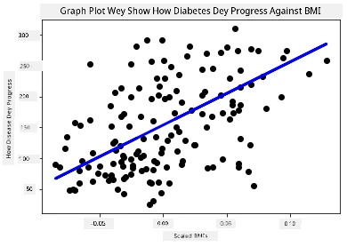

<!--
CO_OP_TRANSLATOR_METADATA:
{
  "original_hash": "fa81d226c71d5af7a2cade31c1c92b88",
  "translation_date": "2025-11-18T18:39:40+00:00",
  "source_file": "2-Regression/1-Tools/README.md",
  "language_code": "pcm"
}
-->
# Start wit Python and Scikit-learn for regression models



> Sketchnote by [Tomomi Imura](https://www.twitter.com/girlie_mac)

## [Pre-lecture quiz](https://ff-quizzes.netlify.app/en/ml/)

> ### [Dis lesson dey available for R!](../../../../2-Regression/1-Tools/solution/R/lesson_1.html)

## Introduction

For dis four lessons, you go learn how to build regression models. We go talk wetin dem dey use am do soon. But before you start anything, make sure say you get all di correct tools wey you need to start di process!

For dis lesson, you go learn how to:

- Set up your computer for local machine learning tasks.
- Work wit Jupyter notebooks.
- Use Scikit-learn, including installation.
- Try linear regression wit one hands-on exercise.

## Installations and configurations

[](https://youtu.be/-DfeD2k2Kj0 "ML for beginners -Setup your tools ready to build Machine Learning models")

> 🎥 Click di image above for one short video wey go show you how to configure your computer for ML.

1. **Install Python**. Make sure say [Python](https://www.python.org/downloads/) dey your computer. You go use Python for plenty data science and machine learning tasks. Most computers already get Python installed. You fit also use [Python Coding Packs](https://code.visualstudio.com/learn/educators/installers?WT.mc_id=academic-77952-leestott) to make setup easy for some people.

   Some Python tasks dey need one version of di software, while others dey need another version. Because of dis, e good to work inside [virtual environment](https://docs.python.org/3/library/venv.html).

2. **Install Visual Studio Code**. Make sure say Visual Studio Code dey your computer. Follow dis instructions to [install Visual Studio Code](https://code.visualstudio.com/) for di basic installation. You go use Python inside Visual Studio Code for dis course, so e go make sense to learn how to [configure Visual Studio Code](https://docs.microsoft.com/learn/modules/python-install-vscode?WT.mc_id=academic-77952-leestott) for Python development.

   > Make yourself comfortable wit Python by working through dis collection of [Learn modules](https://docs.microsoft.com/users/jenlooper-2911/collections/mp1pagggd5qrq7?WT.mc_id=academic-77952-leestott)
   >
   > [](https://youtu.be/yyQM70vi7V8 "Setup Python with Visual Studio Code")
   >
   > 🎥 Click di image above for one video: using Python inside VS Code.

3. **Install Scikit-learn**, by following [dis instructions](https://scikit-learn.org/stable/install.html). Since you need to make sure say you dey use Python 3, e good to use virtual environment. If you dey install dis library for M1 Mac, special instructions dey di page wey dem link above.

4. **Install Jupyter Notebook**. You go need to [install di Jupyter package](https://pypi.org/project/jupyter/).

## Your ML authoring environment

You go use **notebooks** to develop your Python code and create machine learning models. Dis type of file na common tool for data scientists, and you fit identify dem by di suffix or extension `.ipynb`.

Notebooks na interactive environment wey allow di developer to code and add notes plus write documentation around di code. E dey very helpful for experimental or research-oriented projects.

[](https://youtu.be/7E-jC8FLA2E "ML for beginners - Set up Jupyter Notebooks to start building regression models")

> 🎥 Click di image above for one short video wey go show you how to do dis exercise.

### Exercise - work wit notebook

For dis folder, you go see di file _notebook.ipynb_.

1. Open _notebook.ipynb_ inside Visual Studio Code.

   Jupyter server go start wit Python 3+ started. You go see areas for di notebook wey you fit `run`, pieces of code. You fit run one code block by selecting di icon wey look like play button.

2. Select di `md` icon and add small markdown, plus di following text **# Welcome to your notebook**.

   Next, add some Python code.

3. Type **print('hello notebook')** inside di code block.
4. Select di arrow to run di code.

   You go see di printed statement:

    ```output
    hello notebook
    ```


You fit mix your code wit comments to self-document di notebook.

✅ Think small about how web developer working environment dey different from data scientist own.

## Up and running wit Scikit-learn

Now wey Python don dey set up for your local environment, and you don dey comfortable wit Jupyter notebooks, make we also dey comfortable wit Scikit-learn (pronounce am `sci` like `science`). Scikit-learn dey provide [extensive API](https://scikit-learn.org/stable/modules/classes.html#api-ref) to help you do ML tasks.

According to their [website](https://scikit-learn.org/stable/getting_started.html), "Scikit-learn na open source machine learning library wey support supervised and unsupervised learning. E also dey provide different tools for model fitting, data preprocessing, model selection and evaluation, plus many other utilities."

For dis course, you go use Scikit-learn and other tools to build machine learning models to do wetin we dey call 'traditional machine learning' tasks. We don avoid neural networks and deep learning on purpose, as dem dey better covered for our upcoming 'AI for Beginners' curriculum.

Scikit-learn dey make am easy to build models and evaluate dem for use. E dey mainly focus on using numeric data and e get several ready-made datasets wey you fit use as learning tools. E also get pre-built models wey students fit try. Make we explore di process of loading prepackaged data and using one built-in estimator first ML model wit Scikit-learn wit some basic data.

## Exercise - your first Scikit-learn notebook

> Dis tutorial na inspiration from di [linear regression example](https://scikit-learn.org/stable/auto_examples/linear_model/plot_ols.html#sphx-glr-auto-examples-linear-model-plot-ols-py) for Scikit-learn website.

[](https://youtu.be/2xkXL5EUpS0 "ML for beginners - Your First Linear Regression Project in Python")

> 🎥 Click di image above for one short video wey go show you how to do dis exercise.

For di _notebook.ipynb_ file wey dey dis lesson, clear all di cells by pressing di 'trash can' icon.

For dis section, you go work wit one small dataset about diabetes wey dey built into Scikit-learn for learning purposes. Imagine say you wan test one treatment for diabetic patients. Machine Learning models fit help you determine which patients go respond better to di treatment, based on combinations of variables. Even one very basic regression model, when you visualize am, fit show information about variables wey go help you arrange your theoretical clinical trials.

✅ Plenty types of regression methods dey, and di one wey you go pick depend on di answer wey you dey look for. If you wan predict di probable height for person wey get one given age, you go use linear regression, as you dey find **numeric value**. If you wan discover whether one type of food suppose be vegan or not, you dey look for **category assignment** so you go use logistic regression. You go learn more about logistic regression later. Think small about some questions wey you fit ask of data, and which of dis methods go make sense.

Make we start dis task.

### Import libraries

For dis task we go import some libraries:

- **matplotlib**. E dey useful as [graphing tool](https://matplotlib.org/) and we go use am to create line plot.
- **numpy**. [numpy](https://numpy.org/doc/stable/user/whatisnumpy.html) na useful library for handling numeric data inside Python.
- **sklearn**. Dis na di [Scikit-learn](https://scikit-learn.org/stable/user_guide.html) library.

Import some libraries to help wit your tasks.

1. Add imports by typing di following code:

   ```python
   import matplotlib.pyplot as plt
   import numpy as np
   from sklearn import datasets, linear_model, model_selection
   ```

   Above you dey import `matplotlib`, `numpy` and you dey import `datasets`, `linear_model` and `model_selection` from `sklearn`. `model_selection` dey used to split data into training and test sets.

### Di diabetes dataset

Di built-in [diabetes dataset](https://scikit-learn.org/stable/datasets/toy_dataset.html#diabetes-dataset) get 442 samples of data about diabetes, wit 10 feature variables, some of dem include:

- age: age in years
- bmi: body mass index
- bp: average blood pressure
- s1 tc: T-Cells (one type of white blood cells)

✅ Dis dataset get di concept of 'sex' as feature variable wey dey important for research about diabetes. Plenty medical datasets dey include dis type of binary classification. Think small about how categorizations like dis fit exclude some parts of di population from treatments.

Now, load di X and y data.

> 🎓 Remember, dis na supervised learning, and we need one named 'y' target.

For new code cell, load di diabetes dataset by calling `load_diabetes()`. Di input `return_X_y=True` dey signal say `X` go be data matrix, and `y` go be regression target.

1. Add some print commands to show di shape of di data matrix and di first element:

    ```python
    X, y = datasets.load_diabetes(return_X_y=True)
    print(X.shape)
    print(X[0])
    ```

    Wetin you dey get back as response na tuple. Wetin you dey do na to assign di two first values of di tuple to `X` and `y` respectively. Learn more [about tuples](https://wikipedia.org/wiki/Tuple).

    You fit see say dis data get 442 items shaped inside arrays of 10 elements:

    ```text
    (442, 10)
    [ 0.03807591  0.05068012  0.06169621  0.02187235 -0.0442235  -0.03482076
    -0.04340085 -0.00259226  0.01990842 -0.01764613]
    ```

    ✅ Think small about di relationship between di data and di regression target. Linear regression dey predict relationships between feature X and target variable y. You fit find di [target](https://scikit-learn.org/stable/datasets/toy_dataset.html#diabetes-dataset) for di diabetes dataset for di documentation? Wetin dis dataset dey show, given di target?

2. Next, select one portion of dis dataset to plot by selecting di 3rd column of di dataset. You fit do dis by using di `:` operator to select all rows, and then select di 3rd column using di index (2). You fit also reshape di data to be 2D array - as e dey required for plotting - by using `reshape(n_rows, n_columns)`. If one of di parameter na -1, di corresponding dimension go dey calculated automatically.

   ```python
   X = X[:, 2]
   X = X.reshape((-1,1))
   ```

   ✅ Anytime, print out di data to check di shape.

3. Now wey you don get data ready to plot, you fit see if machine fit help determine one logical split between di numbers for dis dataset. To do dis, you need to split both di data (X) and di target (y) into test and training sets. Scikit-learn get one straightforward way to do dis; you fit split your test data for one given point.

   ```python
   X_train, X_test, y_train, y_test = model_selection.train_test_split(X, y, test_size=0.33)
   ```

4. Now you don ready to train your model! Load di linear regression model and train am wit your X and y training sets using `model.fit()`:

    ```python
    model = linear_model.LinearRegression()
    model.fit(X_train, y_train)
    ```

    ✅ `model.fit()` na function wey you go see for plenty ML libraries like TensorFlow

5. Then, create one prediction using test data, using di function `predict()`. Dis go dey used to draw di line between di numbers for di dataset.

    ```python
    y_pred = model.predict(X_test)
    ```

6. Now na time to show di data for one plot. Matplotlib na very useful tool for dis task. Create scatterplot of all di X and y test data, and use di prediction to draw one line for di most correct place, between di model data groupings.

    ```python
    plt.scatter(X_test, y_test,  color='black')
    plt.plot(X_test, y_pred, color='blue', linewidth=3)
    plt.xlabel('Scaled BMIs')
    plt.ylabel('Disease Progression')
    plt.title('A Graph Plot Showing Diabetes Progression Against BMI')
    plt.show()
    ```

   
✅ Tink small small about wetin dey happen here. One straight line dey waka pass plenty small dots wey be data, but wetin e dey really do? You fit see how you go fit use dis line take predict where new data wey you never see go fit enter for the plot y axis? Try talk the practical use of dis model.

Congrats, you don build your first linear regression model, use am predict something, and show am for one plot!

---
## 🚀Challenge

Plot another variable from dis dataset. Hint: change dis line: `X = X[:,2]`. Based on dis dataset target, wetin you fit discover about how diabetes dey progress as disease?

## [Post-lecture quiz](https://ff-quizzes.netlify.app/en/ml/)

## Review & Self Study

For dis tutorial, you work with simple linear regression, no be univariate or multiple linear regression. Read small about the difference between dis methods, or check [dis video](https://www.coursera.org/lecture/quantifying-relationships-regression-models/linear-vs-nonlinear-categorical-variables-ai2Ef).

Read more about regression concept and tink about the kind questions wey dis technique fit answer. Take dis [tutorial](https://docs.microsoft.com/learn/modules/train-evaluate-regression-models?WT.mc_id=academic-77952-leestott) to understand am well well.

## Assignment

[A different dataset](assignment.md)

---

<!-- CO-OP TRANSLATOR DISCLAIMER START -->
**Disclaimer**:  
Dis dokyument don use AI translation service [Co-op Translator](https://github.com/Azure/co-op-translator) do di translation. Even as we dey try make am accurate, abeg sabi say automated translations fit get mistake or no dey correct well. Di original dokyument wey dey for im native language na di main source wey you go fit trust. For important information, e good make professional human translation dey use. We no go fit take blame for any misunderstanding or wrong interpretation wey fit happen because you use dis translation.
<!-- CO-OP TRANSLATOR DISCLAIMER END -->