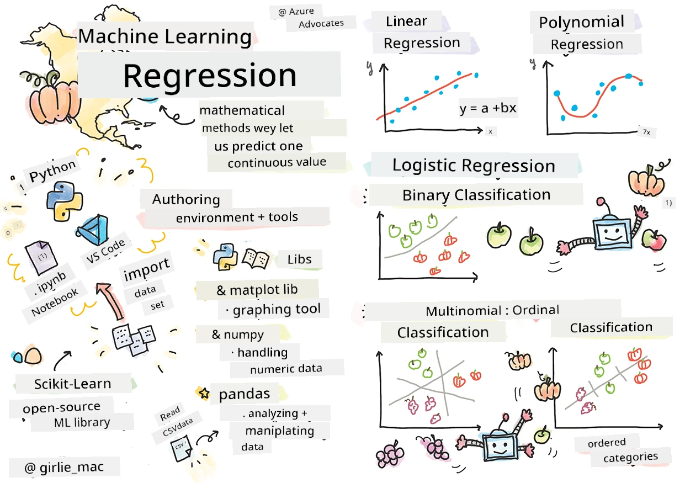
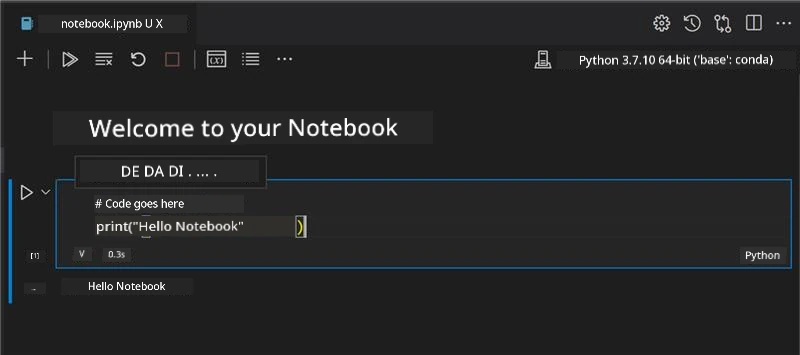
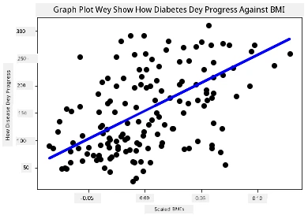

# Start to run Python and Scikit-learn for regression models



> Sketchnote by [Tomomi Imura](https://www.twitter.com/girlie_mac)

## [Pre-lecture quiz](https://ff-quizzes.netlify.app/en/ml/)

> ### [Dis lesson dey available for R!](../../../../2-Regression/1-Tools/solution/R/lesson_1.html)

## Introduction

For dis four lessons, you go learn how to build regression models. We go talk about wetin dem dey use am for soon. But before you start anything, make sure say you get correct tool dem set well to start di work!

For dis lesson, you go learn how to:

- Arrange your computer for local machine learning work.
- Use Jupyter Notebooks.
- Use Scikit-learn, including how to install am.
- Explore linear regression with hand-on exercise.

## Installations and configurations

[](https://youtu.be/-DfeD2k2Kj0 "ML for beginners -Setup your tools ready to build Machine Learning models")

> 🎥 Click the image above for short video wey go show how to arrange your computer for ML.

1. **Install Python**. Make sure say [Python](https://www.python.org/downloads/) don install for your computer. You go use Python for many data science and machine learning waka. Most computers don already get Python. E still dey useful to get [Python Coding Packs](https://code.visualstudio.com/learn/educators/installers?WT.mc_id=academic-77952-leestott) for some people to easy setup.

   Some Python use demand one version of the software, others need another version. So e good to work inside [virtual environment](https://docs.python.org/3/library/venv.html).

2. **Install Visual Studio Code**. Make sure say you get Visual Studio Code install for your computer. Follow [these instructions](https://code.visualstudio.com/) to install Visual Studio Code well. You go use Python for Visual Studio Code for dis course, so e good to sabi how to [configure Visual Studio Code](https://docs.microsoft.com/learn/modules/python-install-vscode?WT.mc_id=academic-77952-leestott) for Python dev work.

   > Make yourself familiar with Python by going through dis collection of [Learn modules](https://docs.microsoft.com/users/jenlooper-2911/collections/mp1pagggd5qrq7?WT.mc_id=academic-77952-leestott)
   >
   > [](https://youtu.be/yyQM70vi7V8 "Setup Python with Visual Studio Code")
   >
   > 🎥 Click the picture above for video: how to use Python inside VS Code.

3. **Install Scikit-learn**, follow [these instructions](https://scikit-learn.org/stable/install.html). Since you need use Python 3, e good make you use virtual environment. If you dey install this library for M1 Mac, the page get special instructions.

1. **Install Jupyter Notebook**. You go need to [install the Jupyter package](https://pypi.org/project/jupyter/).

## Your ML authoring environment

You go use **notebooks** to write your Python code and create machine learning models. Dis kain file na common tool for data scientists, and you go sabi am by their suffix or extension `.ipynb`.

Notebooks na interactive environment wey make developer fit both code and add notes and write documentation around di code wey dey helpful for experimental or research work.

[](https://youtu.be/7E-jC8FLA2E "ML for beginners - Set up Jupyter Notebooks to start building regression models")

> 🎥 Click di picture above for short video to follow dis exercise.

### Exercise - work with notebook

For dis folder, you go find file _notebook.ipynb_.

1. Open _notebook.ipynb_ for Visual Studio Code.

   Jupyter server go start wit Python 3+ go on. You go see parts of di notebook wey you fit `run`, pieces of code. You fit run code block by clicking di icon wey look like play button.

1. Click di `md` icon and add small markdown, plus dis text **# Welcome to your notebook**.

   Next, add some Python code.

1. Type **print('hello notebook')** for code block.
1. Click di arrow to run di code.

   You go see di printed statement:

    ```output
    hello notebook
    ```



You fit put your code together with comments to explain your notebook.

✅ Think small abeg how different web developer work environment be from data scientist.

## Up and running with Scikit-learn

Now wey Python don set for your lokal environment, and you don sabi Jupyter Notebooks well, make we try Scikit-learn (you go talk am `sci` like `science`). Scikit-learn get [plenty API](https://scikit-learn.org/stable/modules/classes.html#api-ref) wey go help you do ML work.

According to their [website](https://scikit-learn.org/stable/getting_started.html), "Scikit-learn na open source machine learning library wey dey support supervised and unsupervised learning. E still get tools for model fitting, data preprocessing, model selection and evaluation, plus many other utilities."

For dis course, you go use Scikit-learn and other tools to build machine learning models wey dem dey call 'traditional machine learning' tasks. We no include neural networks and deep learning because we go talk about dem for our 'AI for Beginners' curriculum wey dey come.

Scikit-learn dey easy to use to build models and check dem. E mainly dey use numeric data and get many ready-made datasets for learning. E also get built models wey students fit try. Make we check how to load prepackaged data and use built-in estimator first ML model with Scikit-learn with some basic data.

## Exercise - your first Scikit-learn notebook

> Dis tutorial come from [linear regression example](https://scikit-learn.org/stable/auto_examples/linear_model/plot_ols.html#sphx-glr-auto-examples-linear-model-plot-ols-py) for Scikit-learn web site.


[](https://youtu.be/2xkXL5EUpS0 "ML for beginners - Your First Linear Regression Project in Python")

> 🎥 Click picture above for short video to follow dis exercise.

For _notebook.ipynb_ file wey dey for dis lesson, clear all the cells by pressing di 'trash can' icon.

For dis part, you go work wit small dataset about diabetes wey dey inside Scikit-learn for learning. Imagine say you wan test treatment for diabetic patients. Machine Learning models fit help you see which patient go respond better, based on combination of variables. Even simple regression model, if you show am, fit show info about variables wey fit help arrange your clinical trials idea.

✅ Their different types of regression, and which one you use go depend on the answer you want. If you want predict height for person of one age, you go use linear regression, as you want **numeric value**. If you wan find if one kin food na vegan or no, you dey find **category** so you go use logistic regression. You go learn more on logistic regression later. Think small about questions wey you fit ask data, and which method go fit.

Make we start dis task now.

### Import libraries

For dis work we go import some libraries:

- **matplotlib**. E good [graphing tool](https://matplotlib.org/) and we go use am to form line plot.
- **numpy**. [numpy](https://numpy.org/doc/stable/user/whatisnumpy.html) na good library for numeric data for Python.
- **sklearn**. Na [Scikit-learn](https://scikit-learn.org/stable/user_guide.html) library dis one.

Import libraries wey go help for your work.

1. Add imports by typing this code:

   ```python
   import matplotlib.pyplot as plt
   import numpy as np
   from sklearn import datasets, linear_model, model_selection
   ```

   For here, you dey import `matplotlib`, `numpy` and you dey import `datasets`, `linear_model` and `model_selection` from `sklearn`. `model_selection` na for divide data into training and test sets.

### The diabetes dataset

The built-in [diabetes dataset](https://scikit-learn.org/stable/datasets/toy_dataset.html#diabetes-dataset) get 442 samples of data about diabetes, with 10 feature variables, like:

- age: age inside years
- bmi: body mass index
- bp: average blood pressure
- s1 tc: T-Cells (kind of white blood cells)

✅ Dis dataset get the idea of 'sex' as feature wey important for diabetes research. Many medical dataset get this kind binary classification. Think small about how this kind categories for exclude some people from treatments.

Now, gbe the X and y data come.

> 🎓 Remember say, dis one na supervised learning, so we need to get named 'y' target.

For new code cell, load diabetes dataset by calling `load_diabetes()`. The input `return_X_y=True` mean say `X` go be data matrix, and `y` go be regression target.

1. Add print commands to show the shape of data matrix and first element:

    ```python
    X, y = datasets.load_diabetes(return_X_y=True)
    print(X.shape)
    print(X[0])
    ```

    Wetin you go get back na tuple. What you dey do be assign first two values of tuple to `X` and `y`. Learn more [about tuples](https://wikipedia.org/wiki/Tuple).

    You fit see say data get 442 items wey shaped as arrays of 10 elements:

    ```text
    (442, 10)
    [ 0.03807591  0.05068012  0.06169621  0.02187235 -0.0442235  -0.03482076
    -0.04340085 -0.00259226  0.01990842 -0.01764613]
    ```

    ✅ Think small about how data relate to regression target. Linear regression dey predict how feature X and target y relate. You fit find [target](https://scikit-learn.org/stable/datasets/toy_dataset.html#diabetes-dataset) for diabetes dataset inside di documentation? Wetin this dataset dey show with dat target?

2. Next, choose part of dataset to plot by choosing 3rd column. You fit select all rows with `:` operator, then choose 3rd column with index (2). You fit reshape data to be 2D array - like dis plotting need - by using `reshape(n_rows, n_columns)`. If any parameter be -1, e go calculate that dimension automatically.

   ```python
   X = X[:, 2]
   X = X.reshape((-1,1))
   ```

   ✅ Anytime you fit print data to check shape.

3. Now wey data ready for plotting, make we see if machine fit help decide better split for numbers for this dataset. To do so, you need split data (X) and target (y) into test and training sets. Scikit-learn get easy way to do dis; you fit split your test data for any place you want.

   ```python
   X_train, X_test, y_train, y_test = model_selection.train_test_split(X, y, test_size=0.33)
   ```

4. Now you fit train your model! Load linear regression model and train am with your X and y training sets using `model.fit()`:

    ```python
    model = linear_model.LinearRegression()
    model.fit(X_train, y_train)
    ```

    ✅ `model.fit()` na function wey you go see for many ML libraries like TensorFlow

5. Then create prediction with test data by using `predict()`. E go help draw line between data groups

    ```python
    y_pred = model.predict(X_test)
    ```

6. Now time don reach to show data for plot. Matplotlib be very useful tool for this type work. Create scatterplot for all X and y test data, then use prediction to draw line for right place between model data groups.

    ```python
    plt.scatter(X_test, y_test,  color='black')
    plt.plot(X_test, y_pred, color='blue', linewidth=3)
    plt.xlabel('Scaled BMIs')
    plt.ylabel('Disease Progression')
    plt.title('A Graph Plot Showing Diabetes Progression Against BMI')
    plt.show()
    ```

   


   ✅ Think small about wetin dey happen here. One straight line dey run through plenti small dots of data, but wetin e dey really do? You fit see as you suppose use dis line take predict where new, never see data point suppose join inside the plot's y axis? Try talk am for word how this model fit work for real life.

Congrats, you don build your first linear regression model, create prediction with am, plus show am for one plot!

---
## 🚀Challenge

Plot one different variable from dis dataset. Hint: change this line: `X = X[:,2]`. Based on dis dataset target, wetin you fit discover about how diabetes dey progress as disease?
## [Post-lecture quiz](https://ff-quizzes.netlify.app/en/ml/)

## Review & Self Study

For dis tutorial, you work with simple linear regression, no be univariate or multiple linear regression. Read small about the difference between dem methods, or try check [dis video](https://www.coursera.org/lecture/quantifying-relationships-regression-models/linear-vs-nonlinear-categorical-variables-ai2Ef)

Read more about regression concept and think about kind questions wey dis method fit answer. Take dis [tutorial](https://docs.microsoft.com/learn/modules/train-evaluate-regression-models?WT.mc_id=academic-77952-leestott) to sabi am well well.

## Assignment

[One different dataset](assignment.md)

---

<!-- CO-OP TRANSLATOR DISCLAIMER START -->
**Disclaimer**:
Dis document don translate wit AI translation service [Co-op Translator](https://github.com/Azure/co-op-translator). Even tho we dey try make am correct, abeg make you know say automated translation fit get errors or mistakes. Di original document for dia own language na im be di correct source. For important info, make person wey sabi human translation do am. We no go responsible for any misunderstanding or wrong understanding wey fit happen because of dis translation.
<!-- CO-OP TRANSLATOR DISCLAIMER END -->