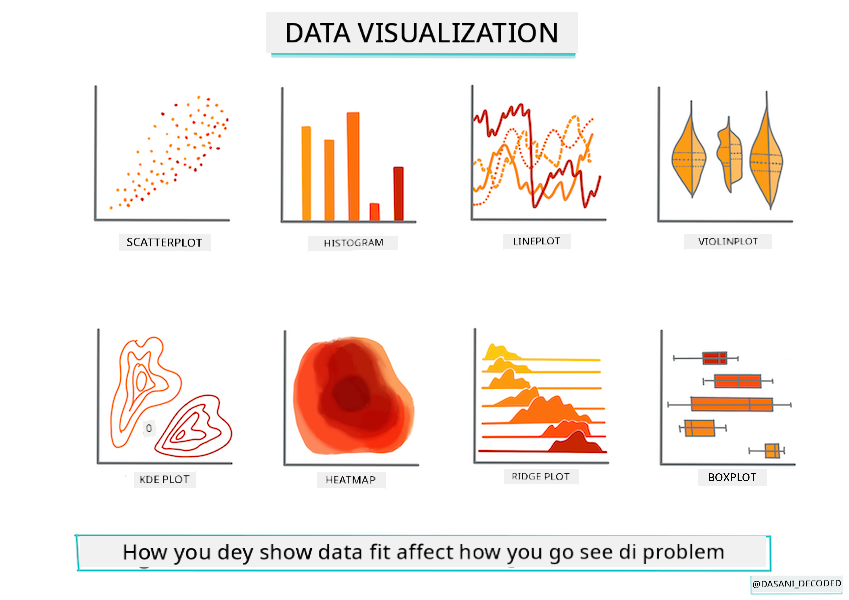
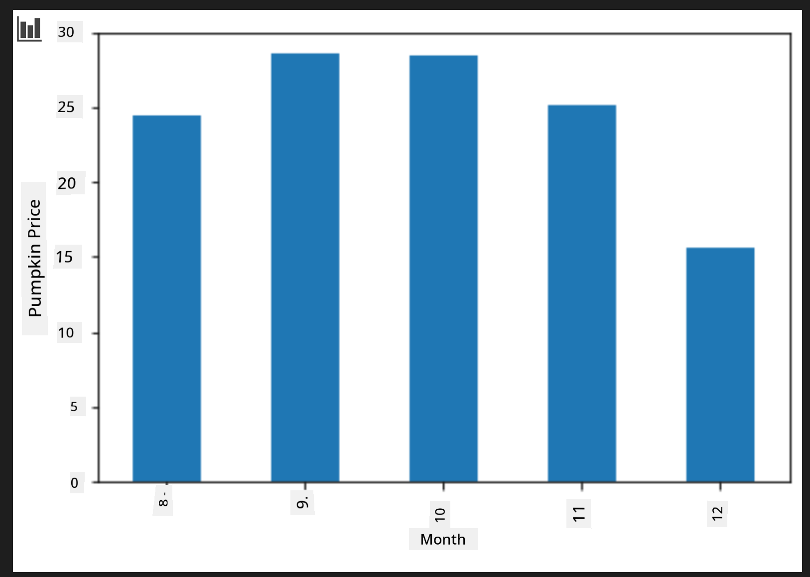

<!--
CO_OP_TRANSLATOR_METADATA:
{
  "original_hash": "7c077988328ebfe33b24d07945f16eca",
  "translation_date": "2025-11-18T18:44:12+00:00",
  "source_file": "2-Regression/2-Data/README.md",
  "language_code": "pcm"
}
-->
# Build regression model wit Scikit-learn: prepare and show data



Infographic by [Dasani Madipalli](https://twitter.com/dasani_decoded)

## [Pre-lecture quiz](https://ff-quizzes.netlify.app/en/ml/)

> ### [Dis lesson dey available for R!](../../../../2-Regression/2-Data/solution/R/lesson_2.html)

## Introduction

Now wey you don get all di tools wey you need to start machine learning model building wit Scikit-learn, you fit begin dey ask beta questions about your data. As you dey work wit data and dey use ML solutions, e dey very important to sabi how to ask di correct question so you fit unlock di potential wey dey your dataset.

For dis lesson, you go learn:

- How to prepare your data for model-building.
- How to use Matplotlib to show data.

## Ask di correct question about your data

Di question wey you wan answer go determine di type of ML algorithm wey you go use. Di quality of di answer wey you go get go depend well-well on di kind data wey you get.

Check di [data](https://github.com/microsoft/ML-For-Beginners/blob/main/2-Regression/data/US-pumpkins.csv) wey dem provide for dis lesson. You fit open dis .csv file for VS Code. If you look am small, you go see say e get blanks and mix of strings and numbers. E still get one strange column wey dem call 'Package' wey di data dey mix between 'sacks', 'bins' and other values. Di data sef no dey clean.

[](https://youtu.be/5qGjczWTrDQ "ML for beginners - How to Analyze and Clean a Dataset")

> 🎥 Click di image wey dey up for short video wey go show how to prepare di data for dis lesson.

E no dey common to get dataset wey don ready to use for ML model straight. For dis lesson, you go learn how to prepare raw dataset wit standard Python libraries. You go still learn different ways to show di data.

## Case study: 'di pumpkin market'

For dis folder, you go see one .csv file for di root `data` folder wey dem call [US-pumpkins.csv](https://github.com/microsoft/ML-For-Beginners/blob/main/2-Regression/data/US-pumpkins.csv) wey get 1757 lines of data about di market for pumpkins, wey dem arrange by city. Dis na raw data wey dem collect from di [Specialty Crops Terminal Markets Standard Reports](https://www.marketnews.usda.gov/mnp/fv-report-config-step1?type=termPrice) wey United States Department of Agriculture dey share.

### Prepare data

Dis data dey public domain. You fit download am as plenty separate files, per city, from di USDA website. To avoid too many separate files, we don join all di city data into one spreadsheet, so we don _prepare_ di data small. Next, make we look di data well.

### Di pumpkin data - early conclusions

Wetin you notice about dis data? You don already see say e get mix of strings, numbers, blanks and strange values wey you go need understand.

Wetin be di question wey you fit ask about dis data, using Regression technique? How about "Predict di price of pumpkin wey dem dey sell for one month"? If you look di data again, you go see say e get some changes wey you go need make to create di data structure wey go work for di task.

## Exercise - analyze di pumpkin data

Make we use [Pandas](https://pandas.pydata.org/), (di name mean `Python Data Analysis`) one tool wey dey very useful to shape data, to analyze and prepare dis pumpkin data.

### First, check for missing dates

You go first need to check for missing dates:

1. Change di dates to month format (di format na US dates, so e be `MM/DD/YYYY`).
2. Take di month put for new column.

Open di _notebook.ipynb_ file for Visual Studio Code and import di spreadsheet into new Pandas dataframe.

1. Use di `head()` function to see di first five rows.

    ```python
    import pandas as pd
    pumpkins = pd.read_csv('../data/US-pumpkins.csv')
    pumpkins.head()
    ```

    ✅ Wetin be di function wey you go use to see di last five rows?

1. Check if di current dataframe get missing data:

    ```python
    pumpkins.isnull().sum()
    ```

    E get missing data, but e fit no matter for di task wey you wan do.

1. To make di dataframe easy to work wit, select only di columns wey you need, using di `loc` function wey dey extract from di original dataframe group of rows (di first parameter) and columns (di second parameter). Di expression `:` for di example below mean "all rows".

    ```python
    columns_to_select = ['Package', 'Low Price', 'High Price', 'Date']
    pumpkins = pumpkins.loc[:, columns_to_select]
    ```

### Second, find di average price of pumpkin

Think about how you go fit find di average price of pumpkin for one month. Wetin be di columns wey you go pick for dis task? Hint: you go need 3 columns.

Solution: take di average of di `Low Price` and `High Price` columns to fill di new Price column, and change di Date column to show only di month. Lucky for us, di check wey we do before show say e no get missing data for dates or prices.

1. To calculate di average, add dis code:

    ```python
    price = (pumpkins['Low Price'] + pumpkins['High Price']) / 2

    month = pd.DatetimeIndex(pumpkins['Date']).month

    ```

   ✅ Feel free to print any data wey you wan check using `print(month)`.

2. Now, copy di converted data into fresh Pandas dataframe:

    ```python
    new_pumpkins = pd.DataFrame({'Month': month, 'Package': pumpkins['Package'], 'Low Price': pumpkins['Low Price'],'High Price': pumpkins['High Price'], 'Price': price})
    ```

    If you print di dataframe, e go show clean, tidy dataset wey you fit use build your new regression model.

### But wait! Something dey odd here

If you look di `Package` column, you go see say pumpkins dey sell for different ways. Some dey sell for '1 1/9 bushel', some for '1/2 bushel', some per pumpkin, some per pound, and some for big boxes wey get different sizes.

> Pumpkins dey hard to weigh well-well

If you check di original data, e dey interesting say anything wey get `Unit of Sale` as 'EACH' or 'PER BIN' still get `Package` type per inch, per bin, or 'each'. Pumpkins dey hard to weigh well-well, so make we filter dem by selecting only pumpkins wey get di string 'bushel' for their `Package` column.

1. Add filter for di top of di file, under di initial .csv import:

    ```python
    pumpkins = pumpkins[pumpkins['Package'].str.contains('bushel', case=True, regex=True)]
    ```

    If you print di data now, you go see say you dey only get di 415 rows of data wey dey contain pumpkins by di bushel.

### But wait! One more thing dey to do

You notice say di bushel amount dey different for each row? You go need normalize di pricing so e go show di pricing per bushel, so do some math to standardize am.

1. Add dis lines after di block wey dey create di new_pumpkins dataframe:

    ```python
    new_pumpkins.loc[new_pumpkins['Package'].str.contains('1 1/9'), 'Price'] = price/(1 + 1/9)

    new_pumpkins.loc[new_pumpkins['Package'].str.contains('1/2'), 'Price'] = price/(1/2)
    ```

✅ According to [The Spruce Eats](https://www.thespruceeats.com/how-much-is-a-bushel-1389308), di weight of bushel dey depend on di type of produce, as e dey measure volume. "Bushel of tomatoes, for example, suppose weigh 56 pounds... Leaves and greens dey take more space wit less weight, so bushel of spinach na only 20 pounds." E dey complicated! Make we no bother wit bushel-to-pound conversion, instead make we price by di bushel. All dis study of bushels of pumpkins show how e dey important to understand di nature of your data!

Now, you fit analyze di pricing per unit based on their bushel measurement. If you print di data one more time, you go see how e don standardize.

✅ You notice say pumpkins wey dem dey sell by half-bushel dey very expensive? You fit figure out why? Hint: small pumpkins dey more expensive than big ones, probably because plenty dey per bushel, as big hollow pie pumpkin dey take space.

## Visualization Strategies

Part of di work of data scientist na to show di quality and nature of di data wey dem dey work wit. To do dis, dem dey create interesting visualizations, or plots, graphs, and charts, wey dey show different parts of di data. Dis way, dem fit show relationships and gaps wey dey hard to see.

[](https://youtu.be/SbUkxH6IJo0 "ML for beginners - How to Visualize Data with Matplotlib")

> 🎥 Click di image wey dey up for short video wey go show how to visualize di data for dis lesson.

Visualizations fit still help you decide di machine learning technique wey go work well for di data. Scatterplot wey dey follow line, for example, dey show say di data fit work well for linear regression exercise.

One data visualization library wey dey work well for Jupyter notebooks na [Matplotlib](https://matplotlib.org/) (you don see am for di previous lesson).

> Get more experience wit data visualization for [dis tutorials](https://docs.microsoft.com/learn/modules/explore-analyze-data-with-python?WT.mc_id=academic-77952-leestott).

## Exercise - try Matplotlib

Try create some basic plots to show di new dataframe wey you don create. Wetin basic line plot go show?

1. Import Matplotlib for di top of di file, under di Pandas import:

    ```python
    import matplotlib.pyplot as plt
    ```

1. Rerun di whole notebook to refresh.
1. For di bottom of di notebook, add cell to plot di data as box:

    ```python
    price = new_pumpkins.Price
    month = new_pumpkins.Month
    plt.scatter(price, month)
    plt.show()
    ```

    

    Dis plot dey useful? E surprise you?

    E no too useful as e just dey show di data as spread of points for di month.

### Make am useful

To get charts wey dey useful, you go need group di data somehow. Make we try create plot wey di y axis dey show di months and di data dey show di distribution.

1. Add cell to create grouped bar chart:

    ```python
    new_pumpkins.groupby(['Month'])['Price'].mean().plot(kind='bar')
    plt.ylabel("Pumpkin Price")
    ```

    

    Dis na more useful data visualization! E dey show say di highest price for pumpkins dey September and October. E match wetin you dey expect? Why or why not?

---

## 🚀Challenge

Check di different types of visualization wey Matplotlib dey offer. Which types dey best for regression problems?

## [Post-lecture quiz](https://ff-quizzes.netlify.app/en/ml/)

## Review & Self Study

Look di many ways wey dey to visualize data. Make list of di different libraries wey dey available and note which one dey best for di type of task, like 2D visualizations vs. 3D visualizations. Wetin you discover?

## Assignment

[Exploring visualization](assignment.md)

---

<!-- CO-OP TRANSLATOR DISCLAIMER START -->
**Disclaimer**:  
Dis dokyument don use AI transleshion service [Co-op Translator](https://github.com/Azure/co-op-translator) do di transleshion. Even as we dey try make am accurate, abeg make you sabi say automatik transleshion fit get mistake or no dey correct well. Di original dokyument wey dey for im native language na di one wey you go take as di main source. For important mata, e good make you use professional human transleshion. We no go fit take blame for any misunderstanding or wrong interpretation wey fit happen because you use dis transleshion.
<!-- CO-OP TRANSLATOR DISCLAIMER END -->