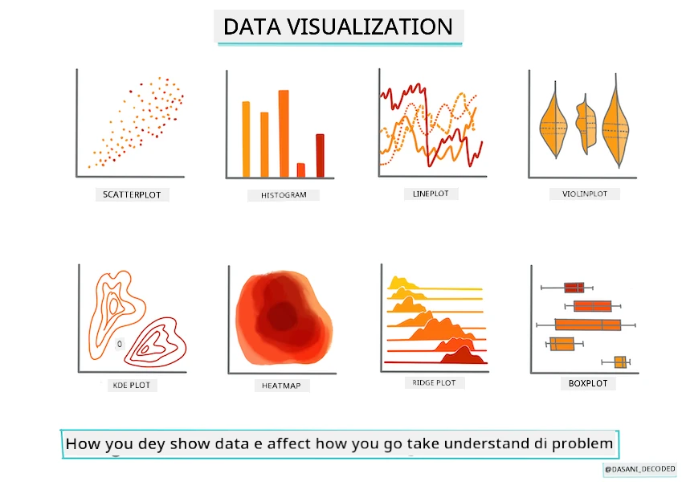
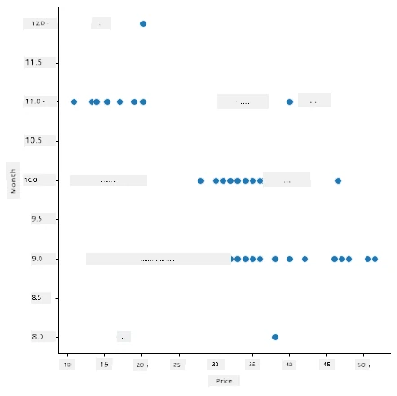
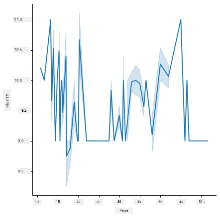

# Build a regression model using Scikit-learn: prepare and visualize data



Infographic by [Dasani Madipalli](https://twitter.com/dasani_decoded)

## [Pre-lecture quiz](https://ff-quizzes.netlify.app/en/ml/)

> ### [Dis lesson dey available for R!](../../../../2-Regression/2-Data/solution/R/lesson_2.html)

## Introduction

Now wey you don get all di tools wey you need to start to dey build machine learning model with Scikit-learn, you don ready to start dey ask questions about your data. As you dey work with data and apply ML solutions, e important well well to sabi how to ask correct question to fit unlock all di powers wey dey inside your dataset.

For dis lesson, you go learn:

- How to prepare your data for model-building.
- How to take use Matplotlib for data visualization.
- How to take use Seaborn for more expressive data visualization.

## How to ask the correct question about your data

The question wey you wan find answer go determine which kind ML algorithms you go use. And how correct di answer go be depend wella on di nature of your data.

Look di [data](https://github.com/microsoft/ML-For-Beginners/blob/main/2-Regression/data/US-pumpkins.csv) wey dem provide for dis lesson. You fit open dis .csv file for VS Code. If you look am quickly, e show say e get blanks and mix of strings and numeric data. E still get one kain strange column wey dem call 'Package' wey di data na mix of 'sacks', 'bins' and other values. Di data, truth be told, na small gbege.

[](https://youtu.be/5qGjczWTrDQ "ML for beginners - How to Analyze and Clean a Dataset")

> 🎥 Click di picture wey dey above for short video wey dey show how to prepare di data for dis lesson.

For fact, e no too common to get dataset wey ready complete to use build ML model straight from di beginning. For dis lesson, you go learn how to prepare raw dataset with standard Python libraries. You go learn plenty ways to visualize di data too.

## Case study: 'the pumpkin market'

Inside dis folder, you go find .csv file for di root `data` folder called [US-pumpkins.csv](https://github.com/microsoft/ML-For-Beginners/blob/main/2-Regression/data/US-pumpkins.csv) wey get 1757 lines of data about pumpkin market, sorted by city groupings. Dis na raw data wey dem comot from di [Specialty Crops Terminal Markets Standard Reports](https://www.marketnews.usda.gov/mnp/fv-report-config-step1?type=termPrice) wey United States Department of Agriculture dey distribute.

### Preparing data

Dis data dey public domain. You fit download am as many small small files, per city, for USDA website. To avoid too many small files, we don join all di city data into one spreadsheet, so we don already _prepare_ di data small. Next, make we look di data well well.

### Di pumpkin data - early conclusions

Wetin you notice for dis data? You see say e get mix of strings, numbers, blanks and strange values wey you go need make sense.

Which kind question you fit ask this data with Regression technique? Wetin about "Predict di price of pumpkin wey dem dey sell for given month". If you look di data again, e get some changes wey you go do make data fit the structure wey this work need.
## Exercise - analyze di pumpkin data

Make we use [Pandas](https://pandas.pydata.org/), (di name mean `Python Data Analysis`) wey na tool wey make am easy to shape data, to analyze and prepare dis pumpkin data.

### First, check for missing dates

You go first need do step to check if any date dey miss:

1. Change di dates to month format (dis na US dates, so format na `MM/DD/YYYY`).
2. Cut di month come put for new column.

Open _notebook.ipynb_ file for Visual Studio Code and import di spreadsheet into new Pandas dataframe.

1. Use di `head()` function to see di first five rows.

    ```python
    import pandas as pd
    pumpkins = pd.read_csv('../data/US-pumpkins.csv')
    pumpkins.head()
    ```

    ✅ Wetin function you go use to see last five rows?

1. Check if any data dey miss for current dataframe:

    ```python
    pumpkins.isnull().sum()
    ```

    Some data dey miss, but e fit no matter for dis work.

1. To make your dataframe easy to work with, select only di columns wey you need, using `loc` function wey go pick some rows (first parameter) and columns (second parameter) from di original dataframe. `:` for dis case mean "all rows".

    ```python
    columns_to_select = ['Package', 'Low Price', 'High Price', 'Date']
    pumpkins = pumpkins.loc[:, columns_to_select]
    ```

### Second, find average price of pumpkin

Think how to find average price of pumpkin for one month. Which columns you go choose for dis work? Hint: you go need 3 columns.

Solution: take average of `Low Price` and `High Price` columns to make new Price column, and change Date column to show only month. Luckily, from di check above, no date or price data dey missing.

1. To calculate average, add dis code:

    ```python
    price = (pumpkins['Low Price'] + pumpkins['High Price']) / 2

    month = pd.DatetimeIndex(pumpkins['Date']).month

    ```

   ✅ You fit print any data you wan check with `print(month)`.

2. Now, copy your converted data enter new Pandas dataframe:

    ```python
    new_pumpkins = pd.DataFrame({'Month': month, 'Package': pumpkins['Package'], 'Low Price': pumpkins['Low Price'],'High Price': pumpkins['High Price'], 'Price': price})
    ```

    If you print your dataframe, e go show you clean, tidy dataset wey you fit use build your new regression model.

### But wait! Something dey strange here

If you check `Package` column, pumpkins dey sell for many different ways. Some dey sell for '1 1/9 bushel' measurements, some for '1/2 bushel', some per pumpkin, some per pound, and some dey large boxes wey get different widths.

> E be like say e hard well well to weigh pumpkins the same way always

When you dey check original data, e get one thing interest - anything wey get `Unit of Sale` wey equal 'EACH' or 'PER BIN' still get `Package` type wey be per inch, per bin or 'each'. E be like say e dey really hard to weigh pumpkins the same consistent way, so make we use filter take only pumpkins wey get 'bushel' string for their `Package` column.


1. Add one filter for top of di file, under di initial .csv import:

    ```python
    pumpkins = pumpkins[pumpkins['Package'].str.contains('bushel', case=True, regex=True)]
    ```

    If you print di data now, you fit see say you dey only get di 415 or something rows of data wey get pumpkins by di bushel.

### But wait! E still get one more thing to do

You notice say di bushel amount dey change for each row? You need to normalize di pricing so dat e go show di price per bushel, so make you do some math to standardize am.

1. Add these lines after di block wey dey create di new_pumpkins dataframe:

    ```python
    new_pumpkins.loc[new_pumpkins['Package'].str.contains('1 1/9'), 'Price'] = price/(1 + 1/9)

    new_pumpkins.loc[new_pumpkins['Package'].str.contains('1/2'), 'Price'] = price/(1/2)
    ```

✅ According to [The Spruce Eats](https://www.thespruceeats.com/how-much-is-a-bushel-1389308), weight of bushel dey depend on di kind produce, as na volume measurement e be. "A bushel of tomatoes, for example, suppose weigh 56 pounds... Leaves and greens dey take more space but get less weight, so bushel of spinach na only 20 pounds." E dey quite complicated! Make we no try convert bushel to pound, but instead price am by di bushel. All dis study of bushels of pumpkins show well well how e important to sabi di nature of your data!

Now, you fit analyze di pricing per unit based on their bushel measurement. If you print di data one more time, you go fit see how e standarize.

✅ You notice say pumpkins wey dem sell by di half-bushel dey very expensive? You fit figure why? Hint: small pumpkins dey cost pass big ones, probably because plenty small pumpkins dey one bushel, while one big hollow pie pumpkin dey waste space.

## Visualization Strategies

Part of di work wey data scientist dey do na to show di quality and nature of di data wey dem dey work with. To do dis, dem dey often create correct visualizations, like plots, graphs, and charts, wey go show different sides of di data. With dis kind taf taf, dem fit visually show relationships and gaps wey hard to see normally.

[](https://youtu.be/SbUkxH6IJo0 "ML for beginners - How to Visualize Data with Matplotlib")

> 🎥 Click di picture above for short video wey dey show how to visualize di data for dis lesson.

Visualizations fit also help decide which machine learning method go best for di data. For example, if scatterplot dey follow one line, e show say di data good for linear regression.

One data visualization library wey dey work well for Jupyter notebooks na [Matplotlib](https://matplotlib.org/) (wey you also see for di last lesson).

> Get more experience with data visualization inside [these tutorials](https://docs.microsoft.com/learn/modules/explore-analyze-data-with-python?WT.mc_id=academic-77952-leestott).

## Exercise - experiment with Matplotlib

Try create some basic plots to show di new dataframe wey you just create. Wetin basic line plot fit show?

1. Import Matplotlib for top of file under Pandas import:

    ```python
    import matplotlib.pyplot as plt
    ```

1. Run di complete notebook again to refresh.
1. For bottom of di notebook, add one cell to plot di data as box:

    ```python
    price = new_pumpkins.Price
    month = new_pumpkins.Month
    plt.scatter(price, month)
    plt.show()
    ```

    

    Na useful plot dis? E surprise you for any way?

    E no too useful as e only show your data spread as points for different months.

### Make am useful

To make charts show useful data, you usually need to group di data somehow. Make we try create one plot wey di y axis dey show di months and di data dey show how data dey distribute.

1. Add one cell to create grouped bar chart:

    ```python
    new_pumpkins.groupby(['Month'])['Price'].mean().plot(kind='bar')
    plt.ylabel("Pumpkin Price")
    ```

    

    Dis one na more useful data visualization! E seem to show say highest price for pumpkin dey happen for September and October. E match your expectation? Why or why not?

## Exercise - experiment with Seaborn

Matplotlib strong well well, but e fit need plenty code to make one fine fine chart. [Seaborn](https://seaborn.pydata.org/) na library wey build _on top of_ Matplotlib designed for statistical data visualization. E dey work directly with Pandas dataframes, get nice default styles, and let you create correct plots with less code. Because Seaborn dey return Matplotlib objects, you fit still use everything wey you sabi about Matplotlib to fine-tune di result.

> If you never get Seaborn installed, install am with `pip install seaborn`.

1. Import Seaborn for top of di notebook, under di other imports. Dem normally dey import am as `sns`:

    ```python
    import seaborn as sns
    ```

### Scatter plots to show relationships

One big part of exploring data before you build model na to look for _relationships_ between variables. [Scatter plot](https://en.wikipedia.org/wiki/Scatter_plot) na one of di best tools for dis: if points dey follow one line, di two variables fit dey correlated, which be good sign say linear regression model fit work.

1. Recreate di price-to-month scatter plot from before, dis time use Seaborn's [`relplot()`](https://seaborn.pydata.org/generated/seaborn.relplot.html) (relational plot), wey dey work directly with your dataframe columns:

    ```python
    sns.relplot(x="Price", y="Month", data=new_pumpkins)
    ```

    

    Notice how you pass di _column names_ and di dataframe, and Seaborn go handle di axis labels for you.

2. You fit change am to line plot by passing `kind="line"`. Seaborn even go draw one shaded band wey dey show di confidence interval around di line:

    ```python
    sns.relplot(x="Price", y="Month", kind="line", data=new_pumpkins)
    ```

    

    Dis data too noisy small, so line plot no be di clearest choice here — but e show how e easy you fit change chart types inside Seaborn.

### Bar charts to show distributions


Before, you bin group di data by hand to create bar chart wit Matplotlib. Seaborn's [`catplot()`](https://seaborn.pydata.org/generated/seaborn.catplot.html) (categorical plot) fit do di grouping and aggregation for you. By default `kind="bar"` dey show di mean of each category plus one black line wey dey show di confidence interval.

1. Make bar chart of average price per month:

    ```python
    sns.catplot(x="Month", y="Price", data=new_pumpkins, kind="bar")
    ```

    

    Dis dey confirm wetin you see wit Matplotlib — prices dey peak around September and October — but Seaborn also dey show how much di price _dey change_ inside each month.

### Heatmaps to show correlations

Scatter plots dey compare two variables at once. When you get plenty numeric columns, one [heatmap](https://en.wikipedia.org/wiki/Heat_map) go let you see how strong di relationship between _every_ pair of columns be at the same time. Dis na common way to find which features get strong correlation before you choose wetin to put inside model (and di same kain chart dey used later to show confusion matrices for classification).

1. Make correlation matrix wit Pandas, then draw am wit Seaborn's [`heatmap()`](https://seaborn.pydata.org/generated/seaborn.heatmap.html). Di `annot=True` option dey print di correlation values for each cell:

    ```python
    correlations = new_pumpkins[['Month', 'Low Price', 'High Price', 'Price']].corr()
    sns.heatmap(correlations, annot=True, cmap="coolwarm")
    ```

    

    Values wey close to `1` (or `-1`) mean say di columns get strong _linear_ correlation. See as `Low Price` and `High Price` almost get perfect correlation. `Month`, however, only show small linear correlation with price — even though di bar chart above show one clear seasonal peak for September and October. Dat important lesson be say: di correlation coefficient only measure _straight-line_ relationship, so e fit miss seasonal or other non-linear patterns. ✅ Why e useful to look both heatmap *and* charts like di bar chart before you decide which columns to use?

### Matplotlib or Seaborn?

Both libraries worth to sabi:

- **Matplotlib** dey give you fine control over every part of chart and na di foundation nearly every other Python plotting library build on top.
- **Seaborn** dey provide higher-level functions and better defaults for statistical charts, e work direct wit dataframes, and e quick pass sometimes for exploratory data analysis.

Normal workflow na to use Seaborn first to explore your data quick, then fall back to Matplotlib if you need customize details.

---

## 🚀Challenge

Explore di different types of visualization wey Matplotlib and Seaborn dey offer. Which ones best for regression problems?

## [Post-lecture quiz](https://ff-quizzes.netlify.app/en/ml/)

## Review & Self Study

Look di many ways wey you fit visualize data. Make list of the libraries wey dey available and note which one best for particular task, like 2D visualizations vs 3D visualizations. Wetin you discover?

## Assignment

[Exploring visualization](assignment.md)

---

<!-- CO-OP TRANSLATOR DISCLAIMER START -->
**Disclaimer**:
Dis document don translate wit AI translation service [Co-op Translator](https://github.com/Azure/co-op-translator). Even tho we dey try make am correct, abeg make you know say automated translation fit get errors or mistakes. Di original document for dia own language na im be di correct source. For important info, make person wey sabi human translation do am. We no go responsible for any misunderstanding or wrong understanding wey fit happen because of dis translation.
<!-- CO-OP TRANSLATOR DISCLAIMER END -->