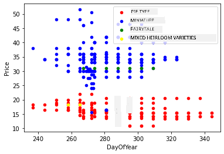

<!--
CO_OP_TRANSLATOR_METADATA:
{
  "original_hash": "40e64f004f3cb50aa1d8661672d3cd92",
  "translation_date": "2025-11-18T18:41:54+00:00",
  "source_file": "2-Regression/3-Linear/README.md",
  "language_code": "pcm"
}
-->
# Build regression model wit Scikit-learn: regression four ways


> Infographic by [Dasani Madipalli](https://twitter.com/dasani_decoded)
## [Pre-lecture quiz](https://ff-quizzes.netlify.app/en/ml/)

> ### [Dis lesson dey available for R!](../../../../2-Regression/3-Linear/solution/R/lesson_3.html)
### Introduction 

So far, you don learn wetin regression be wit sample data wey we gather from pumpkin pricing dataset wey we go use for dis lesson. You don also use Matplotlib take visualize am.

Now, you ready to go deeper into regression for ML. While visualization dey help you understand data, the real power of Machine Learning na from _training models_. Models dey train wit old data to automatically capture how data dey relate, and dem go help you predict wetin go happen for new data wey model never see before.

For dis lesson, you go learn more about two types of regression: _basic linear regression_ and _polynomial regression_, plus some of the math wey dey behind dis techniques. Dis models go help us predict pumpkin prices based on different input data.

[](https://youtu.be/CRxFT8oTDMg "ML for beginners - Understanding Linear Regression")

> 🎥 Click di image above for short video wey explain linear regression.

> For dis curriculum, we dey assume say you no sabi too much math, and we dey try make am easy for students wey dey come from other fields, so watch out for notes, 🧮 callouts, diagrams, and other tools wey go help you understand.

### Prerequisite

By now, you suppose don sabi di structure of di pumpkin data wey we dey look. You go find am preloaded and pre-cleaned for dis lesson _notebook.ipynb_ file. For di file, di pumpkin price dey show per bushel for new data frame. Make sure say you fit run dis notebooks for kernels inside Visual Studio Code.

### Preparation

Make we remind you, you dey load dis data so you fit ask questions about am.

- When be di best time to buy pumpkins? 
- Wetin be di price wey I fit expect for case of miniature pumpkins?
- I go buy dem for half-bushel baskets or di 1 1/9 bushel box?
Make we continue to dig di data.

For di previous lesson, you create Pandas data frame and put part of di original dataset inside, standardizing di pricing by di bushel. But as you do am, you only fit gather about 400 datapoints and na only for di fall months.

Check di data wey we preloaded for dis lesson notebook. Di data don dey preloaded and we don chart initial scatterplot to show month data. Maybe we fit get more detail about di data nature if we clean am more.

## Linear regression line

As you learn for Lesson 1, di goal of linear regression na to fit plot line wey go:

- **Show variable relationships**. Show how di variables dey relate
- **Make predictions**. Make correct predictions about where new datapoint go fall for di line. 
 
Di normal way for **Least-Squares Regression** na to draw dis type of line. Di term 'least-squares' mean say all di datapoints wey dey around di regression line go square and then add up. Ideally, di final sum suppose dey as small as e fit be, because we want low number of errors, or `least-squares`. 

We dey do am because we want model line wey get di least total distance from all our data points. We dey square di terms before we add dem because we dey focus on di size, no be di direction.

> **🧮 Show me di math** 
> 
> Dis line, wey dem dey call _line of best fit_ fit dey express by [one equation](https://en.wikipedia.org/wiki/Simple_linear_regression): 
> 
> ```
> Y = a + bX
> ```
>
> `X` na di 'explanatory variable'. `Y` na di 'dependent variable'. Di slope of di line na `b` and `a` na di y-intercept, wey mean di value of `Y` when `X = 0`. 
>
>
>
> First, calculate di slope `b`. Infographic by [Jen Looper](https://twitter.com/jenlooper)
>
> In other words, and referring to our pumpkin data original question: "predict di price of pumpkin per bushel by month", `X` go mean di price and `Y` go mean di month of sale. 
>
>
>
> Calculate di value of Y. If you dey pay around $4, e fit be April! Infographic by [Jen Looper](https://twitter.com/jenlooper)
>
> Di math wey dey calculate di line suppose show di slope of di line, wey also depend on di intercept, or where `Y` dey when `X = 0`.
>
> You fit see di method of calculation for dis values for [Math is Fun](https://www.mathsisfun.com/data/least-squares-regression.html) web site. Also visit [dis Least-squares calculator](https://www.mathsisfun.com/data/least-squares-calculator.html) to see how di numbers' values dey affect di line.

## Correlation

Another term wey you need understand na di **Correlation Coefficient** between di given X and Y variables. Using scatterplot, you fit quickly see dis coefficient. Scatterplot wey get datapoints wey dey arrange well for line get high correlation, but scatterplot wey get datapoints wey dey scatter anyhow between X and Y get low correlation.

Good linear regression model go be di one wey get high (nearer to 1 than 0) Correlation Coefficient using di Least-Squares Regression method wit regression line.

✅ Run di notebook wey follow dis lesson and look di Month to Price scatterplot. Di data wey dey associate Month to Price for pumpkin sales dey get high or low correlation, based on how you see di scatterplot? E go change if you use more detailed measure instead of `Month`, like *day of di year* (i.e. number of days since di year start)?

For di code below, we go assume say we don clean di data, and we don get data frame wey dem dey call `new_pumpkins`, wey look like dis:

ID | Month | DayOfYear | Variety | City | Package | Low Price | High Price | Price
---|-------|-----------|---------|------|---------|-----------|------------|-------
70 | 9 | 267 | PIE TYPE | BALTIMORE | 1 1/9 bushel cartons | 15.0 | 15.0 | 13.636364
71 | 9 | 267 | PIE TYPE | BALTIMORE | 1 1/9 bushel cartons | 18.0 | 18.0 | 16.363636
72 | 10 | 274 | PIE TYPE | BALTIMORE | 1 1/9 bushel cartons | 18.0 | 18.0 | 16.363636
73 | 10 | 274 | PIE TYPE | BALTIMORE | 1 1/9 bushel cartons | 17.0 | 17.0 | 15.454545
74 | 10 | 281 | PIE TYPE | BALTIMORE | 1 1/9 bushel cartons | 15.0 | 15.0 | 13.636364

> Di code to clean di data dey available for [`notebook.ipynb`](notebook.ipynb). We don do di same cleaning steps as di previous lesson, and we don calculate `DayOfYear` column using dis expression: 

```python
day_of_year = pd.to_datetime(pumpkins['Date']).apply(lambda dt: (dt-datetime(dt.year,1,1)).days)
```

Now wey you don understand di math wey dey behind linear regression, make we create Regression model to see if we fit predict which package of pumpkins go get di best pumpkin prices. Person wey dey buy pumpkins for holiday pumpkin patch fit want dis info to optimize di purchase of pumpkin packages for di patch.

## Looking for Correlation

[](https://youtu.be/uoRq-lW2eQo "ML for beginners - Looking for Correlation: Di Key to Linear Regression")

> 🎥 Click di image above for short video wey explain correlation.

From di previous lesson, you don probably see say di average price for different months dey look like dis:


Dis suggest say correlation dey, and we fit try train linear regression model to predict di relationship between `Month` and `Price`, or between `DayOfYear` and `Price`. Dis scatter plot dey show di relationship between `DayOfYear` and `Price`:

 

Make we see if correlation dey using di `corr` function:

```python
print(new_pumpkins['Month'].corr(new_pumpkins['Price']))
print(new_pumpkins['DayOfYear'].corr(new_pumpkins['Price']))
```

E be like say di correlation small, -0.15 by `Month` and -0.17 by di `DayOfMonth`, but e fit get another important relationship. E be like say different clusters of prices dey correspond to different pumpkin varieties. To confirm dis hypothesis, make we plot each pumpkin category using different color. By passing `ax` parameter to di `scatter` plotting function, we fit plot all points for di same graph:

```python
ax=None
colors = ['red','blue','green','yellow']
for i,var in enumerate(new_pumpkins['Variety'].unique()):
    df = new_pumpkins[new_pumpkins['Variety']==var]
    ax = df.plot.scatter('DayOfYear','Price',ax=ax,c=colors[i],label=var)
```

 

Our investigation dey suggest say variety dey affect di overall price pass di actual selling date. We fit see dis wit bar graph:

```python
new_pumpkins.groupby('Variety')['Price'].mean().plot(kind='bar')
```

 

Make we focus for now only on one pumpkin variety, di 'pie type', and see wetin di date dey do to di price:

```python
pie_pumpkins = new_pumpkins[new_pumpkins['Variety']=='PIE TYPE']
pie_pumpkins.plot.scatter('DayOfYear','Price') 
```
 

If we now calculate di correlation between `Price` and `DayOfYear` using `corr` function, we go get something like `-0.27` - wey mean say training predictive model dey make sense.

> Before we train linear regression model, e dey important to make sure say our data clean. Linear regression no dey work well wit missing values, so e make sense to remove all empty cells:

```python
pie_pumpkins.dropna(inplace=True)
pie_pumpkins.info()
```

Another way na to fill di empty values wit mean values from di corresponding column.

## Simple Linear Regression

[](https://youtu.be/e4c_UP2fSjg "ML for beginners - Linear and Polynomial Regression using Scikit-learn")

> 🎥 Click di image above for short video wey explain linear and polynomial regression.

To train our Linear Regression model, we go use **Scikit-learn** library.

```python
from sklearn.linear_model import LinearRegression
from sklearn.metrics import mean_squared_error
from sklearn.model_selection import train_test_split
```

We go first separate input values (features) and di expected output (label) into separate numpy arrays:

```python
X = pie_pumpkins['DayOfYear'].to_numpy().reshape(-1,1)
y = pie_pumpkins['Price']
```

> Note say we need perform `reshape` for di input data so di Linear Regression package go understand am well. Linear Regression dey expect 2D-array as input, where each row of di array dey correspond to vector of input features. For our case, since we get only one input - we need array wey get shape N&times;1, where N na di dataset size.

Then, we go split di data into train and test datasets, so we fit validate our model after training:

```python
X_train, X_test, y_train, y_test = train_test_split(X, y, test_size=0.2, random_state=0)
```

Finally, training di actual Linear Regression model na just two lines of code. We go define di `LinearRegression` object, and fit am to our data using di `fit` method:

```python
lin_reg = LinearRegression()
lin_reg.fit(X_train,y_train)
```

Di `LinearRegression` object after `fit`-ting go get all di coefficients of di regression, wey you fit access using `.coef_` property. For our case, na just one coefficient dey, wey suppose dey around `-0.017`. E mean say prices dey drop small small wit time, but no too much, around 2 cents per day. We fit also access di intersection point of di regression wit Y-axis using `lin_reg.intercept_` - e go dey around `21` for our case, wey dey show di price at di beginning of di year.
To check how correct our model dey, we fit predict price for test dataset, then measure how close our prediction dey to the expected value. We fit use mean square error (MSE) metrics do am, wey be the mean of all squared difference between expected and predicted value.

```python
pred = lin_reg.predict(X_test)

mse = np.sqrt(mean_squared_error(y_test,pred))
print(f'Mean error: {mse:3.3} ({mse/np.mean(pred)*100:3.3}%)')
```

Our error dey around 2 points, wey be ~17%. E no too good. Another way to check model quality na **coefficient of determination**, wey we fit get like this:

```python
score = lin_reg.score(X_train,y_train)
print('Model determination: ', score)
```

If the value na 0, e mean say the model no dey use input data at all, and e dey act like *worst linear predictor*, wey na just the mean value of the result. If the value na 1, e mean say we fit perfectly predict all expected outputs. For our case, the coefficient dey around 0.06, wey no too high.

We fit also plot the test data together with the regression line to see how regression dey work for our case:

```python
plt.scatter(X_test,y_test)
plt.plot(X_test,pred)
```


## Polynomial Regression

Another type of Linear Regression na Polynomial Regression. Sometimes, e get linear relationship between variables - like the bigger the pumpkin volume, the higher the price - but sometimes these relationships no fit dey as plane or straight line.

✅ Here be [some more examples](https://online.stat.psu.edu/stat501/lesson/9/9.8) of data wey fit use Polynomial Regression.

Look again at the relationship between Date and Price. This scatterplot e sure say e suppose dey analyzed by straight line? Prices no fit dey fluctuate? For this case, you fit try polynomial regression.

✅ Polynomials na mathematical expressions wey fit get one or more variables and coefficients.

Polynomial regression dey create curved line to fit nonlinear data well. For our case, if we add squared `DayOfYear` variable into input data, we fit fit our data with parabolic curve, wey go get minimum for one point inside the year.

Scikit-learn get one helpful [pipeline API](https://scikit-learn.org/stable/modules/generated/sklearn.pipeline.make_pipeline.html?highlight=pipeline#sklearn.pipeline.make_pipeline) to join different steps of data processing together. **Pipeline** na chain of **estimators**. For our case, we go create pipeline wey first add polynomial features to our model, then train the regression:

```python
from sklearn.preprocessing import PolynomialFeatures
from sklearn.pipeline import make_pipeline

pipeline = make_pipeline(PolynomialFeatures(2), LinearRegression())

pipeline.fit(X_train,y_train)
```

Using `PolynomialFeatures(2)` mean say we go include all second-degree polynomials from the input data. For our case, e go just mean `DayOfYear`<sup>2</sup>, but if we get two input variables X and Y, e go add X<sup>2</sup>, XY and Y<sup>2</sup>. We fit also use higher degree polynomials if we want.

Pipelines fit dey used same way as the original `LinearRegression` object, like we fit `fit` the pipeline, then use `predict` to get the prediction results. Here be the graph wey show test data, and the approximation curve:


Using Polynomial Regression, we fit get slightly lower MSE and higher determination, but e no dey significant. We need to consider other features!

> You fit see say the minimum pumpkin prices dey somewhere around Halloween. How you fit explain this?

🎃 Congrats, you don create model wey fit help predict the price of pie pumpkins. You fit repeat the same process for all pumpkin types, but e go dey stressful. Make we learn how to take pumpkin variety into account for our model!

## Categorical Features

For ideal world, we go want predict prices for different pumpkin varieties using the same model. But the `Variety` column dey different from columns like `Month`, because e get non-numeric values. These kind columns na **categorical**.

[](https://youtu.be/DYGliioIAE0 "ML for beginners - Categorical Feature Predictions with Linear Regression")

> 🎥 Click the image above for short video overview of how to use categorical features.

Here you fit see how average price dey depend on variety:


To take variety into account, we first need to change am to numeric form, or **encode** am. E get different ways we fit do am:

* Simple **numeric encoding** go build table of different varieties, then replace the variety name with index for that table. This no be the best idea for linear regression, because linear regression dey use the actual numeric value of the index, and e dey add am to the result, multiplying by some coefficient. For our case, the relationship between the index number and the price no dey linear, even if we arrange indices in some specific way.
* **One-hot encoding** go replace the `Variety` column with 4 different columns, one for each variety. Each column go get `1` if the row dey for that variety, and `0` if e no dey. This mean say linear regression go get four coefficients, one for each pumpkin variety, wey go show "starting price" (or "additional price") for that variety.

The code below show how we fit one-hot encode variety:

```python
pd.get_dummies(new_pumpkins['Variety'])
```

 ID | FAIRYTALE | MINIATURE | MIXED HEIRLOOM VARIETIES | PIE TYPE
----|-----------|-----------|--------------------------|----------
70 | 0 | 0 | 0 | 1
71 | 0 | 0 | 0 | 1
... | ... | ... | ... | ...
1738 | 0 | 1 | 0 | 0
1739 | 0 | 1 | 0 | 0
1740 | 0 | 1 | 0 | 0
1741 | 0 | 1 | 0 | 0
1742 | 0 | 1 | 0 | 0

To train linear regression using one-hot encoded variety as input, we just need to set `X` and `y` data correctly:

```python
X = pd.get_dummies(new_pumpkins['Variety'])
y = new_pumpkins['Price']
```

The rest of the code na the same as the one we use before to train Linear Regression. If you try am, you go see say the mean squared error dey about the same, but we go get higher coefficient of determination (~77%). To get more accurate predictions, we fit take more categorical features into account, plus numeric features like `Month` or `DayOfYear`. To get one big array of features, we fit use `join`:

```python
X = pd.get_dummies(new_pumpkins['Variety']) \
        .join(new_pumpkins['Month']) \
        .join(pd.get_dummies(new_pumpkins['City'])) \
        .join(pd.get_dummies(new_pumpkins['Package']))
y = new_pumpkins['Price']
```

Here we also dey consider `City` and `Package` type, wey give us MSE 2.84 (10%), and determination 0.94!

## Putting it all together

To make the best model, we fit use combined (one-hot encoded categorical + numeric) data from the example above together with Polynomial Regression. Here be the complete code for your convenience:

```python
# set up training data
X = pd.get_dummies(new_pumpkins['Variety']) \
        .join(new_pumpkins['Month']) \
        .join(pd.get_dummies(new_pumpkins['City'])) \
        .join(pd.get_dummies(new_pumpkins['Package']))
y = new_pumpkins['Price']

# make train-test split
X_train, X_test, y_train, y_test = train_test_split(X, y, test_size=0.2, random_state=0)

# setup and train the pipeline
pipeline = make_pipeline(PolynomialFeatures(2), LinearRegression())
pipeline.fit(X_train,y_train)

# predict results for test data
pred = pipeline.predict(X_test)

# calculate MSE and determination
mse = np.sqrt(mean_squared_error(y_test,pred))
print(f'Mean error: {mse:3.3} ({mse/np.mean(pred)*100:3.3}%)')

score = pipeline.score(X_train,y_train)
print('Model determination: ', score)
```

This go give us the best determination coefficient of almost 97%, and MSE=2.23 (~8% prediction error).

| Model | MSE | Determination |
|-------|-----|---------------|
| `DayOfYear` Linear | 2.77 (17.2%) | 0.07 |
| `DayOfYear` Polynomial | 2.73 (17.0%) | 0.08 |
| `Variety` Linear | 5.24 (19.7%) | 0.77 |
| All features Linear | 2.84 (10.5%) | 0.94 |
| All features Polynomial | 2.23 (8.25%) | 0.97 |

🏆 Well done! You don create four Regression models for one lesson, and improve the model quality to 97%. For the final section on Regression, you go learn about Logistic Regression to determine categories.

---
## 🚀Challenge

Test different variables for this notebook to see how correlation dey affect model accuracy.

## [Post-lecture quiz](https://ff-quizzes.netlify.app/en/ml/)

## Review & Self Study

For this lesson we learn about Linear Regression. E get other important types of Regression. Read about Stepwise, Ridge, Lasso and Elasticnet techniques. One good course to study more na the [Stanford Statistical Learning course](https://online.stanford.edu/courses/sohs-ystatslearning-statistical-learning).

## Assignment 

[Build a Model](assignment.md)

---

<!-- CO-OP TRANSLATOR DISCLAIMER START -->
**Disclaimer**:  
Dis dokyument don use AI transle-shon service [Co-op Translator](https://github.com/Azure/co-op-translator) do di transle-shon. Even as we dey try make am accurate, abeg make you sabi say transle-shon wey machine do fit get mistake or no dey correct well. Di original dokyument for im native language na di one wey you go take as di correct source. For important mata, e good make you use professional human transle-shon. We no go fit take blame for any misunderstanding or wrong interpretation wey fit happen because you use dis transle-shon.
<!-- CO-OP TRANSLATOR DISCLAIMER END -->