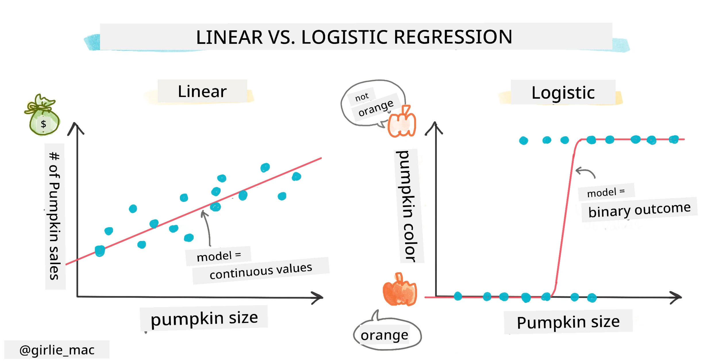
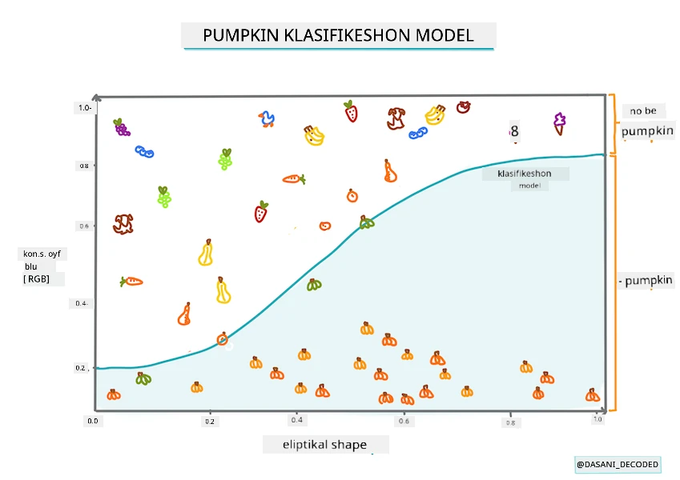
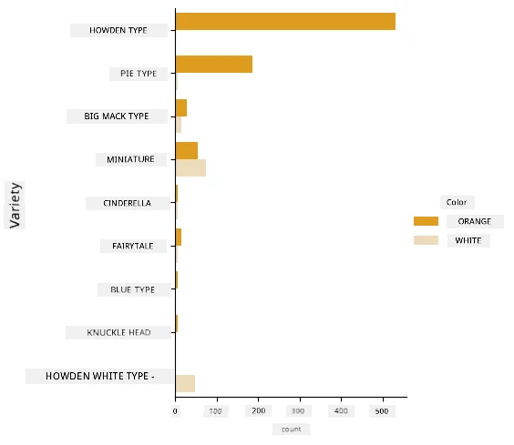
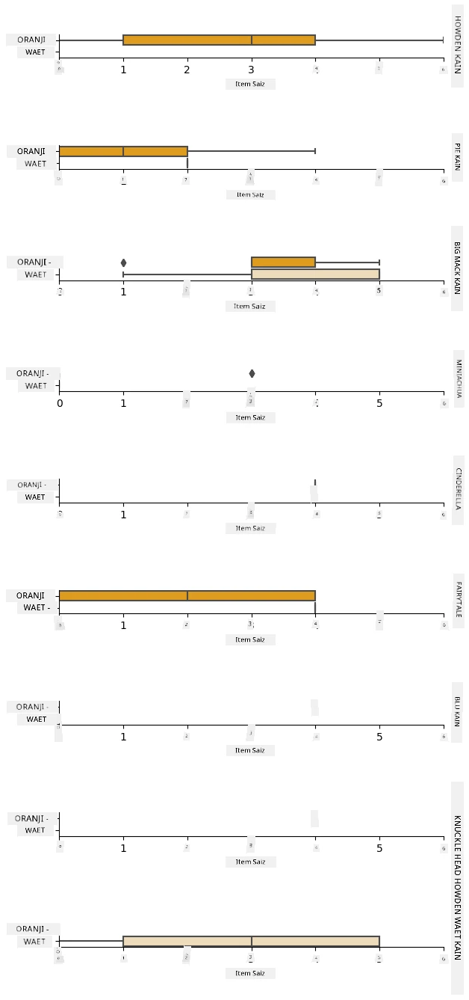

<!--
CO_OP_TRANSLATOR_METADATA:
{
  "original_hash": "abf86d845c84330bce205a46b382ec88",
  "translation_date": "2025-11-18T18:38:18+00:00",
  "source_file": "2-Regression/4-Logistic/README.md",
  "language_code": "pcm"
}
-->
# Logistic regression to predict categories



## [Pre-lecture quiz](https://ff-quizzes.netlify.app/en/ml/)

> ### [Dis lesson dey available for R!](../../../../2-Regression/4-Logistic/solution/R/lesson_4.html)

## Introduction

For dis last lesson wey dey about Regression, one of di basic _classic_ ML techniques, we go look Logistic Regression. You fit use dis technique to find patterns wey go help predict binary categories. Dis candy na chocolate or e no be chocolate? Dis sickness dey spread or e no dey spread? Dis customer go choose dis product or e no go choose am?

For dis lesson, you go learn:

- New library for data visualization
- Techniques for logistic regression

✅ Make you sabi how to work well with dis type of regression for dis [Learn module](https://docs.microsoft.com/learn/modules/train-evaluate-classification-models?WT.mc_id=academic-77952-leestott)

## Prerequisite

Since we don dey work with di pumpkin data, we don sabi say one binary category dey wey we fit work with: `Color`.

Make we build logistic regression model to predict di color wey pumpkin go likely be (orange 🎃 or white 👻).

> Why we dey talk about binary classification for lesson wey dey group about regression? Na because of language convenience, as logistic regression na [classification method](https://scikit-learn.org/stable/modules/linear_model.html#logistic-regression), even though e dey based on linear regression. You go learn other ways to classify data for di next lesson group.

## Define di question

For our purpose, we go express am as binary: 'White' or 'Not White'. Di dataset get 'striped' category but e no plenty, so we no go use am. E go even disappear once we remove null values from di dataset.

> 🎃 Fun fact, we dey sometimes call white pumpkins 'ghost' pumpkins. Dem no dey easy to carve, so dem no popular like di orange ones but dem dey look cool! So we fit also change di question to: 'Ghost' or 'Not Ghost'. 👻

## About logistic regression

Logistic regression different from linear regression wey you don learn before, for some important ways.

[](https://youtu.be/KpeCT6nEpBY "ML for beginners - Understanding Logistic Regression for Machine Learning Classification")

> 🎥 Click di image above for short video overview of logistic regression.

### Binary classification

Logistic regression no dey offer di same features as linear regression. Di former dey predict binary category ("white or not white") while di latter fit predict continuous values, like di price wey pumpkin go rise based on origin and harvest time.


> Infographic by [Dasani Madipalli](https://twitter.com/dasani_decoded)

### Other classifications

Other types of logistic regression dey, like multinomial and ordinal:

- **Multinomial**, wey involve more than one category - "Orange, White, and Striped".
- **Ordinal**, wey involve ordered categories, useful if we wan arrange outcomes logically, like di pumpkin sizes (mini, sm, med, lg, xl, xxl).


### Variables NO need to correlate

Remember how linear regression dey work better with correlated variables? Logistic regression no need di variables to align. E dey work well for dis data wey correlation no too strong.

### You need plenty clean data

Logistic regression go give better results if you use plenty data; our small dataset no dey optimal for dis task, so make you keep am for mind.

[](https://youtu.be/B2X4H9vcXTs "ML for beginners - Data Analysis and Preparation for Logistic Regression")

> 🎥 Click di image above for short video overview of preparing data for linear regression

✅ Think about di types of data wey go work well for logistic regression

## Exercise - tidy di data

First, clean di data small, remove null values and select only some columns:

1. Add dis code:

    ```python
  
    columns_to_select = ['City Name','Package','Variety', 'Origin','Item Size', 'Color']
    pumpkins = full_pumpkins.loc[:, columns_to_select]

    pumpkins.dropna(inplace=True)
    ```

    You fit always check di new dataframe:

    ```python
    pumpkins.info
    ```

### Visualization - categorical plot

By now you don load di [starter notebook](./notebook.ipynb) with pumpkin data again and clean am so e go keep dataset wey get few variables, including `Color`. Make we visualize di dataframe for di notebook using new library: [Seaborn](https://seaborn.pydata.org/index.html), wey dey built on Matplotlib wey we don use before.

Seaborn get better ways to visualize your data. For example, you fit compare di distributions of di data for each `Variety` and `Color` for categorical plot.

1. Create di plot using `catplot` function, use our pumpkin data `pumpkins`, and specify color mapping for each pumpkin category (orange or white):

    ```python
    import seaborn as sns
    
    palette = {
    'ORANGE': 'orange',
    'WHITE': 'wheat',
    }

    sns.catplot(
    data=pumpkins, y="Variety", hue="Color", kind="count",
    palette=palette, 
    )
    ```

    

    By looking di data, you go see how di Color data relate to Variety.

    ✅ Based on dis categorical plot, wetin be di interesting things you fit explore?

### Data pre-processing: feature and label encoding
Our pumpkins dataset get string values for all di columns. Humans dey understand categorical data well but machines no dey. Machine learning algorithms dey work better with numbers. Na why encoding dey important for data pre-processing phase, as e go help turn categorical data to numerical data without losing information. Good encoding dey lead to good model.

For feature encoding, two main types of encoders dey:

1. Ordinal encoder: e dey good for ordinal variables, wey be categorical variables wey get logical order, like `Item Size` column for our dataset. E go create mapping wey each category go represent number based on di order for di column.

    ```python
    from sklearn.preprocessing import OrdinalEncoder

    item_size_categories = [['sml', 'med', 'med-lge', 'lge', 'xlge', 'jbo', 'exjbo']]
    ordinal_features = ['Item Size']
    ordinal_encoder = OrdinalEncoder(categories=item_size_categories)
    ```

2. Categorical encoder: e dey good for nominal variables, wey be categorical variables wey no get logical order, like di features wey no be `Item Size` for our dataset. E dey use one-hot encoding, wey mean each category go get binary column: di encoded variable go be 1 if di pumpkin dey dat Variety and 0 if e no dey.

    ```python
    from sklearn.preprocessing import OneHotEncoder

    categorical_features = ['City Name', 'Package', 'Variety', 'Origin']
    categorical_encoder = OneHotEncoder(sparse_output=False)
    ```
Then, `ColumnTransformer` go combine multiple encoders into one step and apply dem to di correct columns.

```python
    from sklearn.compose import ColumnTransformer
    
    ct = ColumnTransformer(transformers=[
        ('ord', ordinal_encoder, ordinal_features),
        ('cat', categorical_encoder, categorical_features)
        ])
    
    ct.set_output(transform='pandas')
    encoded_features = ct.fit_transform(pumpkins)
```
To encode di label, we go use scikit-learn `LabelEncoder` class, wey dey help normalize labels so dem go get only values between 0 and n_classes-1 (here, 0 and 1).

```python
    from sklearn.preprocessing import LabelEncoder

    label_encoder = LabelEncoder()
    encoded_label = label_encoder.fit_transform(pumpkins['Color'])
```
Once we don encode di features and di label, we fit merge dem into new dataframe `encoded_pumpkins`.

```python
    encoded_pumpkins = encoded_features.assign(Color=encoded_label)
```
✅ Wetin be di advantage of using ordinal encoder for `Item Size` column?

### Analyse relationships between variables

Now we don pre-process our data, make we analyse di relationships between di features and di label to understand how well di model go fit predict di label based on di features.
Di best way to do dis analysis na to plot di data. We go use Seaborn `catplot` function again, to visualize di relationships between `Item Size`, `Variety` and `Color` for categorical plot. To plot di data well, we go use di encoded `Item Size` column and di unencoded `Variety` column.

```python
    palette = {
    'ORANGE': 'orange',
    'WHITE': 'wheat',
    }
    pumpkins['Item Size'] = encoded_pumpkins['ord__Item Size']

    g = sns.catplot(
        data=pumpkins,
        x="Item Size", y="Color", row='Variety',
        kind="box", orient="h",
        sharex=False, margin_titles=True,
        height=1.8, aspect=4, palette=palette,
    )
    g.set(xlabel="Item Size", ylabel="").set(xlim=(0,6))
    g.set_titles(row_template="{row_name}")
```


### Use swarm plot

Since Color na binary category (White or Not), e need 'specialized approach to visualization'. Other ways dey to visualize di relationship of dis category with other variables.

You fit visualize variables side-by-side with Seaborn plots.

1. Try 'swarm' plot to show di distribution of values:

    ```python
    palette = {
    0: 'orange',
    1: 'wheat'
    }
    sns.swarmplot(x="Color", y="ord__Item Size", data=encoded_pumpkins, palette=palette)
    ```

    

**Watch Out**: di code above fit show warning, as seaborn fit struggle to represent plenty datapoints for swarm plot. One solution na to reduce di size of di marker, by using 'size' parameter. But make you sabi say e go affect how clear di plot go be.

> **🧮 Show Me Di Math**
>
> Logistic regression dey use di concept of 'maximum likelihood' with [sigmoid functions](https://wikipedia.org/wiki/Sigmoid_function). 'Sigmoid Function' for plot dey look like 'S' shape. E dey take value and map am to somewhere between 0 and 1. Di curve dey also called 'logistic curve'. Di formula be like dis:
>
> 
>
> where di sigmoid midpoint dey for x's 0 point, L na di curve maximum value, and k na di curve steepness. If di function outcome pass 0.5, di label go dey class '1' for di binary choice. If e no pass, e go dey class '0'.

## Build your model

To build model wey go find dis binary classification dey easy for Scikit-learn.

[](https://youtu.be/MmZS2otPrQ8 "ML for beginners - Logistic Regression for classification of data")

> 🎥 Click di image above for short video overview of building linear regression model

1. Select di variables wey you wan use for your classification model and split di training and test sets by calling `train_test_split()`:

    ```python
    from sklearn.model_selection import train_test_split
    
    X = encoded_pumpkins[encoded_pumpkins.columns.difference(['Color'])]
    y = encoded_pumpkins['Color']

    X_train, X_test, y_train, y_test = train_test_split(X, y, test_size=0.2, random_state=0)
    
    ```

2. Now you fit train your model, by calling `fit()` with your training data, and print di result:

    ```python
    from sklearn.metrics import f1_score, classification_report 
    from sklearn.linear_model import LogisticRegression

    model = LogisticRegression()
    model.fit(X_train, y_train)
    predictions = model.predict(X_test)

    print(classification_report(y_test, predictions))
    print('Predicted labels: ', predictions)
    print('F1-score: ', f1_score(y_test, predictions))
    ```

    Check di model scoreboard. E no bad, considering say you get only about 1000 rows of data:

    ```output
                       precision    recall  f1-score   support
    
                    0       0.94      0.98      0.96       166
                    1       0.85      0.67      0.75        33
    
        accuracy                                0.92       199
        macro avg           0.89      0.82      0.85       199
        weighted avg        0.92      0.92      0.92       199
    
        Predicted labels:  [0 0 0 0 0 0 0 0 0 0 0 0 0 0 0 0 0 0 0 0 1 0 0 1 0 0 0 0 0 0 0 0 1 0 0 0 0
        0 0 0 0 0 1 0 1 0 0 1 0 0 0 0 0 1 0 1 0 1 0 1 0 0 0 0 0 0 0 0 0 0 0 0 0 0
        1 0 0 0 0 0 0 0 1 0 0 0 0 0 0 0 1 0 0 0 0 0 0 0 0 1 0 1 0 0 0 0 0 0 0 1 0
        0 0 0 0 0 0 0 0 0 0 0 0 0 0 0 0 0 0 0 0 0 1 0 0 0 0 0 0 0 0 1 0 0 0 1 1 0
        0 0 0 0 1 0 0 0 0 0 1 0 0 0 0 0 0 0 0 0 0 0 0 0 0 0 0 0 0 0 0 0 0 0 0 0 1
        0 0 0 1 0 0 0 0 0 0 0 0 1 1]
        F1-score:  0.7457627118644068
    ```

## Better understanding with confusion matrix

Even though you fit get scoreboard report [terms](https://scikit-learn.org/stable/modules/generated/sklearn.metrics.classification_report.html?highlight=classification_report#sklearn.metrics.classification_report) by printing di items above, you fit understand your model better by using [confusion matrix](https://scikit-learn.org/stable/modules/model_evaluation.html#confusion-matrix) to check how di model dey perform.

> 🎓 '[Confusion matrix](https://wikipedia.org/wiki/Confusion_matrix)' (or 'error matrix') na table wey dey show di model true vs. false positives and negatives, so we fit measure di accuracy of predictions.

1. To use confusion matrix, call `confusion_matrix()`:

    ```python
    from sklearn.metrics import confusion_matrix
    confusion_matrix(y_test, predictions)
    ```

    Check di model confusion matrix:

    ```output
    array([[162,   4],
           [ 11,  22]])
    ```

For Scikit-learn, confusion matrices Rows (axis 0) na actual labels and columns (axis 1) na predicted labels.

|       |   0   |   1   |
| :---: | :---: | :---: |
|   0   |  TN   |  FP   |
|   1   |  FN   |  TP   |

Wetin dey happen here? Imagine say our model dey classify pumpkins between two binary categories, category 'white' and category 'not-white'.

- If di model predict pumpkin as not white and e dey category 'not-white' for real, we dey call am true negative, wey dey di top left number.
- If di model predict pumpkin as white and e dey category 'not-white' for real, we dey call am false negative, wey dey di bottom left number. 
- If di model predict pumpkin as not white and e dey category 'white' for real, we dey call am false positive, wey dey di top right number. 
- If di model predict pumpkin as white and e dey category 'white' for real, we dey call am true positive, wey dey di bottom right number.
As you fit don guess, e beta make we get plenty true positives and true negatives, and make false positives and false negatives dey small, e mean say di model dey perform well.

How confusion matrix take relate to precision and recall? Remember say di classification report we print before show precision (0.85) and recall (0.67).

Precision = tp / (tp + fp) = 22 / (22 + 4) = 0.8461538461538461

Recall = tp / (tp + fn) = 22 / (22 + 11) = 0.6666666666666666

✅ Q: Based on di confusion matrix, how di model take perform? A: E no bad; we get plenty true negatives but we still get small false negatives.

Make we look di terms we see before again with di help of di confusion matrix mapping of TP/TN and FP/FN:

🎓 Precision: TP/(TP + FP) Di part of di relevant instances wey dey among di ones wey dem retrieve (e.g. which labels dem label well)

🎓 Recall: TP/(TP + FN) Di part of di relevant instances wey dem retrieve, whether dem label am well or dem no label am well

🎓 f1-score: (2 * precision * recall)/(precision + recall) Di average wey dem balance for precision and recall, di best na 1 and di worst na 0

🎓 Support: Di number of times wey each label show for di ones wey dem retrieve

🎓 Accuracy: (TP + TN)/(TP + TN + FP + FN) Di percentage of labels wey dem predict correct for di sample.

🎓 Macro Avg: Di calculation of di unweighted mean metrics for each label, e no dey consider label imbalance.

🎓 Weighted Avg: Di calculation of di mean metrics for each label, e dey consider label imbalance by weighting dem by di support (di number of true instances for each label).

✅ You fit think which metric you go focus on if you wan make your model reduce di number of false negatives?

## Visualize di ROC curve of dis model

[](https://youtu.be/GApO575jTA0 "ML for beginners - Analyzing Logistic Regression Performance with ROC Curves")

> 🎥 Click di image wey dey up for short video overview of ROC curves

Make we do one more visualization to see di 'ROC' curve:

```python
from sklearn.metrics import roc_curve, roc_auc_score
import matplotlib
import matplotlib.pyplot as plt
%matplotlib inline

y_scores = model.predict_proba(X_test)
fpr, tpr, thresholds = roc_curve(y_test, y_scores[:,1])

fig = plt.figure(figsize=(6, 6))
plt.plot([0, 1], [0, 1], 'k--')
plt.plot(fpr, tpr)
plt.xlabel('False Positive Rate')
plt.ylabel('True Positive Rate')
plt.title('ROC Curve')
plt.show()
```

Using Matplotlib, plot di model's [Receiving Operating Characteristic](https://scikit-learn.org/stable/auto_examples/model_selection/plot_roc.html?highlight=roc) or ROC. ROC curves dey usually dey used to see di output of classifier in terms of di true vs. false positives. "ROC curves dey usually show true positive rate for di Y axis, and false positive rate for di X axis." So, di steepness of di curve and di space wey dey between di midpoint line and di curve matter: you go wan curve wey go quick go up and pass di line. For our case, we get false positives for di beginning, and di line later go up and pass di line well:


Finally, use Scikit-learn's [`roc_auc_score` API](https://scikit-learn.org/stable/modules/generated/sklearn.metrics.roc_auc_score.html?highlight=roc_auc#sklearn.metrics.roc_auc_score) to calculate di actual 'Area Under di Curve' (AUC):

```python
auc = roc_auc_score(y_test,y_scores[:,1])
print(auc)
```
Di result na `0.9749908725812341`. Since AUC dey range from 0 to 1, you go wan big score, because model wey dey 100% correct for di predictions go get AUC of 1; for dis case, di model dey _pretty good_. 

For future lessons on classifications, you go learn how to dey improve di model's scores. But for now, congrats! You don complete dis regression lessons!

---
## 🚀Challenge

Plenty things still dey to learn about logistic regression! But di best way to learn na to try am. Find one dataset wey fit dis type of analysis and build model with am. Wetin you learn? tip: try [Kaggle](https://www.kaggle.com/search?q=logistic+regression+datasets) for interesting datasets.

## [Post-lecture quiz](https://ff-quizzes.netlify.app/en/ml/)

## Review & Self Study

Read di first few pages of [dis paper from Stanford](https://web.stanford.edu/~jurafsky/slp3/5.pdf) on some practical uses for logistic regression. Think about tasks wey go fit one or di other type of regression tasks wey we don study so far. Which one go work best?

## Assignment 

[Retrying dis regression](assignment.md)

---

<!-- CO-OP TRANSLATOR DISCLAIMER START -->
**Disclaimer**:  
Dis dokyument don use AI translation service [Co-op Translator](https://github.com/Azure/co-op-translator) do di translation. Even as we dey try make sure say e correct, abeg make you sabi say machine translation fit get mistake or no dey accurate well. Di original dokyument for im native language na di main correct source. For important information, e good make you use professional human translation. We no go fit take blame for any misunderstanding or wrong interpretation wey fit happen because you use dis translation.
<!-- CO-OP TRANSLATOR DISCLAIMER END -->