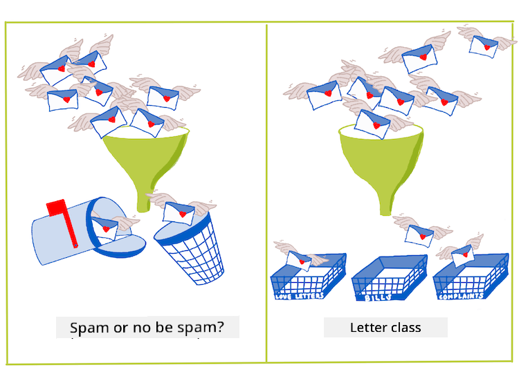
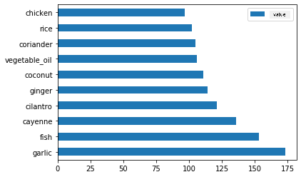
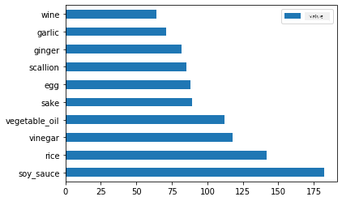
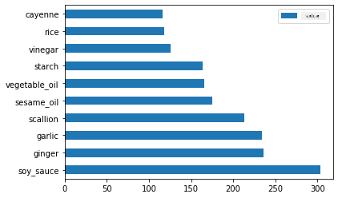
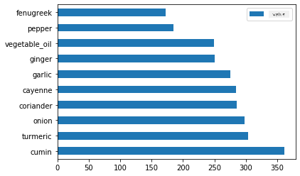
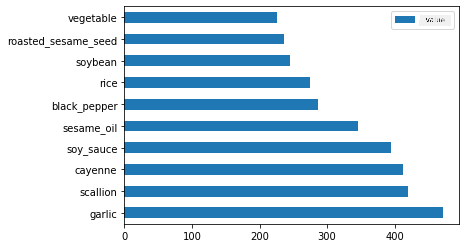

<!--
CO_OP_TRANSLATOR_METADATA:
{
  "original_hash": "aaf391d922bd6de5efba871d514c6d47",
  "translation_date": "2025-11-18T18:52:26+00:00",
  "source_file": "4-Classification/1-Introduction/README.md",
  "language_code": "pcm"
}
-->
# Introduction to classification

For dis four lessons, you go learn one important part of classic machine learning - _classification_. We go show you how to use different classification algorithms with one dataset wey dey talk about all di sweet cuisines for Asia and India. Hope say you dey hungry!


> Make we celebrate pan-Asian cuisines for dis lessons! Image by [Jen Looper](https://twitter.com/jenlooper)

Classification na one type of [supervised learning](https://wikipedia.org/wiki/Supervised_learning) wey get plenty similarity with regression techniques. If machine learning na all about predicting values or names for things by using datasets, then classification dey usually fall into two groups: _binary classification_ and _multiclass classification_.

[](https://youtu.be/eg8DJYwdMyg "Introduction to classification")

> 🎥 Click di image above for video: MIT's John Guttag dey explain classification

Remember:

- **Linear regression** help you predict relationship between variables and make correct predictions about where new datapoint go fall for di line. For example, you fit predict _wetin pumpkin price go be for September vs. December_.
- **Logistic regression** help you find "binary categories": for dis price level, _dis pumpkin na orange or e no be orange_?

Classification dey use different algorithms to find other ways to determine di label or class of one data point. Make we use dis cuisine data to see whether, by looking di group of ingredients, we fit know di cuisine origin.

## [Pre-lecture quiz](https://ff-quizzes.netlify.app/en/ml/)

> ### [Dis lesson dey available for R!](../../../../4-Classification/1-Introduction/solution/R/lesson_10.html)

### Introduction

Classification na one of di main work wey machine learning researchers and data scientists dey do. From simple classification of binary value ("dis email na spam or e no be spam"), to complex image classification and segmentation using computer vision, e dey always useful to fit sort data into classes and ask questions about am.

To talk di process in one more scientific way, di classification method go create one predictive model wey go help you map di relationship between input variables to output variables.



> Binary vs. multiclass problems wey classification algorithms dey handle. Infographic by [Jen Looper](https://twitter.com/jenlooper)

Before we start di process to clean our data, visualize am, and prepare am for our ML tasks, make we first learn small about di different ways wey machine learning fit classify data.

From [statistics](https://wikipedia.org/wiki/Statistical_classification), classification using classic machine learning dey use features like `smoker`, `weight`, and `age` to find _di chance to get X disease_. As one supervised learning technique wey be like di regression exercises wey you don do before, your data dey labeled and di ML algorithms go use di labels to classify and predict classes (or 'features') of one dataset and assign dem to one group or outcome.

✅ Take small time to imagine one dataset about cuisines. Wetin multiclass model fit answer? Wetin binary model fit answer? Wetin if you wan know whether one given cuisine dey likely to use fenugreek? Wetin if you wan see whether, if dem give you one grocery bag wey get star anise, artichokes, cauliflower, and horseradish, you fit make one typical Indian dish?

[](https://youtu.be/GuTeDbaNoEU "Crazy mystery baskets")

> 🎥 Click di image above for video. Di whole idea of di show 'Chopped' na di 'mystery basket' where chefs go make one dish from random ingredients. Machine learning model for don help!

## Hello 'classifier'

Di question wey we wan ask for dis cuisine dataset na **multiclass question**, because we get plenty national cuisines to work with. If we get one batch of ingredients, which of di many classes di data go fit?

Scikit-learn get different algorithms wey you fit use to classify data, depending on di kind problem wey you wan solve. For di next two lessons, you go learn about some of dis algorithms.

## Exercise - clean and balance your data

Di first work wey you go do before you start dis project na to clean and **balance** your data to get better results. Start with di blank _notebook.ipynb_ file wey dey di root of dis folder.

Di first thing wey you go install na [imblearn](https://imbalanced-learn.org/stable/). Dis na Scikit-learn package wey go help you balance di data better (you go learn more about dis work soon).

1. To install `imblearn`, run `pip install`, like dis:

    ```python
    pip install imblearn
    ```

1. Import di packages wey you need to import your data and visualize am, also import `SMOTE` from `imblearn`.

    ```python
    import pandas as pd
    import matplotlib.pyplot as plt
    import matplotlib as mpl
    import numpy as np
    from imblearn.over_sampling import SMOTE
    ```

    Now you don ready to import di data next.

1. Di next work na to import di data:

    ```python
    df  = pd.read_csv('../data/cuisines.csv')
    ```

   Using `read_csv()` go read di content of di csv file _cusines.csv_ and put am inside di variable `df`.

1. Check di shape of di data:

    ```python
    df.head()
    ```

   Di first five rows go look like dis:

    ```output
    |     | Unnamed: 0 | cuisine | almond | angelica | anise | anise_seed | apple | apple_brandy | apricot | armagnac | ... | whiskey | white_bread | white_wine | whole_grain_wheat_flour | wine | wood | yam | yeast | yogurt | zucchini |
    | --- | ---------- | ------- | ------ | -------- | ----- | ---------- | ----- | ------------ | ------- | -------- | --- | ------- | ----------- | ---------- | ----------------------- | ---- | ---- | --- | ----- | ------ | -------- |
    | 0   | 65         | indian  | 0      | 0        | 0     | 0          | 0     | 0            | 0       | 0        | ... | 0       | 0           | 0          | 0                       | 0    | 0    | 0   | 0     | 0      | 0        |
    | 1   | 66         | indian  | 1      | 0        | 0     | 0          | 0     | 0            | 0       | 0        | ... | 0       | 0           | 0          | 0                       | 0    | 0    | 0   | 0     | 0      | 0        |
    | 2   | 67         | indian  | 0      | 0        | 0     | 0          | 0     | 0            | 0       | 0        | ... | 0       | 0           | 0          | 0                       | 0    | 0    | 0   | 0     | 0      | 0        |
    | 3   | 68         | indian  | 0      | 0        | 0     | 0          | 0     | 0            | 0       | 0        | ... | 0       | 0           | 0          | 0                       | 0    | 0    | 0   | 0     | 0      | 0        |
    | 4   | 69         | indian  | 0      | 0        | 0     | 0          | 0     | 0            | 0       | 0        | ... | 0       | 0           | 0          | 0                       | 0    | 0    | 0   | 0     | 1      | 0        |
    ```

1. Get info about dis data by calling `info()`:

    ```python
    df.info()
    ```

    Your output go resemble:

    ```output
    <class 'pandas.core.frame.DataFrame'>
    RangeIndex: 2448 entries, 0 to 2447
    Columns: 385 entries, Unnamed: 0 to zucchini
    dtypes: int64(384), object(1)
    memory usage: 7.2+ MB
    ```

## Exercise - learning about cuisines

Now di work dey start to dey interesting. Make we find di distribution of data, per cuisine.

1. Plot di data as bars by calling `barh()`:

    ```python
    df.cuisine.value_counts().plot.barh()
    ```

    

    We get limited number of cuisines, but di distribution of data no dey even. You fit fix am! Before you do am, explore small more.

1. Find how much data dey available per cuisine and print am out:

    ```python
    thai_df = df[(df.cuisine == "thai")]
    japanese_df = df[(df.cuisine == "japanese")]
    chinese_df = df[(df.cuisine == "chinese")]
    indian_df = df[(df.cuisine == "indian")]
    korean_df = df[(df.cuisine == "korean")]
    
    print(f'thai df: {thai_df.shape}')
    print(f'japanese df: {japanese_df.shape}')
    print(f'chinese df: {chinese_df.shape}')
    print(f'indian df: {indian_df.shape}')
    print(f'korean df: {korean_df.shape}')
    ```

    Di output go look like dis:

    ```output
    thai df: (289, 385)
    japanese df: (320, 385)
    chinese df: (442, 385)
    indian df: (598, 385)
    korean df: (799, 385)
    ```

## Discovering ingredients

Now you fit dig deeper into di data and learn wetin be di common ingredients for each cuisine. You go need clean out di data wey dey repeat and dey cause confusion between cuisines, so make we learn about dis problem.

1. Create one function `create_ingredient()` for Python to create one ingredient dataframe. Dis function go start by dropping one column wey no dey helpful and sort di ingredients by their count:

    ```python
    def create_ingredient_df(df):
        ingredient_df = df.T.drop(['cuisine','Unnamed: 0']).sum(axis=1).to_frame('value')
        ingredient_df = ingredient_df[(ingredient_df.T != 0).any()]
        ingredient_df = ingredient_df.sort_values(by='value', ascending=False,
        inplace=False)
        return ingredient_df
    ```

   Now you fit use dis function to get idea of di top ten most popular ingredients by cuisine.

1. Call `create_ingredient()` and plot am by calling `barh()`:

    ```python
    thai_ingredient_df = create_ingredient_df(thai_df)
    thai_ingredient_df.head(10).plot.barh()
    ```

    

1. Do di same for di Japanese data:

    ```python
    japanese_ingredient_df = create_ingredient_df(japanese_df)
    japanese_ingredient_df.head(10).plot.barh()
    ```

    

1. Now for di Chinese ingredients:

    ```python
    chinese_ingredient_df = create_ingredient_df(chinese_df)
    chinese_ingredient_df.head(10).plot.barh()
    ```

    

1. Plot di Indian ingredients:

    ```python
    indian_ingredient_df = create_ingredient_df(indian_df)
    indian_ingredient_df.head(10).plot.barh()
    ```

    

1. Finally, plot di Korean ingredients:

    ```python
    korean_ingredient_df = create_ingredient_df(korean_df)
    korean_ingredient_df.head(10).plot.barh()
    ```

    

1. Now, drop di common ingredients wey dey cause confusion between different cuisines, by calling `drop()`:

   Everybody like rice, garlic, and ginger!

    ```python
    feature_df= df.drop(['cuisine','Unnamed: 0','rice','garlic','ginger'], axis=1)
    labels_df = df.cuisine #.unique()
    feature_df.head()
    ```

## Balance di dataset

Now wey you don clean di data, use [SMOTE](https://imbalanced-learn.org/dev/references/generated/imblearn.over_sampling.SMOTE.html) - "Synthetic Minority Over-sampling Technique" - to balance am.

1. Call `fit_resample()`, dis strategy dey generate new samples by interpolation.

    ```python
    oversample = SMOTE()
    transformed_feature_df, transformed_label_df = oversample.fit_resample(feature_df, labels_df)
    ```

    By balancing your data, you go get better results when you dey classify am. Think about binary classification. If most of your data dey one class, machine learning model go dey predict dat class more often, just because e get more data for am. Balancing di data go help remove dis imbalance.

1. Now you fit check di numbers of labels per ingredient:

    ```python
    print(f'new label count: {transformed_label_df.value_counts()}')
    print(f'old label count: {df.cuisine.value_counts()}')
    ```

    Your output go look like dis:

    ```output
    new label count: korean      799
    chinese     799
    indian      799
    japanese    799
    thai        799
    Name: cuisine, dtype: int64
    old label count: korean      799
    indian      598
    chinese     442
    japanese    320
    thai        289
    Name: cuisine, dtype: int64
    ```

    Di data dey clean, balanced, and very sweet!

1. Di last step na to save your balanced data, including labels and features, into one new dataframe wey you fit export into one file:

    ```python
    transformed_df = pd.concat([transformed_label_df,transformed_feature_df],axis=1, join='outer')
    ```

1. You fit look di data one more time using `transformed_df.head()` and `transformed_df.info()`. Save one copy of dis data for future lessons:

    ```python
    transformed_df.head()
    transformed_df.info()
    transformed_df.to_csv("../data/cleaned_cuisines.csv")
    ```

    Dis fresh CSV dey now for di root data folder.

---

## 🚀Challenge

Dis curriculum get plenty interesting datasets. Check di `data` folders and see whether any dey wey fit work for binary or multi-class classification? Wetin be di questions wey you go ask for dis dataset?

## [Post-lecture quiz](https://ff-quizzes.netlify.app/en/ml/)

## Review & Self Study

Explore SMOTE's API. Wetin be di use cases wey e dey best for? Wetin be di problems wey e dey solve?

## Assignment 

[Explore classification methods](assignment.md)

---

<!-- CO-OP TRANSLATOR DISCLAIMER START -->
**Disclaimer**:  
Dis dokyument don use AI transleshion service [Co-op Translator](https://github.com/Azure/co-op-translator) do di transleshion. Even as we dey try make am accurate, abeg make you sabi say automatik transleshion fit get mistake or no correct well. Di original dokyument wey dey for im native language na di one wey you go take as di main source. For important informashon, e good make you use professional human transleshion. We no go fit take blame for any misunderstanding or wrong meaning wey fit happen because you use dis transleshion.
<!-- CO-OP TRANSLATOR DISCLAIMER END -->