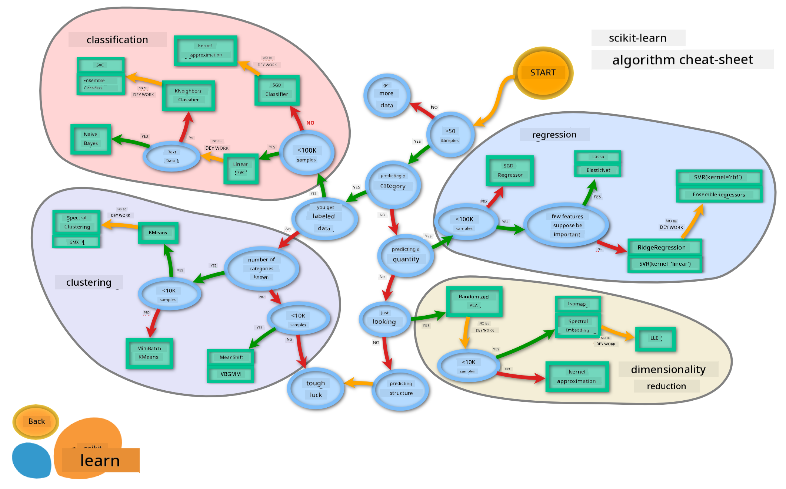

<!--
CO_OP_TRANSLATOR_METADATA:
{
  "original_hash": "49047911108adc49d605cddfb455749c",
  "translation_date": "2025-11-18T18:53:54+00:00",
  "source_file": "4-Classification/3-Classifiers-2/README.md",
  "language_code": "pcm"
}
-->
# Cuisine classifiers 2

For dis second lesson for classification, you go learn more ways wey you fit take classify numeric data. You go also sabi wetin fit happen if you choose one classifier instead of another one.

## [Pre-lecture quiz](https://ff-quizzes.netlify.app/en/ml/)

### Prerequisite

We dey assume say you don finish the previous lessons and you get clean dataset for your `data` folder wey dem call _cleaned_cuisines.csv_ for the root of dis 4-lesson folder.

### Preparation

We don load your _notebook.ipynb_ file with the clean dataset and we don divide am into X and y dataframes, ready for the model building process.

## A classification map

Before, you don learn about the different options wey you fit use to classify data using Microsoft's cheat sheet. Scikit-learn get similar cheat sheet wey dey more detailed and fit help you narrow down your estimators (another name for classifiers):


> Tip: [visit dis map online](https://scikit-learn.org/stable/tutorial/machine_learning_map/) and click along the path to read documentation.

### The plan

Dis map dey very helpful once you sabi your data well, as you fit 'walk' along the paths to make decision:

- We get >50 samples
- We wan predict category
- We get labeled data
- We get less than 100K samples
- ✨ We fit choose Linear SVC
- If e no work, since we get numeric data
    - We fit try ✨ KNeighbors Classifier 
      - If e no work, try ✨ SVC and ✨ Ensemble Classifiers

Dis path dey very helpful to follow.

## Exercise - split the data

Follow dis path, we suppose start by importing some libraries wey we go use.

1. Import the libraries wey we need:

    ```python
    from sklearn.neighbors import KNeighborsClassifier
    from sklearn.linear_model import LogisticRegression
    from sklearn.svm import SVC
    from sklearn.ensemble import RandomForestClassifier, AdaBoostClassifier
    from sklearn.model_selection import train_test_split, cross_val_score
    from sklearn.metrics import accuracy_score,precision_score,confusion_matrix,classification_report, precision_recall_curve
    import numpy as np
    ```

1. Split your training and test data:

    ```python
    X_train, X_test, y_train, y_test = train_test_split(cuisines_feature_df, cuisines_label_df, test_size=0.3)
    ```

## Linear SVC classifier

Support-Vector clustering (SVC) na one method from the Support-Vector machines family of ML techniques (learn more about dem below). For dis method, you fit choose 'kernel' to decide how to cluster the labels. The 'C' parameter dey refer to 'regularization' wey dey control how parameters go influence the model. The kernel fit be one of [several](https://scikit-learn.org/stable/modules/generated/sklearn.svm.SVC.html#sklearn.svm.SVC); here we set am to 'linear' to make sure say we dey use linear SVC. Probability dey default to 'false'; here we set am to 'true' to gather probability estimates. We set the random state to '0' to shuffle the data to get probabilities.

### Exercise - apply a linear SVC

Start by creating array of classifiers. You go dey add to dis array as we dey test.

1. Start with Linear SVC:

    ```python
    C = 10
    # Create different classifiers.
    classifiers = {
        'Linear SVC': SVC(kernel='linear', C=C, probability=True,random_state=0)
    }
    ```

2. Train your model using Linear SVC and print report:

    ```python
    n_classifiers = len(classifiers)
    
    for index, (name, classifier) in enumerate(classifiers.items()):
        classifier.fit(X_train, np.ravel(y_train))
    
        y_pred = classifier.predict(X_test)
        accuracy = accuracy_score(y_test, y_pred)
        print("Accuracy (train) for %s: %0.1f%% " % (name, accuracy * 100))
        print(classification_report(y_test,y_pred))
    ```

    The result dey okay:

    ```output
    Accuracy (train) for Linear SVC: 78.6% 
                  precision    recall  f1-score   support
    
         chinese       0.71      0.67      0.69       242
          indian       0.88      0.86      0.87       234
        japanese       0.79      0.74      0.76       254
          korean       0.85      0.81      0.83       242
            thai       0.71      0.86      0.78       227
    
        accuracy                           0.79      1199
       macro avg       0.79      0.79      0.79      1199
    weighted avg       0.79      0.79      0.79      1199
    ```

## K-Neighbors classifier

K-Neighbors na part of the "neighbors" family of ML methods, wey fit work for supervised and unsupervised learning. For dis method, dem dey create predefined number of points and gather data around dem points so dat generalized labels fit dey predicted for the data.

### Exercise - apply the K-Neighbors classifier

The previous classifier dey okay, e work well with the data, but maybe we fit get better accuracy. Try K-Neighbors classifier.

1. Add one line to your classifier array (add comma after the Linear SVC item):

    ```python
    'KNN classifier': KNeighborsClassifier(C),
    ```

    The result no too good:

    ```output
    Accuracy (train) for KNN classifier: 73.8% 
                  precision    recall  f1-score   support
    
         chinese       0.64      0.67      0.66       242
          indian       0.86      0.78      0.82       234
        japanese       0.66      0.83      0.74       254
          korean       0.94      0.58      0.72       242
            thai       0.71      0.82      0.76       227
    
        accuracy                           0.74      1199
       macro avg       0.76      0.74      0.74      1199
    weighted avg       0.76      0.74      0.74      1199
    ```

    ✅ Learn about [K-Neighbors](https://scikit-learn.org/stable/modules/neighbors.html#neighbors)

## Support Vector Classifier

Support-Vector classifiers na part of the [Support-Vector Machine](https://wikipedia.org/wiki/Support-vector_machine) family of ML methods wey dem dey use for classification and regression tasks. SVMs "map training examples to points for space" to maximize the distance between two categories. Data wey go come later go dey mapped into dis space so dem fit predict their category.

### Exercise - apply a Support Vector Classifier

Make we try get better accuracy with Support Vector Classifier.

1. Add comma after the K-Neighbors item, then add dis line:

    ```python
    'SVC': SVC(),
    ```

    The result dey very good!

    ```output
    Accuracy (train) for SVC: 83.2% 
                  precision    recall  f1-score   support
    
         chinese       0.79      0.74      0.76       242
          indian       0.88      0.90      0.89       234
        japanese       0.87      0.81      0.84       254
          korean       0.91      0.82      0.86       242
            thai       0.74      0.90      0.81       227
    
        accuracy                           0.83      1199
       macro avg       0.84      0.83      0.83      1199
    weighted avg       0.84      0.83      0.83      1199
    ```

    ✅ Learn about [Support-Vectors](https://scikit-learn.org/stable/modules/svm.html#svm)

## Ensemble Classifiers

Make we follow the path reach the end, even though the previous test dey very good. Make we try some 'Ensemble Classifiers, like Random Forest and AdaBoost:

```python
  'RFST': RandomForestClassifier(n_estimators=100),
  'ADA': AdaBoostClassifier(n_estimators=100)
```

The result dey very good, especially for Random Forest:

```output
Accuracy (train) for RFST: 84.5% 
              precision    recall  f1-score   support

     chinese       0.80      0.77      0.78       242
      indian       0.89      0.92      0.90       234
    japanese       0.86      0.84      0.85       254
      korean       0.88      0.83      0.85       242
        thai       0.80      0.87      0.83       227

    accuracy                           0.84      1199
   macro avg       0.85      0.85      0.84      1199
weighted avg       0.85      0.84      0.84      1199

Accuracy (train) for ADA: 72.4% 
              precision    recall  f1-score   support

     chinese       0.64      0.49      0.56       242
      indian       0.91      0.83      0.87       234
    japanese       0.68      0.69      0.69       254
      korean       0.73      0.79      0.76       242
        thai       0.67      0.83      0.74       227

    accuracy                           0.72      1199
   macro avg       0.73      0.73      0.72      1199
weighted avg       0.73      0.72      0.72      1199
```

✅ Learn about [Ensemble Classifiers](https://scikit-learn.org/stable/modules/ensemble.html)

Dis method of Machine Learning "combine the predictions of several base estimators" to improve the model quality. For our example, we use Random Trees and AdaBoost. 

- [Random Forest](https://scikit-learn.org/stable/modules/ensemble.html#forest), na averaging method, e dey build 'forest' of 'decision trees' wey get randomness to avoid overfitting. The n_estimators parameter dey set to the number of trees.

- [AdaBoost](https://scikit-learn.org/stable/modules/generated/sklearn.ensemble.AdaBoostClassifier.html) dey fit classifier to dataset and then fit copies of dat classifier to the same dataset. E dey focus on the weights of items wey dem classify wrong and adjust the fit for the next classifier to correct am.

---

## 🚀Challenge

Each of dis techniques get plenty parameters wey you fit tweak. Research each one default parameters and think about wetin tweaking dis parameters go mean for the model quality.

## [Post-lecture quiz](https://ff-quizzes.netlify.app/en/ml/)

## Review & Self Study

Plenty grammar dey for dis lessons, so take small time review [dis list](https://docs.microsoft.com/dotnet/machine-learning/resources/glossary?WT.mc_id=academic-77952-leestott) of useful terminology!

## Assignment 

[Parameter play](assignment.md)

---

<!-- CO-OP TRANSLATOR DISCLAIMER START -->
**Disclaimer**:  
Dis dokyument don use AI transleshion service [Co-op Translator](https://github.com/Azure/co-op-translator) do di transleshion. Even though we dey try make am accurate, abeg make you sabi say machine transleshion fit get mistake or no dey correct well. Di original dokyument wey dey for im native language na di main source wey you go fit trust. For important informashon, e good make you use professional human transleshion. We no go fit take blame for any misunderstanding or wrong meaning wey fit happen because you use dis transleshion.
<!-- CO-OP TRANSLATOR DISCLAIMER END -->