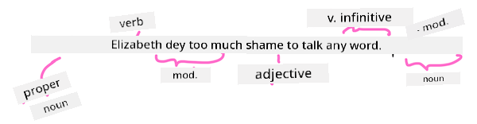

<!--
CO_OP_TRANSLATOR_METADATA:
{
  "original_hash": "5f3cb462e3122e1afe7ab0050ccf2bd3",
  "translation_date": "2025-11-18T18:35:15+00:00",
  "source_file": "6-NLP/2-Tasks/README.md",
  "language_code": "pcm"
}
-->
# Common natural language processing tasks and techniques

For most *natural language processing* tasks, di text wey you wan process go need make you break am down, check am well, and keep di result or compare am wit rules and data sets. Dis tasks go help programmer fit understand di _meaning_ or _intent_ or even di _frequency_ of words and terms wey dey inside di text.

## [Pre-lecture quiz](https://ff-quizzes.netlify.app/en/ml/)

Make we look di common techniques wey dem dey use to process text. If you join am wit machine learning, e go help you analyze plenty text well well. But before you go use ML for dis tasks, make we first understand di wahala wey NLP specialist dey face.

## Tasks wey dey common for NLP

Plenty ways dey to analyze di text wey you dey work on. You fit do some tasks wey go help you understand di text and make you fit draw conclusion. Normally, you go dey do dis tasks one after di other.

### Tokenization

Di first thing wey most NLP algorithms dey do na to divide di text into tokens, or words. E dey look simple, but di wahala of punctuation and di way different languages dey use word and sentence separator fit make am hard. You go need use different methods to know where e dey start and end.


> Tokenizing one sentence from **Pride and Prejudice**. Infographic by [Jen Looper](https://twitter.com/jenlooper)

### Embeddings

[Word embeddings](https://wikipedia.org/wiki/Word_embedding) na one way to change your text data to numbers. Dem dey do embeddings so dat words wey get similar meaning or wey dey appear together go dey close to each other.


> "I have the highest respect for your nerves, they are my old friends." - Word embeddings for one sentence from **Pride and Prejudice**. Infographic by [Jen Looper](https://twitter.com/jenlooper)

✅ Try [dis tool wey dey interesting](https://projector.tensorflow.org/) to test word embeddings. If you click one word, e go show clusters of similar words: 'toy' dey cluster wit 'disney', 'lego', 'playstation', and 'console'.

### Parsing & Part-of-speech Tagging

Every word wey dem don tokenize fit get tag as part of speech - like noun, verb, or adjective. Di sentence `the quick red fox jumped over the lazy brown dog` fit get POS tag like fox = noun, jumped = verb.



> Parsing one sentence from **Pride and Prejudice**. Infographic by [Jen Looper](https://twitter.com/jenlooper)

Parsing na di way wey dem dey recognize how words dey relate to each other for sentence - like `the quick red fox jumped` na adjective-noun-verb sequence wey dey different from di `lazy brown dog` sequence.

### Word and Phrase Frequencies

One useful thing wey you fit do when you dey analyze plenty text na to create dictionary of every word or phrase wey dey important and how many times e appear. Di phrase `the quick red fox jumped over the lazy brown dog` get word frequency of 2 for di.

Make we look one example text wey we go count di frequency of words. Rudyard Kipling poem The Winners get dis verse:

```output
What the moral? Who rides may read.
When the night is thick and the tracks are blind
A friend at a pinch is a friend, indeed,
But a fool to wait for the laggard behind.
Down to Gehenna or up to the Throne,
He travels the fastest who travels alone.
```

As phrase frequencies fit dey case insensitive or case sensitive as you want, di phrase `a friend` get frequency of 2 and `the` get frequency of 6, and `travels` na 2.

### N-grams

You fit divide text into sequence of words wey get fixed length, like one word (unigram), two words (bigrams), three words (trigrams) or any number of words (n-grams).

For example, `the quick red fox jumped over the lazy brown dog` wit n-gram score of 2 go give dis n-grams:

1. the quick 
2. quick red 
3. red fox
4. fox jumped 
5. jumped over 
6. over the 
7. the lazy 
8. lazy brown 
9. brown dog

E go dey easier to see am like sliding box wey dey move over di sentence. For n-grams of 3 words, di n-gram dey bold for each sentence:

1.   <u>**the quick red**</u> fox jumped over the lazy brown dog
2.   the **<u>quick red fox</u>** jumped over the lazy brown dog
3.   the quick **<u>red fox jumped</u>** over the lazy brown dog
4.   the quick red **<u>fox jumped over</u>** the lazy brown dog
5.   the quick red fox **<u>jumped over the</u>** lazy brown dog
6.   the quick red fox jumped **<u>over the lazy</u>** brown dog
7.   the quick red fox jumped over <u>**the lazy brown**</u> dog
8.   the quick red fox jumped over the **<u>lazy brown dog</u>**


> N-gram value of 3: Infographic by [Jen Looper](https://twitter.com/jenlooper)

### Noun phrase Extraction

For most sentences, noun dey as di subject or object of di sentence. For English, e dey easy to see as e dey get 'a' or 'an' or 'the' before am. To find di subject or object of di sentence by 'extracting di noun phrase' na common task for NLP when you dey try understand di meaning of di sentence.

✅ For di sentence "I cannot fix on the hour, or the spot, or the look or the words, which laid the foundation. It is too long ago. I was in the middle before I knew that I had begun.", you fit find di noun phrases?

For di sentence `the quick red fox jumped over the lazy brown dog` e get 2 noun phrases: **quick red fox** and **lazy brown dog**.

### Sentiment analysis

You fit analyze sentence or text to know di sentiment, whether e dey *positive* or *negative*. Sentiment dey measured wit *polarity* and *objectivity/subjectivity*. Polarity dey range from -1.0 to 1.0 (negative to positive) and 0.0 to 1.0 (most objective to most subjective).

✅ Later you go learn say different ways dey to find sentiment wit machine learning, but one way na to get list of words and phrases wey human expert don categorize as positive or negative, then use dat model for text to calculate polarity score. You fit see how e go work for some cases and no go work well for others?

### Inflection

Inflection dey help you take one word and get di singular or plural form of di word.

### Lemmatization

*Lemma* na di root or main word for group of words, like *flew*, *flies*, *flying* get lemma of di verb *fly*.

Plenty useful databases dey for NLP researcher, like:

### WordNet

[WordNet](https://wordnet.princeton.edu/) na database of words, synonyms, antonyms and many other details for every word for plenty languages. E dey very useful when you dey try build translations, spell checkers, or language tools of any type.

## NLP Libraries

Lucky for you, you no need build all dis techniques by yourself, as better Python libraries dey wey go make am easy for developers wey no be experts for natural language processing or machine learning. Di next lessons go show more examples of dis, but for here you go learn some useful examples to help you for di next task.

### Exercise - using `TextBlob` library

Make we use one library wey dem call TextBlob as e get helpful APIs to handle dis kind tasks. TextBlob "stand on di big shoulders of [NLTK](https://nltk.org) and [pattern](https://github.com/clips/pattern), and e dey work well wit both." E get plenty ML wey dem don put inside di API.

> Note: One useful [Quick Start](https://textblob.readthedocs.io/en/dev/quickstart.html#quickstart) guide dey for TextBlob wey dem recommend for experienced Python developers 

When you dey try find *noun phrases*, TextBlob get different options of extractors to find noun phrases.

1. Check `ConllExtractor`.

    ```python
    from textblob import TextBlob
    from textblob.np_extractors import ConllExtractor
    # import and create a Conll extractor to use later 
    extractor = ConllExtractor()
    
    # later when you need a noun phrase extractor:
    user_input = input("> ")
    user_input_blob = TextBlob(user_input, np_extractor=extractor)  # note non-default extractor specified
    np = user_input_blob.noun_phrases                                    
    ```

    > Wetin dey happen here? [ConllExtractor](https://textblob.readthedocs.io/en/dev/api_reference.html?highlight=Conll#textblob.en.np_extractors.ConllExtractor) na "Noun phrase extractor wey dey use chunk parsing wey dem train wit di ConLL-2000 training corpus." ConLL-2000 na di 2000 Conference on Computational Natural Language Learning. Every year di conference dey host workshop to solve one big NLP problem, and for 2000 na noun chunking. Dem train one model wit Wall Street Journal, wit "sections 15-18 as training data (211727 tokens) and section 20 as test data (47377 tokens)". You fit check di procedures wey dem use [here](https://www.clips.uantwerpen.be/conll2000/chunking/) and di [results](https://ifarm.nl/erikt/research/np-chunking.html).

### Challenge - improving your bot with NLP

For di last lesson you build one simple Q&A bot. Now, you go make Marvin get small sympathy by analyzing di input wey you give am for sentiment and print response wey match di sentiment. You go also need find `noun_phrase` and ask about am.

Steps to build better conversational bot:

1. Print instructions wey go tell di user how dem go interact wit di bot
2. Start loop 
   1. Accept user input
   2. If user talk say dem wan exit, then exit
   3. Process user input and find di correct sentiment response
   4. If noun phrase dey inside di sentiment, make am plural and ask for more input about di topic
   5. Print response
3. Loop back to step 2

Dis na di code snippet to find sentiment wit TextBlob. Note say e get only four *gradients* of sentiment response (you fit add more if you like):

```python
if user_input_blob.polarity <= -0.5:
  response = "Oh dear, that sounds bad. "
elif user_input_blob.polarity <= 0:
  response = "Hmm, that's not great. "
elif user_input_blob.polarity <= 0.5:
  response = "Well, that sounds positive. "
elif user_input_blob.polarity <= 1:
  response = "Wow, that sounds great. "
```

Dis na sample output to guide you (user input dey for lines wey start wit >):

```output
Hello, I am Marvin, the friendly robot.
You can end this conversation at any time by typing 'bye'
After typing each answer, press 'enter'
How are you today?
> I am ok
Well, that sounds positive. Can you tell me more?
> I went for a walk and saw a lovely cat
Well, that sounds positive. Can you tell me more about lovely cats?
> cats are the best. But I also have a cool dog
Wow, that sounds great. Can you tell me more about cool dogs?
> I have an old hounddog but he is sick
Hmm, that's not great. Can you tell me more about old hounddogs?
> bye
It was nice talking to you, goodbye!
```

One possible solution to di task dey [here](https://github.com/microsoft/ML-For-Beginners/blob/main/6-NLP/2-Tasks/solution/bot.py)

✅ Knowledge Check

1. You think say di sympathetic responses fit make person believe say di bot really understand dem?
2. Di way di bot dey find di noun phrase, e dey make am look more 'real'?
3. Why extracting 'noun phrase' from sentence dey useful?

---

Try implement di bot for di knowledge check and test am wit your friend. E fit trick dem? You fit make di bot look more 'real'?

## 🚀Challenge

Pick one task for di knowledge check and try implement am. Test di bot wit your friend. E fit trick dem? You fit make di bot look more 'real'?

## [Post-lecture quiz](https://ff-quizzes.netlify.app/en/ml/)

## Review & Self Study

For di next few lessons you go learn more about sentiment analysis. Research dis interesting technique for articles like di ones wey dey [KDNuggets](https://www.kdnuggets.com/tag/nlp)

## Assignment 

[Make a bot talk back](assignment.md)

---

<!-- CO-OP TRANSLATOR DISCLAIMER START -->
**Disclaimer**:  
Dis dokyument don use AI transleshion service [Co-op Translator](https://github.com/Azure/co-op-translator) do di transleshion. Even as we dey try make am accurate, abeg make you sabi say transleshion wey machine do fit get mistake or no correct well. Di original dokyument for im native language na di one wey you go take as di main source. For important mata, e good make professional human transleshion dey use. We no go fit take blame for any misunderstanding or wrong interpretation wey fit happen because you use dis transleshion.
<!-- CO-OP TRANSLATOR DISCLAIMER END -->