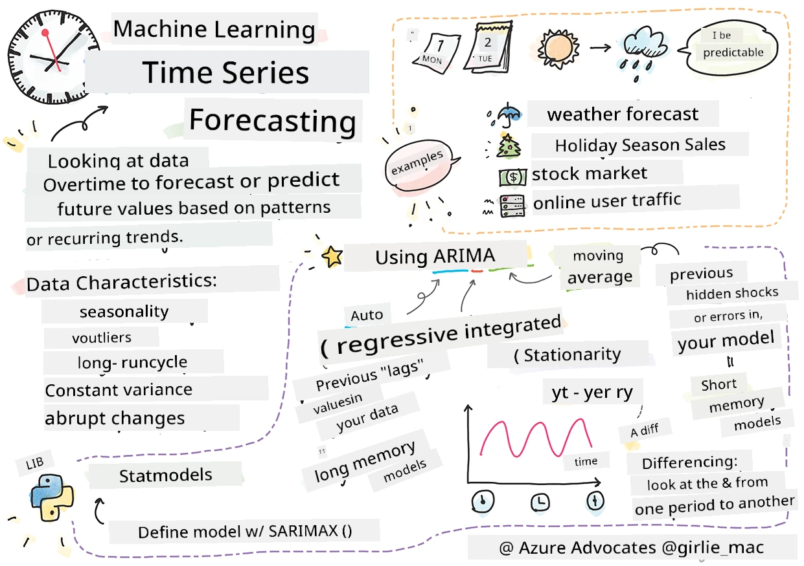

<!--
CO_OP_TRANSLATOR_METADATA:
{
  "original_hash": "662b509c39eee205687726636d0a8455",
  "translation_date": "2025-11-18T18:59:08+00:00",
  "source_file": "7-TimeSeries/1-Introduction/README.md",
  "language_code": "pcm"
}
-->
# Introduction to time series forecasting



> Sketchnote by [Tomomi Imura](https://www.twitter.com/girlie_mac)

For dis lesson and di next one, you go learn small about time series forecasting, one interesting and useful part of ML scientist work wey no too popular like other topics. Time series forecasting be like 'crystal ball': e dey use past performance of one variable like price to predict wetin e fit be for future.

[](https://youtu.be/cBojo1hsHiI "Introduction to time series forecasting")

> 🎥 Click di image wey dey up for video about time series forecasting

## [Pre-lecture quiz](https://ff-quizzes.netlify.app/en/ml/)

Dis field dey useful and interesting, e get real value for business because e dey directly apply to problems like pricing, inventory, and supply chain wahala. Even though deep learning techniques don dey help to get better insight to predict future performance, time series forecasting still dey depend well well on classic ML techniques.

> Penn State get one useful time series curriculum wey you fit find [here](https://online.stat.psu.edu/stat510/lesson/1)

## Introduction

Imagine say you dey manage smart parking meters wey dey give data about how people dey use am and how long dem dey use am over time.

> Wetin if you fit predict, based on di meter past performance, wetin e go worth for future according to supply and demand?

To predict di right time to act so you go fit achieve your goal na one challenge wey time series forecasting fit solve. People no go happy if dem dey pay more for busy times when dem dey find parking space, but e go sure generate money to clean di streets!

Make we check di types of time series algorithms and start one notebook to clean and prepare some data. Di data wey you go analyze na from GEFCom2014 forecasting competition. E get 3 years hourly electricity load and temperature values between 2012 and 2014. Based on di historical patterns of electricity load and temperature, you fit predict di future values of electricity load.

For dis example, you go learn how to forecast one time step ahead, using only historical load data. But before you start, e good make you understand wetin dey happen for di background.

## Some definitions

When you hear 'time series', you need to sabi how e dey used for different contexts.

🎓 **Time series**

For mathematics, "time series na series of data points wey dem arrange (or list or graph) for time order. Di common one na sequence wey dem take for equal time intervals." Example of time series na di daily closing value of [Dow Jones Industrial Average](https://wikipedia.org/wiki/Time_series). Time series plots and statistical modeling dey common for signal processing, weather forecasting, earthquake prediction, and other fields wey dey deal with events wey dey happen and data points wey dem fit plot over time.

🎓 **Time series analysis**

Time series analysis na di analysis of di time series data wey we talk about. Time series data fit get different forms, like 'interrupted time series' wey dey detect patterns for di time series evolution before and after one interrupting event. Di type of analysis wey di time series need, dey depend on di nature of di data. Time series data fit be series of numbers or characters.

Di analysis wey dem go do, dey use different methods, like frequency-domain and time-domain, linear and nonlinear, and more. [Learn more](https://www.itl.nist.gov/div898/handbook/pmc/section4/pmc4.htm) about di many ways to analyze dis type of data.

🎓 **Time series forecasting**

Time series forecasting na di use of one model to predict future values based on di patterns wey di data show for past. Even though regression models fit explore time series data, with time indices as x variables for plot, dis kind data dey best analyzed with special types of models.

Time series data na list of ordered observations, e no be like data wey linear regression fit analyze. Di common one na ARIMA, wey mean "Autoregressive Integrated Moving Average".

[ARIMA models](https://online.stat.psu.edu/stat510/lesson/1/1.1) "dey relate di present value of one series to past values and past prediction errors." Dem dey best for analyzing time-domain data, where data dey arranged over time.

> ARIMA models get different types wey you fit learn about [here](https://people.duke.edu/~rnau/411arim.htm) and you go touch am for di next lesson.

For di next lesson, you go build ARIMA model using [Univariate Time Series](https://itl.nist.gov/div898/handbook/pmc/section4/pmc44.htm), wey dey focus on one variable wey dey change value over time. Example of dis type of data na [dis dataset](https://itl.nist.gov/div898/handbook/pmc/section4/pmc4411.htm) wey dey record di monthly CO2 concentration for Mauna Loa Observatory:

|  CO2   | YearMonth | Year  | Month |
| :----: | :-------: | :---: | :---: |
| 330.62 |  1975.04  | 1975  |   1   |
| 331.40 |  1975.13  | 1975  |   2   |
| 331.87 |  1975.21  | 1975  |   3   |
| 333.18 |  1975.29  | 1975  |   4   |
| 333.92 |  1975.38  | 1975  |   5   |
| 333.43 |  1975.46  | 1975  |   6   |
| 331.85 |  1975.54  | 1975  |   7   |
| 330.01 |  1975.63  | 1975  |   8   |
| 328.51 |  1975.71  | 1975  |   9   |
| 328.41 |  1975.79  | 1975  |  10   |
| 329.25 |  1975.88  | 1975  |  11   |
| 330.97 |  1975.96  | 1975  |  12   |

✅ Identify di variable wey dey change over time for dis dataset

## Time Series data characteristics to consider

When you dey look time series data, you fit notice say e get [some characteristics](https://online.stat.psu.edu/stat510/lesson/1/1.1) wey you need to consider and reduce so you go fit understand di patterns well. If you see time series data as one 'signal' wey you wan analyze, dis characteristics fit be 'noise'. You go need reduce dis 'noise' by using some statistical techniques.

Here be some concepts wey you need sabi to work with time series:

🎓 **Trends**

Trends na measurable increase and decrease over time. [Read more](https://machinelearningmastery.com/time-series-trends-in-python). For time series, e dey about how to use and, if necessary, remove trends from di time series.

🎓 **[Seasonality](https://machinelearningmastery.com/time-series-seasonality-with-python/)**

Seasonality na periodic fluctuations, like holiday rush wey fit affect sales, for example. [Check](https://itl.nist.gov/div898/handbook/pmc/section4/pmc443.htm) how different types of plots dey show seasonality for data.

🎓 **Outliers**

Outliers na data wey dey far from di normal variance.

🎓 **Long-run cycle**

Apart from seasonality, data fit show long-run cycle like economic down-turn wey dey last more than one year.

🎓 **Constant variance**

Over time, some data dey show constant fluctuations, like energy usage for day and night.

🎓 **Abrupt changes**

Di data fit show abrupt change wey need more analysis. Example na di sudden closure of businesses because of COVID wey cause changes for data.

✅ Dis [sample time series plot](https://www.kaggle.com/kashnitsky/topic-9-part-1-time-series-analysis-in-python) dey show daily in-game currency wey people dey spend over some years. You fit identify any of di characteristics wey we list for dis data?


## Exercise - getting started with power usage data

Make we start to create time series model to predict future power usage based on past usage.

> Di data for dis example na from GEFCom2014 forecasting competition. E get 3 years hourly electricity load and temperature values between 2012 and 2014.
>
> Tao Hong, Pierre Pinson, Shu Fan, Hamidreza Zareipour, Alberto Troccoli and Rob J. Hyndman, "Probabilistic energy forecasting: Global Energy Forecasting Competition 2014 and beyond", International Journal of Forecasting, vol.32, no.3, pp 896-913, July-September, 2016.

1. For di `working` folder of dis lesson, open di _notebook.ipynb_ file. Start by adding libraries wey go help you load and visualize data

    ```python
    import os
    import matplotlib.pyplot as plt
    from common.utils import load_data
    %matplotlib inline
    ```

    Note, you dey use di files from di `common` folder wey dey set up your environment and handle downloading di data.

2. Next, check di data as dataframe by calling `load_data()` and `head()`:

    ```python
    data_dir = './data'
    energy = load_data(data_dir)[['load']]
    energy.head()
    ```

    You go see say e get two columns wey represent date and load:

    |                     |  load  |
    | :-----------------: | :----: |
    | 2012-01-01 00:00:00 | 2698.0 |
    | 2012-01-01 01:00:00 | 2558.0 |
    | 2012-01-01 02:00:00 | 2444.0 |
    | 2012-01-01 03:00:00 | 2402.0 |
    | 2012-01-01 04:00:00 | 2403.0 |

3. Now, plot di data by calling `plot()`:

    ```python
    energy.plot(y='load', subplots=True, figsize=(15, 8), fontsize=12)
    plt.xlabel('timestamp', fontsize=12)
    plt.ylabel('load', fontsize=12)
    plt.show()
    ```

    

4. Now, plot di first week of July 2014, by providing am as input to di `energy` in `[from date]: [to date]` pattern:

    ```python
    energy['2014-07-01':'2014-07-07'].plot(y='load', subplots=True, figsize=(15, 8), fontsize=12)
    plt.xlabel('timestamp', fontsize=12)
    plt.ylabel('load', fontsize=12)
    plt.show()
    ```

    

    Di plot fine well! Check di plots and see if you fit identify any of di characteristics wey we list before. Wetin you fit learn by visualizing di data?

For di next lesson, you go create ARIMA model to make some forecasts.

---

## 🚀Challenge

Make list of all di industries and areas wey you fit think of wey go benefit from time series forecasting. You fit think of how dis techniques fit apply for arts? Econometrics? Ecology? Retail? Industry? Finance? Where else?

## [Post-lecture quiz](https://ff-quizzes.netlify.app/en/ml/)

## Review & Self Study

Even though we no go cover am here, neural networks dey sometimes used to improve classic methods of time series forecasting. Read more about am [for dis article](https://medium.com/microsoftazure/neural-networks-for-forecasting-financial-and-economic-time-series-6aca370ff412)

## Assignment

[Visualize some more time series](assignment.md)

---

<!-- CO-OP TRANSLATOR DISCLAIMER START -->
**Disclaimer**:  
Dis dokyument don use AI transleshion service [Co-op Translator](https://github.com/Azure/co-op-translator) do di transleshion. Even as we dey try make am accurate, abeg make you sabi say automatik transleshion fit get mistake or no dey correct well. Di original dokyument wey dey for im native language na di one wey you go take as di main source. For important mata, e good make you use professional human transleshion. We no go fit take blame for any misunderstanding or wrong interpretation wey go happen because you use dis transleshion.
<!-- CO-OP TRANSLATOR DISCLAIMER END -->