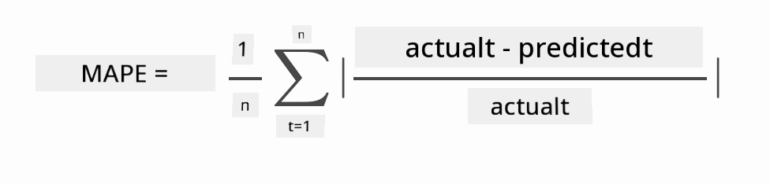

<!--
CO_OP_TRANSLATOR_METADATA:
{
  "original_hash": "917dbf890db71a322f306050cb284749",
  "translation_date": "2025-11-18T18:56:41+00:00",
  "source_file": "7-TimeSeries/2-ARIMA/README.md",
  "language_code": "pcm"
}
-->
# Time series forecasting wit ARIMA

For di last lesson, you don learn small about time series forecasting and you don load one dataset wey dey show how electrical load dey change for one time period.

[](https://youtu.be/IUSk-YDau10 "Introduction to ARIMA")

> 🎥 Click di image wey dey up for one video: Small introduction to ARIMA models. Di example na for R, but di idea na di same.

## [Pre-lecture quiz](https://ff-quizzes.netlify.app/en/ml/)

## Introduction

For dis lesson, you go learn one special way to build models wit [ARIMA: *A*uto*R*egressive *I*ntegrated *M*oving *A*verage](https://wikipedia.org/wiki/Autoregressive_integrated_moving_average). ARIMA models dey good for data wey get [non-stationarity](https://wikipedia.org/wiki/Stationary_process).

## General concepts

To fit ARIMA well, you need sabi some things:

- 🎓 **Stationarity**. For statistics, stationarity mean say di data distribution no dey change if you shift am for time. Non-stationary data dey show changes because of trends wey you need transform before you fit analyze am. For example, seasonality fit bring changes for data, but you fit remove am wit 'seasonal-differencing'.

- 🎓 **[Differencing](https://wikipedia.org/wiki/Autoregressive_integrated_moving_average#Differencing)**. Differencing na di process wey dey change non-stationary data to stationary by removing di trend wey no dey constant. "Differencing dey remove di changes for di level of time series, e dey remove trend and seasonality, and e dey make di mean stable." [Paper by Shixiong et al](https://arxiv.org/abs/1904.07632)

## ARIMA for time series

Make we break di ARIMA parts down so we go understand how e dey help us model time series and make predictions.

- **AR - AutoRegressive**. Autoregressive models dey look 'back' for time to check di past values for your data and make assumptions. Di past values na 'lags'. Example na data wey show monthly pencil sales. Each month sales total na 'evolving variable' for di dataset. Di model dey build as di "evolving variable of interest dey regress on di lagged (i.e., past) values." [wikipedia](https://wikipedia.org/wiki/Autoregressive_integrated_moving_average)

- **I - Integrated**. Unlike di similar 'ARMA' models, di 'I' for ARIMA mean di *[integrated](https://wikipedia.org/wiki/Order_of_integration)* part. Di data dey 'integrated' when you apply differencing steps to remove non-stationarity.

- **MA - Moving Average**. Di [moving-average](https://wikipedia.org/wiki/Moving-average_model) part of di model dey use di current and past values of lags to determine di output variable.

Bottom line: ARIMA dey help make model fit di special type of time series data well.

## Exercise - build ARIMA model

Open di [_/working_](https://github.com/microsoft/ML-For-Beginners/tree/main/7-TimeSeries/2-ARIMA/working) folder for dis lesson and find di [_notebook.ipynb_](https://github.com/microsoft/ML-For-Beginners/blob/main/7-TimeSeries/2-ARIMA/working/notebook.ipynb) file.

1. Run di notebook to load di `statsmodels` Python library; you go need am for ARIMA models.

1. Load di libraries wey you need.

1. Now, load more libraries wey go help you plot data:

    ```python
    import os
    import warnings
    import matplotlib.pyplot as plt
    import numpy as np
    import pandas as pd
    import datetime as dt
    import math

    from pandas.plotting import autocorrelation_plot
    from statsmodels.tsa.statespace.sarimax import SARIMAX
    from sklearn.preprocessing import MinMaxScaler
    from common.utils import load_data, mape
    from IPython.display import Image

    %matplotlib inline
    pd.options.display.float_format = '{:,.2f}'.format
    np.set_printoptions(precision=2)
    warnings.filterwarnings("ignore") # specify to ignore warning messages
    ```

1. Load di data from `/data/energy.csv` file into Pandas dataframe and check am:

    ```python
    energy = load_data('./data')[['load']]
    energy.head(10)
    ```

1. Plot all di energy data wey dey from January 2012 to December 2014. You no go surprise as we don see dis data for di last lesson:

    ```python
    energy.plot(y='load', subplots=True, figsize=(15, 8), fontsize=12)
    plt.xlabel('timestamp', fontsize=12)
    plt.ylabel('load', fontsize=12)
    plt.show()
    ```

    Now, make we build di model!

### Create training and testing datasets

Now we don load di data, so we fit separate am into train and test sets. You go train di model wit di train set. As usual, after di model don train finish, you go check how accurate e be wit di test set. You need make sure say di test set dey cover later time period from di train set so di model no go get info from future time periods.

1. Use two-month period from September 1 to October 31, 2014 for di training set. Di test set go get di two-month period of November 1 to December 31, 2014:

    ```python
    train_start_dt = '2014-11-01 00:00:00'
    test_start_dt = '2014-12-30 00:00:00'
    ```

    Since dis data dey show daily energy consumption, e get strong seasonal pattern, but di consumption dey similar to di recent days consumption.

1. Show di differences:

    ```python
    energy[(energy.index < test_start_dt) & (energy.index >= train_start_dt)][['load']].rename(columns={'load':'train'}) \
        .join(energy[test_start_dt:][['load']].rename(columns={'load':'test'}), how='outer') \
        .plot(y=['train', 'test'], figsize=(15, 8), fontsize=12)
    plt.xlabel('timestamp', fontsize=12)
    plt.ylabel('load', fontsize=12)
    plt.show()
    ```

    

    So, using small time window for training di data go dey okay.

    > Note: Di function wey we dey use to fit di ARIMA model dey use in-sample validation during fitting, so we no go use validation data.

### Prepare di data for training

Now, you need prepare di data for training by filtering and scaling di data. Filter di dataset to only get di time periods and columns wey you need, and scale am to make sure di data dey between 0,1.

1. Filter di original dataset to only get di time periods wey we talk for each set and only di column 'load' plus di date:

    ```python
    train = energy.copy()[(energy.index >= train_start_dt) & (energy.index < test_start_dt)][['load']]
    test = energy.copy()[energy.index >= test_start_dt][['load']]

    print('Training data shape: ', train.shape)
    print('Test data shape: ', test.shape)
    ```

    You fit see di shape of di data:

    ```output
    Training data shape:  (1416, 1)
    Test data shape:  (48, 1)
    ```

1. Scale di data to dey between (0, 1).

    ```python
    scaler = MinMaxScaler()
    train['load'] = scaler.fit_transform(train)
    train.head(10)
    ```

1. Show di original vs. scaled data:

    ```python
    energy[(energy.index >= train_start_dt) & (energy.index < test_start_dt)][['load']].rename(columns={'load':'original load'}).plot.hist(bins=100, fontsize=12)
    train.rename(columns={'load':'scaled load'}).plot.hist(bins=100, fontsize=12)
    plt.show()
    ```

    

    > Di original data

    

    > Di scaled data

1. Now we don calibrate di scaled data, you fit scale di test data:

    ```python
    test['load'] = scaler.transform(test)
    test.head()
    ```

### Implement ARIMA

E don reach time to implement ARIMA! You go use di `statsmodels` library wey you don install before.

Now you need follow some steps:

   1. Define di model by calling `SARIMAX()` and put di model parameters: p, d, and q parameters, and P, D, and Q parameters.
   2. Prepare di model for di training data by calling di fit() function.
   3. Make predictions by calling di `forecast()` function and put di number of steps (di `horizon`) wey you wan forecast.

> 🎓 Wetin all dis parameters mean? For ARIMA model, e get 3 parameters wey dey help model di main parts of time series: seasonality, trend, and noise. Di parameters be:

`p`: di parameter wey dey for di auto-regressive part of di model, wey dey use *past* values.
`d`: di parameter wey dey for di integrated part of di model, wey dey affect di amount of *differencing* (🎓 remember differencing 👆?) wey you go apply to di time series.
`q`: di parameter wey dey for di moving-average part of di model.

> Note: If your data get seasonal part - like dis one - , we go use seasonal ARIMA model (SARIMA). For dat case, you go need another set of parameters: `P`, `D`, and `Q` wey dey mean di same thing as `p`, `d`, and `q`, but e dey for di seasonal parts of di model.

1. Start by setting di horizon value wey you prefer. Make we try 3 hours:

    ```python
    # Specify the number of steps to forecast ahead
    HORIZON = 3
    print('Forecasting horizon:', HORIZON, 'hours')
    ```

    To choose di best values for ARIMA model parameters fit hard because e dey subjective and e dey take time. You fit try use `auto_arima()` function from di [`pyramid` library](https://alkaline-ml.com/pmdarima/0.9.0/modules/generated/pyramid.arima.auto_arima.html),

1. For now, try select manually to find better model.

    ```python
    order = (4, 1, 0)
    seasonal_order = (1, 1, 0, 24)

    model = SARIMAX(endog=train, order=order, seasonal_order=seasonal_order)
    results = model.fit()

    print(results.summary())
    ```

    Di result table go show.

You don build your first model! Now we need find way to check am.

### Evaluate your model

To check di model, you fit use di `walk forward` validation. For real life, time series models dey re-train every time new data dey available. Dis dey help di model make better forecast for each time step.

Start from di beginning of di time series wit dis method, train di model wit di train data set. Then make prediction for di next time step. Di prediction go dey check wit di known value. Di training set go dey expand to include di known value and di process go repeat.

> Note: You suppose keep di training set window fixed for better training so dat every time you add new observation to di training set, you go remove di observation from di beginning of di set.

Dis process dey give better estimation of how di model go work for real life. But e dey take more computation time because you go create plenty models. E dey okay if di data small or di model simple, but e fit be problem if e big.

Walk-forward validation na di best way to check time series model and e dey recommended for your own projects.

1. First, create test data point for each HORIZON step.

    ```python
    test_shifted = test.copy()

    for t in range(1, HORIZON+1):
        test_shifted['load+'+str(t)] = test_shifted['load'].shift(-t, freq='H')

    test_shifted = test_shifted.dropna(how='any')
    test_shifted.head(5)
    ```

    |            |          | load | load+1 | load+2 |
    | ---------- | -------- | ---- | ------ | ------ |
    | 2014-12-30 | 00:00:00 | 0.33 | 0.29   | 0.27   |
    | 2014-12-30 | 01:00:00 | 0.29 | 0.27   | 0.27   |
    | 2014-12-30 | 02:00:00 | 0.27 | 0.27   | 0.30   |
    | 2014-12-30 | 03:00:00 | 0.27 | 0.30   | 0.41   |
    | 2014-12-30 | 04:00:00 | 0.30 | 0.41   | 0.57   |

    Di data dey shift horizontally according to di horizon point.

1. Make predictions for di test data wit dis sliding window method for loop wey dey di size of di test data length:

    ```python
    %%time
    training_window = 720 # dedicate 30 days (720 hours) for training

    train_ts = train['load']
    test_ts = test_shifted

    history = [x for x in train_ts]
    history = history[(-training_window):]

    predictions = list()

    order = (2, 1, 0)
    seasonal_order = (1, 1, 0, 24)

    for t in range(test_ts.shape[0]):
        model = SARIMAX(endog=history, order=order, seasonal_order=seasonal_order)
        model_fit = model.fit()
        yhat = model_fit.forecast(steps = HORIZON)
        predictions.append(yhat)
        obs = list(test_ts.iloc[t])
        # move the training window
        history.append(obs[0])
        history.pop(0)
        print(test_ts.index[t])
        print(t+1, ': predicted =', yhat, 'expected =', obs)
    ```

    You fit see di training dey happen:

    ```output
    2014-12-30 00:00:00
    1 : predicted = [0.32 0.29 0.28] expected = [0.32945389435989236, 0.2900626678603402, 0.2739480752014323]

    2014-12-30 01:00:00
    2 : predicted = [0.3  0.29 0.3 ] expected = [0.2900626678603402, 0.2739480752014323, 0.26812891674127126]

    2014-12-30 02:00:00
    3 : predicted = [0.27 0.28 0.32] expected = [0.2739480752014323, 0.26812891674127126, 0.3025962399283795]
    ```

1. Compare di predictions wit di actual load:

    ```python
    eval_df = pd.DataFrame(predictions, columns=['t+'+str(t) for t in range(1, HORIZON+1)])
    eval_df['timestamp'] = test.index[0:len(test.index)-HORIZON+1]
    eval_df = pd.melt(eval_df, id_vars='timestamp', value_name='prediction', var_name='h')
    eval_df['actual'] = np.array(np.transpose(test_ts)).ravel()
    eval_df[['prediction', 'actual']] = scaler.inverse_transform(eval_df[['prediction', 'actual']])
    eval_df.head()
    ```

    Output
    |     |            | timestamp | h   | prediction | actual   |
    | --- | ---------- | --------- | --- | ---------- | -------- |
    | 0   | 2014-12-30 | 00:00:00  | t+1 | 3,008.74   | 3,023.00 |
    | 1   | 2014-12-30 | 01:00:00  | t+1 | 2,955.53   | 2,935.00 |
    | 2   | 2014-12-30 | 02:00:00  | t+1 | 2,900.17   | 2,899.00 |
    | 3   | 2014-12-30 | 03:00:00  | t+1 | 2,917.69   | 2,886.00 |
    | 4   | 2014-12-30 | 04:00:00  | t+1 | 2,946.99   | 2,963.00 |

    Check di hourly data prediction, compare am wit di actual load. How accurate e be?

### Check model accuracy

Check di accuracy of di model by testing di mean absolute percentage error (MAPE) for all di predictions.

> **🧮 Show me di math**
>
> 
>
>  [MAPE](https://www.linkedin.com/pulse/what-mape-mad-msd-time-series-allameh-statistics/) na wetin dem dey use to show how prediction accurate dey as ratio wey dem define by di formula wey dey up. Di difference wey dey between actual<sub>t</sub> and predicted<sub>t</sub> dem dey divide am by di actual<sub>t</sub>. "Di absolute value for dis calculation na di sum for every forecasted point for time, and dem go divide am by di number of fitted points n." [wikipedia](https://wikipedia.org/wiki/Mean_absolute_percentage_error)

1. Write di equation for code:

    ```python
    if(HORIZON > 1):
        eval_df['APE'] = (eval_df['prediction'] - eval_df['actual']).abs() / eval_df['actual']
        print(eval_df.groupby('h')['APE'].mean())
    ```

1. Calculate one step MAPE:

    ```python
    print('One step forecast MAPE: ', (mape(eval_df[eval_df['h'] == 't+1']['prediction'], eval_df[eval_df['h'] == 't+1']['actual']))*100, '%')
    ```

    One step forecast MAPE:  0.5570581332313952 %

1. Print di multi-step forecast MAPE:

    ```python
    print('Multi-step forecast MAPE: ', mape(eval_df['prediction'], eval_df['actual'])*100, '%')
    ```

    ```output
    Multi-step forecast MAPE:  1.1460048657704118 %
    ```

    Di smaller di number, di better: if forecast get MAPE of 10, e mean say e miss di mark by 10%.

1. But as usual, e dey easier to see dis kain accuracy measurement for graph, so make we plot am:

    ```python
     if(HORIZON == 1):
        ## Plotting single step forecast
        eval_df.plot(x='timestamp', y=['actual', 'prediction'], style=['r', 'b'], figsize=(15, 8))

    else:
        ## Plotting multi step forecast
        plot_df = eval_df[(eval_df.h=='t+1')][['timestamp', 'actual']]
        for t in range(1, HORIZON+1):
            plot_df['t+'+str(t)] = eval_df[(eval_df.h=='t+'+str(t))]['prediction'].values

        fig = plt.figure(figsize=(15, 8))
        ax = plt.plot(plot_df['timestamp'], plot_df['actual'], color='red', linewidth=4.0)
        ax = fig.add_subplot(111)
        for t in range(1, HORIZON+1):
            x = plot_df['timestamp'][(t-1):]
            y = plot_df['t+'+str(t)][0:len(x)]
            ax.plot(x, y, color='blue', linewidth=4*math.pow(.9,t), alpha=math.pow(0.8,t))

        ax.legend(loc='best')

    plt.xlabel('timestamp', fontsize=12)
    plt.ylabel('load', fontsize=12)
    plt.show()
    ```

    

🏆 Dis graph fine well well, e show say di model get good accuracy. Good job!

---

## 🚀Challenge

Try check di different ways wey you fit take test di accuracy of Time Series Model. We talk small about MAPE for dis lesson, but you fit find other methods wey you fit use? Do research and write about dem. One helpful document dey [here](https://otexts.com/fpp2/accuracy.html)

## [Post-lecture quiz](https://ff-quizzes.netlify.app/en/ml/)

## Review & Self Study

Dis lesson na just di basics of Time Series Forecasting with ARIMA. Use time learn more by checking [dis repository](https://microsoft.github.io/forecasting/) and di different model types wey dey dia to sabi other ways to build Time Series models.

## Assignment

[A new ARIMA model](assignment.md)

---

<!-- CO-OP TRANSLATOR DISCLAIMER START -->
**Disclaimer**:  
Dis dokyument don use AI transleto service [Co-op Translator](https://github.com/Azure/co-op-translator) do di translation. Even as we dey try make am correct, abeg sabi say machine translation fit get mistake or no dey accurate well. Di original dokyument for im native language na di one wey you go take as di correct source. For important mata, e good make professional human transleto check am. We no go fit take blame for any misunderstanding or wrong interpretation wey fit happen because you use dis translation.
<!-- CO-OP TRANSLATOR DISCLAIMER END -->