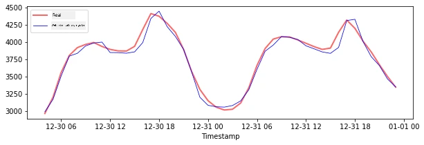
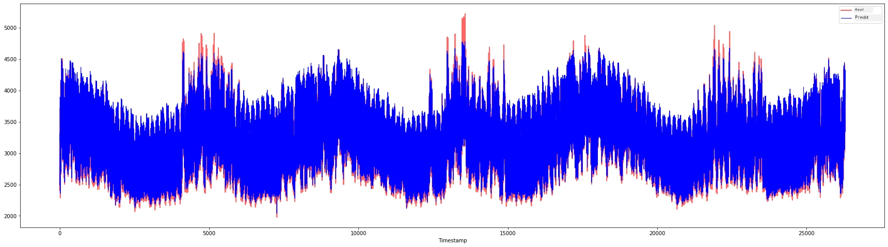

<!--
CO_OP_TRANSLATOR_METADATA:
{
  "original_hash": "482bccabe1df958496ea71a3667995cd",
  "translation_date": "2025-11-18T19:01:25+00:00",
  "source_file": "7-TimeSeries/3-SVR/README.md",
  "language_code": "pcm"
}
-->
# Time Series Forecasting wit Support Vector Regressor

For di last lesson, you don learn how to use ARIMA model take make time series predictions. Now, you go dey look Support Vector Regressor model wey be regressor model wey dem dey use predict continuous data.

## [Pre-lecture quiz](https://ff-quizzes.netlify.app/en/ml/) 

## Introduction

For dis lesson, you go sabi one special way to build models wit [**SVM**: **S**upport **V**ector **M**achine](https://en.wikipedia.org/wiki/Support-vector_machine) for regression, or **SVR: Support Vector Regressor**. 

### SVR for time series [^1]

Before you go fit understand why SVR dey important for time series prediction, make we first look some important concepts wey you need sabi:

- **Regression:** Na supervised learning technique wey dem dey use predict continuous values from di inputs wey dem give. Di idea na to fit curve (or line) for di feature space wey go get di maximum number of data points. [Click here](https://en.wikipedia.org/wiki/Regression_analysis) to learn more.
- **Support Vector Machine (SVM):** Na one type of supervised machine learning model wey dem dey use for classification, regression and outliers detection. Di model na hyperplane for di feature space, wey for classification dey act as boundary, and for regression dey act as di best-fit line. For SVM, Kernel function dey usually dey used to transform di dataset to space wey get higher number of dimensions, so dem go dey easy to separate. [Click here](https://en.wikipedia.org/wiki/Support-vector_machine) to learn more about SVMs.
- **Support Vector Regressor (SVR):** Na one type of SVM wey dey find di best fit line (wey for SVM na hyperplane) wey go get di maximum number of data points.

### Why SVR? [^1]

For di last lesson, you don learn about ARIMA, wey be one statistical linear method wey dey successful for forecasting time series data. But, for many cases, time series data dey get *non-linearity*, wey linear models no fit map. For dis kind cases, di ability of SVM to handle non-linearity for regression tasks dey make SVR dey successful for time series forecasting.

## Exercise - build SVR model

Di first few steps for data preparation na di same as di one for di last lesson on [ARIMA](https://github.com/microsoft/ML-For-Beginners/tree/main/7-TimeSeries/2-ARIMA). 

Open di [_/working_](https://github.com/microsoft/ML-For-Beginners/tree/main/7-TimeSeries/3-SVR/working) folder for dis lesson and find di [_notebook.ipynb_](https://github.com/microsoft/ML-For-Beginners/blob/main/7-TimeSeries/3-SVR/working/notebook.ipynb) file.[^2]

1. Run di notebook and import di necessary libraries:  [^2]

   ```python
   import sys
   sys.path.append('../../')
   ```

   ```python
   import os
   import warnings
   import matplotlib.pyplot as plt
   import numpy as np
   import pandas as pd
   import datetime as dt
   import math
   
   from sklearn.svm import SVR
   from sklearn.preprocessing import MinMaxScaler
   from common.utils import load_data, mape
   ```

2. Load di data from di `/data/energy.csv` file into Pandas dataframe and check am:  [^2]

   ```python
   energy = load_data('../../data')[['load']]
   ```

3. Plot all di available energy data from January 2012 to December 2014: [^2]

   ```python
   energy.plot(y='load', subplots=True, figsize=(15, 8), fontsize=12)
   plt.xlabel('timestamp', fontsize=12)
   plt.ylabel('load', fontsize=12)
   plt.show()
   ```

   

   Now, make we build our SVR model.

### Create training and testing datasets

Now wey your data don load, you fit separate am into train and test sets. Then you go reshape di data to create time-step based dataset wey SVR go need. You go train your model on di train set. After di model don finish training, you go check di accuracy for di training set, testing set and di full dataset to see di overall performance. You need make sure say di test set dey cover later period for time from di training set to make sure say di model no dey get information from future time periods [^2] (dis situation na *Overfitting*).

1. Allocate two-month period from September 1 to October 31, 2014 to di training set. Di test set go include di two-month period of November 1 to December 31, 2014: [^2]

   ```python
   train_start_dt = '2014-11-01 00:00:00'
   test_start_dt = '2014-12-30 00:00:00'
   ```

2. Visualize di differences: [^2]

   ```python
   energy[(energy.index < test_start_dt) & (energy.index >= train_start_dt)][['load']].rename(columns={'load':'train'}) \
       .join(energy[test_start_dt:][['load']].rename(columns={'load':'test'}), how='outer') \
       .plot(y=['train', 'test'], figsize=(15, 8), fontsize=12)
   plt.xlabel('timestamp', fontsize=12)
   plt.ylabel('load', fontsize=12)
   plt.show()
   ```

   


### Prepare di data for training

Now, you need prepare di data for training by performing filtering and scaling of your data. Filter your dataset to only include di time periods and columns wey you need, and scale am to make sure say di data dey project for di interval 0,1.

1. Filter di original dataset to include only di time periods wey we mention before per set and only include di needed column 'load' plus di date: [^2]

   ```python
   train = energy.copy()[(energy.index >= train_start_dt) & (energy.index < test_start_dt)][['load']]
   test = energy.copy()[energy.index >= test_start_dt][['load']]
   
   print('Training data shape: ', train.shape)
   print('Test data shape: ', test.shape)
   ```

   ```output
   Training data shape:  (1416, 1)
   Test data shape:  (48, 1)
   ```
   
2. Scale di training data to dey range (0, 1): [^2]

   ```python
   scaler = MinMaxScaler()
   train['load'] = scaler.fit_transform(train)
   ```
   
4. Now, scale di testing data: [^2]

   ```python
   test['load'] = scaler.transform(test)
   ```

### Create data wit time-steps [^1]

For di SVR, you go transform di input data to dey form `[batch, timesteps]`. So, you go reshape di existing `train_data` and `test_data` so dat new dimension go dey wey go refer to di timesteps. 

```python
# Converting to numpy arrays
train_data = train.values
test_data = test.values
```

For dis example, we dey use `timesteps = 5`. So, di inputs to di model na di data for di first 4 timesteps, and di output go be di data for di 5th timestep.

```python
timesteps=5
```

Convert training data to 2D tensor using nested list comprehension:

```python
train_data_timesteps=np.array([[j for j in train_data[i:i+timesteps]] for i in range(0,len(train_data)-timesteps+1)])[:,:,0]
train_data_timesteps.shape
```

```output
(1412, 5)
```

Convert testing data to 2D tensor:

```python
test_data_timesteps=np.array([[j for j in test_data[i:i+timesteps]] for i in range(0,len(test_data)-timesteps+1)])[:,:,0]
test_data_timesteps.shape
```

```output
(44, 5)
```

 Select inputs and outputs from training and testing data:

```python
x_train, y_train = train_data_timesteps[:,:timesteps-1],train_data_timesteps[:,[timesteps-1]]
x_test, y_test = test_data_timesteps[:,:timesteps-1],test_data_timesteps[:,[timesteps-1]]

print(x_train.shape, y_train.shape)
print(x_test.shape, y_test.shape)
```

```output
(1412, 4) (1412, 1)
(44, 4) (44, 1)
```

### Implement SVR [^1]

Now, na time to implement SVR. To read more about dis implementation, you fit check [dis documentation](https://scikit-learn.org/stable/modules/generated/sklearn.svm.SVR.html). For our implementation, we go follow dis steps:

  1. Define di model by calling `SVR()` and passing di model hyperparameters: kernel, gamma, c and epsilon
  2. Prepare di model for di training data by calling di `fit()` function
  3. Make predictions by calling di `predict()` function

Now we go create SVR model. Here we dey use di [RBF kernel](https://scikit-learn.org/stable/modules/svm.html#parameters-of-the-rbf-kernel), and set di hyperparameters gamma, C and epsilon as 0.5, 10 and 0.05 respectively.

```python
model = SVR(kernel='rbf',gamma=0.5, C=10, epsilon = 0.05)
```

#### Fit di model on training data [^1]

```python
model.fit(x_train, y_train[:,0])
```

```output
SVR(C=10, cache_size=200, coef0=0.0, degree=3, epsilon=0.05, gamma=0.5,
    kernel='rbf', max_iter=-1, shrinking=True, tol=0.001, verbose=False)
```

#### Make model predictions [^1]

```python
y_train_pred = model.predict(x_train).reshape(-1,1)
y_test_pred = model.predict(x_test).reshape(-1,1)

print(y_train_pred.shape, y_test_pred.shape)
```

```output
(1412, 1) (44, 1)
```

You don build your SVR! Now we need evaluate am.

### Evaluate your model [^1]

To evaluate, first we go scale back di data to our original scale. Then, to check di performance, we go plot di original and predicted time series plot, and also print di MAPE result.

Scale di predicted and original output:

```python
# Scaling the predictions
y_train_pred = scaler.inverse_transform(y_train_pred)
y_test_pred = scaler.inverse_transform(y_test_pred)

print(len(y_train_pred), len(y_test_pred))
```

```python
# Scaling the original values
y_train = scaler.inverse_transform(y_train)
y_test = scaler.inverse_transform(y_test)

print(len(y_train), len(y_test))
```

#### Check model performance on training and testing data [^1]

We go extract di timestamps from di dataset to show for di x-axis of our plot. Note say we dey use di first ```timesteps-1``` values as input for di first output, so di timestamps for di output go start after dat.

```python
train_timestamps = energy[(energy.index < test_start_dt) & (energy.index >= train_start_dt)].index[timesteps-1:]
test_timestamps = energy[test_start_dt:].index[timesteps-1:]

print(len(train_timestamps), len(test_timestamps))
```

```output
1412 44
```

Plot di predictions for training data:

```python
plt.figure(figsize=(25,6))
plt.plot(train_timestamps, y_train, color = 'red', linewidth=2.0, alpha = 0.6)
plt.plot(train_timestamps, y_train_pred, color = 'blue', linewidth=0.8)
plt.legend(['Actual','Predicted'])
plt.xlabel('Timestamp')
plt.title("Training data prediction")
plt.show()
```


Print MAPE for training data

```python
print('MAPE for training data: ', mape(y_train_pred, y_train)*100, '%')
```

```output
MAPE for training data: 1.7195710200875551 %
```

Plot di predictions for testing data

```python
plt.figure(figsize=(10,3))
plt.plot(test_timestamps, y_test, color = 'red', linewidth=2.0, alpha = 0.6)
plt.plot(test_timestamps, y_test_pred, color = 'blue', linewidth=0.8)
plt.legend(['Actual','Predicted'])
plt.xlabel('Timestamp')
plt.show()
```



Print MAPE for testing data

```python
print('MAPE for testing data: ', mape(y_test_pred, y_test)*100, '%')
```

```output
MAPE for testing data:  1.2623790187854018 %
```

🏆 You get very good result for di testing dataset!

### Check model performance on full dataset [^1]

```python
# Extracting load values as numpy array
data = energy.copy().values

# Scaling
data = scaler.transform(data)

# Transforming to 2D tensor as per model input requirement
data_timesteps=np.array([[j for j in data[i:i+timesteps]] for i in range(0,len(data)-timesteps+1)])[:,:,0]
print("Tensor shape: ", data_timesteps.shape)

# Selecting inputs and outputs from data
X, Y = data_timesteps[:,:timesteps-1],data_timesteps[:,[timesteps-1]]
print("X shape: ", X.shape,"\nY shape: ", Y.shape)
```

```output
Tensor shape:  (26300, 5)
X shape:  (26300, 4) 
Y shape:  (26300, 1)
```

```python
# Make model predictions
Y_pred = model.predict(X).reshape(-1,1)

# Inverse scale and reshape
Y_pred = scaler.inverse_transform(Y_pred)
Y = scaler.inverse_transform(Y)
```

```python
plt.figure(figsize=(30,8))
plt.plot(Y, color = 'red', linewidth=2.0, alpha = 0.6)
plt.plot(Y_pred, color = 'blue', linewidth=0.8)
plt.legend(['Actual','Predicted'])
plt.xlabel('Timestamp')
plt.show()
```



```python
print('MAPE: ', mape(Y_pred, Y)*100, '%')
```

```output
MAPE:  2.0572089029888656 %
```


🏆 Di plots dey nice, e show say di model get good accuracy. Well done!

---

## 🚀Challenge

- Try tweak di hyperparameters (gamma, C, epsilon) when you dey create di model and evaluate am on di data to see which set of hyperparameters go give di best results for di testing data. To learn more about dis hyperparameters, you fit check di document [here](https://scikit-learn.org/stable/modules/svm.html#parameters-of-the-rbf-kernel). 
- Try use different kernel functions for di model and analyze how dem perform for di dataset. Helpful document dey [here](https://scikit-learn.org/stable/modules/svm.html#kernel-functions).
- Try use different values for `timesteps` for di model to look back to make prediction.

## [Post-lecture quiz](https://ff-quizzes.netlify.app/en/ml/)

## Review & Self Study

Dis lesson na to introduce di application of SVR for Time Series Forecasting. To read more about SVR, you fit check [dis blog](https://www.analyticsvidhya.com/blog/2020/03/support-vector-regression-tutorial-for-machine-learning/). Dis [documentation on scikit-learn](https://scikit-learn.org/stable/modules/svm.html) dey explain more about SVMs in general, [SVRs](https://scikit-learn.org/stable/modules/svm.html#regression) and also other implementation details like di different [kernel functions](https://scikit-learn.org/stable/modules/svm.html#kernel-functions) wey fit dey used, and their parameters.

## Assignment

[A new SVR model](assignment.md)


## Credits


[^1]: Di text, code and output for dis section na contribution from [@AnirbanMukherjeeXD](https://github.com/AnirbanMukherjeeXD)
[^2]: Di text, code and output for dis section na taken from [ARIMA](https://github.com/microsoft/ML-For-Beginners/tree/main/7-TimeSeries/2-ARIMA)

---

<!-- CO-OP TRANSLATOR DISCLAIMER START -->
**Disclaimer**:  
Dis dokyument don translate wit AI translation service [Co-op Translator](https://github.com/Azure/co-op-translator). Even though we dey try make am accurate, abeg make you sabi say machine translation fit get mistake or no dey correct well. Di original dokyument for di native language na di main source wey you go trust. For important information, e better make professional human translator check am. We no go fit take blame for any misunderstanding or wrong interpretation wey fit happen because you use dis translation.
<!-- CO-OP TRANSLATOR DISCLAIMER END -->