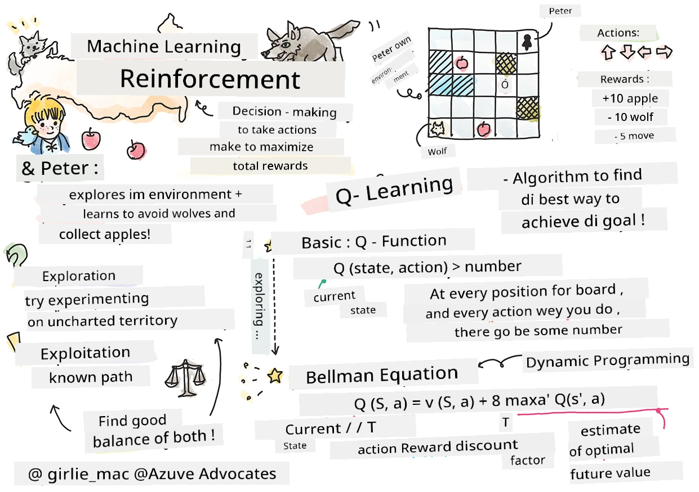

<!--
CO_OP_TRANSLATOR_METADATA:
{
  "original_hash": "911efd5e595089000cb3c16fce1beab8",
  "translation_date": "2025-11-18T18:16:07+00:00",
  "source_file": "8-Reinforcement/1-QLearning/README.md",
  "language_code": "pcm"
}
-->
# Introduction to Reinforcement Learning and Q-Learning


> Sketchnote by [Tomomi Imura](https://www.twitter.com/girlie_mac)

Reinforcement learning get three main things: agent, states, and actions wey dey for each state. If agent do action for one state, e go get reward. Imagine say you dey play Super Mario game. You be Mario, you dey one level for the game, you stand near cliff edge. Coin dey above you. You be Mario, for one level, for one position... na your state be dat. If you waka go right (action), you go fall for cliff and your score go low. But if you press jump button, you go collect coin and you go still dey alive. Dat one na better result and e go give you better score.

With reinforcement learning and simulator (the game), you fit learn how to play the game well to get better reward like to dey alive and collect plenty points.

[](https://www.youtube.com/watch?v=lDq_en8RNOo)

> 🎥 Click the image above to hear Dmitry discuss Reinforcement Learning

## [Pre-lecture quiz](https://ff-quizzes.netlify.app/en/ml/)

## Prerequisites and Setup

For this lesson, we go dey use Python code. You suppose fit run the Jupyter Notebook code for this lesson, whether for your computer or for cloud.

You fit open [the lesson notebook](https://github.com/microsoft/ML-For-Beginners/blob/main/8-Reinforcement/1-QLearning/notebook.ipynb) and follow the lesson to build.

> **Note:** If you dey open this code for cloud, you go need to fetch the [`rlboard.py`](https://github.com/microsoft/ML-For-Beginners/blob/main/8-Reinforcement/1-QLearning/rlboard.py) file wey dey used for the notebook code. Put am for the same folder as the notebook.

## Introduction

For this lesson, we go look the world of **[Peter and the Wolf](https://en.wikipedia.org/wiki/Peter_and_the_Wolf)**, wey dey inspired by one musical fairy tale by one Russian composer, [Sergei Prokofiev](https://en.wikipedia.org/wiki/Sergei_Prokofiev). We go use **Reinforcement Learning** make Peter fit explore him environment, collect sweet apples and avoid the wolf.

**Reinforcement Learning** (RL) na one learning method wey go help us learn the best way wey one **agent** go behave for one **environment** by doing plenty experiments. The agent for this environment suppose get one **goal**, wey reward function go define.

## The environment

Make we make Peter world simple, e go be one square board wey get size `width` x `height`, like this:


Each cell for this board fit be:

* **ground**, wey Peter and other creatures fit waka on top.
* **water**, wey you no fit waka on top.
* **tree** or **grass**, place wey you fit rest.
* **apple**, wey Peter go happy to find to chop.
* **wolf**, wey dey dangerous and Peter suppose avoid.

One Python module dey, [`rlboard.py`](https://github.com/microsoft/ML-For-Beginners/blob/main/8-Reinforcement/1-QLearning/rlboard.py), wey get the code to work with this environment. Because this code no dey important to understand our concepts, we go just import the module and use am to create the sample board (code block 1):

```python
from rlboard import *

width, height = 8,8
m = Board(width,height)
m.randomize(seed=13)
m.plot()
```

This code suppose print one picture of the environment wey resemble the one wey dey above.

## Actions and policy

For our example, Peter goal na to find apple, avoid wolf and other wahala. To do this, e fit waka around until e find apple.

So, for any position, e fit choose one of these actions: up, down, left, and right.

We go define these actions as dictionary, and match them to pairs of coordinate changes. For example, to move right (`R`) go mean `(1,0)`. (code block 2):

```python
actions = { "U" : (0,-1), "D" : (0,1), "L" : (-1,0), "R" : (1,0) }
action_idx = { a : i for i,a in enumerate(actions.keys()) }
```

To summarize, the strategy and goal for this scenario na:

- **The strategy**, for our agent (Peter) na the **policy**. Policy na function wey dey return action for any state. For our case, the state na the board, including the current position of the player.

- **The goal**, for reinforcement learning na to learn better policy wey go help us solve the problem well. But first, make we try the simplest policy wey we dey call **random walk**.

## Random walk

Make we first solve our problem by using random walk strategy. For random walk, we go dey choose the next action randomly from the allowed actions, until we reach the apple (code block 3).

1. Implement random walk with the code below:

    ```python
    def random_policy(m):
        return random.choice(list(actions))
    
    def walk(m,policy,start_position=None):
        n = 0 # number of steps
        # set initial position
        if start_position:
            m.human = start_position 
        else:
            m.random_start()
        while True:
            if m.at() == Board.Cell.apple:
                return n # success!
            if m.at() in [Board.Cell.wolf, Board.Cell.water]:
                return -1 # eaten by wolf or drowned
            while True:
                a = actions[policy(m)]
                new_pos = m.move_pos(m.human,a)
                if m.is_valid(new_pos) and m.at(new_pos)!=Board.Cell.water:
                    m.move(a) # do the actual move
                    break
            n+=1
    
    walk(m,random_policy)
    ```

    The call to `walk` suppose return the length of the path, wey fit change from one run to another. 

1. Run the walk experiment many times (like 100), and print the results (code block 4):

    ```python
    def print_statistics(policy):
        s,w,n = 0,0,0
        for _ in range(100):
            z = walk(m,policy)
            if z<0:
                w+=1
            else:
                s += z
                n += 1
        print(f"Average path length = {s/n}, eaten by wolf: {w} times")
    
    print_statistics(random_policy)
    ```

    You go notice say the average length of the path na around 30-40 steps, wey plenty pass the average distance to the nearest apple wey be around 5-6 steps.

    You fit also see how Peter dey move during random walk:

    

## Reward function

To make our policy smarter, we need to sabi which moves dey "better" pass others. To do this, we need to define our goal.

The goal fit dey defined with **reward function**, wey go return score for each state. The higher the number, the better the reward function. (code block 5)

```python
move_reward = -0.1
goal_reward = 10
end_reward = -10

def reward(m,pos=None):
    pos = pos or m.human
    if not m.is_valid(pos):
        return end_reward
    x = m.at(pos)
    if x==Board.Cell.water or x == Board.Cell.wolf:
        return end_reward
    if x==Board.Cell.apple:
        return goal_reward
    return move_reward
```

One interesting thing about reward functions be say most times, *we dey only get better reward for the end of the game*. This mean say our algorithm suppose remember "better" steps wey lead to good reward for the end, and make them more important. Same way, all moves wey lead to bad results suppose dey discouraged.

## Q-Learning

The algorithm wey we go talk about na **Q-Learning**. For this algorithm, the policy dey defined by one function (or data structure) wey we dey call **Q-Table**. E dey record how "good" each action dey for one state.

E dey called Q-Table because e dey easy to represent am as table, or multi-dimensional array. Since our board get size `width` x `height`, we fit represent the Q-Table with numpy array wey get shape `width` x `height` x `len(actions)`: (code block 6)

```python
Q = np.ones((width,height,len(actions)),dtype=np.float)*1.0/len(actions)
```

Notice say we dey initialize all the values for the Q-Table with equal value, for our case - 0.25. This one mean "random walk" policy, because all moves for each state dey equally good. We fit pass the Q-Table to the `plot` function to visualize the table on the board: `m.plot(Q)`.


For the center of each cell, arrow dey show the preferred direction of movement. Since all directions dey equal, dot go show.

Now we need to run simulation, explore our environment, and learn better Q-Table values wey go help us find the path to the apple faster.

## Essence of Q-Learning: Bellman Equation

Once we start to move, each action go get reward, i.e. we fit choose the next action based on the highest immediate reward. But for most states, the move no go reach our goal to find apple, so we no fit decide immediately which direction better.

> Remember say no be the immediate result wey matter, but the final result wey we go get for the end of the simulation.

To handle this delayed reward, we need to use **[dynamic programming](https://en.wikipedia.org/wiki/Dynamic_programming)** principles wey go help us think about the problem recursively.

Suppose we dey state *s*, and we wan move to next state *s'*. If we do am, we go get immediate reward *r(s,a)*, wey reward function define, plus future reward. If we assume say our Q-Table dey show the "goodness" of each action well, then for state *s'* we go choose action *a* wey get maximum value of *Q(s',a')*. So, the best future reward we fit get for state *s* go be `max`<sub>a'</sub>*Q(s',a')* (maximum dey calculated for all possible actions *a'* for state *s'*).

This give us **Bellman formula** to calculate Q-Table value for state *s*, given action *a*:


Here γ na **discount factor** wey dey decide how you go prefer current reward over future reward.

## Learning Algorithm

With the equation above, we fit write pseudo-code for our learning algorithm:

* Initialize Q-Table Q with equal numbers for all states and actions
* Set learning rate α ← 1
* Repeat simulation many times
   1. Start for random position
   1. Repeat
        1. Choose action *a* for state *s*
        2. Do action by moving to new state *s'*
        3. If we meet end-of-game condition, or total reward too small - stop simulation  
        4. Calculate reward *r* for new state
        5. Update Q-Function with Bellman equation: *Q(s,a)* ← *(1-α)Q(s,a)+α(r+γ max<sub>a'</sub>Q(s',a'))*
        6. *s* ← *s'*
        7. Update total reward and reduce α.

## Exploit vs. explore

For the algorithm above, we no talk how we go choose action for step 2.1. If we dey choose action randomly, we go **explore** the environment randomly, and we fit die often or go places we no suppose go. Another way na to **exploit** Q-Table values wey we don sabi, and choose the best action (with higher Q-Table value) for state *s*. But this one go stop us from exploring other states, and we fit no find the best solution.

So, the best way na to balance exploration and exploitation. We fit do am by choosing action for state *s* with probabilities wey match Q-Table values. For the beginning, when Q-Table values dey equal, e go mean random selection, but as we learn more about the environment, we go dey follow the best route while still allowing the agent to choose unexplored path sometimes.

## Python implementation

We don ready to implement the learning algorithm. Before we do am, we need one function wey go change Q-Table numbers to vector of probabilities for actions.

1. Create function `probs()`:

    ```python
    def probs(v,eps=1e-4):
        v = v-v.min()+eps
        v = v/v.sum()
        return v
    ```

    We dey add small `eps` to the original vector to avoid division by 0 for the beginning, when all vector components dey equal.

Run the learning algorithm for 5000 experiments, wey we dey call **epochs**: (code block 8)
```python
    for epoch in range(5000):
    
        # Pick initial point
        m.random_start()
        
        # Start travelling
        n=0
        cum_reward = 0
        while True:
            x,y = m.human
            v = probs(Q[x,y])
            a = random.choices(list(actions),weights=v)[0]
            dpos = actions[a]
            m.move(dpos,check_correctness=False) # we allow player to move outside the board, which terminates episode
            r = reward(m)
            cum_reward += r
            if r==end_reward or cum_reward < -1000:
                lpath.append(n)
                break
            alpha = np.exp(-n / 10e5)
            gamma = 0.5
            ai = action_idx[a]
            Q[x,y,ai] = (1 - alpha) * Q[x,y,ai] + alpha * (r + gamma * Q[x+dpos[0], y+dpos[1]].max())
            n+=1
```

After we run this algorithm, the Q-Table go update with values wey show how good different actions dey for each step. We fit try visualize the Q-Table by drawing vector for each cell wey go point the direction of movement. To make am simple, we go draw small circle instead of arrow head.


## Checking the policy

Since Q-Table dey show how "good" each action dey for each state, e dey easy to use am to navigate our world well. For the simplest case, we fit choose action wey get the highest Q-Table value: (code block 9)

```python
def qpolicy_strict(m):
        x,y = m.human
        v = probs(Q[x,y])
        a = list(actions)[np.argmax(v)]
        return a

walk(m,qpolicy_strict)
```

> If you try di code wey dey up many times, you fit notice say sometimes e go "hang", and you go need press di STOP button for di notebook to stop am. Dis one dey happen because e fit get situations wey two states go dey "point" to each oda based on di best Q-Value, and di agent go dey waka between those states forever.

## 🚀Challenge

> **Task 1:** Change di `walk` function make e get limit for di maximum length of path wey e fit waka, like 100 steps, and check how di code wey dey up go dey return dis value sometimes.

> **Task 2:** Change di `walk` function make e no dey go back to places wey e don already pass before. Dis one go stop `walk` from dey loop, but di agent fit still dey "trap" for one place wey e no fit comot.

## Navigation

Better navigation policy na di one wey we use during training, wey join exploitation and exploration. For dis policy, we go dey choose each action with one kind probability, wey dey proportional to di values for di Q-Table. Dis strategy fit still make di agent go back to position wey e don already explore before, but as you fit see from di code wey dey down, e dey result to very short average path to di place wey we dey find (remember say `print_statistics` dey run di simulation 100 times): (code block 10)

```python
def qpolicy(m):
        x,y = m.human
        v = probs(Q[x,y])
        a = random.choices(list(actions),weights=v)[0]
        return a

print_statistics(qpolicy)
```

After you run dis code, you suppose see say di average path length go reduce well well, e go dey between 3-6.

## Investigating di learning process

As we don talk before, di learning process na balance between exploration and di knowledge wey we don gather about di problem space. We don see say di result of di learning (di ability to help agent find short path go di goal) don improve, but e go still make sense to check how di average path length dey behave during di learning process:


Di learnings fit summarize like dis:

- **Average path length dey increase**. Wetin we dey see here be say for di beginning, di average path length dey increase. Dis one fit be because when we no sabi anything about di environment, we go likely dey trap for bad states, like water or wolf. As we dey learn more and dey use di knowledge, we fit explore di environment longer, but we still no sabi where di apples dey well.

- **Path length dey reduce as we dey learn more**. Once we don sabi enough, e go dey easier for di agent to reach di goal, and di path length go start to reduce. But we still dey open to exploration, so we dey sometimes waka comot from di best path, dey try new options, wey go make di path longer pass di best one.

- **Length go increase suddenly**. Wetin we dey see for dis graph be say at one point, di length go increase suddenly. Dis one dey show say di process dey stochastic, and sometimes we fit "spoil" di Q-Table coefficients by dey overwrite dem with new values. To reduce dis one, we suppose dey reduce di learning rate (like towards di end of training, we go dey adjust Q-Table values small small).

Overall, e dey important to remember say di success and quality of di learning process dey depend well well on parameters, like learning rate, learning rate decay, and discount factor. Dem dey call dem **hyperparameters**, to separate dem from **parameters**, wey we dey optimize during training (like Q-Table coefficients). Di process to find di best hyperparameter values na **hyperparameter optimization**, and e deserve separate topic.

## [Post-lecture quiz](https://ff-quizzes.netlify.app/en/ml/)

## Assignment 
[A More Realistic World](assignment.md)

---

<!-- CO-OP TRANSLATOR DISCLAIMER START -->
**Disclaimer**:  
Dis docu wey you dey see don use AI translation service [Co-op Translator](https://github.com/Azure/co-op-translator) take translate am. Even though we dey try make sure say e correct, abeg no forget say machine translation fit get mistake or no too accurate. Di original docu for di language wey dem first write am na di main correct one. If na important matter, e go better make professional human translator check am. We no go fit take blame for any misunderstanding or wrong interpretation wey fit happen because of dis translation.
<!-- CO-OP TRANSLATOR DISCLAIMER END -->