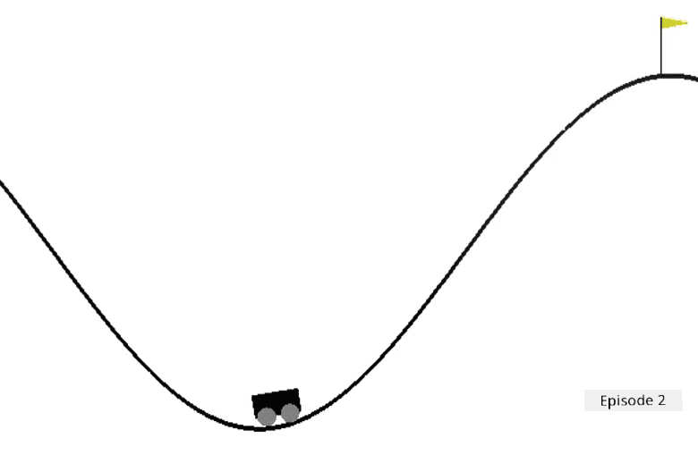

<!--
CO_OP_TRANSLATOR_METADATA:
{
  "original_hash": "1f2b7441745eb52e25745423b247016b",
  "translation_date": "2025-11-18T18:14:22+00:00",
  "source_file": "8-Reinforcement/2-Gym/assignment.md",
  "language_code": "pcm"
}
-->
# Train Mountain Car

[OpenAI Gym](http://gym.openai.com) don design am so say all di environments dey use di same API - dat na di same methods `reset`, `step` and `render`, and di same way wey dem dey arrange **action space** and **observation space**. So e suppose dey possible to use di same reinforcement learning algorithms for different environments wit small code changes.

## Mountain Car Environment

[Mountain Car environment](https://gym.openai.com/envs/MountainCar-v0/) get one car wey dey stuck for valley:

Di goal na to commot for di valley and capture di flag, by doing one of di actions wey dey below for each step:

| Value | Meaning |
|---|---|
| 0 | Press gas go left |
| 1 | No press gas |
| 2 | Press gas go right |

Di main wahala for dis problem be say di car engine no strong reach to climb di mountain one time. So, di only way wey e fit succeed na to dey drive go front and back to gather momentum.

Observation space get only two values:

| Num | Observation  | Min | Max |
|-----|--------------|-----|-----|
|  0  | Car Position | -1.2| 0.6 |
|  1  | Car Velocity | -0.07 | 0.07 |

Di reward system for di mountain car dey somehow tricky:

 * Reward of 0 go dey if di agent reach di flag (position = 0.5) for di top of di mountain.
 * Reward of -1 go dey if di position of di agent dey less than 0.5.

Episode go end if di car position pass 0.5, or if di episode length pass 200.
## Instructions

Make we use our reinforcement learning algorithm to solve di mountain car problem. Start wit di existing [notebook.ipynb](notebook.ipynb) code, change di environment, adjust di state discretization functions, and try make di existing algorithm train wit small code changes. Fine-tune di result by adjusting hyperparameters.

> **Note**: You go need adjust hyperparameters to make di algorithm work well. 
## Rubric

| Criteria | Exemplary | Adequate | Needs Improvement |
| -------- | --------- | -------- | ----------------- |
|          | Q-Learning algorithm don successfully change from CartPole example, wit small code changes, and e fit solve di problem of capturing di flag under 200 steps. | New Q-Learning algorithm wey dem find online don dey used, but e dey well-documented; or existing algorithm don dey used, but e no reach di desired result | Student no fit successfully use any algorithm, but e don try well well towards di solution (e don implement state discretization, Q-Table data structure, etc.) |

---

<!-- CO-OP TRANSLATOR DISCLAIMER START -->
**Disclaimer**:  
Dis docu wey you dey see don use AI translation service [Co-op Translator](https://github.com/Azure/co-op-translator) take translate am. Even though we dey try make sure say e correct, abeg no forget say machine translation fit get mistake or no too accurate. Di original docu for di language wey dem first write am na di main correct one. If na important matter, e go better make you use professional human translation. We no go fit take blame for any misunderstanding or wrong interpretation wey fit happen because you use dis translation.
<!-- CO-OP TRANSLATOR DISCLAIMER END -->