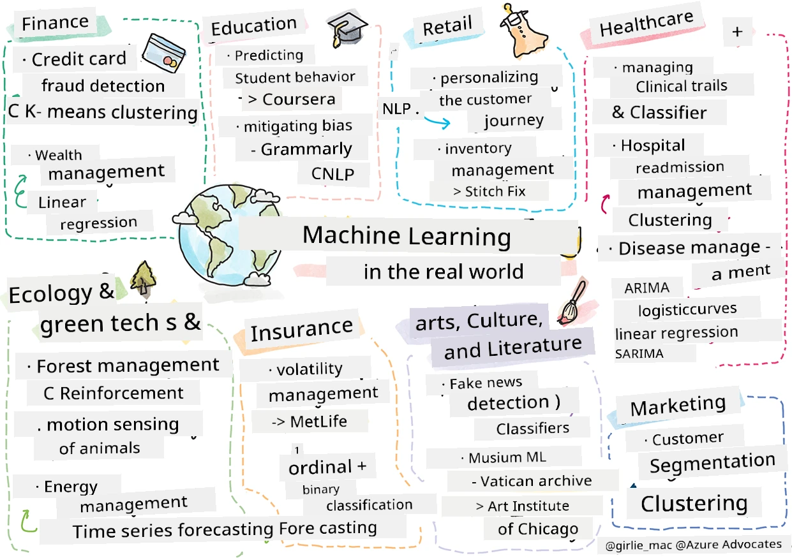

<!--
CO_OP_TRANSLATOR_METADATA:
{
  "original_hash": "83320d6b6994909e35d830cebf214039",
  "translation_date": "2025-11-18T18:46:05+00:00",
  "source_file": "9-Real-World/1-Applications/README.md",
  "language_code": "pcm"
}
-->
# Postscript: Machine learning for real world

> Sketchnote by [Tomomi Imura](https://www.twitter.com/girlie_mac)

For dis curriculum, you don learn plenty ways to prepare data for training and create machine learning models. You don build different types of models like regression, clustering, classification, natural language processing, and time series models. Congrats! Now, you fit dey wonder wetin all dis work mean... wetin be the real world use for dis models?

Even though AI dey get plenty attention for industry, wey dey use deep learning, classical machine learning models still get plenty value. You fit even dey use some of dem today! For dis lesson, you go see how eight different industries and areas dey use dis kind models to make their applications better, smarter, and more useful for people.

## [Pre-lecture quiz](https://ff-quizzes.netlify.app/en/ml/)

## 💰 Finance

Finance sector get plenty ways wey machine learning fit help. Many problems for dis area fit be modeled and solved with ML.

### Credit card fraud detection

We don learn about [k-means clustering](../../5-Clustering/2-K-Means/README.md) before for dis course, but how e fit help solve credit card fraud wahala?

K-means clustering dey useful for one fraud detection method wey dem dey call **outlier detection**. Outliers na things wey no dey normal for data, and dem fit show us if credit card dey used normally or if something strange dey happen. As dem show for one paper wey dey below, you fit use k-means clustering to sort credit card data and put each transaction for cluster based on how e be outlier. Then, you fit check the riskiest clusters to know which one be fraud and which one be legit.
[Reference](https://citeseerx.ist.psu.edu/viewdoc/download?doi=10.1.1.680.1195&rep=rep1&type=pdf)

### Wealth management

For wealth management, person or company dey handle investments for their clients. Their work na to make sure wealth dey grow for long-term, so dem need to choose investments wey go perform well.

One way to check how investment dey perform na through statistical regression. [Linear regression](../../2-Regression/1-Tools/README.md) dey useful to understand how fund dey perform compared to benchmark. You fit also know if regression results dey statistically important or how e go affect client investments. You fit even expand analysis with multiple regression to add more risk factors. For example of how e dey work for specific fund, check dis paper below.
[Reference](http://www.brightwoodventures.com/evaluating-fund-performance-using-regression/)

## 🎓 Education

Education sector na another area wey ML fit work well. Problems like detecting cheating for tests or essays and managing bias for correction process dey interesting.

### Predicting student behavior

[Coursera](https://coursera.com), wey be online course provider, get one tech blog wey dem dey talk about engineering decisions. For one case study, dem use regression line to check if low NPS (Net Promoter Score) rating dey connect with course retention or drop-off.
[Reference](https://medium.com/coursera-engineering/controlled-regression-quantifying-the-impact-of-course-quality-on-learner-retention-31f956bd592a)

### Mitigating bias

[Grammarly](https://grammarly.com), wey be writing assistant, dey use advanced [natural language processing systems](../../6-NLP/README.md) for their products. For their tech blog, dem talk about how dem handle gender bias for machine learning, wey you don learn for our [fairness lesson](../../1-Introduction/3-fairness/README.md).
[Reference](https://www.grammarly.com/blog/engineering/mitigating-gender-bias-in-autocorrect/)

## 👜 Retail

Retail sector fit benefit well from ML, from improving customer journey to managing inventory better.

### Personalizing the customer journey

Wayfair, wey dey sell home goods like furniture, dey use ML and NLP to help customers find wetin dem need. For one article, their engineers explain how dem use entity extraction, classifier training, asset and opinion extraction, and sentiment tagging for customer reviews. Dis na example of how NLP dey work for online retail.
[Reference](https://www.aboutwayfair.com/tech-innovation/how-we-use-machine-learning-and-natural-language-processing-to-empower-search)

### Inventory management

Companies like [StitchFix](https://stitchfix.com), wey dey ship clothes to people, dey use ML for recommendations and inventory management. Their data scientists dey work with merchandising teams to predict wetin go be successful clothing wey no exist yet. Dem dey use genetic algorithm for dis.
[Reference](https://www.zdnet.com/article/how-stitch-fix-uses-machine-learning-to-master-the-science-of-styling/)

## 🏥 Health Care

Health care sector fit use ML to improve research and solve logistic problems like patient readmission or disease spread.

### Managing clinical trials

Toxicity for clinical trials na big problem for drug makers. For one study, dem use random forest to create [classifier](../../4-Classification/README.md) wey fit separate drug groups.
[Reference](https://www.sciencedirect.com/science/article/pii/S2451945616302914)

### Hospital readmission management

Hospital care dey expensive, especially when patients dey readmit. One paper talk about company wey dey use ML to predict readmission potential with [clustering](../../5-Clustering/README.md) algorithms. Dis clusters dey help analysts find groups of readmissions wey get common cause.
[Reference](https://healthmanagement.org/c/healthmanagement/issuearticle/hospital-readmissions-and-machine-learning)

### Disease management

Pandemic don show how ML fit help stop disease spread. For one article, dem use ARIMA, logistic curves, linear regression, and SARIMA to calculate virus spread rate and predict deaths, recoveries, and confirmed cases.
[Reference](https://www.ncbi.nlm.nih.gov/pmc/articles/PMC7979218/)

## 🌲 Ecology and Green Tech

Nature and ecology get sensitive systems wey need accurate measurement and action, like forest fire or animal population drop.

### Forest management

You don learn about [Reinforcement Learning](../../8-Reinforcement/README.md) before. E dey useful for predicting nature patterns like forest fires. For Canada, researchers use RL to model wildfire dynamics from satellite images. Dem use "spatially spreading process (SSP)" to track fire movement.
[Reference](https://www.frontiersin.org/articles/10.3389/fict.2018.00006/full)

### Motion sensing of animals

Deep learning dey help track animal movements visually, but classical ML still dey useful for preprocessing data. For one paper, dem monitor sheep postures with classifier algorithms. You fit see ROC curve for page 335.
[Reference](https://druckhaus-hofmann.de/gallery/31-wj-feb-2020.pdf)

### ⚡️ Energy Management

For our [time series forecasting](../../7-TimeSeries/README.md) lessons, we talk about smart parking meters. One article explain how clustering, regression, and time series forecasting help predict future energy use for Ireland with smart metering.
[Reference](https://www-cdn.knime.com/sites/default/files/inline-images/knime_bigdata_energy_timeseries_whitepaper.pdf)

## 💼 Insurance

Insurance sector dey use ML to build and optimize financial models.

### Volatility Management

MetLife, wey dey provide life insurance, dey use ML to analyze and reduce volatility for their financial models. For one article, you go see binary and ordinal classification visualizations, plus forecasting visualizations.
[Reference](https://investments.metlife.com/content/dam/metlifecom/us/investments/insights/research-topics/macro-strategy/pdf/MetLifeInvestmentManagement_MachineLearnedRanking_070920.pdf)

## 🎨 Arts, Culture, and Literature

For arts, like journalism, ML fit help solve problems like detecting fake news wey dey influence people opinion. Museums fit also use ML for cataloging artifacts and resource planning.

### Fake news detection

Detecting fake news na big problem for media today. For one article, researchers suggest system wey combine ML techniques like Naive Bayes, Support Vector Machine (SVM), Random Forest (RF), Stochastic Gradient Descent (SGD), and Logistic Regression (LR) to stop fake news spread.
[Reference](https://www.irjet.net/archives/V7/i6/IRJET-V7I6688.pdf)

### Museum ML

Museums dey use AI to catalog and digitize collections. Projects like [In Codice Ratio](https://www.sciencedirect.com/science/article/abs/pii/S0306457321001035#:~:text=1.,studies%20over%20large%20historical%20sources.) dey help unlock collections like Vatican Archives. For business side, Art Institute of Chicago dey use ML to predict audience interest and attendance for exhibitions.
[Reference](https://www.chicagobusiness.com/article/20180518/ISSUE01/180519840/art-institute-of-chicago-uses-data-to-make-exhibit-choices)

## 🏷 Marketing

### Customer segmentation

Effective marketing dey target customers differently based on groupings. One article explain how Clustering algorithms dey help for differentiated marketing to improve brand recognition, reach more customers, and make more money.
[Reference](https://ai.inqline.com/machine-learning-for-marketing-customer-segmentation/)

## 🚀 Challenge

Find another sector wey dey benefit from techniques wey you don learn for dis curriculum, and check how e dey use ML.
## [Post-lecture quiz](https://ff-quizzes.netlify.app/en/ml/)

## Review & Self Study

Wayfair data science team get plenty interestin videos wey dem show how dem dey use ML for dia company. E go make sense if you [check am out](https://www.youtube.com/channel/UCe2PjkQXqOuwkW1gw6Ameuw/videos)!

## Assignment

[A ML scavenger hunt](assignment.md)

---

<!-- CO-OP TRANSLATOR DISCLAIMER START -->
**Disclaimer**:  
Dis dokyument don use AI transleshion service [Co-op Translator](https://github.com/Azure/co-op-translator) do di transleshion. Even as we dey try make am accurate, abeg make you sabi say transleshion wey machine do fit get mistake or no dey correct well. Di original dokyument for im native language na di one wey you go take as di main source. For important mata, e good make you use professional human transleshion. We no go fit take blame for any misunderstanding or wrong interpretation wey fit happen because you use dis transleshion.
<!-- CO-OP TRANSLATOR DISCLAIMER END -->