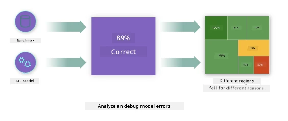
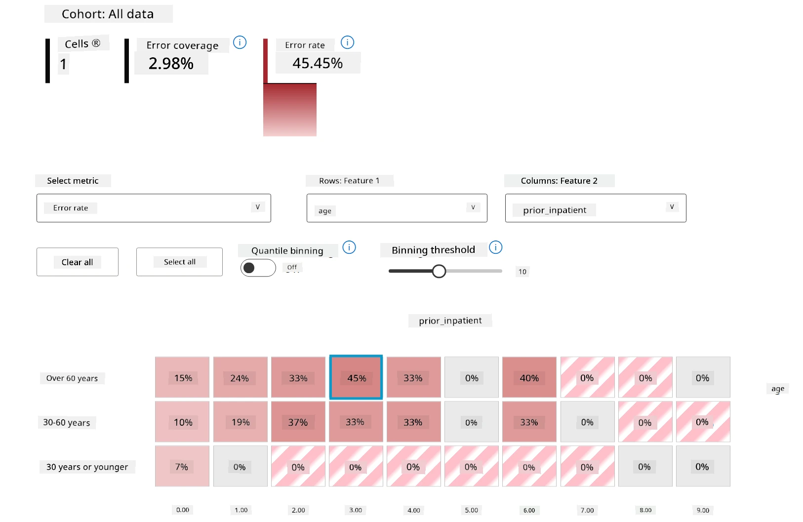
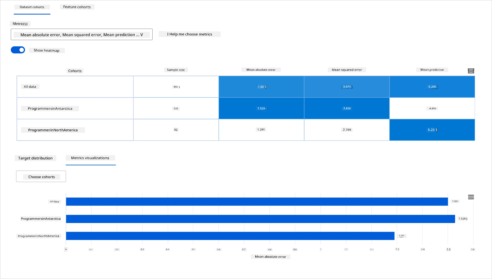
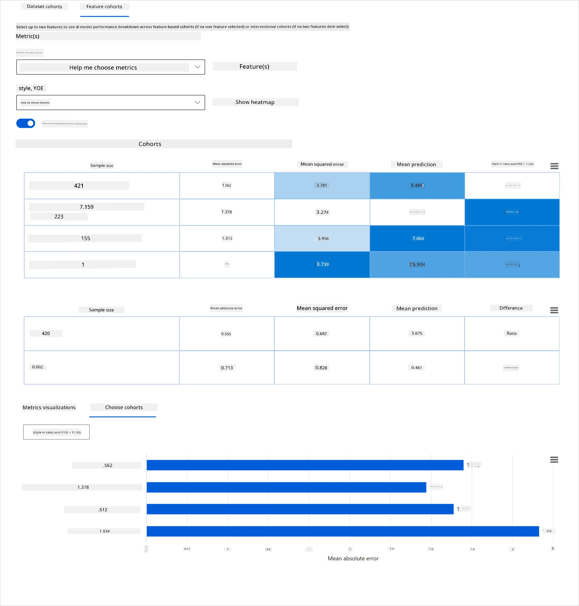
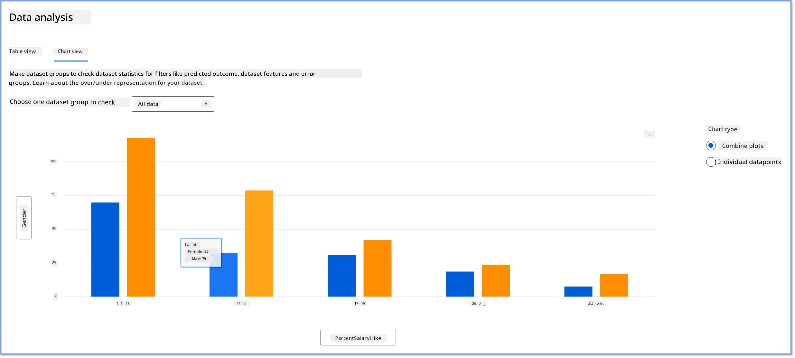
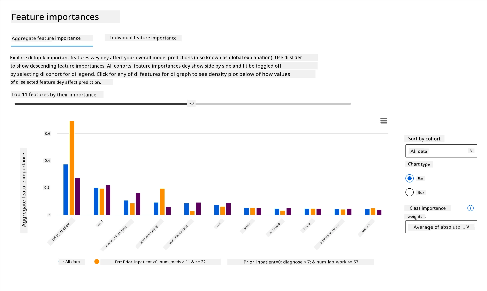
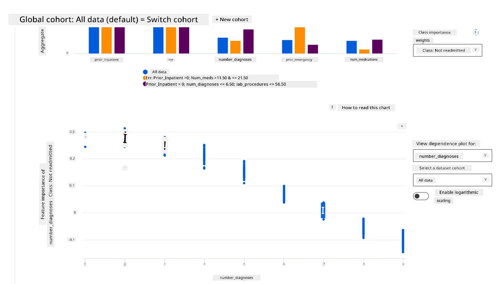

<!--
CO_OP_TRANSLATOR_METADATA:
{
  "original_hash": "df2b538e8fbb3e91cf0419ae2f858675",
  "translation_date": "2025-11-18T18:46:59+00:00",
  "source_file": "9-Real-World/2-Debugging-ML-Models/README.md",
  "language_code": "pcm"
}
-->
# Postscript: How to Debug Machine Learning Model wit Responsible AI Dashboard Components

## [Pre-lecture quiz](https://ff-quizzes.netlify.app/en/ml/)

## Introduction

Machine learning dey affect our everyday life. AI don dey enter some of di most important systems wey dey affect us as people and society, like healthcare, finance, education, and work. For example, systems and models dey help make decisions like health care diagnosis or detect fraud. As AI dey grow fast, e dey meet new expectations from society and governments don dey regulate am. We dey see areas wey AI systems dey fail; dem dey bring new wahala; and governments don dey put law for AI solutions. So, e dey important to check di models well to make sure say dem dey fair, reliable, inclusive, transparent, and accountable for everybody.

For dis curriculum, we go look tools wey fit help check if model get responsible AI wahala. Di normal way to debug machine learning model na to use calculations like accuracy or average error loss. But imagine say di data wey you use to build di model no get some groups like race, gender, political view, religion, or e dey represent dem too much. Or di model dey favor one group pass another. Dis kind thing fit cause fairness, inclusiveness, or reliability wahala for di model. Another wahala be say machine learning models dey like black box, e hard to sabi wetin dey make di model predict wetin e predict. All dis na di wahala wey data scientists and AI developers dey face if dem no get better tools to debug and check di fairness or trustworthiness of di model.

For dis lesson, you go learn how to debug your models using:

- **Error Analysis**: Find where di model dey fail for di data distribution.
- **Model Overview**: Compare di model performance for different data groups to see di difference.
- **Data Analysis**: Check where di data dey favor one group pass another or dey represent one group too much.
- **Feature Importance**: Sabi which features dey make di model predict wetin e predict for general level or individual level.

## Prerequisite

Before you start, abeg review [Responsible AI tools for developers](https://www.microsoft.com/ai/ai-lab-responsible-ai-dashboard)

> 

## Error Analysis

Di normal way to measure model performance na to check di correct vs wrong predictions. For example, if model dey accurate 89% of di time and error loss na 0.001, e fit look like say di model dey perform well. But di errors no dey spread equally for di data. You fit get 89% accuracy but find out say di model dey fail 42% of di time for some parts of di data. Dis kind failure fit cause fairness or reliability wahala. E dey important to sabi where di model dey perform well or dey fail. Di parts of di data wey get plenty errors fit be important data group.

Di Error Analysis component for RAI dashboard dey show how di model dey fail for different groups with tree visualization. E dey help to find di features or areas wey get high error rate for di data. Once you sabi where di errors dey come from, you fit start to check di root cause. You fit also create data groups to analyze. Dis data groups dey help to debug why di model dey perform well for one group but dey fail for another.

Di tree map dey show di problem areas fast. For example, di darker di red color for di tree node, di higher di error rate.

Heat map na another visualization wey users fit use to check di error rate with one or two features to find wetin dey cause di model errors for di whole dataset or groups.

Use error analysis when you need to:

* Sabi well how di model dey fail for di dataset and different input or feature dimensions.
* Break down di performance metrics to find di groups wey dey fail so you fit plan how to fix am.

## Model Overview

To check how machine learning model dey perform, you need to understand di behavior well. You fit do am by checking more than one metric like error rate, accuracy, recall, precision, or MAE (Mean Absolute Error) to find di difference for di performance metrics. One metric fit look good, but di errors fit show for another metric. Comparing di metrics for di whole dataset or groups dey help to see where di model dey perform well or dey fail. Dis na especially important to check di model performance for sensitive vs insensitive features (like patient race, gender, or age) to find possible unfairness for di model. For example, if di model dey fail more for one group wey get sensitive features, e fit show say di model dey unfair.

Di Model Overview component for RAI dashboard dey help to analyze di performance metrics for di data representation for one group, and e dey allow users compare di model behavior for different groups.

Di feature-based analysis functionality dey allow users narrow down data subgroups for one feature to find wahala for detailed level. For example, di dashboard fit automatically create groups for one feature wey user select (like *"time_in_hospital < 3"* or *"time_in_hospital >= 7"*). Dis dey allow user isolate one feature from di bigger data group to see if e dey cause di model errors.

Di Model Overview component dey support two types of disparity metrics:

**Disparity in model performance**: Dis metrics dey calculate di difference for di values of di selected performance metric for di subgroups of data. Examples:

* Disparity in accuracy rate
* Disparity in error rate
* Disparity in precision
* Disparity in recall
* Disparity in mean absolute error (MAE)

**Disparity in selection rate**: Dis metric dey show di difference for selection rate (favorable prediction) among di subgroups. Example na di difference for loan approval rates. Selection rate mean di fraction of data points for each class wey di model classify as 1 (for binary classification) or di distribution of prediction values (for regression).

## Data Analysis

> "If you torture di data long enough, e go confess anything" - Ronald Coase

Dis statement fit sound strong, but e true say data fit dey manipulated to support any conclusion. Sometimes, di manipulation fit happen by mistake. As humans, we all get bias, and e dey hard to sabi when you dey add bias for data. To make sure AI and machine learning dey fair na big challenge.

Data na big blind spot for di normal model performance metrics. You fit get high accuracy scores, but e no mean say di data no get bias. For example, if di data for employees show say 27% of women dey for executive positions and 73% of men dey di same level, AI model wey dem train with dis data fit dey target mostly men for senior level job positions. Dis imbalance for di data go make di model favor one gender. Dis na fairness wahala wey show gender bias for di AI model.

Di Data Analysis component for RAI dashboard dey help to find areas wey di data dey represent one group too much or too small. E dey help users check di root cause of errors and fairness wahala wey di data imbalance or lack of representation dey cause. E dey allow users visualize datasets based on predicted and actual outcomes, error groups, and specific features. Sometimes, if you find one group wey di data no represent well, e fit show say di model no dey learn well, and na why di errors dey plenty. If model get data bias, e no just be fairness wahala but e show say di model no dey inclusive or reliable.

Use data analysis when you need to:

* Check di dataset statistics by using filters to divide di data into different groups (cohorts).
* Sabi how di dataset dey spread across different groups and features.
* Confirm if di fairness, error analysis, and causality findings (from other dashboard components) dey caused by di dataset distribution.
* Decide where to collect more data to fix errors wey dey come from representation wahala, label noise, feature noise, label bias, and similar problems.

## Model Interpretability

Machine learning models dey like black box. To sabi which key data features dey make di model predict wetin e predict fit hard. E dey important to show why di model dey make di predictions. For example, if AI system predict say diabetic patient go return to hospital in less than 30 days, e suppose fit show di data wey make am predict so. Dis transparency dey help doctors or hospitals make better decisions. Also, to explain why di model predict something for one patient dey bring accountability for health regulations. If you dey use machine learning models for things wey dey affect people life, e dey important to sabi and explain wetin dey influence di model behavior. Model explainability and interpretability dey help answer questions like:

* Debugging di model: Why di model make dis mistake? How I fit improve di model?
* Human-AI collaboration: How I fit understand and trust di model decisions?
* Regulatory compliance: Di model dey follow di law?

Di Feature Importance component for RAI dashboard dey help you debug and understand how di model dey make predictions. E dey useful for machine learning professionals and decision-makers to explain and show evidence of features wey dey influence di model behavior for regulatory compliance. Users fit check both global and local explanations to confirm which features dey drive di model predictions. Global explanations dey show di top features wey dey affect di model overall prediction. Local explanations dey show di features wey make di model predict something for one case. To check local explanations dey help debug or audit one case to understand why di model make correct or wrong prediction.

* Global explanations: For example, which features dey affect di overall behavior of diabetes hospital readmission model?
* Local explanations: For example, why di model predict say diabetic patient wey dey over 60 years old with prior hospitalizations go return or no go return to hospital within 30 days?

For di debugging process to check di model performance for different groups, Feature Importance dey show di level of impact wey feature get for di groups. E dey help find wahala when you compare di level of influence wey di feature get for di model errors. Di Feature Importance component fit show which values for feature dey positively or negatively affect di model outcome. For example, if di model make wrong prediction, di component go allow you check wetin for di features or feature values cause di prediction. Dis level of detail dey help not just for debugging but e dey bring transparency and accountability for auditing situations. Finally, di component fit help you find fairness wahala. For example, if sensitive feature like ethnicity or gender dey highly influence di model prediction, e fit show race or gender bias for di model.

Use interpretability when you need to:

* Sabi how trustworthy di AI system predictions dey by understanding di features wey dey most important for di predictions.
* Debug di model by understanding am first and finding out if di model dey use correct features or just dey follow false correlations.
* Find possible sources of unfairness by checking if di model dey base predictions on sensitive features or features wey dey highly related to dem.
* Build user trust for di model decisions by generating local explanations to show di outcomes.
* Finish regulatory audit of AI system to confirm di models and monitor di impact of di model decisions on people.

## Conclusion

All di RAI dashboard components na practical tools to help you build machine learning models wey go dey less harmful and more trustworthy for society. E dey help prevent wahala wey fit affect human rights; exclude or discriminate some groups from life opportunities; and di risk of physical or mental injury. E dey also help build trust for di model decisions by generating local explanations to show di outcomes. Some of di possible harms fit be:

- **Allocation**, if one gender or ethnicity dey favored pass another.
- **Quality of service**. If you train di data for one specific situation but di real world dey more complex, e go make di service perform bad.
- **Stereotyping**. To associate one group with pre-assigned attributes.
- **Denigration**. To dey criticize or talk bad about something or person unfairly.  
- **Over- or under- representation**. Dis na di idea say one group no dey show for one kind work or profession, and any service or action wey dey continue to promote dis kain thing dey cause harm.

### Azure RAI dashboard

[Azure RAI dashboard](https://learn.microsoft.com/en-us/azure/machine-learning/concept-responsible-ai-dashboard?WT.mc_id=aiml-90525-ruyakubu) na tool wey dem build on top open-source tools wey top academic institutions and organizations, including Microsoft, develop. E dey help data scientists and AI developers understand how model dey behave, find and fix wahala wey no good for AI models.

- Learn how to use di different parts by checking di RAI dashboard [docs.](https://learn.microsoft.com/en-us/azure/machine-learning/how-to-responsible-ai-dashboard?WT.mc_id=aiml-90525-ruyakubu)

- Check some RAI dashboard [sample notebooks](https://github.com/Azure/RAI-vNext-Preview/tree/main/examples/notebooks) to debug more responsible AI scenarios for Azure Machine Learning.

---
## 🚀 Challenge

To stop statistical or data bias from even starting, we suppose:

- get people wey get different backgrounds and perspectives to work on di systems  
- invest for datasets wey go show di diversity wey dey our society  
- develop better ways to detect and correct bias when e happen  

Think about real-life situations wey unfairness dey show for model-building and usage. Wetin else we suppose consider?

## [Post-lecture quiz](https://ff-quizzes.netlify.app/en/ml/)
## Review & Self Study

For dis lesson, you don learn some practical tools to take put responsible AI for machine learning.

Watch dis workshop to learn more about di topics:

- Responsible AI Dashboard: One-stop shop for operationalizing RAI in practice by Besmira Nushi and Mehrnoosh Sameki

> 🎥 Click di image above for video: Responsible AI Dashboard: One-stop shop for operationalizing RAI in practice by Besmira Nushi and Mehrnoosh Sameki

Check di materials below to learn more about responsible AI and how to build models wey people fit trust:

- Microsoft’s RAI dashboard tools for debugging ML models: [Responsible AI tools resources](https://aka.ms/rai-dashboard)

- Explore di Responsible AI toolkit: [Github](https://github.com/microsoft/responsible-ai-toolbox)

- Microsoft’s RAI resource center: [Responsible AI Resources – Microsoft AI](https://www.microsoft.com/ai/responsible-ai-resources?activetab=pivot1%3aprimaryr4)

- Microsoft’s FATE research group: [FATE: Fairness, Accountability, Transparency, and Ethics in AI - Microsoft Research](https://www.microsoft.com/research/theme/fate/)

## Assignment

[Explore RAI dashboard](assignment.md)

---

<!-- CO-OP TRANSLATOR DISCLAIMER START -->
**Disclaimer**:  
Dis dokyument don translate wit AI translation service [Co-op Translator](https://github.com/Azure/co-op-translator). Even as we dey try make sure say e correct, abeg make you sabi say machine translation fit get mistake or no dey accurate well. Di original dokyument for im native language na di main source wey you go trust. For important mata, e good make professional human translator check am. We no go fit take blame for any misunderstanding or wrong interpretation wey fit happen because you use dis translation.
<!-- CO-OP TRANSLATOR DISCLAIMER END -->