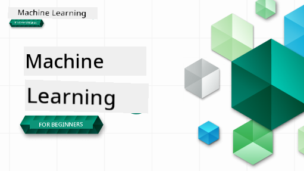

<!--
CO_OP_TRANSLATOR_METADATA:
{
  "original_hash": "74da5cc84f2716b6b9944241a141e2f9",
  "translation_date": "2025-11-18T18:09:39+00:00",
  "source_file": "README.md",
  "language_code": "pcm"
}
-->

### 🌐 Multi-Language Support

#### E dey work wit GitHub Action (E dey automatic & e dey always dey up-to-date)

<!-- CO-OP TRANSLATOR LANGUAGES TABLE START -->
[Arabic](../ar/README.md) | [Bengali](../bn/README.md) | [Bulgarian](../bg/README.md) | [Burmese (Myanmar)](../my/README.md) | [Chinese (Simplified)](../zh/README.md) | [Chinese (Traditional, Hong Kong)](../hk/README.md) | [Chinese (Traditional, Macau)](../mo/README.md) | [Chinese (Traditional, Taiwan)](../tw/README.md) | [Croatian](../hr/README.md) | [Czech](../cs/README.md) | [Danish](../da/README.md) | [Dutch](../nl/README.md) | [Estonian](../et/README.md) | [Finnish](../fi/README.md) | [French](../fr/README.md) | [German](../de/README.md) | [Greek](../el/README.md) | [Hebrew](../he/README.md) | [Hindi](../hi/README.md) | [Hungarian](../hu/README.md) | [Indonesian](../id/README.md) | [Italian](../it/README.md) | [Japanese](../ja/README.md) | [Korean](../ko/README.md) | [Lithuanian](../lt/README.md) | [Malay](../ms/README.md) | [Marathi](../mr/README.md) | [Nepali](../ne/README.md) | [Nigerian Pidgin](./README.md) | [Norwegian](../no/README.md) | [Persian (Farsi)](../fa/README.md) | [Polish](../pl/README.md) | [Portuguese (Brazil)](../br/README.md) | [Portuguese (Portugal)](../pt/README.md) | [Punjabi (Gurmukhi)](../pa/README.md) | [Romanian](../ro/README.md) | [Russian](../ru/README.md) | [Serbian (Cyrillic)](../sr/README.md) | [Slovak](../sk/README.md) | [Slovenian](../sl/README.md) | [Spanish](../es/README.md) | [Swahili](../sw/README.md) | [Swedish](../sv/README.md) | [Tagalog (Filipino)](../tl/README.md) | [Tamil](../ta/README.md) | [Thai](../th/README.md) | [Turkish](../tr/README.md) | [Ukrainian](../uk/README.md) | [Urdu](../ur/README.md) | [Vietnamese](../vi/README.md)
<!-- CO-OP TRANSLATOR LANGUAGES TABLE END -->

#### Join Our Community

We dey do one Discord learn wit AI series, you fit learn more and join us for [Learn with AI Series](https://aka.ms/learnwithai/discord) from 18 - 30 September, 2025. You go sabi tips and tricks for how to use GitHub Copilot for Data Science.

# Machine Learning for Beginners - A Curriculum

> 🌍 Travel around di world as we dey learn Machine Learning wit di help of world cultures 🌍

Cloud Advocates for Microsoft don prepare one 12-week, 26-lesson curriculum wey dey teach about **Machine Learning**. For dis curriculum, you go learn wetin dem dey call **classic machine learning**, wey dey use Scikit-learn as di main library and e no dey include deep learning, wey dem cover for [AI for Beginners' curriculum](https://aka.ms/ai4beginners). You fit pair dis lessons wit our ['Data Science for Beginners' curriculum](https://aka.ms/ds4beginners), too!

Follow us waka around di world as we dey use dis classic techniques for data from different parts of di world. Each lesson get pre-lesson and post-lesson quiz, written instructions for di lesson, solution, assignment, and more. Our project-based style go help you learn as you dey build, wey be one sure way to make new skills stick.

**✍️ Big thanks to our authors** Jen Looper, Stephen Howell, Francesca Lazzeri, Tomomi Imura, Cassie Breviu, Dmitry Soshnikov, Chris Noring, Anirban Mukherjee, Ornella Altunyan, Ruth Yakubu and Amy Boyd

**🎨 Thanks too to our illustrators** Tomomi Imura, Dasani Madipalli, and Jen Looper

**🙏 Special thanks 🙏 to our Microsoft Student Ambassador authors, reviewers, and content contributors**, especially Rishit Dagli, Muhammad Sakib Khan Inan, Rohan Raj, Alexandru Petrescu, Abhishek Jaiswal, Nawrin Tabassum, Ioan Samuila, and Snigdha Agarwal

**🤩 Extra thanks to Microsoft Student Ambassadors Eric Wanjau, Jasleen Sondhi, and Vidushi Gupta for our R lessons!**

# How to Start

Follow dis steps:
1. **Fork di Repository**: Click di "Fork" button for di top-right corner of dis page.
2. **Clone di Repository**:   `git clone https://github.com/microsoft/ML-For-Beginners.git`

> [find all extra resources for dis course for our Microsoft Learn collection](https://learn.microsoft.com/en-us/collections/qrqzamz1nn2wx3?WT.mc_id=academic-77952-bethanycheum)

> 🔧 **Need help?** Check our [Troubleshooting Guide](TROUBLESHOOTING.md) for solutions to common problems for installation, setup, and running lessons.

**[Students](https://aka.ms/student-page)**, to use dis curriculum, fork di whole repo go your own GitHub account and complete di exercises by yourself or wit group:

- Start wit pre-lecture quiz.
- Read di lecture and do di activities, stop and think for each knowledge check.
- Try build di projects by understanding di lessons instead of just running di solution code; but di code dey available for `/solution` folders for each project-based lesson.
- Take di post-lecture quiz.
- Do di challenge.
- Do di assignment.
- After you finish one lesson group, visit di [Discussion Board](https://github.com/microsoft/ML-For-Beginners/discussions) and "learn out loud" by filling di PAT rubric. PAT na Progress Assessment Tool wey be rubric wey you go fill to help your learning. You fit also react to other PATs so we go fit learn together.

> For more study, we recommend make you follow dis [Microsoft Learn](https://docs.microsoft.com/en-us/users/jenlooper-2911/collections/k7o7tg1gp306q4?WT.mc_id=academic-77952-leestott) modules and learning paths.

**Teachers**, we don [add some ideas](for-teachers.md) on how you fit use dis curriculum.

---

## Video walkthroughs

Some of di lessons dey available as short video. You fit find all of dem inside di lessons, or for [ML for Beginners playlist for Microsoft Developer YouTube channel](https://aka.ms/ml-beginners-videos) by clicking di image below.

---

## Meet di Team

**Gif by** [Mohit Jaisal](https://linkedin.com/in/mohitjaisal)

> 🎥 Click di image above for video about di project and di people wey create am!

---

## Pedagogy

We don choose two teaching styles for dis curriculum: make e dey hands-on **project-based** and make e get **plenty quizzes**. Plus, dis curriculum get one common **theme** wey dey make am dey connected.

By making sure say di content dey match wit projects, e go make di process dey more interesting for students and e go help dem remember di concepts well. Plus, quiz wey no dey too hard before class go help di student focus on di topic, while di second quiz after class go help dem remember am better. Dis curriculum dey flexible and fun and you fit take am complete or small small. Di projects dey start small and e dey grow more complex by di end of di 12-week cycle. Dis curriculum also get one extra part about real-world use of ML, wey fit be extra credit or topic for discussion.

> Check our [Code of Conduct](CODE_OF_CONDUCT.md), [Contributing](CONTRIBUTING.md), [Translation](TRANSLATIONS.md), and [Troubleshooting](TROUBLESHOOTING.md) guidelines. We dey welcome your feedback!

## Each lesson get

- optional sketchnote
- optional extra video
- video walkthrough (some lessons only)
- [pre-lecture warmup quiz](https://ff-quizzes.netlify.app/en/ml/)
- written lesson
- for project-based lessons, step-by-step guide on how to build di project
- knowledge checks
- one challenge
- extra reading
- assignment
- [post-lecture quiz](https://ff-quizzes.netlify.app/en/ml/)

> **About languages**: Di lessons dey mainly for Python, but some dey available for R. To do R lesson, go `/solution` folder and look for R lessons. Dem get .rmd extension wey mean **R Markdown** file wey dey combine `code chunks` (of R or other languages) and `YAML header` (wey dey guide how to format outputs like PDF) inside `Markdown document`. E dey good for data science because e dey allow you mix your code, di output, and your thoughts for Markdown. Plus, R Markdown documents fit turn to output formats like PDF, HTML, or Word.

> **About quizzes**: All quizzes dey inside [Quiz App folder](../../quiz-app), total 52 quizzes wey get three questions each. Dem dey linked inside di lessons but di quiz app fit run locally; follow di instruction for `quiz-app` folder to host am locally or deploy am go Azure.

| Lesson Number |                             Topic                              |                   Lesson Grouping                   | Learning Objectives                                                                                                             |                                                              Linked Lesson                                                               |                        Author                        |
| :-----------: | :------------------------------------------------------------: | :-------------------------------------------------: | ------------------------------------------------------------------------------------------------------------------------------- | :--------------------------------------------------------------------------------------------------------------------------------------: | :--------------------------------------------------: |
|      01       |                Intro to machine learning                       |      [Introduction](1-Introduction/README.md)       | Learn di basic idea wey dey behind machine learning                                                                             |                                             [Lesson](1-Introduction/1-intro-to-ML/README.md)                                             |                       Muhammad                       |
|      02       |                Di History of machine learning                  |      [Introduction](1-Introduction/README.md)       | Learn di history wey dey for dis field                                                                                          |                                            [Lesson](1-Introduction/2-history-of-ML/README.md)                                            |                     Jen and Amy                      |
|      03       |                 Fairness and machine learning                  |      [Introduction](1-Introduction/README.md)       | Wetin be di important philosophical matter wey students suppose think about when dem dey build and use ML models?               |                                              [Lesson](1-Introduction/3-fairness/README.md)                                               |                        Tomomi                        |
|      04       |                Techniques for machine learning                 |      [Introduction](1-Introduction/README.md)       | Wetin be di techniques wey ML researchers dey use to build ML models?                                                           |                                          [Lesson](1-Introduction/4-techniques-of-ML/README.md)                                           |                    Chris and Jen                     |
|      05       |                   Intro to regression                          |        [Regression](2-Regression/README.md)         | Start with Python and Scikit-learn for regression models                                                                        |         [Python](2-Regression/1-Tools/README.md) • [R](../../2-Regression/1-Tools/solution/R/lesson_1.html)         |      Jen • Eric Wanjau       |
|      06       |                North American pumpkin prices 🎃                |        [Regression](2-Regression/README.md)         | Visualize and clean data to prepare for ML                                                                                      |          [Python](2-Regression/2-Data/README.md) • [R](../../2-Regression/2-Data/solution/R/lesson_2.html)          |      Jen • Eric Wanjau       |
|      07       |                North American pumpkin prices 🎃                |        [Regression](2-Regression/README.md)         | Build linear and polynomial regression models                                                                                   |        [Python](2-Regression/3-Linear/README.md) • [R](../../2-Regression/3-Linear/solution/R/lesson_3.html)        |      Jen and Dmitry • Eric Wanjau       |
|      08       |                North American pumpkin prices 🎃                |        [Regression](2-Regression/README.md)         | Build logistic regression model                                                                                                 |     [Python](2-Regression/4-Logistic/README.md) • [R](../../2-Regression/4-Logistic/solution/R/lesson_4.html)      |      Jen • Eric Wanjau       |
|      09       |                          A Web App 🔌                          |           [Web App](3-Web-App/README.md)            | Build web app to use di trained model                                                                                          |                                                 [Python](3-Web-App/1-Web-App/README.md)                                                  |                         Jen                          |
|      10       |                 Intro to classification                        |    [Classification](4-Classification/README.md)     | Clean, prep, and visualize your data; intro to classification                                                                   | [Python](4-Classification/1-Introduction/README.md) • [R](../../4-Classification/1-Introduction/solution/R/lesson_10.html)  | Jen and Cassie • Eric Wanjau |
|      11       |             Delicious Asian and Indian cuisines 🍜             |    [Classification](4-Classification/README.md)     | Intro to classifiers                                                                                                            | [Python](4-Classification/2-Classifiers-1/README.md) • [R](../../4-Classification/2-Classifiers-1/solution/R/lesson_11.html) | Jen and Cassie • Eric Wanjau |
|      12       |             Delicious Asian and Indian cuisines 🍜             |    [Classification](4-Classification/README.md)     | More classifiers                                                                                                                | [Python](4-Classification/3-Classifiers-2/README.md) • [R](../../4-Classification/3-Classifiers-2/solution/R/lesson_12.html) | Jen and Cassie • Eric Wanjau |
|      13       |             Delicious Asian and Indian cuisines 🍜             |    [Classification](4-Classification/README.md)     | Build recommender web app with your model                                                                                       |                                              [Python](4-Classification/4-Applied/README.md)                                              |                         Jen                          |
|      14       |                   Intro to clustering                          |        [Clustering](5-Clustering/README.md)         | Clean, prep, and visualize your data; Intro to clustering                                                                       |         [Python](5-Clustering/1-Visualize/README.md) • [R](../../5-Clustering/1-Visualize/solution/R/lesson_14.html)         |      Jen • Eric Wanjau       |
|      15       |              Exploring Nigerian Musical Tastes 🎧              |        [Clustering](5-Clustering/README.md)         | Explore di K-Means clustering method                                                                                           |           [Python](5-Clustering/2-K-Means/README.md) • [R](../../5-Clustering/2-K-Means/solution/R/lesson_15.html)           |      Jen • Eric Wanjau       |
|      16       |        Intro to natural language processing ☕️                |   [Natural language processing](6-NLP/README.md)    | Learn di basics of NLP by building simple bot                                                                                  |                                             [Python](6-NLP/1-Introduction-to-NLP/README.md)                                              |                       Stephen                        |
|      17       |                      Common NLP Tasks ☕️                      |   [Natural language processing](6-NLP/README.md)    | Deepen your NLP knowledge by understanding common tasks wey dey involve language structures                                     |                                                    [Python](6-NLP/2-Tasks/README.md)                                                     |                       Stephen                        |
|      18       |             Translation and sentiment analysis ♥️              |   [Natural language processing](6-NLP/README.md)    | Translation and sentiment analysis with Jane Austen                                                                             |                                            [Python](6-NLP/3-Translation-Sentiment/README.md)                                             |                       Stephen                        |
|      19       |                  Romantic hotels of Europe ♥️                  |   [Natural language processing](6-NLP/README.md)    | Sentiment analysis with hotel reviews 1                                                                                         |                                               [Python](6-NLP/4-Hotel-Reviews-1/README.md)                                                |                       Stephen                        |
|      20       |                  Romantic hotels of Europe ♥️                  |   [Natural language processing](6-NLP/README.md)    | Sentiment analysis with hotel reviews 2                                                                                         |                                               [Python](6-NLP/5-Hotel-Reviews-2/README.md)                                                |                       Stephen                        |
|      21       |            Intro to time series forecasting                    |        [Time series](7-TimeSeries/README.md)        | Intro to time series forecasting                                                                                               |                                             [Python](7-TimeSeries/1-Introduction/README.md)                                              |                      Francesca                       |
|      22       | ⚡️ World Power Usage ⚡️ - time series forecasting with ARIMA |        [Time series](7-TimeSeries/README.md)        | Time series forecasting with ARIMA                                                                                              |                                                 [Python](7-TimeSeries/2-ARIMA/README.md)                                                 |                      Francesca                       |
|      23       |  ⚡️ World Power Usage ⚡️ - time series forecasting with SVR  |        [Time series](7-TimeSeries/README.md)        | Time series forecasting with Support Vector Regressor                                                                           |                                                  [Python](7-TimeSeries/3-SVR/README.md)                                                  |                       Anirban                        |
|      24       |             Intro to reinforcement learning                    | [Reinforcement learning](8-Reinforcement/README.md) | Intro to reinforcement learning with Q-Learning                                                                                |                                             [Python](8-Reinforcement/1-QLearning/README.md)                                              |                        Dmitry                        |
|      25       |                 Help Peter avoid di wolf! 🐺                   | [Reinforcement learning](8-Reinforcement/README.md) | Reinforcement learning Gym                                                                                                      |                                                [Python](8-Reinforcement/2-Gym/README.md)                                                 |                        Dmitry                        |
|  Postscript   |            Real-World ML scenarios and applications            |      [ML in the Wild](9-Real-World/README.md)       | Interesting and revealing real-world applications of classical ML                                                               |                                             [Lesson](9-Real-World/1-Applications/README.md)                                              |                         Team                         |
|  Postscript   |            Model Debugging in ML using RAI dashboard           |      [ML in the Wild](9-Real-World/README.md)       | Model Debugging in Machine Learning using Responsible AI dashboard components                                                  |                                             [Lesson](9-Real-World/2-Debugging-ML-Models/README.md)                                              |                         Ruth Yakubu                       |

> [find all additional resources for dis course for our Microsoft Learn collection](https://learn.microsoft.com/en-us/collections/qrqzamz1nn2wx3?WT.mc_id=academic-77952-bethanycheum)

## Offline access

You fit run dis documentation offline by using [Docsify](https://docsify.js.org/#/). Fork dis repo, [install Docsify](https://docsify.js.org/#/quickstart) for your local machine, and then for di root folder of dis repo, type `docsify serve`. Di website go dey served for port 3000 for your localhost: `localhost:3000`.

## PDFs

Find pdf of di curriculum with links [here](https://microsoft.github.io/ML-For-Beginners/pdf/readme.pdf).

## 🎒 Other Courses 

Our team dey produce other courses! Check dem out:

### Azure / Edge / MCP / Agents

---

### Generative AI Series

[-9333EA?style=for-the-badge&labelColor=E5E7EB&color=9333EA)](https://github.com/microsoft/Generative-AI-for-beginners-dotnet?WT.mc_id=academic-105485-koreyst)
[-C084FC?style=for-the-badge&labelColor=E5E7EB&color=C084FC)](https://github.com/microsoft/generative-ai-for-beginners-java?WT.mc_id=academic-105485-koreyst)
[-E879F9?style=for-the-badge&labelColor=E5E7EB&color=E879F9)](https://github.com/microsoft/generative-ai-with-javascript?WT.mc_id=academic-105485-koreyst)

---

### Core Learning
  
  
  
  
  
  
  

---

### Copilot Series  
  
  
  
<!-- CO-OP TRANSLATOR OTHER COURSES END -->

## How to Get Help  

If e be say you dey stuck or you get any question about how to build AI apps. You fit join other learners and developers wey sabi well well to talk about MCP. Na one kind community wey dey support people, dem go answer your question and share knowledge freely.  

  

If you get feedback about product or you dey see error when you dey build, go visit:  

  

---

<!-- CO-OP TRANSLATOR DISCLAIMER START -->
**Disclaimer**:  
Dis docu don dey translate wit AI translation service [Co-op Translator](https://github.com/Azure/co-op-translator). Even though we dey try make am correct, abeg sabi say automatic translation fit get mistake or no dey accurate well. Di original docu for im native language na di main correct source. For important information, e good make una use professional human translation. We no go fit take blame for any misunderstanding or wrong interpretation wey fit happen because of dis translation.
<!-- CO-OP TRANSLATOR DISCLAIMER END -->