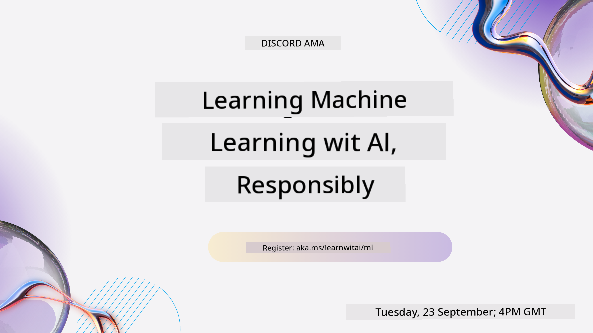

<!--
CO_OP_TRANSLATOR_METADATA:
{
  "original_hash": "ec8385130a8239ad9d827175126a0722",
  "translation_date": "2026-01-01T14:26:32+00:00",
  "source_file": "README.md",
  "language_code": "pcm"
}
-->

### 🌐 Multi-Language Support

#### Supported via GitHub Action (Automated & Always Up-to-Date)

<!-- CO-OP TRANSLATOR LANGUAGES TABLE START -->
[Arabic](../ar/README.md) | [Bengali](../bn/README.md) | [Bulgarian](../bg/README.md) | [Burmese (Myanmar)](../my/README.md) | [Chinese (Simplified)](../zh/README.md) | [Chinese (Traditional, Hong Kong)](../hk/README.md) | [Chinese (Traditional, Macau)](../mo/README.md) | [Chinese (Traditional, Taiwan)](../tw/README.md) | [Croatian](../hr/README.md) | [Czech](../cs/README.md) | [Danish](../da/README.md) | [Dutch](../nl/README.md) | [Estonian](../et/README.md) | [Finnish](../fi/README.md) | [French](../fr/README.md) | [German](../de/README.md) | [Greek](../el/README.md) | [Hebrew](../he/README.md) | [Hindi](../hi/README.md) | [Hungarian](../hu/README.md) | [Indonesian](../id/README.md) | [Italian](../it/README.md) | [Japanese](../ja/README.md) | [Kannada](../kn/README.md) | [Korean](../ko/README.md) | [Lithuanian](../lt/README.md) | [Malay](../ms/README.md) | [Malayalam](../ml/README.md) | [Marathi](../mr/README.md) | [Nepali](../ne/README.md) | [Nigerian Pidgin](./README.md) | [Norwegian](../no/README.md) | [Persian (Farsi)](../fa/README.md) | [Polish](../pl/README.md) | [Portuguese (Brazil)](../br/README.md) | [Portuguese (Portugal)](../pt/README.md) | [Punjabi (Gurmukhi)](../pa/README.md) | [Romanian](../ro/README.md) | [Russian](../ru/README.md) | [Serbian (Cyrillic)](../sr/README.md) | [Slovak](../sk/README.md) | [Slovenian](../sl/README.md) | [Spanish](../es/README.md) | [Swahili](../sw/README.md) | [Swedish](../sv/README.md) | [Tagalog (Filipino)](../tl/README.md) | [Tamil](../ta/README.md) | [Telugu](../te/README.md) | [Thai](../th/README.md) | [Turkish](../tr/README.md) | [Ukrainian](../uk/README.md) | [Urdu](../ur/README.md) | [Vietnamese](../vi/README.md)
<!-- CO-OP TRANSLATOR LANGUAGES TABLE END -->

#### Make una join our community

We get one Discord "Learn with AI" series wey dey go on — learn more and join us for [Learn with AI Series](https://aka.ms/learnwithai/discord) from 18 - 30 September, 2025. You go get beta tips and tricks on how to use GitHub Copilot for Data Science.

# Machine Learning for Beginners - A Curriculum

> 🌍 Make we waka round di world as we dey explore Machine Learning through different cultures 🌍

Cloud Advocates for Microsoft dey happy to give una one 12-week, 26-lesson curriculum wey dey all about **Machine Learning**. For dis curriculum, you go learn wetin people dey call **classic machine learning**, we go mainly use Scikit-learn as library and sidon comot deep learning, wey dey inside our [AI for Beginners' curriculum](https://aka.ms/ai4beginners). Pair these lessons with our ['Data Science for Beginners' curriculum](https://aka.ms/ds4beginners) too!

Waka with us round di world as we apply these classic techniques to data wey come from plenty different places. Every lesson get pre- and post-lesson quizzes, written instructions to finish di lesson, one solution, one assignment, and more. Our project-based way of teaching make you dey learn as you dey build — na better way make new skills hold.

**✍️ Big tnx to our authors** Jen Looper, Stephen Howell, Francesca Lazzeri, Tomomi Imura, Cassie Breviu, Dmitry Soshnikov, Chris Noring, Anirban Mukherjee, Ornella Altunyan, Ruth Yakubu and Amy Boyd

**🎨 Tnx to our illustrators** Tomomi Imura, Dasani Madipalli, and Jen Looper

**🙏 Special tnx 🙏 to our Microsoft Student Ambassador authors, reviewers, and content contributors**, especially Rishit Dagli, Muhammad Sakib Khan Inan, Rohan Raj, Alexandru Petrescu, Abhishek Jaiswal, Nawrin Tabassum, Ioan Samuila, and Snigdha Agarwal

**🤩 Extra tnx to Microsoft Student Ambassadors Eric Wanjau, Jasleen Sondhi, and Vidushi Gupta for our R lessons!**

# How to start

Follow these steps:
1. **Fork di Repository**: Click on the "Fork" button for di top-right corner of dis page.
2. **Clone di Repository**:   `git clone https://github.com/microsoft/ML-For-Beginners.git`

> [find all additional resources for this course in our Microsoft Learn collection](https://learn.microsoft.com/en-us/collections/qrqzamz1nn2wx3?WT.mc_id=academic-77952-bethanycheum)

> 🔧 **Need help?** Check our [Troubleshooting Guide](TROUBLESHOOTING.md) for solutions to common issues with installation, setup, and running lessons.

**[Students](https://aka.ms/student-page)**, to use this curriculum, fork the whole repo to your own GitHub account and do the exercises on your own or with group:

- Start wit pre-lecture quiz.
- Read di lecture and do di activities, stop small and reason for each knowledge check.
- Try build di projects by understanding di lessons instead of just running di solution code; still di code dey for `/solution` folders for each project-oriented lesson.
- Do di post-lecture quiz.
- Finish di challenge.
- Finish di assignment.
- After you don finish one lesson group, visit di [Discussion Board](https://github.com/microsoft/ML-For-Beginners/discussions) and "learn out loud" by filling di correct PAT rubric. PAT na Progress Assessment Tool — na one rubric wey you go fill to help your learning. You fit also react to other PATs so we all fit learn together.

> If you wan study more, we recommend make you follow these [Microsoft Learn](https://docs.microsoft.com/en-us/users/jenlooper-2911/collections/k7o7tg1gp306q4?WT.mc_id=academic-77952-leestott) modules and learnin paths.

**Teachers**, we don [include some suggestions](for-teachers.md) on how make you use this curriculum.

---

## Video walkthroughs

Some lessons get short video form. You fit find dem inside di lessons, or for di [ML for Beginners playlist on the Microsoft Developer YouTube channel](https://aka.ms/ml-beginners-videos) by clicking di image below.

---

## Meet the Team

**Gif by** [Mohit Jaisal](https://linkedin.com/in/mohitjaisal)

> 🎥 Click di image wey dey above for video about di project and di people wey build am!

---

## Pedagogy

We pick two teaching principles when we dey build this curriculum: make am hands-on and **project-based**, and include **frequent quizzes**. Also, dis curriculum get one common **theme** to hold everything together.

By make content follow projects, students go dey more engaged and dem go remember di concepts well. Plus, one low-stakes quiz before class dey set student intention, and another quiz after class go help memory stay. This curriculum make am flexible and fun — you fit take am full or small part. Projects start small and dem go dey more complex as di 12-week cycle dey finish. E still get one postscript about how ML dey work for real world, wey teachers fit use as extra credit or base for discussion.

> Find our [Code of Conduct](CODE_OF_CONDUCT.md), [Contributing](CONTRIBUTING.md), [Translation](TRANSLATIONS.md), and [Troubleshooting](TROUBLESHOOTING.md) guidelines. We dey welcome your constructive feedback!

## Each lesson includes

- optional sketchnote
- optional supplemental video
- video walkthrough (some lessons only)
- [pre-lecture warmup quiz](https://ff-quizzes.netlify.app/en/ml/)
- written lesson
- for project-based lessons, step-by-step guides on how to build the project
- knowledge checks
- a challenge
- supplemental reading
- assignment
- [post-lecture quiz](https://ff-quizzes.netlify.app/en/ml/)

> **A note about languages**: These lessons mainly dem write for Python, but many still dey available for R. To finish an R lesson, go to di `/solution` folder and find di R lessons. Dem get an .rmd extension wey mean R Markdown file — na basically Markdown wey fit hold `code chunks` (R or other languages) and one `YAML header` (wey dey guide how outputs go format like PDF). As e be, e good for data science authoring cos e allow you join your code, di output, and your notes inside Markdown. R Markdown documents fit render go output formats like PDF, HTML, or Word.

> **A note about quizzes**: All quizzes dey inside di [Quiz App folder](../../quiz-app), total 52 quizzes, each get three questions. Dem link the quizzes from di lessons but you fit run di quiz app locally; follow di instruction inside the `quiz-app` folder to host am locally or deploy to Azure.

| Lesson Number |                             Topic                              |                   Lesson Grouping                   | Learning Objectives                                                                                                             |                                                              Linked Lesson                                                               |                        Author                        |
| :-----------: | :------------------------------------------------------------: | :-------------------------------------------------: | ------------------------------------------------------------------------------------------------------------------------------- | :--------------------------------------------------------------------------------------------------------------------------------------: | :--------------------------------------------------: |
|      01       |                Intro wey dey explain machine learning                |      [Introduction](1-Introduction/README.md)       | Learn di basic concepts wey dey behind machine learning                                                                                |                                             [Lesson](1-Introduction/1-intro-to-ML/README.md)                                             |                       Muhammad                       |
|      02       |                Di history of machine learning                 |      [Introduction](1-Introduction/README.md)       | Learn di history wey dey under dis field                                                                                         |                                            [Lesson](1-Introduction/2-history-of-ML/README.md)                                            |                     Jen and Amy                      |
|      03       |                 Fairness and machine learning                  |      [Introduction](1-Introduction/README.md)       | Wetin be di important philosophical mata about fairness wey students suppose consider when dem dey build an apply ML models? |                                              [Lesson](1-Introduction/3-fairness/README.md)                                               |                        Tomomi                        |
|      04       |                Techniques wey dem dey use for machine learning                 |      [Introduction](1-Introduction/README.md)       | Which techniques ML researchers dey use to build ML models?                                                                       |                                          [Lesson](1-Introduction/4-techniques-of-ML/README.md)                                           |                    Chris and Jen                     |
|      05       |                   Introduction to regression                   |        [Regression](2-Regression/README.md)         | Start to use Python and Scikit-learn for regression models                                                                  |         [Python](2-Regression/1-Tools/README.md) • [R](../../2-Regression/1-Tools/solution/R/lesson_1.html)         |      Jen • Eric Wanjau       |
|      06       |                North American pumpkin prices 🎃                |        [Regression](2-Regression/README.md)         | Visualize and clean data to prepare for ML                                                                                  |          [Python](2-Regression/2-Data/README.md) • [R](../../2-Regression/2-Data/solution/R/lesson_2.html)          |      Jen • Eric Wanjau       |
|      07       |                North American pumpkin prices 🎃                |        [Regression](2-Regression/README.md)         | Build linear and polynomial regression models                                                                                   |        [Python](2-Regression/3-Linear/README.md) • [R](../../2-Regression/3-Linear/solution/R/lesson_3.html)        |      Jen and Dmitry • Eric Wanjau       |
|      08       |                North American pumpkin prices 🎃                |        [Regression](2-Regression/README.md)         | Build logistic regression model                                                                                               |     [Python](2-Regression/4-Logistic/README.md) • [R](../../2-Regression/4-Logistic/solution/R/lesson_4.html)      |      Jen • Eric Wanjau       |
|      09       |                          A Web App 🔌                          |           [Web App](3-Web-App/README.md)            | Build web app wey go use your trained model                                                                                       |                                                 [Python](3-Web-App/1-Web-App/README.md)                                                  |                         Jen                          |
|      10       |                 Introduction to classification                 |    [Classification](4-Classification/README.md)     | Clean, prepare, and visualize your data; introduction to classification                                                            | [Python](4-Classification/1-Introduction/README.md) • [R](../../4-Classification/1-Introduction/solution/R/lesson_10.html)  | Jen and Cassie • Eric Wanjau |
|      11       |             Delicious Asian and Indian cuisines 🍜             |    [Classification](4-Classification/README.md)     | Introduction to classifiers                                                                                                     | [Python](4-Classification/2-Classifiers-1/README.md) • [R](../../4-Classification/2-Classifiers-1/solution/R/lesson_11.html) | Jen and Cassie • Eric Wanjau |
|      12       |             Delicious Asian and Indian cuisines 🍜             |    [Classification](4-Classification/README.md)     | More classifiers                                                                                                                | [Python](4-Classification/3-Classifiers-2/README.md) • [R](../../4-Classification/3-Classifiers-2/solution/R/lesson_12.html) | Jen and Cassie • Eric Wanjau |
|      13       |             Delicious Asian and Indian cuisines 🍜             |    [Classification](4-Classification/README.md)     | Build recommender web app wey dey use your model                                                                                    |                                              [Python](4-Classification/4-Applied/README.md)                                              |                         Jen                          |
|      14       |                   Introduction to clustering                   |        [Clustering](5-Clustering/README.md)         | Clean, prepare, and visualize your data; Introduction to clustering                                                                |         [Python](5-Clustering/1-Visualize/README.md) • [R](../../5-Clustering/1-Visualize/solution/R/lesson_14.html)         |      Jen • Eric Wanjau       |
|      15       |              Exploring Nigerian Musical Tastes 🎧              |        [Clustering](5-Clustering/README.md)         | Explore di K-Means clustering method                                                                                           |           [Python](5-Clustering/2-K-Means/README.md) • [R](../../5-Clustering/2-K-Means/solution/R/lesson_15.html)           |      Jen • Eric Wanjau       |
|      16       |        Introduction to natural language processing ☕️         |   [Natural language processing](6-NLP/README.md)    | Learn di basics about NLP by building a simple bot                                                                             |                                             [Python](6-NLP/1-Introduction-to-NLP/README.md)                                              |                       Stephen                        |
|      17       |                      Common NLP Tasks ☕️                      |   [Natural language processing](6-NLP/README.md)    | Deepen your NLP knowledge by understanding common tasks wey dey necessary when you dey deal with language structures                          |                                                    [Python](6-NLP/2-Tasks/README.md)                                                     |                       Stephen                        |
|      18       |             Translation and sentiment analysis ♥️              |   [Natural language processing](6-NLP/README.md)    | Translation and sentiment analysis with Jane Austen                                                                             |                                            [Python](6-NLP/3-Translation-Sentiment/README.md)                                             |                       Stephen                        |
|      19       |                  Romantic hotels of Europe ♥️                  |   [Natural language processing](6-NLP/README.md)    | Sentiment analysis with hotel reviews 1                                                                                         |                                               [Python](6-NLP/4-Hotel-Reviews-1/README.md)                                                |                       Stephen                        |
|      20       |                  Romantic hotels of Europe ♥️                  |   [Natural language processing](6-NLP/README.md)    | Sentiment analysis with hotel reviews 2                                                                                         |                                               [Python](6-NLP/5-Hotel-Reviews-2/README.md)                                                |                       Stephen                        |
|      21       |            Introduction to time series forecasting             |        [Time series](7-TimeSeries/README.md)        | Introduction to time series forecasting                                                                                         |                                             [Python](7-TimeSeries/1-Introduction/README.md)                                              |                      Francesca                       |
|      22       | ⚡️ World Power Usage ⚡️ - time series forecasting with ARIMA |        [Time series](7-TimeSeries/README.md)        | Time series forecasting with ARIMA                                                                                              |                                                 [Python](7-TimeSeries/2-ARIMA/README.md)                                                 |                      Francesca                       |
|      23       |  ⚡️ World Power Usage ⚡️ - time series forecasting with SVR  |        [Time series](7-TimeSeries/README.md)        | Time series forecasting with Support Vector Regressor                                                                           |                                                  [Python](7-TimeSeries/3-SVR/README.md)                                                  |                       Anirban                        |
|      24       |             Introduction to reinforcement learning             | [Reinforcement learning](8-Reinforcement/README.md) | Introduction to reinforcement learning with Q-Learning                                                                          |                                             [Python](8-Reinforcement/1-QLearning/README.md)                                              |                        Dmitry                        |
|      25       |                 Help Peter avoid the wolf! 🐺                  | [Reinforcement learning](8-Reinforcement/README.md) | Reinforcement learning Gym                                                                                                      |                                                [Python](8-Reinforcement/2-Gym/README.md)                                                 |                        Dmitry                        |
|  Postscript   |            Real-World ML scenarios and applications            |      [ML in the Wild](9-Real-World/README.md)       | Interesting and revealing real-world applications of classical ML                                                               |                                             [Lesson](9-Real-World/1-Applications/README.md)                                              |                         Team                         |
|  Postscript   |            Model Debugging in ML using RAI dashboard          |      [ML in the Wild](9-Real-World/README.md)       | Model Debugging in Machine Learning using Responsible AI dashboard components                                                              |                                             [Lesson](9-Real-World/2-Debugging-ML-Models/README.md)                                              |                         Ruth Yakubu                       |

> [find all additional resources for this course in our Microsoft Learn collection](https://learn.microsoft.com/en-us/collections/qrqzamz1nn2wx3?WT.mc_id=academic-77952-bethanycheum)

## Access wey no need internet

You fit run dis documentation offline by using [Docsify](https://docsify.js.org/#/). Fork dis repo, [install Docsify](https://docsify.js.org/#/quickstart) for your local machine, and then for the root folder of dis repo, type `docsify serve`. Di website go dey served for port 3000 on your localhost: `localhost:3000`.

## PDFs

Find pdf of di curriculum wit links [here](https://microsoft.github.io/ML-For-Beginners/pdf/readme.pdf).

## 🎒 Oda Courses 

Our team dey produce oda courses! Check dem out:

<!-- CO-OP TRANSLATOR OTHER COURSES START -->
### LangChain

---

### Azure / Edge / MCP / Agents

---
 
### Generative AI Series

[-9333EA?style=for-the-badge&labelColor=E5E7EB&color=9333EA)](https://github.com/microsoft/Generative-AI-for-beginners-dotnet?WT.mc_id=academic-105485-koreyst)
[-C084FC?style=for-the-badge&labelColor=E5E7EB&color=C084FC)](https://github.com/microsoft/generative-ai-for-beginners-java?WT.mc_id=academic-105485-koreyst)
[-E879F9?style=for-the-badge&labelColor=E5E7EB&color=E879F9)](https://github.com/microsoft/generative-ai-with-javascript?WT.mc_id=academic-105485-koreyst)

---
 
### Main Tin Wey You Go Learn

---
 
### Copilot Series

<!-- CO-OP TRANSLATOR OTHER COURSES END -->

## How to Get Help

If you jam stuck or get any question about how to build AI apps, join other learners and experienced developers for discussion about MCP. Na supportive community wey dey welcome questions and where people dey share knowledge freely.

If you get product feedback or you see errors while you dey build, visit:

---

<!-- CO-OP TRANSLATOR DISCLAIMER START -->
Abeg note:
We use AI translation service (Co-op Translator: https://github.com/Azure/co-op-translator) take translate dis document. Even though we dey try make am correct, make you sabi say automatic translations fit get mistakes or wrong parts. The original document for im own language na the main source wey get authority. If na important information, make you use professional human translator. We no be liable for any misunderstanding or misinterpretation wey fit happen because of this translation.
<!-- CO-OP TRANSLATOR DISCLAIMER END -->