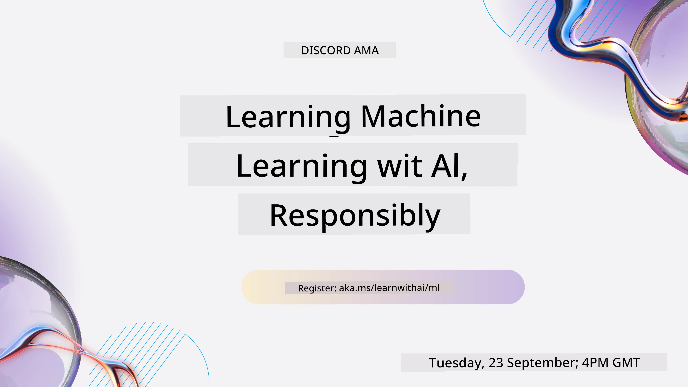
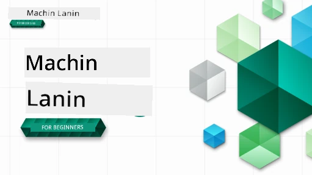

[](https://github.com/microsoft/ML-For-Beginners/blob/master/LICENSE)
[](https://GitHub.com/microsoft/ML-For-Beginners/graphs/contributors/)
[](https://GitHub.com/microsoft/ML-For-Beginners/issues/)
[](https://GitHub.com/microsoft/ML-For-Beginners/pulls/)
[](http://makeapullrequest.com)

[](https://GitHub.com/microsoft/ML-For-Beginners/watchers/)
[](https://GitHub.com/microsoft/ML-For-Beginners/network/)
[](https://GitHub.com/microsoft/ML-For-Beginners/stargazers/)

### 🌐 Multi-Language Support

#### Supported via GitHub Action (Automated & Always Up-to-Date)

<!-- CO-OP TRANSLATOR LANGUAGES TABLE START -->
[Arabic](../ar/README.md) | [Bengali](../bn/README.md) | [Bulgarian](../bg/README.md) | [Burmese (Myanmar)](../my/README.md) | [Chinese (Simplified)](../zh-CN/README.md) | [Chinese (Traditional, Hong Kong)](../zh-HK/README.md) | [Chinese (Traditional, Macau)](../zh-MO/README.md) | [Chinese (Traditional, Taiwan)](../zh-TW/README.md) | [Croatian](../hr/README.md) | [Czech](../cs/README.md) | [Danish](../da/README.md) | [Dutch](../nl/README.md) | [Estonian](../et/README.md) | [Finnish](../fi/README.md) | [French](../fr/README.md) | [German](../de/README.md) | [Greek](../el/README.md) | [Hebrew](../he/README.md) | [Hindi](../hi/README.md) | [Hungarian](../hu/README.md) | [Indonesian](../id/README.md) | [Italian](../it/README.md) | [Japanese](../ja/README.md) | [Kannada](../kn/README.md) | [Khmer](../km/README.md) | [Korean](../ko/README.md) | [Lithuanian](../lt/README.md) | [Malay](../ms/README.md) | [Malayalam](../ml/README.md) | [Marathi](../mr/README.md) | [Nepali](../ne/README.md) | [Nigerian Pidgin](./README.md) | [Norwegian](../no/README.md) | [Persian (Farsi)](../fa/README.md) | [Polish](../pl/README.md) | [Portuguese (Brazil)](../pt-BR/README.md) | [Portuguese (Portugal)](../pt-PT/README.md) | [Punjabi (Gurmukhi)](../pa/README.md) | [Romanian](../ro/README.md) | [Russian](../ru/README.md) | [Serbian (Cyrillic)](../sr/README.md) | [Slovak](../sk/README.md) | [Slovenian](../sl/README.md) | [Spanish](../es/README.md) | [Swahili](../sw/README.md) | [Swedish](../sv/README.md) | [Tagalog (Filipino)](../tl/README.md) | [Tamil](../ta/README.md) | [Telugu](../te/README.md) | [Thai](../th/README.md) | [Turkish](../tr/README.md) | [Ukrainian](../uk/README.md) | [Urdu](../ur/README.md) | [Vietnamese](../vi/README.md)

> **Prefer to Clone Locally?**
>
> Dis repository get over 50 languages wey dem don translate and e go make di download size big well well. If you want clone am without di translations, use sparse checkout:
>
> **Bash / macOS / Linux:**
> ```bash
> git clone --filter=blob:none --sparse https://github.com/microsoft/ML-For-Beginners.git
> cd ML-For-Beginners
> git sparse-checkout set --no-cone '/*' '!translations' '!translated_images'
> ```
>
> **CMD (Windows):**
> ```cmd
> git clone --filter=blob:none --sparse https://github.com/microsoft/ML-For-Beginners.git
> cd ML-For-Beginners
> git sparse-checkout set --no-cone "/*" "!translations" "!translated_images"
> ```
>
> Dis one go give you everything wey you need to finish di course quick quick.
<!-- CO-OP TRANSLATOR LANGUAGES TABLE END -->

#### Join Our Community

[](https://discord.gg/nTYy5BXMWG)

We get ongoing Discord series wey dey teach AI, make you learn more and join us for [Learn with AI Series](https://aka.ms/learnwithai/discord) from 18 - 30 September, 2025. You go get tips and tricks on how to use GitHub Copilot for Data Science.



# Machine Learning for Beginners - A Curriculum

> 🌍 Travel around di world as we explore Machine Learning through different world cultures 🌍

Cloud Advocates for Microsoft happy to offer 12 weeks, 26 lesson curriculum all about **Machine Learning**. For dis curriculum, you go learn about wetin dem dey call **classic machine learning**, using mainly Scikit-learn as library and avoid deep learning, wey we cover for our [AI for Beginners' curriculum](https://aka.ms/ai4beginners). You fit also join am with our ['Data Science for Beginners' curriculum](https://aka.ms/ds4beginners).

Travel with us round di world as we apply dis classic techniques to data from many parts of di world. Each lesson get quiz before and after, instructions to complete am, solution, assignment, and more. Our project-based method go help you learn as you build, wey be beta way for new skills to stick.

**✍️ Big thanks to our authors** Jen Looper, Stephen Howell, Francesca Lazzeri, Tomomi Imura, Cassie Breviu, Dmitry Soshnikov, Chris Noring, Anirban Mukherjee, Ornella Altunyan, Ruth Yakubu and Amy Boyd

**🎨 Thanks also to our illustrators** Tomomi Imura, Dasani Madipalli, and Jen Looper

**🙏 Special thanks 🙏 to our Microsoft Student Ambassador authors, reviewers, and content contributors**, especially Rishit Dagli, Muhammad Sakib Khan Inan, Rohan Raj, Alexandru Petrescu, Abhishek Jaiswal, Nawrin Tabassum, Ioan Samuila, and Snigdha Agarwal

**🤩 Extra shoutout to Microsoft Student Ambassadors Eric Wanjau, Jasleen Sondhi, and Vidushi Gupta for our R lessons!**

# Getting Started

Follow dis steps:
1. **Fork di Repository**: Click di "Fork" button for di top-right corner of dis page.
2. **Clone di Repository**:   `git clone https://github.com/microsoft/ML-For-Beginners.git`

> 💡 **Quick Start Tip:** You want start for browser without setting Python for your machine? Use [GitHub Codespaces](https://github.com/features/codespaces) to create cloud development environment for your fork. Open di green **Code** menu, select **Codespaces**, and create codespace; then install each lesson dependencies as e dey needed.

> [find all additional resources for dis course inside our Microsoft Learn collection](https://learn.microsoft.com/en-us/collections/qrqzamz1nn2wx3?WT.mc_id=academic-77952-bethanycheum)

> 🔧 **Need help?** Check our [Troubleshooting Guide](TROUBLESHOOTING.md) for solutions to common wahala for installation, setup, and running lessons.


**[Students](https://aka.ms/student-page)**, to use dis curriculum, fork di full repo to your own GitHub account and complete di exercises alone or for group:

- Start with pre-lecture quiz.
- Read di lecture and do di activities, stop and think for each knowledge check.
- Try create di projects by understanding di lessons, no too dey rely on di solution code; but di code dey for `/solution` folders for each project lesson.
- Do di post-lecture quiz.
- Complete di challenge.
- Complete di assignment.
- After finishing one lesson group, visit di [Discussion Board](https://github.com/microsoft/ML-For-Beginners/discussions) and "learn out loud" by filling di correct PAT rubric. PAT na Progress Assessment Tool wey you fill to boost your learning. You fit also react to other PATs so we fit learn together.

> For more study, we recommend you follow dis [Microsoft Learn](https://docs.microsoft.com/en-us/users/jenlooper-2911/collections/k7o7tg1gp306q4?WT.mc_id=academic-77952-leestott) modules and learning paths.

**Teachers**, we don [include some suggestions](for-teachers.md) on how to use dis curriculum.

---

## Video walkthroughs

Some of di lessons dey available as short video. You fit find all dem inside di lessons, or for di [ML for Beginners playlist for Microsoft Developer YouTube channel](https://aka.ms/ml-beginners-videos) by clicking di picture below.

[](https://aka.ms/ml-beginners-videos)

---

## Meet the Team

[](https://youtu.be/Tj1XWrDSYJU)

**Gif by** [Mohit Jaisal](https://linkedin.com/in/mohitjaisal)

> 🎥 Click di picture above make you watch video about di project and di people wey create am!

---

## Pedagogy

We choose two teaching principles wen we build dis curriculum: make e be hands-on **project-based** and make e get **frequent quizzes**. E good make dis curriculum get one common **theme** so e go get better organisation.

If di content dey connect with projects, e go make learning sweet for students and e go make concepts stick well. Also, one small quiz before class go set student mind for learning, and the quiz after class go help dem remember well. Dis curriculum na flexible and fun for use, e fit be complete or part of am. Projects start small and get hard as di 12 weeks finish. Also, dis curriculum get small postscript for real-life ML applications, wey fit be extra credit or discussion material.

> Find our [Code of Conduct](CODE_OF_CONDUCT.md), [Contributing](CONTRIBUTING.md), [Translations](..), and [Troubleshooting](TROUBLESHOOTING.md) guidelines. We welcome your constructive feedback!

## Each lesson includes

- optional sketchnote
- optional supplemental video
- video walkthrough (some lessons only)
- [pre-lecture warmup quiz](https://ff-quizzes.netlify.app/en/ml/)
- written lesson
- for project-based lessons, step-by-step guides on how to build the project
- knowledge checks
- a challenge
- supplemental reading
- assignment
- [post-lecture quiz](https://ff-quizzes.netlify.app/en/ml/)

> **A note about languages**: These lessons mainly write for Python, but many get also for R. To finish R lesson, go `/solution` folder find R lessons. Dem get .rmd extension wey mean **R Markdown** file wey be mix of `code chunks` (of R or other languages) and `YAML header` (wey show how make outputs like PDF). E good for data science because e blend code, output, and your writing for Markdown. Plus, R Markdown files fit turn to PDF, HTML, or Word.

> **A note about quizzes**: All quizzes dey inside [Quiz App folder](../../quiz-app), with 52 quizzes each with three questions. Dem link am from lessons but quiz app fit run locally; follow instruction inside `quiz-app` folder to host or deploy to Azure.

| Lesson Number |                             Topic                              |                   Lesson Grouping                   | Learning Objectives                                                                                                             |                                                              Linked Lesson                                                               |                        Author                        |
| :-----------: | :------------------------------------------------------------: | :-------------------------------------------------: | ------------------------------------------------------------------------------------------------------------------------------- | :--------------------------------------------------------------------------------------------------------------------------------------: | :--------------------------------------------------: |
|      01       |                Introduction to machine learning                |      [Introduction](1-Introduction/README.md)       | Learn the basic concepts behind machine learning                                                                                |                                             [Lesson](1-Introduction/1-intro-to-ML/README.md)                                             |                       Muhammad                       |
|      02       |                The History of machine learning                 |      [Introduction](1-Introduction/README.md)       | Learn the history underlying this field                                                                                         |                                            [Lesson](1-Introduction/2-history-of-ML/README.md)                                            |                     Jen and Amy                      |
|      03       |                 Fairness and machine learning                  |      [Introduction](1-Introduction/README.md)       | What are the important philosophical issues around fairness that students should consider when building and applying ML models? |                                              [Lesson](1-Introduction/3-fairness/README.md)                                               |                        Tomomi                        |
|      04       |                Techniques for machine learning                 |      [Introduction](1-Introduction/README.md)       | What techniques do ML researchers use to build ML models?                                                                       |                                          [Lesson](1-Introduction/4-techniques-of-ML/README.md)                                           |                    Chris and Jen                     |
|      05       |                   Introduction to regression                   |        [Regression](2-Regression/README.md)         | Get started with Python and Scikit-learn for regression models                                                                  |         [Python](2-Regression/1-Tools/README.md) • [R](../../2-Regression/1-Tools/solution/R/lesson_1.html)         |      Jen • Eric Wanjau       |
|      06       |                North American pumpkin prices 🎃                |        [Regression](2-Regression/README.md)         | Visualize and clean data in preparation for ML                                                                                  |          [Python](2-Regression/2-Data/README.md) • [R](../../2-Regression/2-Data/solution/R/lesson_2.html)          |      Jen • Eric Wanjau       |
|      07       |                North American pumpkin prices 🎃                |        [Regression](2-Regression/README.md)         | Build linear and polynomial regression models                                                                                   |        [Python](2-Regression/3-Linear/README.md) • [R](../../2-Regression/3-Linear/solution/R/lesson_3.html)        |      Jen and Dmitry • Eric Wanjau       |
|      08       |                North American pumpkin prices 🎃                |        [Regression](2-Regression/README.md)         | Build a logistic regression model                                                                                               |     [Python](2-Regression/4-Logistic/README.md) • [R](../../2-Regression/4-Logistic/solution/R/lesson_4.html)      |      Jen • Eric Wanjau       |
|      09       |                          A Web App 🔌                          |           [Web App](3-Web-App/README.md)            | Build a web app to use your trained model                                                                                       |                                                 [Python](3-Web-App/1-Web-App/README.md)                                                  |                         Jen                          |
|      10       |                 Introduction to classification                 |    [Classification](4-Classification/README.md)     | Clean, prep, and visualize your data; introduction to classification                                                            | [Python](4-Classification/1-Introduction/README.md) • [R](../../4-Classification/1-Introduction/solution/R/lesson_10.html)  | Jen and Cassie • Eric Wanjau |
|      11       |             Delicious Asian and Indian cuisines 🍜             |    [Classification](4-Classification/README.md)     | Introduction to classifiers                                                                                                     | [Python](4-Classification/2-Classifiers-1/README.md) • [R](../../4-Classification/2-Classifiers-1/solution/R/lesson_11.html) | Jen and Cassie • Eric Wanjau |
|      12       |             Delicious Asian and Indian cuisines 🍜             |    [Classification](4-Classification/README.md)     | More classifiers                                                                                                                | [Python](4-Classification/3-Classifiers-2/README.md) • [R](../../4-Classification/3-Classifiers-2/solution/R/lesson_12.html) | Jen and Cassie • Eric Wanjau |
|      13       |             Delicious Asian and Indian cuisines 🍜             |    [Classification](4-Classification/README.md)     | Build a recommender web app using your model                                                                                    |                                              [Python](4-Classification/4-Applied/README.md)                                              |                         Jen                          |
|      14       |                   Introduction to clustering                   |        [Clustering](5-Clustering/README.md)         | Clean, prep, and visualize your data; Introduction to clustering                                                                |         [Python](5-Clustering/1-Visualize/README.md) • [R](../../5-Clustering/1-Visualize/solution/R/lesson_14.html)         |      Jen • Eric Wanjau       |
|      15       |              Exploring Nigerian Musical Tastes 🎧              |        [Clustering](5-Clustering/README.md)         | Explore the K-Means clustering method                                                                                           |           [Python](5-Clustering/2-K-Means/README.md) • [R](../../5-Clustering/2-K-Means/solution/R/lesson_15.html)           |      Jen • Eric Wanjau       |
|      16       |        Introduction to natural language processing ☕️         |   [Natural language processing](6-NLP/README.md)    | Learn the basics about NLP by building a simple bot                                                                             |                                             [Python](6-NLP/1-Introduction-to-NLP/README.md)                                              |                       Stephen                        |
|      17       |                      Common NLP Tasks ☕️                      |   [Natural language processing](6-NLP/README.md)    | Deepen your NLP knowledge by understanding common tasks required when dealing with language structures                          |                                                    [Python](6-NLP/2-Tasks/README.md)                                                     |                       Stephen                        |
|      18       |             Translation and sentiment analysis ♥️              |   [Natural language processing](6-NLP/README.md)    | Translation and sentiment analysis with Jane Austen                                                                             |                                            [Python](6-NLP/3-Translation-Sentiment/README.md)                                             |                       Stephen                        |
|      19       |                  Romantic hotels of Europe ♥️                  |   [Natural language processing](6-NLP/README.md)    | Sentiment analysis with hotel reviews 1                                                                                         |                                               [Python](6-NLP/4-Hotel-Reviews-1/README.md)                                                |                       Stephen                        |
|      20       |                  Romantic hotels of Europe ♥️                  |   [Natural language processing](6-NLP/README.md)    | Sentiment analysis with hotel reviews 2                                                                                         |                                               [Python](6-NLP/5-Hotel-Reviews-2/README.md)                                                |                       Stephen                        |
|      21       |            Introduction to time series forecasting             |        [Time series](7-TimeSeries/README.md)        | Introduction to time series forecasting                                                                                         |                                             [Python](7-TimeSeries/1-Introduction/README.md)                                              |                      Francesca                       |
|      22       | ⚡️ World Power Usage ⚡️ - time series forecasting with ARIMA |        [Time series](7-TimeSeries/README.md)        | Time series forecasting with ARIMA                                                                                              |                                                 [Python](7-TimeSeries/2-ARIMA/README.md)                                                 |                      Francesca                       |
|      23       |  ⚡️ World Power Usage ⚡️ - time series forecasting with SVR  |        [Time series](7-TimeSeries/README.md)        | Time series forecasting with Support Vector Regressor                                                                           |                                                  [Python](7-TimeSeries/3-SVR/README.md)                                                  |                       Anirban                        |
|      24       |             Introduction to reinforcement learning             | [Reinforcement learning](8-Reinforcement/README.md) | Introduction to reinforcement learning with Q-Learning                                                                          |                                             [Python](8-Reinforcement/1-QLearning/README.md)                                              |                        Dmitry                        |
|      25       |                 Help Peter avoid the wolf! 🐺                  | [Reinforcement learning](8-Reinforcement/README.md) | Reinforcement learning Gym                                                                                                      |                                                [Python](8-Reinforcement/2-Gym/README.md)                                                 |                        Dmitry                        |
|  Postscript   |            Real-World ML scenarios and applications            |      [ML in the Wild](9-Real-World/README.md)       | Interesting and revealing real-world applications of classical ML                                                               |                                             [Lesson](9-Real-World/1-Applications/README.md)                                              |                         Team                         |
|  Postscript   |            Model Debugging in ML using RAI dashboard            |      [ML in the Wild](9-Real-World/README.md)       | Model Debugging in Machine Learning using Responsible AI dashboard components                                                              |                                             [Lesson](9-Real-World/2-Debugging-ML-Models/README.md)                                              |                     Ruth Yakubu                      |

> [find all additional resources for this course in our Microsoft Learn collection](https://learn.microsoft.com/en-us/collections/qrqzamz1nn2wx3?WT.mc_id=academic-77952-bethanycheum)

## Offline access

You fit run dis documentation offline by using [Docsify](https://docsify.js.org/#/). Fork dis repo, [install Docsify](https://docsify.js.org/#/quickstart) for your local machine, den for the root folder of dis repo, type `docsify serve`. The website go dey available for port 3000 for your localhost: `localhost:3000`.

## PDFs

Find one pdf of the curriculum with links [here](https://microsoft.github.io/ML-For-Beginners/pdf/readme.pdf).


## 🎒 Other Courses 

Our team dey make other courses! Check am out:

<!-- CO-OP TRANSLATOR OTHER COURSES START -->
### LangChain
[](https://aka.ms/langchain4j-for-beginners)
[](https://aka.ms/langchainjs-for-beginners?WT.mc_id=m365-94501-dwahlin)
[](https://github.com/microsoft/langchain-for-beginners?WT.mc_id=m365-94501-dwahlin)
---

### Azure / Edge / MCP / Agents
[](https://github.com/microsoft/AZD-for-beginners?WT.mc_id=academic-105485-koreyst)
[](https://github.com/microsoft/edgeai-for-beginners?WT.mc_id=academic-105485-koreyst)
[](https://github.com/microsoft/mcp-for-beginners?WT.mc_id=academic-105485-koreyst)
[](https://github.com/microsoft/ai-agents-for-beginners?WT.mc_id=academic-105485-koreyst)

---
 
### Generative AI Series
[](https://github.com/microsoft/generative-ai-for-beginners?WT.mc_id=academic-105485-koreyst)
[-9333EA?style=for-the-badge&labelColor=E5E7EB&color=9333EA)](https://github.com/microsoft/Generative-AI-for-beginners-dotnet?WT.mc_id=academic-105485-koreyst)
[-C084FC?style=for-the-badge&labelColor=E5E7EB&color=C084FC)](https://github.com/microsoft/generative-ai-for-beginners-java?WT.mc_id=academic-105485-koreyst)
[-E879F9?style=for-the-badge&labelColor=E5E7EB&color=E879F9)](https://github.com/microsoft/generative-ai-with-javascript?WT.mc_id=academic-105485-koreyst)

---
 
### Core Learning
[](https://aka.ms/ml-beginners?WT.mc_id=academic-105485-koreyst)
[](https://aka.ms/datascience-beginners?WT.mc_id=academic-105485-koreyst)
[](https://aka.ms/ai-beginners?WT.mc_id=academic-105485-koreyst)
[](https://github.com/microsoft/Security-101?WT.mc_id=academic-96948-sayoung)
[](https://aka.ms/webdev-beginners?WT.mc_id=academic-105485-koreyst)
[](https://aka.ms/iot-beginners?WT.mc_id=academic-105485-koreyst)
[](https://github.com/microsoft/xr-development-for-beginners?WT.mc_id=academic-105485-koreyst)

---
 
### Copilot Series
[](https://aka.ms/GitHubCopilotAI?WT.mc_id=academic-105485-koreyst)
[](https://github.com/microsoft/mastering-github-copilot-for-dotnet-csharp-developers?WT.mc_id=academic-105485-koreyst)
[](https://github.com/microsoft/CopilotAdventures?WT.mc_id=academic-105485-koreyst)
<!-- CO-OP TRANSLATOR OTHER COURSES END -->

## Getting Help

If you jam problem or get questions while you dey learn Machine Learning or dey build AI applications, no worry — help dey.

You fit join discussions with other learners and developers, ask questions, and share your ideas with the community.

- Join the community to ask questions and learn with others
- Discuss Machine Learning concepts and project ideas
- Get guidance from experienced developers

One supportive community na beta way to grow your skills and solve problems quick.

[Microsoft Foundry Discord Community](https://discord.gg/nTYy5BXMWG)

If you find bugs, errors, or get suggestions for better improvement, you fit open one **Issue** for dis repository to report the problem.

For product feedback or to search existing community posts, go visit the Developer Forum:

[](https://aka.ms/foundry/forum)

## Additional Learning Tips

- Review notebooks after each lesson for better understanding.
- Practice implementing algorithms on your own.
- Explore real-world datasets using learned concepts.

---

<!-- CO-OP TRANSLATOR DISCLAIMER START -->
**Disclaimer**:
Dis document don translate wit AI translation service [Co-op Translator](https://github.com/Azure/co-op-translator). Even tho we dey try make am correct, abeg make you know say automated translation fit get errors or mistakes. Di original document for dia own language na im be di correct source. For important info, make person wey sabi human translation do am. We no go responsible for any misunderstanding or wrong understanding wey fit happen because of dis translation.
<!-- CO-OP TRANSLATOR DISCLAIMER END -->