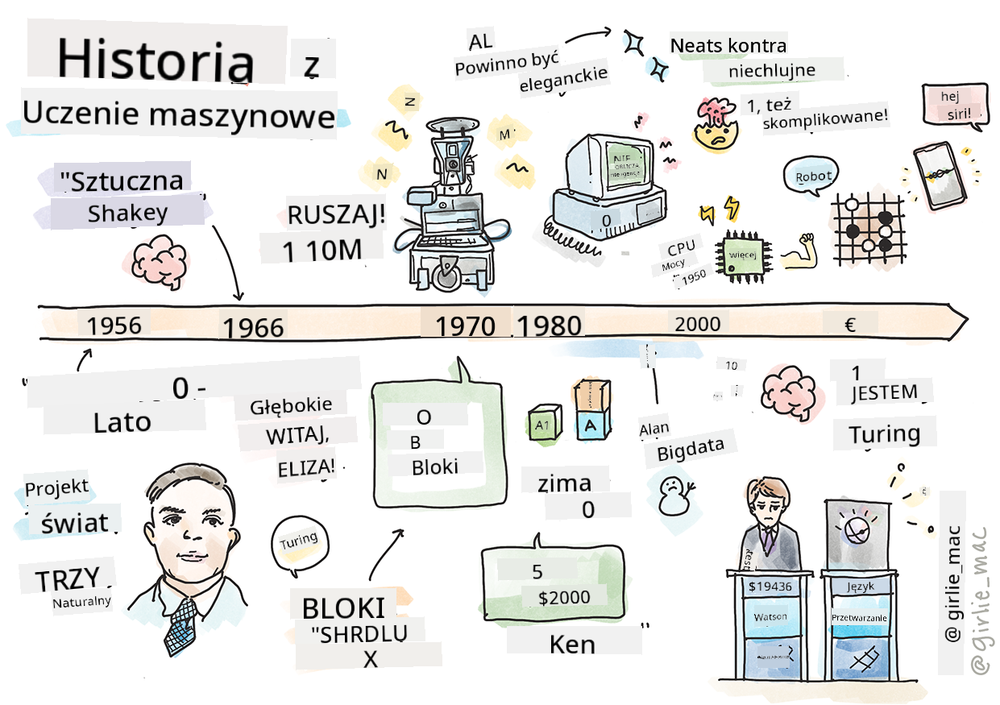
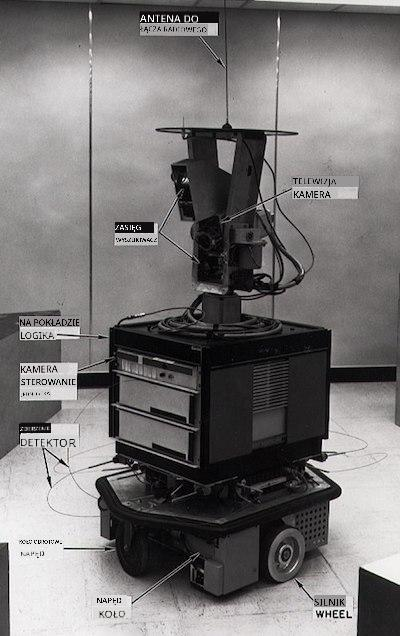
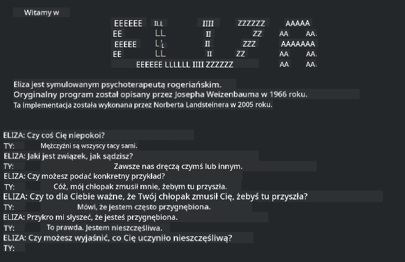

<!--
CO_OP_TRANSLATOR_METADATA:
{
  "original_hash": "b2d11df10030cacc41427a1fbc8bc8f1",
  "translation_date": "2025-09-03T17:49:54+00:00",
  "source_file": "1-Introduction/2-history-of-ML/README.md",
  "language_code": "pl"
}
-->
# Historia uczenia maszynowego

> Sketchnote autorstwa [Tomomi Imura](https://www.twitter.com/girlie_mac)

## [Quiz przed wykładem](https://gray-sand-07a10f403.1.azurestaticapps.net/quiz/3/)

---

> 🎥 Kliknij obrazek powyżej, aby obejrzeć krótki film omawiający tę lekcję.

W tej lekcji przejdziemy przez najważniejsze kamienie milowe w historii uczenia maszynowego i sztucznej inteligencji.

Historia sztucznej inteligencji (AI) jako dziedziny jest nierozerwalnie związana z historią uczenia maszynowego, ponieważ algorytmy i postępy obliczeniowe, które są podstawą ML, przyczyniły się do rozwoju AI. Warto pamiętać, że chociaż te dziedziny jako odrębne obszary badań zaczęły krystalizować się w latach 50., ważne [odkrycia algorytmiczne, statystyczne, matematyczne, obliczeniowe i techniczne](https://wikipedia.org/wiki/Timeline_of_machine_learning) poprzedzały i nakładały się na ten okres. W rzeczywistości ludzie zastanawiali się nad tymi zagadnieniami przez [setki lat](https://wikipedia.org/wiki/History_of_artificial_intelligence): ten artykuł omawia historyczne intelektualne podstawy idei „myślącej maszyny”.

---
## Ważne odkrycia

- 1763, 1812 [Twierdzenie Bayesa](https://wikipedia.org/wiki/Bayes%27_theorem) i jego poprzednicy. To twierdzenie i jego zastosowania są podstawą wnioskowania, opisując prawdopodobieństwo wystąpienia zdarzenia na podstawie wcześniejszej wiedzy.
- 1805 [Metoda najmniejszych kwadratów](https://wikipedia.org/wiki/Least_squares) opracowana przez francuskiego matematyka Adriena-Marie Legendre’a. Ta teoria, którą poznasz w naszym module dotyczącym regresji, pomaga w dopasowywaniu danych.
- 1913 [Łańcuchy Markowa](https://wikipedia.org/wiki/Markov_chain), nazwane na cześć rosyjskiego matematyka Andrieja Markowa, służą do opisu sekwencji możliwych zdarzeń na podstawie poprzedniego stanu.
- 1957 [Perceptron](https://wikipedia.org/wiki/Perceptron) to rodzaj liniowego klasyfikatora wynaleziony przez amerykańskiego psychologa Franka Rosenblatta, który jest podstawą postępów w uczeniu głębokim.

---

- 1967 [Najbliższy sąsiad](https://wikipedia.org/wiki/Nearest_neighbor) to algorytm pierwotnie zaprojektowany do mapowania tras. W kontekście ML jest używany do wykrywania wzorców.
- 1970 [Backpropagacja](https://wikipedia.org/wiki/Backpropagation) jest używana do trenowania [sieci neuronowych typu feedforward](https://wikipedia.org/wiki/Feedforward_neural_network).
- 1982 [Rekurencyjne sieci neuronowe](https://wikipedia.org/wiki/Recurrent_neural_network) to sztuczne sieci neuronowe wywodzące się z sieci typu feedforward, które tworzą grafy czasowe.

✅ Zrób małe badania. Jakie inne daty wyróżniają się jako kluczowe w historii ML i AI?

---
## 1950: Maszyny, które myślą

Alan Turing, naprawdę niezwykła osoba, która została uznana [przez opinię publiczną w 2019 roku](https://wikipedia.org/wiki/Icons:_The_Greatest_Person_of_the_20th_Century) za największego naukowca XX wieku, jest uznawany za osobę, która pomogła położyć fundamenty dla koncepcji „maszyny, która może myśleć”. Zmagał się z krytykami i własną potrzebą empirycznego dowodu tej koncepcji, częściowo poprzez stworzenie [Testu Turinga](https://www.bbc.com/news/technology-18475646), który poznasz w naszych lekcjach dotyczących NLP.

---
## 1956: Letni projekt badawczy w Dartmouth

„Letni projekt badawczy w Dartmouth dotyczący sztucznej inteligencji był przełomowym wydarzeniem dla sztucznej inteligencji jako dziedziny”, i to właśnie tutaj został ukuty termin „sztuczna inteligencja” ([źródło](https://250.dartmouth.edu/highlights/artificial-intelligence-ai-coined-dartmouth)).

> Każdy aspekt uczenia się lub jakiejkolwiek innej cechy inteligencji może być zasadniczo tak precyzyjnie opisany, że można stworzyć maszynę, która go symuluje.

---

Główny badacz, profesor matematyki John McCarthy, miał nadzieję „kontynuować na podstawie przypuszczenia, że każdy aspekt uczenia się lub jakiejkolwiek innej cechy inteligencji może być zasadniczo tak precyzyjnie opisany, że można stworzyć maszynę, która go symuluje”. Wśród uczestników znalazł się inny wybitny przedstawiciel tej dziedziny, Marvin Minsky.

Warsztat ten jest uznawany za inicjatora i promującego kilka dyskusji, w tym „wzrost metod symbolicznych, systemów skoncentrowanych na ograniczonych domenach (wczesne systemy ekspertowe) oraz systemów dedukcyjnych kontra systemy indukcyjne”. ([źródło](https://wikipedia.org/wiki/Dartmouth_workshop)).

---
## 1956 - 1974: „Złote lata”

Od lat 50. do połowy lat 70. panował optymizm, że AI może rozwiązać wiele problemów. W 1967 roku Marvin Minsky stwierdził z przekonaniem, że „W ciągu jednego pokolenia... problem stworzenia 'sztucznej inteligencji' zostanie zasadniczo rozwiązany”. (Minsky, Marvin (1967), Computation: Finite and Infinite Machines, Englewood Cliffs, N.J.: Prentice-Hall)

Badania nad przetwarzaniem języka naturalnego kwitły, wyszukiwanie zostało udoskonalone i stało się bardziej wydajne, a koncepcja „mikroświatów” została stworzona, gdzie proste zadania były wykonywane za pomocą instrukcji w zwykłym języku.

---

Badania były dobrze finansowane przez agencje rządowe, dokonywano postępów w obliczeniach i algorytmach, a prototypy inteligentnych maszyn były budowane. Niektóre z tych maszyn to:

* [Shakey robot](https://wikipedia.org/wiki/Shakey_the_robot), który potrafił poruszać się i decydować, jak wykonywać zadania „inteligentnie”.

    
    > Shakey w 1972 roku

---

* Eliza, wczesny „chatterbot”, potrafiła rozmawiać z ludźmi i działać jako prymitywny „terapeuta”. Dowiesz się więcej o Elizie w lekcjach dotyczących NLP.

    
    > Wersja Elizy, chatbot

---

* „Blocks world” był przykładem mikroświata, w którym bloki mogły być układane i sortowane, a eksperymenty w nauczaniu maszyn podejmowania decyzji mogły być testowane. Postępy zbudowane z bibliotek takich jak [SHRDLU](https://wikipedia.org/wiki/SHRDLU) pomogły w rozwoju przetwarzania języka.

    

    > 🎥 Kliknij obrazek powyżej, aby obejrzeć film: Blocks world z SHRDLU

---
## 1974 - 1980: „Zima AI”

Do połowy lat 70. stało się jasne, że złożoność tworzenia „inteligentnych maszyn” została niedoszacowana, a jej obietnica, biorąc pod uwagę dostępne moce obliczeniowe, była przesadzona. Finansowanie wyschło, a zaufanie do dziedziny osłabło. Niektóre problemy, które wpłynęły na zaufanie, obejmowały:
---
- **Ograniczenia**. Moce obliczeniowe były zbyt ograniczone.
- **Eksplozja kombinatoryczna**. Liczba parametrów wymaganych do trenowania rosła wykładniczo, gdy więcej wymagano od komputerów, bez równoległej ewolucji mocy obliczeniowej i możliwości.
- **Brak danych**. Brak danych utrudniał proces testowania, rozwijania i udoskonalania algorytmów.
- **Czy zadajemy właściwe pytania?**. Same pytania, które były zadawane, zaczęły być kwestionowane. Badacze zaczęli spotykać się z krytyką swoich podejść:
  - Testy Turinga zostały zakwestionowane między innymi przez teorię „chińskiego pokoju”, która zakładała, że „programowanie cyfrowego komputera może sprawić, że będzie on wyglądał na rozumiejącego język, ale nie może wytworzyć prawdziwego zrozumienia”. ([źródło](https://plato.stanford.edu/entries/chinese-room/))
  - Etyka wprowadzania sztucznej inteligencji, takiej jak „terapeuta” ELIZA, do społeczeństwa była kwestionowana.

---

W tym samym czasie zaczęły formować się różne szkoły myśli AI. Ustanowiono dychotomię między praktykami ["scruffy" vs. "neat AI"](https://wikipedia.org/wiki/Neats_and_scruffies). _Scruffy_ laboratoria godzinami dostosowywały programy, aż uzyskały pożądane rezultaty. _Neat_ laboratoria „skupiały się na logice i formalnym rozwiązywaniu problemów”. ELIZA i SHRDLU były dobrze znanymi systemami _scruffy_. W latach 80., gdy pojawiło się zapotrzebowanie na uczynienie systemów ML powtarzalnymi, podejście _neat_ stopniowo wysunęło się na pierwszy plan, ponieważ jego wyniki są bardziej wyjaśnialne.

---
## Eksperckie systemy lat 80.

W miarę jak dziedzina się rozwijała, jej korzyści dla biznesu stawały się coraz bardziej oczywiste, a w latach 80. nastąpiła proliferacja „systemów ekspertowych”. „Systemy ekspertowe były jednymi z pierwszych naprawdę udanych form oprogramowania sztucznej inteligencji (AI)” ([źródło](https://wikipedia.org/wiki/Expert_system)).

Ten typ systemu jest w rzeczywistości _hybrydowy_, składający się częściowo z silnika reguł definiującego wymagania biznesowe oraz silnika wnioskowania, który wykorzystywał system reguł do dedukcji nowych faktów.

W tej erze zwrócono również większą uwagę na sieci neuronowe.

---
## 1987 - 1993: „Chłód AI”

Proliferacja wyspecjalizowanego sprzętu systemów ekspertowych miała niestety efekt nadmiernej specjalizacji. Wzrost popularności komputerów osobistych również konkurował z tymi dużymi, wyspecjalizowanymi, scentralizowanymi systemami. Demokratyzacja obliczeń rozpoczęła się i ostatecznie utorowała drogę do współczesnej eksplozji big data.

---
## 1993 - 2011

Ten okres przyniósł nową erę dla ML i AI, które mogły rozwiązać niektóre problemy spowodowane wcześniej przez brak danych i mocy obliczeniowej. Ilość danych zaczęła gwałtownie rosnąć i stawać się bardziej dostępna, zarówno na dobre, jak i na złe, szczególnie wraz z pojawieniem się smartfona około 2007 roku. Moc obliczeniowa rozszerzała się wykładniczo, a algorytmy ewoluowały równolegle. Dziedzina zaczęła dojrzewać, gdy swobodne dni przeszłości zaczęły krystalizować się w prawdziwą dyscyplinę.

---
## Obecnie

Dziś uczenie maszynowe i AI dotykają prawie każdej części naszego życia. Ta era wymaga dokładnego zrozumienia ryzyk i potencjalnych skutków tych algorytmów dla życia ludzkiego. Jak stwierdził Brad Smith z Microsoftu: „Technologia informacyjna porusza kwestie, które dotykają fundamentalnych ochron praw człowieka, takich jak prywatność i wolność wypowiedzi. Te kwestie zwiększają odpowiedzialność firm technologicznych, które tworzą te produkty. Naszym zdaniem wymagają one również przemyślanej regulacji rządowej i rozwoju norm dotyczących akceptowalnych zastosowań” ([źródło](https://www.technologyreview.com/2019/12/18/102365/the-future-of-ais-impact-on-society/)).

---

Nie wiadomo, co przyniesie przyszłość, ale ważne jest, aby zrozumieć te systemy komputerowe oraz oprogramowanie i algorytmy, które na nich działają. Mamy nadzieję, że ten program nauczania pomoże Ci lepiej zrozumieć, abyś mógł samodzielnie podjąć decyzję.

> 🎥 Kliknij obrazek powyżej, aby obejrzeć film: Yann LeCun omawia historię uczenia głębokiego w tym wykładzie

---
## 🚀Wyzwanie

Zgłęb jeden z tych historycznych momentów i dowiedz się więcej o ludziach stojących za nimi. Są to fascynujące postacie, a żadne odkrycie naukowe nigdy nie powstało w kulturowej próżni. Co odkrywasz?

## [Quiz po wykładzie](https://gray-sand-07a10f403.1.azurestaticapps.net/quiz/4/)

---
## Przegląd i samodzielna nauka

Oto materiały do obejrzenia i wysłuchania:

[Ten podcast, w którym Amy Boyd omawia ewolucję AI](http://runasradio.com/Shows/Show/739)

---

## Zadanie

[Stwórz oś czasu](assignment.md)

---

**Zastrzeżenie**:  
Ten dokument został przetłumaczony za pomocą usługi tłumaczenia AI [Co-op Translator](https://github.com/Azure/co-op-translator). Chociaż dokładamy wszelkich starań, aby tłumaczenie było precyzyjne, prosimy pamiętać, że automatyczne tłumaczenia mogą zawierać błędy lub nieścisłości. Oryginalny dokument w jego języku źródłowym powinien być uznawany za autorytatywne źródło. W przypadku informacji krytycznych zaleca się skorzystanie z profesjonalnego tłumaczenia przez człowieka. Nie ponosimy odpowiedzialności za jakiekolwiek nieporozumienia lub błędne interpretacje wynikające z użycia tego tłumaczenia.