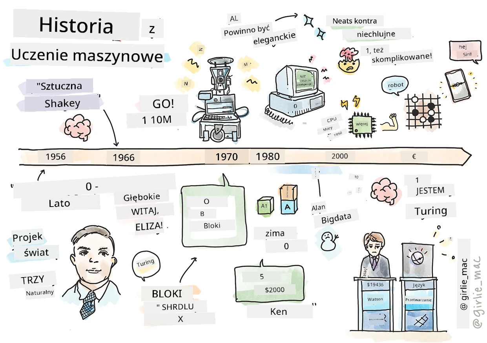
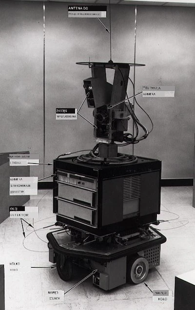
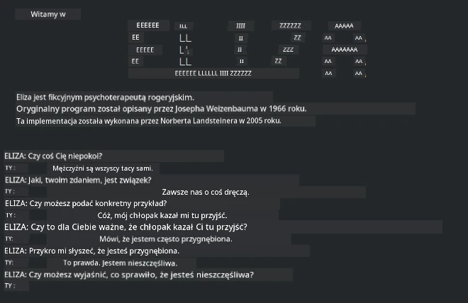

# Historia uczenia maszynowego

> Sketchnote autorstwa [Tomomi Imura](https://www.twitter.com/girlie_mac)

## [Quiz przed wykładem](https://ff-quizzes.netlify.app/en/ml/)

---

> 🎥 Kliknij powyższy obrazek, aby obejrzeć krótki film omawiający tę lekcję.

W tej lekcji przejdziemy przez najważniejsze kamienie milowe w historii uczenia maszynowego i sztucznej inteligencji.

Historia sztucznej inteligencji (SI) jako dziedziny jest spleciona z historią uczenia maszynowego, ponieważ algorytmy i postępy obliczeniowe, które stanowią podstawę ML, wpłynęły na rozwój SI. Warto pamiętać, że chociaż te dziedziny jako odrębne obszary badań zaczęły się krystalizować w latach 50. XX wieku, ważne [odkrycia algorytmiczne, statystyczne, matematyczne, obliczeniowe i techniczne](https://wikipedia.org/wiki/Timeline_of_machine_learning) poprzedzały i nakładały się na ten okres. W rzeczywistości ludzie zastanawiali się nad tymi zagadnieniami przez [setki lat](https://wikipedia.org/wiki/History_of_artificial_intelligence): ten artykuł omawia historyczne podstawy intelektualne idei „myślącej maszyny”.

---
## Znaczące odkrycia

- 1763, 1812 [Twierdzenie Bayesa](https://wikipedia.org/wiki/Bayes%27_theorem) i jego poprzednicy. To twierdzenie i jego zastosowania leżą u podstaw wnioskowania, opisując prawdopodobieństwo zajścia zdarzenia na podstawie wcześniejszej wiedzy.
- 1805 [Teoria najmniejszych kwadratów](https://wikipedia.org/wiki/Least_squares) autorstwa francuskiego matematyka Adriena-Marie Legendre’a. Teoria ta, którą poznasz w jednostce dotyczącej regresji, pomaga w dopasowywaniu danych.
- 1913 [Łańcuchy Markowa](https://wikipedia.org/wiki/Markov_chain), nazwane na cześć rosyjskiego matematyka Andrieja Markowa, służą do opisu sekwencji możliwych zdarzeń na podstawie poprzedniego stanu.
- 1957 [Perceptron](https://wikipedia.org/wiki/Perceptron) to typ klasyfikatora liniowego wynaleziony przez amerykańskiego psychologa Franka Rosenblatta, który leży u podstaw postępów w uczeniu głębokim.

---

- 1967 [Najbliższy sąsiad](https://wikipedia.org/wiki/Nearest_neighbor) to algorytm pierwotnie zaprojektowany do wyznaczania tras. W kontekście ML służy do wykrywania wzorców.
- 1970 [Wsteczna propagacja błędu](https://wikipedia.org/wiki/Backpropagation) jest używana do trenowania [sieci neuronowych typu feedforward](https://wikipedia.org/wiki/Feedforward_neural_network).
- 1982 [Rekurencyjne sieci neuronowe](https://wikipedia.org/wiki/Recurrent_neural_network) to sztuczne sieci neuronowe wywodzące się z sieci feedforward, które tworzą grafy czasowe.

✅ Zrób mały research. Jakie inne daty wyróżniają się jako przełomowe w historii ML i SI?

---
## 1950: Maszyny, które myślą

Alan Turing, naprawdę wyjątkowa postać, wybrana [przez opinię publiczną w 2019](https://wikipedia.org/wiki/Icons:_The_Greatest_Person_of_the_20th_Century) na największego naukowca XX wieku, jest uznawany za współtwórcę koncepcji „maszyny, która potrafi myśleć.” Zmagał się z niedowiarkami oraz potrzebą empirycznych dowodów na tę koncepcję, między innymi tworząc [Test Turinga](https://www.bbc.com/news/technology-18475646), który poznasz podczas naszych lekcji NLP.

---
## 1956: Letni projekt badawczy Dartmouth

„Letni projekt badawczy Dartmouth dotyczący sztucznej inteligencji był przełomowym wydarzeniem dla SI jako dziedziny” i to tutaj pojawił się termin „sztuczna inteligencja” ([źródło](https://250.dartmouth.edu/highlights/artificial-intelligence-ai-coined-dartmouth)).

> Każdy aspekt uczenia się lub innej cechy inteligencji może być zasadniczo tak precyzyjnie opisany, że można stworzyć maszynę, która będzie go symulować.

---

Główny badacz, prof. matematyki John McCarthy, miał nadzieję "postępować na podstawie przypuszczenia, że każdy aspekt uczenia się lub innej cechy inteligencji może być zasadniczo tak precyzyjnie opisany, że można stworzyć maszynę, która będzie go symulować." Wśród uczestników był również inny wybitny specjalista w tej dziedzinie, Marvin Minsky.

Warsztaty zapoczątkowały i zachęciły do wielu dyskusji, w tym o „wzroście metod symbolicznych, systemach skoncentrowanych na ograniczonych dziedzinach (wczesne systemy ekspertowe) oraz systemach dedukcyjnych vs indukcyjnych.” ([źródło](https://wikipedia.org/wiki/Dartmouth_workshop)).

---
## 1956 - 1974: „Złote lata”

Od lat 50. do połowy lat 70. panował duży optymizm, że SI może rozwiązać wiele problemów. W 1967 roku Marvin Minsky pewnie stwierdził, że „w ciągu pokolenia ... problem stworzenia ‚sztucznej inteligencji’ zostanie w dużej mierze rozwiązany.” (Minsky, Marvin (1967), Computation: Finite and Infinite Machines, Englewood Cliffs, N.J.: Prentice-Hall)

Rozwijały się badania nad przetwarzaniem języka naturalnego, ulepszano wyszukiwanie, a także powstała koncepcja „mikroświatów”, gdzie proste zadania były realizowane za pomocą jasnych instrukcji językowych.

---

Badania były dobrze finansowane przez agencje rządowe, dokonywano postępów w obliczeniach i algorytmach oraz budowano prototypy inteligentnych maszyn. Do takich maszyn należą:

* [Shakey robot](https://wikipedia.org/wiki/Shakey_the_robot), który potrafił manewrować i decydować, jak wykonywać zadania „inteligentnie”.

    
    > Shakey w 1972 roku

---

* Eliza, wczesny 'chatterbot', potrafiła rozmawiać z ludźmi i pełnić funkcję prymitywnego 'terapeuty'. Więcej o Elizie dowiesz się na lekcjach NLP.

    
    > Wersja Elizy, chatbot

---

* „Świat klocków” to przykład mikroświata, w którym klocki można było układać i sortować, a eksperymenty nad uczeniem maszyn podejmowania decyzji mogły być testowane. Postępy z bibliotekami takimi jak [SHRDLU](https://wikipedia.org/wiki/SHRDLU) pomogły przyspieszyć przetwarzanie języka.

    

    > 🎥 Kliknij powyższy obrazek, aby obejrzeć wideo: Świat klocków z SHRDLU

---
## 1974 - 1980: „Zima AI”

Pod koniec lat 70. stało się jasne, że złożoność tworzenia „inteligentnych maszyn” była niedoszacowana, a obietnice z uwzględnieniem dostępnej mocy obliczeniowej zostały przecenione. Finansowanie osłabło, a zaufanie do dziedziny osłabło. Do problemów wpływających na zaufanie należały:
---
- **Ograniczenia**. Moc obliczeniowa była zbyt ograniczona.
- **Eksplozja kombinatoryczna**. Ilość parametrów wymagających treningu rosła wykładniczo wraz z rosnącymi wymaganiami wobec komputerów, bez równoległego rozwoju mocy obliczeniowej i możliwości.
- **Niedobór danych**. Brakowało danych, co utrudniało testowanie, rozwijanie i ulepszanie algorytmów.
- **Czy zadajemy właściwe pytania?**. Pojawiły się wątpliwości co do samych pytań. Badacze musieli zmierzyć się z krytyką swoich podejść:
  - Testy Turinga były kwestionowane m.in. za pomocą teorii „chińskiego pokoju”, która zakładała, że „programowanie komputera cyfrowego może sprawiać wrażenie rozumienia języka, ale nie jest w stanie stworzyć prawdziwego zrozumienia.” ([źródło](https://plato.stanford.edu/entries/chinese-room/))
  - Wątpliwości budziły też kwestie etyczne dotyczące wprowadzenia do społeczeństwa sztucznych inteligencji jak „terapeuta” ELIZA.

---

W tym samym czasie zaczęły tworzyć się różne szkoły myślenia w AI. Ustalono dychotomię między podejściami ["niechlujnymi" a „precyzyjnymi AI”](https://wikipedia.org/wiki/Neats_and_scruffies). Laboratoria _niechlujne_ poprawiały programy godzinami, aż osiągały pożądane wyniki. Laboratoria _precyzyjne_ „koncentrowały się na logice i formalnym rozwiązywaniu problemów”. ELIZA i SHRDLU były znanymi systemami _niechlujnymi_. W latach 80., gdy pojawiło się zapotrzebowanie na systemy ML powtarzalne, stopniowo na pierwszy plan wysunęło się podejście _precyzyjne_, ponieważ jego wyniki były bardziej zrozumiałe.

---
## Eksperckie systemy lat 80.

Wraz ze wzrostem tej dziedziny stawało się jasne, jakie korzyści przynosi biznesowi, a w latach 80. rozprzestrzeniały się 'systemy ekspertowe'. „Systemy ekspertowe były jednymi z pierwszych naprawdę udanych form oprogramowania sztucznej inteligencji (SI).” ([źródło](https://wikipedia.org/wiki/Expert_system)).

Ten rodzaj systemów był tak naprawdę _hybrydowy_, składający się częściowo z silnika reguł definiujących wymagania biznesowe i silnika wnioskowania, który wykorzystywał system reguł do wyprowadzania nowych faktów.

W tej epoce przywiązywano również coraz większą uwagę do sieci neuronowych.

---
## 1987 - 1993: 'Chłód' AI

Rozprzestrzenianie się specjalistycznego sprzętu do systemów ekspertowych miało niekorzystny skutek – sprzęt stał się zbyt wyspecjalizowany. Wzrost popularności komputerów osobistych konkurował z tymi dużymi, wyspecjalizowanymi i scentralizowanymi systemami. Demokracja obliczeniowa się rozpoczęła i ostatecznie przygotowała grunt pod współczesną eksplozję big data.

---
## 1993 - 2011

Ta epoka przyniosła nową erę dla ML i SI, umożliwiającą rozwiązanie niektórych problemów powstałych wcześniej z powodu braku danych i mocy obliczeniowej. Ilość danych zaczęła szybko rosnąć i stawać się bardziej powszechnie dostępna, zarówno na dobre, jak i złe, szczególnie po pojawieniu się smartfona około 2007 roku. Moc obliczeniowa rosła wykładniczo, a algorytmy ewoluowały wraz z nią. Dziedzina zaczęła dojrzewać, gdy swobodne czasy z przeszłości zaczęły przekształcać się w prawdziwą dyscyplinę.

---
## Teraz

Dziś uczenie maszynowe i SI dotykają niemal każdej części naszego życia. Ta era wymaga uważnego zrozumienia ryzyk i potencjalnych skutków działania tych algorytmów na ludzkie życie. Jak stwierdził Brad Smith z Microsoftu, „Technologia informacyjna porusza kwestie sięgające sedna podstawowych praw człowieka, takich jak prywatność i wolność wypowiedzi. Te kwestie zwiększają odpowiedzialność firm technologicznych tworzących te produkty. Naszym zdaniem wymagają one także przemyślanej regulacji rządowej oraz rozwoju norm dotyczących akceptowalnych zastosowań” ([źródło](https://www.technologyreview.com/2019/12/18/102365/the-future-of-ais-impact-on-society/)).

---

Przyszłość pozostaje niepewna, ale ważne jest, aby zrozumieć te systemy komputerowe oraz oprogramowanie i algorytmy, które w nich działają. Mamy nadzieję, że ten program nauczania pomoże Ci lepiej to zrozumieć, abyś mógł samodzielnie podjąć decyzję.

> 🎥 Kliknij powyższy obrazek, aby obejrzeć film: Yann LeCun omawia historię uczenia głębokiego w tym wykładzie

---
## 🚀Wyzwanie

Zagłęb się w jeden z tych historycznych momentów i dowiedz się więcej o ludziach, którzy za nimi stoją. To fascynujące postacie, a żadnego odkrycia naukowego nie stworzono w próżni kulturowej. Co odkrywasz?

## [Quiz po wykładzie](https://ff-quizzes.netlify.app/en/ml/)

---
## Powtórka i samodzielna nauka

Oto materiały do obejrzenia i posłuchania:

[Podcast, w którym Amy Boyd omawia ewolucję SI](http://runasradio.com/Shows/Show/739)

---

## Zadanie

[Stwórz oś czasu](assignment.md)

---

<!-- CO-OP TRANSLATOR DISCLAIMER START -->
**Zastrzeżenie**:
Niniejszy dokument został przetłumaczony za pomocą usługi tłumaczenia AI [Co-op Translator](https://github.com/Azure/co-op-translator). Choć dążymy do dokładności, prosimy pamiętać, że automatyczne tłumaczenia mogą zawierać błędy lub niedokładności. Oryginalny dokument w jego języku źródłowym należy uznawać za autorytatywne źródło. W przypadku informacji krytycznych zalecane jest skorzystanie z profesjonalnego tłumaczenia wykonanego przez człowieka. Nie ponosimy odpowiedzialności za jakiekolwiek nieporozumienia lub błędne interpretacje wynikające z użycia tego tłumaczenia.
<!-- CO-OP TRANSLATOR DISCLAIMER END -->