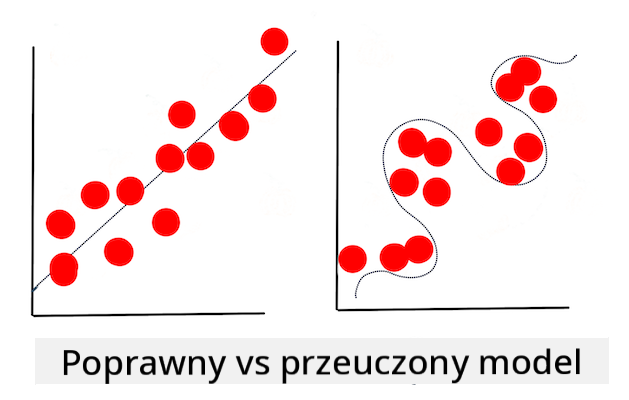

<!--
CO_OP_TRANSLATOR_METADATA:
{
  "original_hash": "dc4575225da159f2b06706e103ddba2a",
  "translation_date": "2025-09-03T17:42:15+00:00",
  "source_file": "1-Introduction/4-techniques-of-ML/README.md",
  "language_code": "pl"
}
-->
# Techniki uczenia maszynowego

Proces tworzenia, używania i utrzymywania modeli uczenia maszynowego oraz danych, które wykorzystują, różni się znacząco od wielu innych przepływów pracy w programowaniu. W tej lekcji rozwiejemy wątpliwości dotyczące tego procesu i przedstawimy główne techniki, które musisz znać. Dowiesz się:

- Jak zrozumieć procesy leżące u podstaw uczenia maszynowego na wysokim poziomie.
- Jak zgłębić podstawowe pojęcia, takie jak „modele”, „predykcje” i „dane treningowe”.

## [Quiz przed lekcją](https://gray-sand-07a10f403.1.azurestaticapps.net/quiz/7/)

> 🎥 Kliknij obrazek powyżej, aby obejrzeć krótki film omawiający tę lekcję.

## Wprowadzenie

Na wysokim poziomie, proces tworzenia systemów uczenia maszynowego (ML) składa się z kilku kroków:

1. **Określ pytanie**. Większość procesów ML zaczyna się od postawienia pytania, na które nie można odpowiedzieć za pomocą prostego programu warunkowego lub silnika opartego na regułach. Pytania te często dotyczą przewidywań opartych na zbiorze danych.
2. **Zbierz i przygotuj dane**. Aby móc odpowiedzieć na swoje pytanie, potrzebujesz danych. Jakość, a czasami ilość danych, będzie decydować o tym, jak dobrze możesz odpowiedzieć na swoje pytanie. Wizualizacja danych jest ważnym aspektem tego etapu. Ten etap obejmuje również podział danych na grupy treningowe i testowe w celu budowy modelu.
3. **Wybierz metodę treningu**. W zależności od pytania i charakteru danych musisz wybrać sposób, w jaki chcesz trenować model, aby najlepiej odzwierciedlał dane i dokonywał dokładnych przewidywań. To część procesu ML, która wymaga specjalistycznej wiedzy i często dużej ilości eksperymentów.
4. **Trenuj model**. Korzystając z danych treningowych, użyjesz różnych algorytmów, aby nauczyć model rozpoznawania wzorców w danych. Model może wykorzystywać wewnętrzne wagi, które można dostosować, aby preferować niektóre części danych nad innymi, co pozwala zbudować lepszy model.
5. **Oceń model**. Używasz danych, których model wcześniej nie widział (danych testowych), aby sprawdzić, jak model działa.
6. **Dostosowanie parametrów**. Na podstawie wyników modelu możesz powtórzyć proces, używając różnych parametrów lub zmiennych, które kontrolują zachowanie algorytmów używanych do trenowania modelu.
7. **Przewiduj**. Użyj nowych danych wejściowych, aby sprawdzić dokładność swojego modelu.

## Jakie pytanie zadać?

Komputery są szczególnie dobre w odkrywaniu ukrytych wzorców w danych. Ta umiejętność jest bardzo pomocna dla badaczy, którzy mają pytania dotyczące danego obszaru, na które nie można łatwo odpowiedzieć, tworząc silnik oparty na regułach warunkowych. Na przykład, w zadaniu aktuarialnym, data scientist może skonstruować ręcznie stworzone reguły dotyczące śmiertelności palaczy w porównaniu z niepalącymi.

Jednak gdy do równania wprowadza się wiele innych zmiennych, model ML może okazać się bardziej efektywny w przewidywaniu przyszłych wskaźników śmiertelności na podstawie historii zdrowotnej. Bardziej optymistycznym przykładem może być przewidywanie pogody na kwiecień w danej lokalizacji na podstawie danych takich jak szerokość geograficzna, długość geograficzna, zmiany klimatyczne, bliskość oceanu, wzorce prądów strumieniowych i inne.

✅ Ta [prezentacja](https://www2.cisl.ucar.edu/sites/default/files/2021-10/0900%20June%2024%20Haupt_0.pdf) na temat modeli pogodowych oferuje historyczną perspektywę wykorzystania ML w analizie pogody.  

## Zadania przed budową modelu

Przed rozpoczęciem budowy modelu musisz wykonać kilka zadań. Aby przetestować swoje pytanie i sformułować hipotezę na podstawie przewidywań modelu, musisz zidentyfikować i skonfigurować kilka elementów.

### Dane

Aby móc odpowiedzieć na swoje pytanie z jakąkolwiek pewnością, potrzebujesz odpowiedniej ilości danych właściwego typu. Na tym etapie musisz zrobić dwie rzeczy:

- **Zbierz dane**. Pamiętając o poprzedniej lekcji dotyczącej sprawiedliwości w analizie danych, zbieraj dane ostrożnie. Zwróć uwagę na źródła tych danych, wszelkie wrodzone uprzedzenia, które mogą mieć, i udokumentuj ich pochodzenie.
- **Przygotuj dane**. Proces przygotowania danych obejmuje kilka kroków. Możesz potrzebować zestawić dane i znormalizować je, jeśli pochodzą z różnych źródeł. Możesz poprawić jakość i ilość danych za pomocą różnych metod, takich jak konwersja ciągów znaków na liczby (jak robimy w [Klasteryzacji](../../5-Clustering/1-Visualize/README.md)). Możesz również wygenerować nowe dane na podstawie oryginalnych (jak robimy w [Klasyfikacji](../../4-Classification/1-Introduction/README.md)). Możesz wyczyścić i edytować dane (jak zrobimy przed lekcją o [Aplikacji Webowej](../../3-Web-App/README.md)). Na koniec możesz również je losowo uporządkować i przetasować, w zależności od technik treningowych.

✅ Po zebraniu i przetworzeniu danych, poświęć chwilę, aby sprawdzić, czy ich struktura pozwoli Ci odpowiedzieć na zamierzone pytanie. Może się okazać, że dane nie sprawdzą się w Twoim zadaniu, jak odkrywamy w naszych lekcjach o [Klasteryzacji](../../5-Clustering/1-Visualize/README.md)!

### Cechy i cel

[Cechy](https://www.datasciencecentral.com/profiles/blogs/an-introduction-to-variable-and-feature-selection) to mierzalne właściwości Twoich danych. W wielu zbiorach danych są one wyrażone jako nagłówki kolumn, takie jak „data”, „rozmiar” czy „kolor”. Zmienna cechy, zwykle reprezentowana jako `X` w kodzie, reprezentuje zmienną wejściową, która będzie używana do trenowania modelu.

Cel to rzecz, którą próbujesz przewidzieć. Cel, zwykle reprezentowany jako `y` w kodzie, odpowiada na pytanie, które próbujesz zadać swoim danym: w grudniu, jaki **kolor** dyni będzie najtańszy? W San Francisco, które dzielnice będą miały najlepsze **ceny** nieruchomości? Czasami cel jest również nazywany atrybutem etykiety.

### Wybór zmiennej cechy

🎓 **Wybór cech i ekstrakcja cech** Jak wybrać zmienną podczas budowy modelu? Prawdopodobnie przejdziesz proces wyboru cech lub ekstrakcji cech, aby wybrać odpowiednie zmienne dla najbardziej wydajnego modelu. Nie są to jednak te same procesy: „Ekstrakcja cech tworzy nowe cechy z funkcji oryginalnych cech, podczas gdy wybór cech zwraca podzbiór cech.” ([źródło](https://wikipedia.org/wiki/Feature_selection))

### Wizualizacja danych

Ważnym aspektem narzędzi data scientist jest możliwość wizualizacji danych za pomocą kilku doskonałych bibliotek, takich jak Seaborn czy MatPlotLib. Reprezentowanie danych wizualnie może pozwolić Ci odkryć ukryte korelacje, które możesz wykorzystać. Twoje wizualizacje mogą również pomóc Ci odkryć uprzedzenia lub niezrównoważone dane (jak odkrywamy w [Klasyfikacji](../../4-Classification/2-Classifiers-1/README.md)).

### Podział zbioru danych

Przed treningiem musisz podzielić swój zbiór danych na dwie lub więcej części o nierównych rozmiarach, które nadal dobrze reprezentują dane.

- **Trening**. Ta część zbioru danych jest dopasowana do Twojego modelu, aby go trenować. Ten zestaw stanowi większość oryginalnego zbioru danych.
- **Testowanie**. Zestaw testowy to niezależna grupa danych, często pochodząca z oryginalnych danych, którą używasz do potwierdzenia wydajności zbudowanego modelu.
- **Walidacja**. Zestaw walidacyjny to mniejsza niezależna grupa przykładów, którą używasz do dostrajania hiperparametrów modelu lub jego architektury, aby poprawić model. W zależności od rozmiaru danych i pytania, które zadajesz, możesz nie potrzebować budować tego trzeciego zestawu (jak zauważamy w [Prognozowaniu szeregów czasowych](../../7-TimeSeries/1-Introduction/README.md)).

## Budowa modelu

Korzystając z danych treningowych, Twoim celem jest zbudowanie modelu, czyli statystycznej reprezentacji danych, używając różnych algorytmów do jego **trenowania**. Trenowanie modelu pozwala mu na odkrywanie wzorców w danych, ich weryfikację oraz akceptację lub odrzucenie.

### Wybór metody treningu

W zależności od pytania i charakteru danych wybierzesz metodę treningu. Przeglądając [dokumentację Scikit-learn](https://scikit-learn.org/stable/user_guide.html) - której używamy w tym kursie - możesz odkryć wiele sposobów trenowania modelu. W zależności od doświadczenia możesz musieć wypróbować kilka różnych metod, aby zbudować najlepszy model. Prawdopodobnie przejdziesz proces, w którym data scientist oceniają wydajność modelu, podając mu dane, których wcześniej nie widział, sprawdzając dokładność, uprzedzenia i inne problemy obniżające jakość, oraz wybierając najbardziej odpowiednią metodę treningu dla danego zadania.

### Trenowanie modelu

Mając dane treningowe, jesteś gotowy, aby „dopasować” je do stworzenia modelu. Zauważysz, że w wielu bibliotekach ML znajdziesz kod „model.fit” - to właśnie wtedy przesyłasz zmienną cechy jako tablicę wartości (zwykle „X”) oraz zmienną celu (zwykle „y”).

### Ocena modelu

Po zakończeniu procesu treningu (może to zająć wiele iteracji, czyli „epok”, aby wytrenować duży model), będziesz mógł ocenić jakość modelu, używając danych testowych do oceny jego wydajności. Te dane są podzbiorem oryginalnych danych, których model wcześniej nie analizował. Możesz wydrukować tabelę metryk dotyczących jakości modelu.

🎓 **Dopasowanie modelu**

W kontekście uczenia maszynowego dopasowanie modelu odnosi się do dokładności funkcji modelu, gdy próbuje analizować dane, których nie zna.

🎓 **Niedopasowanie** i **przeuczenie** to częste problemy, które obniżają jakość modelu, ponieważ model dopasowuje się albo zbyt słabo, albo zbyt dobrze. Powoduje to, że model dokonuje przewidywań albo zbyt ściśle związanych, albo zbyt luźno związanych z danymi treningowymi. Model przeuczony przewiduje dane treningowe zbyt dobrze, ponieważ nauczył się zbyt dobrze szczegółów i szumów danych. Model niedopasowany nie jest dokładny, ponieważ nie potrafi ani dokładnie analizować danych treningowych, ani danych, których jeszcze nie „widział”.

> Infografika autorstwa [Jen Looper](https://twitter.com/jenlooper)

## Dostosowanie parametrów

Po zakończeniu początkowego treningu, obserwuj jakość modelu i rozważ jego poprawę poprzez dostosowanie „hiperparametrów”. Przeczytaj więcej o tym procesie [w dokumentacji](https://docs.microsoft.com/en-us/azure/machine-learning/how-to-tune-hyperparameters?WT.mc_id=academic-77952-leestott).

## Predykcja

To moment, w którym możesz użyć całkowicie nowych danych, aby przetestować dokładność swojego modelu. W „zastosowanym” środowisku ML, gdzie budujesz zasoby internetowe do użycia modelu w produkcji, proces ten może obejmować zbieranie danych od użytkownika (na przykład naciśnięcie przycisku), aby ustawić zmienną i przesłać ją do modelu w celu wnioskowania lub oceny.

W tych lekcjach odkryjesz, jak używać tych kroków do przygotowania, budowy, testowania, oceny i przewidywania - wszystkie gesty data scientist i więcej, w miarę jak postępujesz w swojej podróży, aby zostać „full stack” inżynierem ML.

---

## 🚀Wyzwanie

Narysuj diagram przepływu odzwierciedlający kroki praktyka ML. Gdzie widzisz siebie teraz w procesie? Gdzie przewidujesz, że napotkasz trudności? Co wydaje się łatwe?

## [Quiz po lekcji](https://gray-sand-07a10f403.1.azurestaticapps.net/quiz/8/)

## Przegląd i samodzielna nauka

Poszukaj w Internecie wywiadów z data scientistami, którzy opowiadają o swojej codziennej pracy. Oto [jeden](https://www.youtube.com/watch?v=Z3IjgbbCEfs).

## Zadanie

[Przeprowadź wywiad z data scientistem](assignment.md)

---

**Zastrzeżenie**:  
Ten dokument został przetłumaczony za pomocą usługi tłumaczenia AI [Co-op Translator](https://github.com/Azure/co-op-translator). Chociaż dokładamy wszelkich starań, aby zapewnić dokładność, prosimy pamiętać, że automatyczne tłumaczenia mogą zawierać błędy lub nieścisłości. Oryginalny dokument w jego języku źródłowym powinien być uznawany za wiarygodne źródło. W przypadku informacji o kluczowym znaczeniu zaleca się skorzystanie z profesjonalnego tłumaczenia przez człowieka. Nie ponosimy odpowiedzialności za jakiekolwiek nieporozumienia lub błędne interpretacje wynikające z korzystania z tego tłumaczenia.