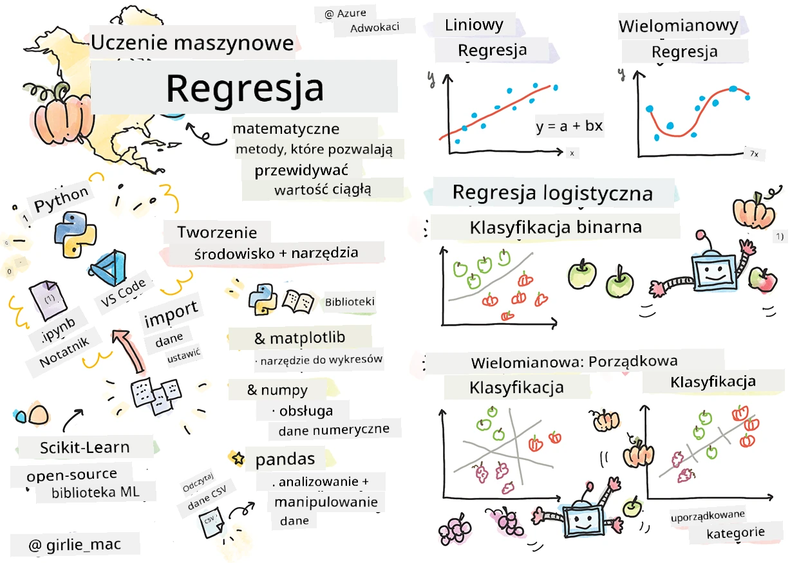
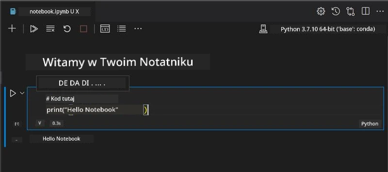
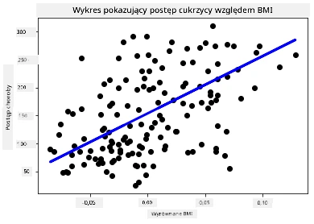

# Rozpocznij pracę z Pythonem i Scikit-learn dla modeli regresji



> Sketchnote autorstwa [Tomomi Imura](https://www.twitter.com/girlie_mac)

## [Quiz przed wykładem](https://ff-quizzes.netlify.app/en/ml/)

> ### [Ta lekcja dostępna jest w R!](../../../../2-Regression/1-Tools/solution/R/lesson_1.html)

## Wstęp

W tych czterech lekcjach odkryjesz, jak budować modele regresji. Wkrótce omówimy, do czego służą. Ale zanim zaczniesz, upewnij się, że masz odpowiednie narzędzia do rozpoczęcia pracy!

W tej lekcji nauczysz się:

- Konfigurować swój komputer do lokalnych zadań uczenia maszynowego.
- Pracować z Jupyter Notebooks.
- Używać Scikit-learn, w tym instalować tę bibliotekę.
- Eksplorować regresję liniową na praktycznym ćwiczeniu.

## Instalacje i konfiguracje

[](https://youtu.be/-DfeD2k2Kj0 "ML dla początkujących - Skonfiguruj swoje narzędzia do tworzenia modeli uczenia maszynowego")

> 🎥 Kliknij powyższy obraz, aby zobaczyć krótki film pokazujący konfigurację komputera do ML.

1. **Zainstaluj Pythona**. Upewnij się, że [Python](https://www.python.org/downloads/) jest zainstalowany na Twoim komputerze. Będziesz używać Pythona dla wielu zadań z zakresu analizy danych i uczenia maszynowego. Większość systemów komputerowych ma już zainstalowanego Pythona. Dostępne są również przydatne [Pakiety do Kodowania w Pythonie](https://code.visualstudio.com/learn/educators/installers?WT.mc_id=academic-77952-leestott), które ułatwiają konfigurację niektórym użytkownikom.

   Jednak niektóre zastosowania Pythona wymagają jednej wersji oprogramowania, a inne innej wersji. Dlatego warto pracować w ramach [środowiska wirtualnego](https://docs.python.org/3/library/venv.html).

2. **Zainstaluj Visual Studio Code**. Upewnij się, że masz zainstalowany Visual Studio Code na swoim komputerze. Postępuj zgodnie z instrukcjami, aby [zainstalować Visual Studio Code](https://code.visualstudio.com/) w podstawowej instalacji. Będziesz używać Pythona w Visual Studio Code podczas tego kursu, więc warto się także zapoznać z tym, jak [konfigurować Visual Studio Code](https://docs.microsoft.com/learn/modules/python-install-vscode?WT.mc_id=academic-77952-leestott) do pracy z Pythonem.

   > Zapoznaj się z Pythonem, realizując tę kolekcję [modułów nauki](https://docs.microsoft.com/users/jenlooper-2911/collections/mp1pagggd5qrq7?WT.mc_id=academic-77952-leestott)
   >
   > [](https://youtu.be/yyQM70vi7V8 "Konfiguracja Pythona w Visual Studio Code")
   >
   > 🎥 Kliknij powyższy obraz, aby zobaczyć film: używanie Pythona wewnątrz VS Code.

3. **Zainstaluj Scikit-learn**, postępując zgodnie z [tym instrukcjami](https://scikit-learn.org/stable/install.html). Ponieważ musisz mieć pewność, że używasz Pythona 3, zaleca się korzystanie ze środowiska wirtualnego. Uwaga, jeśli instalujesz tę bibliotekę na M1 Macu, są specjalne instrukcje na stronie powyżej.

1. **Zainstaluj Jupyter Notebook**. Będziesz musiał [zainstalować pakiet Jupyter](https://pypi.org/project/jupyter/).

## Twoje środowisko do pracy z ML

Będziesz używać **notebooków** do tworzenia kodu w Pythonie oraz tworzenia modeli uczenia maszynowego. Ten typ pliku jest popularnym narzędziem wśród analityków danych i można go rozpoznać po rozszerzeniu `.ipynb`.

Notebooki to interaktywne środowisko, które pozwala programiście zarówno pisać kod, jak i dodawać notatki oraz dokumentację wokół kodu, co jest bardzo przydatne w projektach eksperymentalnych lub badawczych.

[](https://youtu.be/7E-jC8FLA2E "ML dla początkujących - Konfiguracja Jupyter Notebooks do rozpoczęcia budowy modeli regresji")

> 🎥 Kliknij powyższy obraz, aby zobaczyć krótki film przedstawiający to ćwiczenie.

### Ćwiczenie - praca z notebookiem

W tym folderze znajdziesz plik _notebook.ipynb_.

1. Otwórz _notebook.ipynb_ w Visual Studio Code.

   Serwer Jupyter uruchomi się z Pythonem 3+. Znajdziesz obszary notebooka, które można `uruchomić`, fragmenty kodu. Możesz uruchomić blok kodu, wybierając ikonę wyglądającą jak przycisk odtwarzania.

1. Wybierz ikonę `md` i dodaj trochę markdown, wpisując następujący tekst **# Welcome to your notebook**.

   Następnie dodaj trochę kodu Python.

1. Wpisz **print('hello notebook')** w bloku kodu.
1. Wybierz strzałkę, aby uruchomić kod.

   Powinieneś zobaczyć wydrukowane zdanie:

    ```output
    hello notebook
    ```



Możesz przeplatać swój kod komentarzami, aby dokumentować notebook dla samego siebie.

✅ Pomyśl przez chwilę, jak bardzo różni się środowisko pracy web developera od środowiska naukowca danych.

## Uruchomienie Scikit-learn

Teraz, gdy Python jest skonfigurowany w Twoim lokalnym środowisku, a Ty czujesz się pewnie z Jupyter Notebooks, zaznajomimy się również ze Scikit-learn (wymowa `sci` jak w `science`). Scikit-learn dostarcza [obszerny API](https://scikit-learn.org/stable/modules/classes.html#api-ref), który pomoże Ci wykonywać zadania ML.

Według ich [strony internetowej](https://scikit-learn.org/stable/getting_started.html), „Scikit-learn jest otwartoźródłową biblioteką do uczenia maszynowego, która wspiera uczenie nadzorowane i nienadzorowane. Zapewnia także różnorodne narzędzia do dopasowywania modeli, przetwarzania wstępnego danych, wyboru modelu i ewaluacji oraz wiele innych użytecznych funkcji.”

W tym kursie będziesz korzystać ze Scikit-learn i innych narzędzi, aby budować modele uczenia maszynowego wykonujące tzw. „tradycyjne zadania uczenia maszynowego”. Świadomie uniknęliśmy sieci neuronowych i głębokiego uczenia, gdyż są one lepiej omówione w naszym nadchodzącym kursie „AI dla początkujących”.

Scikit-learn ułatwia tworzenie modeli i ocenianie ich do użytku. Skupia się przede wszystkim na danych liczbowych i zawiera kilka gotowych zbiorów danych służących jako narzędzia do nauki. Obejmuje także gotowe modele do wypróbowania przez uczniów. Najpierw przyjrzyjmy się procesowi ładowania gotowych danych i użycia wbudowanego estymatora, aby stworzyć pierwszy model ML w Scikit-learn z podstawowymi danymi.

## Ćwiczenie - Twój pierwszy notatnik Scikit-learn

> Ten samouczek był inspirowany [przykładem regresji liniowej](https://scikit-learn.org/stable/auto_examples/linear_model/plot_ols.html#sphx-glr-auto-examples-linear-model-plot-ols-py) na stronie Scikit-learn.


[](https://youtu.be/2xkXL5EUpS0 "ML dla początkujących - Twój pierwszy projekt regresji liniowej w Pythonie")

> 🎥 Kliknij powyższy obraz, aby zobaczyć krótki film przedstawiający to ćwiczenie.

W pliku _notebook.ipynb_ powiązanym z tą lekcją wyczyść wszystkie komórki, klikając ikonę „kosza”.

W tej sekcji będziesz pracować z małym zbiorem danych o cukrzycy, który jest wbudowany w Scikit-learn do celów edukacyjnych. Wyobraź sobie, że chcesz przetestować leczenie dla pacjentów z cukrzycą. Modele uczenia maszynowego mogą pomóc ustalić, którzy pacjenci lepiej zareagują na leczenie na podstawie kombinacji różnych zmiennych. Nawet bardzo prosty model regresji, gdy zostanie zwizualizowany, może dostarczyć informacji o zmiennych, które pomogą Ci zorganizować teoretyczne badania kliniczne.

✅ Istnieje wiele typów metod regresji, a wybór zależy od pytania, na które chcesz odpowiedzieć. Jeśli chcesz przewidzieć prawdopodobny wzrost osoby w danym wieku, użyjesz regresji liniowej, ponieważ szukasz **wartości liczbowej**. Jeśli natomiast chcesz odkryć, czy dany typ kuchni powinien być uznany za wegański, szukasz **przypisania do kategorii**, więc użyjesz regresji logistycznej. O regresji logistycznej dowiesz się więcej później. Pomyśl trochę o pytaniach, które możesz zadać danym, i która z tych metod byłaby odpowiednia.

Zaczynajmy zadanie.

### Import bibliotek

Do tego zadania zaimportujemy kilka bibliotek:

- **matplotlib**. To przydatne [narzędzie do tworzenia wykresów](https://matplotlib.org/), którego użyjemy do narysowania wykresu liniowego.
- **numpy**. [numpy](https://numpy.org/doc/stable/user/whatisnumpy.html) to przydatna biblioteka do obsługi danych liczbowych w Pythonie.
- **sklearn**. To biblioteka [Scikit-learn](https://scikit-learn.org/stable/user_guide.html).

Zaimportuj biblioteki, które pomogą Ci w zadaniach.

1. Dodaj importy, wpisując następujący kod:

   ```python
   import matplotlib.pyplot as plt
   import numpy as np
   from sklearn import datasets, linear_model, model_selection
   ```

   Powyżej importujesz skróty `matplotlib`, `numpy` oraz importujesz `datasets`, `linear_model` i `model_selection` z `sklearn`. `model_selection` służy do dzielenia danych na zestawy treningowe i testowe.

### Zbiór danych o cukrzycy

Wbudowany [zbiór danych o cukrzycy](https://scikit-learn.org/stable/datasets/toy_dataset.html#diabetes-dataset) zawiera 442 próbki danych dotyczących cukrzycy, z 10 zmiennymi cechowymi, z których niektóre to:

- wiek: wiek w latach
- bmi: wskaźnik masy ciała
- bp: średnie ciśnienie krwi
- s1 tc: limfocyty T (rodzaj białych krwinek)

✅ Ten zbiór danych zawiera koncepcję „płci” jako zmiennej cechowej istotnej dla badań nad cukrzycą. Wiele medycznych zbiorów danych zawiera tego rodzaju binarną klasyfikację. Przemyśl, jak takie kategoryzacje mogą wykluczać pewne części populacji z leczenia.

Teraz załaduj dane X i y.

> 🎓 Pamiętaj, że to uczenie nadzorowane i potrzebujemy nazwanej zmiennej celowej 'y'.

W nowej komórce kodu załaduj zbiór danych o cukrzycy, wywołując `load_diabetes()`. Parametr `return_X_y=True` sygnalizuje, że `X` będzie macierzą danych, a `y` docelową zmienną regresji.

1. Dodaj polecenia print, aby pokazać kształt macierzy danych i jej pierwszy element:

    ```python
    X, y = datasets.load_diabetes(return_X_y=True)
    print(X.shape)
    print(X[0])
    ```

    To, co otrzymujesz jako odpowiedź, to krotka. Przypisujesz dwie pierwsze wartości krotki do `X` oraz `y`. Dowiedz się więcej [o krotkach](https://wikipedia.org/wiki/Tuple).

    Widać, że dane zawierają 442 elementy uformowane w tablice po 10 elementów:

    ```text
    (442, 10)
    [ 0.03807591  0.05068012  0.06169621  0.02187235 -0.0442235  -0.03482076
    -0.04340085 -0.00259226  0.01990842 -0.01764613]
    ```

    ✅ Pomyśl trochę o relacji między danymi a celem regresji. Regresja liniowa przewiduje zależności między cechą X a zmienną docelową y. Czy w dokumentacji możesz znaleźć [cel](https://scikit-learn.org/stable/datasets/toy_dataset.html#diabetes-dataset) dla zbioru danych o cukrzycy? Co ten zbiór danych pokazuje, biorąc pod uwagę ten cel?

2. Następnie wybierz część tego zbioru do wykreślenia, wybierając 3 kolumnę zbioru. Możesz to zrobić, używając operatora `:`, aby wybrać wszystkie wiersze, a następnie wybierając 3 kolumnę za pomocą indeksu (2). Możesz również przekształcić dane w tablicę 2D — wymaganą do wykresu — używając `reshape(n_rows, n_columns)`. Jeśli jeden z parametrów to -1, odpowiadający mu wymiar jest obliczany automatycznie.

   ```python
   X = X[:, 2]
   X = X.reshape((-1,1))
   ```

   ✅ W każdym momencie wypisz dane, aby sprawdzić ich kształt.

3. Teraz, gdy masz dane gotowe do wykresu, sprawdź, czy maszyna może pomóc ustalić logiczny podział między liczbami w tym zbiorze. Aby to zrobić, musisz podzielić zarówno dane (X), jak i cel (y) na zestawy testowe i treningowe. Scikit-learn ma prosty sposób na to — możesz podzielić dane testowe w wyznaczonym punkcie.

   ```python
   X_train, X_test, y_train, y_test = model_selection.train_test_split(X, y, test_size=0.33)
   ```

4. Teraz jesteś gotowy, aby wytrenować swój model! Załaduj model regresji liniowej i wytrenuj go na swoich zestawach treningowych X i y przy użyciu `model.fit()`:

    ```python
    model = linear_model.LinearRegression()
    model.fit(X_train, y_train)
    ```

    ✅ `model.fit()` to funkcja, którą zobaczysz w wielu bibliotekach ML, np. w TensorFlow

5. Następnie wykonaj predykcję za pomocą danych testowych, używając funkcji `predict()`. To posłuży do narysowania linii między grupami danych

    ```python
    y_pred = model.predict(X_test)
    ```

6. Teraz czas pokazać dane na wykresie. Matplotlib jest bardzo przydatnym narzędziem do tego zadania. Stwórz wykres punktowy wszystkich danych testowych X i y, a następnie użyj predykcji, aby narysować linię w najbardziej odpowiednim miejscu, między grupami danych modelu.

    ```python
    plt.scatter(X_test, y_test,  color='black')
    plt.plot(X_test, y_pred, color='blue', linewidth=3)
    plt.xlabel('Scaled BMIs')
    plt.ylabel('Disease Progression')
    plt.title('A Graph Plot Showing Diabetes Progression Against BMI')
    plt.show()
    ```

   


   ✅ Pomyśl trochę o tym, co się tutaj dzieje. Prosta linia przebiega przez wiele małych punktów danych, ale co dokładnie robi? Czy widzisz, jak powinieneś móc użyć tej linii, aby przewidzieć, gdzie nowy, niewidziany punkt danych powinien się znaleźć w odniesieniu do osi y wykresu? Spróbuj opisać praktyczne zastosowanie tego modelu.

Gratulacje, zbudowałeś swój pierwszy model regresji liniowej, utworzyłeś na jego podstawie predykcję i wyświetliłeś ją na wykresie!

---
## 🚀Wyzwanie

Wykreśl inną zmienną z tego zbioru danych. Podpowiedź: zmodyfikuj tę linię: `X = X[:,2]`. Biorąc pod uwagę cel tego zbioru danych, co możesz odkryć na temat postępu cukrzycy jako choroby?
## [Quiz po wykładzie](https://ff-quizzes.netlify.app/en/ml/)

## Przegląd i samodzielna nauka

W tym samouczku pracowałeś z prostą regresją liniową, a nie z jednoliniową lub wieloliniową regresją liniową. Przeczytaj trochę o różnicach między tymi metodami lub obejrzyj [ten film](https://www.coursera.org/lecture/quantifying-relationships-regression-models/linear-vs-nonlinear-categorical-variables-ai2Ef)

Przeczytaj więcej na temat pojęcia regresji i zastanów się, na jakie pytania można odpowiedzieć za pomocą tej techniki. Skorzystaj z tego [samouczka](https://docs.microsoft.com/learn/modules/train-evaluate-regression-models?WT.mc_id=academic-77952-leestott), aby pogłębić swoją wiedzę.

## Zadanie

[Inny zbiór danych](assignment.md)

---

<!-- CO-OP TRANSLATOR DISCLAIMER START -->
**Zastrzeżenie**:
Niniejszy dokument został przetłumaczony za pomocą usługi tłumaczenia AI [Co-op Translator](https://github.com/Azure/co-op-translator). Choć dążymy do dokładności, prosimy pamiętać, że automatyczne tłumaczenia mogą zawierać błędy lub niedokładności. Oryginalny dokument w jego języku źródłowym należy uznawać za autorytatywne źródło. W przypadku informacji krytycznych zalecane jest skorzystanie z profesjonalnego tłumaczenia wykonanego przez człowieka. Nie ponosimy odpowiedzialności za jakiekolwiek nieporozumienia lub błędne interpretacje wynikające z użycia tego tłumaczenia.
<!-- CO-OP TRANSLATOR DISCLAIMER END -->