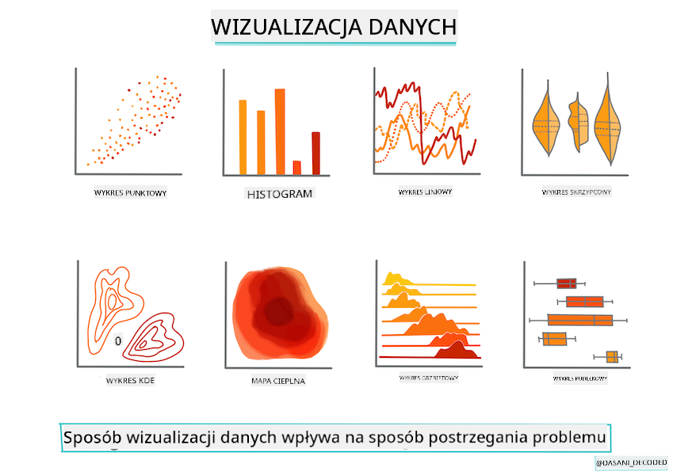
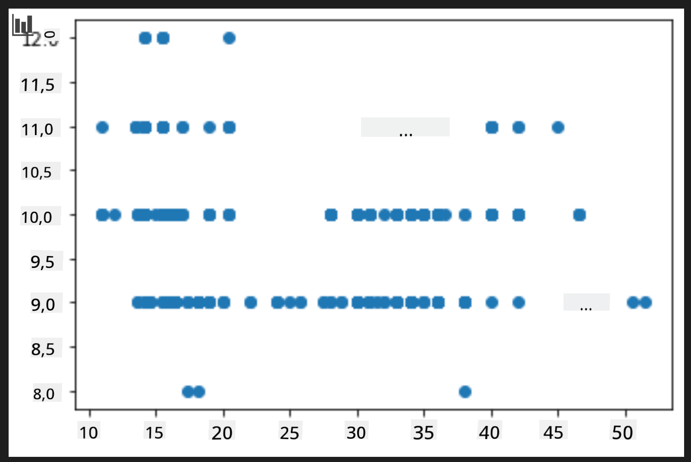
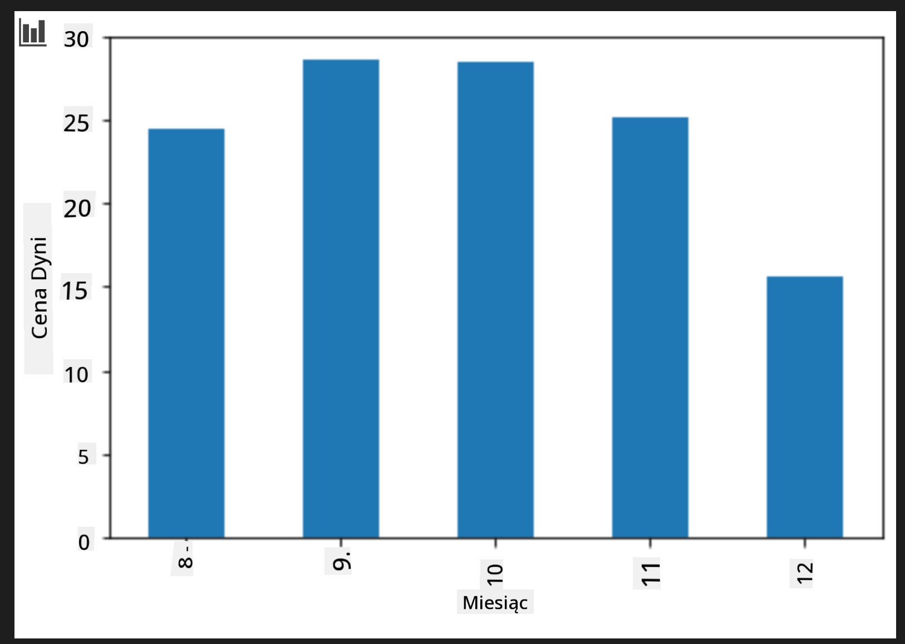

<!--
CO_OP_TRANSLATOR_METADATA:
{
  "original_hash": "a683e1fe430bb0d4a10b68f6ca15e0a6",
  "translation_date": "2025-09-03T16:42:06+00:00",
  "source_file": "2-Regression/2-Data/README.md",
  "language_code": "pl"
}
-->
# Budowanie modelu regresji za pomocą Scikit-learn: przygotowanie i wizualizacja danych



Infografika autorstwa [Dasani Madipalli](https://twitter.com/dasani_decoded)

## [Quiz przed wykładem](https://gray-sand-07a10f403.1.azurestaticapps.net/quiz/11/)

> ### [Ta lekcja jest dostępna w R!](../../../../2-Regression/2-Data/solution/R/lesson_2.html)

## Wprowadzenie

Teraz, gdy masz już narzędzia potrzebne do rozpoczęcia budowania modeli uczenia maszynowego za pomocą Scikit-learn, możesz zacząć zadawać pytania dotyczące swoich danych. Pracując z danymi i stosując rozwiązania ML, bardzo ważne jest, aby umieć zadawać właściwe pytania, które pozwolą w pełni wykorzystać potencjał Twojego zestawu danych.

W tej lekcji dowiesz się:

- Jak przygotować dane do budowy modelu.
- Jak używać Matplotlib do wizualizacji danych.

## Zadawanie właściwych pytań dotyczących danych

Pytanie, na które chcesz uzyskać odpowiedź, określi, jakiego rodzaju algorytmy ML będziesz wykorzystywać. Jakość odpowiedzi, którą otrzymasz, będzie w dużej mierze zależała od charakteru Twoich danych.

Spójrz na [dane](https://github.com/microsoft/ML-For-Beginners/blob/main/2-Regression/data/US-pumpkins.csv) udostępnione w tej lekcji. Możesz otworzyć ten plik .csv w VS Code. Szybki rzut oka pokazuje, że są tam puste pola oraz mieszanka ciągów znaków i danych numerycznych. Jest też dziwna kolumna o nazwie 'Package', w której dane to mieszanka wartości takich jak 'sacks', 'bins' i inne. Dane są, mówiąc wprost, dość chaotyczne.

[](https://youtu.be/5qGjczWTrDQ "ML dla początkujących - Jak analizować i czyścić zestaw danych")

> 🎥 Kliknij obrazek powyżej, aby obejrzeć krótki film o przygotowywaniu danych do tej lekcji.

W rzeczywistości rzadko zdarza się, aby otrzymać zestaw danych, który jest całkowicie gotowy do użycia w celu stworzenia modelu ML od razu. W tej lekcji nauczysz się, jak przygotować surowy zestaw danych za pomocą standardowych bibliotek Pythona. Nauczysz się również różnych technik wizualizacji danych.

## Studium przypadku: 'rynek dyni'

W tym folderze znajdziesz plik .csv w głównym folderze `data` o nazwie [US-pumpkins.csv](https://github.com/microsoft/ML-For-Beginners/blob/main/2-Regression/data/US-pumpkins.csv), który zawiera 1757 wierszy danych dotyczących rynku dyni, pogrupowanych według miast. Są to surowe dane wyciągnięte z [Specialty Crops Terminal Markets Standard Reports](https://www.marketnews.usda.gov/mnp/fv-report-config-step1?type=termPrice) udostępnianych przez Departament Rolnictwa Stanów Zjednoczonych.

### Przygotowanie danych

Te dane są w domenie publicznej. Można je pobrać w wielu oddzielnych plikach, dla każdego miasta, ze strony internetowej USDA. Aby uniknąć zbyt wielu oddzielnych plików, połączyliśmy wszystkie dane miejskie w jeden arkusz kalkulacyjny, więc dane zostały już _trochę_ przygotowane. Teraz przyjrzyjmy się bliżej tym danym.

### Dane o dyniach - wstępne wnioski

Co zauważasz w tych danych? Już widzisz, że jest tam mieszanka ciągów znaków, liczb, pustych pól i dziwnych wartości, które trzeba zrozumieć.

Jakie pytanie możesz zadać tym danym, używając techniki regresji? Na przykład: "Przewidzieć cenę dyni na sprzedaż w danym miesiącu". Patrząc ponownie na dane, widzisz, że trzeba wprowadzić pewne zmiany, aby stworzyć strukturę danych potrzebną do realizacji tego zadania.

## Ćwiczenie - analiza danych o dyniach

Użyjmy [Pandas](https://pandas.pydata.org/) (nazwa pochodzi od `Python Data Analysis`), narzędzia bardzo przydatnego do kształtowania danych, aby przeanalizować i przygotować dane o dyniach.

### Najpierw sprawdź brakujące daty

Najpierw musisz podjąć kroki, aby sprawdzić brakujące daty:

1. Przekształć daty na format miesiąca (są to daty w formacie amerykańskim, więc format to `MM/DD/YYYY`).
2. Wyodrębnij miesiąc do nowej kolumny.

Otwórz plik _notebook.ipynb_ w Visual Studio Code i zaimportuj arkusz kalkulacyjny do nowej ramki danych Pandas.

1. Użyj funkcji `head()`, aby zobaczyć pierwsze pięć wierszy.

    ```python
    import pandas as pd
    pumpkins = pd.read_csv('../data/US-pumpkins.csv')
    pumpkins.head()
    ```

    ✅ Jakiej funkcji użyłbyś, aby zobaczyć ostatnie pięć wierszy?

1. Sprawdź, czy w obecnej ramce danych są brakujące dane:

    ```python
    pumpkins.isnull().sum()
    ```

    Są brakujące dane, ale może nie będą miały znaczenia dla realizowanego zadania.

1. Aby ułatwić pracę z ramką danych, wybierz tylko potrzebne kolumny, używając funkcji `loc`, która wyodrębnia z oryginalnej ramki danych grupę wierszy (przekazanych jako pierwszy parametr) i kolumn (przekazanych jako drugi parametr). Wyrażenie `:` w poniższym przypadku oznacza "wszystkie wiersze".

    ```python
    columns_to_select = ['Package', 'Low Price', 'High Price', 'Date']
    pumpkins = pumpkins.loc[:, columns_to_select]
    ```

### Następnie określ średnią cenę dyni

Zastanów się, jak określić średnią cenę dyni w danym miesiącu. Jakie kolumny wybrałbyś do tego zadania? Podpowiedź: będziesz potrzebować 3 kolumn.

Rozwiązanie: oblicz średnią z kolumn `Low Price` i `High Price`, aby wypełnić nową kolumnę Price, i przekształć kolumnę Date tak, aby pokazywała tylko miesiąc. Na szczęście, zgodnie z powyższym sprawdzeniem, nie ma brakujących danych dotyczących dat ani cen.

1. Aby obliczyć średnią, dodaj następujący kod:

    ```python
    price = (pumpkins['Low Price'] + pumpkins['High Price']) / 2

    month = pd.DatetimeIndex(pumpkins['Date']).month

    ```

   ✅ Możesz wydrukować dowolne dane, które chcesz sprawdzić, używając `print(month)`.

2. Teraz skopiuj przekształcone dane do nowej ramki danych Pandas:

    ```python
    new_pumpkins = pd.DataFrame({'Month': month, 'Package': pumpkins['Package'], 'Low Price': pumpkins['Low Price'],'High Price': pumpkins['High Price'], 'Price': price})
    ```

    Wyświetlenie ramki danych pokaże czysty, uporządkowany zestaw danych, na którym możesz zbudować nowy model regresji.

### Ale chwila! Jest tu coś dziwnego

Jeśli spojrzysz na kolumnę `Package`, dynie są sprzedawane w różnych konfiguracjach. Niektóre są sprzedawane w miarach '1 1/9 bushel', inne w '1/2 bushel', niektóre na sztuki, inne na funty, a jeszcze inne w dużych pudełkach o różnych szerokościach.

> Dynie wydają się bardzo trudne do ważenia w sposób spójny

Zaglądając do oryginalnych danych, interesujące jest to, że wszystko, co ma `Unit of Sale` równe 'EACH' lub 'PER BIN', ma również typ `Package` na cal, na pojemnik lub 'each'. Dynie wydają się bardzo trudne do ważenia w sposób spójny, więc przefiltruj je, wybierając tylko dynie z ciągiem 'bushel' w kolumnie `Package`.

1. Dodaj filtr na początku pliku, pod początkowym importem .csv:

    ```python
    pumpkins = pumpkins[pumpkins['Package'].str.contains('bushel', case=True, regex=True)]
    ```

    Jeśli teraz wydrukujesz dane, zobaczysz, że masz tylko około 415 wierszy danych zawierających dynie sprzedawane na buszel.

### Ale chwila! Jest jeszcze jedna rzecz do zrobienia

Czy zauważyłeś, że ilość buszli różni się w zależności od wiersza? Musisz znormalizować ceny, aby pokazać ceny na buszel, więc wykonaj kilka obliczeń, aby je ujednolicić.

1. Dodaj te linie po bloku tworzącym ramkę danych new_pumpkins:

    ```python
    new_pumpkins.loc[new_pumpkins['Package'].str.contains('1 1/9'), 'Price'] = price/(1 + 1/9)

    new_pumpkins.loc[new_pumpkins['Package'].str.contains('1/2'), 'Price'] = price/(1/2)
    ```

✅ Według [The Spruce Eats](https://www.thespruceeats.com/how-much-is-a-bushel-1389308), waga buszla zależy od rodzaju produktu, ponieważ jest to miara objętości. "Buszel pomidorów, na przykład, powinien ważyć 56 funtów... Liście i zielenina zajmują więcej miejsca przy mniejszej wadze, więc buszel szpinaku to tylko 20 funtów." To wszystko jest dość skomplikowane! Nie przejmujmy się konwersją buszla na funty i zamiast tego wyceniajmy na buszel. Całe to badanie buszli dyni pokazuje jednak, jak bardzo ważne jest zrozumienie natury swoich danych!

Teraz możesz analizować ceny na jednostkę w oparciu o ich miarę buszla. Jeśli wydrukujesz dane jeszcze raz, zobaczysz, jak zostały ujednolicone.

✅ Czy zauważyłeś, że dynie sprzedawane na pół buszla są bardzo drogie? Czy potrafisz wyjaśnić dlaczego? Podpowiedź: małe dynie są znacznie droższe niż duże, prawdopodobnie dlatego, że jest ich znacznie więcej na buszel, biorąc pod uwagę niewykorzystaną przestrzeń zajmowaną przez jedną dużą pustą dynię na ciasto.

## Strategie wizualizacji

Częścią roli naukowca danych jest demonstrowanie jakości i charakteru danych, z którymi pracuje. Aby to zrobić, często tworzą interesujące wizualizacje, takie jak wykresy punktowe, wykresy słupkowe i diagramy, pokazujące różne aspekty danych. W ten sposób mogą wizualnie pokazać relacje i luki, które w innym przypadku są trudne do odkrycia.

[](https://youtu.be/SbUkxH6IJo0 "ML dla początkujących - Jak wizualizować dane za pomocą Matplotlib")

> 🎥 Kliknij obrazek powyżej, aby obejrzeć krótki film o wizualizacji danych do tej lekcji.

Wizualizacje mogą również pomóc w określeniu techniki uczenia maszynowego najbardziej odpowiedniej dla danych. Wykres punktowy, który wydaje się podążać za linią, na przykład, wskazuje, że dane są dobrym kandydatem do ćwiczenia regresji liniowej.

Jedna z bibliotek wizualizacji danych, która dobrze działa w notatnikach Jupyter, to [Matplotlib](https://matplotlib.org/) (której używałeś również w poprzedniej lekcji).

> Zdobądź więcej doświadczenia w wizualizacji danych w [tych samouczkach](https://docs.microsoft.com/learn/modules/explore-analyze-data-with-python?WT.mc_id=academic-77952-leestott).

## Ćwiczenie - eksperymentowanie z Matplotlib

Spróbuj stworzyć kilka podstawowych wykresów, aby wyświetlić nową ramkę danych, którą właśnie stworzyłeś. Co pokaże podstawowy wykres liniowy?

1. Zaimportuj Matplotlib na początku pliku, pod importem Pandas:

    ```python
    import matplotlib.pyplot as plt
    ```

1. Uruchom ponownie cały notatnik, aby odświeżyć.
1. Na dole notatnika dodaj komórkę, aby wykreślić dane jako wykres pudełkowy:

    ```python
    price = new_pumpkins.Price
    month = new_pumpkins.Month
    plt.scatter(price, month)
    plt.show()
    ```

    

    Czy ten wykres jest użyteczny? Czy coś Cię w nim zaskakuje?

    Nie jest szczególnie użyteczny, ponieważ jedynie pokazuje dane jako rozkład punktów w danym miesiącu.

### Uczyń go użytecznym

Aby wykresy pokazywały użyteczne dane, zazwyczaj trzeba jakoś pogrupować dane. Spróbujmy stworzyć wykres, na którym oś y pokazuje miesiące, a dane przedstawiają rozkład danych.

1. Dodaj komórkę, aby stworzyć grupowany wykres słupkowy:

    ```python
    new_pumpkins.groupby(['Month'])['Price'].mean().plot(kind='bar')
    plt.ylabel("Pumpkin Price")
    ```

    

    To jest bardziej użyteczna wizualizacja danych! Wydaje się wskazywać, że najwyższa cena dyni występuje we wrześniu i październiku. Czy to odpowiada Twoim oczekiwaniom? Dlaczego tak lub dlaczego nie?

---

## 🚀Wyzwanie

Zbadaj różne typy wizualizacji, które oferuje Matplotlib. Które typy są najbardziej odpowiednie dla problemów regresji?

## [Quiz po wykładzie](https://gray-sand-07a10f403.1.azurestaticapps.net/quiz/12/)

## Przegląd i samodzielna nauka

Przyjrzyj się różnym sposobom wizualizacji danych. Sporządź listę różnych dostępnych bibliotek i zanotuj, które są najlepsze dla określonych typów zadań, na przykład wizualizacji 2D vs. wizualizacji 3D. Co odkrywasz?

## Zadanie

[Eksploracja wizualizacji](assignment.md)

---

**Zastrzeżenie**:  
Ten dokument został przetłumaczony za pomocą usługi tłumaczeniowej AI [Co-op Translator](https://github.com/Azure/co-op-translator). Chociaż dokładamy wszelkich starań, aby tłumaczenie było precyzyjne, prosimy pamiętać, że automatyczne tłumaczenia mogą zawierać błędy lub nieścisłości. Oryginalny dokument w jego rodzimym języku powinien być uznawany za autorytatywne źródło. W przypadku informacji o kluczowym znaczeniu zaleca się skorzystanie z profesjonalnego tłumaczenia wykonanego przez człowieka. Nie ponosimy odpowiedzialności za jakiekolwiek nieporozumienia lub błędne interpretacje wynikające z użycia tego tłumaczenia.