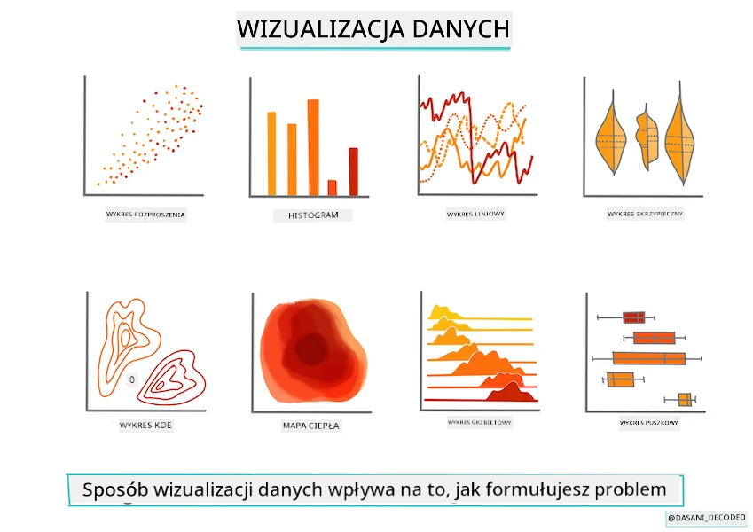
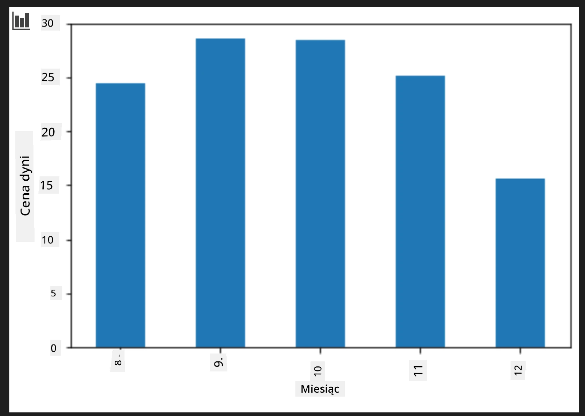
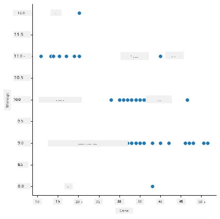
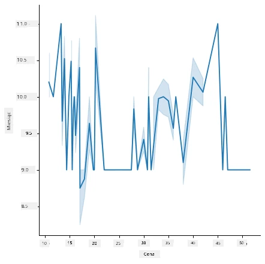
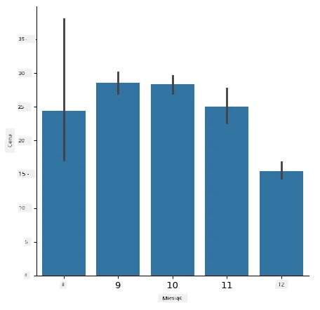
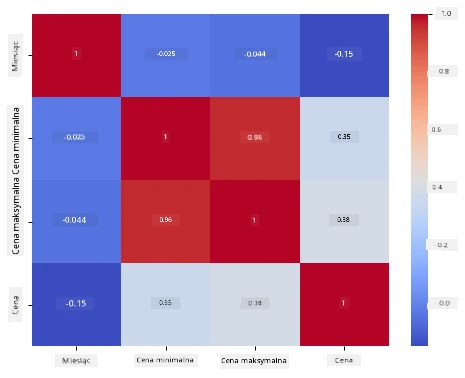

# Budowanie modelu regresji za pomocą Scikit-learn: przygotowanie i wizualizacja danych



Infografika autorstwa [Dasani Madipalli](https://twitter.com/dasani_decoded)

## [Quiz przed wykładem](https://ff-quizzes.netlify.app/en/ml/)

> ### [Ta lekcja jest dostępna w R!](../../../../2-Regression/2-Data/solution/R/lesson_2.html)

## Wprowadzenie

Gdy masz już skonfigurowane narzędzia potrzebne do rozpoczęcia budowy modeli uczenia maszynowego za pomocą Scikit-learn, możesz zacząć zadawać pytania swoim danym. Pracując z danymi i stosując rozwiązania ML, bardzo ważne jest, aby wiedzieć, jak zadać właściwe pytanie, by odpowiednio wykorzystać potencjał swojego zbioru danych.

W tej lekcji nauczysz się:

- Jak przygotować dane do budowy modelu.
- Jak używać Matplotlib do wizualizacji danych.
- Jak korzystać z Seaborn do bardziej wyrazistej wizualizacji danych.

## Zadawanie właściwego pytania swoim danym

Pytanie, na które potrzebujesz odpowiedzi, określi, jakiego typu algorytmy ML wykorzystasz. A jakość uzyskanej odpowiedzi będzie w dużej mierze zależała od natury twoich danych.

Spójrz na [dane](https://github.com/microsoft/ML-For-Beginners/blob/main/2-Regression/data/US-pumpkins.csv) udostępnione do tej lekcji. Możesz otworzyć ten plik .csv w VS Code. Szybkie przejrzenie pokazuje natychmiast, że są tam puste miejsca oraz mieszanka danych tekstowych i numerycznych. Jest też dziwna kolumna o nazwie 'Package', gdzie dane to mieszanka 'sacks', 'bins' oraz innych wartości. Dane są w rzeczywistości dość nieuporządkowane.

[](https://youtu.be/5qGjczWTrDQ "ML dla początkujących - Jak analizować i czyścić zbiór danych")

> 🎥 Kliknij powyższy obraz, aby obejrzeć krótki film pokazujący przygotowanie danych do tej lekcji.

W rzeczywistości nie jest często tak, że otrzymujesz dane całkowicie gotowe do użycia od razu do stworzenia modelu ML. W tej lekcji nauczysz się, jak przygotować surowy zbiór danych przy użyciu standardowych bibliotek Pythona. Nauczysz się także różnych technik wizualizacji danych.

## Studium przypadku: 'rynek dyni'

W tym folderze znajdziesz plik .csv w głównym folderze `data` o nazwie [US-pumpkins.csv](https://github.com/microsoft/ML-For-Beginners/blob/main/2-Regression/data/US-pumpkins.csv), który zawiera 1757 linii danych dotyczących rynku dyni, posegregowanych według miast. Są to surowe dane wyodrębnione z [Standardowych raportów z terminali rynków specjalistycznych upraw](https://www.marketnews.usda.gov/mnp/fv-report-config-step1?type=termPrice) dystrybuowanych przez Departament Rolnictwa Stanów Zjednoczonych.

### Przygotowanie danych

Dane te są domeną publiczną. Można je pobrać w wielu osobnych plikach, po jednym na miasto, ze strony USDA. Aby uniknąć zbyt wielu osobnych plików, połączyliśmy wszystkie dane miast w jeden arkusz kalkulacyjny, więc dane są już częściowo _przygotowane_. Teraz przyjrzyjmy się danym bliżej.

### Dane o dyniach - wstępne wnioski

Co zauważasz w tych danych? Już widziałeś, że jest tam mieszanka tekstów, liczb, pustych miejsc i dziwnych wartości, które trzeba zrozumieć.

Jakie pytanie możesz zadać tym danym, wykorzystując technikę regresji? Na przykład: "Przewidzieć cenę dyni na sprzedaż w danym miesiącu". Patrząc na dane ponownie, istnieją pewne zmiany, które trzeba wprowadzić, aby stworzyć strukturę danych niezbędną do zadania.
## Ćwiczenie - analiza danych o dyniach

Użyjmy [Pandas](https://pandas.pydata.org/), (nazwa pochodzi od `Python Data Analysis`) narzędzia bardzo przydatnego do przekształcania danych, aby przeanalizować i przygotować te dane o dyniach.

### Najpierw sprawdź, czy nie brakuje dat

Najpierw musisz podjąć kroki, aby sprawdzić brakujące daty:

1. Przekonwertuj daty do formatu miesiąca (są to daty w formacie amerykańskim, więc format to `MM/DD/YYYY`).
2. Wyodrębnij miesiąc do nowej kolumny.

Otwórz plik _notebook.ipynb_ w Visual Studio Code i zaimportuj arkusz kalkulacyjny do nowego dataframe Pandas.

1. Użyj funkcji `head()`, aby wyświetlić pierwsze pięć wierszy.

    ```python
    import pandas as pd
    pumpkins = pd.read_csv('../data/US-pumpkins.csv')
    pumpkins.head()
    ```

    ✅ Jaką funkcję użyłbyś, by wyświetlić ostatnie pięć wierszy?

1. Sprawdź, czy w aktualnym dataframe brakuje danych:

    ```python
    pumpkins.isnull().sum()
    ```

    Są braki danych, ale może nie wpłyną one na zadanie.

1. Aby ułatwić sobie pracę z dataframe, wybierz tylko te kolumny, których potrzebujesz, używając funkcji `loc`, która wyciąga z oryginalnego dataframe grupę wierszy (pierwszy argument) oraz kolumn (drugi argument). Wyrażenie `:` w poniższym przypadku oznacza "wszystkie wiersze".

    ```python
    columns_to_select = ['Package', 'Low Price', 'High Price', 'Date']
    pumpkins = pumpkins.loc[:, columns_to_select]
    ```

### Po drugie, wyznacz średnią cenę dyni

Pomyśl, jak obliczyć średnią cenę dyni w danym miesiącu. Jakie kolumny wybierzesz do tego zadania? Podpowiedź: potrzebujesz 3 kolumn.

Rozwiązanie: weź średnią z kolumn `Low Price` i `High Price`, aby wypełnić nową kolumnę Price, a kolumnę Date przekształć tak, aby pokazywała tylko miesiąc. Na szczęście, zgodnie z wcześniejszą kontrolą, nie brakuje danych dotyczących dat i cen.

1. Aby obliczyć średnią, dodaj następujący kod:

    ```python
    price = (pumpkins['Low Price'] + pumpkins['High Price']) / 2

    month = pd.DatetimeIndex(pumpkins['Date']).month

    ```

   ✅ Śmiało możesz wyświetlić dowolne dane za pomocą `print(month)`, by je sprawdzić.

2. Teraz skopiuj przekształcone dane do nowego dataframe Pandas:

    ```python
    new_pumpkins = pd.DataFrame({'Month': month, 'Package': pumpkins['Package'], 'Low Price': pumpkins['Low Price'],'High Price': pumpkins['High Price'], 'Price': price})
    ```

    Wyświetlenie dataframe pokaże ci czysty, uporządkowany zbiór danych, na którym możesz zbudować swój nowy model regresji.

### Ale chwileczkę! Jest coś niepokojącego

Jeśli spojrzysz na kolumnę `Package`, dynie są sprzedawane w wielu różnych konfiguracjach. Niektóre są sprzedawane w miarach '1 1/9 bushel', inne w '1/2 bushel', jeszcze inne na sztuki, na funty, a niektóre w dużych skrzyniach o różnych szerokościach.

> Dynie wydają się bardzo trudne do jednolitego ważenia

Zagłębiając się w oryginalne dane, interesujące jest, że wszystko z `Unit of Sale` równym 'EACH' lub 'PER BIN' ma również typ `Package` na jednostkę calową, na bin lub 'sztukę'. Dynie są więc bardzo trudne do jednolitego ważenia, więc przefiltrujmy je, wybierając tylko dynie z ciągiem 'bushel' w kolumnie `Package`.

1. Dodaj filtr na początku pliku, pod importem pliku .csv:

    ```python
    pumpkins = pumpkins[pumpkins['Package'].str.contains('bushel', case=True, regex=True)]
    ```

    Jeśli teraz wyświetlisz dane, zobaczysz, że otrzymujesz tylko około 415 wierszy z dyniami sprzedawanymi na bushels.

### Ale chwileczkę! Jest jeszcze jedna rzecz do zrobienia

Zauważyłeś, że ilość busheli różni się w poszczególnych wierszach? Musisz znormalizować ceny tak, aby pokazać ceny za bushel, więc wykonaj trochę obliczeń, aby to ustandaryzować.

1. Dodaj poniższe linijki po bloku tworzącym dataframe new_pumpkins:

    ```python
    new_pumpkins.loc[new_pumpkins['Package'].str.contains('1 1/9'), 'Price'] = price/(1 + 1/9)

    new_pumpkins.loc[new_pumpkins['Package'].str.contains('1/2'), 'Price'] = price/(1/2)
    ```

✅ Według [The Spruce Eats](https://www.thespruceeats.com/how-much-is-a-bushel-1389308), waga bushela zależy od rodzaju produktu, ponieważ jest to jednostka objętości. "Buszel pomidorów, na przykład, waży około 56 funtów... Liście i zielone warzywa zajmują więcej miejsca przy mniejszej wadze, więc buszel szpinaku waży tylko 20 funtów." To wszystko dość skomplikowane! Nie będziemy przeprowadzać konwersji z buszeli na funty, a zamiast tego będziemy wyceniać za buszel. Całe to badanie buszeli dyni pokazuje jednak, jak ważne jest zrozumienie charakteru swoich danych!

Teraz możesz analizować ceny jednostkowe bazując na ich pomiarze na bushel. Jeśli jeszcze raz wyświetlisz dane, zobaczysz, jak są ustandaryzowane.

✅ Zauważyłeś, że dynie sprzedawane na pół buszela są bardzo drogie? Potrafisz zgadnąć dlaczego? Podpowiedź: małe dynie są znacznie droższe niż duże, prawdopodobnie dlatego, że w buszlu jest ich znacznie więcej, ze względu na niewykorzystaną przestrzeń zajmowaną przez dużą, pustą dynię na ciasto.

## Strategie wizualizacji

Częścią pracy data scientist jest demonstrowanie jakości i charakteru danych, z którymi pracuje. W tym celu często tworzą interesujące wizualizacje, takie jak wykresy, diagramy i grafiki, pokazujące różne aspekty danych. Dzięki temu są w stanie wizualnie ujawnić związki i luki, które inaczej trudno zauważyć.

[](https://youtu.be/SbUkxH6IJo0 "ML dla początkujących - Jak wizualizować dane za pomocą Matplotlib")

> 🎥 Kliknij powyższy obraz, aby obejrzeć krótki film pokazujący wizualizację danych w tej lekcji.

Wizualizacje mogą również pomóc ustalić, która technika uczenia maszynowego najlepiej nadaje się do danych. Na przykład wykres punktowy, który wydaje się podążać linią, wskazuje, że dane są dobrym kandydatem do zadania regresji liniowej.

Jedną z bibliotek do wizualizacji danych, która dobrze działa w notatnikach Jupyter, jest [Matplotlib](https://matplotlib.org/) (którą też widziałeś w poprzedniej lekcji).

> Zdobądź więcej praktyki z wizualizacją danych w [tych samouczkach](https://docs.microsoft.com/learn/modules/explore-analyze-data-with-python?WT.mc_id=academic-77952-leestott).

## Ćwiczenie - eksperymentuj z Matplotlib

Spróbuj stworzyć kilka podstawowych wykresów, aby wyświetlić nowy dataframe, który właśnie utworzyłeś. Co pokazałby podstawowy wykres liniowy?

1. Zaimportuj Matplotlib na górze pliku, pod importem Pandas:

    ```python
    import matplotlib.pyplot as plt
    ```

1. Uruchom ponownie cały notatnik, aby odświeżyć dane.
1. Na dole notatnika dodaj komórkę, by wyświetlić wykres w formie pudełka:

    ```python
    price = new_pumpkins.Price
    month = new_pumpkins.Month
    plt.scatter(price, month)
    plt.show()
    ```

    

    Czy to jest użyteczny wykres? Czy coś Cię zaskakuje?

    Nie jest on szczególnie użyteczny, bo pokazuje tylko rozrzut punktów w danych dla danych miesięcy.

### Uczyń go użytecznym

Aby wykresy pokazywały użyteczne dane, zwykle trzeba grupować dane w jakiś sposób. Spróbujmy stworzyć wykres, gdzie oś Y pokazuje miesiące, a dane pokazują rozkład danych.

1. Dodaj komórkę, aby stworzyć wykres słupkowy z grupowaniem:

    ```python
    new_pumpkins.groupby(['Month'])['Price'].mean().plot(kind='bar')
    plt.ylabel("Pumpkin Price")
    ```

    

    To jest bardziej użyteczna wizualizacja! Wskazuje, że najwyższa cena za dynie występuje we wrześniu i październiku. Czy to jest zgodne z Twoimi oczekiwaniami? Dlaczego tak lub dlaczego nie?

## Ćwiczenie - eksperymentuj z Seaborn

Matplotlib jest potężny, ale do stworzenia atrakcyjnego wykresu potrzeba dużo kodu. [Seaborn](https://seaborn.pydata.org/) to biblioteka zbudowana _na podstawie_ Matplotlib, zaprojektowana do statystycznej wizualizacji danych. Działa bezpośrednio z dataframe Pandas, stosuje atrakcyjne domyślne style i pozwala tworzyć informatywne wykresy z znacznie mniejszą ilością kodu. Ponieważ Seaborn zwraca obiekty Matplotlib, nadal możesz używać wszystkiego, co już wiesz o Matplotlib, aby dopracować wynik.

> Jeśli jeszcze nie masz zainstalowanego Seaborn, zainstaluj go za pomocą `pip install seaborn`.

1. Zaimportuj Seaborn na górze notatnika, pod pozostałymi importami. Konwencjonalnie importuje się je jako `sns`:

    ```python
    import seaborn as sns
    ```

### Wykresy punktowe pokazujące zależności

Duża część eksploracji danych przed budową modelu polega na poszukiwaniu _zależności_ między zmiennymi. [Wykres punktowy](https://en.wikipedia.org/wiki/Scatter_plot) jest jednym z najlepszych narzędzi do tego celu: jeśli punkty wydają się podążać linią, dwie zmienne mogą być skorelowane, co jest dobrym znakiem, że model regresji liniowej może działać.

1. Odwzoruj ponownie wykres ceny w funkcji miesiąca z wcześniejszego przykładu, tym razem używając funkcji Seaborn [`relplot()`](https://seaborn.pydata.org/generated/seaborn.relplot.html) (wykres relacyjny), która działa bezpośrednio z kolumnami dataframe:

    ```python
    sns.relplot(x="Price", y="Month", data=new_pumpkins)
    ```

    

    Zwróć uwagę, jak podajesz _nazwy kolumn_ oraz dataframe, a Seaborn sam zadba o etykiety osi.

2. Możesz przełączyć się na wykres liniowy, podając `kind="line"`. Seaborn rysuje nawet zacieniony pas pokazujący przedział ufności wokół linii:

    ```python
    sns.relplot(x="Price", y="Month", kind="line", data=new_pumpkins)
    ```

    

    Te dane są dość hałaśliwe, więc wykres liniowy nie jest tutaj najczytelniejszym wyborem — ale pokazuje, jak łatwo zmienić typ wykresu w Seaborn.

### Wykresy słupkowe pokazujące rozkłady


Wcześniej grupowałeś dane ręcznie, aby stworzyć wykres słupkowy za pomocą Matplotlib. Funkcja Seaborn [`catplot()`](https://seaborn.pydata.org/generated/seaborn.catplot.html) (wykres kategoryczny) może wykonać grupowanie i agregację za Ciebie. Domyślnie `kind="bar"` pokazuje średnią dla każdej kategorii wraz z czarną linią wskazującą przedział ufności.

1. Stwórz wykres słupkowy średniej ceny na miesiąc:

    ```python
    sns.catplot(x="Month", y="Price", data=new_pumpkins, kind="bar")
    ```

    

    Potwierdza to, co widziałeś z Matplotlib — ceny osiągają szczyt wokół września i października — ale Seaborn pokazuje również, jak bardzo cena _zróżnicowana_ jest w każdym miesiącu.

### Mapy cieplne do pokazywania korelacji

Wykresy punktowe porównują dwie zmienne naraz. Gdy masz kilka kolumn numerycznych, [mapa cieplna](https://en.wikipedia.org/wiki/Heat_map) pozwala zobaczyć siłę relacji pomiędzy _każdą_ parą kolumn jednocześnie. To popularny sposób, by zauważyć, które cechy są najbardziej skorelowane przed wyborem, co wprowadzić do modelu (a ten sam rodzaj wykresu jest później używany do wyświetlania macierzy konfuzji w klasyfikacji).

1. Zbuduj macierz korelacji za pomocą Pandas, a następnie narysuj ją za pomocą Seaborn [`heatmap()`](https://seaborn.pydata.org/generated/seaborn.heatmap.html). Opcja `annot=True` drukuje wartości korelacji w każdej komórce:

    ```python
    correlations = new_pumpkins[['Month', 'Low Price', 'High Price', 'Price']].corr()
    sns.heatmap(correlations, annot=True, cmap="coolwarm")
    ```

    

    Wartości bliskie `1` (lub `-1`) oznaczają, że kolumny są silnie _liniowo_ skorelowane. Zauważ, jak `Low Price` i `High Price` są prawie doskonale skorelowane. `Month`, z drugiej strony, pokazuje tylko słabą korelację liniową z ceną — mimo że wykres słupkowy powyżej ujawnił wyraźny sezonowy szczyt we wrześniu i październiku. To ważna lekcja: współczynnik korelacji mierzy tylko _prostoliniowe_ zależności, więc może nie dostrzec sezonowych lub innych nieliniowych wzorców. ✅ Dlaczego warto spojrzeć zarówno na mapę cieplną, *jak i* wykresy takie jak wykres słupkowy przed podjęciem decyzji, które kolumny wykorzystać?

### Matplotlib czy Seaborn?

Obie biblioteki warto znać:

- **Matplotlib** daje Ci szczegółową kontrolę nad każdym elementem wykresu i jest fundamentem, na którym opiera się niemal każda inna biblioteka do wykresów w Pythonie.
- **Seaborn** zapewnia funkcje wyższego poziomu i atrakcyjne domyślne ustawienia dla wykresów statystycznych, działa bezpośrednio na data framach i często jest szybszy w eksploracyjnej analizie danych.

Powszechnym sposobem pracy jest sięgnięcie po Seaborn, by szybko zbadać dane, a następnie zejść do Matplotlib, gdy potrzebujesz dostosować szczegóły.

---

## 🚀Wyzwanie

Zbadaj różne typy wizualizacji oferowane przez Matplotlib i Seaborn. Które typy są najbardziej odpowiednie dla problemów regresji?

## [Quiz po wykładzie](https://ff-quizzes.netlify.app/en/ml/)

## Przegląd i samodzielna nauka

Przyjrzyj się wielu sposobom wizualizacji danych. Sporządź listę dostępnych bibliotek i zaznacz, które są najlepsze do określonych zadań, na przykład wizualizacje 2D vs. 3D. Co odkryjesz?

## Zadanie

[Eksplorowanie wizualizacji](assignment.md)

---

<!-- CO-OP TRANSLATOR DISCLAIMER START -->
**Zastrzeżenie**:
Niniejszy dokument został przetłumaczony za pomocą usługi tłumaczenia AI [Co-op Translator](https://github.com/Azure/co-op-translator). Choć dążymy do dokładności, prosimy pamiętać, że automatyczne tłumaczenia mogą zawierać błędy lub niedokładności. Oryginalny dokument w jego języku źródłowym należy uznawać za autorytatywne źródło. W przypadku informacji krytycznych zalecane jest skorzystanie z profesjonalnego tłumaczenia wykonanego przez człowieka. Nie ponosimy odpowiedzialności za jakiekolwiek nieporozumienia lub błędne interpretacje wynikające z użycia tego tłumaczenia.
<!-- CO-OP TRANSLATOR DISCLAIMER END -->