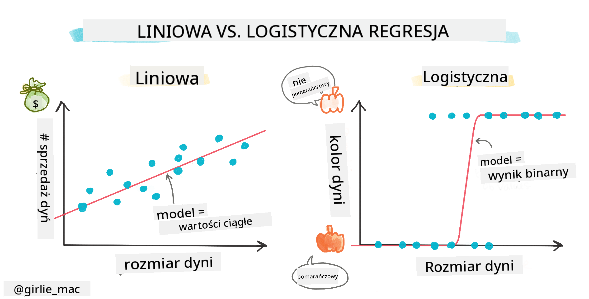
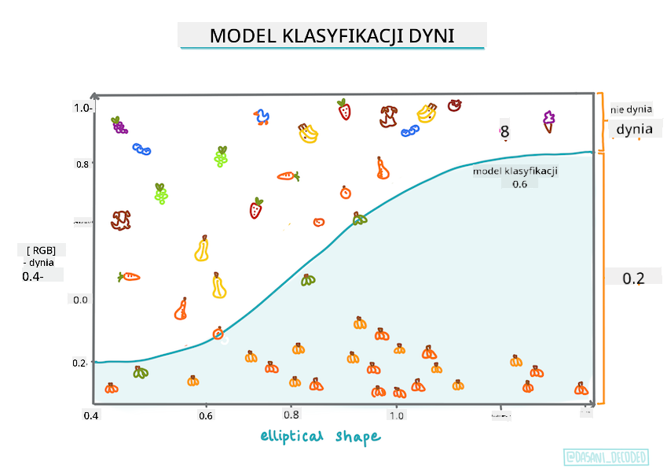
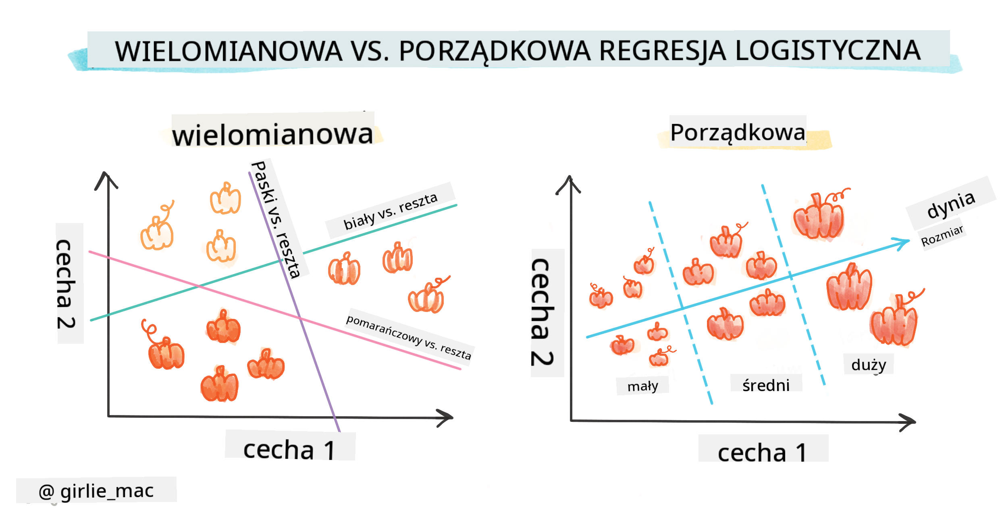
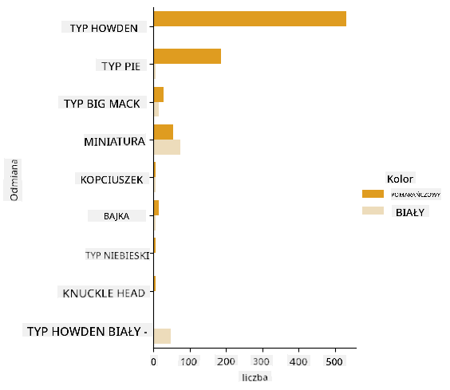
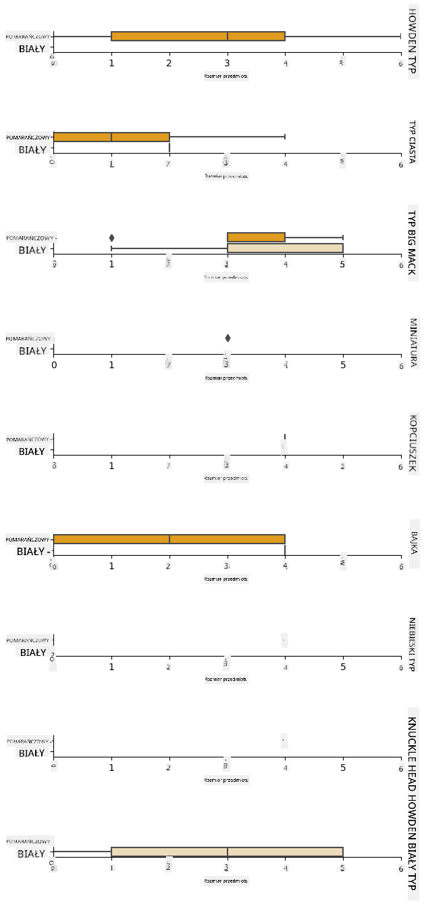
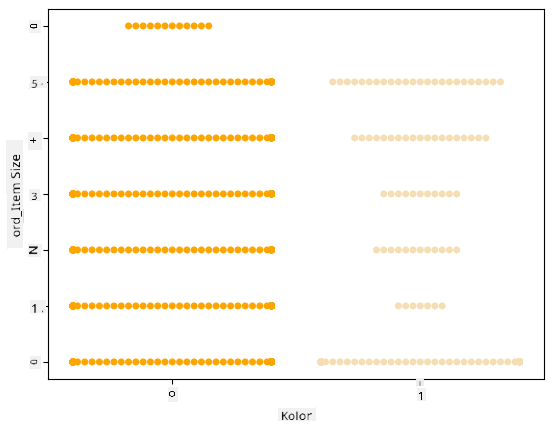
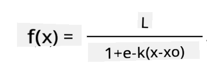
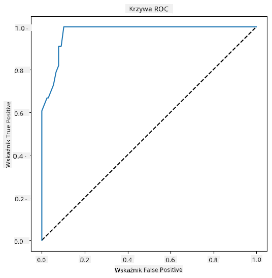

<!--
CO_OP_TRANSLATOR_METADATA:
{
  "original_hash": "72b5bae0879baddf6aafc82bb07b8776",
  "translation_date": "2025-09-03T16:26:57+00:00",
  "source_file": "2-Regression/4-Logistic/README.md",
  "language_code": "pl"
}
-->
# Regresja logistyczna do przewidywania kategorii



## [Quiz przed wykładem](https://gray-sand-07a10f403.1.azurestaticapps.net/quiz/15/)

> ### [Ta lekcja jest dostępna w R!](../../../../2-Regression/4-Logistic/solution/R/lesson_4.html)

## Wprowadzenie

W tej ostatniej lekcji dotyczącej regresji, jednej z podstawowych _klasycznych_ technik ML, przyjrzymy się regresji logistycznej. Technika ta pozwala odkrywać wzorce w celu przewidywania binarnych kategorii. Czy ten cukierek jest czekoladą, czy nie? Czy ta choroba jest zaraźliwa, czy nie? Czy ten klient wybierze ten produkt, czy nie?

W tej lekcji nauczysz się:

- Nowej biblioteki do wizualizacji danych
- Technik regresji logistycznej

✅ Pogłęb swoją wiedzę na temat pracy z tego typu regresją w tym [module nauki](https://docs.microsoft.com/learn/modules/train-evaluate-classification-models?WT.mc_id=academic-77952-leestott)

## Wymagania wstępne

Pracując z danymi dotyczącymi dyni, jesteśmy już wystarczająco zaznajomieni z nimi, aby zauważyć, że istnieje jedna binarna kategoria, z którą możemy pracować: `Color`.

Zbudujmy model regresji logistycznej, aby przewidzieć, na podstawie pewnych zmiennych, _jaki kolor prawdopodobnie będzie miała dana dynia_ (pomarańczowy 🎃 lub biały 👻).

> Dlaczego mówimy o binarnej klasyfikacji w lekcji dotyczącej regresji? Tylko dla wygody językowej, ponieważ regresja logistyczna jest [tak naprawdę metodą klasyfikacji](https://scikit-learn.org/stable/modules/linear_model.html#logistic-regression), choć opartą na metodach liniowych. Dowiedz się o innych sposobach klasyfikacji danych w kolejnej grupie lekcji.

## Zdefiniuj pytanie

Na potrzeby tej lekcji wyrazimy to jako binarną kategorię: 'Biały' lub 'Nie biały'. W naszym zbiorze danych znajduje się również kategoria 'paskowany', ale jest niewiele jej przypadków, więc jej nie użyjemy. Znika ona, gdy usuniemy wartości null z zestawu danych.

> 🎃 Ciekawostka: białe dynie czasami nazywamy 'dyniami-duchami'. Nie są one łatwe do rzeźbienia, więc nie są tak popularne jak pomarańczowe, ale wyglądają bardzo ciekawie! Możemy więc również sformułować nasze pytanie jako: 'Duch' czy 'Nie duch'. 👻

## O regresji logistycznej

Regresja logistyczna różni się od regresji liniowej, którą poznaliśmy wcześniej, w kilku istotnych aspektach.

[](https://youtu.be/KpeCT6nEpBY "ML dla początkujących - Zrozumienie regresji logistycznej w klasyfikacji danych")

> 🎥 Kliknij obrazek powyżej, aby obejrzeć krótki film o regresji logistycznej.

### Klasyfikacja binarna

Regresja logistyczna nie oferuje tych samych funkcji co regresja liniowa. Pierwsza z nich pozwala przewidywać binarne kategorie ("biały lub nie biały"), podczas gdy druga jest w stanie przewidywać wartości ciągłe, na przykład na podstawie pochodzenia dyni i czasu zbioru, _o ile wzrośnie jej cena_.


> Infografika autorstwa [Dasani Madipalli](https://twitter.com/dasani_decoded)

### Inne klasyfikacje

Istnieją inne typy regresji logistycznej, w tym wielomianowa i porządkowa:

- **Wielomianowa**, która obejmuje więcej niż jedną kategorię - "Pomarańczowa, Biała i Paskowana".
- **Porządkowa**, która obejmuje uporządkowane kategorie, przydatne, jeśli chcemy uporządkować wyniki logicznie, jak nasze dynie, które są uporządkowane według skończonej liczby rozmiarów (mini, mała, średnia, duża, XL, XXL).



### Zmienne NIE muszą być skorelowane

Pamiętasz, jak regresja liniowa działała lepiej z bardziej skorelowanymi zmiennymi? Regresja logistyczna jest odwrotna - zmienne nie muszą być ze sobą powiązane. To działa dla tych danych, które mają raczej słabe korelacje.

### Potrzebujesz dużej ilości czystych danych

Regresja logistyczna daje bardziej dokładne wyniki, jeśli używasz większej ilości danych; nasz mały zestaw danych nie jest optymalny dla tego zadania, więc miej to na uwadze.

[](https://youtu.be/B2X4H9vcXTs "ML dla początkujących - Analiza i przygotowanie danych do regresji logistycznej")

✅ Zastanów się, jakie typy danych najlepiej nadają się do regresji logistycznej.

## Ćwiczenie - uporządkuj dane

Najpierw trochę oczyść dane, usuwając wartości null i wybierając tylko niektóre kolumny:

1. Dodaj następujący kod:

    ```python
  
    columns_to_select = ['City Name','Package','Variety', 'Origin','Item Size', 'Color']
    pumpkins = full_pumpkins.loc[:, columns_to_select]

    pumpkins.dropna(inplace=True)
    ```

    Zawsze możesz zajrzeć do swojego nowego dataframe:

    ```python
    pumpkins.info
    ```

### Wizualizacja - wykres kategorii

Do tej pory załadowałeś [notebook startowy](./notebook.ipynb) z danymi o dyniach i oczyściłeś go, aby zachować zestaw danych zawierający kilka zmiennych, w tym `Color`. Zwizualizujmy dataframe w notebooku, używając innej biblioteki: [Seaborn](https://seaborn.pydata.org/index.html), która jest zbudowana na Matplotlib, którego używaliśmy wcześniej.

Seaborn oferuje ciekawe sposoby wizualizacji danych. Na przykład możesz porównać rozkłady danych dla każdej `Variety` i `Color` na wykresie kategorii.

1. Utwórz taki wykres, używając funkcji `catplot`, korzystając z danych o dyniach `pumpkins` i określając mapowanie kolorów dla każdej kategorii dyni (pomarańczowa lub biała):

    ```python
    import seaborn as sns
    
    palette = {
    'ORANGE': 'orange',
    'WHITE': 'wheat',
    }

    sns.catplot(
    data=pumpkins, y="Variety", hue="Color", kind="count",
    palette=palette, 
    )
    ```

    

    Obserwując dane, możesz zobaczyć, jak dane o kolorze odnoszą się do odmiany.

    ✅ Na podstawie tego wykresu kategorii, jakie interesujące eksploracje możesz sobie wyobrazić?

### Przetwarzanie danych: kodowanie cech i etykiet
Nasz zestaw danych o dyniach zawiera wartości tekstowe dla wszystkich swoich kolumn. Praca z danymi kategorycznymi jest intuicyjna dla ludzi, ale nie dla maszyn. Algorytmy uczenia maszynowego działają dobrze z liczbami. Dlatego kodowanie jest bardzo ważnym krokiem w fazie przetwarzania danych, ponieważ pozwala nam zamienić dane kategoryczne na dane numeryczne, bez utraty informacji. Dobre kodowanie prowadzi do budowy dobrego modelu.

Dla kodowania cech istnieją dwa główne typy kodowania:

1. Kodowanie porządkowe: dobrze nadaje się do zmiennych porządkowych, które są zmiennymi kategorycznymi, gdzie ich dane mają logiczne uporządkowanie, jak kolumna `Item Size` w naszym zestawie danych. Tworzy mapowanie, w którym każda kategoria jest reprezentowana przez liczbę, która jest kolejnością kategorii w kolumnie.

    ```python
    from sklearn.preprocessing import OrdinalEncoder

    item_size_categories = [['sml', 'med', 'med-lge', 'lge', 'xlge', 'jbo', 'exjbo']]
    ordinal_features = ['Item Size']
    ordinal_encoder = OrdinalEncoder(categories=item_size_categories)
    ```

2. Kodowanie kategoryczne: dobrze nadaje się do zmiennych nominalnych, które są zmiennymi kategorycznymi, gdzie ich dane nie mają logicznego uporządkowania, jak wszystkie cechy inne niż `Item Size` w naszym zestawie danych. Jest to kodowanie typu one-hot, co oznacza, że każda kategoria jest reprezentowana przez binarną kolumnę: zakodowana zmienna jest równa 1, jeśli dynia należy do tej odmiany, a 0 w przeciwnym razie.

    ```python
    from sklearn.preprocessing import OneHotEncoder

    categorical_features = ['City Name', 'Package', 'Variety', 'Origin']
    categorical_encoder = OneHotEncoder(sparse_output=False)
    ```
Następnie `ColumnTransformer` jest używany do połączenia wielu kodowań w jeden krok i zastosowania ich do odpowiednich kolumn.

```python
    from sklearn.compose import ColumnTransformer
    
    ct = ColumnTransformer(transformers=[
        ('ord', ordinal_encoder, ordinal_features),
        ('cat', categorical_encoder, categorical_features)
        ])
    
    ct.set_output(transform='pandas')
    encoded_features = ct.fit_transform(pumpkins)
```
Z kolei do kodowania etykiety używamy klasy `LabelEncoder` z biblioteki scikit-learn, która jest narzędziem do normalizacji etykiet tak, aby zawierały tylko wartości między 0 a n_classes-1 (tutaj, 0 i 1).

```python
    from sklearn.preprocessing import LabelEncoder

    label_encoder = LabelEncoder()
    encoded_label = label_encoder.fit_transform(pumpkins['Color'])
```
Po zakodowaniu cech i etykiety możemy połączyć je w nowy dataframe `encoded_pumpkins`.

```python
    encoded_pumpkins = encoded_features.assign(Color=encoded_label)
```
✅ Jakie są zalety używania kodowania porządkowego dla kolumny `Item Size`?

### Analiza relacji między zmiennymi

Teraz, gdy przetworzyliśmy nasze dane, możemy przeanalizować relacje między cechami a etykietą, aby zrozumieć, jak dobrze model będzie w stanie przewidzieć etykietę na podstawie cech.
Najlepszym sposobem na przeprowadzenie tego rodzaju analizy jest wykreślenie danych. Ponownie użyjemy funkcji `catplot` z biblioteki Seaborn, aby zwizualizować relacje między `Item Size`, `Variety` i `Color` na wykresie kategorii. Aby lepiej wykreślić dane, użyjemy zakodowanej kolumny `Item Size` i niezakodowanej kolumny `Variety`.

```python
    palette = {
    'ORANGE': 'orange',
    'WHITE': 'wheat',
    }
    pumpkins['Item Size'] = encoded_pumpkins['ord__Item Size']

    g = sns.catplot(
        data=pumpkins,
        x="Item Size", y="Color", row='Variety',
        kind="box", orient="h",
        sharex=False, margin_titles=True,
        height=1.8, aspect=4, palette=palette,
    )
    g.set(xlabel="Item Size", ylabel="").set(xlim=(0,6))
    g.set_titles(row_template="{row_name}")
```


### Użyj wykresu typu swarm

Ponieważ `Color` jest kategorią binarną (Biały lub Nie), wymaga '[specjalnego podejścia](https://seaborn.pydata.org/tutorial/categorical.html?highlight=bar) do wizualizacji'. Istnieją inne sposoby wizualizacji relacji tej kategorii z innymi zmiennymi.

Możesz wizualizować zmienne obok siebie za pomocą wykresów Seaborn.

1. Spróbuj wykresu typu 'swarm', aby pokazać rozkład wartości:

    ```python
    palette = {
    0: 'orange',
    1: 'wheat'
    }
    sns.swarmplot(x="Color", y="ord__Item Size", data=encoded_pumpkins, palette=palette)
    ```

    

**Uwaga**: powyższy kod może wygenerować ostrzeżenie, ponieważ Seaborn ma trudności z przedstawieniem takiej ilości punktów danych na wykresie typu swarm. Możliwym rozwiązaniem jest zmniejszenie rozmiaru markera, używając parametru 'size'. Jednak pamiętaj, że wpływa to na czytelność wykresu.

> **🧮 Pokaż mi matematykę**
>
> Regresja logistyczna opiera się na koncepcji 'maksymalnego prawdopodobieństwa' przy użyciu [funkcji sigmoidalnych](https://wikipedia.org/wiki/Sigmoid_function). Funkcja sigmoidalna na wykresie wygląda jak kształt litery 'S'. Przyjmuje wartość i mapuje ją na zakres między 0 a 1. Jej krzywa jest również nazywana 'krzywą logistyczną'. Jej wzór wygląda tak:
>
> 
>
> gdzie środek sigmoidy znajduje się w punkcie 0 osi x, L to maksymalna wartość krzywej, a k to stromość krzywej. Jeśli wynik funkcji jest większy niż 0.5, etykieta zostanie przypisana do klasy '1' w binarnym wyborze. W przeciwnym razie zostanie sklasyfikowana jako '0'.

## Zbuduj swój model

Budowanie modelu do znajdowania tych binarnych klasyfikacji jest zaskakująco proste w Scikit-learn.

[](https://youtu.be/MmZS2otPrQ8 "ML dla początkujących - Regresja logistyczna do klasyfikacji danych")

> 🎥 Kliknij obrazek powyżej, aby obejrzeć krótki film o budowie modelu regresji liniowej.

1. Wybierz zmienne, które chcesz użyć w swoim modelu klasyfikacji, i podziel zestawy treningowe i testowe, wywołując `train_test_split()`:

    ```python
    from sklearn.model_selection import train_test_split
    
    X = encoded_pumpkins[encoded_pumpkins.columns.difference(['Color'])]
    y = encoded_pumpkins['Color']

    X_train, X_test, y_train, y_test = train_test_split(X, y, test_size=0.2, random_state=0)
    
    ```

2. Teraz możesz wytrenować swój model, wywołując `fit()` z danymi treningowymi, i wydrukować jego wynik:

    ```python
    from sklearn.metrics import f1_score, classification_report 
    from sklearn.linear_model import LogisticRegression

    model = LogisticRegression()
    model.fit(X_train, y_train)
    predictions = model.predict(X_test)

    print(classification_report(y_test, predictions))
    print('Predicted labels: ', predictions)
    print('F1-score: ', f1_score(y_test, predictions))
    ```

    Spójrz na wyniki swojego modelu. Nie jest źle, biorąc pod uwagę, że masz tylko około 1000 wierszy danych:

    ```output
                       precision    recall  f1-score   support
    
                    0       0.94      0.98      0.96       166
                    1       0.85      0.67      0.75        33
    
        accuracy                                0.92       199
        macro avg           0.89      0.82      0.85       199
        weighted avg        0.92      0.92      0.92       199
    
        Predicted labels:  [0 0 0 0 0 0 0 0 0 0 0 0 0 0 0 0 0 0 0 0 1 0 0 1 0 0 0 0 0 0 0 0 1 0 0 0 0
        0 0 0 0 0 1 0 1 0 0 1 0 0 0 0 0 1 0 1 0 1 0 1 0 0 0 0 0 0 0 0 0 0 0 0 0 0
        1 0 0 0 0 0 0 0 1 0 0 0 0 0 0 0 1 0 0 0 0 0 0 0 0 1 0 1 0 0 0 0 0 0 0 1 0
        0 0 0 0 0 0 0 0 0 0 0 0 0 0 0 0 0 0 0 0 0 1 0 0 0 0 0 0 0 0 1 0 0 0 1 1 0
        0 0 0 0 1 0 0 0 0 0 1 0 0 0 0 0 0 0 0 0 0 0 0 0 0 0 0 0 0 0 0 0 0 0 0 0 1
        0 0 0 1 0 0 0 0 0 0 0 0 1 1]
        F1-score:  0.7457627118644068
    ```

## Lepsze zrozumienie dzięki macierzy pomyłek

Chociaż możesz uzyskać raport wyników [terminy](https://scikit-learn.org/stable/modules/generated/sklearn.metrics.classification_report.html?highlight=classification_report#sklearn.metrics.classification_report) poprzez wydrukowanie powyższych elementów, możesz lepiej zrozumieć swój model, używając [macierzy pomyłek](https://scikit-learn.org/stable/modules/model_evaluation.html#confusion-matrix), aby pomóc nam zrozumieć, jak model działa.

> 🎓 '[Macierz pomyłek](https://wikipedia.org/wiki/Confusion_matrix)' (lub 'macierz błędów') to tabela, która wyraża prawdziwe vs. fałszywe pozytywy i negatywy twojego modelu, oceniając dokładność przewidywań.

1. Aby użyć macierzy pomyłek, wywołaj `confusion_matrix()`:

    ```python
    from sklearn.metrics import confusion_matrix
    confusion_matrix(y_test, predictions)
    ```

    Spójrz na macierz pomyłek swojego modelu:

    ```output
    array([[162,   4],
           [ 11,  22]])
    ```

W Scikit-learn macierze pomyłek: Wiersze (oś 0) to rzeczywiste etykiety, a kolumny (oś 1) to przewidywane etykiety.

|       |   0   |   1   |
| :---: | :---: | :---: |
|   0   |  TN   |  FP   |
|   1   |  FN   |  TP   |

Co tu się dzieje? Załóżmy, że nasz model ma za zadanie klasyfikować dynie między dwoma binarnymi kategoriami, kategorią 'biały' i kategorią 'nie biały'.

- Jeśli twój model przewiduje dynię jako nie białą, a w rzeczywistości należy ona do kategorii 'nie biały', nazywamy to prawdziwym negatywem, pokazanym przez liczbę w lewym górnym rogu.
- Jeśli twój model przewiduje dynię jako białą, a w rzeczywistości należy ona do kategorii 'nie biały', nazywamy to fałszywym negatywem, pokazanym przez liczbę w lewym dolnym rogu.
- Jeśli twój model przewiduje dynię jako nie białą, a w rzeczywistości należy ona do kategorii 'biały', nazywamy to fałszywym pozytywem, pokazanym przez liczbę w prawym górnym rogu.
- Jeśli twój model przewiduje dynię jako białą, a w rzeczywistości należy ona do kategorii 'biały', nazywamy to prawdziwym pozytywem, pokazanym przez liczbę w prawym dolnym rogu.

Jak możesz się domyślić, preferowane jest posiadanie większej liczby prawdziwych pozytywów i prawdziwych negatywów oraz mniejszej liczby fałszywych pozytywów i fałszywych negatywów, co oznacza, że model działa lepiej.
Jak macierz pomyłek odnosi się do precyzji i czułości? Pamiętaj, że raport klasyfikacji pokazany powyżej wskazywał precyzję (0.85) i czułość (0.67).

Precyzja = tp / (tp + fp) = 22 / (22 + 4) = 0.8461538461538461

Czułość = tp / (tp + fn) = 22 / (22 + 11) = 0.6666666666666666

✅ P: Jak według macierzy pomyłek poradził sobie model? O: Całkiem nieźle; jest sporo prawdziwych negatywów, ale także kilka fałszywych negatywów.

Przyjrzyjmy się ponownie terminom, które widzieliśmy wcześniej, korzystając z mapowania TP/TN i FP/FN w macierzy pomyłek:

🎓 Precyzja: TP/(TP + FP) Udział istotnych przypadków wśród odzyskanych przypadków (np. które etykiety zostały dobrze oznaczone)

🎓 Czułość: TP/(TP + FN) Udział istotnych przypadków, które zostały odzyskane, niezależnie od tego, czy były dobrze oznaczone, czy nie

🎓 f1-score: (2 * precyzja * czułość)/(precyzja + czułość) Średnia ważona precyzji i czułości, gdzie najlepszy wynik to 1, a najgorszy to 0

🎓 Wsparcie: Liczba wystąpień każdej odzyskanej etykiety

🎓 Dokładność: (TP + TN)/(TP + TN + FP + FN) Procent etykiet przewidzianych poprawnie dla próbki.

🎓 Średnia makro: Obliczenie nieważonej średniej metryk dla każdej etykiety, bez uwzględniania nierównowagi etykiet.

🎓 Średnia ważona: Obliczenie średniej metryk dla każdej etykiety, uwzględniając nierównowagę etykiet poprzez ważenie ich wsparciem (liczbą prawdziwych przypadków dla każdej etykiety).

✅ Czy możesz pomyśleć, którą metrykę należy obserwować, jeśli chcesz, aby Twój model zmniejszył liczbę fałszywych negatywów?

## Wizualizacja krzywej ROC dla tego modelu

[](https://youtu.be/GApO575jTA0 "ML dla początkujących - Analiza wydajności regresji logistycznej za pomocą krzywych ROC")


> 🎥 Kliknij obrazek powyżej, aby obejrzeć krótki film o krzywych ROC

Zróbmy jeszcze jedną wizualizację, aby zobaczyć tzw. krzywą 'ROC':

```python
from sklearn.metrics import roc_curve, roc_auc_score
import matplotlib
import matplotlib.pyplot as plt
%matplotlib inline

y_scores = model.predict_proba(X_test)
fpr, tpr, thresholds = roc_curve(y_test, y_scores[:,1])

fig = plt.figure(figsize=(6, 6))
plt.plot([0, 1], [0, 1], 'k--')
plt.plot(fpr, tpr)
plt.xlabel('False Positive Rate')
plt.ylabel('True Positive Rate')
plt.title('ROC Curve')
plt.show()
```

Korzystając z Matplotlib, narysuj [Receiving Operating Characteristic](https://scikit-learn.org/stable/auto_examples/model_selection/plot_roc.html?highlight=roc) lub ROC modelu. Krzywe ROC są często używane do oceny wyników klasyfikatora w kontekście jego prawdziwych vs. fałszywych pozytywów. "Krzywe ROC zazwyczaj przedstawiają wskaźnik prawdziwych pozytywów na osi Y, a wskaźnik fałszywych pozytywów na osi X." Dlatego ważne są stromość krzywej i przestrzeń między linią środkową a krzywą: chcesz, aby krzywa szybko wznosiła się i oddalała od linii. W naszym przypadku na początku występują fałszywe pozytywy, a następnie linia wznosi się i oddala prawidłowo:



Na koniec użyj API [`roc_auc_score`](https://scikit-learn.org/stable/modules/generated/sklearn.metrics.roc_auc_score.html?highlight=roc_auc#sklearn.metrics.roc_auc_score) z biblioteki Scikit-learn, aby obliczyć rzeczywisty 'Obszar pod krzywą' (AUC):

```python
auc = roc_auc_score(y_test,y_scores[:,1])
print(auc)
```
Wynik to `0.9749908725812341`. Biorąc pod uwagę, że AUC mieści się w zakresie od 0 do 1, chcesz uzyskać wysoki wynik, ponieważ model, który w 100% poprawnie przewiduje wyniki, będzie miał AUC równy 1; w tym przypadku model jest _całkiem dobry_. 

W przyszłych lekcjach dotyczących klasyfikacji dowiesz się, jak iteracyjnie poprawiać wyniki swojego modelu. Ale na razie gratulacje! Ukończyłeś te lekcje dotyczące regresji!

---
## 🚀Wyzwanie

Jest jeszcze wiele do odkrycia w temacie regresji logistycznej! Ale najlepszym sposobem nauki jest eksperymentowanie. Znajdź zbiór danych, który nadaje się do tego typu analizy, i zbuduj model na jego podstawie. Czego się nauczysz? wskazówka: spróbuj [Kaggle](https://www.kaggle.com/search?q=logistic+regression+datasets) dla ciekawych zbiorów danych.

## [Quiz po wykładzie](https://gray-sand-07a10f403.1.azurestaticapps.net/quiz/16/)

## Przegląd i samodzielna nauka

Przeczytaj pierwsze kilka stron [tego artykułu ze Stanfordu](https://web.stanford.edu/~jurafsky/slp3/5.pdf) o praktycznych zastosowaniach regresji logistycznej. Zastanów się nad zadaniami, które lepiej nadają się do jednego lub drugiego typu regresji, które studiowaliśmy do tej pory. Co sprawdziłoby się najlepiej?

## Zadanie 

[Powtórzenie tej regresji](assignment.md)

---

**Zastrzeżenie**:  
Ten dokument został przetłumaczony za pomocą usługi tłumaczenia AI [Co-op Translator](https://github.com/Azure/co-op-translator). Chociaż dokładamy wszelkich starań, aby tłumaczenie było precyzyjne, prosimy pamiętać, że automatyczne tłumaczenia mogą zawierać błędy lub nieścisłości. Oryginalny dokument w jego rodzimym języku powinien być uznawany za źródło autorytatywne. W przypadku informacji o kluczowym znaczeniu zaleca się skorzystanie z profesjonalnego tłumaczenia przez człowieka. Nie ponosimy odpowiedzialności za jakiekolwiek nieporozumienia lub błędne interpretacje wynikające z użycia tego tłumaczenia.