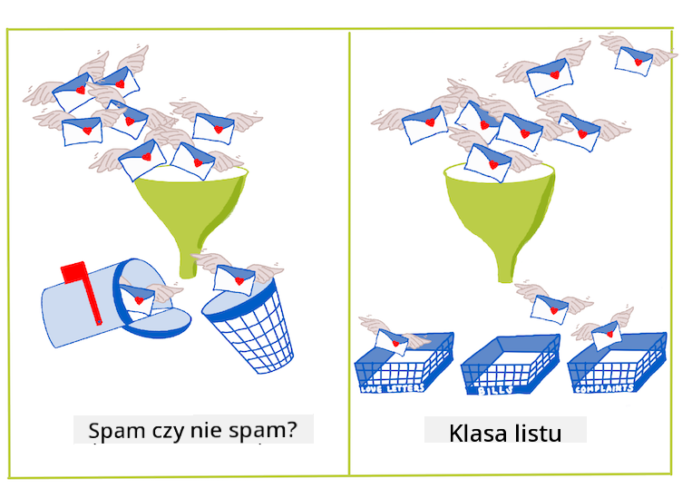
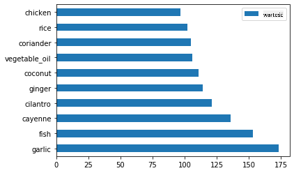
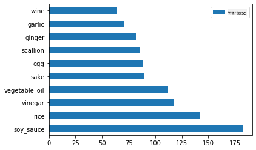
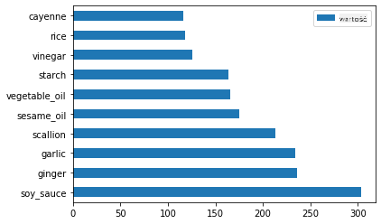
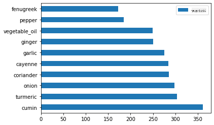
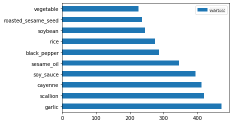

<!--
CO_OP_TRANSLATOR_METADATA:
{
  "original_hash": "76438ce4e5d48982d48f1b55c981caac",
  "translation_date": "2025-09-03T18:13:09+00:00",
  "source_file": "4-Classification/1-Introduction/README.md",
  "language_code": "pl"
}
-->
# Wprowadzenie do klasyfikacji

W tych czterech lekcjach zgłębisz podstawowy aspekt klasycznego uczenia maszynowego - _klasyfikację_. Przejdziemy przez różne algorytmy klasyfikacji, korzystając z zestawu danych dotyczących wszystkich wspaniałych kuchni Azji i Indii. Mam nadzieję, że jesteś głodny!


> Świętuj kuchnie panazjatyckie w tych lekcjach! Obraz autorstwa [Jen Looper](https://twitter.com/jenlooper)

Klasyfikacja to forma [uczenia nadzorowanego](https://wikipedia.org/wiki/Supervised_learning), która ma wiele wspólnego z technikami regresji. Jeśli uczenie maszynowe polega na przewidywaniu wartości lub nazw rzeczy na podstawie zestawów danych, to klasyfikacja zazwyczaj dzieli się na dwie grupy: _klasyfikacja binarna_ i _klasyfikacja wieloklasowa_.

[](https://youtu.be/eg8DJYwdMyg "Wprowadzenie do klasyfikacji")

> 🎥 Kliknij obrazek powyżej, aby obejrzeć wideo: John Guttag z MIT wprowadza klasyfikację

Zapamiętaj:

- **Regresja liniowa** pomogła Ci przewidzieć zależności między zmiennymi i dokonać dokładnych prognoz, gdzie nowy punkt danych znajdzie się w stosunku do tej linii. Na przykład, mogłeś przewidzieć _jaką cenę będzie miał dynia we wrześniu w porównaniu do grudnia_.
- **Regresja logistyczna** pomogła Ci odkryć "kategorie binarne": przy tej cenie _czy dynia jest pomarańczowa czy nie-pomarańczowa_?

Klasyfikacja wykorzystuje różne algorytmy do określenia innych sposobów przypisywania etykiety lub klasy punktowi danych. Pracujmy z tymi danymi o kuchniach, aby sprawdzić, czy na podstawie grupy składników możemy określić ich pochodzenie kulinarne.

## [Quiz przed lekcją](https://gray-sand-07a10f403.1.azurestaticapps.net/quiz/19/)

> ### [Ta lekcja jest dostępna w R!](../../../../4-Classification/1-Introduction/solution/R/lesson_10.html)

### Wprowadzenie

Klasyfikacja jest jednym z podstawowych działań badacza uczenia maszynowego i analityka danych. Od podstawowej klasyfikacji wartości binarnej ("czy ten e-mail to spam czy nie?"), po złożoną klasyfikację obrazów i segmentację za pomocą wizji komputerowej, zawsze warto umieć sortować dane na klasy i zadawać im pytania.

Mówiąc bardziej naukowo, metoda klasyfikacji tworzy model predykcyjny, który pozwala na mapowanie relacji między zmiennymi wejściowymi a zmiennymi wyjściowymi.



> Problemy binarne vs. wieloklasowe dla algorytmów klasyfikacji. Infografika autorstwa [Jen Looper](https://twitter.com/jenlooper)

Zanim rozpoczniemy proces czyszczenia danych, ich wizualizacji i przygotowania do zadań ML, dowiedzmy się trochę o różnych sposobach, w jakie uczenie maszynowe może być wykorzystane do klasyfikacji danych.

Wywodząca się ze [statystyki](https://wikipedia.org/wiki/Statistical_classification), klasyfikacja przy użyciu klasycznego uczenia maszynowego wykorzystuje cechy, takie jak `smoker`, `weight` i `age`, aby określić _prawdopodobieństwo rozwoju X choroby_. Jako technika uczenia nadzorowanego, podobna do ćwiczeń regresji, które wykonywałeś wcześniej, Twoje dane są oznaczone, a algorytmy ML wykorzystują te etykiety do klasyfikowania i przewidywania klas (lub 'cech') zestawu danych oraz przypisywania ich do grupy lub wyniku.

✅ Zastanów się przez chwilę nad zestawem danych o kuchniach. Na jakie pytania mógłby odpowiedzieć model wieloklasowy? Na jakie pytania mógłby odpowiedzieć model binarny? Co jeśli chciałbyś określić, czy dana kuchnia prawdopodobnie używa kozieradki? Co jeśli chciałbyś sprawdzić, czy mając torbę pełną anyżu gwiazdkowego, karczochów, kalafiora i chrzanu, mógłbyś stworzyć typowe indyjskie danie?

[](https://youtu.be/GuTeDbaNoEU "Szalone tajemnicze koszyki")

> 🎥 Kliknij obrazek powyżej, aby obejrzeć wideo. Cała koncepcja programu 'Chopped' opiera się na 'tajemniczym koszyku', w którym szefowie kuchni muszą przygotować danie z losowego wyboru składników. Z pewnością model ML mógłby pomóc!

## Witaj 'klasyfikatorze'

Pytanie, które chcemy zadać w odniesieniu do tego zestawu danych o kuchniach, jest w rzeczywistości pytaniem **wieloklasowym**, ponieważ mamy do czynienia z kilkoma potencjalnymi kuchniami narodowymi. Mając zestaw składników, do której z tych wielu klas będą pasować dane?

Scikit-learn oferuje kilka różnych algorytmów do klasyfikacji danych, w zależności od rodzaju problemu, który chcesz rozwiązać. W kolejnych dwóch lekcjach poznasz kilka z tych algorytmów.

## Ćwiczenie - czyszczenie i równoważenie danych

Pierwszym zadaniem, zanim rozpoczniemy ten projekt, jest wyczyszczenie i **zrównoważenie** danych, aby uzyskać lepsze wyniki. Zacznij od pustego pliku _notebook.ipynb_ w głównym folderze.

Pierwszą rzeczą, którą należy zainstalować, jest [imblearn](https://imbalanced-learn.org/stable/). Jest to pakiet Scikit-learn, który pozwoli Ci lepiej zrównoważyć dane (więcej o tym zadaniu dowiesz się za chwilę).

1. Aby zainstalować `imblearn`, uruchom `pip install`, w następujący sposób:

    ```python
    pip install imblearn
    ```

1. Zaimportuj pakiety potrzebne do zaimportowania danych i ich wizualizacji, a także zaimportuj `SMOTE` z `imblearn`.

    ```python
    import pandas as pd
    import matplotlib.pyplot as plt
    import matplotlib as mpl
    import numpy as np
    from imblearn.over_sampling import SMOTE
    ```

    Teraz jesteś gotowy do zaimportowania danych.

1. Następnym zadaniem będzie zaimportowanie danych:

    ```python
    df  = pd.read_csv('../data/cuisines.csv')
    ```

   Korzystając z `read_csv()`, odczytasz zawartość pliku csv _cusines.csv_ i umieścisz ją w zmiennej `df`.

1. Sprawdź kształt danych:

    ```python
    df.head()
    ```

   Pierwsze pięć wierszy wygląda tak:

    ```output
    |     | Unnamed: 0 | cuisine | almond | angelica | anise | anise_seed | apple | apple_brandy | apricot | armagnac | ... | whiskey | white_bread | white_wine | whole_grain_wheat_flour | wine | wood | yam | yeast | yogurt | zucchini |
    | --- | ---------- | ------- | ------ | -------- | ----- | ---------- | ----- | ------------ | ------- | -------- | --- | ------- | ----------- | ---------- | ----------------------- | ---- | ---- | --- | ----- | ------ | -------- |
    | 0   | 65         | indian  | 0      | 0        | 0     | 0          | 0     | 0            | 0       | 0        | ... | 0       | 0           | 0          | 0                       | 0    | 0    | 0   | 0     | 0      | 0        |
    | 1   | 66         | indian  | 1      | 0        | 0     | 0          | 0     | 0            | 0       | 0        | ... | 0       | 0           | 0          | 0                       | 0    | 0    | 0   | 0     | 0      | 0        |
    | 2   | 67         | indian  | 0      | 0        | 0     | 0          | 0     | 0            | 0       | 0        | ... | 0       | 0           | 0          | 0                       | 0    | 0    | 0   | 0     | 0      | 0        |
    | 3   | 68         | indian  | 0      | 0        | 0     | 0          | 0     | 0            | 0       | 0        | ... | 0       | 0           | 0          | 0                       | 0    | 0    | 0   | 0     | 0      | 0        |
    | 4   | 69         | indian  | 0      | 0        | 0     | 0          | 0     | 0            | 0       | 0        | ... | 0       | 0           | 0          | 0                       | 0    | 0    | 0   | 0     | 1      | 0        |
    ```

1. Uzyskaj informacje o tych danych, wywołując `info()`:

    ```python
    df.info()
    ```

    Twój wynik wygląda podobnie do:

    ```output
    <class 'pandas.core.frame.DataFrame'>
    RangeIndex: 2448 entries, 0 to 2447
    Columns: 385 entries, Unnamed: 0 to zucchini
    dtypes: int64(384), object(1)
    memory usage: 7.2+ MB
    ```

## Ćwiczenie - poznawanie kuchni

Teraz praca zaczyna być bardziej interesująca. Odkryjmy rozkład danych według kuchni.

1. Zobrazuj dane jako wykresy słupkowe, wywołując `barh()`:

    ```python
    df.cuisine.value_counts().plot.barh()
    ```

    

    Istnieje skończona liczba kuchni, ale rozkład danych jest nierówny. Możesz to poprawić! Zanim to zrobisz, eksploruj trochę więcej.

1. Dowiedz się, ile danych jest dostępnych na kuchnię i wydrukuj je:

    ```python
    thai_df = df[(df.cuisine == "thai")]
    japanese_df = df[(df.cuisine == "japanese")]
    chinese_df = df[(df.cuisine == "chinese")]
    indian_df = df[(df.cuisine == "indian")]
    korean_df = df[(df.cuisine == "korean")]
    
    print(f'thai df: {thai_df.shape}')
    print(f'japanese df: {japanese_df.shape}')
    print(f'chinese df: {chinese_df.shape}')
    print(f'indian df: {indian_df.shape}')
    print(f'korean df: {korean_df.shape}')
    ```

    wynik wygląda tak:

    ```output
    thai df: (289, 385)
    japanese df: (320, 385)
    chinese df: (442, 385)
    indian df: (598, 385)
    korean df: (799, 385)
    ```

## Odkrywanie składników

Teraz możesz zagłębić się w dane i dowiedzieć się, jakie są typowe składniki dla każdej kuchni. Powinieneś usunąć powtarzające się dane, które powodują zamieszanie między kuchniami, więc dowiedzmy się więcej o tym problemie.

1. Utwórz funkcję `create_ingredient()` w Pythonie, aby stworzyć dataframe składników. Funkcja ta zacznie od usunięcia nieprzydatnej kolumny i posortuje składniki według ich liczby:

    ```python
    def create_ingredient_df(df):
        ingredient_df = df.T.drop(['cuisine','Unnamed: 0']).sum(axis=1).to_frame('value')
        ingredient_df = ingredient_df[(ingredient_df.T != 0).any()]
        ingredient_df = ingredient_df.sort_values(by='value', ascending=False,
        inplace=False)
        return ingredient_df
    ```

   Teraz możesz użyć tej funkcji, aby uzyskać pomysł na dziesięć najpopularniejszych składników według kuchni.

1. Wywołaj `create_ingredient()` i zobrazuj dane, wywołując `barh()`:

    ```python
    thai_ingredient_df = create_ingredient_df(thai_df)
    thai_ingredient_df.head(10).plot.barh()
    ```

    

1. Zrób to samo dla danych japońskich:

    ```python
    japanese_ingredient_df = create_ingredient_df(japanese_df)
    japanese_ingredient_df.head(10).plot.barh()
    ```

    

1. Teraz dla składników chińskich:

    ```python
    chinese_ingredient_df = create_ingredient_df(chinese_df)
    chinese_ingredient_df.head(10).plot.barh()
    ```

    

1. Zobrazuj składniki indyjskie:

    ```python
    indian_ingredient_df = create_ingredient_df(indian_df)
    indian_ingredient_df.head(10).plot.barh()
    ```

    

1. Na koniec zobrazuj składniki koreańskie:

    ```python
    korean_ingredient_df = create_ingredient_df(korean_df)
    korean_ingredient_df.head(10).plot.barh()
    ```

    

1. Teraz usuń najczęstsze składniki, które powodują zamieszanie między różnymi kuchniami, wywołując `drop()`:

   Wszyscy uwielbiają ryż, czosnek i imbir!

    ```python
    feature_df= df.drop(['cuisine','Unnamed: 0','rice','garlic','ginger'], axis=1)
    labels_df = df.cuisine #.unique()
    feature_df.head()
    ```

## Równoważenie zestawu danych

Teraz, gdy dane zostały wyczyszczone, użyj [SMOTE](https://imbalanced-learn.org/dev/references/generated/imblearn.over_sampling.SMOTE.html) - "Technika syntetycznego nadpróbkowania mniejszości" - aby je zrównoważyć.

1. Wywołaj `fit_resample()`, ta strategia generuje nowe próbki przez interpolację.

    ```python
    oversample = SMOTE()
    transformed_feature_df, transformed_label_df = oversample.fit_resample(feature_df, labels_df)
    ```

    Dzięki zrównoważeniu danych uzyskasz lepsze wyniki podczas ich klasyfikacji. Pomyśl o klasyfikacji binarnej. Jeśli większość Twoich danych należy do jednej klasy, model ML będzie częściej przewidywał tę klasę, tylko dlatego, że jest więcej danych dla niej. Równoważenie danych usuwa tę nierównowagę.

1. Teraz możesz sprawdzić liczbę etykiet na składnik:

    ```python
    print(f'new label count: {transformed_label_df.value_counts()}')
    print(f'old label count: {df.cuisine.value_counts()}')
    ```

    Twój wynik wygląda tak:

    ```output
    new label count: korean      799
    chinese     799
    indian      799
    japanese    799
    thai        799
    Name: cuisine, dtype: int64
    old label count: korean      799
    indian      598
    chinese     442
    japanese    320
    thai        289
    Name: cuisine, dtype: int64
    ```

    Dane są czyste, zrównoważone i bardzo apetyczne!

1. Ostatnim krokiem jest zapisanie zrównoważonych danych, w tym etykiet i cech, do nowego dataframe, który można wyeksportować do pliku:

    ```python
    transformed_df = pd.concat([transformed_label_df,transformed_feature_df],axis=1, join='outer')
    ```

1. Możesz jeszcze raz spojrzeć na dane, używając `transformed_df.head()` i `transformed_df.info()`. Zapisz kopię tych danych do wykorzystania w przyszłych lekcjach:

    ```python
    transformed_df.head()
    transformed_df.info()
    transformed_df.to_csv("../data/cleaned_cuisines.csv")
    ```

    Ten świeży plik CSV można teraz znaleźć w głównym folderze danych.

---

## 🚀Wyzwanie

Ten program nauczania zawiera kilka interesujących zestawów danych. Przejrzyj foldery `data` i sprawdź, czy któryś z nich zawiera zestawy danych odpowiednie do klasyfikacji binarnej lub wieloklasowej? Jakie pytania zadałbyś tym danym?

## [Quiz po lekcji](https://gray-sand-07a10f403.1.azurestaticapps.net/quiz/20/)

## Przegląd i samodzielna nauka

Zbadaj API SMOTE. Do jakich przypadków użycia jest najlepiej wykorzystywane? Jakie problemy rozwiązuje?

## Zadanie 

[Poznaj metody klasyfikacji](assignment.md)

---

**Zastrzeżenie**:  
Ten dokument został przetłumaczony za pomocą usługi tłumaczenia AI [Co-op Translator](https://github.com/Azure/co-op-translator). Chociaż dokładamy wszelkich starań, aby tłumaczenie było precyzyjne, prosimy pamiętać, że automatyczne tłumaczenia mogą zawierać błędy lub nieścisłości. Oryginalny dokument w jego rodzimym języku powinien być uznawany za wiarygodne źródło. W przypadku informacji o kluczowym znaczeniu zaleca się skorzystanie z profesjonalnego tłumaczenia przez człowieka. Nie ponosimy odpowiedzialności za jakiekolwiek nieporozumienia lub błędne interpretacje wynikające z użycia tego tłumaczenia.