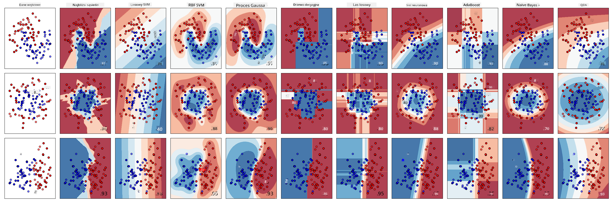
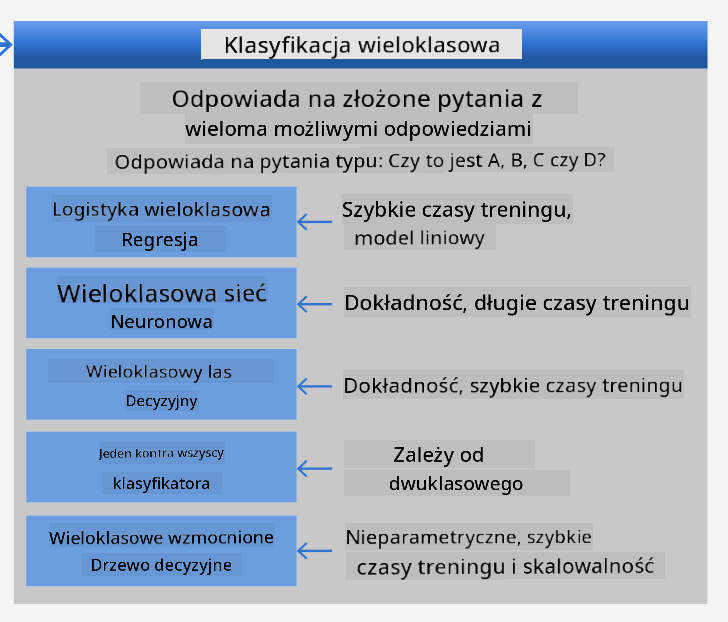
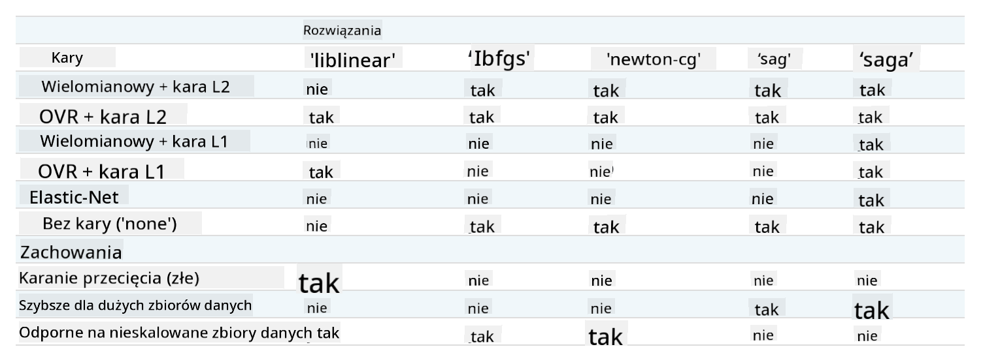

<!--
CO_OP_TRANSLATOR_METADATA:
{
  "original_hash": "9579f42e3ff5114c58379cc9e186a828",
  "translation_date": "2025-09-03T18:01:05+00:00",
  "source_file": "4-Classification/2-Classifiers-1/README.md",
  "language_code": "pl"
}
-->
# Klasyfikatory kuchni 1

W tej lekcji wykorzystasz zbiór danych zapisany w poprzedniej lekcji, zawierający zrównoważone i oczyszczone dane dotyczące kuchni.

Użyjesz tego zbioru danych z różnymi klasyfikatorami, aby _przewidzieć daną kuchnię narodową na podstawie grupy składników_. Przy okazji dowiesz się więcej o sposobach, w jakie algorytmy mogą być wykorzystywane do zadań klasyfikacyjnych.

## [Quiz przed wykładem](https://gray-sand-07a10f403.1.azurestaticapps.net/quiz/21/)
# Przygotowanie

Zakładając, że ukończyłeś [Lekcję 1](../1-Introduction/README.md), upewnij się, że plik _cleaned_cuisines.csv_ znajduje się w folderze `/data` w katalogu głównym dla tych czterech lekcji.

## Ćwiczenie - przewidywanie kuchni narodowej

1. Pracując w folderze _notebook.ipynb_ tej lekcji, zaimportuj ten plik wraz z biblioteką Pandas:

    ```python
    import pandas as pd
    cuisines_df = pd.read_csv("../data/cleaned_cuisines.csv")
    cuisines_df.head()
    ```

    Dane wyglądają następująco:

|     | Unnamed: 0 | cuisine | almond | angelica | anise | anise_seed | apple | apple_brandy | apricot | armagnac | ... | whiskey | white_bread | white_wine | whole_grain_wheat_flour | wine | wood | yam | yeast | yogurt | zucchini |
| --- | ---------- | ------- | ------ | -------- | ----- | ---------- | ----- | ------------ | ------- | -------- | --- | ------- | ----------- | ---------- | ----------------------- | ---- | ---- | --- | ----- | ------ | -------- |
| 0   | 0          | indian  | 0      | 0        | 0     | 0          | 0     | 0            | 0       | 0        | ... | 0       | 0           | 0          | 0                       | 0    | 0    | 0   | 0     | 0      | 0        |
| 1   | 1          | indian  | 1      | 0        | 0     | 0          | 0     | 0            | 0       | 0        | ... | 0       | 0           | 0          | 0                       | 0    | 0    | 0   | 0     | 0      | 0        |
| 2   | 2          | indian  | 0      | 0        | 0     | 0          | 0     | 0            | 0       | 0        | ... | 0       | 0           | 0          | 0                       | 0    | 0    | 0   | 0     | 0      | 0        |
| 3   | 3          | indian  | 0      | 0        | 0     | 0          | 0     | 0            | 0       | 0        | ... | 0       | 0           | 0          | 0                       | 0    | 0    | 0   | 0     | 0      | 0        |
| 4   | 4          | indian  | 0      | 0        | 0     | 0          | 0     | 0            | 0       | 0        | ... | 0       | 0           | 0          | 0                       | 0    | 0    | 0   | 0     | 1      | 0        |
  

1. Teraz zaimportuj kilka dodatkowych bibliotek:

    ```python
    from sklearn.linear_model import LogisticRegression
    from sklearn.model_selection import train_test_split, cross_val_score
    from sklearn.metrics import accuracy_score,precision_score,confusion_matrix,classification_report, precision_recall_curve
    from sklearn.svm import SVC
    import numpy as np
    ```

1. Podziel współrzędne X i y na dwa zbiory danych do trenowania. `cuisine` może być zbiorem etykiet:

    ```python
    cuisines_label_df = cuisines_df['cuisine']
    cuisines_label_df.head()
    ```

    Wygląda to tak:

    ```output
    0    indian
    1    indian
    2    indian
    3    indian
    4    indian
    Name: cuisine, dtype: object
    ```

1. Usuń kolumny `Unnamed: 0` i `cuisine`, korzystając z funkcji `drop()`. Zapisz resztę danych jako cechy do trenowania:

    ```python
    cuisines_feature_df = cuisines_df.drop(['Unnamed: 0', 'cuisine'], axis=1)
    cuisines_feature_df.head()
    ```

    Twoje cechy wyglądają tak:

|      | almond | angelica | anise | anise_seed | apple | apple_brandy | apricot | armagnac | artemisia | artichoke |  ... | whiskey | white_bread | white_wine | whole_grain_wheat_flour | wine | wood |  yam | yeast | yogurt | zucchini |
| ---: | -----: | -------: | ----: | ---------: | ----: | -----------: | ------: | -------: | --------: | --------: | ---: | ------: | ----------: | ---------: | ----------------------: | ---: | ---: | ---: | ----: | -----: | -------: |
|    0 |      0 |        0 |     0 |          0 |     0 |            0 |       0 |        0 |         0 |         0 |  ... |       0 |           0 |          0 |                       0 |    0 |    0 |    0 |     0 |      0 |        0 | 0 |
|    1 |      1 |        0 |     0 |          0 |     0 |            0 |       0 |        0 |         0 |         0 |  ... |       0 |           0 |          0 |                       0 |    0 |    0 |    0 |     0 |      0 |        0 | 0 |
|    2 |      0 |        0 |     0 |          0 |     0 |            0 |       0 |        0 |         0 |         0 |  ... |       0 |           0 |          0 |                       0 |    0 |    0 |    0 |     0 |      0 |        0 | 0 |
|    3 |      0 |        0 |     0 |          0 |     0 |            0 |       0 |        0 |         0 |         0 |  ... |       0 |           0 |          0 |                       0 |    0 |    0 |    0 |     0 |      0 |        0 | 0 |
|    4 |      0 |        0 |     0 |          0 |     0 |            0 |       0 |        0 |         0 |         0 |  ... |       0 |           0 |          0 |                       0 |    0 |    0 |    0 |     0 |      1 |        0 | 0 |

Teraz jesteś gotowy, aby trenować swój model!

## Wybór klasyfikatora

Teraz, gdy dane są oczyszczone i gotowe do trenowania, musisz zdecydować, który algorytm zastosować.

Scikit-learn klasyfikuje klasyfikację jako część Uczenia Nadzorowanego, a w tej kategorii znajdziesz wiele metod klasyfikacji. [Różnorodność](https://scikit-learn.org/stable/supervised_learning.html) może na początku wydawać się przytłaczająca. Oto niektóre z dostępnych metod:

- Modele liniowe
- Maszyny wektorów nośnych (SVM)
- Stochastyczny gradient prosty
- Najbliżsi sąsiedzi
- Procesy Gaussowskie
- Drzewa decyzyjne
- Metody zespołowe (klasyfikator głosujący)
- Algorytmy wieloklasowe i wielowyjściowe (klasyfikacja wieloklasowa i wieloetykietowa, klasyfikacja wieloklasowo-wielowyjściowa)

> Możesz również użyć [sieci neuronowych do klasyfikacji danych](https://scikit-learn.org/stable/modules/neural_networks_supervised.html#classification), ale to wykracza poza zakres tej lekcji.

### Jaki klasyfikator wybrać?

Który klasyfikator wybrać? Często warto przetestować kilka z nich i sprawdzić, który daje najlepsze wyniki. Scikit-learn oferuje [porównanie](https://scikit-learn.org/stable/auto_examples/classification/plot_classifier_comparison.html) różnych klasyfikatorów na stworzonym zbiorze danych, takich jak KNeighbors, SVC w dwóch wariantach, GaussianProcessClassifier, DecisionTreeClassifier, RandomForestClassifier, MLPClassifier, AdaBoostClassifier, GaussianNB i QuadraticDiscriminationAnalysis, prezentując wyniki w formie wizualnej:


> Wykresy wygenerowane na podstawie dokumentacji Scikit-learn

> AutoML rozwiązuje ten problem w prosty sposób, przeprowadzając te porównania w chmurze, co pozwala wybrać najlepszy algorytm dla Twoich danych. Wypróbuj to [tutaj](https://docs.microsoft.com/learn/modules/automate-model-selection-with-azure-automl/?WT.mc_id=academic-77952-leestott)

### Lepsze podejście

Lepszym podejściem niż zgadywanie jest skorzystanie z tego [ściągawki ML](https://docs.microsoft.com/azure/machine-learning/algorithm-cheat-sheet?WT.mc_id=academic-77952-leestott). Dowiadujemy się z niej, że dla naszego problemu wieloklasowego mamy kilka opcji:


> Fragment ściągawki Microsoftu dotyczący opcji klasyfikacji wieloklasowej

✅ Pobierz tę ściągawkę, wydrukuj ją i powieś na ścianie!

### Rozumowanie

Przeanalizujmy różne podejścia, biorąc pod uwagę nasze ograniczenia:

- **Sieci neuronowe są zbyt ciężkie**. Biorąc pod uwagę nasz oczyszczony, ale minimalny zbiór danych oraz fakt, że trenujemy lokalnie w notebookach, sieci neuronowe są zbyt wymagające dla tego zadania.
- **Brak klasyfikatora dwuklasowego**. Nie używamy klasyfikatora dwuklasowego, więc wykluczamy podejście one-vs-all.
- **Drzewo decyzyjne lub regresja logistyczna mogą się sprawdzić**. Drzewo decyzyjne lub regresja logistyczna dla danych wieloklasowych mogą być odpowiednie.
- **Wieloklasowe wzmocnione drzewa decyzyjne rozwiązują inny problem**. Wieloklasowe wzmocnione drzewa decyzyjne są najbardziej odpowiednie dla zadań nieparametrycznych, np. budowania rankingów, więc nie są dla nas użyteczne.

### Korzystanie ze Scikit-learn 

Będziemy korzystać ze Scikit-learn do analizy danych. Istnieje jednak wiele sposobów użycia regresji logistycznej w Scikit-learn. Spójrz na [parametry do ustawienia](https://scikit-learn.org/stable/modules/generated/sklearn.linear_model.LogisticRegression.html?highlight=logistic%20regressio#sklearn.linear_model.LogisticRegression).  

Istnieją dwa kluczowe parametry - `multi_class` i `solver` - które musimy określić, prosząc Scikit-learn o przeprowadzenie regresji logistycznej. Wartość `multi_class` określa pewne zachowanie. Wartość solvera wskazuje, jakiego algorytmu użyć. Nie wszystkie solvery mogą być używane z każdą wartością `multi_class`.

Według dokumentacji, w przypadku wieloklasowym algorytm treningowy:

- **Używa schematu one-vs-rest (OvR)**, jeśli opcja `multi_class` jest ustawiona na `ovr`
- **Używa funkcji strat krzyżowej entropii**, jeśli opcja `multi_class` jest ustawiona na `multinomial`. (Obecnie opcja `multinomial` jest obsługiwana tylko przez solvery ‘lbfgs’, ‘sag’, ‘saga’ i ‘newton-cg’.)

> 🎓 'Schemat' może być 'ovr' (one-vs-rest) lub 'multinomial'. Ponieważ regresja logistyczna jest zaprojektowana głównie do klasyfikacji binarnej, te schematy pozwalają jej lepiej obsługiwać zadania klasyfikacji wieloklasowej. [źródło](https://machinelearningmastery.com/one-vs-rest-and-one-vs-one-for-multi-class-classification/)

> 🎓 'Solver' to "algorytm używany w problemie optymalizacji". [źródło](https://scikit-learn.org/stable/modules/generated/sklearn.linear_model.LogisticRegression.html?highlight=logistic%20regressio#sklearn.linear_model.LogisticRegression).

Scikit-learn oferuje tę tabelę, aby wyjaśnić, jak solvery radzą sobie z różnymi wyzwaniami wynikającymi z różnych struktur danych:



## Ćwiczenie - podział danych

Skupimy się na regresji logistycznej jako pierwszej próbie trenowania, ponieważ niedawno nauczyłeś się o niej w poprzedniej lekcji.
Podziel dane na grupy treningowe i testowe, korzystając z funkcji `train_test_split()`:

```python
X_train, X_test, y_train, y_test = train_test_split(cuisines_feature_df, cuisines_label_df, test_size=0.3)
```

## Ćwiczenie - zastosowanie regresji logistycznej

Ponieważ używasz przypadku wieloklasowego, musisz wybrać, jaki _schemat_ zastosować i jaki _solver_ ustawić. Użyj LogisticRegression z ustawieniem multi_class na `ovr` i solverem **liblinear**, aby przeprowadzić trening.

1. Utwórz regresję logistyczną z multi_class ustawionym na `ovr` i solverem ustawionym na `liblinear`:

    ```python
    lr = LogisticRegression(multi_class='ovr',solver='liblinear')
    model = lr.fit(X_train, np.ravel(y_train))
    
    accuracy = model.score(X_test, y_test)
    print ("Accuracy is {}".format(accuracy))
    ```

    ✅ Wypróbuj inny solver, na przykład `lbfgs`, który często jest ustawiany jako domyślny
> Uwaga, użyj funkcji Pandas [`ravel`](https://pandas.pydata.org/pandas-docs/stable/reference/api/pandas.Series.ravel.html), aby spłaszczyć dane, gdy zajdzie taka potrzeba.
Dokładność wynosi ponad **80%!**

1. Możesz zobaczyć działanie tego modelu, testując jeden wiersz danych (#50):

    ```python
    print(f'ingredients: {X_test.iloc[50][X_test.iloc[50]!=0].keys()}')
    print(f'cuisine: {y_test.iloc[50]}')
    ```

    Wynik jest wyświetlany:

   ```output
   ingredients: Index(['cilantro', 'onion', 'pea', 'potato', 'tomato', 'vegetable_oil'], dtype='object')
   cuisine: indian
   ```

   ✅ Wypróbuj inny numer wiersza i sprawdź wyniki.

1. Zagłębiając się bardziej, możesz sprawdzić dokładność tej predykcji:

    ```python
    test= X_test.iloc[50].values.reshape(-1, 1).T
    proba = model.predict_proba(test)
    classes = model.classes_
    resultdf = pd.DataFrame(data=proba, columns=classes)
    
    topPrediction = resultdf.T.sort_values(by=[0], ascending = [False])
    topPrediction.head()
    ```

    Wynik jest wyświetlany - kuchnia indyjska to najlepsze przypuszczenie modelu, z dużym prawdopodobieństwem:

    |          |        0 |
    | -------: | -------: |
    |   indian | 0.715851 |
    |  chinese | 0.229475 |
    | japanese | 0.029763 |
    |   korean | 0.017277 |
    |     thai | 0.007634 |

    ✅ Czy potrafisz wyjaśnić, dlaczego model jest niemal pewien, że to kuchnia indyjska?

1. Uzyskaj więcej szczegółów, wyświetlając raport klasyfikacji, tak jak robiłeś to w lekcjach dotyczących regresji:

    ```python
    y_pred = model.predict(X_test)
    print(classification_report(y_test,y_pred))
    ```

    |              | precyzja | recall | f1-score | wsparcie |
    | ------------ | -------- | ------ | -------- | -------- |
    | chinese      | 0.73     | 0.71   | 0.72     | 229      |
    | indian       | 0.91     | 0.93   | 0.92     | 254      |
    | japanese     | 0.70     | 0.75   | 0.72     | 220      |
    | korean       | 0.86     | 0.76   | 0.81     | 242      |
    | thai         | 0.79     | 0.85   | 0.82     | 254      |
    | dokładność   | 0.80     | 1199   |          |          |
    | średnia makro| 0.80     | 0.80   | 0.80     | 1199     |
    | średnia ważona| 0.80    | 0.80   | 0.80     | 1199     |

## 🚀Wyzwanie

W tej lekcji wykorzystałeś swoje oczyszczone dane, aby zbudować model uczenia maszynowego, który potrafi przewidzieć narodową kuchnię na podstawie serii składników. Poświęć trochę czasu na zapoznanie się z wieloma opcjami, jakie Scikit-learn oferuje do klasyfikacji danych. Zgłęb koncepcję 'solver', aby zrozumieć, co dzieje się za kulisami.

## [Quiz po wykładzie](https://gray-sand-07a10f403.1.azurestaticapps.net/quiz/22/)

## Przegląd i samodzielna nauka

Zgłęb nieco bardziej matematykę stojącą za regresją logistyczną w [tej lekcji](https://people.eecs.berkeley.edu/~russell/classes/cs194/f11/lectures/CS194%20Fall%202011%20Lecture%2006.pdf)  
## Zadanie 

[Przestudiuj solvery](assignment.md)

---

**Zastrzeżenie**:  
Ten dokument został przetłumaczony za pomocą usługi tłumaczenia AI [Co-op Translator](https://github.com/Azure/co-op-translator). Chociaż dokładamy wszelkich starań, aby tłumaczenie było precyzyjne, prosimy pamiętać, że automatyczne tłumaczenia mogą zawierać błędy lub nieścisłości. Oryginalny dokument w jego języku źródłowym powinien być uznawany za autorytatywne źródło. W przypadku informacji o kluczowym znaczeniu zaleca się skorzystanie z profesjonalnego tłumaczenia przez człowieka. Nie ponosimy odpowiedzialności za jakiekolwiek nieporozumienia lub błędne interpretacje wynikające z użycia tego tłumaczenia.