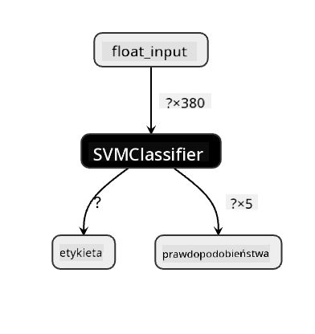
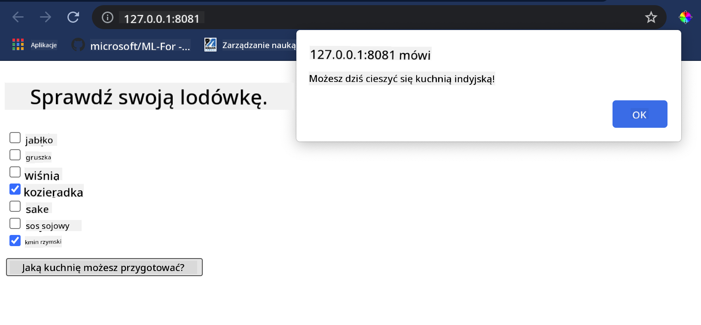

<!--
CO_OP_TRANSLATOR_METADATA:
{
  "original_hash": "ad2cf19d7490247558d20a6a59650d13",
  "translation_date": "2025-09-03T18:06:22+00:00",
  "source_file": "4-Classification/4-Applied/README.md",
  "language_code": "pl"
}
-->
# Zbuduj aplikację webową rekomendującą kuchnie

W tej lekcji zbudujesz model klasyfikacyjny, korzystając z technik poznanych w poprzednich lekcjach oraz z pysznego zestawu danych o kuchniach, używanego w całej tej serii. Dodatkowo stworzysz małą aplikację webową, która wykorzysta zapisany model, korzystając z webowego środowiska uruchomieniowego Onnx.

Jednym z najbardziej praktycznych zastosowań uczenia maszynowego jest budowanie systemów rekomendacji, a dziś możesz zrobić pierwszy krok w tym kierunku!

[](https://youtu.be/17wdM9AHMfg "Applied ML")

> 🎥 Kliknij obrazek powyżej, aby obejrzeć wideo: Jen Looper buduje aplikację webową, używając danych o klasyfikacji kuchni

## [Quiz przed lekcją](https://gray-sand-07a10f403.1.azurestaticapps.net/quiz/25/)

W tej lekcji nauczysz się:

- Jak zbudować model i zapisać go w formacie Onnx
- Jak używać Netron do inspekcji modelu
- Jak wykorzystać model w aplikacji webowej do wnioskowania

## Zbuduj swój model

Budowanie systemów ML w praktyce jest ważnym elementem wykorzystania tych technologii w systemach biznesowych. Możesz używać modeli w swoich aplikacjach webowych (a tym samym korzystać z nich w trybie offline, jeśli zajdzie taka potrzeba), korzystając z Onnx.

W [poprzedniej lekcji](../../3-Web-App/1-Web-App/README.md) zbudowałeś model regresji dotyczący obserwacji UFO, „zapeklowałeś” go i użyłeś w aplikacji Flask. Chociaż ta architektura jest bardzo przydatna, jest to pełna aplikacja w Pythonie, a Twoje wymagania mogą obejmować użycie aplikacji w JavaScript.

W tej lekcji możesz zbudować podstawowy system w JavaScript do wnioskowania. Najpierw jednak musisz wytrenować model i przekonwertować go do użycia z Onnx.

## Ćwiczenie - wytrenuj model klasyfikacyjny

Najpierw wytrenuj model klasyfikacyjny, korzystając z oczyszczonego zestawu danych o kuchniach, który już używaliśmy.

1. Zacznij od zaimportowania przydatnych bibliotek:

    ```python
    !pip install skl2onnx
    import pandas as pd 
    ```

    Potrzebujesz '[skl2onnx](https://onnx.ai/sklearn-onnx/)', aby pomóc w konwersji modelu Scikit-learn do formatu Onnx.

1. Następnie pracuj z danymi w taki sam sposób, jak w poprzednich lekcjach, odczytując plik CSV za pomocą `read_csv()`:

    ```python
    data = pd.read_csv('../data/cleaned_cuisines.csv')
    data.head()
    ```

1. Usuń dwie pierwsze niepotrzebne kolumny i zapisz pozostałe dane jako 'X':

    ```python
    X = data.iloc[:,2:]
    X.head()
    ```

1. Zapisz etykiety jako 'y':

    ```python
    y = data[['cuisine']]
    y.head()
    
    ```

### Rozpocznij rutynę treningową

Użyj biblioteki 'SVC', która zapewnia dobrą dokładność.

1. Zaimportuj odpowiednie biblioteki z Scikit-learn:

    ```python
    from sklearn.model_selection import train_test_split
    from sklearn.svm import SVC
    from sklearn.model_selection import cross_val_score
    from sklearn.metrics import accuracy_score,precision_score,confusion_matrix,classification_report
    ```

1. Podziel dane na zestawy treningowe i testowe:

    ```python
    X_train, X_test, y_train, y_test = train_test_split(X,y,test_size=0.3)
    ```

1. Zbuduj model klasyfikacyjny SVC, tak jak zrobiłeś to w poprzedniej lekcji:

    ```python
    model = SVC(kernel='linear', C=10, probability=True,random_state=0)
    model.fit(X_train,y_train.values.ravel())
    ```

1. Teraz przetestuj swój model, wywołując `predict()`:

    ```python
    y_pred = model.predict(X_test)
    ```

1. Wydrukuj raport klasyfikacyjny, aby sprawdzić jakość modelu:

    ```python
    print(classification_report(y_test,y_pred))
    ```

    Jak widzieliśmy wcześniej, dokładność jest dobra:

    ```output
                    precision    recall  f1-score   support
    
         chinese       0.72      0.69      0.70       257
          indian       0.91      0.87      0.89       243
        japanese       0.79      0.77      0.78       239
          korean       0.83      0.79      0.81       236
            thai       0.72      0.84      0.78       224
    
        accuracy                           0.79      1199
       macro avg       0.79      0.79      0.79      1199
    weighted avg       0.79      0.79      0.79      1199
    ```

### Przekonwertuj swój model na Onnx

Upewnij się, że konwersja odbywa się z odpowiednią liczbą tensorów. Ten zestaw danych zawiera 380 składników, więc musisz podać tę liczbę w `FloatTensorType`:

1. Przekonwertuj, używając liczby tensorów równej 380.

    ```python
    from skl2onnx import convert_sklearn
    from skl2onnx.common.data_types import FloatTensorType
    
    initial_type = [('float_input', FloatTensorType([None, 380]))]
    options = {id(model): {'nocl': True, 'zipmap': False}}
    ```

1. Utwórz plik onx i zapisz go jako **model.onnx**:

    ```python
    onx = convert_sklearn(model, initial_types=initial_type, options=options)
    with open("./model.onnx", "wb") as f:
        f.write(onx.SerializeToString())
    ```

    > Uwaga, możesz przekazać [opcje](https://onnx.ai/sklearn-onnx/parameterized.html) w swoim skrypcie konwersji. W tym przypadku ustawiliśmy 'nocl' na True i 'zipmap' na False. Ponieważ jest to model klasyfikacyjny, masz możliwość usunięcia ZipMap, który produkuje listę słowników (nie jest to konieczne). `nocl` odnosi się do informacji o klasach zawartych w modelu. Zmniejsz rozmiar modelu, ustawiając `nocl` na 'True'.

Uruchomienie całego notebooka teraz zbuduje model Onnx i zapisze go w tym folderze.

## Zobacz swój model

Modele Onnx nie są zbyt widoczne w Visual Studio Code, ale istnieje bardzo dobre darmowe oprogramowanie, które wielu badaczy używa do wizualizacji modelu, aby upewnić się, że został poprawnie zbudowany. Pobierz [Netron](https://github.com/lutzroeder/Netron) i otwórz plik model.onnx. Możesz zobaczyć wizualizację swojego prostego modelu, z jego 380 wejściami i klasyfikatorem:



Netron to przydatne narzędzie do przeglądania modeli.

Teraz jesteś gotowy, aby użyć tego modelu w aplikacji webowej. Zbuduj aplikację, która przyda się, gdy spojrzysz do swojej lodówki i spróbujesz ustalić, jakie kombinacje składników możesz wykorzystać do przygotowania danego dania kuchni, zgodnie z Twoim modelem.

## Zbuduj aplikację webową rekomendującą

Możesz użyć swojego modelu bezpośrednio w aplikacji webowej. Ta architektura pozwala również na uruchamianie jej lokalnie, a nawet offline, jeśli zajdzie taka potrzeba. Zacznij od utworzenia pliku `index.html` w tym samym folderze, w którym zapisałeś plik `model.onnx`.

1. W tym pliku _index.html_ dodaj następujący kod:

    ```html
    <!DOCTYPE html>
    <html>
        <header>
            <title>Cuisine Matcher</title>
        </header>
        <body>
            ...
        </body>
    </html>
    ```

1. Teraz, pracując w obrębie tagów `body`, dodaj trochę kodu, aby wyświetlić listę pól wyboru odzwierciedlających niektóre składniki:

    ```html
    <h1>Check your refrigerator. What can you create?</h1>
            <div id="wrapper">
                <div class="boxCont">
                    <input type="checkbox" value="4" class="checkbox">
                    <label>apple</label>
                </div>
            
                <div class="boxCont">
                    <input type="checkbox" value="247" class="checkbox">
                    <label>pear</label>
                </div>
            
                <div class="boxCont">
                    <input type="checkbox" value="77" class="checkbox">
                    <label>cherry</label>
                </div>
    
                <div class="boxCont">
                    <input type="checkbox" value="126" class="checkbox">
                    <label>fenugreek</label>
                </div>
    
                <div class="boxCont">
                    <input type="checkbox" value="302" class="checkbox">
                    <label>sake</label>
                </div>
    
                <div class="boxCont">
                    <input type="checkbox" value="327" class="checkbox">
                    <label>soy sauce</label>
                </div>
    
                <div class="boxCont">
                    <input type="checkbox" value="112" class="checkbox">
                    <label>cumin</label>
                </div>
            </div>
            <div style="padding-top:10px">
                <button onClick="startInference()">What kind of cuisine can you make?</button>
            </div> 
    ```

    Zauważ, że każdemu polu wyboru przypisano wartość. Odzwierciedla ona indeks, w którym składnik znajduje się zgodnie z zestawem danych. Jabłko, na przykład, w tej alfabetycznej liście zajmuje piątą kolumnę, więc jego wartość to '4', ponieważ zaczynamy liczyć od 0. Możesz skonsultować się z [arkuszem składników](../../../../4-Classification/data/ingredient_indexes.csv), aby odkryć indeks danego składnika.

    Kontynuując pracę w pliku index.html, dodaj blok skryptu, w którym model jest wywoływany po ostatnim zamykającym `</div>`.

1. Najpierw zaimportuj [Onnx Runtime](https://www.onnxruntime.ai/):

    ```html
    <script src="https://cdn.jsdelivr.net/npm/onnxruntime-web@1.9.0/dist/ort.min.js"></script> 
    ```

    > Onnx Runtime jest używany do umożliwienia uruchamiania modeli Onnx na szerokiej gamie platform sprzętowych, w tym optymalizacji i API do użycia.

1. Gdy Runtime jest już na miejscu, możesz go wywołać:

    ```html
    <script>
        const ingredients = Array(380).fill(0);
        
        const checks = [...document.querySelectorAll('.checkbox')];
        
        checks.forEach(check => {
            check.addEventListener('change', function() {
                // toggle the state of the ingredient
                // based on the checkbox's value (1 or 0)
                ingredients[check.value] = check.checked ? 1 : 0;
            });
        });

        function testCheckboxes() {
            // validate if at least one checkbox is checked
            return checks.some(check => check.checked);
        }

        async function startInference() {

            let atLeastOneChecked = testCheckboxes()

            if (!atLeastOneChecked) {
                alert('Please select at least one ingredient.');
                return;
            }
            try {
                // create a new session and load the model.
                
                const session = await ort.InferenceSession.create('./model.onnx');

                const input = new ort.Tensor(new Float32Array(ingredients), [1, 380]);
                const feeds = { float_input: input };

                // feed inputs and run
                const results = await session.run(feeds);

                // read from results
                alert('You can enjoy ' + results.label.data[0] + ' cuisine today!')

            } catch (e) {
                console.log(`failed to inference ONNX model`);
                console.error(e);
            }
        }
               
    </script>
    ```

W tym kodzie dzieje się kilka rzeczy:

1. Utworzyłeś tablicę 380 możliwych wartości (1 lub 0), które mają być ustawione i wysłane do modelu do wnioskowania, w zależności od tego, czy pole wyboru składnika jest zaznaczone.
2. Utworzyłeś tablicę pól wyboru i sposób określenia, czy zostały zaznaczone, w funkcji `init`, która jest wywoływana podczas uruchamiania aplikacji. Gdy pole wyboru jest zaznaczone, tablica `ingredients` jest zmieniana, aby odzwierciedlić wybrany składnik.
3. Utworzyłeś funkcję `testCheckboxes`, która sprawdza, czy jakiekolwiek pole wyboru zostało zaznaczone.
4. Używasz funkcji `startInference`, gdy przycisk jest naciśnięty, i jeśli jakiekolwiek pole wyboru jest zaznaczone, rozpoczynasz wnioskowanie.
5. Rutyna wnioskowania obejmuje:
   1. Ustawienie asynchronicznego ładowania modelu
   2. Utworzenie struktury Tensor do wysłania do modelu
   3. Utworzenie 'feeds', które odzwierciedlają wejście `float_input`, które utworzyłeś podczas trenowania modelu (możesz użyć Netron, aby zweryfikować tę nazwę)
   4. Wysłanie tych 'feeds' do modelu i oczekiwanie na odpowiedź

## Przetestuj swoją aplikację

Otwórz sesję terminala w Visual Studio Code w folderze, w którym znajduje się Twój plik index.html. Upewnij się, że masz zainstalowany globalnie [http-server](https://www.npmjs.com/package/http-server), i wpisz `http-server` w terminalu. Powinien otworzyć się localhost, gdzie możesz zobaczyć swoją aplikację webową. Sprawdź, jaka kuchnia jest rekomendowana na podstawie różnych składników:



Gratulacje, stworzyłeś aplikację webową „rekomendującą” z kilkoma polami. Poświęć trochę czasu na rozwinięcie tego systemu!

## 🚀Wyzwanie

Twoja aplikacja webowa jest bardzo minimalistyczna, więc kontynuuj jej rozwijanie, używając składników i ich indeksów z danych [ingredient_indexes](../../../../4-Classification/data/ingredient_indexes.csv). Jakie kombinacje smaków działają, aby stworzyć danie narodowe?

## [Quiz po lekcji](https://gray-sand-07a10f403.1.azurestaticapps.net/quiz/26/)

## Przegląd i samodzielna nauka

Chociaż ta lekcja tylko dotknęła tematu tworzenia systemu rekomendacji dla składników jedzenia, obszar zastosowań ML w tym zakresie jest bardzo bogaty w przykłady. Przeczytaj więcej o tym, jak te systemy są budowane:

- https://www.sciencedirect.com/topics/computer-science/recommendation-engine
- https://www.technologyreview.com/2014/08/25/171547/the-ultimate-challenge-for-recommendation-engines/
- https://www.technologyreview.com/2015/03/23/168831/everything-is-a-recommendation/

## Zadanie 

[Zbuduj nowy system rekomendacji](assignment.md)

---

**Zastrzeżenie**:  
Ten dokument został przetłumaczony za pomocą usługi tłumaczenia AI [Co-op Translator](https://github.com/Azure/co-op-translator). Chociaż dokładamy wszelkich starań, aby tłumaczenie było precyzyjne, prosimy pamiętać, że automatyczne tłumaczenia mogą zawierać błędy lub nieścisłości. Oryginalny dokument w jego rodzimym języku powinien być uznawany za wiarygodne źródło. W przypadku informacji o kluczowym znaczeniu zaleca się skorzystanie z profesjonalnego tłumaczenia wykonanego przez człowieka. Nie ponosimy odpowiedzialności za jakiekolwiek nieporozumienia lub błędne interpretacje wynikające z użycia tego tłumaczenia.