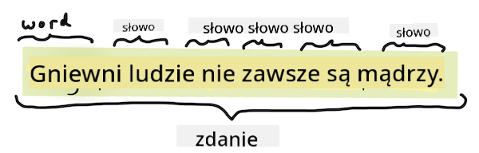
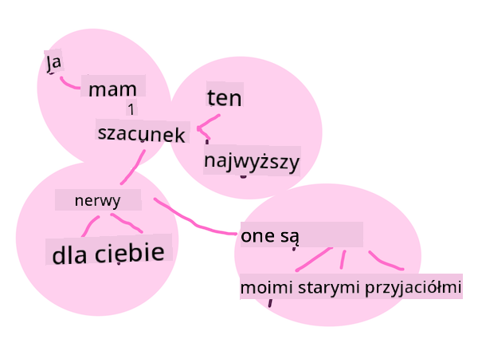
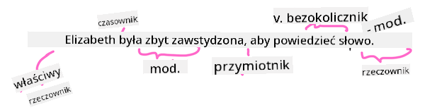

<!--
CO_OP_TRANSLATOR_METADATA:
{
  "original_hash": "6534e145d52a3890590d27be75386e5d",
  "translation_date": "2025-09-03T18:47:04+00:00",
  "source_file": "6-NLP/2-Tasks/README.md",
  "language_code": "pl"
}
-->
# Typowe zadania i techniki przetwarzania języka naturalnego

W większości zadań związanych z *przetwarzaniem języka naturalnego* tekst, który ma być przetworzony, musi zostać podzielony, przeanalizowany, a wyniki zapisane lub porównane z regułami i zestawami danych. Te zadania pozwalają programiście wyciągnąć _znaczenie_, _intencję_ lub jedynie _częstotliwość_ występowania terminów i słów w tekście.

## [Quiz przed wykładem](https://gray-sand-07a10f403.1.azurestaticapps.net/quiz/33/)

Poznajmy typowe techniki stosowane w przetwarzaniu tekstu. W połączeniu z uczeniem maszynowym techniki te pomagają efektywnie analizować duże ilości tekstu. Zanim jednak zastosujemy ML do tych zadań, zrozummy problemy, z którymi mierzy się specjalista NLP.

## Typowe zadania w NLP

Istnieje wiele sposobów analizy tekstu, nad którym pracujesz. Są zadania, które możesz wykonać, a dzięki nim możesz zrozumieć tekst i wyciągnąć wnioski. Zazwyczaj wykonujesz te zadania w określonej kolejności.

### Tokenizacja

Prawdopodobnie pierwszym krokiem większości algorytmów NLP jest podzielenie tekstu na tokeny, czyli słowa. Choć brzmi to prosto, uwzględnienie interpunkcji oraz różnych językowych granic słów i zdań może być trudne. Możesz potrzebować różnych metod, aby określić podziały.


> Tokenizacja zdania z **Dumy i uprzedzenia**. Infografika autorstwa [Jen Looper](https://twitter.com/jenlooper)

### Osadzenia (Embeddings)

[Osadzenia słów](https://wikipedia.org/wiki/Word_embedding) to sposób na numeryczne przekształcenie danych tekstowych. Osadzenia są tworzone w taki sposób, aby słowa o podobnym znaczeniu lub używane razem grupowały się w klastrach.


> "Mam najwyższy szacunek dla twoich nerwów, są moimi starymi przyjaciółmi." - Osadzenia słów dla zdania z **Dumy i uprzedzenia**. Infografika autorstwa [Jen Looper](https://twitter.com/jenlooper)

✅ Wypróbuj [to interesujące narzędzie](https://projector.tensorflow.org/), aby eksperymentować z osadzeniami słów. Kliknięcie na jedno słowo pokazuje klastry podobnych słów: 'zabawka' grupuje się z 'disney', 'lego', 'playstation' i 'konsola'.

### Parsowanie i Tagowanie Części Mowy

Każde słowo, które zostało podzielone na tokeny, może być oznaczone jako część mowy - rzeczownik, czasownik lub przymiotnik. Zdanie `szybki czerwony lis przeskoczył nad leniwym brązowym psem` może być oznaczone jako lis = rzeczownik, przeskoczył = czasownik.



> Parsowanie zdania z **Dumy i uprzedzenia**. Infografika autorstwa [Jen Looper](https://twitter.com/jenlooper)

Parsowanie polega na rozpoznawaniu, które słowa są ze sobą powiązane w zdaniu - na przykład `szybki czerwony lis przeskoczył` to sekwencja przymiotnik-rzeczownik-czasownik, która jest oddzielna od sekwencji `leniwy brązowy pies`.

### Częstotliwość słów i fraz

Przydatnym procesem podczas analizy dużej ilości tekstu jest stworzenie słownika wszystkich interesujących słów lub fraz oraz częstotliwości ich występowania. Fraza `szybki czerwony lis przeskoczył nad leniwym brązowym psem` ma częstotliwość występowania słowa "the" równą 2.

Przyjrzyjmy się przykładowemu tekstowi, w którym liczymy częstotliwość słów. Wiersz Rudyard Kiplinga "The Winners" zawiera następujący fragment:

```output
What the moral? Who rides may read.
When the night is thick and the tracks are blind
A friend at a pinch is a friend, indeed,
But a fool to wait for the laggard behind.
Down to Gehenna or up to the Throne,
He travels the fastest who travels alone.
```

Ponieważ częstotliwość fraz może być rozróżniana na wielkość liter, fraza `a friend` występuje 2 razy, `the` występuje 6 razy, a `travels` występuje 2 razy.

### N-gramy

Tekst można podzielić na sekwencje słów o określonej długości: jedno słowo (unigram), dwa słowa (bigramy), trzy słowa (trigramy) lub dowolną liczbę słów (n-gramy).

Na przykład `szybki czerwony lis przeskoczył nad leniwym brązowym psem` z wartością n-gramu równą 2 daje następujące n-gramy:

1. szybki czerwony  
2. czerwony lis  
3. lis przeskoczył  
4. przeskoczył nad  
5. nad leniwym  
6. leniwy brązowy  
7. brązowy pies  

Można to łatwiej zobrazować jako przesuwające się okno nad zdaniem. Oto przykład dla n-gramów o długości 3 słów, gdzie n-gram jest pogrubiony w każdym zdaniu:

1.   <u>**szybki czerwony lis**</u> przeskoczył nad leniwym brązowym psem  
2.   szybki **<u>czerwony lis przeskoczył</u>** nad leniwym brązowym psem  
3.   szybki czerwony **<u>lis przeskoczył nad</u>** leniwym brązowym psem  
4.   szybki czerwony lis **<u>przeskoczył nad leniwym</u>** brązowym psem  
5.   szybki czerwony lis przeskoczył **<u>nad leniwym brązowym</u>** psem  
6.   szybki czerwony lis przeskoczył nad **<u>leniwym brązowym psem</u>**


> Wartość n-gramu 3: Infografika autorstwa [Jen Looper](https://twitter.com/jenlooper)

### Ekstrakcja fraz rzeczownikowych

W większości zdań znajduje się rzeczownik, który jest podmiotem lub dopełnieniem zdania. W języku angielskim często można go zidentyfikować jako poprzedzony przez 'a', 'an' lub 'the'. Identyfikacja podmiotu lub dopełnienia zdania poprzez 'ekstrakcję frazy rzeczownikowej' jest częstym zadaniem w NLP, gdy próbuje się zrozumieć znaczenie zdania.

✅ W zdaniu "Nie mogę ustalić godziny, miejsca, wyglądu ani słów, które położyły fundament. To było zbyt dawno temu. Byłem w środku, zanim zdałem sobie sprawę, że zacząłem." Czy potrafisz zidentyfikować frazy rzeczownikowe?

W zdaniu `szybki czerwony lis przeskoczył nad leniwym brązowym psem` znajdują się 2 frazy rzeczownikowe: **szybki czerwony lis** i **leniwy brązowy pies**.

### Analiza sentymentu

Zdanie lub tekst można przeanalizować pod kątem sentymentu, czyli tego, jak *pozytywny* lub *negatywny* jest. Sentyment jest mierzony w *polaryzacji* oraz *obiektywności/subiektywności*. Polaryzacja jest mierzona od -1.0 do 1.0 (negatywna do pozytywnej) oraz od 0.0 do 1.0 (najbardziej obiektywna do najbardziej subiektywnej).

✅ Później dowiesz się, że istnieją różne sposoby określania sentymentu za pomocą uczenia maszynowego, ale jednym ze sposobów jest posiadanie listy słów i fraz, które są kategoryzowane jako pozytywne lub negatywne przez eksperta i zastosowanie tego modelu do tekstu w celu obliczenia wyniku polaryzacji. Czy widzisz, jak to mogłoby działać w niektórych okolicznościach, a w innych mniej?

### Odmiana

Odmiana pozwala na uzyskanie liczby pojedynczej lub mnogiej danego słowa.

### Lematyzacja

*Lematyzacja* to proces sprowadzania słowa do jego podstawowej formy, na przykład *poleciał*, *lata*, *latanie* mają lemat czasownika *latać*.

Dostępne są również przydatne bazy danych dla badaczy NLP, w tym:

### WordNet

[WordNet](https://wordnet.princeton.edu/) to baza danych słów, synonimów, antonimów i wielu innych szczegółów dla każdego słowa w wielu różnych językach. Jest niezwykle przydatna przy tworzeniu tłumaczeń, korektorów pisowni lub narzędzi językowych każdego rodzaju.

## Biblioteki NLP

Na szczęście nie musisz samodzielnie budować wszystkich tych technik, ponieważ dostępne są doskonałe biblioteki Python, które sprawiają, że NLP jest znacznie bardziej dostępne dla programistów, którzy nie specjalizują się w przetwarzaniu języka naturalnego ani uczeniu maszynowym. W kolejnych lekcjach znajdziesz więcej przykładów, ale tutaj poznasz kilka przydatnych przykładów, które pomogą Ci w następnym zadaniu.

### Ćwiczenie - korzystanie z biblioteki `TextBlob`

Użyjmy biblioteki TextBlob, ponieważ zawiera ona pomocne API do radzenia sobie z tego typu zadaniami. TextBlob "opiera się na potężnych fundamentach [NLTK](https://nltk.org) i [pattern](https://github.com/clips/pattern), i dobrze współpracuje z obiema."

> Uwaga: Przydatny [Przewodnik Szybkiego Startu](https://textblob.readthedocs.io/en/dev/quickstart.html#quickstart) jest dostępny dla TextBlob i jest zalecany dla doświadczonych programistów Python.

Podczas próby identyfikacji *frazy rzeczownikowej* TextBlob oferuje kilka opcji ekstraktorów do znajdowania fraz rzeczownikowych.

1. Przyjrzyj się `ConllExtractor`.

    ```python
    from textblob import TextBlob
    from textblob.np_extractors import ConllExtractor
    # import and create a Conll extractor to use later 
    extractor = ConllExtractor()
    
    # later when you need a noun phrase extractor:
    user_input = input("> ")
    user_input_blob = TextBlob(user_input, np_extractor=extractor)  # note non-default extractor specified
    np = user_input_blob.noun_phrases                                    
    ```

    > Co tu się dzieje? [ConllExtractor](https://textblob.readthedocs.io/en/dev/api_reference.html?highlight=Conll#textblob.en.np_extractors.ConllExtractor) to "Ekstraktor fraz rzeczownikowych, który wykorzystuje parsowanie chunków wytrenowane na korpusie treningowym ConLL-2000." ConLL-2000 odnosi się do Konferencji na temat Uczenia Naturalnego Języka z 2000 roku. Każdego roku konferencja organizowała warsztaty, aby rozwiązać trudny problem NLP, a w 2000 roku był to chunking fraz rzeczownikowych. Model został wytrenowany na Wall Street Journal, z "sekcjami 15-18 jako danymi treningowymi (211727 tokenów) i sekcją 20 jako danymi testowymi (47377 tokenów)". Możesz zapoznać się z procedurami użytymi [tutaj](https://www.clips.uantwerpen.be/conll2000/chunking/) oraz z [wynikami](https://ifarm.nl/erikt/research/np-chunking.html).

### Wyzwanie - ulepszanie swojego bota za pomocą NLP

W poprzedniej lekcji stworzyłeś bardzo prostego bota Q&A. Teraz sprawisz, że Marvin będzie trochę bardziej empatyczny, analizując Twoje dane wejściowe pod kątem sentymentu i drukując odpowiedź pasującą do sentymentu. Musisz również zidentyfikować `frazy rzeczownikowe` i zapytać o nie.

Twoje kroki przy budowaniu lepszego bota konwersacyjnego:

1. Wydrukuj instrukcje informujące użytkownika, jak wchodzić w interakcję z botem  
2. Rozpocznij pętlę  
   1. Przyjmij dane wejściowe od użytkownika  
   2. Jeśli użytkownik poprosi o zakończenie, zakończ  
   3. Przetwórz dane wejściowe użytkownika i określ odpowiednią odpowiedź na podstawie sentymentu  
   4. Jeśli w sentymencie zostanie wykryta fraza rzeczownikowa, zmień jej liczbę na mnogą i poproś o więcej danych na ten temat  
   5. Wydrukuj odpowiedź  
3. Wróć do kroku 2  

Oto fragment kodu do określania sentymentu za pomocą TextBlob. Zauważ, że istnieją tylko cztery *gradienty* odpowiedzi na sentyment (możesz mieć więcej, jeśli chcesz):

```python
if user_input_blob.polarity <= -0.5:
  response = "Oh dear, that sounds bad. "
elif user_input_blob.polarity <= 0:
  response = "Hmm, that's not great. "
elif user_input_blob.polarity <= 0.5:
  response = "Well, that sounds positive. "
elif user_input_blob.polarity <= 1:
  response = "Wow, that sounds great. "
```

Oto przykładowy wynik, który może Cię poprowadzić (dane wejściowe użytkownika są na liniach zaczynających się od >):

```output
Hello, I am Marvin, the friendly robot.
You can end this conversation at any time by typing 'bye'
After typing each answer, press 'enter'
How are you today?
> I am ok
Well, that sounds positive. Can you tell me more?
> I went for a walk and saw a lovely cat
Well, that sounds positive. Can you tell me more about lovely cats?
> cats are the best. But I also have a cool dog
Wow, that sounds great. Can you tell me more about cool dogs?
> I have an old hounddog but he is sick
Hmm, that's not great. Can you tell me more about old hounddogs?
> bye
It was nice talking to you, goodbye!
```

Jedno z możliwych rozwiązań zadania znajduje się [tutaj](https://github.com/microsoft/ML-For-Beginners/blob/main/6-NLP/2-Tasks/solution/bot.py)

✅ Sprawdź swoją wiedzę

1. Czy uważasz, że empatyczne odpowiedzi mogłyby 'oszukać' kogoś, aby uwierzył, że bot faktycznie go rozumie?  
2. Czy identyfikacja frazy rzeczownikowej sprawia, że bot jest bardziej 'wiarygodny'?  
3. Dlaczego ekstrakcja 'frazy rzeczownikowej' ze zdania jest przydatna?

---

Zaimplementuj bota z poprzedniego sprawdzania wiedzy i przetestuj go na znajomym. Czy potrafi ich oszukać? Czy możesz sprawić, że Twój bot będzie bardziej 'wiarygodny'?

## 🚀Wyzwanie

Wykonaj zadanie z poprzedniego sprawdzania wiedzy i spróbuj je zaimplementować. Przetestuj bota na znajomym. Czy potrafi ich oszukać? Czy możesz sprawić, że Twój bot będzie bardziej 'wiarygodny'?

## [Quiz po wykładzie](https://gray-sand-07a10f403.1.azurestaticapps.net/quiz/34/)

## Przegląd i samodzielna nauka

W kolejnych lekcjach dowiesz się więcej o analizie sentymentu. Zbadaj tę interesującą technikę w artykułach takich jak te na [KDNuggets](https://www.kdnuggets.com/tag/nlp)

## Zadanie 

[Spraw, aby bot odpowiadał](assignment.md)

---

**Zastrzeżenie**:  
Ten dokument został przetłumaczony za pomocą usługi tłumaczeniowej AI [Co-op Translator](https://github.com/Azure/co-op-translator). Chociaż dokładamy wszelkich starań, aby tłumaczenie było precyzyjne, prosimy pamiętać, że automatyczne tłumaczenia mogą zawierać błędy lub nieścisłości. Oryginalny dokument w jego rodzimym języku powinien być uznawany za wiarygodne źródło. W przypadku informacji o kluczowym znaczeniu zaleca się skorzystanie z profesjonalnego tłumaczenia wykonanego przez człowieka. Nie ponosimy odpowiedzialności za jakiekolwiek nieporozumienia lub błędne interpretacje wynikające z korzystania z tego tłumaczenia.