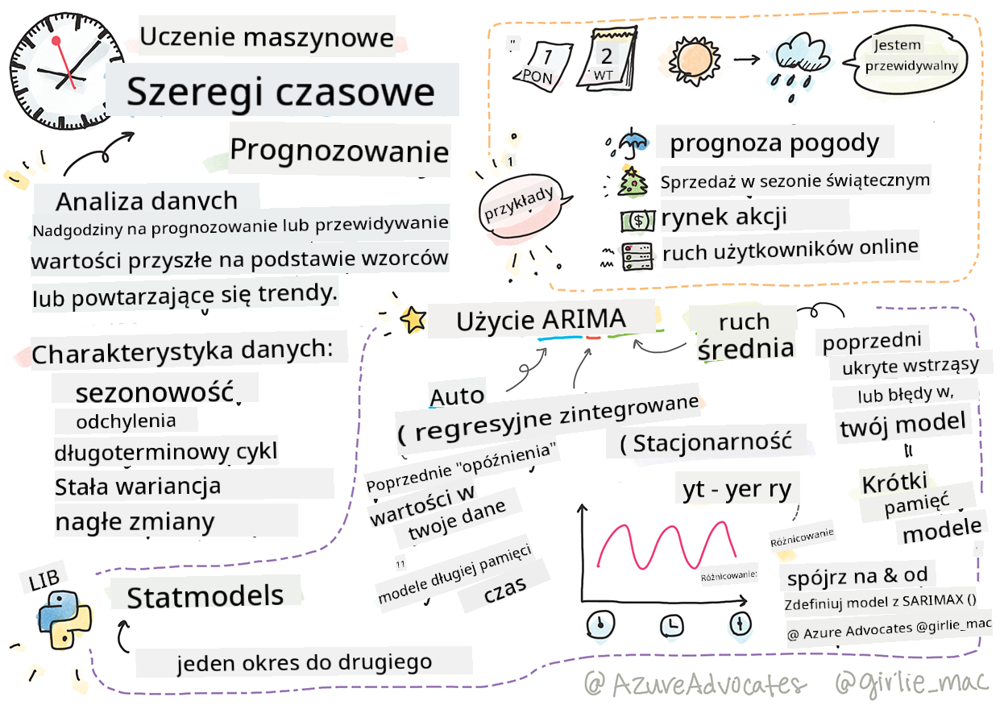
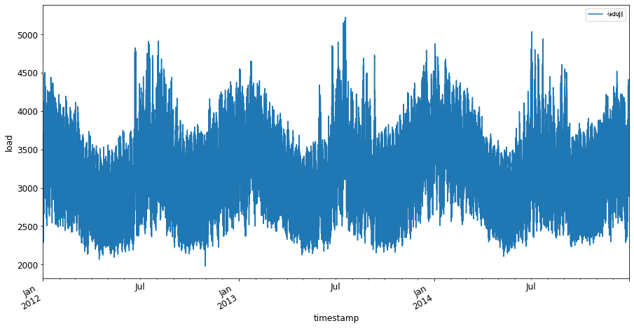
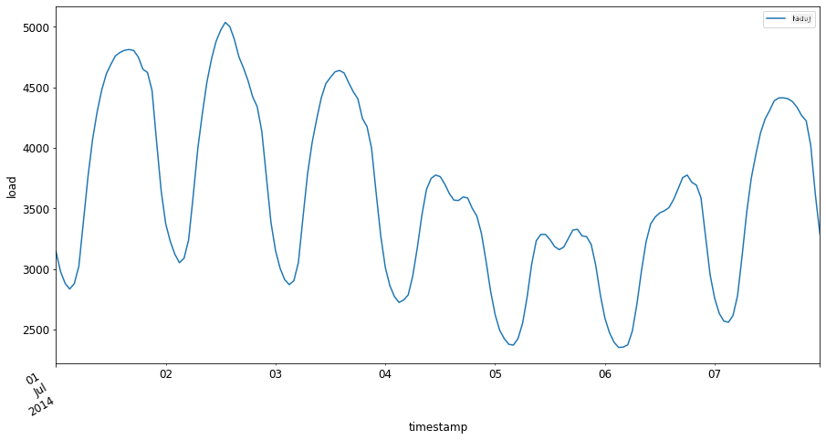

<!--
CO_OP_TRANSLATOR_METADATA:
{
  "original_hash": "3150d40f36a77857316ecaed5f31e856",
  "translation_date": "2025-09-03T16:53:25+00:00",
  "source_file": "7-TimeSeries/1-Introduction/README.md",
  "language_code": "pl"
}
-->
# Wprowadzenie do prognozowania szeregów czasowych



> Sketchnote autorstwa [Tomomi Imura](https://www.twitter.com/girlie_mac)

W tej lekcji oraz w kolejnej dowiesz się nieco o prognozowaniu szeregów czasowych, interesującej i wartościowej części repertuaru naukowca zajmującego się ML, która jest nieco mniej znana niż inne tematy. Prognozowanie szeregów czasowych to swego rodzaju „kryształowa kula”: na podstawie wcześniejszych wyników zmiennej, takiej jak cena, można przewidzieć jej potencjalną wartość w przyszłości.

[](https://youtu.be/cBojo1hsHiI "Wprowadzenie do prognozowania szeregów czasowych")

> 🎥 Kliknij obrazek powyżej, aby obejrzeć wideo o prognozowaniu szeregów czasowych

## [Quiz przed wykładem](https://gray-sand-07a10f403.1.azurestaticapps.net/quiz/41/)

To użyteczna i interesująca dziedzina o realnej wartości dla biznesu, biorąc pod uwagę jej bezpośrednie zastosowanie w problemach związanych z cenami, zapasami i łańcuchem dostaw. Chociaż techniki głębokiego uczenia zaczęły być wykorzystywane do uzyskiwania większej ilości informacji w celu lepszego przewidywania przyszłych wyników, prognozowanie szeregów czasowych pozostaje dziedziną w dużej mierze opartą na klasycznych technikach ML.

> Przydatny program nauczania dotyczący szeregów czasowych z Penn State znajdziesz [tutaj](https://online.stat.psu.edu/stat510/lesson/1)

## Wprowadzenie

Załóżmy, że zarządzasz siecią inteligentnych parkometrów, które dostarczają danych o tym, jak często i jak długo są używane w czasie.

> Co by było, gdybyś mógł przewidzieć, na podstawie wcześniejszych wyników parkometru, jego przyszłą wartość zgodnie z prawami podaży i popytu?

Dokładne przewidywanie, kiedy podjąć działania, aby osiągnąć swój cel, to wyzwanie, które można rozwiązać za pomocą prognozowania szeregów czasowych. Może nie uszczęśliwiłoby to ludzi, gdyby musieli płacić więcej w godzinach szczytu, szukając miejsca parkingowego, ale byłby to pewny sposób na generowanie dochodów na sprzątanie ulic!

Przyjrzyjmy się niektórym typom algorytmów szeregów czasowych i rozpocznijmy pracę z notebookiem, aby oczyścić i przygotować dane. Dane, które przeanalizujesz, pochodzą z konkursu prognozowania GEFCom2014. Składają się z 3 lat godzinowych wartości obciążenia elektrycznego i temperatury między 2012 a 2014 rokiem. Na podstawie historycznych wzorców obciążenia elektrycznego i temperatury możesz przewidzieć przyszłe wartości obciążenia elektrycznego.

W tym przykładzie nauczysz się prognozować jeden krok do przodu, korzystając wyłącznie z historycznych danych o obciążeniu. Zanim jednak zaczniesz, warto zrozumieć, co dzieje się „za kulisami”.

## Kilka definicji

Spotykając się z terminem „szeregi czasowe”, musisz zrozumieć jego zastosowanie w różnych kontekstach.

🎓 **Szeregi czasowe**

W matematyce „szereg czasowy to seria punktów danych indeksowanych (lub wymienionych lub przedstawionych na wykresie) w porządku czasowym. Najczęściej szereg czasowy to sekwencja mierzona w równych odstępach czasu”. Przykładem szeregu czasowego jest dzienna wartość zamknięcia [Dow Jones Industrial Average](https://wikipedia.org/wiki/Time_series). Wykorzystanie wykresów szeregów czasowych i modelowania statystycznego często spotyka się w przetwarzaniu sygnałów, prognozowaniu pogody, przewidywaniu trzęsień ziemi i innych dziedzinach, w których występują zdarzenia, a punkty danych można przedstawić w czasie.

🎓 **Analiza szeregów czasowych**

Analiza szeregów czasowych to analiza wspomnianych wyżej danych szeregów czasowych. Dane szeregów czasowych mogą przybierać różne formy, w tym „przerwane szeregi czasowe”, które wykrywają wzorce w ewolucji szeregu czasowego przed i po zdarzeniu przerywającym. Rodzaj analizy potrzebnej dla szeregu czasowego zależy od charakteru danych. Same dane szeregów czasowych mogą przybierać formę serii liczb lub znaków.

Analiza wykorzystuje różnorodne metody, w tym metody w dziedzinie częstotliwości i czasu, liniowe i nieliniowe oraz inne. [Dowiedz się więcej](https://www.itl.nist.gov/div898/handbook/pmc/section4/pmc4.htm) o różnych sposobach analizy tego typu danych.

🎓 **Prognozowanie szeregów czasowych**

Prognozowanie szeregów czasowych to wykorzystanie modelu do przewidywania przyszłych wartości na podstawie wzorców wykazywanych przez wcześniej zebrane dane. Chociaż możliwe jest wykorzystanie modeli regresji do analizy danych szeregów czasowych, gdzie indeksy czasowe są zmiennymi x na wykresie, takie dane najlepiej analizować za pomocą specjalnych typów modeli.

Dane szeregów czasowych to lista uporządkowanych obserwacji, w przeciwieństwie do danych, które można analizować za pomocą regresji liniowej. Najczęściej stosowanym modelem jest ARIMA, akronim oznaczający „Autoregressive Integrated Moving Average”.

[Modele ARIMA](https://online.stat.psu.edu/stat510/lesson/1/1.1) „odnoszą bieżącą wartość szeregu do wcześniejszych wartości i wcześniejszych błędów prognozy”. Są one najbardziej odpowiednie do analizy danych w dziedzinie czasu, gdzie dane są uporządkowane w czasie.

> Istnieje kilka typów modeli ARIMA, o których możesz dowiedzieć się [tutaj](https://people.duke.edu/~rnau/411arim.htm) i które omówisz w następnej lekcji.

W następnej lekcji zbudujesz model ARIMA, korzystając z [Jednowymiarowych szeregów czasowych](https://itl.nist.gov/div898/handbook/pmc/section4/pmc44.htm), które koncentrują się na jednej zmiennej zmieniającej swoją wartość w czasie. Przykładem tego typu danych jest [ten zbiór danych](https://itl.nist.gov/div898/handbook/pmc/section4/pmc4411.htm), który rejestruje miesięczne stężenie CO2 w obserwatorium Mauna Loa:

|  CO2   | YearMonth | Year  | Month |
| :----: | :-------: | :---: | :---: |
| 330.62 |  1975.04  | 1975  |   1   |
| 331.40 |  1975.13  | 1975  |   2   |
| 331.87 |  1975.21  | 1975  |   3   |
| 333.18 |  1975.29  | 1975  |   4   |
| 333.92 |  1975.38  | 1975  |   5   |
| 333.43 |  1975.46  | 1975  |   6   |
| 331.85 |  1975.54  | 1975  |   7   |
| 330.01 |  1975.63  | 1975  |   8   |
| 328.51 |  1975.71  | 1975  |   9   |
| 328.41 |  1975.79  | 1975  |  10   |
| 329.25 |  1975.88  | 1975  |  11   |
| 330.97 |  1975.96  | 1975  |  12   |

✅ Zidentyfikuj zmienną, która zmienia się w czasie w tym zbiorze danych.

## Charakterystyka danych szeregów czasowych, którą należy wziąć pod uwagę

Analizując dane szeregów czasowych, możesz zauważyć, że mają one [pewne cechy](https://online.stat.psu.edu/stat510/lesson/1/1.1), które należy uwzględnić i zniwelować, aby lepiej zrozumieć ich wzorce. Jeśli uznasz dane szeregów czasowych za potencjalne źródło „sygnału”, który chcesz przeanalizować, te cechy można uznać za „szum”. Często będziesz musiał zredukować ten „szum”, stosując pewne techniki statystyczne.

Oto kilka pojęć, które powinieneś znać, aby pracować z szeregami czasowymi:

🎓 **Trendy**

Trendy to mierzalne wzrosty i spadki w czasie. [Przeczytaj więcej](https://machinelearningmastery.com/time-series-trends-in-python). W kontekście szeregów czasowych chodzi o to, jak wykorzystać i, jeśli to konieczne, usunąć trendy z danych.

🎓 **[Sezonowość](https://machinelearningmastery.com/time-series-seasonality-with-python/)**

Sezonowość to okresowe wahania, takie jak na przykład wzrost sprzedaży w okresie świątecznym. [Zobacz](https://itl.nist.gov/div898/handbook/pmc/section4/pmc443.htm), jak różne typy wykresów pokazują sezonowość w danych.

🎓 **Wartości odstające**

Wartości odstające to punkty danych znacznie odbiegające od standardowej wariancji danych.

🎓 **Długoterminowe cykle**

Niezależnie od sezonowości, dane mogą wykazywać długoterminowe cykle, takie jak recesja gospodarcza trwająca dłużej niż rok.

🎓 **Stała wariancja**

Niektóre dane wykazują stałe wahania w czasie, na przykład zużycie energii w ciągu dnia i nocy.

🎓 **Nagłe zmiany**

Dane mogą wykazywać nagłe zmiany, które wymagają dalszej analizy. Na przykład nagłe zamknięcie firm z powodu COVID spowodowało zmiany w danych.

✅ Oto [przykładowy wykres szeregów czasowych](https://www.kaggle.com/kashnitsky/topic-9-part-1-time-series-analysis-in-python) pokazujący dzienne wydatki na walutę w grze na przestrzeni kilku lat. Czy potrafisz zidentyfikować któreś z wymienionych powyżej cech w tych danych?


## Ćwiczenie - rozpoczęcie pracy z danymi dotyczącymi zużycia energii

Rozpocznijmy tworzenie modelu szeregów czasowych, aby przewidzieć przyszłe zużycie energii na podstawie wcześniejszego zużycia.

> Dane w tym przykładzie pochodzą z konkursu prognozowania GEFCom2014. Składają się z 3 lat godzinowych wartości obciążenia elektrycznego i temperatury między 2012 a 2014 rokiem.
>
> Tao Hong, Pierre Pinson, Shu Fan, Hamidreza Zareipour, Alberto Troccoli i Rob J. Hyndman, „Probabilistic energy forecasting: Global Energy Forecasting Competition 2014 and beyond”, International Journal of Forecasting, vol.32, no.3, pp 896-913, lipiec-wrzesień, 2016.

1. W folderze `working` tej lekcji otwórz plik _notebook.ipynb_. Zacznij od dodania bibliotek, które pomogą Ci załadować i wizualizować dane:

    ```python
    import os
    import matplotlib.pyplot as plt
    from common.utils import load_data
    %matplotlib inline
    ```

    Zwróć uwagę, że korzystasz z plików z dołączonego folderu `common`, które konfigurują Twoje środowisko i obsługują pobieranie danych.

2. Następnie przeanalizuj dane jako ramkę danych, wywołując `load_data()` i `head()`:

    ```python
    data_dir = './data'
    energy = load_data(data_dir)[['load']]
    energy.head()
    ```

    Możesz zobaczyć, że istnieją dwie kolumny reprezentujące datę i obciążenie:

    |                     |  load  |
    | :-----------------: | :----: |
    | 2012-01-01 00:00:00 | 2698.0 |
    | 2012-01-01 01:00:00 | 2558.0 |
    | 2012-01-01 02:00:00 | 2444.0 |
    | 2012-01-01 03:00:00 | 2402.0 |
    | 2012-01-01 04:00:00 | 2403.0 |

3. Teraz narysuj wykres danych, wywołując `plot()`:

    ```python
    energy.plot(y='load', subplots=True, figsize=(15, 8), fontsize=12)
    plt.xlabel('timestamp', fontsize=12)
    plt.ylabel('load', fontsize=12)
    plt.show()
    ```

    

4. Teraz narysuj wykres dla pierwszego tygodnia lipca 2014 roku, podając go jako dane wejściowe do `energy` w formacie `[od daty]: [do daty]`:

    ```python
    energy['2014-07-01':'2014-07-07'].plot(y='load', subplots=True, figsize=(15, 8), fontsize=12)
    plt.xlabel('timestamp', fontsize=12)
    plt.ylabel('load', fontsize=12)
    plt.show()
    ```

    

    Piękny wykres! Przyjrzyj się tym wykresom i zobacz, czy możesz zidentyfikować któreś z wymienionych powyżej cech. Co możemy wywnioskować, wizualizując dane?

W następnej lekcji stworzysz model ARIMA, aby wygenerować prognozy.

---

## 🚀Wyzwanie

Zrób listę wszystkich branż i obszarów badań, które Twoim zdaniem mogłyby skorzystać z prognozowania szeregów czasowych. Czy potrafisz wymyślić zastosowanie tych technik w sztuce? W ekonometrii? Ekologii? Handlu detalicznym? Przemyśle? Finansach? Gdzie jeszcze?

## [Quiz po wykładzie](https://gray-sand-07a10f403.1.azurestaticapps.net/quiz/42/)

## Przegląd i samodzielna nauka

Chociaż nie omówimy ich tutaj, sieci neuronowe są czasami wykorzystywane do ulepszania klasycznych metod prognozowania szeregów czasowych. Przeczytaj więcej na ten temat [w tym artykule](https://medium.com/microsoftazure/neural-networks-for-forecasting-financial-and-economic-time-series-6aca370ff412).

## Zadanie

[Zwizualizuj więcej szeregów czasowych](assignment.md)

---

**Zastrzeżenie**:  
Ten dokument został przetłumaczony za pomocą usługi tłumaczenia AI [Co-op Translator](https://github.com/Azure/co-op-translator). Chociaż dokładamy wszelkich starań, aby tłumaczenie było precyzyjne, prosimy pamiętać, że automatyczne tłumaczenia mogą zawierać błędy lub nieścisłości. Oryginalny dokument w jego rodzimym języku powinien być uznawany za źródło autorytatywne. W przypadku informacji o kluczowym znaczeniu zaleca się skorzystanie z profesjonalnego tłumaczenia przez człowieka. Nie ponosimy odpowiedzialności za jakiekolwiek nieporozumienia lub błędne interpretacje wynikające z użycia tego tłumaczenia.