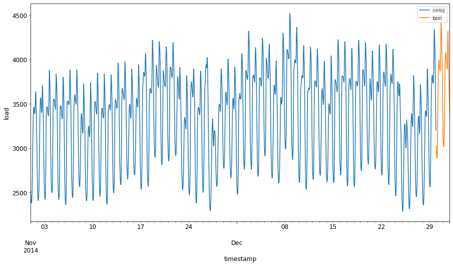
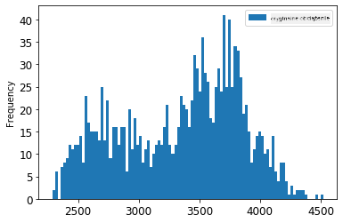

<!--
CO_OP_TRANSLATOR_METADATA:
{
  "original_hash": "2f400075e003e749fdb0d6b3b4787a99",
  "translation_date": "2025-09-03T16:47:35+00:00",
  "source_file": "7-TimeSeries/2-ARIMA/README.md",
  "language_code": "pl"
}
-->
# Prognozowanie szeregów czasowych za pomocą ARIMA

W poprzedniej lekcji dowiedziałeś się trochę o prognozowaniu szeregów czasowych i załadowałeś zestaw danych pokazujący wahania obciążenia elektrycznego w określonym okresie czasu.

[](https://youtu.be/IUSk-YDau10 "Wprowadzenie do ARIMA")

> 🎥 Kliknij obrazek powyżej, aby obejrzeć wideo: Krótkie wprowadzenie do modeli ARIMA. Przykład jest wykonany w R, ale koncepcje są uniwersalne.

## [Quiz przed lekcją](https://gray-sand-07a10f403.1.azurestaticapps.net/quiz/43/)

## Wprowadzenie

W tej lekcji odkryjesz konkretny sposób budowania modeli za pomocą [ARIMA: *A*uto*R*egressive *I*ntegrated *M*oving *A*verage](https://wikipedia.org/wiki/Autoregressive_integrated_moving_average). Modele ARIMA są szczególnie dobrze dopasowane do danych wykazujących [niestacjonarność](https://wikipedia.org/wiki/Stationary_process).

## Podstawowe koncepcje

Aby móc pracować z ARIMA, musisz znać kilka kluczowych pojęć:

- 🎓 **Stacjonarność**. W kontekście statystycznym stacjonarność odnosi się do danych, których rozkład nie zmienia się w czasie. Dane niestacjonarne wykazują wahania wynikające z trendów, które muszą zostać przekształcone, aby można je było analizować. Na przykład sezonowość może wprowadzać wahania w danych i może zostać wyeliminowana poprzez proces różnicowania sezonowego.

- 🎓 **[Różnicowanie](https://wikipedia.org/wiki/Autoregressive_integrated_moving_average#Differencing)**. Różnicowanie danych, w kontekście statystycznym, odnosi się do procesu przekształcania danych niestacjonarnych w dane stacjonarne poprzez usunięcie ich niestałego trendu. "Różnicowanie usuwa zmiany poziomu szeregu czasowego, eliminując trend i sezonowość, a tym samym stabilizując średnią szeregu czasowego." [Artykuł Shixiong et al](https://arxiv.org/abs/1904.07632)

## ARIMA w kontekście szeregów czasowych

Rozłóżmy części ARIMA, aby lepiej zrozumieć, jak pomaga nam modelować szeregi czasowe i dokonywać prognoz.

- **AR - AutoRegressive**. Modele autoregresyjne, jak sama nazwa wskazuje, patrzą "wstecz" w czasie, aby analizować wcześniejsze wartości w danych i wyciągać wnioski na ich podstawie. Te wcześniejsze wartości nazywane są "lagami". Przykładem mogą być dane pokazujące miesięczną sprzedaż ołówków. Całkowita sprzedaż w każdym miesiącu byłaby traktowana jako "zmienna ewoluująca" w zestawie danych. Model ten jest budowany w taki sposób, że "zmienna ewoluująca jest regresowana na swoje wcześniejsze wartości (tzw. lagowane)." [wikipedia](https://wikipedia.org/wiki/Autoregressive_integrated_moving_average)

- **I - Integrated**. W przeciwieństwie do podobnych modeli 'ARMA', 'I' w ARIMA odnosi się do jego aspektu *[zintegrowanego](https://wikipedia.org/wiki/Order_of_integration)*. Dane są "zintegrowane", gdy zastosowane zostaną kroki różnicowania w celu wyeliminowania niestacjonarności.

- **MA - Moving Average**. Aspekt [średniej ruchomej](https://wikipedia.org/wiki/Moving-average_model) w tym modelu odnosi się do zmiennej wyjściowej, która jest określana na podstawie obserwacji bieżących i wcześniejszych wartości lagów.

Podsumowanie: ARIMA jest używana do dopasowania modelu do specyficznej formy danych szeregów czasowych tak dokładnie, jak to możliwe.

## Ćwiczenie - budowa modelu ARIMA

Otwórz folder [_/working_](https://github.com/microsoft/ML-For-Beginners/tree/main/7-TimeSeries/2-ARIMA/working) w tej lekcji i znajdź plik [_notebook.ipynb_](https://github.com/microsoft/ML-For-Beginners/blob/main/7-TimeSeries/2-ARIMA/working/notebook.ipynb).

1. Uruchom notebook, aby załadować bibliotekę Python `statsmodels`; będzie ona potrzebna do modeli ARIMA.

1. Załaduj niezbędne biblioteki.

1. Następnie załaduj kilka dodatkowych bibliotek przydatnych do wizualizacji danych:

    ```python
    import os
    import warnings
    import matplotlib.pyplot as plt
    import numpy as np
    import pandas as pd
    import datetime as dt
    import math

    from pandas.plotting import autocorrelation_plot
    from statsmodels.tsa.statespace.sarimax import SARIMAX
    from sklearn.preprocessing import MinMaxScaler
    from common.utils import load_data, mape
    from IPython.display import Image

    %matplotlib inline
    pd.options.display.float_format = '{:,.2f}'.format
    np.set_printoptions(precision=2)
    warnings.filterwarnings("ignore") # specify to ignore warning messages
    ```

1. Załaduj dane z pliku `/data/energy.csv` do ramki danych Pandas i przyjrzyj się im:

    ```python
    energy = load_data('./data')[['load']]
    energy.head(10)
    ```

1. Zobrazuj wszystkie dostępne dane dotyczące energii od stycznia 2012 do grudnia 2014. Nie powinno być niespodzianek, ponieważ widzieliśmy te dane w poprzedniej lekcji:

    ```python
    energy.plot(y='load', subplots=True, figsize=(15, 8), fontsize=12)
    plt.xlabel('timestamp', fontsize=12)
    plt.ylabel('load', fontsize=12)
    plt.show()
    ```

    Teraz zbudujmy model!

### Tworzenie zbiorów danych treningowych i testowych

Po załadowaniu danych możesz podzielić je na zbiory treningowe i testowe. Model będzie trenowany na zbiorze treningowym. Jak zwykle, po zakończeniu treningu modelu, jego dokładność zostanie oceniona na podstawie zbioru testowego. Musisz upewnić się, że zbiór testowy obejmuje późniejszy okres czasu niż zbiór treningowy, aby model nie uzyskał informacji z przyszłych okresów czasu.

1. Przypisz dwumiesięczny okres od 1 września do 31 października 2014 roku do zbioru treningowego. Zbiór testowy będzie obejmował dwumiesięczny okres od 1 listopada do 31 grudnia 2014 roku:

    ```python
    train_start_dt = '2014-11-01 00:00:00'
    test_start_dt = '2014-12-30 00:00:00'
    ```

    Ponieważ dane odzwierciedlają dzienne zużycie energii, istnieje silny wzorzec sezonowy, ale zużycie jest najbardziej podobne do zużycia w bardziej aktualnych dniach.

1. Zobrazuj różnice:

    ```python
    energy[(energy.index < test_start_dt) & (energy.index >= train_start_dt)][['load']].rename(columns={'load':'train'}) \
        .join(energy[test_start_dt:][['load']].rename(columns={'load':'test'}), how='outer') \
        .plot(y=['train', 'test'], figsize=(15, 8), fontsize=12)
    plt.xlabel('timestamp', fontsize=12)
    plt.ylabel('load', fontsize=12)
    plt.show()
    ```

    

    Dlatego użycie stosunkowo małego okna czasowego do trenowania danych powinno być wystarczające.

    > Uwaga: Ponieważ funkcja, której używamy do dopasowania modelu ARIMA, wykorzystuje walidację wewnętrzną podczas dopasowywania, pominiemy dane walidacyjne.

### Przygotowanie danych do treningu

Teraz musisz przygotować dane do treningu, wykonując filtrowanie i skalowanie danych. Przefiltruj swój zestaw danych, aby uwzględnić tylko potrzebne okresy czasowe i kolumny, oraz przeskaluj dane, aby upewnić się, że są one przedstawione w przedziale 0,1.

1. Przefiltruj oryginalny zestaw danych, aby uwzględnić tylko wspomniane okresy czasowe dla każdego zbioru oraz tylko potrzebną kolumnę 'load' plus datę:

    ```python
    train = energy.copy()[(energy.index >= train_start_dt) & (energy.index < test_start_dt)][['load']]
    test = energy.copy()[energy.index >= test_start_dt][['load']]

    print('Training data shape: ', train.shape)
    print('Test data shape: ', test.shape)
    ```

    Możesz zobaczyć kształt danych:

    ```output
    Training data shape:  (1416, 1)
    Test data shape:  (48, 1)
    ```

1. Przeskaluj dane, aby znajdowały się w przedziale (0, 1).

    ```python
    scaler = MinMaxScaler()
    train['load'] = scaler.fit_transform(train)
    train.head(10)
    ```

1. Zobrazuj dane oryginalne vs. przeskalowane:

    ```python
    energy[(energy.index >= train_start_dt) & (energy.index < test_start_dt)][['load']].rename(columns={'load':'original load'}).plot.hist(bins=100, fontsize=12)
    train.rename(columns={'load':'scaled load'}).plot.hist(bins=100, fontsize=12)
    plt.show()
    ```

    

    > Dane oryginalne

    

    > Dane przeskalowane

1. Teraz, gdy skalibrowałeś dane przeskalowane, możesz przeskalować dane testowe:

    ```python
    test['load'] = scaler.transform(test)
    test.head()
    ```

### Implementacja ARIMA

Czas zaimplementować ARIMA! Teraz użyjesz biblioteki `statsmodels`, którą zainstalowałeś wcześniej.

Musisz teraz wykonać kilka kroków:

   1. Zdefiniuj model, wywołując `SARIMAX()` i przekazując parametry modelu: parametry p, d i q oraz parametry P, D i Q.
   2. Przygotuj model do danych treningowych, wywołując funkcję `fit()`.
   3. Dokonaj prognoz, wywołując funkcję `forecast()` i określając liczbę kroków (tzw. `horyzont`) do prognozowania.

> 🎓 Do czego służą te wszystkie parametry? W modelu ARIMA istnieją 3 parametry, które pomagają modelować główne aspekty szeregu czasowego: sezonowość, trend i szum. Te parametry to:

`p`: parametr związany z aspektem autoregresyjnym modelu, który uwzględnia *przeszłe* wartości.  
`d`: parametr związany z zintegrowaną częścią modelu, który wpływa na ilość *różnicowania* (🎓 pamiętasz różnicowanie 👆?) stosowanego do szeregu czasowego.  
`q`: parametr związany z częścią modelu dotyczącą średniej ruchomej.

> Uwaga: Jeśli Twoje dane mają aspekt sezonowy - a te dane go mają - używamy sezonowego modelu ARIMA (SARIMA). W takim przypadku musisz użyć innego zestawu parametrów: `P`, `D` i `Q`, które opisują te same powiązania co `p`, `d` i `q`, ale odpowiadają sezonowym komponentom modelu.

1. Zacznij od ustawienia preferowanej wartości horyzontu. Spróbujmy 3 godziny:

    ```python
    # Specify the number of steps to forecast ahead
    HORIZON = 3
    print('Forecasting horizon:', HORIZON, 'hours')
    ```

    Wybór najlepszych wartości dla parametrów modelu ARIMA może być trudny, ponieważ jest to częściowo subiektywne i czasochłonne. Możesz rozważyć użycie funkcji `auto_arima()` z biblioteki [`pyramid`](https://alkaline-ml.com/pmdarima/0.9.0/modules/generated/pyramid.arima.auto_arima.html).

1. Na razie spróbuj ręcznie wybrać wartości, aby znaleźć dobry model.

    ```python
    order = (4, 1, 0)
    seasonal_order = (1, 1, 0, 24)

    model = SARIMAX(endog=train, order=order, seasonal_order=seasonal_order)
    results = model.fit()

    print(results.summary())
    ```

    Zostanie wydrukowana tabela wyników.

Zbudowałeś swój pierwszy model! Teraz musimy znaleźć sposób na jego ocenę.

### Ocena modelu

Aby ocenić model, możesz przeprowadzić tzw. walidację `walk forward`. W praktyce modele szeregów czasowych są ponownie trenowane za każdym razem, gdy dostępne są nowe dane. Pozwala to modelowi na dokonanie najlepszej prognozy na każdym kroku czasowym.

Rozpoczynając od początku szeregu czasowego, używając tej techniki, trenuj model na zbiorze danych treningowych. Następnie dokonaj prognozy na kolejny krok czasowy. Prognoza jest oceniana w stosunku do znanej wartości. Zbiór treningowy jest następnie rozszerzany o znaną wartość, a proces jest powtarzany.

> Uwaga: Powinieneś utrzymać stałe okno zbioru treningowego dla bardziej efektywnego treningu, tak aby za każdym razem, gdy dodajesz nową obserwację do zbioru treningowego, usuwasz obserwację z początku zbioru.

Ten proces zapewnia bardziej solidne oszacowanie, jak model będzie działał w praktyce. Jednak wiąże się to z kosztem obliczeniowym tworzenia tak wielu modeli. Jest to akceptowalne, jeśli dane są małe lub model jest prosty, ale może stanowić problem na dużą skalę.

Walidacja walk-forward jest złotym standardem oceny modeli szeregów czasowych i jest zalecana w Twoich projektach.

1. Najpierw utwórz punkt danych testowych dla każdego kroku HORIZON.

    ```python
    test_shifted = test.copy()

    for t in range(1, HORIZON+1):
        test_shifted['load+'+str(t)] = test_shifted['load'].shift(-t, freq='H')

    test_shifted = test_shifted.dropna(how='any')
    test_shifted.head(5)
    ```

    |            |          | load | load+1 | load+2 |
    | ---------- | -------- | ---- | ------ | ------ |
    | 2014-12-30 | 00:00:00 | 0.33 | 0.29   | 0.27   |
    | 2014-12-30 | 01:00:00 | 0.29 | 0.27   | 0.27   |
    | 2014-12-30 | 02:00:00 | 0.27 | 0.27   | 0.30   |
    | 2014-12-30 | 03:00:00 | 0.27 | 0.30   | 0.41   |
    | 2014-12-30 | 04:00:00 | 0.30 | 0.41   | 0.57   |

    Dane są przesunięte poziomo zgodnie z punktem horyzontu.

1. Dokonaj prognoz na danych testowych, używając tego podejścia przesuwającego okno w pętli o długości zbioru testowego:

    ```python
    %%time
    training_window = 720 # dedicate 30 days (720 hours) for training

    train_ts = train['load']
    test_ts = test_shifted

    history = [x for x in train_ts]
    history = history[(-training_window):]

    predictions = list()

    order = (2, 1, 0)
    seasonal_order = (1, 1, 0, 24)

    for t in range(test_ts.shape[0]):
        model = SARIMAX(endog=history, order=order, seasonal_order=seasonal_order)
        model_fit = model.fit()
        yhat = model_fit.forecast(steps = HORIZON)
        predictions.append(yhat)
        obs = list(test_ts.iloc[t])
        # move the training window
        history.append(obs[0])
        history.pop(0)
        print(test_ts.index[t])
        print(t+1, ': predicted =', yhat, 'expected =', obs)
    ```

    Możesz obserwować proces treningu:

    ```output
    2014-12-30 00:00:00
    1 : predicted = [0.32 0.29 0.28] expected = [0.32945389435989236, 0.2900626678603402, 0.2739480752014323]

    2014-12-30 01:00:00
    2 : predicted = [0.3  0.29 0.3 ] expected = [0.2900626678603402, 0.2739480752014323, 0.26812891674127126]

    2014-12-30 02:00:00
    3 : predicted = [0.27 0.28 0.32] expected = [0.2739480752014323, 0.26812891674127126, 0.3025962399283795]
    ```

1. Porównaj prognozy z rzeczywistym obciążeniem:

    ```python
    eval_df = pd.DataFrame(predictions, columns=['t+'+str(t) for t in range(1, HORIZON+1)])
    eval_df['timestamp'] = test.index[0:len(test.index)-HORIZON+1]
    eval_df = pd.melt(eval_df, id_vars='timestamp', value_name='prediction', var_name='h')
    eval_df['actual'] = np.array(np.transpose(test_ts)).ravel()
    eval_df[['prediction', 'actual']] = scaler.inverse_transform(eval_df[['prediction', 'actual']])
    eval_df.head()
    ```

    Wynik
    |     |            | timestamp | h   | prediction | actual   |
    | --- | ---------- | --------- | --- | ---------- | -------- |
    | 0   | 2014-12-30 | 00:00:00  | t+1 | 3,008.74   | 3,023.00 |
    | 1   | 2014-12-30 | 01:00:00  | t+1 | 2,955.53   | 2,935.00 |
    | 2   | 2014-12-30 | 02:00:00  | t+1 | 2,900.17   | 2,899.00 |
    | 3   | 2014-12-30 | 03:00:00  | t+1 | 2,917.69   | 2,886.00 |
    | 4   | 2014-12-30 | 04:00:00  | t+1 | 2,946.99   | 2,963.00 |

    Obserwuj prognozy danych godzinowych w porównaniu do rzeczywistego obciążenia. Jak dokładne są te prognozy?

### Sprawdź dokładność modelu

Sprawdź dokładność swojego modelu, testując jego średni absolutny błąd procentowy (MAPE) dla wszystkich prognoz.
> **🧮 Pokaż mi matematykę**
>
> 
>
> [MAPE](https://www.linkedin.com/pulse/what-mape-mad-msd-time-series-allameh-statistics/) jest używany do przedstawienia dokładności prognozy jako stosunku zdefiniowanego przez powyższy wzór. Różnica między rzeczywistą a przewidywaną wartością jest dzielona przez wartość rzeczywistą. "Wartość bezwzględna w tym obliczeniu jest sumowana dla każdego prognozowanego punktu w czasie i dzielona przez liczbę dopasowanych punktów n." [wikipedia](https://wikipedia.org/wiki/Mean_absolute_percentage_error)
1. Wyraź równanie w kodzie:

    ```python
    if(HORIZON > 1):
        eval_df['APE'] = (eval_df['prediction'] - eval_df['actual']).abs() / eval_df['actual']
        print(eval_df.groupby('h')['APE'].mean())
    ```

1. Oblicz MAPE dla jednego kroku:

    ```python
    print('One step forecast MAPE: ', (mape(eval_df[eval_df['h'] == 't+1']['prediction'], eval_df[eval_df['h'] == 't+1']['actual']))*100, '%')
    ```

    MAPE prognozy dla jednego kroku:  0.5570581332313952 %

1. Wyświetl MAPE prognozy wielokrokowej:

    ```python
    print('Multi-step forecast MAPE: ', mape(eval_df['prediction'], eval_df['actual'])*100, '%')
    ```

    ```output
    Multi-step forecast MAPE:  1.1460048657704118 %
    ```

    Najlepiej, gdy wartość jest niska: pamiętaj, że prognoza z MAPE równym 10 oznacza, że jest ona o 10% niedokładna.

1. Ale jak zawsze, łatwiej jest zobaczyć tego rodzaju miarę dokładności wizualnie, więc zróbmy wykres:

    ```python
     if(HORIZON == 1):
        ## Plotting single step forecast
        eval_df.plot(x='timestamp', y=['actual', 'prediction'], style=['r', 'b'], figsize=(15, 8))

    else:
        ## Plotting multi step forecast
        plot_df = eval_df[(eval_df.h=='t+1')][['timestamp', 'actual']]
        for t in range(1, HORIZON+1):
            plot_df['t+'+str(t)] = eval_df[(eval_df.h=='t+'+str(t))]['prediction'].values

        fig = plt.figure(figsize=(15, 8))
        ax = plt.plot(plot_df['timestamp'], plot_df['actual'], color='red', linewidth=4.0)
        ax = fig.add_subplot(111)
        for t in range(1, HORIZON+1):
            x = plot_df['timestamp'][(t-1):]
            y = plot_df['t+'+str(t)][0:len(x)]
            ax.plot(x, y, color='blue', linewidth=4*math.pow(.9,t), alpha=math.pow(0.8,t))

        ax.legend(loc='best')

    plt.xlabel('timestamp', fontsize=12)
    plt.ylabel('load', fontsize=12)
    plt.show()
    ```

    

 🏆 Bardzo ładny wykres, pokazujący model o dobrej dokładności. Świetna robota!

---

## 🚀Wyzwanie

Zgłęb sposoby testowania dokładności modelu szeregów czasowych. W tej lekcji omawiamy MAPE, ale czy istnieją inne metody, które możesz wykorzystać? Zbadaj je i opisz. Pomocny dokument znajdziesz [tutaj](https://otexts.com/fpp2/accuracy.html)

## [Quiz po lekcji](https://gray-sand-07a10f403.1.azurestaticapps.net/quiz/44/)

## Przegląd i samodzielna nauka

Ta lekcja dotyczy jedynie podstaw prognozowania szeregów czasowych za pomocą ARIMA. Poświęć trochę czasu na pogłębienie swojej wiedzy, przeglądając [to repozytorium](https://microsoft.github.io/forecasting/) i różne typy modeli, aby poznać inne sposoby budowania modeli szeregów czasowych.

## Zadanie

[Nowy model ARIMA](assignment.md)

---

**Zastrzeżenie**:  
Ten dokument został przetłumaczony za pomocą usługi tłumaczenia AI [Co-op Translator](https://github.com/Azure/co-op-translator). Chociaż dokładamy wszelkich starań, aby tłumaczenie było precyzyjne, prosimy pamiętać, że automatyczne tłumaczenia mogą zawierać błędy lub nieścisłości. Oryginalny dokument w jego rodzimym języku powinien być uznawany za autorytatywne źródło. W przypadku informacji o kluczowym znaczeniu zaleca się skorzystanie z profesjonalnego tłumaczenia przez człowieka. Nie ponosimy odpowiedzialności za jakiekolwiek nieporozumienia lub błędne interpretacje wynikające z korzystania z tego tłumaczenia.